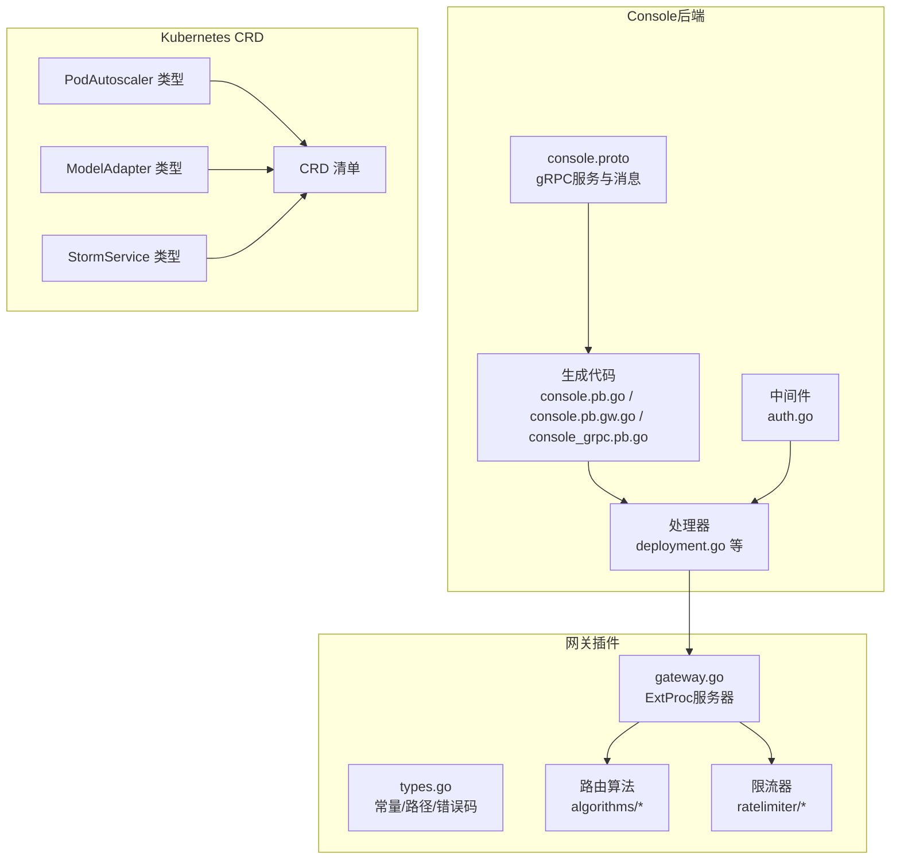
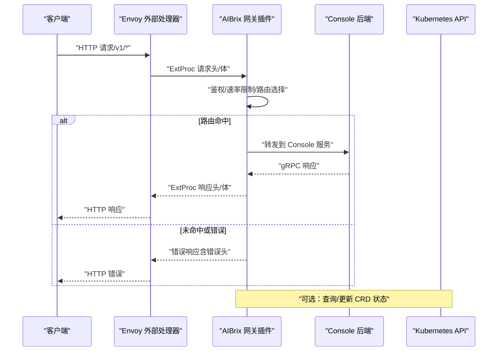
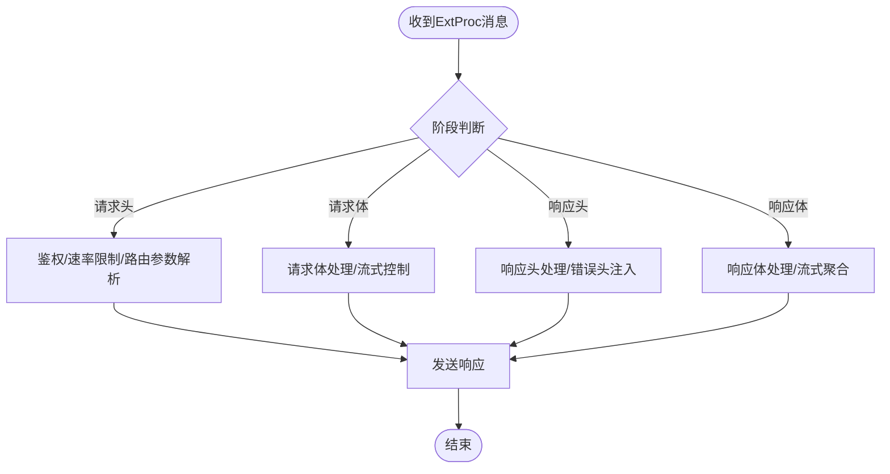
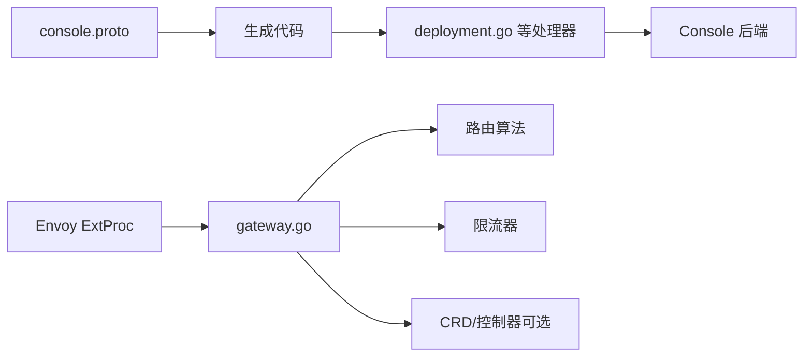

# API参考

<cite>
**本文引用的文件**
- [README.md](file://README.md)
- [console.proto](file://apps/console/api/proto/console/v1/console.proto)
- [deployment.go](file://apps/console/api/handler/deployment.go)
- [auth.go](file://apps/console/api/middleware/auth.go)
- [gateway.go](file://pkg/plugins/gateway/gateway.go)
- [types.go](file://pkg/plugins/gateway/types.go)
- [podautoscaler_types.go](file://api/autoscaling/v1alpha1/podautoscaler_types.go)
- [modeladapter_types.go](file://api/model/v1alpha1/modeladapter_types.go)
- [stormservice_types.go](file://api/orchestration/v1alpha1/stormservice_types.go)
- [podautoscalers.yaml](file://config/crd/autoscaling/autoscaling.aibrix.ai_podautoscalers.yaml)
</cite>

## 目录
1. [简介](#简介)
2. [项目结构](#项目结构)
3. [核心组件](#核心组件)
4. [架构总览](#架构总览)
5. [详细组件分析](#详细组件分析)
6. [依赖关系分析](#依赖关系分析)
7. [性能考量](#性能考量)
8. [故障排查指南](#故障排查指南)
9. [结论](#结论)
10. [附录](#附录)

## 简介
本参考文档面向AIBrix的API与插件体系，覆盖以下方面：
- REST/gRPC API：Console后端的gRPC-HTTP网关接口、请求/响应模型、认证方式与错误码。
- Kubernetes CRD API：自动伸缩、模型适配器、编排服务等自定义资源的字段定义、验证规则、状态与生命周期。
- 网关插件API：基于Envoy扩展处理器（ExtProc）的路由算法扩展点、请求/响应处理钩子、速率限制与头部约定。
- 使用示例、错误处理策略、性能优化建议与向后兼容性说明。

## 项目结构
AIBrix采用多模块组织，核心API相关模块如下：
- Console后端（gRPC/HTTP）：proto定义、生成代码、处理器与中间件。
- 网关插件（Envoy ExtProc）：路由算法、限流、请求/响应处理、指标与错误头。
- Kubernetes CRD：autoscaling、model、orchestration三组API类型及CRD清单。
- 配置与部署：Kustomize配置、RBAC、Webhook、依赖组件等。

**图表来源**
- [console.proto:28-53](file://apps/console/api/proto/console/v1/console.proto#L28-L53)
- [deployment.go:27-57](file://apps/console/api/handler/deployment.go#L27-L57)
- [auth.go](file://apps/console/api/middleware/auth.go)
- [gateway.go:118-121](file://pkg/plugins/gateway/gateway.go#L118-L121)
- [types.go:24-116](file://pkg/plugins/gateway/types.go#L24-L116)
- [podautoscaler_types.go:42-198](file://api/autoscaling/v1alpha1/podautoscaler_types.go#L42-L198)
- [modeladapter_types.go:26-116](file://api/model/v1alpha1/modeladapter_types.go#L26-L116)
- [stormservice_types.go:24-134](file://api/orchestration/v1alpha1/stormservice_types.go#L24-L134)
- [podautoscalers.yaml:34-193](file://config/crd/autoscaling/autoscaling.aibrix.ai_podautoscalers.yaml#L34-L193)

**章节来源**
- [README.md:1-90](file://README.md#L1-L90)

## 核心组件
- Console gRPC/HTTP API：提供部署、作业、模型、模板、密钥、配额等服务，通过Google API注解映射到REST风格路径。
- 网关插件（Envoy ExtProc）：实现请求头/体、响应头/体的处理流水线，支持多种路由算法、速率限制、会话亲和、错误头透传与指标上报。
- Kubernetes CRD：以CRD形式暴露PodAutoscaler、ModelAdapter、StormService等资源，定义字段、验证与状态机。

**章节来源**
- [console.proto:28-672](file://apps/console/api/proto/console/v1/console.proto#L28-L672)
- [gateway.go:118-121](file://pkg/plugins/gateway/gateway.go#L118-L121)
- [types.go:24-116](file://pkg/plugins/gateway/types.go#L24-L116)
- [podautoscaler_types.go:42-198](file://api/autoscaling/v1alpha1/podautoscaler_types.go#L42-L198)
- [modeladapter_types.go:26-116](file://api/model/v1alpha1/modeladapter_types.go#L26-L116)
- [stormservice_types.go:24-134](file://api/orchestration/v1alpha1/stormservice_types.go#L24-L134)

## 架构总览
下图展示Console gRPC服务经由gRPC-Gateway映射为HTTP端点，以及网关插件在Envoy中的执行流程。

**图表来源**
- [gateway.go:238-303](file://pkg/plugins/gateway/gateway.go#L238-L303)
- [types.go:24-116](file://pkg/plugins/gateway/types.go#L24-L116)
- [console.proto:28-53](file://apps/console/api/proto/console/v1/console.proto#L28-L53)

## 详细组件分析

### Console gRPC/HTTP API 参考
- 服务与端点概览
  - DeploymentService：部署列表、详情、创建、删除。
  - JobService：作业列表、详情、创建、取消。
  - ModelService：模型列表、详情。
  - ModelDeploymentTemplateService：模板列表、详情、创建、更新、删除、按名解析。
  - APIKeyService：密钥列表、创建、删除。
  - SecretService：密钥列表、创建、删除。
  - QuotaService：配额列表。

- 认证与鉴权
  - Console后端提供鉴权中间件，用于保护API端点。
  - 建议在调用Console API前完成身份认证，并携带必要的鉴权凭据。

- 错误处理
  - gRPC状态码与HTTP语义映射遵循常见实践；错误信息可通过响应头或标准错误载荷传递。
  - 建议对4xx/5xx错误进行重试退避与幂等性设计。

- 版本与兼容性
  - 所有服务均位于同一包命名空间，当前版本为v1；建议客户端固定版本并关注变更日志。

- 使用示例（路径）
  - 列表部署：GET /api/v1/deployments
  - 获取部署：GET /api/v1/deployments/{id}
  - 创建部署：POST /api/v1/deployments
  - 删除部署：DELETE /api/v1/deployments/{id}

**章节来源**
- [console.proto:28-672](file://apps/console/api/proto/console/v1/console.proto#L28-L672)
- [deployment.go:36-57](file://apps/console/api/handler/deployment.go#L36-L57)
- [auth.go](file://apps/console/api/middleware/auth.go)

### 网关插件 API 参考
- 插件职责
  - 在Envoy外部处理器中拦截请求，执行鉴权、速率限制、路由决策、头部改写、错误头透传与指标上报。
  - 支持多种路由算法（如最小负载、延迟、KV缓存占用、会话亲和等），并通过环境变量切换。

- 关键接口与流程
  - 处理循环：接收ExtProc消息 → 分派到对应阶段（请求头/体、响应头/体）→ 发送响应。
  - 路由选择：根据上下文与可用Pod集合，选择目标后端地址。
  - HTTP路由校验：在非独立模式下检查HTTPRoute状态，确保路由被接受且引用解析成功。

- 头部约定与错误码
  - 错误头：x-error-* 系列，用于指示路由、请求体处理、响应反序列化、流式传输、多部分解析等错误。
  - 模型与部署：x-error-no-model-in-request、x-error-no-model-backends。
  - 速率限制：x-error-rpm-exceeded、x-error-tpm-exceeded、x-update-rpm、x-update-tpm。
  - 会话亲和：x-session-id。
  - 其他：target-pod-ip、target-pod、routing-strategy、request-id、config-profile 等。

- 指标与监控
  - Prometheus指标端点：/metrics。
  - 模型级与通用计数器：请求总量、成功/失败计数、特定阶段失败原因统计。

- 使用示例（路径）
  - 模型列表（独立模式）：GET /v1/models
  - 指标：GET /metrics

**图表来源**
- [gateway.go:238-303](file://pkg/plugins/gateway/gateway.go#L238-L303)
- [types.go:24-116](file://pkg/plugins/gateway/types.go#L24-L116)

**章节来源**
- [gateway.go:118-121](file://pkg/plugins/gateway/gateway.go#L118-L121)
- [gateway.go:333-360](file://pkg/plugins/gateway/gateway.go#L333-L360)
- [gateway.go:403-431](file://pkg/plugins/gateway/gateway.go#L403-L431)
- [gateway.go:464-472](file://pkg/plugins/gateway/gateway.go#L464-L472)
- [types.go:24-116](file://pkg/plugins/gateway/types.go#L24-L116)

### Kubernetes CRD API 参考

#### 自动伸缩：PodAutoscaler
- 资源全名与版本：autoscaling.aibrix.ai/v1alpha1 PodAutoscaler
- 字段要点
  - 规格（spec）
    - scaleTargetRef：目标资源引用（如Deployment等）。
    - subTargetSelector：在目标内部选择子组件（如RoleSet的roleName）。
    - minReplicas/maxReplicas：最小/最大副本数。
    - metricsSources：度量来源列表（支持pod/resource/custom/external/domain），每项包含metricSourceType、protocolType、endpoint、path、port、targetMetric、targetValue。
    - scalingStrategy：HPA/KPA/APA。
  - 状态（status）
    - lastScaleTime、desiredScale、actualScale、conditions、scalingHistory（最多5条历史）。

- 验证与约束
  - 必填字段：maxReplicas、scaleTargetRef、scalingStrategy。
  - metricsSources至少包含一个元素。
  - protocolType仅在metricSourceType为pod或external时有效。
  - scalingHistory最多5条。

- 生命周期与状态
  - 控制器根据观测到的指标与策略计算desiredScale，并尝试调整actualScale；失败时记录错误到scalingHistory。

**章节来源**
- [podautoscaler_types.go:42-198](file://api/autoscaling/v1alpha1/podautoscaler_types.go#L42-L198)
- [podautoscalers.yaml:34-193](file://config/crd/autoscaling/autoscaling.aibrix.ai_podautoscalers.yaml#L34-L193)

#### 模型适配器：ModelAdapter
- 资源全名与版本：model.aibrix.ai/v1alpha1 ModelAdapter
- 字段要点
  - 规格（spec）
    - baseModel：基础模型标识。
    - podSelector：匹配Pod的选择器。
    - schedulerName：调度器名称。
    - artifactURL：模型制品下载地址（支持s3/gcs/huggingface等协议）。
    - credentialsSecretRef：认证凭据Secret引用。
    - replicas：适配器分发副本数（nil表示全部匹配Pod加载，1表示单Pod加载）。
    - additionalConfig：额外配置。
  - 状态（status）
    - phase：生命周期阶段（Pending/Scheduled/Bound/ResourceCreated/Running/Failed/Unknown/Scaled）。
    - candidates/readyReplicas/desiredReplicas：候选/就绪/期望副本数。
    - conditions：条件列表。
    - instances：实例（Pod）列表。

- 验证与约束
  - artifactURL必填。
  - replicas仅允许nil或1。
  - conditions使用patch合并策略。

**章节来源**
- [modeladapter_types.go:26-116](file://api/model/v1alpha1/modeladapter_types.go#L26-L116)

#### 编排服务：StormService
- 资源全名与版本：orchestration.aibrix.ai/v1alpha1 StormService
- 字段要点
  - 规格（spec）
    - replicas：期望角色集数量。
    - selector：角色集标签选择器。
    - stateful：是否为有状态服务。
    - template：角色集模板。
    - updateStrategy：滚动/原地更新策略及并发控制。
    - revisionHistoryLimit：保留旧版本数量。
    - paused：暂停标志。
    - disruptionTolerance：预emption/驱逐容忍度。
  - 状态（status）
    - replicas/readyReplicas/notReadyReplicas：角色集统计。
    - currentRevision/updateRevision：当前/更新版本。
    - updatedReadyReplicas：更新后就绪角色集数。
    - conditions：状态条件。
    - scalingTargetSelector：关联Pod选择器。
    - roleStatuses：按角色聚合的Pod级统计。

- 更新策略
  - RollingUpdate：渐进替换。
  - InPlaceUpdate：原地更新。

**章节来源**
- [stormservice_types.go:24-134](file://api/orchestration/v1alpha1/stormservice_types.go#L24-L134)

## 依赖关系分析
- Console gRPC服务依赖生成代码（console.pb.go、console.pb.gw.go、console_grpc.pb.go）与处理器（如deployment.go）。
- 网关插件依赖路由算法库、限流器、Kubernetes客户端与Envoy扩展处理器协议。
- CRD类型与控制器共同维护资源状态；网关插件可读取缓存/状态辅助路由决策。

**图表来源**
- [console.proto:28-53](file://apps/console/api/proto/console/v1/console.proto#L28-L53)
- [deployment.go:27-57](file://apps/console/api/handler/deployment.go#L27-L57)
- [gateway.go:118-121](file://pkg/plugins/gateway/gateway.go#L118-L121)

**章节来源**
- [console.proto:28-672](file://apps/console/api/proto/console/v1/console.proto#L28-L672)
- [gateway.go:118-121](file://pkg/plugins/gateway/gateway.go#L118-L121)

## 性能考量
- 路由算法选择
  - 根据场景选择“最小负载/延迟/KV缓存占用/会话亲和”等算法，结合实际指标调优。
- 速率限制
  - 使用账户级与模型级限流器，合理设置RPM/TPM阈值，避免过载。
- 流式处理
  - 正确处理流式响应的开始/结束与错误头，减少不必要的重试。
- 指标与可观测性
  - 开启/使用 /metrics 端点，结合模型级标签定位热点与异常。

[本节为通用指导，无需具体文件来源]

## 故障排查指南
- 网关错误头
  - 常见错误头：x-error-invalid-routing-strategy、x-error-request-body-processing、x-error-response-unmarshal、x-error-stream、x-error-rpm-exceeded、x-error-tpm-exceeded 等。
  - 定位问题：依据错误头快速判断发生在请求头/体、响应头/体或路由阶段。
- HTTP路由状态
  - 在非独立模式下，若HTTPRoute未被接受或引用未解析，将导致路由失败；需检查路由对象状态。
- 指标核对
  - 通过 /metrics 查看各阶段成功/失败计数，结合请求ID与模型标签定位问题。

**章节来源**
- [types.go:24-116](file://pkg/plugins/gateway/types.go#L24-L116)
- [gateway.go:362-397](file://pkg/plugins/gateway/gateway.go#L362-L397)
- [gateway.go:509-512](file://pkg/plugins/gateway/gateway.go#L509-L512)

## 结论
AIBrix提供了从Console API到网关插件再到CRD的完整API生态：Console以gRPC/HTTP提供统一入口，网关插件在Envoy侧实现灵活的路由与限流能力，CRD则将自动伸缩、模型适配与编排抽象为声明式资源。建议在生产环境中结合指标与错误头进行持续观测与优化，并严格遵循字段验证与状态机约束。

[本节为总结，无需具体文件来源]

## 附录

### Console gRPC/HTTP API 端点速查
- 部署
  - GET /api/v1/deployments
  - GET /api/v1/deployments/{id}
  - POST /api/v1/deployments
  - DELETE /api/v1/deployments/{id}
- 作业（批处理）
  - GET /api/v1/jobs
  - GET /api/v1/jobs/{id}
  - POST /api/v1/jobs
  - POST /api/v1/jobs/{id}/cancel
- 模型
  - GET /api/v1/models
  - GET /api/v1/models/{id}
- 模板
  - GET /api/v1/models/{model_id}/deployment-templates
  - GET /api/v1/models/{model_id}/deployment-templates/{id}
  - POST /api/v1/models/{model_id}/deployment-templates
  - PUT /api/v1/models/{model_id}/deployment-templates/{id}
  - DELETE /api/v1/models/{model_id}/deployment-templates/{id}
  - GET /api/v1/models/{model_id}/deployment-templates/by-name/{name}
- 密钥
  - GET /api/v1/apikeys
  - POST /api/v1/apikeys
  - DELETE /api/v1/apikeys/{id}
- 密钥（Secret）
  - GET /api/v1/secrets
  - POST /api/v1/secrets
  - DELETE /api/v1/secrets/{id}
- 配额
  - GET /api/v1/quotas

**章节来源**
- [console.proto:28-672](file://apps/console/api/proto/console/v1/console.proto#L28-L672)

### 网关插件头部与错误码速查
- 错误头（示例）
  - x-error-invalid-routing-strategy
  - x-error-request-body-processing
  - x-error-response-unmarshal
  - x-error-stream
  - x-error-rpm-exceeded
  - x-error-tpm-exceeded
- 模型/部署
  - x-error-no-model-in-request
  - x-error-no-model-backends
- 会话亲和
  - x-session-id
- 其他
  - target-pod-ip、target-pod、routing-strategy、request-id、config-profile

**章节来源**
- [types.go:24-116](file://pkg/plugins/gateway/types.go#L24-L116)