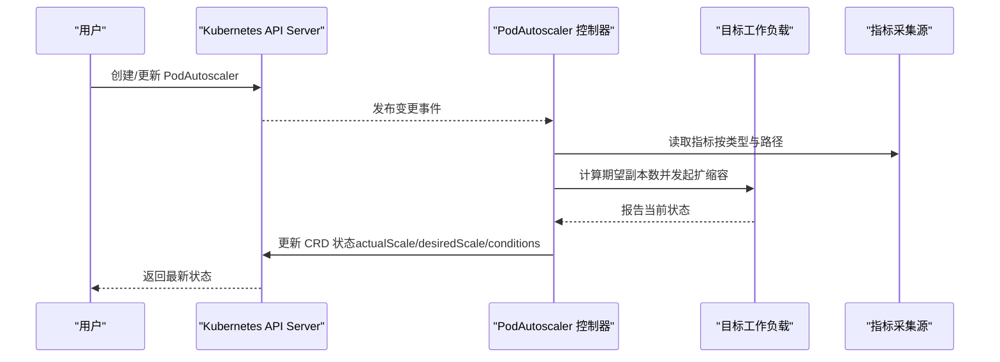
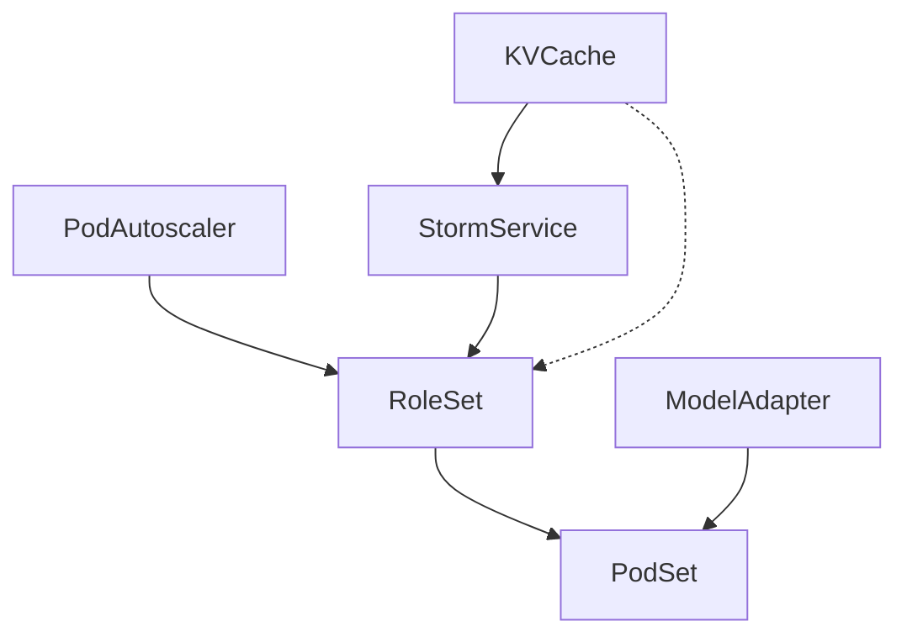

# Kubernetes CRD API

<cite>
**本文引用的文件**
- [api/autoscaling/v1alpha1/podautoscaler_types.go](file://api/autoscaling/v1alpha1/podautoscaler_types.go)
- [config/crd/autoscaling/autoscaling.aibrix.ai_podautoscalers.yaml](file://config/crd/autoscaling/autoscaling.aibrix.ai_podautoscalers.yaml)
- [api/model/v1alpha1/modeladapter_types.go](file://api/model/v1alpha1/modeladapter_types.go)
- [config/crd/model/model.aibrix.ai_modeladapters.yaml](file://config/crd/model/model.aibrix.ai_modeladapters.yaml)
- [api/orchestration/v1alpha1/kvcache_types.go](file://api/orchestration/v1alpha1/kvcache_types.go)
- [config/crd/orchestration/orchestration.aibrix.ai_kvcaches.yaml](file://config/crd/orchestration/orchestration.aibrix.ai_kvcaches.yaml)
- [api/orchestration/v1alpha1/raycluster_type.go](file://api/orchestration/v1alpha1/raycluster_type.go)
- [api/orchestration/v1alpha1/podset_types.go](file://api/orchestration/v1alpha1/podset_types.go)
- [config/crd/orchestration/orchestration.aibrix.ai_podsets.yaml](file://config/crd/orchestration/orchestration.aibrix.ai_podsets.yaml)
- [api/orchestration/v1alpha1/roleset_types.go](file://api/orchestration/v1alpha1/roleset_types.go)
- [config/crd/orchestration/orchestration.aibrix.ai_rolesets.yaml](file://config/crd/orchestration/orchestration.aibrix.ai_rolesets.yaml)
- [api/orchestration/v1alpha1/stormservice_types.go](file://api/orchestration/v1alpha1/stormservice_types.go)
- [config/crd/orchestration/orchestration.aibrix.ai_stormservices.yaml](file://config/crd/orchestration/orchestration.aibrix.ai_stormservices.yaml)
</cite>

## 目录
1. [简介](#简介)
2. [项目结构](#项目结构)
3. [核心组件](#核心组件)
4. [架构总览](#架构总览)
5. [详细组件分析](#详细组件分析)
6. [依赖分析](#依赖分析)
7. [性能考虑](#性能考虑)
8. [故障排查指南](#故障排查指南)
9. [结论](#结论)
10. [附录](#附录)

## 简介
本文件为 AIBrix 的 Kubernetes 自定义资源定义（CRD）参考文档，覆盖以下资源的完整 API 规范与使用说明：
- PodAutoscaler：基于指标的弹性伸缩控制器
- ModelAdapter：模型适配器部署与生命周期管理
- KVCache：KV 缓存服务编排与元数据配置
- RayCluster：基于 KubeRay 的 Ray 集群模板
- PodSet：原子化 Pod 组编排与恢复策略
- RoleSet：角色化工作负载集合与调度策略
- StormService：面向推理池/副本模式的服务编排器

内容涵盖字段定义、验证规则、默认值、约束条件、注解标签、选择器、状态条件、生命周期管理、kubectl 命令示例、API 版本兼容性与删除清理策略。

## 项目结构
AIBrix 将 CRD 定义分为两部分：

```mermaid
graph TB
subgraph "Go 类型定义"
A1["api/autoscaling/v1alpha1/podautoscaler_types.go"]
A2["api/model/v1alpha1/modeladapter_types.go"]
A3["api/orchestration/v1alpha1/kvcache_types.go"]
A4["api/orchestration/v1alpha1/raycluster_type.go"]
A5["api/orchestration/v1alpha1/podset_types.go"]
A6["api/orchestration/v1alpha1/roleset_types.go"]
A7["api/orchestration/v1alpha1/stormservice_types.go"]
end
subgraph "CRD YAML"
B1["config/crd/autoscaling/autoscaling.aibrix.ai_podautoscalers.yaml"]
B2["config/crd/model/model.aibrix.ai_modeladapters.yaml"]
B3["config/crd/orchestration/orchestration.aibrix.ai_kvcaches.yaml"]
B4["config/crd/orchestration/orchestration.aibrix.ai_podsets.yaml"]
B5["config/crd/orchestration/orchestration.aibrix.ai_rolesets.yaml"]
B6["config/crd/orchestration/orchestration.aibrix.ai_stormservices.yaml"]
end
A1 --> B1
A2 --> B2
A3 --> B3
A5 --> B4
A6 --> B5
A7 --> B6
```

- Go 类型定义：位于 api/<group>/v1alpha1/*.go，描述 Spec/Status 结构与常量
- CRD YAML：位于 config/crd/<group>/<crd-name>.yaml，描述 OpenAPI v3 校验、打印列、子资源等

图表来源
- [api/autoscaling/v1alpha1/podautoscaler_types.go:40-230](file://api/autoscaling/v1alpha1/podautoscaler_types.go#L40-L230)
- [config/crd/autoscaling/autoscaling.aibrix.ai_podautoscalers.yaml:34-198](file://config/crd/autoscaling/autoscaling.aibrix.ai_podautoscalers.yaml#L34-L198)
- [api/model/v1alpha1/modeladapter_types.go:26-161](file://api/model/v1alpha1/modeladapter_types.go#L26-L161)
- [config/crd/model/model.aibrix.ai_modeladapters.yaml:37-160](file://config/crd/model/model.aibrix.ai_modeladapters.yaml#L37-L160)
- [api/orchestration/v1alpha1/kvcache_types.go:85-141](file://api/orchestration/v1alpha1/kvcache_types.go#L85-L141)
- [config/crd/orchestration/orchestration.aibrix.ai_kvcaches.yaml:17-15096](file://config/crd/orchestration/orchestration.aibrix.ai_kvcaches.yaml#L17-L15096)
- [api/orchestration/v1alpha1/podset_types.go:24-136](file://api/orchestration/v1alpha1/podset_types.go#L24-L136)
- [config/crd/orchestration/orchestration.aibrix.ai_podsets.yaml:32-800](file://config/crd/orchestration/orchestration.aibrix.ai_podsets.yaml#L32-L800)
- [api/orchestration/v1alpha1/roleset_types.go:28-256](file://api/orchestration/v1alpha1/roleset_types.go#L28-L256)
- [config/crd/orchestration/orchestration.aibrix.ai_rolesets.yaml:27-800](file://config/crd/orchestration/orchestration.aibrix.ai_rolesets.yaml#L27-L800)
- [api/orchestration/v1alpha1/stormservice_types.go:24-203](file://api/orchestration/v1alpha1/stormservice_types.go#L24-L203)
- [config/crd/orchestration/orchestration.aibrix.ai_stormservices.yaml:34-800](file://config/crd/orchestration/orchestration.aibrix.ai_stormservices.yaml#L34-L800)

章节来源
- [api/autoscaling/v1alpha1/podautoscaler_types.go:40-230](file://api/autoscaling/v1alpha1/podautoscaler_types.go#L40-L230)
- [config/crd/autoscaling/autoscaling.aibrix.ai_podautoscalers.yaml:34-198](file://config/crd/autoscaling/autoscaling.aibrix.ai_podautoscalers.yaml#L34-L198)

## 核心组件
本节概述各 CRD 的职责与关键字段，便于快速定位与理解。

- PodAutoscaler
  - 职责：根据指标源对目标工作负载进行弹性伸缩，支持 HPA/KPA/APA 策略
  - 关键字段：scaleTargetRef、subTargetSelector、minReplicas、maxReplicas、metricsSources、scalingStrategy、status.conditions/scalingHistory
  - 默认值与约束：maxReplicas 必填；minReplicas 不得大于 maxReplicas；metricsSources 至少一项
- ModelAdapter
  - 职责：在匹配的 Pod 上加载模型适配器，支持单实例或全量分发
  - 关键字段：baseModel、podSelector、schedulerName、artifactURL、credentialsSecretRef、replicas、additionalConfig
  - 默认值与约束：schedulerName 默认“default”；replicas 支持枚举值 1 或省略（全量）
- KVCache
  - 职责：编排 KV 缓存服务，支持集中式/分布式模式，可配置元数据后端（Redis/Etcd）
  - 关键字段：mode、metadata.redis/etcd、cache.runtime、watcher、service
  - 默认值与约束：mode 默认“distributed”；cache.runtime.image 默认镜像与拉取策略；service.ports 至少一项
- PodSet
  - 职责：原子化 Pod 组编排，支持替换不健康或整组重建
  - 关键字段：podGroupSize（2~100）、template、stateful、recoveryPolicy、schedulingStrategy
  - 默认值与约束：recoveryPolicy 默认 ReplaceUnhealthy
- RoleSet
  - 职责：角色化工作负载集合，支持多调度器策略（Godel/Coscheduling/Volcano）
  - 关键字段：roles[].name/podGroupSize/stateful/template/disruptionTolerance/updateStrategy、updateStrategy、schedulingStrategy
  - 默认值与约束：updateStrategy 默认 Sequential
- StormService
  - 职责：服务级编排器，支持滚动/就地更新，聚合 RoleSet 状态
  - 关键字段：replicas、selector、template.spec、updateStrategy、revisionHistoryLimit、paused、disruptionTolerance
  - 默认值与约束：updateStrategy.type 默认 RollingUpdate
- RayCluster
  - 职责：提供 RayCluster 模板规格，复用 KubeRay 的集群定义
  - 关键字段：metadata、spec（透传 KubeRay RayClusterSpec）

章节来源
- [api/autoscaling/v1alpha1/podautoscaler_types.go:53-105](file://api/autoscaling/v1alpha1/podautoscaler_types.go#L53-L105)
- [api/model/v1alpha1/modeladapter_types.go:26-61](file://api/model/v1alpha1/modeladapter_types.go#L26-L61)
- [api/orchestration/v1alpha1/kvcache_types.go:85-107](file://api/orchestration/v1alpha1/kvcache_types.go#L85-L107)
- [api/orchestration/v1alpha1/podset_types.go:24-47](file://api/orchestration/v1alpha1/podset_types.go#L24-L47)
- [api/orchestration/v1alpha1/roleset_types.go:28-39](file://api/orchestration/v1alpha1/roleset_types.go#L28-L39)
- [api/orchestration/v1alpha1/stormservice_types.go:24-60](file://api/orchestration/v1alpha1/stormservice_types.go#L24-L60)
- [api/orchestration/v1alpha1/raycluster_type.go:24-34](file://api/orchestration/v1alpha1/raycluster_type.go#L24-L34)

## 架构总览
下图展示 CRD 与控制器的关系及典型控制流（以 PodAutoscaler 为例）：

图表来源
- [api/autoscaling/v1alpha1/podautoscaler_types.go:171-198](file://api/autoscaling/v1alpha1/podautoscaler_types.go#L171-L198)
- [config/crd/autoscaling/autoscaling.aibrix.ai_podautoscalers.yaml:118-198](file://config/crd/autoscaling/autoscaling.aibrix.ai_podautoscalers.yaml#L118-L198)

## 详细组件分析

### PodAutoscaler（弹性伸缩）
- 资源标识
  - API 组：autoscaling.aibrix.ai
  - Kind：PodAutoscaler
  - 子资源：status
  - 打印列：MINPODS、MAXPODS、REPLICAS、STRATEGY、AGE
- 字段与约束
  - spec.scaleTargetRef：必填，指向可伸缩目标（如 Deployment）
  - spec.subTargetSelector.roleName：可选，用于 StormService/RoleSet 内部角色选择
  - spec.minReplicas：可选，不得大于 maxReplicas
  - spec.maxReplicas：必填
  - spec.scalingStrategy：枚举 HPA/KPA/APA
  - spec.metricsSources：至少一项，每项包含 metricSourceType、protocolType、endpoint、path、port、targetMetric、targetValue
  - status.lastScaleTime、status.desiredScale、status.actualScale、status.conditions、status.scalingHistory
- 默认值与校验
  - 打印列由 CRD YAML 定义
  - Go 层限制 metricsSources 数量与字段必填
- 生命周期与状态条件
  - conditions 使用标准 metav1.Condition，包含类型、状态、原因、消息、时间戳
- 示例与命令
  - 参考 CRD YAML 中的 OpenAPI 字段定义，结合 samples 目录中的示例进行创建与调试
  - kubectl 常用命令：apply、get、describe、edit、delete

章节来源
- [api/autoscaling/v1alpha1/podautoscaler_types.go:53-198](file://api/autoscaling/v1alpha1/podautoscaler_types.go#L53-L198)
- [config/crd/autoscaling/autoscaling.aibrix.ai_podautoscalers.yaml:34-198](file://config/crd/autoscaling/autoscaling.aibrix.ai_podautoscalers.yaml#L34-L198)

### ModelAdapter（模型适配器）
- 资源标识
  - API 组：model.aibrix.ai
  - Kind：ModelAdapter
  - 子资源：status
  - 打印列：Phase、Desired、Ready、Candidates、Model Path、Age
- 字段与约束
  - spec.baseModel：可选
  - spec.podSelector：必填（标签选择器）
  - spec.schedulerName：默认“default”
  - spec.artifactURL：必填（支持 s3/gcs/huggingface 等协议）
  - spec.credentialsSecretRef：可选，凭据密文引用
  - spec.replicas：枚举 1 或省略（省略表示全量分发）
  - spec.additionalConfig：可扩展配置
  - status.phase、status.candidates、status.readyReplicas、status.desiredReplicas、status.conditions、status.instances
- 默认值与校验
  - CRD YAML 明确 schedulerName 默认值与 replicas 枚举
- 生命周期与状态条件
  - phase 常量：Pending/Scheduled/Bound/ResourceCreated/Running/Failed/Unknown/Scaled
  - 条件类型：Initialized/Scheduled/Bound/ResourceCreated/Ready
- 示例与命令
  - 参考 CRD YAML 的 OpenAPI 字段定义
  - kubectl 常用命令：apply、get、describe、logs（通过 instances 定位 Pod）

章节来源
- [api/model/v1alpha1/modeladapter_types.go:26-116](file://api/model/v1alpha1/modeladapter_types.go#L26-L116)
- [config/crd/model/model.aibrix.ai_modeladapters.yaml:37-160](file://config/crd/model/model.aibrix.ai_modeladapters.yaml#L37-L160)

### KVCache（KV 缓存）
- 资源标识
  - API 组：orchestration.aibrix.ai
  - Kind：KVCache
  - 子资源：status
- 字段与约束
  - spec.mode：默认“distributed”，支持 centralized/distributed
  - spec.metadata：可配置外部连接或内置运行时（Redis/Etcd）
  - spec.cache：运行时配置（image/imagePullPolicy/env/resources/template）
  - spec.watcher：可选，成员注册 Watcher
  - spec.service：ServiceSpec（type 默认 ClusterIP，ports 至少一项）
  - status.current、status.conditions
- 默认值与校验
  - CRD YAML 明确 cache.image、imagePullPolicy、env、resources、replicas 默认值
- 示例与命令
  - 参考 CRD YAML 的 OpenAPI 字段定义
  - kubectl 常用命令：apply、get、describe、port-forward（Service）

章节来源
- [api/orchestration/v1alpha1/kvcache_types.go:85-115](file://api/orchestration/v1alpha1/kvcache_types.go#L85-L115)
- [config/crd/orchestration/orchestration.aibrix.ai_kvcaches.yaml:17-15096](file://config/crd/orchestration/orchestration.aibrix.ai_kvcaches.yaml#L17-L15096)

### PodSet（原子化 Pod 组）
- 资源标识
  - API 组：orchestration.aibrix.ai
  - Kind：PodSet
  - 子资源：status
  - 打印列：ReadyPods、TotalPods、Phase、Age
- 字段与约束
  - spec.podGroupSize：最小 2，最大 100
  - spec.template：PodTemplateSpec
  - spec.stateful：布尔
  - spec.recoveryPolicy：默认 ReplaceUnhealthy，可选 Recreate
  - spec.schedulingStrategy：可选，支持 Godel/Coscheduling/Volcano 策略
  - status.readyPods、status.totalPods、status.phase、status.conditions
- 默认值与校验
  - CRD YAML 明确 podGroupSize 范围与 recoveryPolicy 默认值
- 示例与命令
  - 参考 CRD YAML 的 OpenAPI 字段定义
  - kubectl 常用命令：apply、get、describe、rollout status

章节来源
- [api/orchestration/v1alpha1/podset_types.go:24-65](file://api/orchestration/v1alpha1/podset_types.go#L24-L65)
- [config/crd/orchestration/orchestration.aibrix.ai_podsets.yaml:32-800](file://config/crd/orchestration/orchestration.aibrix.ai_podsets.yaml#L32-L800)

### RoleSet（角色化工作负载集合）
- 资源标识
  - API 组：orchestration.aibrix.ai
  - Kind：RoleSet
  - 子资源：status
  - 打印列：Ready、Age
- 字段与约束
  - spec.roles：每项含 name、replicas、podGroupSize、stateful、template、disruptionTolerance、updateStrategy、schedulingStrategy
  - spec.updateStrategy：默认 Sequential
  - spec.schedulingStrategy：可选，支持 Godel/Coscheduling/Volcano
  - status.roles[].replicas/readyReplicas/notReadyReplicas/updatedReplicas/updatedReadyReplicas
  - status.conditions：Ready/ReplicaFailure/Progressing
- 默认值与校验
  - CRD YAML 明确 roles[].podGroupSize 范围与 updateStrategy 默认值
- 示例与命令
  - 参考 CRD YAML 的 OpenAPI 字段定义
  - kubectl 常用命令：apply、get、describe、rollout status

章节来源
- [api/orchestration/v1alpha1/roleset_types.go:28-201](file://api/orchestration/v1alpha1/roleset_types.go#L28-L201)
- [config/crd/orchestration/orchestration.aibrix.ai_rolesets.yaml:27-800](file://config/crd/orchestration/orchestration.aibrix.ai_rolesets.yaml#L27-L800)

### StormService（服务编排器）
- 资源标识
  - API 组：orchestration.aibrix.ai
  - Kind：StormService
  - 子资源：status、scale
  - 打印列：Replicas、Ready、Paused、Age
- 字段与约束
  - spec.replicas、spec.selector、spec.template、spec.updateStrategy、spec.revisionHistoryLimit、spec.paused、spec.disruptionTolerance
  - spec.updateStrategy.type：默认 RollingUpdate，可选 InPlaceUpdate
  - status.observedGeneration、replicas、readyReplicas、notReadyReplicas、currentReplicas、updatedReplicas、currentRevision、updateRevision、updatedReadyReplicas、conditions、collisionCount、scalingTargetSelector、roleStatuses
- 默认值与校验
  - CRD YAML 明确 updateStrategy.type 默认值与 scale 子资源映射
- 示例与命令
  - 参考 CRD YAML 的 OpenAPI 字段定义
  - kubectl 常用命令：apply、get、describe、rollout pause/resume、scale

章节来源
- [api/orchestration/v1alpha1/stormservice_types.go:24-161](file://api/orchestration/v1alpha1/stormservice_types.go#L24-L161)
- [config/crd/orchestration/orchestration.aibrix.ai_stormservices.yaml:34-800](file://config/crd/orchestration/orchestration.aibrix.ai_stormservices.yaml#L34-L800)

### RayCluster（Ray 集群模板）
- 资源标识
  - API 组：orchestration.aibrix.ai
  - Kind：RayCluster（通过模板形式使用）
- 字段与约束
  - spec：透传 KubeRay RayClusterSpec
  - metadata：透传标准对象元数据
- 说明
  - 该类型直接复用 KubeRay 的集群定义，便于与 AIBrix 其他编排组件协同

章节来源
- [api/orchestration/v1alpha1/raycluster_type.go:24-34](file://api/orchestration/v1alpha1/raycluster_type.go#L24-L34)

## 依赖分析
- 组件耦合
  - StormService 通过 RoleSet 实现角色化编排，RoleSet 再通过 PodSet 管理原子化 Pod 组
  - PodAutoscaler 可作用于 StormService/RoleSet/Workload，实现按指标弹性伸缩
  - ModelAdapter 通过 PodSelector 与 PodSet/RoleSet 协同，实现模型注入
  - KVCache 提供缓存服务，可被 StormService/RoleSet 引用
- 外部依赖
  - KubeRay：RayCluster 模板
  - 标准 Kubernetes API：Pod、Service、Deployment 等

图表来源
- [api/orchestration/v1alpha1/stormservice_types.go:24-60](file://api/orchestration/v1alpha1/stormservice_types.go#L24-L60)
- [api/orchestration/v1alpha1/roleset_types.go:28-39](file://api/orchestration/v1alpha1/roleset_types.go#L28-L39)
- [api/orchestration/v1alpha1/podset_types.go:24-47](file://api/orchestration/v1alpha1/podset_types.go#L24-L47)
- [api/autoscaling/v1alpha1/podautoscaler_types.go:53-84](file://api/autoscaling/v1alpha1/podautoscaler_types.go#L53-L84)
- [api/orchestration/v1alpha1/kvcache_types.go:85-107](file://api/orchestration/v1alpha1/kvcache_types.go#L85-L107)
- [api/model/v1alpha1/modeladapter_types.go:26-61](file://api/model/v1alpha1/modeladapter_types.go#L26-L61)

## 性能考虑
- 指标采集
  - 优先使用本地 Pod 指标（pod）与资源指标（resource），减少外部依赖
  - 外部指标（external）应设置合理的超时与重试策略
- 扩缩容节奏
  - 合理设置 lastScaleTime 相关逻辑，避免频繁抖动
- 调度与亲和
  - 使用 RoleSet/PodSet 的调度策略（Godel/Coscheduling/Volcano）提升批处理一致性
- 缓存与元数据
  - KVCache 的副本数与资源需与吞吐匹配，避免成为瓶颈

## 故障排查指南
- 状态条件解读
  - PodAutoscaler：conditions 中的 type/status/reason/message 描述当前状态与失败原因
  - ModelAdapter：phase 与 conditions 类型（Initialized/Scheduled/Bound/ResourceCreated/Ready）指示生命周期阶段
  - RoleSet/StormService：Ready/ReplicaFailure/Progressing 条件反映编排健康度
- 常见问题
  - 指标不可用：检查 metricsSources 的 protocolType/endpoint/path/port/targetMetric/targetValue
  - 伸缩未生效：确认 minReplicas/maxReplicas、scalingStrategy 与目标工作负载是否匹配
  - 适配器未加载：核对 podSelector 与 replicas 设置，查看 instances 列表
  - 缓存异常：检查 KVCache 的 metadata 配置与 service 暴露端口
- 排查命令
  - kubectl describe podautoscaler、modeladapter、kvcache、podset、roleset、stormservice
  - kubectl get events --sort-by=.metadata.creationTimestamp
  - kubectl logs -l <选择器> -c <容器名>

章节来源
- [api/autoscaling/v1alpha1/podautoscaler_types.go:171-198](file://api/autoscaling/v1alpha1/podautoscaler_types.go#L171-L198)
- [api/model/v1alpha1/modeladapter_types.go:86-116](file://api/model/v1alpha1/modeladapter_types.go#L86-L116)
- [api/orchestration/v1alpha1/roleset_types.go:194-201](file://api/orchestration/v1alpha1/roleset_types.go#L194-L201)
- [api/orchestration/v1alpha1/stormservice_types.go:77-147](file://api/orchestration/v1alpha1/stormservice_types.go#L77-L147)

## 结论
AIBrix 的 CRD 体系围绕弹性伸缩、模型适配、缓存编排、角色化与服务编排构建，具备清晰的职责边界与可扩展的校验机制。通过 CRD YAML 的 OpenAPI 校验与 Go 类型的约束，确保资源定义的一致性与安全性。建议在生产环境中结合监控与告警，配合合理的调度与缓存策略，获得稳定高效的推理与训练体验。

## 附录

### API 版本与兼容性
- API 组与版本
  - autoscaling.aibrix.ai/v1alpha1
  - model.aibrix.ai/v1alpha1
  - orchestration.aibrix.ai/v1alpha1
- 兼容性说明
  - v1alpha1 为实验版本，字段可能演进
  - CRD YAML 中 served/storage 字段表明当前存储版本与服务状态

章节来源
- [config/crd/autoscaling/autoscaling.aibrix.ai_podautoscalers.yaml:16-198](file://config/crd/autoscaling/autoscaling.aibrix.ai_podautoscalers.yaml#L16-L198)
- [config/crd/model/model.aibrix.ai_modeladapters.yaml:16-160](file://config/crd/model/model.aibrix.ai_modeladapters.yaml#L16-L160)
- [config/crd/orchestration/orchestration.aibrix.ai_kvcaches.yaml:16-15096](file://config/crd/orchestration/orchestration.aibrix.ai_kvcaches.yaml#L16-L15096)
- [config/crd/orchestration/orchestration.aibrix.ai_podsets.yaml:16-800](file://config/crd/orchestration/orchestration.aibrix.ai_podsets.yaml#L16-L800)
- [config/crd/orchestration/orchestration.aibrix.ai_rolesets.yaml:16-800](file://config/crd/orchestration/orchestration.aibrix.ai_rolesets.yaml#L16-L800)
- [config/crd/orchestration/orchestration.aibrix.ai_stormservices.yaml:16-800](file://config/crd/orchestration/orchestration.aibrix.ai_stormservices.yaml#L16-L800)

### kubectl 常用命令示例
- 应用与查看
  - kubectl apply -f <crd.yaml>
  - kubectl get <crd> -A
  - kubectl describe <crd> <name> -n <namespace>
- 状态与日志
  - kubectl get events --sort-by=.metadata.creationTimestamp
  - kubectl logs -l <选择器> -c <容器名> -n <namespace>
- 缩放与暂停
  - kubectl scale <crd> <name> --replicas=<N> -n <namespace>
  - kubectl rollout pause <crd> <name> -n <namespace>
  - kubectl rollout resume <crd> <name> -n <namespace>

### 删除与清理策略
- 删除顺序建议
  - StormService → RoleSet → PodSet → 目标工作负载
  - ModelAdapter → 适配器所在 Pod
  - KVCache → 服务与元数据后端
- 注意事项
  - 清理前备份关键状态（如 KVCache 数据）
  - 使用 finalizer 与条件判断确保资源安全释放