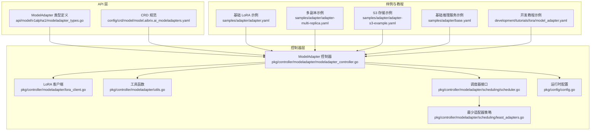
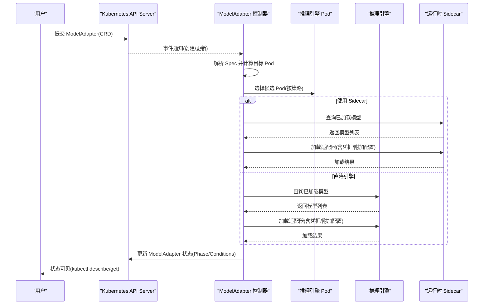
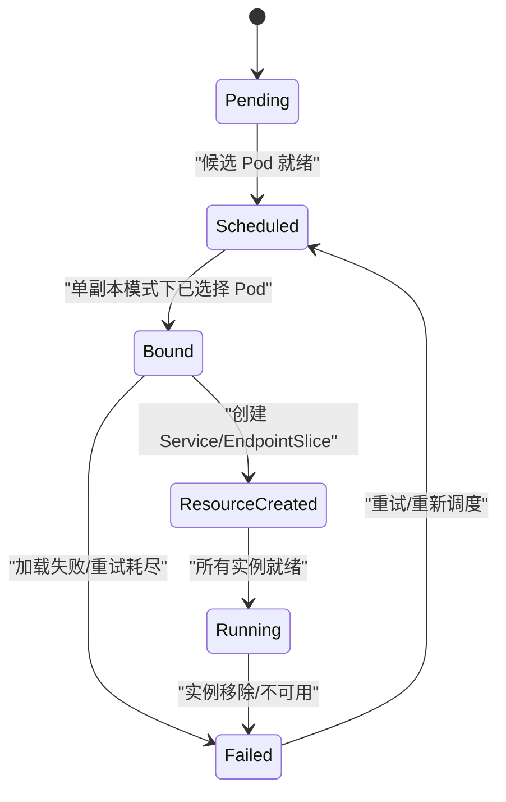
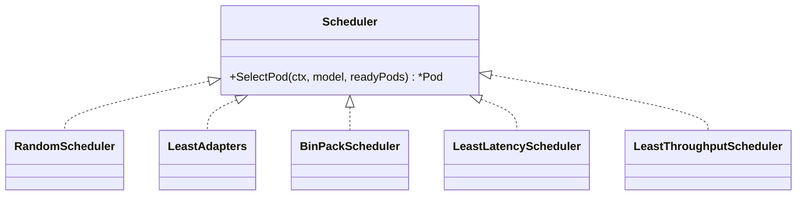
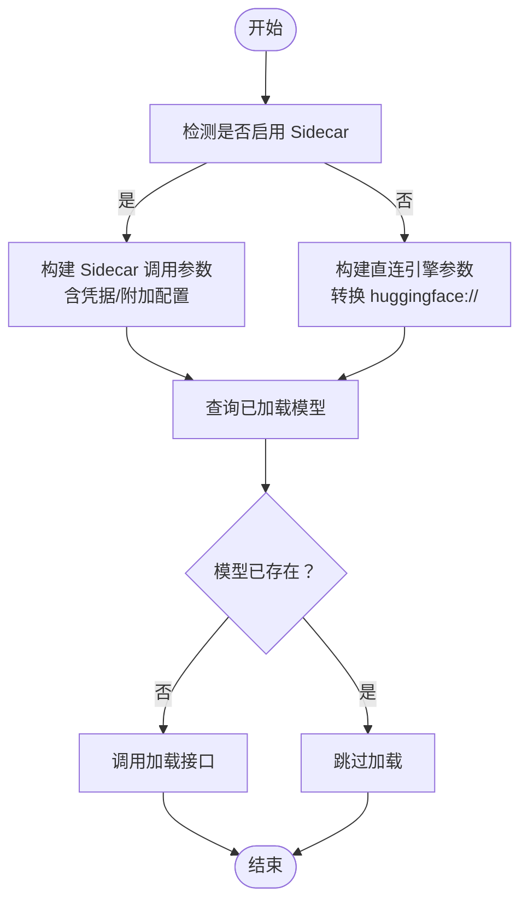
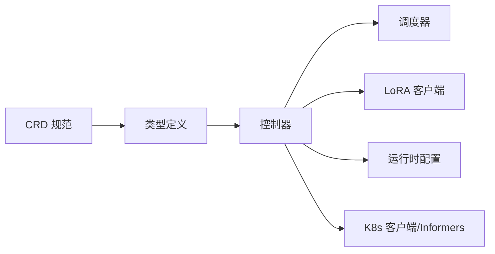

# 模型管理 CRD

<cite>
**本文引用的文件**
- [modeladapter_types.go](file://api/model/v1alpha1/modeladapter_types.go)
- [model.aibrix.ai_modeladapters.yaml](file://config/crd/model/model.aibrix.ai_modeladapters.yaml)
- [modeladapter_controller.go](file://pkg/controller/modeladapter/modeladapter_controller.go)
- [lora_client.go](file://pkg/controller/modeladapter/lora_client.go)
- [utils.go](file://pkg/controller/modeladapter/utils.go)
- [scheduler.go](file://pkg/controller/modeladapter/scheduling/scheduler.go)
- [least_adapters.go](file://pkg/controller/modeladapter/scheduling/least_adapters.go)
- [config.go](file://pkg/config/config.go)
- [adapter.yaml](file://samples/adapter/adapter.yaml)
- [adapter-multi-replica.yaml](file://samples/adapter/adapter-multi-replica.yaml)
- [adapter-s3-example.yaml](file://samples/adapter/adapter-s3-example.yaml)
- [base.yaml](file://samples/adapter/base.yaml)
- [model_adapter.yaml](file://development/tutorials/lora/model_adapter.yaml)
</cite>

## 目录
1. [简介](#简介)
2. [项目结构](#项目结构)
3. [核心组件](#核心组件)
4. [架构总览](#架构总览)
5. [详细组件分析](#详细组件分析)
6. [依赖分析](#依赖分析)
7. [性能考虑](#性能考虑)
8. [故障排查指南](#故障排查指南)
9. [结论](#结论)
10. [附录](#附录)

## 简介
本文件为 AIBrix 的模型管理 CRD（ModelAdapter）提供完整的 API 参考与使用指南。重点覆盖：
- ModelAdapter 资源的 Spec 与 Status 字段定义
- 模型配置文件管理、推理引擎集成配置
- 模型下载配置、存储环境设置、运行时参数配置、LoRA 微调支持
- 完整 YAML 示例：基础模型、LoRA 适配器、多引擎适配器
- 生命周期管理、版本控制、热更新机制
- 与推理服务的集成方式、API 密钥管理、访问控制配置
- kubectl 命令示例与最佳实践

## 项目结构
围绕 ModelAdapter 的核心代码与配置分布如下：
- API 定义：位于 api/model/v1alpha1，包含 CRD 结构体与 OpenAPI 规范
- 控制器：位于 pkg/controller/modeladapter，负责调度、加载、状态同步
- 调度策略：位于 pkg/controller/modeladapter/scheduling，支持多种调度策略
- 样例与教程：位于 samples/adapter 与 development/tutorials/lora，提供可直接使用的 YAML 示例

**图表来源**
- [modeladapter_types.go:26-116](file://api/model/v1alpha1/modeladapter_types.go#L26-L116)
- [model.aibrix.ai_modeladapters.yaml:37-155](file://config/crd/model/model.aibrix.ai_modeladapters.yaml#L37-L155)
- [modeladapter_controller.go:127-191](file://pkg/controller/modeladapter/modeladapter_controller.go#L127-L191)
- [lora_client.go:75-108](file://pkg/controller/modeladapter/lora_client.go#L75-L108)
- [utils.go:118-158](file://pkg/controller/modeladapter/utils.go#L118-L158)
- [scheduler.go:28-50](file://pkg/controller/modeladapter/scheduling/scheduler.go#L28-L50)
- [least_adapters.go:28-56](file://pkg/controller/modeladapter/scheduling/least_adapters.go#L28-L56)
- [config.go:19-41](file://pkg/config/config.go#L19-L41)
- [adapter.yaml:1-40](file://samples/adapter/adapter.yaml#L1-L40)
- [adapter-multi-replica.yaml:1-46](file://samples/adapter/adapter-multi-replica.yaml#L1-L46)
- [adapter-s3-example.yaml:160-189](file://samples/adapter/adapter-s3-example.yaml#L160-L189)
- [base.yaml:1-128](file://samples/adapter/base.yaml#L1-L128)
- [model_adapter.yaml:1-16](file://development/tutorials/lora/model_adapter.yaml#L1-L16)

**章节来源**
- [modeladapter_types.go:26-116](file://api/model/v1alpha1/modeladapter_types.go#L26-L116)
- [model.aibrix.ai_modeladapters.yaml:37-155](file://config/crd/model/model.aibrix.ai_modeladapters.yaml#L37-L155)

## 核心组件
- ModelAdapterSpec：描述期望状态，包括基座模型标识、Pod 选择器、调度器名称、模型制品地址、凭据引用、副本数与附加配置
- ModelAdapterStatus：描述观测状态，包括生命周期阶段、候选 Pod 数、就绪副本数、期望副本数、条件集合与实例列表
- 控制器：负责根据 Spec 与集群状态进行调度与加载，维护 Service 与 EndpointSlice，并更新 Status
- LoRA 客户端：封装对推理引擎的模型查询与加载/卸载请求，支持运行时 Sidecar 或直连引擎 API
- 调度器：基于缓存信息选择最合适的 Pod 承载适配器，支持随机、最少适配器、打包等策略

**章节来源**
- [modeladapter_types.go:26-116](file://api/model/v1alpha1/modeladapter_types.go#L26-L116)
- [modeladapter_controller.go:281-299](file://pkg/controller/modeladapter/modeladapter_controller.go#L281-L299)
- [lora_client.go:75-108](file://pkg/controller/modeladapter/lora_client.go#L75-L108)
- [scheduler.go:28-50](file://pkg/controller/modeladapter/scheduling/scheduler.go#L28-L50)

## 架构总览
下图展示了从用户提交 ModelAdapter 到推理引擎完成适配器加载的关键流程。

**图表来源**
- [modeladapter_controller.go:417-493](file://pkg/controller/modeladapter/modeladapter_controller.go#L417-L493)
- [lora_client.go:81-108](file://pkg/controller/modeladapter/lora_client.go#L81-L108)
- [utils.go:118-158](file://pkg/controller/modeladapter/utils.go#L118-L158)

## 详细组件分析

### ModelAdapter API 规范
- 组与版本：model.aibrix.ai/v1alpha1
- Kind：ModelAdapter
- 列印列：Phase、Desired、Ready、Candidates、Model Path、Age

字段定义（Spec）：
- baseModel：基座模型标识，用于 LoRA 适配器扩展
- podSelector：标签选择器，匹配可承载适配器的 Pod
- schedulerName：调度器名称，默认值为 default；支持 leastAdapters 等策略
- artifactURL：模型制品地址，支持 huggingface://、s3:// 等协议
- credentialsSecretRef：凭据引用，用于访问私有存储
- replicas：副本数控制，nil 表示全部候选 Pod 加载；1 表示单 Pod 加载；仅允许上述两种取值
- additionalConfig：附加配置，透传至推理引擎加载过程，如 LoRA 参数、超时等

字段定义（Status）：
- phase：生命周期阶段，枚举 Pending、Scheduled、Bound、ResourceCreated、Running、Failed、Unknown、Scaled
- candidates：匹配选择器的候选 Pod 数
- readyReplicas：已成功加载并就绪的副本数
- desiredReplicas：期望副本数（由 replicas 推导）
- conditions：状态条件集合
- instances：当前实例（Pod 名称）列表

**章节来源**
- [modeladapter_types.go:26-116](file://api/model/v1alpha1/modeladapter_types.go#L26-L116)
- [model.aibrix.ai_modeladapters.yaml:46-154](file://config/crd/model/model.aibrix.ai_modeladapters.yaml#L46-L154)

### 生命周期与状态机
- 初始化：首次创建时设置 Phase 为 Pending，并写入 Initialized 条件
- 调度：根据 replicas 与候选 Pod 计算目标，Single-Pod 模式下通过调度器选择 Pod
- 加载：查询引擎已加载模型，若不存在则发起加载；支持重试与超时
- 资源创建：创建 Service 与 EndpointSlice 以暴露推理端点
- 就绪：所有目标 Pod 均加载成功后标记 Ready 条件为 True
- 失败：加载失败或 Pod 移除时更新相应条件与 Phase

**图表来源**
- [modeladapter_types.go:66-84](file://api/model/v1alpha1/modeladapter_types.go#L66-L84)
- [modeladapter_controller.go:417-493](file://pkg/controller/modeladapter/modeladapter_controller.go#L417-L493)

**章节来源**
- [modeladapter_types.go:66-84](file://api/model/v1alpha1/modeladapter_types.go#L66-L84)
- [modeladapter_controller.go:417-493](file://pkg/controller/modeladapter/modeladapter_controller.go#L417-L493)

### 调度策略
- 接口：Scheduler.SelectPod(ctx, model, readyPods) -> *Pod
- 工厂：根据 schedulerName 创建具体策略
- 策略类型：
  - random：随机选择
  - leastAdapters：选择已有适配器数量最少的 Pod
  - binPack：打包策略
  - leastLatency、leastThroughput：基于延迟与吞吐的策略
- 默认策略：leastAdapters

**图表来源**
- [scheduler.go:28-50](file://pkg/controller/modeladapter/scheduling/scheduler.go#L28-L50)
- [least_adapters.go:28-56](file://pkg/controller/modeladapter/scheduling/least_adapters.go#L28-L56)

**章节来源**
- [scheduler.go:28-50](file://pkg/controller/modeladapter/scheduling/scheduler.go#L28-L50)
- [least_adapters.go:28-56](file://pkg/controller/modeladapter/scheduling/least_adapters.go#L28-L56)

### LoRA 适配器加载流程
- 侧车模式：通过运行时 Sidecar 代理加载，支持凭据与附加配置透传
- 直连引擎：直接调用推理引擎 API，对 huggingface:// URL 进行路径转换
- 查询模型：GET /v1/models 获取已加载模型列表
- 加载适配器：POST /v1/load_lora_adapter 或运行时路径
- 卸载适配器：POST /v1/unload_lora_adapter，支持清理本地缓存

**图表来源**
- [lora_client.go:81-108](file://pkg/controller/modeladapter/lora_client.go#L81-L108)
- [utils.go:49-69](file://pkg/controller/modeladapter/utils.go#L49-L69)

**章节来源**
- [lora_client.go:81-108](file://pkg/controller/modeladapter/lora_client.go#L81-L108)
- [utils.go:49-69](file://pkg/controller/modeladapter/utils.go#L49-L69)

### 运行时配置与集成
- 运行时配置：EnableRuntimeSidecar、DebugMode、SchedulerPolicyName
- 端口与路径：
  - 引擎默认端口：8000
  - 运行时 Sidecar 默认端口：8080
  - Debug 模式下使用本地回环与调试端口
- URL 构建：根据是否 Sidecar 与引擎类型选择对应 API 路径

**章节来源**
- [config.go:19-41](file://pkg/config/config.go#L19-L41)
- [utils.go:118-158](file://pkg/controller/modeladapter/utils.go#L118-L158)

### YAML 示例与最佳实践

- 基础 LoRA 适配器
  - 关键点：baseModel 指向基座模型；podSelector 匹配具备适配器能力的 Pod；artifactURL 支持 huggingface://；可选 additionalConfig 传递 LoRA 参数
  - 参考：[adapter.yaml:1-40](file://samples/adapter/adapter.yaml#L1-L40)

- 多副本/全量加载
  - 关键点：不指定 replicas，控制器将适配器加载到所有候选 Pod，提升可用性与负载分发
  - 参考：[adapter-multi-replica.yaml:1-46](file://samples/adapter/adapter-multi-replica.yaml#L1-L46)

- S3 存储与凭据
  - 关键点：通过 credentialsSecretRef 引用 Secret；artifactURL 使用 s3://；在 Sidecar 中可结合环境变量配置下载器
  - 参考：[adapter-s3-example.yaml:160-189](file://samples/adapter/adapter-s3-example.yaml#L160-L189)

- 基础推理服务（含 Sidecar 注入与健康检查）
  - 关键点：Deployment 标签包含适配器启用标志；Service 暴露推理与运行时端口；容器内开启 LoRA 动态更新
  - 参考：[base.yaml:1-128](file://samples/adapter/base.yaml#L1-L128)

- 开发教程示例
  - 参考：[model_adapter.yaml:1-16](file://development/tutorials/lora/model_adapter.yaml#L1-L16)

**章节来源**
- [adapter.yaml:1-40](file://samples/adapter/adapter.yaml#L1-L40)
- [adapter-multi-replica.yaml:1-46](file://samples/adapter/adapter-multi-replica.yaml#L1-L46)
- [adapter-s3-example.yaml:160-189](file://samples/adapter/adapter-s3-example.yaml#L160-L189)
- [base.yaml:1-128](file://samples/adapter/base.yaml#L1-L128)
- [model_adapter.yaml:1-16](file://development/tutorials/lora/model_adapter.yaml#L1-L16)

### kubectl 命令示例
- 查看 CRD
  - kubectl get crd modeladapters.model.aibrix.ai
- 创建/应用 ModelAdapter
  - kubectl apply -f <adapter.yaml>
- 查看 ModelAdapter
  - kubectl get modeladapters
  - kubectl describe modeladapter <name> -n <namespace>
- 查看状态列
  - kubectl get modeladapter -o wide
- 实时观察状态变化
  - kubectl get modeladapter -w
- 删除 ModelAdapter
  - kubectl delete modeladapter <name> -n <namespace>

**章节来源**
- [modeladapter_types.go:128-137](file://api/model/v1alpha1/modeladapter_types.go#L128-L137)

## 依赖分析
- 控制器依赖：
  - Kubernetes 客户端与 Informer：用于监听 Pod、Service、EndpointSlice
  - 调度器：基于缓存统计与策略选择 Pod
  - LoRA 客户端：HTTP 客户端与引擎 API 交互
  - 运行时配置：决定 Sidecar 与端口策略
- CRD 与 OpenAPI 规范：约束字段类型、必填项与校验规则

**图表来源**
- [modeladapter_controller.go:127-191](file://pkg/controller/modeladapter/modeladapter_controller.go#L127-L191)
- [scheduler.go:28-50](file://pkg/controller/modeladapter/scheduling/scheduler.go#L28-L50)
- [lora_client.go:56-73](file://pkg/controller/modeladapter/lora_client.go#L56-L73)
- [config.go:19-41](file://pkg/config/config.go#L19-L41)

**章节来源**
- [modeladapter_controller.go:127-191](file://pkg/controller/modeladapter/modeladapter_controller.go#L127-L191)
- [scheduler.go:28-50](file://pkg/controller/modeladapter/scheduling/scheduler.go#L28-L50)
- [lora_client.go:56-73](file://pkg/controller/modeladapter/lora_client.go#L56-L73)
- [config.go:19-41](file://pkg/config/config.go#L19-L41)

## 性能考虑
- 调度策略：优先选择适配器数量较少的 Pod，避免热点集中
- 全量加载：在多副本场景下将适配器加载到所有候选 Pod，提升可用性与吞吐
- 超时与重试：加载失败自动重试，避免一次性失败导致长时间不可用
- Sidecar 模式：统一代理加载与下载，便于缓存与凭据管理

[本节为通用建议，无需特定文件来源]

## 故障排查指南
常见问题与定位思路：
- 适配器未加载
  - 检查 Pod 是否满足 podSelector 且处于 Ready 状态
  - 查看 ModelAdapter 状态中的 Conditions 与 Phase
  - 确认 artifactURL 协议与 credentialsSecretRef 配置正确
- 加载失败
  - 查看控制器日志与事件记录
  - 确认推理引擎端点可达与端口正确
  - 若使用 Sidecar，确认 Sidecar 容器存在且运行正常
- 多副本不生效
  - replicas 为空表示全量加载；若指定为 1，则仅单 Pod 加载
- API 密钥与鉴权
  - additionalConfig 中的 api-key 将作为 Authorization: Bearer 注入请求头
- 清理与卸载
  - 删除 ModelAdapter 时，控制器会尝试从引擎卸载适配器并移除 Finalizer

**章节来源**
- [modeladapter_controller.go:332-366](file://pkg/controller/modeladapter/modeladapter_controller.go#L332-L366)
- [lora_client.go:134-136](file://pkg/controller/modeladapter/lora_client.go#L134-L136)

## 结论
ModelAdapter CRD 提供了声明式的模型适配器管理能力，结合控制器与调度策略，能够灵活地在推理引擎中加载与卸载 LoRA 适配器。通过 Sidecar 模式与统一的运行时配置，系统实现了对多引擎、多存储与多副本场景的良好支持。配合完善的 YAML 示例与 kubectl 操作，用户可以快速落地模型适配器的部署与运维。

[本节为总结，无需特定文件来源]

## 附录

### 字段与类型速查
- ModelAdapterSpec
  - baseModel：字符串，可选
  - podSelector：标签选择器，必填
  - schedulerName：字符串，默认 default
  - artifactURL：字符串，必填
  - credentialsSecretRef：LocalObjectReference，可选
  - replicas：整数，可选，仅允许 nil 或 1
  - additionalConfig：字符串映射，可选
- ModelAdapterStatus
  - phase：字符串，枚举
  - candidates：整数
  - readyReplicas：整数
  - desiredReplicas：整数
  - conditions：条件数组
  - instances：字符串数组

**章节来源**
- [modeladapter_types.go:26-116](file://api/model/v1alpha1/modeladapter_types.go#L26-L116)
- [model.aibrix.ai_modeladapters.yaml:46-154](file://config/crd/model/model.aibrix.ai_modeladapters.yaml#L46-L154)