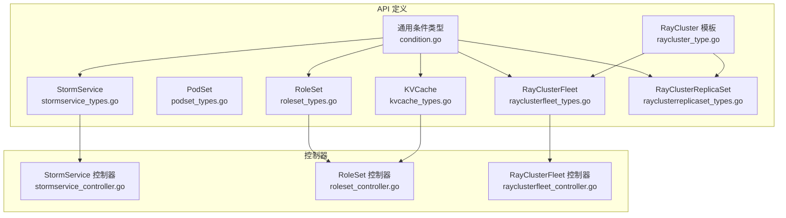
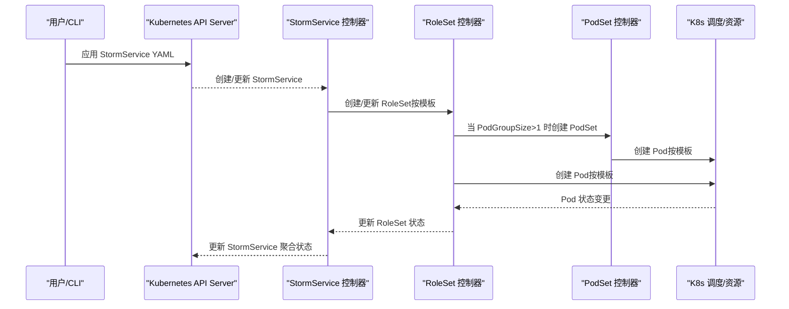
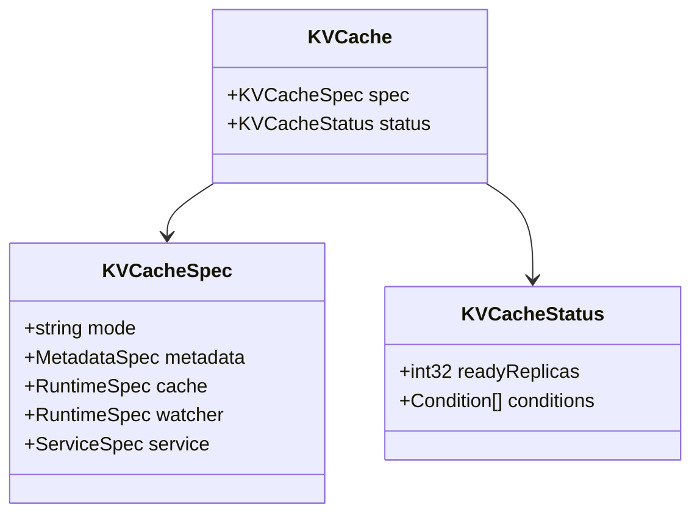
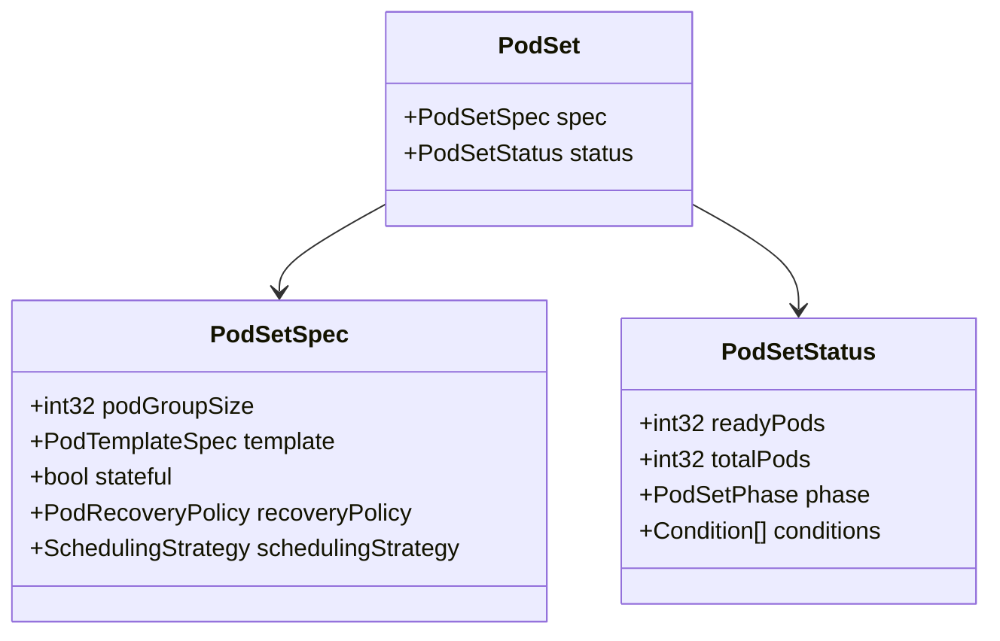
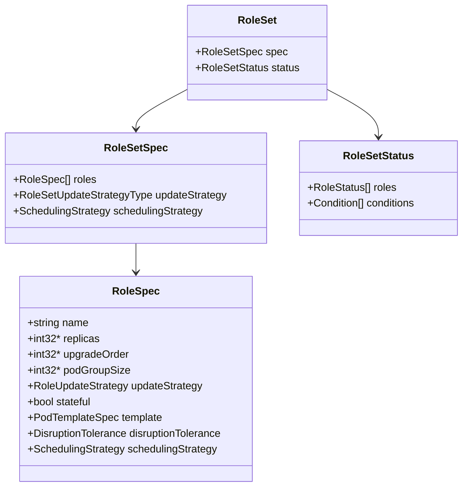
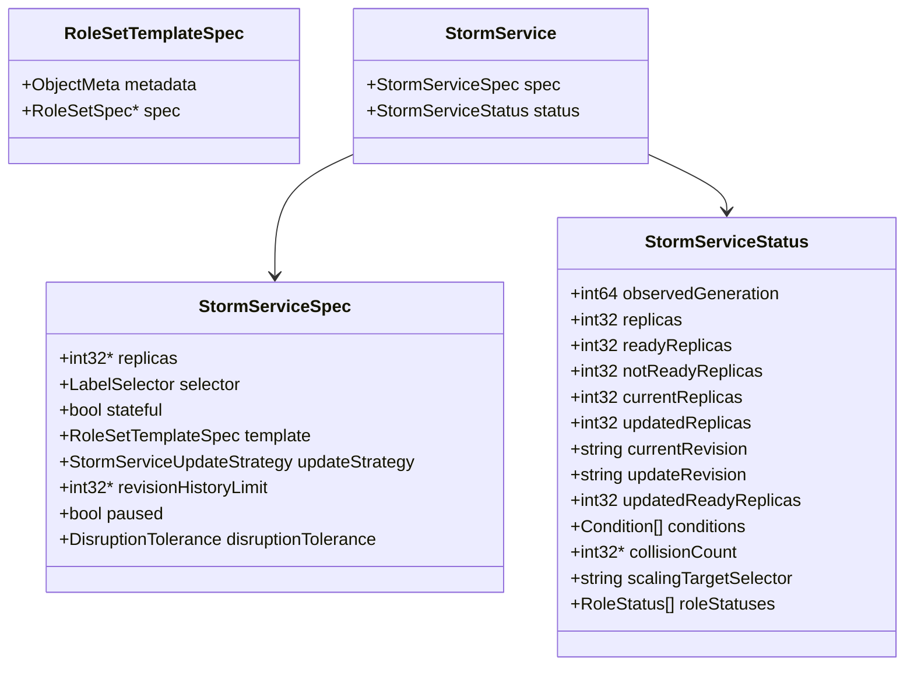
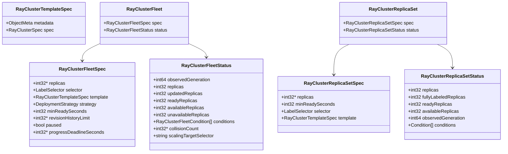
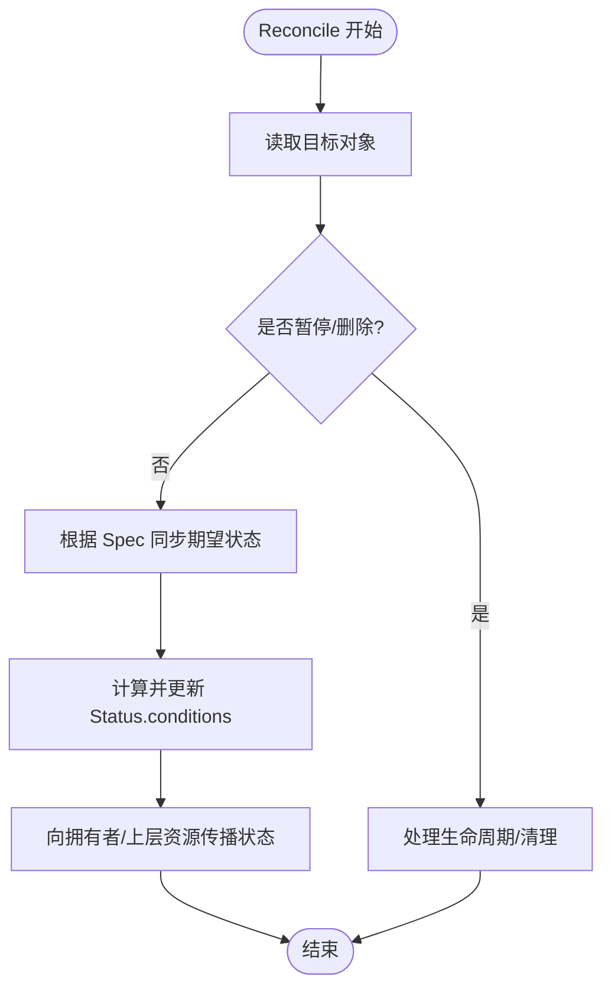
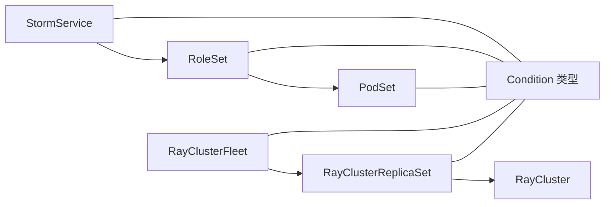

# 编排 CRD

<cite>
**本文引用的文件**
- [kvcache_types.go](file://api/orchestration/v1alpha1/kvcache_types.go)
- [podset_types.go](file://api/orchestration/v1alpha1/podset_types.go)
- [roleset_types.go](file://api/orchestration/v1alpha1/roleset_types.go)
- [stormservice_types.go](file://api/orchestration/v1alpha1/stormservice_types.go)
- [raycluster_type.go](file://api/orchestration/v1alpha1/raycluster_type.go)
- [rayclusterfleet_types.go](file://api/orchestration/v1alpha1/rayclusterfleet_types.go)
- [rayclusterreplicaset_types.go](file://api/orchestration/v1alpha1/rayclusterreplicaset_types.go)
- [condition.go](file://api/orchestration/v1alpha1/condition.go)
- [stormservice_controller.go](file://pkg/controller/stormservice/stormservice_controller.go)
- [roleset_controller.go](file://pkg/controller/roleset/roleset_controller.go)
- [rayclusterfleet_controller.go](file://pkg/controller/rayclusterfleet/rayclusterfleet_controller.go)
- [orchestration_v1alpha1_kvcache.yaml](file://config/samples/orchestration_v1alpha1_kvcache.yaml)
- [orchestration_v1alpha1_stormservice.yaml](file://config/samples/orchestration_v1alpha1_stormservice.yaml)
- [orchestration_v1alpha1_roleset.yaml](file://config/samples/orchestration_v1alpha1_roleset.yaml)
- [raycluster.yaml](file://development/tutorials/distributed/raycluster.yaml)
- [fleet.yaml](file://development/tutorials/distributed/fleet.yaml)
</cite>

## 目录
1. [简介](#简介)
2. [项目结构](#项目结构)
3. [核心组件](#核心组件)
4. [架构总览](#架构总览)
5. [详细组件分析](#详细组件分析)
6. [依赖关系分析](#依赖关系分析)
7. [性能与可扩展性](#性能与可扩展性)
8. [故障排除指南](#故障排除指南)
9. [结论](#结论)
10. [附录：YAML 示例与命令](#附录yaml-示例与命令)

## 简介
本文件为 AIBrix 编排 CRD 的权威 API 参考，覆盖以下资源：
- KVCache：键值缓存服务编排
- PodSet：原子化 Pod 组（内部使用）
- RoleSet：角色集编排（含多节点、滚动升级、亲和/调度策略）
- StormService：面向角色集的服务编排控制器（支持滚动/就地更新、修订历史、暂停与回滚）
- RayCluster：Ray 集群（通过模板嵌入 KubeRay 官方 CRD 规范）
- RayClusterFleet：Ray 集群舰队（多副本、滚动/重建更新、暂停、回滚、期望与状态）
- RayClusterReplicaSet：Ray 集群副本集合（类 RS，但管理 RayCluster 模板）

文档聚焦于每个资源的 Spec/Status 字段定义、调度与状态管理、生命周期控制，并给出复杂场景的 YAML 示例、kubectl 命令、监控与故障排除建议。

## 项目结构
编排 CRD 定义位于 api/orchestration/v1alpha1，控制器位于 pkg/controller 下对应子目录；samples 与教程位于 config/samples 与 development/tutorials。

**图表来源**
- [kvcache_types.go:85-127](file://api/orchestration/v1alpha1/kvcache_types.go#L85-L127)
- [podset_types.go:24-122](file://api/orchestration/v1alpha1/podset_types.go#L24-L122)
- [roleset_types.go:28-242](file://api/orchestration/v1alpha1/roleset_types.go#L28-L242)
- [stormservice_types.go:24-189](file://api/orchestration/v1alpha1/stormservice_types.go#L24-L189)
- [raycluster_type.go:24-34](file://api/orchestration/v1alpha1/raycluster_type.go#L24-L34)
- [rayclusterfleet_types.go:27-167](file://api/orchestration/v1alpha1/rayclusterfleet_types.go#L27-L167)
- [rayclusterreplicaset_types.go:27-108](file://api/orchestration/v1alpha1/rayclusterreplicaset_types.go#L27-L108)
- [condition.go:24-123](file://api/orchestration/v1alpha1/condition.go#L24-L123)
- [stormservice_controller.go:62-83](file://pkg/controller/stormservice/stormservice_controller.go#L62-L83)
- [roleset_controller.go:66-91](file://pkg/controller/roleset/roleset_controller.go#L66-L91)
- [rayclusterfleet_controller.go:76-87](file://pkg/controller/rayclusterfleet/rayclusterfleet_controller.go#L76-L87)

**章节来源**
- [kvcache_types.go:1-141](file://api/orchestration/v1alpha1/kvcache_types.go#L1-L141)
- [podset_types.go:1-136](file://api/orchestration/v1alpha1/podset_types.go#L1-L136)
- [roleset_types.go:1-256](file://api/orchestration/v1alpha1/roleset_types.go#L1-L256)
- [stormservice_types.go:1-203](file://api/orchestration/v1alpha1/stormservice_types.go#L1-L203)
- [raycluster_type.go:1-35](file://api/orchestration/v1alpha1/raycluster_type.go#L1-L35)
- [rayclusterfleet_types.go:1-182](file://api/orchestration/v1alpha1/rayclusterfleet_types.go#L1-L182)
- [rayclusterreplicaset_types.go:1-123](file://api/orchestration/v1alpha1/rayclusterreplicaset_types.go#L1-L123)
- [condition.go:1-123](file://api/orchestration/v1alpha1/condition.go#L1-L123)

## 核心组件
- KVCache：集中式/分布式模式、元数据后端（Redis/Etcd）、数据平面镜像与资源、服务暴露、Watcher Pod
- PodSet：原子化 Pod 组，支持稳定网络身份、恢复策略（替换不健康/重建）
- RoleSet：角色集合，支持多节点组（PodGroupSize）、更新策略（并行/顺序/交错）、亲和/调度策略、中断容忍
- StormService：面向 RoleSet 的服务编排，支持滚动/就地更新、修订历史、暂停/回滚、聚合状态
- RayCluster：通过模板嵌入 KubeRay RayCluster 规范
- RayClusterFleet：多副本 Ray 集群舰队，滚动/重建更新、暂停、回滚、期望与状态
- RayClusterReplicaSet：类 RS，管理 RayCluster 模板

**章节来源**
- [kvcache_types.go:85-127](file://api/orchestration/v1alpha1/kvcache_types.go#L85-L127)
- [podset_types.go:24-122](file://api/orchestration/v1alpha1/podset_types.go#L24-L122)
- [roleset_types.go:28-242](file://api/orchestration/v1alpha1/roleset_types.go#L28-L242)
- [stormservice_types.go:24-189](file://api/orchestration/v1alpha1/stormservice_types.go#L24-L189)
- [raycluster_type.go:24-34](file://api/orchestration/v1alpha1/raycluster_type.go#L24-L34)
- [rayclusterfleet_types.go:27-167](file://api/orchestration/v1alpha1/rayclusterfleet_types.go#L27-L167)
- [rayclusterreplicaset_types.go:27-108](file://api/orchestration/v1alpha1/rayclusterreplicaset_types.go#L27-L108)

## 架构总览
下图展示控制器如何与 CRD 协作，以及资源间的拥有关系与状态传播。

**图表来源**
- [stormservice_controller.go:62-83](file://pkg/controller/stormservice/stormservice_controller.go#L62-L83)
- [roleset_controller.go:66-91](file://pkg/controller/roleset/roleset_controller.go#L66-L91)
- [podset_types.go:116-122](file://api/orchestration/v1alpha1/podset_types.go#L116-L122)
- [roleset_types.go:235-242](file://api/orchestration/v1alpha1/roleset_types.go#L235-L242)

## 详细组件分析

### KVCache API 规范
- 关键字段
  - mode：centralized 或 distributed
  - metadata：可选外部连接或内置运行时（Redis/Etcd）
  - cache：数据平面运行时（镜像、拉取策略、环境变量、资源、Pod 模板）
  - watcher：可选 Watcher Pod（用于成员注册）
  - service：Service 类型与端口
- 状态
  - readyReplicas、conditions
- 典型用途
  - 作为推理/路由层的 KV 缓存后端，支持集中式或分布式部署

**图表来源**
- [kvcache_types.go:85-127](file://api/orchestration/v1alpha1/kvcache_types.go#L85-L127)

**章节来源**
- [kvcache_types.go:24-127](file://api/orchestration/v1alpha1/kvcache_types.go#L24-L127)

### PodSet API 规范
- 关键字段
  - podGroupSize：组内 Pod 数量（2~100）
  - template：Pod 模板
  - stateful：是否需要稳定网络身份
  - recoveryPolicy：ReplaceUnhealthy 或 Recreate
  - schedulingStrategy：可选调度策略
- 状态
  - readyPods、totalPods、phase（Pending/Running/Ready/Failed）、conditions
- 使用场景
  - RoleSet 内部用于多节点角色实例

**图表来源**
- [podset_types.go:24-122](file://api/orchestration/v1alpha1/podset_types.go#L24-L122)

**章节来源**
- [podset_types.go:24-122](file://api/orchestration/v1alpha1/podset_types.go#L24-L122)

### RoleSet API 规范
- 关键字段
  - roles：角色数组（名称、副本数、升级顺序、PodGroupSize、更新策略、状态化、模板、中断容忍、调度策略）
  - updateStrategy：Parallel/Sequential/Interleave
  - schedulingStrategy：支持 Godel/Coscheduling/Volcano
- 状态
  - roles[].replicas/ready/notReady/updated 等聚合
  - conditions（Ready、ReplicaFailure、Progressing）
- 生命周期与更新
  - 支持多节点组（PodGroupSize>1）与 PodSet 协同
  - 通过中断容忍与更新策略控制滚动过程中的可用性

**图表来源**
- [roleset_types.go:28-242](file://api/orchestration/v1alpha1/roleset_types.go#L28-L242)

**章节来源**
- [roleset_types.go:28-242](file://api/orchestration/v1alpha1/roleset_types.go#L28-L242)

### StormService API 规范
- 关键字段
  - replicas、selector、template（RoleSet 模板）、updateStrategy（RollingUpdate/InPlaceUpdate）、revisionHistoryLimit、paused、disruptionTolerance
- 状态
  - replicas、readyReplicas、notReadyReplicas、current/updatedReplicas、current/updateRevision、conditions、collisionCount、scalingTargetSelector、roleStatuses
- 生命周期与控制
  - 通过修订历史支持回滚
  - 支持暂停与继续
  - 提供聚合角色级统计（跨 RoleSet 聚合）

**图表来源**
- [stormservice_types.go:24-189](file://api/orchestration/v1alpha1/stormservice_types.go#L24-L189)

**章节来源**
- [stormservice_types.go:24-189](file://api/orchestration/v1alpha1/stormservice_types.go#L24-L189)

### RayCluster、RayClusterFleet、RayClusterReplicaSet API 规范
- RayClusterTemplateSpec：封装标准对象元数据与 KubeRay RayClusterSpec
- RayClusterFleet
  - replicas、selector、template、strategy（Deployment 策略）、minReadySeconds、revisionHistoryLimit、paused、progressDeadlineSeconds
  - 状态包含 replicas、updatedReplicas、ready/available/unavailable、conditions、collisionCount、scalingTargetSelector
- RayClusterReplicaSet
  - replicas、minReadySeconds、selector、template
  - 状态包含 replicas、fullyLabeledReplicas、ready/available、observedGeneration、conditions

**图表来源**
- [raycluster_type.go:24-34](file://api/orchestration/v1alpha1/raycluster_type.go#L24-L34)
- [rayclusterfleet_types.go:27-167](file://api/orchestration/v1alpha1/rayclusterfleet_types.go#L27-L167)
- [rayclusterreplicaset_types.go:27-108](file://api/orchestration/v1alpha1/rayclusterreplicaset_types.go#L27-L108)

**章节来源**
- [raycluster_type.go:24-34](file://api/orchestration/v1alpha1/raycluster_type.go#L24-L34)
- [rayclusterfleet_types.go:27-167](file://api/orchestration/v1alpha1/rayclusterfleet_types.go#L27-L167)
- [rayclusterreplicaset_types.go:27-108](file://api/orchestration/v1alpha1/rayclusterreplicaset_types.go#L27-L108)

### 条件与状态传播
- 通用条件类型：包含类型、状态、最近转换时间、最近更新时间、原因与消息
- 各资源通过 conditions 字段反映当前状态，控制器在 Reconcile 中更新状态并传播到上层资源（如 StormService 聚合 RoleSet 状态）

**图表来源**
- [condition.go:24-123](file://api/orchestration/v1alpha1/condition.go#L24-L123)
- [roleset_controller.go:135-166](file://pkg/controller/roleset/roleset_controller.go#L135-L166)
- [stormservice_controller.go:126-147](file://pkg/controller/stormservice/stormservice_controller.go#L126-L147)

**章节来源**
- [condition.go:24-123](file://api/orchestration/v1alpha1/condition.go#L24-L123)
- [roleset_controller.go:135-166](file://pkg/controller/roleset/roleset_controller.go#L135-L166)
- [stormservice_controller.go:126-147](file://pkg/controller/stormservice/stormservice_controller.go#L126-L147)

## 依赖关系分析
- StormService 拥有 RoleSet，RoleSet 在 PodGroupSize>1 时拥有 PodSet
- RayClusterFleet 拥有 RayClusterReplicaSet 与 RayCluster
- 所有资源共享统一的条件类型系统

**图表来源**
- [stormservice_controller.go:62-83](file://pkg/controller/stormservice/stormservice_controller.go#L62-L83)
- [roleset_controller.go:66-91](file://pkg/controller/roleset/roleset_controller.go#L66-L91)
- [rayclusterfleet_controller.go:76-87](file://pkg/controller/rayclusterfleet/rayclusterfleet_controller.go#L76-L87)
- [condition.go:24-123](file://api/orchestration/v1alpha1/condition.go#L24-L123)

**章节来源**
- [stormservice_controller.go:62-83](file://pkg/controller/stormservice/stormservice_controller.go#L62-L83)
- [roleset_controller.go:66-91](file://pkg/controller/roleset/roleset_controller.go#L66-L91)
- [rayclusterfleet_controller.go:76-87](file://pkg/controller/rayclusterfleet/rayclusterfleet_controller.go#L76-L87)

## 性能与可扩展性
- 并行更新：RoleSet 支持 Parallel/Interleave 策略以加速滚动
- 调度协同：支持 Godel/Coscheduling/Volcano 的最小成员/资源约束与亲和规则
- Fleet 滚动：RayClusterFleet 支持滚动/重建更新与进度截止时间，避免长时间卡顿
- 资源隔离：通过 PodGroupSize 将多节点角色拆分为 PodSet，提升稳定性与可观测性

[本节为通用指导，无需特定文件来源]

## 故障排除指南
- 观察状态与条件
  - 使用 kubectl describe 获取各资源的 conditions 与事件
  - StormService 通过 status.conditions 与 roleStatuses 辅助定位问题
- 调度问题
  - 检查 SchedulingStrategy 的最小成员/资源与亲和设置
  - 对比节点资源与 Pod 资源请求/限制
- 更新失败
  - 查看 Revision 历史与回滚点
  - 检查 MaxUnavailable/MaxSurge 设置是否导致不可用窗口过大
- RayCluster Fleet
  - 关注 Available/Progressing 条件与 UnavailableReplicas
  - 检查 paused 与 progressDeadlineSeconds

**章节来源**
- [stormservice_types.go:77-134](file://api/orchestration/v1alpha1/stormservice_types.go#L77-L134)
- [rayclusterfleet_types.go:76-119](file://api/orchestration/v1alpha1/rayclusterfleet_types.go#L76-L119)
- [roleset_types.go:130-140](file://api/orchestration/v1alpha1/roleset_types.go#L130-L140)

## 结论
AIBrix 编排 CRD 通过 StormService、RoleSet、PodSet、RayClusterFleet 等资源形成从“服务编排”到“Ray 集群舰队”的完整链路。配合丰富的调度策略、更新策略与状态条件，能够支撑多节点推理、滚动更新、故障恢复与可观测性需求。建议在生产中结合中断容忍、最小可用与亲和策略，确保高可用与可预测性。

[本节为总结，无需特定文件来源]

## 附录：YAML 示例与命令

### KVCache 示例
- 示例路径：[orchestration_v1alpha1_kvcache.yaml:1-25](file://config/samples/orchestration_v1alpha1_kvcache.yaml#L1-L25)

**章节来源**
- [orchestration_v1alpha1_kvcache.yaml:1-25](file://config/samples/orchestration_v1alpha1_kvcache.yaml#L1-L25)

### StormService 示例
- 示例路径：[orchestration_v1alpha1_stormservice.yaml:1-10](file://config/samples/orchestration_v1alpha1_stormservice.yaml#L1-L10)

**章节来源**
- [orchestration_v1alpha1_stormservice.yaml:1-10](file://config/samples/orchestration_v1alpha1_stormservice.yaml#L1-L10)

### RoleSet 示例
- 示例路径：[orchestration_v1alpha1_roleset.yaml:1-10](file://config/samples/orchestration_v1alpha1_roleset.yaml#L1-L10)

**章节来源**
- [orchestration_v1alpha1_roleset.yaml:1-10](file://config/samples/orchestration_v1alpha1_roleset.yaml#L1-L10)

### RayCluster 与 Fleet 示例
- RayCluster 示例：[raycluster.yaml:1-66](file://development/tutorials/distributed/raycluster.yaml#L1-L66)
- Fleet 示例：[fleet.yaml:1-79](file://development/tutorials/distributed/fleet.yaml#L1-L79)

**章节来源**
- [raycluster.yaml:1-66](file://development/tutorials/distributed/raycluster.yaml#L1-L66)
- [fleet.yaml:1-79](file://development/tutorials/distributed/fleet.yaml#L1-L79)

### 常用 kubectl 命令
- 获取资源列表
  - kubectl get stormservices,rolesets,podsets,kvcaches,rayclusterfleets,rayclusterreplicasets -A
- 查看详细状态
  - kubectl describe stormservice <name> -n <namespace>
  - kubectl describe roleset <name> -n <namespace>
  - kubectl describe rayclusterfleet <name> -n <namespace>
- 实时观察
  - kubectl get events -w -n <namespace>
- 回滚（StormService）
  - kubectl rollout undo stormservice/<name> --to-revision=<N>
- 暂停/继续（RayClusterFleet）
  - kubectl patch rayclusterfleet/<name> -p '{"spec":{"paused":true}}' -n <namespace>
  - kubectl patch rayclusterfleet/<name> -p '{"spec":{"paused":false}}' -n <namespace>

[本节为操作指引，无需特定文件来源]