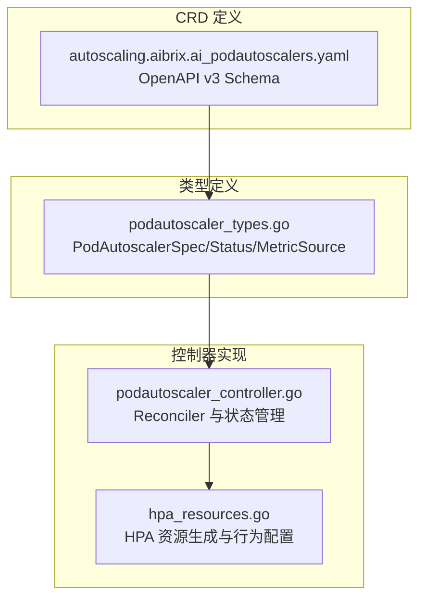
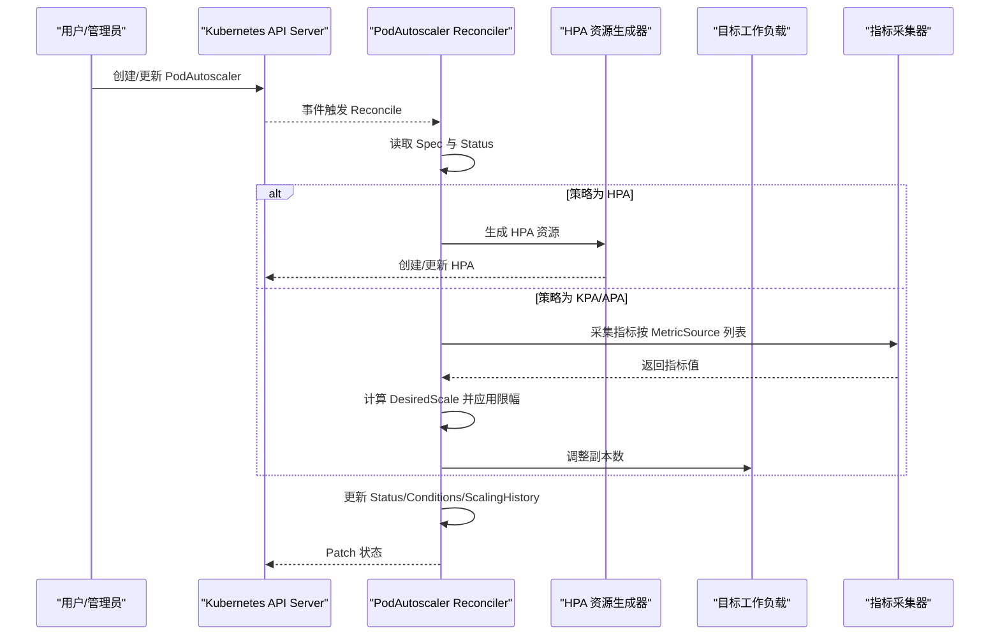
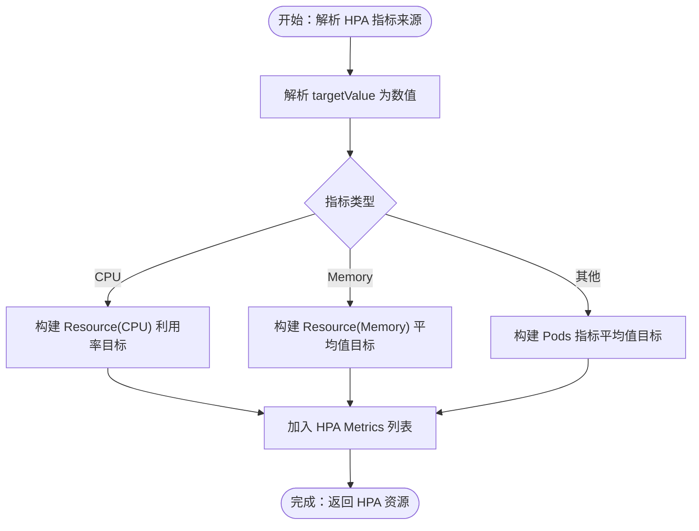
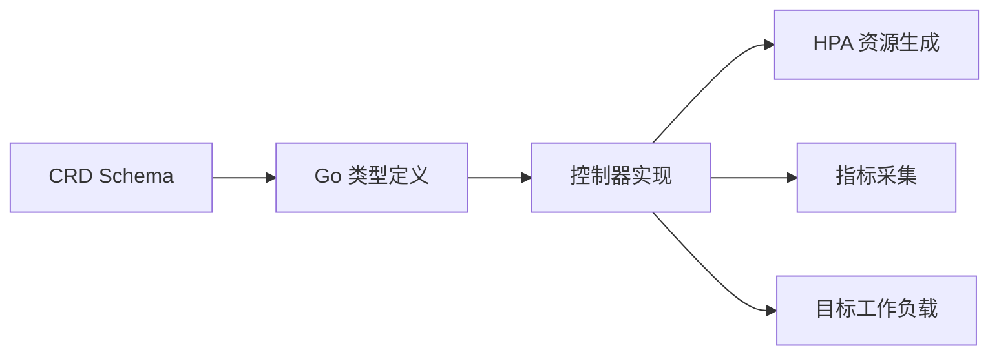

# 自动伸缩 CRD

<cite>
**本文档引用的文件**
- [podautoscaler_types.go](file://api/autoscaling/v1alpha1/podautoscaler_types.go)
- [autoscaling.aibrix.ai_podautoscalers.yaml](file://config/crd/autoscaling/autoscaling.aibrix.ai_podautoscalers.yaml)
- [autoscaling_v1alpha1_podautoscaler.yaml](file://config/samples/autoscaling_v1alpha1_podautoscaler.yaml)
- [autoscaling_v1alpha1_kpa.yaml](file://config/samples/autoscaling_v1alpha1_kpa.yaml)
- [autoscaling_v1alpha1_mock_llama_apa.yaml](file://config/samples/autoscaling_v1alpha1_mock_llama_apa.yaml)
- [hpa.yaml](file://samples/autoscaling/hpa.yaml)
- [kpa.yaml](file://samples/autoscaling/kpa.yaml)
- [apa.yaml](file://samples/autoscaling/apa.yaml)
- [multimetrics-apa.yaml](file://samples/autoscaling/multimetrics-apa.yaml)
- [podautoscaler_controller.go](file://pkg/controller/podautoscaler/podautoscaler_controller.go)
- [hpa_resources.go](file://pkg/controller/podautoscaler/hpa_resources.go)
</cite>

## 目录
1. [简介](#简介)
2. [项目结构](#项目结构)
3. [核心组件](#核心组件)
4. [架构总览](#架构总览)
5. [详细组件分析](#详细组件分析)
6. [依赖关系分析](#依赖关系分析)
7. [性能考量](#性能考量)
8. [故障排查指南](#故障排查指南)
9. [结论](#结论)
10. [附录](#附录)

## 简介
本文件为 AIBrix 的自动伸缩 CRD（PodAutoscaler）提供完整的 API 参考与实践指南。重点覆盖以下内容：
- PodAutoscaler 资源的完整 API 规范：Spec 与 Status 字段定义
- 缩放策略类型：HPA（Kubernetes 原生）、KPA（Knative 风格）、APA（应用内算法）
- 指标来源配置：pod/resource/custom/external/domain
- 度量标准与阈值设置：targetMetric 与 targetValue
- 目标引用与子目标选择器：ScaleTargetRef 与 SubTargetSelector
- 缩放决策历史记录、状态条件与缩放历史管理
- 完整 YAML 示例：基于 CPU、内存、QPS 与自定义指标的策略
- kubectl 常用命令与常见配置模式

## 项目结构
PodAutoscaler CRD 由三部分组成：
- CRD 定义：OpenAPI v3 Schema 描述字段约束与校验
- 类型定义：Go 结构体与常量，定义字段语义与枚举值
- 控制器实现：根据策略类型执行缩放逻辑（HPA/KPA/APA）

图表来源
- [autoscaling.aibrix.ai_podautoscalers.yaml:34-198](file://config/crd/autoscaling/autoscaling.aibrix.ai_podautoscalers.yaml#L34-L198)
- [podautoscaler_types.go:42-230](file://api/autoscaling/v1alpha1/podautoscaler_types.go#L42-L230)
- [podautoscaler_controller.go:103-200](file://pkg/controller/podautoscaler/podautoscaler_controller.go#L103-L200)
- [hpa_resources.go:35-191](file://pkg/controller/podautoscaler/hpa_resources.go#L35-L191)

章节来源
- [autoscaling.aibrix.ai_podautoscalers.yaml:1-198](file://config/crd/autoscaling/autoscaling.aibrix.ai_podautoscalers.yaml#L1-L198)
- [podautoscaler_types.go:42-230](file://api/autoscaling/v1alpha1/podautoscaler_types.go#L42-L230)

## 核心组件
- PodAutoscalerSpec：描述期望状态，包含目标引用、最小/最大副本数、指标来源列表、缩放策略类型等
- PodAutoscalerStatus：描述观测到的状态，包含上次缩放时间、期望副本数、实际副本数、状态条件、缩放历史
- MetricSource：指标来源定义，支持 pod/resource/custom/external/domain
- ScalingStrategyType：缩放策略类型枚举（HPA/KPA/APA）
- SubTargetSelector：在目标资源内部进一步选择子组件（如 StormService/RoleSet 的角色名）

章节来源
- [podautoscaler_types.go:53-198](file://api/autoscaling/v1alpha1/podautoscaler_types.go#L53-L198)

## 架构总览
PodAutoscaler 控制器在每次 Reconcile 中：
- 解析 PodAutoscaler 规格与状态
- 根据策略类型（HPA/KPA/APA）选择对应处理路径
- 对于 HPA：生成并维护底层 HorizontalPodAutoscaler 资源
- 对于 KPA/APA：采集指标、计算目标副本数、更新状态与历史记录
- 更新 PodAutoscaler 的 Status 字段与 Conditions

图表来源
- [podautoscaler_controller.go:103-200](file://pkg/controller/podautoscaler/podautoscaler_controller.go#L103-L200)
- [hpa_resources.go:35-191](file://pkg/controller/podautoscaler/hpa_resources.go#L35-L191)

## 详细组件分析

### PodAutoscaler API 规范
- 资源组与版本：autoscaling.aibrix.ai/v1alpha1
- Kind：PodAutoscaler
- Scope：Namespaced
- 支持的打印列：MINPODS、MAXPODS、REPLICAS、STRATEGY、AGE

字段说明（摘自 OpenAPI Schema 与 Go 类型定义）：
- spec.scaleTargetRef：指向可缩放的目标资源（如 Deployment），必填
- spec.subTargetSelector：在目标资源内部选择子组件（如角色名），可选
- spec.minReplicas：最小副本数，可选
- spec.maxReplicas：最大副本数，必填
- spec.scalingStrategy：缩放策略类型，必填（HPA/KPA/APA）
- spec.metricsSources：指标来源数组，至少一项，必填
  - metricSourceType：指标来源类型（pod/resource/custom/external/domain）
  - protocolType：协议类型（http/https），仅对 pod/external 生效
  - endpoint：外部服务端点，仅对 external 生效
  - path/port：指标端点路径与端口，仅对 pod/external 生效
  - targetMetric：目标指标名称（如 cpu/memory/qps 或自定义指标键）
  - targetValue：阈值字符串（数值或带单位的 Quantity）
- status.lastScaleTime：上次缩放时间
- status.desiredScale：根据指标计算出的期望副本数
- status.actualScale：当前实际运行副本数
- status.conditions：状态条件数组
- status.scalingHistory：最近 N 条缩放决策（最多 5 条）

章节来源
- [autoscaling.aibrix.ai_podautoscalers.yaml:43-198](file://config/crd/autoscaling/autoscaling.aibrix.ai_podautoscalers.yaml#L43-L198)
- [podautoscaler_types.go:53-198](file://api/autoscaling/v1alpha1/podautoscaler_types.go#L53-L198)

### 缩放策略类型
- HPA（Kubernetes 原生）：通过生成并维护底层 HPA 资源实现缩放；支持基于 CPU/内存/自定义指标的利用率或平均值目标
- KPA（Knative 风格）：支持稳定/恐慌窗口与缩放延迟等参数，适合低延迟响应场景
- APA（应用内算法）：面向应用特定指标（如 GPU 缓存利用率、请求等待数等），支持注解控制波动容忍与窗口

章节来源
- [podautoscaler_types.go:96-105](file://api/autoscaling/v1alpha1/podautoscaler_types.go#L96-L105)
- [podautoscaler_controller.go:18-27](file://pkg/controller/podautoscaler/podautoscaler_controller.go#L18-L27)

### 指标来源与阈值配置
- pod：从 Pod 端点拉取指标，需指定 protocolType、port、path
- resource：从资源指标 API 获取 cpu/memory，targetMetric 使用预定义常量
- custom：从自定义指标 API 获取指标，targetMetric 为自定义指标名
- external：从外部服务（如 gpu-optimizer）拉取指标，需指定 endpoint、protocolType（可选）
- domain：已弃用，请使用 external

阈值 targetValue 为字符串形式，解析为数值或带单位的 Quantity，具体含义取决于指标类型。

章节来源
- [podautoscaler_types.go:107-121](file://api/autoscaling/v1alpha1/podautoscaler_types.go#L107-L121)
- [podautoscaler_types.go:214-221](file://api/autoscaling/v1alpha1/podautoscaler_types.go#L214-L221)

### 目标引用与子目标选择器
- ScaleTargetRef：引用目标工作负载（apiVersion/kind/name），用于控制器定位被缩放对象
- SubTargetSelector：在目标资源内部进一步选择子组件（如 StormService/RoleSet 的角色名）
- 注：注释中还提到 PodSelector，但当前类型定义未包含该字段

章节来源
- [podautoscaler_types.go:57-67](file://api/autoscaling/v1alpha1/podautoscaler_types.go#L57-L67)
- [podautoscaler_types.go:86-91](file://api/autoscaling/v1alpha1/podautoscaler_types.go#L86-L91)

### 缩放决策历史、状态条件与缩放历史
- ScalingDecision：单次缩放决策记录，包含时间戳、前/后副本数、原因、成功与否及错误信息
- Status.conditions：状态条件集合，用于表达缩放器是否可用、是否存在冲突等
- Status.scalingHistory：最近 N 条缩放决策（最多 5 条），用于审计与回溯

章节来源
- [podautoscaler_types.go:154-198](file://api/autoscaling/v1alpha1/podautoscaler_types.go#L154-L198)

### HPA 行为配置（HPA 策略）
- 生成 HPA 资源时，会将指标来源转换为 HPA 的 MetricSpec 列表
- 支持 CPU 利用率、内存平均值、以及自定义指标平均值
- 行为配置（冷却窗口、最大缩放比例）来自 ScalingContext，映射为 HPA 的 ScaleUp/ScaleDown 策略

图表来源
- [hpa_resources.go:76-125](file://pkg/controller/podautoscaler/hpa_resources.go#L76-L125)

章节来源
- [hpa_resources.go:35-191](file://pkg/controller/podautoscaler/hpa_resources.go#L35-L191)

### YAML 示例与配置模式
以下示例展示了不同策略与指标类型的配置方式。请结合自身环境调整 apiVersion、kind、name、namespace、targetMetric、targetValue、metricsSources 等字段。

- 基于 HPA 的 CPU 利用率缩放
  - 示例路径：[hpa.yaml:1-24](file://samples/autoscaling/hpa.yaml#L1-L24)
- 基于 KPA 的 GPU 缓存利用率缩放
  - 示例路径：[kpa.yaml:1-26](file://samples/autoscaling/kpa.yaml#L1-L26)
- 基于 APA 的 GPU 缓存利用率缩放
  - 示例路径：[apa.yaml:1-28](file://samples/autoscaling/apa.yaml#L1-L28)
- 多指标 APA（GPU 缓存利用率 + 请求等待数）
  - 示例路径：[multimetrics-apa.yaml:1-34](file://samples/autoscaling/multimetrics-apa.yaml#L1-L34)
- 传统示例（HPA/KPA/APA）
  - 示例路径：[autoscaling_v1alpha1_podautoscaler.yaml:1-18](file://config/samples/autoscaling_v1alpha1_podautoscaler.yaml#L1-L18)
  - 示例路径：[autoscaling_v1alpha1_kpa.yaml:1-18](file://config/samples/autoscaling_v1alpha1_kpa.yaml#L1-L18)
  - 示例路径：[autoscaling_v1alpha1_mock_llama_apa.yaml:1-18](file://config/samples/autoscaling_v1alpha1_mock_llama_apa.yaml#L1-L18)

常见配置模式建议：
- HPA：适用于通用资源指标（CPU/内存）与自定义指标，适合与 KEDA 类似的场景
- KPA：适用于需要稳定/恐慌窗口与缩放延迟的低延迟场景
- APA：适用于应用内特定指标（如 GPU 缓存利用率、请求等待数等），可通过注解微调波动容忍与窗口

## 依赖关系分析
- CRD 定义与类型定义强绑定：OpenAPI Schema 与 Go 结构体字段一一对应
- 控制器依赖指标客户端（资源/自定义）与目标工作负载客户端
- HPA 策略依赖 Kubernetes HPA 资源与行为配置

图表来源
- [autoscaling.aibrix.ai_podautoscalers.yaml:34-198](file://config/crd/autoscaling/autoscaling.aibrix.ai_podautoscalers.yaml#L34-L198)
- [podautoscaler_types.go:42-230](file://api/autoscaling/v1alpha1/podautoscaler_types.go#L42-L230)
- [podautoscaler_controller.go:113-163](file://pkg/controller/podautoscaler/podautoscaler_controller.go#L113-L163)
- [hpa_resources.go:35-191](file://pkg/controller/podautoscaler/hpa_resources.go#L35-L191)

章节来源
- [podautoscaler_controller.go:113-163](file://pkg/controller/podautoscaler/podautoscaler_controller.go#L113-L163)

## 性能考量
- 指标采集频率与缓存：合理设置指标采集间隔，避免频繁查询导致 API 压力
- HPA 冷却窗口与缩放比例：通过行为配置限制缩放速率与稳定窗口，降低抖动
- APA 波动容忍与窗口：通过注解控制上下波动容忍与观测窗口，提升稳定性
- 副本数边界：minReplicas 与 maxReplicas 合理设置，避免过度缩放

## 故障排查指南
常见问题与定位思路：
- 缩放不生效
  - 检查策略类型与指标来源是否匹配（如 HPA 是否正确配置资源/自定义指标）
  - 查看 Status.conditions 中的 ScalingActive/AbleToScale 等条件
  - 关注 ScalingHistory 中的错误信息
- 指标解析失败
  - 确认 targetValue 为可解析的数值或带单位的 Quantity
  - 对于 pod/external 指标，确认 protocolType、endpoint、port、path 正确
- HPA 行为异常
  - 检查冷却窗口与最大缩放比例配置是否合理
  - 确认目标工作负载的资源限制与请求设置，避免指标不可用
- 多个 PodAutoscaler 冲突
  - 检查是否存在多个 PA 同时作用于同一目标，关注 Conflict 条件

章节来源
- [podautoscaler_controller.go:77-95](file://pkg/controller/podautoscaler/podautoscaler_controller.go#L77-L95)
- [hpa_resources.go:130-191](file://pkg/controller/podautoscaler/hpa_resources.go#L130-L191)

## 结论
PodAutoscaler 提供了统一的自动伸缩抽象，支持 HPA/KPA/APA 三种策略与多类指标来源。通过明确的 API 规范与控制器实现，用户可以灵活地针对 CPU、内存、QPS 以及应用内自定义指标进行缩放。建议结合业务特征选择合适策略，并通过注解与行为配置优化稳定性与响应速度。

## 附录

### kubectl 常用命令
- 应用 CRD 与示例
  - 安装 CRD：kubectl apply -f config/crd/autoscaling/autoscaling.aibrix.ai_podautoscalers.yaml
  - 应用示例：kubectl apply -f samples/autoscaling/hpa.yaml
- 查看资源
  - 列出 PodAutoscaler：kubectl get podautoscalers
  - 查看详细状态：kubectl get podautoscalers -o yaml
  - 查看状态条件：kubectl describe podautoscalers <name>
- 调试
  - 查看控制器日志：kubectl logs -n <controller-namespace> -l app.kubernetes.io/name=aibrix
  - 查看 HPA 资源（若策略为 HPA）：kubectl get hpa -l <selector>