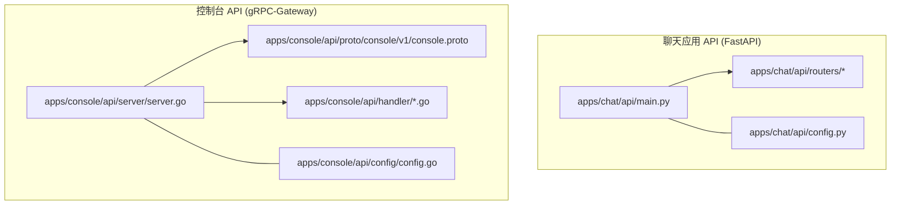
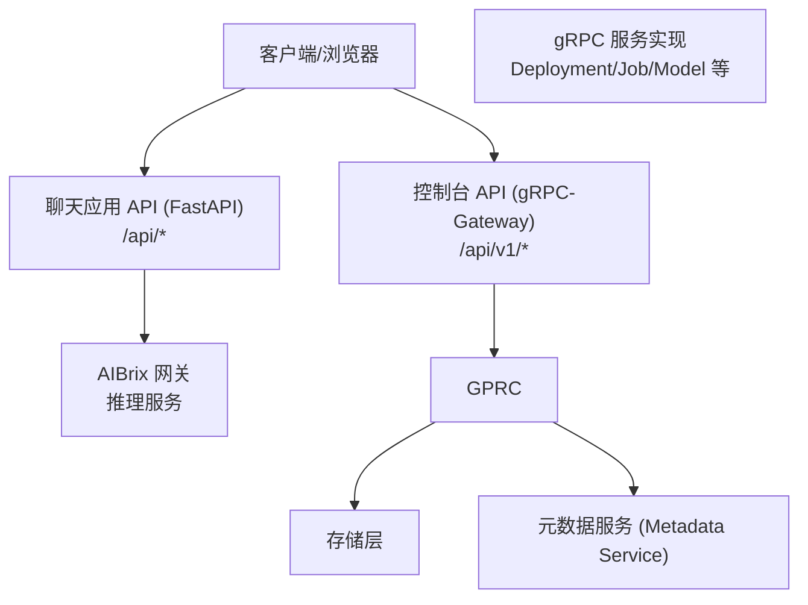
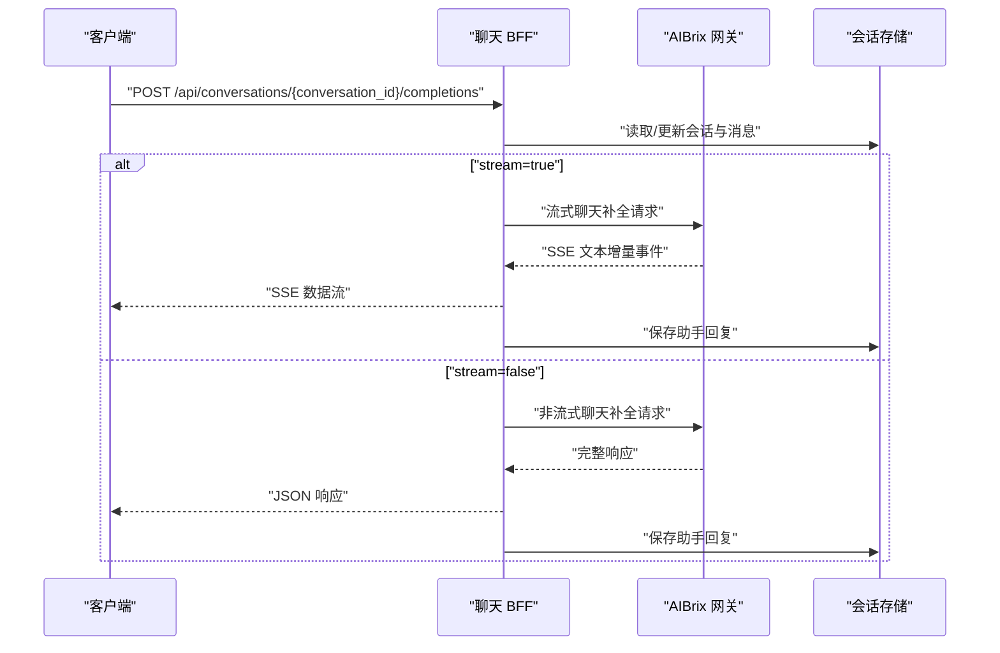
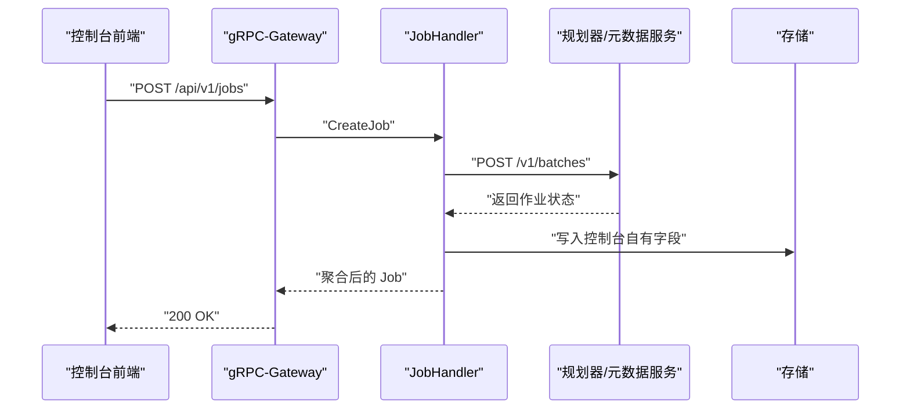
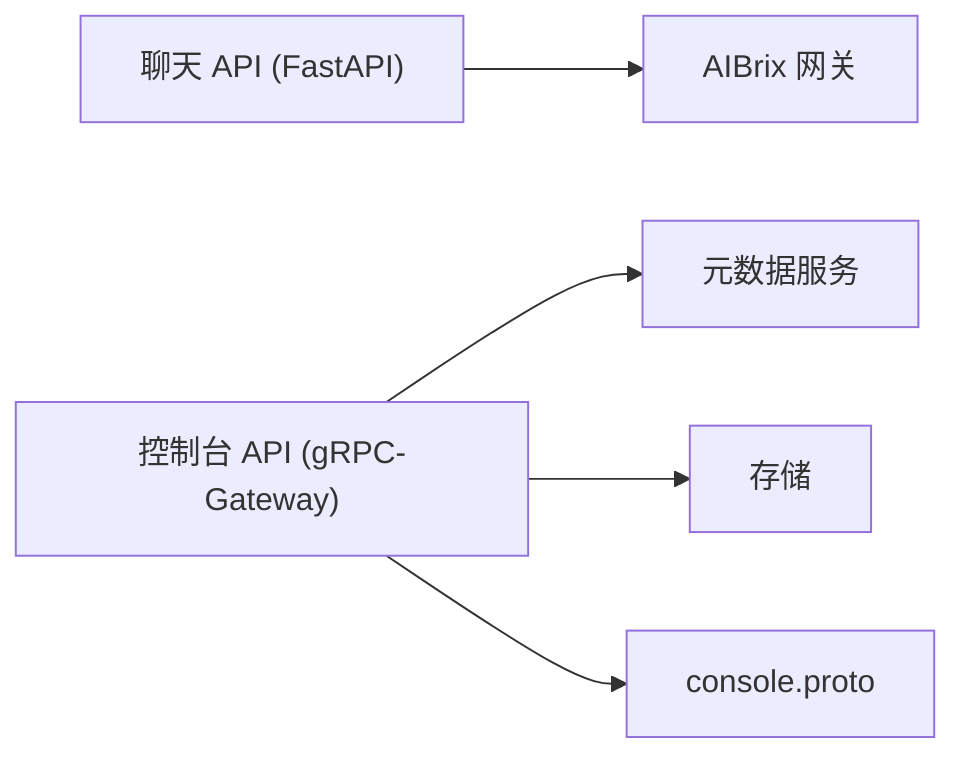

# RESTful API

<cite>
**本文引用的文件**
- [apps/chat/api/main.py](file://apps/chat/api/main.py)
- [apps/chat/api/routers/chat.py](file://apps/chat/api/routers/chat.py)
- [apps/chat/api/config.py](file://apps/chat/api/config.py)
- [apps/console/api/server/server.go](file://apps/console/api/server/server.go)
- [apps/console/api/config/config.go](file://apps/console/api/config/config.go)
- [apps/console/api/proto/console/v1/console.proto](file://apps/console/api/proto/console/v1/console.proto)
- [apps/console/api/handler/deployment.go](file://apps/console/api/handler/deployment.go)
- [apps/console/api/handler/job.go](file://apps/console/api/handler/job.go)
- [apps/console/api/handler/model.go](file://apps/console/api/handler/model.go)
</cite>

## 目录
1. [简介](#简介)
2. [项目结构](#项目结构)
3. [核心组件](#核心组件)
4. [架构总览](#架构总览)
5. [详细组件分析](#详细组件分析)
6. [依赖分析](#依赖分析)
7. [性能考虑](#性能考虑)
8. [故障排查指南](#故障排查指南)
9. [结论](#结论)
10. [附录](#附录)

## 简介
本文件为 AIBrix 的 RESTful API 参考文档，覆盖以下三类 API：
- 聊天应用 API（BFF 层）：面向前端的统一入口，提供认证、会话管理、消息处理、文件上传与媒体能力等。
- 控制台 API（gRPC-Gateway）：面向管理员与控制台前端的管理接口，涵盖部署管理、作业管理（批推理）、模型目录、配额与密钥管理等。
- 网关 API（概念性说明）：通过 Envoy Gateway 将外部流量路由到后端推理服务，支持路由与负载均衡。

文档同时给出认证方式、API 版本控制、速率限制策略建议、请求/响应格式、状态码定义、错误处理机制，并提供 curl 示例与 SDK 使用指引，帮助开发者快速集成。

## 项目结构
- 聊天应用 API（Python FastAPI）位于 apps/chat/api，提供 OpenAI 兼容的聊天补全、SSE 流式输出、文件上传、CORS 支持与静态资源回退。
- 控制台 API（Go gRPC-Gateway）位于 apps/console/api，通过 proto 定义服务与 HTTP 映射，注册到 grpc-gateway 并暴露统一 REST 接口。
- 配置层分别在 apps/chat/api/config.py 与 apps/console/api/config/config.go 中，分别管理聊天应用与控制台服务的运行时配置。

**图表来源**
- [apps/chat/api/main.py:1-87](file://apps/chat/api/main.py#L1-L87)
- [apps/chat/api/routers/chat.py:1-199](file://apps/chat/api/routers/chat.py#L1-L199)
- [apps/chat/api/config.py:1-94](file://apps/chat/api/config.py#L1-L94)
- [apps/console/api/server/server.go:1-291](file://apps/console/api/server/server.go#L1-L291)
- [apps/console/api/config/config.go:1-219](file://apps/console/api/config/config.go#L1-L219)
- [apps/console/api/proto/console/v1/console.proto:1-672](file://apps/console/api/proto/console/v1/console.proto#L1-L672)
- [apps/console/api/handler/deployment.go:1-58](file://apps/console/api/handler/deployment.go#L1-L58)
- [apps/console/api/handler/job.go:1-456](file://apps/console/api/handler/job.go#L1-L456)
- [apps/console/api/handler/model.go:1-46](file://apps/console/api/handler/model.go#L1-L46)

**章节来源**
- [apps/chat/api/main.py:1-87](file://apps/chat/api/main.py#L1-L87)
- [apps/chat/api/routers/chat.py:1-199](file://apps/chat/api/routers/chat.py#L1-L199)
- [apps/chat/api/config.py:1-94](file://apps/chat/api/config.py#L1-L94)
- [apps/console/api/server/server.go:1-291](file://apps/console/api/server/server.go#L1-L291)
- [apps/console/api/config/config.go:1-219](file://apps/console/api/config/config.go#L1-L219)
- [apps/console/api/proto/console/v1/console.proto:1-672](file://apps/console/api/proto/console/v1/console.proto#L1-L672)
- [apps/console/api/handler/deployment.go:1-58](file://apps/console/api/handler/deployment.go#L1-L58)
- [apps/console/api/handler/job.go:1-456](file://apps/console/api/handler/job.go#L1-L456)
- [apps/console/api/handler/model.go:1-46](file://apps/console/api/handler/model.go#L1-L46)

## 核心组件
- 聊天应用 API（BFF）
  - 统一入口：FastAPI 应用，挂载认证、健康检查、模型列表、会话、聊天补全、项目、图片/音频/视频等路由。
  - 认证：支持“无”或“简单”两种模式；生产环境建议使用 OIDC 或 Basic。
  - 代理：将聊天请求转发至 AIBrix 网关或其他 OpenAI 兼容端点。
  - SSE：流式返回聊天结果，非流式则一次性返回完整响应。
  - 文件上传：支持图片预览与大小限制，附件随消息上送。
- 控制台 API（gRPC-Gateway）
  - 服务定义：console.v1 下的 DeploymentService、JobService、ModelService、ModelDeploymentTemplateService、APIKeyService、SecretService、QuotaService。
  - HTTP 映射：每个 RPC 通过 google.api.http 注解映射到 /api/v1/* REST 路由。
  - 网关：grpc-gateway 将 HTTP 请求转译为 gRPC，再由 Handler 实现调用存储层。
  - 认证：支持 dev、OIDC、Basic 三种模式，可配置会话密钥与加密密钥。
  - 文件代理：提供文件上传/下载代理与 Playground SSE 转发。

**章节来源**
- [apps/chat/api/main.py:1-87](file://apps/chat/api/main.py#L1-L87)
- [apps/chat/api/routers/chat.py:1-199](file://apps/chat/api/routers/chat.py#L1-L199)
- [apps/chat/api/config.py:1-94](file://apps/chat/api/config.py#L1-L94)
- [apps/console/api/server/server.go:1-291](file://apps/console/api/server/server.go#L1-L291)
- [apps/console/api/config/config.go:1-219](file://apps/console/api/config/config.go#L1-L219)
- [apps/console/api/proto/console/v1/console.proto:1-672](file://apps/console/api/proto/console/v1/console.proto#L1-L672)

## 架构总览
下图展示聊天应用与控制台 API 的整体交互：客户端通过 HTTP 访问 BFF 或 gRPC-Gateway；BFF 将聊天请求代理到网关；控制台 API 通过 gRPC 与 Handler 交互，结合存储与元数据服务完成批推理与资源编排。

**图表来源**
- [apps/chat/api/main.py:1-87](file://apps/chat/api/main.py#L1-L87)
- [apps/console/api/server/server.go:1-291](file://apps/console/api/server/server.go#L1-L291)
- [apps/console/api/proto/console/v1/console.proto:1-672](file://apps/console/api/proto/console/v1/console.proto#L1-L672)

## 详细组件分析

### 聊天应用 API（BFF）

- 启动与生命周期
  - FastAPI 应用初始化，注册 CORS、路由挂载与静态资源回退。
  - 启动/关闭时初始化与释放各模态提供商的连接池。
- 认证与会话
  - 支持“无”或“简单”两种模式；生产建议使用 OIDC。
  - 用户上下文通过中间件注入，用于会话标题自动设置与权限校验。
- 路由与端点
  - 认证：登录、登出、回调等（具体路径以实际路由为准）。
  - 健康检查：/api/v1/health。
  - 模型：列出可用模型。
  - 会话：项目、对话、消息历史管理。
  - 聊天补全：/api/conversations/{conversation_id}/completions，支持表单参数与文件上传，SSE 流式输出。
  - 媒体：图片、音频、视频上传与处理（具体路由见对应模块）。
- 请求/响应与参数
  - 聊天补全请求参数（表单字段）：message、model、stream、temperature、max_tokens、system_prompt、files。
  - 响应：SSE 流事件或 JSON 包含完整响应与用量统计。
  - 文件上传：限制最大 20MB，图片支持预览链接生成。
- 错误处理
  - 404：会话不存在。
  - 413：文件过大。
  - 502：网关错误。
- 速率限制策略
  - 建议在网关层（如 Envoy）或反向代理层配置基于用户/IP 的限速与配额。
- curl 示例
  - 流式聊天补全（简化示例）：
    - curl -N -X POST "http://HOST/api/conversations/{conversation_id}/completions" -F "model=gpt-4" -F "stream=true" -F "message=你好"
  - 非流式聊天补全：
    - curl -X POST "http://HOST/api/conversations/{conversation_id}/completions" -F "model=gpt-4" -F "stream=false" -F "message=你好"

**图表来源**
- [apps/chat/api/routers/chat.py:1-199](file://apps/chat/api/routers/chat.py#L1-L199)

**章节来源**
- [apps/chat/api/main.py:1-87](file://apps/chat/api/main.py#L1-L87)
- [apps/chat/api/routers/chat.py:1-199](file://apps/chat/api/routers/chat.py#L1-L199)
- [apps/chat/api/config.py:1-94](file://apps/chat/api/config.py#L1-L94)

### 控制台 API（gRPC-Gateway）

- 服务与路由映射
  - DeploymentService：部署的增删查改。
  - JobService：批推理作业的查询、创建、取消。
  - ModelService：模型目录的查询与详情。
  - ModelDeploymentTemplateService：模板的增删改查与按名解析。
  - APIKeyService：密钥的增删查。
  - SecretService：机密的增删查。
  - QuotaService：配额列表。
- gRPC-Gateway 注册
  - 通过 runtime.NewServeMux 与 Register*FromEndpoint 将 RPC 映射为 HTTP。
  - 自定义路由：Playground SSE 转发与文件代理路由。
  - 认证中间件：注册登录/登出等路由。
  - 健康检查：/api/v1/health。
- Handler 实现
  - DeploymentHandler：委托存储层进行部署 CRUD。
  - JobHandler：对接元数据服务（OpenAI 兼容），合并控制台自有字段；错误映射为 gRPC 状态码。
  - ModelHandler：模型目录查询。
- 请求/响应与参数
  - 以 console.proto 中的消息定义为准；HTTP 使用 google.api.http 注解映射。
  - 例如 JobService.CreateJob 的请求体映射到 /api/v1/jobs，body 使用 “*”。
- 错误处理
  - SDK 错误映射：根据 HTTP 状态选择 InvalidArgument、NotFound、PermissionDenied、Unavailable 等。
  - 规划器错误映射：如资源不足、参数无效等。
- 速率限制策略
  - 建议在网关层对 /api/v1/* 设置基于用户/租户的限速与并发限制。
- curl 示例
  - 列举作业：
    - curl -H "Authorization: Bearer $TOKEN" "http://HOST/api/v1/jobs"
  - 创建作业：
    - curl -X POST "http://HOST/api/v1/jobs" -H "Content-Type: application/json" -d '{"input_dataset":"file-xxx","endpoint":"/v1/chat/completions"}'

**图表来源**
- [apps/console/api/server/server.go:1-291](file://apps/console/api/server/server.go#L1-L291)
- [apps/console/api/handler/job.go:1-456](file://apps/console/api/handler/job.go#L1-L456)
- [apps/console/api/proto/console/v1/console.proto:1-672](file://apps/console/api/proto/console/v1/console.proto#L1-L672)

**章节来源**
- [apps/console/api/server/server.go:1-291](file://apps/console/api/server/server.go#L1-L291)
- [apps/console/api/config/config.go:1-219](file://apps/console/api/config/config.go#L1-L219)
- [apps/console/api/proto/console/v1/console.proto:1-672](file://apps/console/api/proto/console/v1/console.proto#L1-L672)
- [apps/console/api/handler/deployment.go:1-58](file://apps/console/api/handler/deployment.go#L1-L58)
- [apps/console/api/handler/job.go:1-456](file://apps/console/api/handler/job.go#L1-L456)
- [apps/console/api/handler/model.go:1-46](file://apps/console/api/handler/model.go#L1-L46)

### 网关 API（路由与负载均衡）
- 路由与负载均衡
  - 通过 Envoy Gateway 将外部流量路由到后端推理服务（如 vLLM、OpenAI 兼容端点）。
  - 支持基于路径、头部、权重的路由规则与健康检查。
- 集成点
  - 控制台 BFF 通过配置项指向网关地址；聊天 BFF 亦可将聊天请求代理到网关。
- 速率限制
  - 建议在网关层按模型/端点维度配置 QPS、并发与配额限制。

[本节为概念性说明，不直接分析具体源码文件]

## 依赖分析
- 聊天应用 API 依赖：
  - FastAPI、CORS、SSE-starlette、httpx（代理网关）、会话存储（本地内存或持久化）。
- 控制台 API 依赖：
  - grpc-gateway、gRPC 服务定义（console.proto）、存储实现、元数据服务（OpenAI 兼容）。
- 关键耦合点：
  - 控制台 JobHandler 与元数据服务的对接，以及与存储层的字段合并。
  - 聊天 BFF 与网关的代理关系。

**图表来源**
- [apps/chat/api/main.py:1-87](file://apps/chat/api/main.py#L1-L87)
- [apps/console/api/server/server.go:1-291](file://apps/console/api/server/server.go#L1-L291)
- [apps/console/api/proto/console/v1/console.proto:1-672](file://apps/console/api/proto/console/v1/console.proto#L1-L672)

**章节来源**
- [apps/chat/api/main.py:1-87](file://apps/chat/api/main.py#L1-L87)
- [apps/console/api/server/server.go:1-291](file://apps/console/api/server/server.go#L1-L291)
- [apps/console/api/proto/console/v1/console.proto:1-672](file://apps/console/api/proto/console/v1/console.proto#L1-L672)

## 性能考虑
- 连接池复用：聊天 BFF 在启动时为各提供商建立持久连接池，减少握手开销。
- 流式传输：SSE 流式返回可降低首字节延迟，提升用户体验。
- 缓存与预热：模型加载前的 KV 缓存与引擎预热可显著降低冷启动时间。
- 负载均衡：在网关层按模型/端点进行多副本分发与健康检查。
- 资源隔离：批推理与在线推理分离，避免互相影响。

[本节提供通用指导，不直接分析具体源码文件]

## 故障排查指南
- 常见错误与定位
  - 404：会话不存在或已删除；检查 conversation_id 是否正确。
  - 413：上传文件超过 20MB；调整客户端或服务端限制。
  - 502：网关不可达或上游错误；检查网关日志与连通性。
  - gRPC 状态码：InvalidArgument、NotFound、PermissionDenied、Unavailable 等；对照控制台 API 的错误映射逻辑。
- 日志与可观测性
  - 控制台 API：启用 --v=2 查看与元数据服务的请求/响应细节。
  - 网关：开启 Envoy 访问日志与指标监控。
- 快速恢复
  - 开发模式：控制台 API 支持演示数据回退，便于 UI 端到端验证。
  - 重试策略：对上游服务采用指数退避重试，避免雪崩。

**章节来源**
- [apps/chat/api/routers/chat.py:1-199](file://apps/chat/api/routers/chat.py#L1-L199)
- [apps/console/api/handler/job.go:1-456](file://apps/console/api/handler/job.go#L1-L456)

## 结论
AIBrix 提供了清晰的 API 分层：聊天应用 BFF 负责前端体验与代理，控制台 API 负责管理与编排。通过 gRPC-Gateway 与 proto 定义，控制台 API 的 REST 接口具备强一致性与良好的扩展性。结合网关层的路由与负载均衡，可满足从开发测试到生产部署的多样化需求。建议在接入时优先完善认证与限速策略，并结合日志与监控体系持续优化性能与稳定性。

[本节为总结性内容，不直接分析具体源码文件]

## 附录

### API 版本控制
- 聊天应用：应用版本通过配置项注入，可用于前端显示与兼容性提示。
- 控制台：gRPC 服务定义位于 console.v1，遵循语义化版本演进，建议保持向后兼容或通过新版本服务区分变更。

**章节来源**
- [apps/chat/api/config.py:1-94](file://apps/chat/api/config.py#L1-L94)
- [apps/console/api/proto/console/v1/console.proto:1-672](file://apps/console/api/proto/console/v1/console.proto#L1-L672)

### 认证方法
- 聊天应用：支持“无”或“简单”模式；生产建议使用 OIDC 或 Basic。
- 控制台：支持 dev、OIDC、Basic；需配置会话密钥与加密密钥；支持管理员组与邮箱白名单。

**章节来源**
- [apps/chat/api/config.py:1-94](file://apps/chat/api/config.py#L1-L94)
- [apps/console/api/config/config.go:1-219](file://apps/console/api/config/config.go#L1-L219)

### 速率限制策略（建议）
- 网关层：按用户/租户/模型/端点设置 QPS 与并发上限。
- 存储层：对高频查询（如模型目录、作业列表）增加缓存与分页。
- 上游：对元数据服务与网关设置合理的超时与重试策略。

[本节提供通用指导，不直接分析具体源码文件]

### curl 与 SDK 使用指南
- curl
  - 聊天补全：使用表单字段提交，必要时附带文件；流式场景请使用 -N。
  - 控制台作业：需要携带 Authorization 头部；POST /api/v1/jobs 时传入 JSON 请求体。
- SDK
  - 控制台：可基于 console.proto 生成客户端代码，调用 gRPC 或通过 grpc-gateway 发起 HTTP 请求。
  - 批推理：通过元数据服务的 OpenAI 兼容接口创建作业，控制台负责字段合并与状态同步。

**章节来源**
- [apps/chat/api/routers/chat.py:1-199](file://apps/chat/api/routers/chat.py#L1-L199)
- [apps/console/api/proto/console/v1/console.proto:1-672](file://apps/console/api/proto/console/v1/console.proto#L1-L672)
- [apps/console/api/handler/job.go:1-456](file://apps/console/api/handler/job.go#L1-L456)