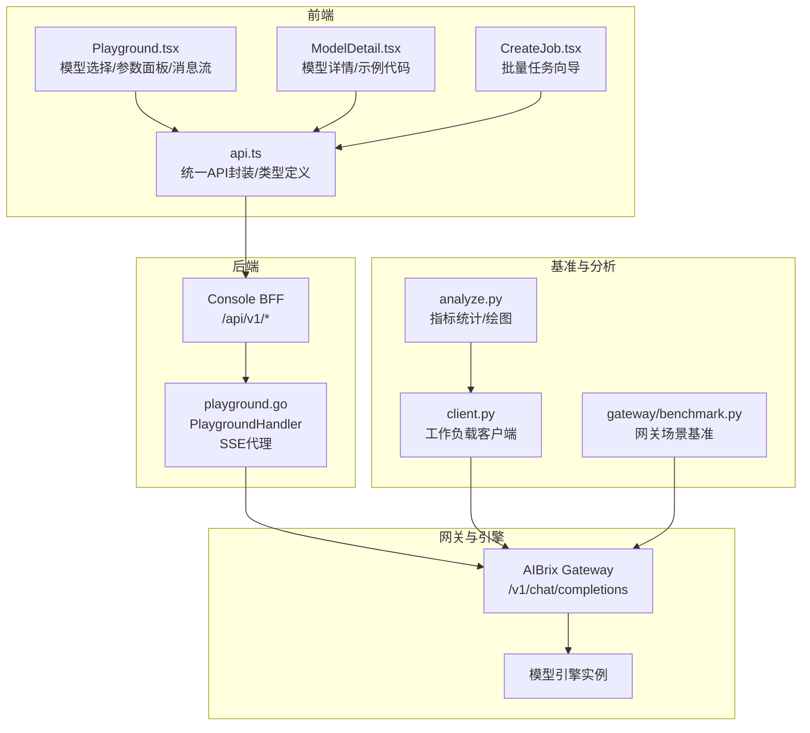
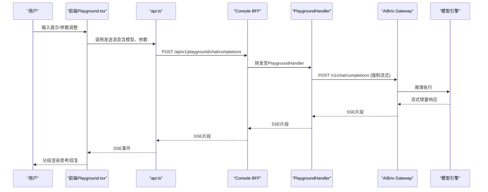
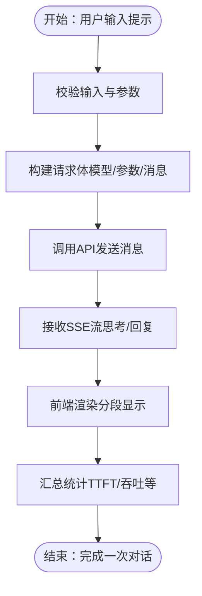
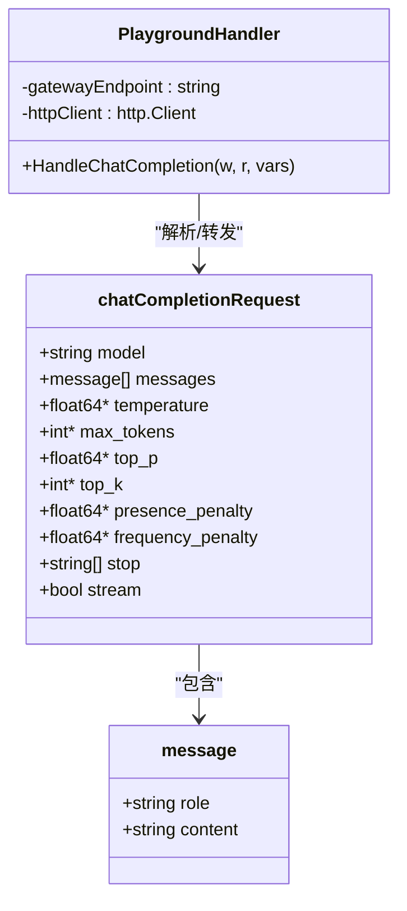
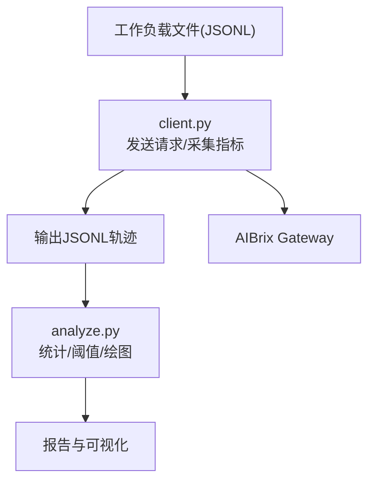
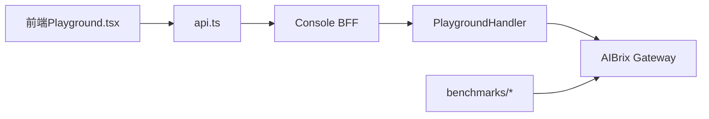

# Playground接口API

<cite>
**本文档引用的文件**
- [Playground.tsx](file://apps/console/web/src/components/Playground.tsx)
- [playground.go](file://apps/console/api/handler/playground.go)
- [api.ts](file://apps/console/web/src/utils/api.ts)
- [ModelDetail.tsx](file://apps/console/web/src/components/ModelDetail.tsx)
- [CreateJob.tsx](file://apps/console/web/src/components/CreateJob.tsx)
- [analyze.py](file://benchmarks/client/analyze.py)
- [client.py](file://benchmarks/client/client.py)
- [benchmark.py（网关场景）](file://benchmarks/scenarios/gateway/benchmark.py)
</cite>

## 目录
1. [简介](#简介)
2. [项目结构](#项目结构)
3. [核心组件](#核心组件)
4. [架构总览](#架构总览)
5. [详细组件分析](#详细组件分析)
6. [依赖关系分析](#依赖关系分析)
7. [性能考量](#性能考量)
8. [故障排查指南](#故障排查指南)
9. [结论](#结论)
10. [附录](#附录)

## 简介
本文件面向AIBrix Playground接口API，系统性梳理模型测试与参数调优能力，覆盖实时推理测试、参数配置调整、结果对比分析、性能基准测试等关键能力。同时，结合前端Playground交互界面，说明模型参数调节、输出结果展示、历史记录保存、分享功能，并扩展到多模型对比、批量测试、自动化评估与结果导出等高级功能。文档以代码级可视化方式呈现架构与数据流，帮助开发者快速理解与使用。

## 项目结构
Playground位于Console前端与后端之间，通过统一的BFF层代理至AIBrix网关，实现OpenAI兼容的SSE流式响应。后端Playground处理器负责请求解析、参数透传与SSE转发；前端Playground组件负责模型选择、参数面板、消息渲染与流式显示；批处理与性能基准工具链提供批量测试与自动化评估能力。

**图表来源**
- [Playground.tsx](file://apps/console/web/src/components/Playground.tsx)
- [playground.go](file://apps/console/api/handler/playground.go)
- [api.ts](file://apps/console/web/src/utils/api.ts)
- [ModelDetail.tsx](file://apps/console/web/src/components/ModelDetail.tsx)
- [CreateJob.tsx](file://apps/console/web/src/components/CreateJob.tsx)
- [client.py](file://benchmarks/client/client.py)
- [analyze.py](file://benchmarks/client/analyze.py)
- [benchmark.py（网关场景）](file://benchmarks/scenarios/gateway/benchmark.py)

**章节来源**
- [Playground.tsx](file://apps/console/web/src/components/Playground.tsx)
- [playground.go](file://apps/console/api/handler/playground.go)
- [api.ts](file://apps/console/web/src/utils/api.ts)
- [ModelDetail.tsx](file://apps/console/web/src/components/ModelDetail.tsx)
- [CreateJob.tsx](file://apps/console/web/src/components/CreateJob.tsx)
- [client.py](file://benchmarks/client/client.py)
- [analyze.py](file://benchmarks/client/analyze.py)
- [benchmark.py（网关场景）](file://benchmarks/scenarios/gateway/benchmark.py)

## 核心组件
- 前端Playground组件：提供模型选择、参数滑块、思维过程与回复分段流式渲染、函数调用Schema管理、清空对话、文件上传等交互能力。
- 后端Playground处理器：解析前端请求体，强制启用流式，转发至AIBrix网关/v1/chat/completions，设置SSE响应头并逐块转发。
- 统一API封装：集中管理Console BFF的REST接口，包括模型列表、模板、作业、文件、鉴权等，统一蛇行与驼峰命名转换。
- 模型详情与示例：提供OpenAI兼容的curl/Python示例代码，便于外部集成。
- 批量任务向导：支持从文件导入、参数覆盖、模板绑定、提交批处理任务。
- 性能基准与分析：工作负载客户端采集端到端延迟、吞吐、TTFT/TPOT等指标，分析器进行统计与可视化输出。

**章节来源**
- [Playground.tsx](file://apps/console/web/src/components/Playground.tsx)
- [playground.go](file://apps/console/api/handler/playground.go)
- [api.ts](file://apps/console/web/src/utils/api.ts)
- [ModelDetail.tsx](file://apps/console/web/src/components/ModelDetail.tsx)
- [CreateJob.tsx](file://apps/console/web/src/components/CreateJob.tsx)
- [client.py](file://benchmarks/client/client.py)
- [analyze.py](file://benchmarks/client/analyze.py)

## 架构总览
Playground的请求流经Console BFF，由PlaygroundHandler将请求转为SSE流式响应返回给前端。前端在本地模拟“思考”阶段与“回复”阶段的分段流式展示，最终形成完整的对话体验。

**图表来源**
- [Playground.tsx](file://apps/console/web/src/components/Playground.tsx)
- [playground.go](file://apps/console/api/handler/playground.go)
- [api.ts](file://apps/console/web/src/utils/api.ts)

## 详细组件分析

### 前端Playground组件
- 模型选择器：支持搜索与筛选，切换当前选中模型，触发后续参数与消息上下文更新。
- 参数面板：温度、最大生成长度、Top-P、Top-K、重复惩罚、频率惩罚、停止词、上下文超限行为、回显开关、函数Schema管理。
- 交互流程：发送消息时，前端先展示“思考”阶段的分段流式，随后进入“回复”阶段流式，最终汇总统计信息（如首Token时间、吞吐）。
- 文件上传：支持多文件上传，用于多模态或带附件的测试场景。
- 历史记录与分享：当前实现为本地状态管理，可扩展为持久化存储与分享链接生成。

**图表来源**
- [Playground.tsx](file://apps/console/web/src/components/Playground.tsx)

**章节来源**
- [Playground.tsx](file://apps/console/web/src/components/Playground.tsx)

### 后端Playground处理器
- 请求解析：反序列化JSON，提取模型名、消息数组、采样参数、是否流式等字段。
- 强制流式：将请求中的流式标志置为true，确保后端返回SSE。
- 代理转发：构造目标URL（/v1/chat/completions），携带Authorization头，发起HTTP请求。
- SSE响应：设置Content-Type为text/event-stream，逐块读取并刷新写回，保持连接。

**图表来源**
- [playground.go](file://apps/console/api/handler/playground.go)

**章节来源**
- [playground.go](file://apps/console/api/handler/playground.go)

### 统一API封装与类型定义
- 统一fetch封装：自动处理认证、错误抛出、401重定向、Snake/Camel命名互转。
- 类型定义：涵盖作业、部署、模型、模板、密钥、配额、文件、用户等实体与请求/响应结构。
- 端点枚举：明确支持的OpenAI兼容端点（聊天补全、补全、嵌入、重排序）。

**章节来源**
- [api.ts](file://apps/console/web/src/utils/api.ts)

### 模型详情与示例代码
- 提供curl与Python两种语言的OpenAI兼容示例，覆盖Chat与Completion模式，便于外部SDK对接。
- 支持复制示例代码，便于快速集成。

**章节来源**
- [ModelDetail.tsx](file://apps/console/web/src/components/ModelDetail.tsx)

### 批量任务向导
- 步骤编排：模型选择 → 模板选择 → 数据集上传/验证 → 设置参数与提交。
- 参数覆盖：对JSONL数据中的字段进行批量覆盖（如max_tokens、temperature、top_p、n）。
- 模板绑定：根据模型加载可用部署模板，限制端点与运行参数。
- 错误处理：对文件读取、格式、端点匹配、数值范围等进行校验与提示。

**章节来源**
- [CreateJob.tsx](file://apps/console/web/src/components/CreateJob.tsx)

### 性能基准与分析
- 工作负载客户端：支持流式与非流式两种模式，采集端到端延迟、吞吐、TTFT、TPOT、令牌数等指标，输出JSONL轨迹。
- 分析器：解析JSONL轨迹，计算均值、中位数、99分位等统计量，支持按阈值计算Goodput，生成时间序列图。
- 网关场景基准：基于Locust的用户行为模拟，过滤合法样本，构造并发压测场景。

**图表来源**
- [client.py](file://benchmarks/client/client.py)
- [analyze.py](file://benchmarks/client/analyze.py)

**章节来源**
- [client.py](file://benchmarks/client/client.py)
- [analyze.py](file://benchmarks/client/analyze.py)
- [benchmark.py（网关场景）](file://benchmarks/scenarios/gateway/benchmark.py)

## 依赖关系分析
- 前端依赖后端BFF提供的统一API，Playground组件通过api.ts封装的listModels、发送消息等方法与后端交互。
- 后端PlaygroundHandler依赖网关/v1/chat/completions端点，需确保网关可达与鉴权配置正确。
- 基准工具链独立于Playground，但共享相同的OpenAI兼容协议，便于统一评估与对比。

**图表来源**
- [Playground.tsx](file://apps/console/web/src/components/Playground.tsx)
- [api.ts](file://apps/console/web/src/utils/api.ts)
- [playground.go](file://apps/console/api/handler/playground.go)
- [client.py](file://benchmarks/client/client.py)

**章节来源**
- [Playground.tsx](file://apps/console/web/src/components/Playground.tsx)
- [api.ts](file://apps/console/web/src/utils/api.ts)
- [playground.go](file://apps/console/api/handler/playground.go)
- [client.py](file://benchmarks/client/client.py)

## 性能考量
- 流式传输：SSE逐块写回，降低首Token延迟感知；前端分段渲染提升交互体验。
- 指标采集：端到端延迟、吞吐、TTFT/TPOT、令牌数等是评估关键；分析器支持阈值Goodput与时间序列可视化。
- 并发控制：基准客户端支持会话并发上限与持续时长限制，避免资源耗尽。
- 网关路由：网关场景基准通过Locust模拟真实流量，结合过滤与采样，保证评估有效性。

[本节为通用指导，无需特定文件引用]

## 故障排查指南
- 网关不可达：后端处理器在代理失败时返回“网关不可达”，检查网关地址与网络连通性。
- 鉴权问题：若网关需要API Key，请在Authorization头中传递；确认Console BFF与网关的鉴权策略一致。
- 流式不支持：后端在无法Flush时返回错误，检查服务器对SSE的支持与代理配置。
- 参数非法：前端参数校验失败或后端解析失败时返回400，核对数值范围与必填项。
- 基准异常：客户端捕获异常并输出错误轨迹，检查工作负载文件格式、端点与模型名称匹配。

**章节来源**
- [playground.go](file://apps/console/api/handler/playground.go)
- [api.ts](file://apps/console/web/src/utils/api.ts)
- [client.py](file://benchmarks/client/client.py)

## 结论
Playground接口API以OpenAI兼容协议为核心，结合SSE流式传输与前端交互增强，实现了高效的模型测试与参数调优体验。配合批量任务向导与性能基准工具链，可完成从单模型测试到多模型对比、从参数微调到自动化评估的完整闭环。建议在生产环境中完善历史记录持久化、分享机制与权限控制，进一步提升用户体验与协作效率。

[本节为总结性内容，无需特定文件引用]

## 附录

### 使用指南与最佳实践
- 实时测试：在Playground中选择目标模型，调整温度、Top-P等参数，观察流式输出与统计指标变化。
- 参数调优：从默认值出发，逐步调整温度、Top-K、惩罚项等，结合业务需求平衡创造性与稳定性。
- 多模型对比：在模型选择器中切换不同模型，保持相同输入与参数，对比输出质量与时延表现。
- 批量测试：通过CreateJob向导上传数据集，应用参数覆盖，提交批处理任务，获取大规模评估结果。
- 自动化评估：使用client.py生成工作负载，运行基准测试，借助analyze.py生成统计报告与可视化图表。
- 结果导出：将基准轨迹JSONL与分析报告导出，用于归档与复盘。

[本节为通用指导，无需特定文件引用]