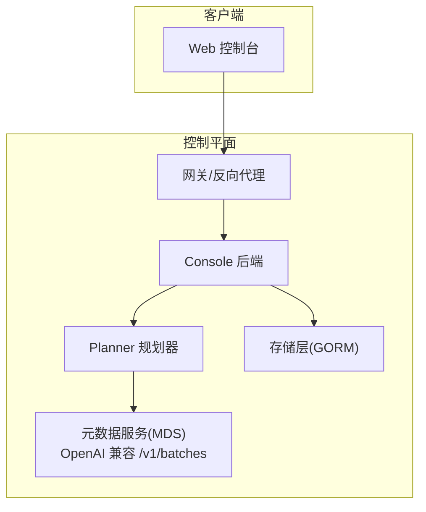
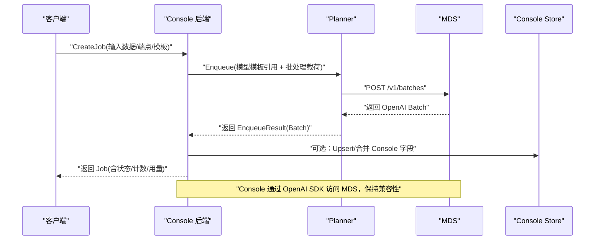
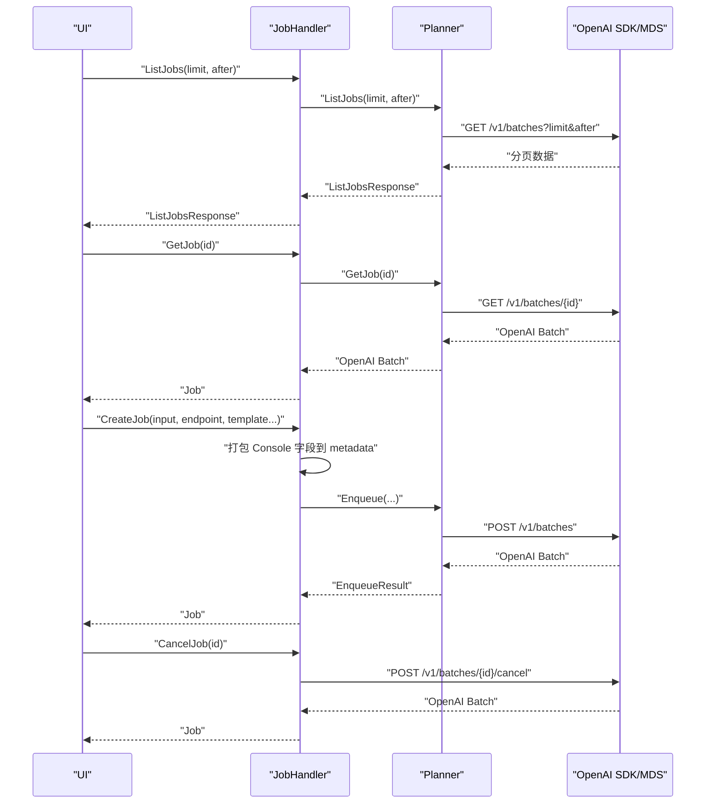
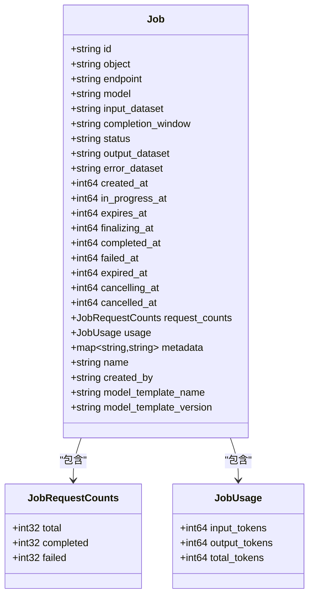
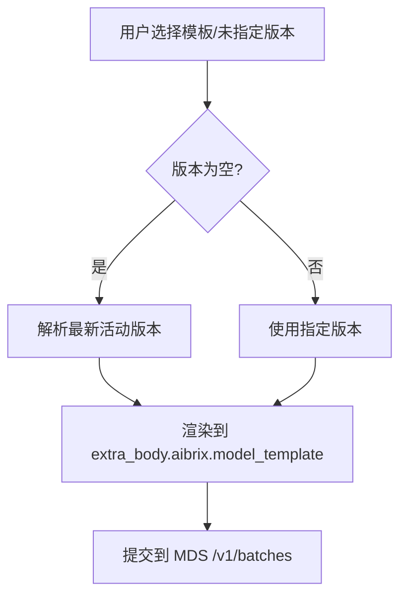
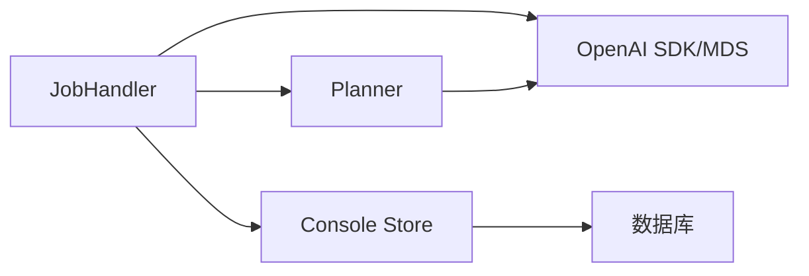

# 作业管理API

<cite>
**本文引用的文件**
- [apps/console/api/handler/job.go](file://apps/console/api/handler/job.go)
- [apps/console/api/planner/api/jobs.go](file://apps/console/api/planner/api/jobs.go)
- [apps/console/api/store/models/job.go](file://apps/console/api/store/models/job.go)
- [apps/console/api/proto/console/v1/console.proto](file://apps/console/api/proto/console/v1/console.proto)
- [apps/console/api/gen/console/v1/console.pb.gw.go](file://apps/console/api/gen/console/v1/console.pb.gw.go)
- [apps/console/api/gen/console/v1/console_grpc.pb.go](file://apps/console/api/gen/console/v1/console_grpc.pb.go)
- [apps/console/api/store/gorm.go](file://apps/console/api/store/gorm.go)
- [apps/console/api/handler/model_deployment_template.go](file://apps/console/api/handler/model_deployment_template.go)
- [samples/batch/batch_v1alpha1_model_deployment_templates.yaml](file://samples/batch/batch_v1alpha1_model_deployment_templates.yaml)
- [samples/batch/batch_v1alpha1_batch_profiles.yaml](file://samples/batch/batch_v1alpha1_batch_profiles.yaml)
- [pkg/plugins/gateway/queue/simple_queue.go](file://pkg/plugins/gateway/queue/simple_queue.go)
- [pkg/controller/modeladapter/modeladapter_controller.go](file://pkg/controller/modeladapter/modeladapter_controller.go)
</cite>

## 目录
1. [简介](#简介)
2. [项目结构](#项目结构)
3. [核心组件](#核心组件)
4. [架构总览](#架构总览)
5. [详细组件分析](#详细组件分析)
6. [依赖分析](#依赖分析)
7. [性能考虑](#性能考虑)
8. [故障排查指南](#故障排查指南)
9. [结论](#结论)
10. [附录](#附录)

## 简介
本文件系统化梳理 AIBrix 作业管理API，覆盖批处理作业的全生命周期：创建、执行、监控、管理、模板与配置、调度与并发、错误重试、取消与暂停等。文档以代码为依据，结合协议定义与样例配置，帮助开发者与运维人员快速理解并正确使用作业管理能力。

## 项目结构
作业管理API由“前端网关 + 控制器层 + 元数据服务(MDS) + 存储层”构成，核心交互如下：
- 前端通过 gRPC/HTTP 调用 Console 的 JobService 接口
- Console Handler 将请求转发至 Planner，并通过 OpenAI 兼容 SDK 调用 MDS 的 /v1/batches 接口
- Console Store 层持久化 Console 自有字段（如显示名、创建者、模板绑定）
- 模板与批处理配置由样例 ConfigMap 提供参考

图表来源
- [apps/console/api/handler/job.go:138-166](file://apps/console/api/handler/job.go#L138-L166)
- [apps/console/api/planner/api/jobs.go:27-59](file://apps/console/api/planner/api/jobs.go#L27-L59)
- [apps/console/api/gen/console/v1/console.pb.gw.go:246-277](file://apps/console/api/gen/console/v1/console.pb.gw.go#L246-L277)

章节来源
- [apps/console/api/handler/job.go:138-166](file://apps/console/api/handler/job.go#L138-L166)
- [apps/console/api/planner/api/jobs.go:27-59](file://apps/console/api/planner/api/jobs.go#L27-L59)
- [apps/console/api/gen/console/v1/console.pb.gw.go:246-277](file://apps/console/api/gen/console/v1/console.pb.gw.go#L246-L277)

## 核心组件
- JobService 接口族：ListJobs、GetJob、CreateJob、CancelJob
- Planner 接口：Enqueue、ListJobs（透传 MDS 列表页）
- Console Store：Upsert/Get/List/Delete Job；模板 CRUD
- 协议模型：Job、JobRequestCounts、JobUsage、BatchPayload、ModelTemplateRef
- 模板与批处理配置：ConfigMap 样例（模板、配额/调度）

章节来源
- [apps/console/api/proto/console/v1/console.proto:136-176](file://apps/console/api/proto/console/v1/console.proto#L136-L176)
- [apps/console/api/proto/console/v1/console.proto:305-376](file://apps/console/api/proto/console/v1/console.proto#L305-L376)
- [apps/console/api/store/models/job.go:28-162](file://apps/console/api/store/models/job.go#L28-L162)
- [apps/console/api/store/gorm.go:238-288](file://apps/console/api/store/gorm.go#L238-L288)

## 架构总览
下图展示一次“创建批处理作业”的完整调用链路，包括 Console Handler、Planner、MDS 以及 Console Store 的协作。

图表来源
- [apps/console/api/handler/job.go:243-306](file://apps/console/api/handler/job.go#L243-L306)
- [apps/console/api/planner/api/jobs.go:27-59](file://apps/console/api/planner/api/jobs.go#L27-L59)
- [apps/console/api/gen/console/v1/console.pb.gw.go:246-277](file://apps/console/api/gen/console/v1/console.pb.gw.go#L246-L277)

## 详细组件分析

### 1) 作业生命周期接口
- ListJobs：分页拉取作业列表，透传 MDS 的游标语义
- GetJob：按作业ID获取作业详情
- CreateJob：创建批处理作业，打包 Console 自有字段到 batch.metadata
- CancelJob：取消作业（透传 MDS 的取消接口）

图表来源
- [apps/console/api/handler/job.go:170-231](file://apps/console/api/handler/job.go#L170-L231)
- [apps/console/api/handler/job.go:243-318](file://apps/console/api/handler/job.go#L243-L318)
- [apps/console/api/planner/api/jobs.go:61-84](file://apps/console/api/planner/api/jobs.go#L61-L84)

章节来源
- [apps/console/api/handler/job.go:170-231](file://apps/console/api/handler/job.go#L170-L231)
- [apps/console/api/handler/job.go:243-318](file://apps/console/api/handler/job.go#L243-L318)
- [apps/console/api/planner/api/jobs.go:61-84](file://apps/console/api/planner/api/jobs.go#L61-L84)

### 2) 作业配置与状态模型
- Job 字段映射：包含 OpenAI Batch 的所有状态时间戳、状态枚举、用量与计数、元数据等
- Console 自有字段：名称、创建者、模板名与版本，从 batch.metadata 中解析
- 请求计数与用量：JobRequestCounts、JobUsage 结构体

图表来源
- [apps/console/api/proto/console/v1/console.proto:136-176](file://apps/console/api/proto/console/v1/console.proto#L136-L176)
- [apps/console/api/proto/console/v1/console.proto:164-166](file://apps/console/api/proto/console/v1/console.proto#L164-L166)

章节来源
- [apps/console/api/proto/console/v1/console.proto:136-176](file://apps/console/api/proto/console/v1/console.proto#L136-L176)
- [apps/console/api/proto/console/v1/console.proto:164-166](file://apps/console/api/proto/console/v1/console.proto#L164-L166)

### 3) 作业模板与部署模板
- 模型部署模板（ModelDeploymentTemplate）：定义引擎类型、镜像、加速器规格、并行度、量化、提供方等
- 模板解析与选择：Resolve/Get 接口支持按名称/版本解析最新活动版本
- 批处理配置样例：提供生产/开发两套批处理配置（配额、调度、存储）

图表来源
- [apps/console/api/proto/console/v1/console.proto:305-376](file://apps/console/api/proto/console/v1/console.proto#L305-L376)
- [apps/console/api/handler/model_deployment_template.go:37-66](file://apps/console/api/handler/model_deployment_template.go#L37-L66)
- [samples/batch/batch_v1alpha1_model_deployment_templates.yaml:20-150](file://samples/batch/batch_v1alpha1_model_deployment_templates.yaml#L20-L150)
- [samples/batch/batch_v1alpha1_batch_profiles.yaml:24-68](file://samples/batch/batch_v1alpha1_batch_profiles.yaml#L24-L68)

章节来源
- [apps/console/api/handler/model_deployment_template.go:37-66](file://apps/console/api/handler/model_deployment_template.go#L37-L66)
- [apps/console/api/proto/console/v1/console.proto:305-376](file://apps/console/api/proto/console/v1/console.proto#L305-L376)
- [samples/batch/batch_v1alpha1_model_deployment_templates.yaml:20-150](file://samples/batch/batch_v1alpha1_model_deployment_templates.yaml#L20-L150)
- [samples/batch/batch_v1alpha1_batch_profiles.yaml:24-68](file://samples/batch/batch_v1alpha1_batch_profiles.yaml#L24-L68)

### 4) 作业状态跟踪与进度监控
- 状态枚举：validating、in_progress、finalizing、completed、failed、expired、cancelling、cancelled
- 时间戳字段：created_at、in_progress_at、expires_at、finalizing_at、completed_at、failed_at、expired_at、cancelling_at、cancelled_at
- 进度与用量：request_counts、usage
- Console Handler 从 MDS 返回的 OpenAI Batch 合并到统一 Job 结构

章节来源
- [apps/console/api/handler/job.go:380-455](file://apps/console/api/handler/job.go#L380-L455)
- [apps/console/api/proto/console/v1/console.proto:148-149](file://apps/console/api/proto/console/v1/console.proto#L148-L149)

### 5) 结果获取与作业历史查询
- 结果文件：output_dataset、error_dataset
- 历史查询：ListJobs 支持 limit/after 游标分页
- 存储层：Upsert/Get/List/Delete Job，便于未来实现本地缓存与回放

章节来源
- [apps/console/api/handler/job.go:170-207](file://apps/console/api/handler/job.go#L170-L207)
- [apps/console/api/store/gorm.go:238-288](file://apps/console/api/store/gorm.go#L238-L288)

### 6) 作业模板管理
- 列表/解析/获取/创建/更新/删除模板
- 默认版本与状态管理
- 与 MDS 的 extra_body.aibrix.model_template 绑定

章节来源
- [apps/console/api/handler/model_deployment_template.go:37-66](file://apps/console/api/handler/model_deployment_template.go#L37-L66)
- [apps/console/api/store/gorm.go:368-398](file://apps/console/api/store/gorm.go#L368-L398)

### 7) 批量作业提交与优先级/配额
- 批处理提交：CreateJob 将模板与元数据一并提交
- 配置样例：批处理配置包含存储后端、调度优先级、最大并发、请求超时、配额限制等
- 优先级：样例中提供 high/normal，当前阶段可能不生效或仅作为提示

章节来源
- [apps/console/api/handler/job.go:243-306](file://apps/console/api/handler/job.go#L243-L306)
- [samples/batch/batch_v1alpha1_batch_profiles.yaml:24-68](file://samples/batch/batch_v1alpha1_batch_profiles.yaml#L24-L68)

### 8) 并发控制与队列机制
- 网关队列：SimpleQueue 提供无锁扩容/收缩、原子游标、物理地址映射
- 适用场景：请求排队、限流、背压控制
- 注意：该队列用于通用网关插件，具体在作业调度中的应用需结合 Planner/MDS 行为

章节来源
- [pkg/plugins/gateway/queue/simple_queue.go:33-115](file://pkg/plugins/gateway/queue/simple_queue.go#L33-L115)

### 9) 错误重试机制
- 指数退避：控制器中实现指数退避计算，避免雪崩
- 重试上限：超过阈值进行上限裁剪
- 应用场景：模型适配器等控制器的失败重试

章节来源
- [pkg/controller/modeladapter/modeladapter_controller.go:1223-1235](file://pkg/controller/modeladapter/modeladapter_controller.go#L1223-L1235)

### 10) 取消与暂停
- 取消：CancelJob 透传 MDS 的取消接口，返回最终状态
- 暂停：当前协议未暴露显式“暂停”字段；可通过外部控制（如停止工作负载）实现

章节来源
- [apps/console/api/handler/job.go:308-318](file://apps/console/api/handler/job.go#L308-L318)

## 依赖分析
- Console Handler 依赖 Planner 与 OpenAI SDK；Planner 依赖 MDS；Console Store 提供本地持久化
- gRPC/HTTP 映射：console.pb.gw.go 定义了 REST 到 gRPC 的路由映射
- 数据模型：Job 与数据库表字段一一对应，支持 JSON 字段存储 request_counts/usage/metadata

图表来源
- [apps/console/api/handler/job.go:138-166](file://apps/console/api/handler/job.go#L138-L166)
- [apps/console/api/gen/console/v1/console.pb.gw.go:246-277](file://apps/console/api/gen/console/v1/console.pb.gw.go#L246-L277)
- [apps/console/api/store/models/job.go:28-58](file://apps/console/api/store/models/job.go#L28-L58)

章节来源
- [apps/console/api/handler/job.go:138-166](file://apps/console/api/handler/job.go#L138-L166)
- [apps/console/api/gen/console/v1/console.pb.gw.go:246-277](file://apps/console/api/gen/console/v1/console.pb.gw.go#L246-L277)
- [apps/console/api/store/models/job.go:28-58](file://apps/console/api/store/models/job.go#L28-L58)

## 性能考虑
- 分页与游标：ListJobs 使用 limit/after，避免一次性拉取过多数据
- 合并策略：Console Handler 从 MDS 返回的 Batch 与 Console Store 字段合并，减少多次往返
- 队列容量：网关队列支持动态扩容，降低扩容/收缩开销
- 重试退避：控制器指数退避，避免瞬时抖动放大

## 故障排查指南
- 创建作业失败
  - 检查必填字段：input_dataset、endpoint
  - 检查模板解析：ResolveModelDeploymentTemplate 是否成功
  - 查看映射错误：mapPlannerError/mapSDKError 将上游错误映射为 gRPC 状态码
- 列表为空
  - 确认 MDS 可达性；开发模式下可回落到 Demo 数据
- 取消失败
  - 确认作业状态允许取消；检查 MDS 返回的最终状态
- 存储异常
  - Upsert/Get/List/Delete Job 的错误映射为 Internal 或 InvalidArgument

章节来源
- [apps/console/api/handler/job.go:243-318](file://apps/console/api/handler/job.go#L243-L318)
- [apps/console/api/handler/job.go:359-373](file://apps/console/api/handler/job.go#L359-L373)
- [apps/console/api/store/gorm.go:238-288](file://apps/console/api/store/gorm.go#L238-L288)

## 结论
AIBrix 作业管理API以 OpenAI 兼容接口为核心，通过 Planner 与 MDS 对接，Console Store 提供 Console 自有字段的持久化与回放能力。模板与批处理配置样例明确了生产/开发环境的最佳实践。建议在生产中结合批处理配置的配额与调度策略，合理设置并发与超时，利用队列与退避机制提升稳定性。

## 附录

### A. API 定义与路由
- gRPC 方法：ListJobs、GetJob、CreateJob、CancelJob
- REST 映射：console.pb.gw.go 定义了 HTTP 到 gRPC 的路由

章节来源
- [apps/console/api/gen/console/v1/console_grpc.pb.go:317-355](file://apps/console/api/gen/console/v1/console_grpc.pb.go#L317-L355)
- [apps/console/api/gen/console/v1/console.pb.gw.go:246-277](file://apps/console/api/gen/console/v1/console.pb.gw.go#L246-L277)

### B. 数据模型与存储
- Job 模型字段与数据库映射
- JSON 字段：request_counts、usage、metadata

章节来源
- [apps/console/api/store/models/job.go:28-162](file://apps/console/api/store/models/job.go#L28-L162)

### C. 配置示例
- 模型部署模板样例：包含引擎、加速器、并行度、量化、提供方等
- 批处理配置样例：包含存储、调度、配额、SLO

章节来源
- [samples/batch/batch_v1alpha1_model_deployment_templates.yaml:20-150](file://samples/batch/batch_v1alpha1_model_deployment_templates.yaml#L20-L150)
- [samples/batch/batch_v1alpha1_batch_profiles.yaml:24-68](file://samples/batch/batch_v1alpha1_batch_profiles.yaml#L24-L68)