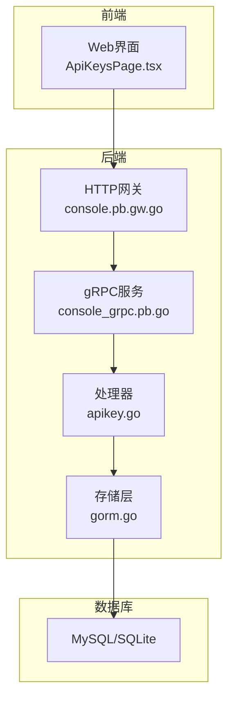
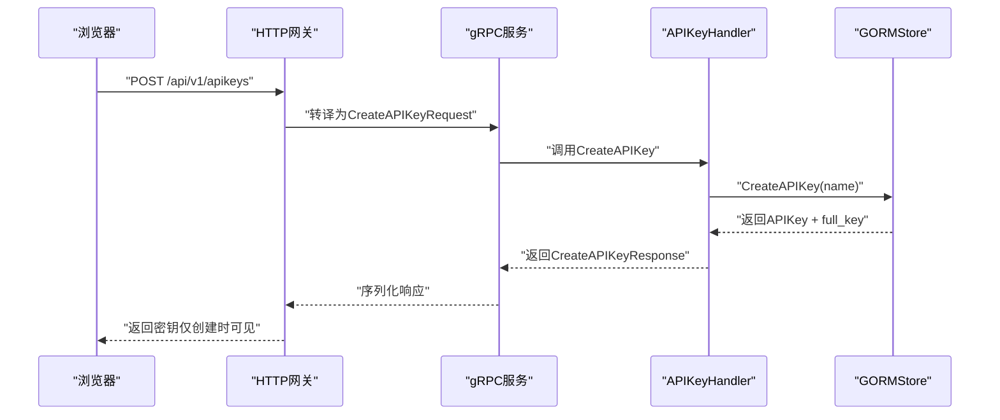
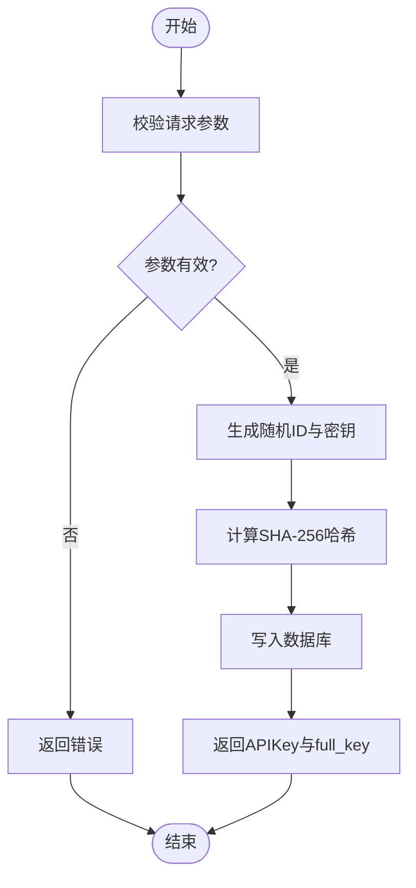
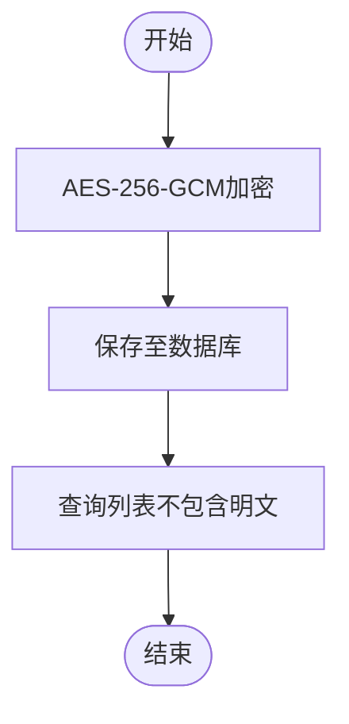
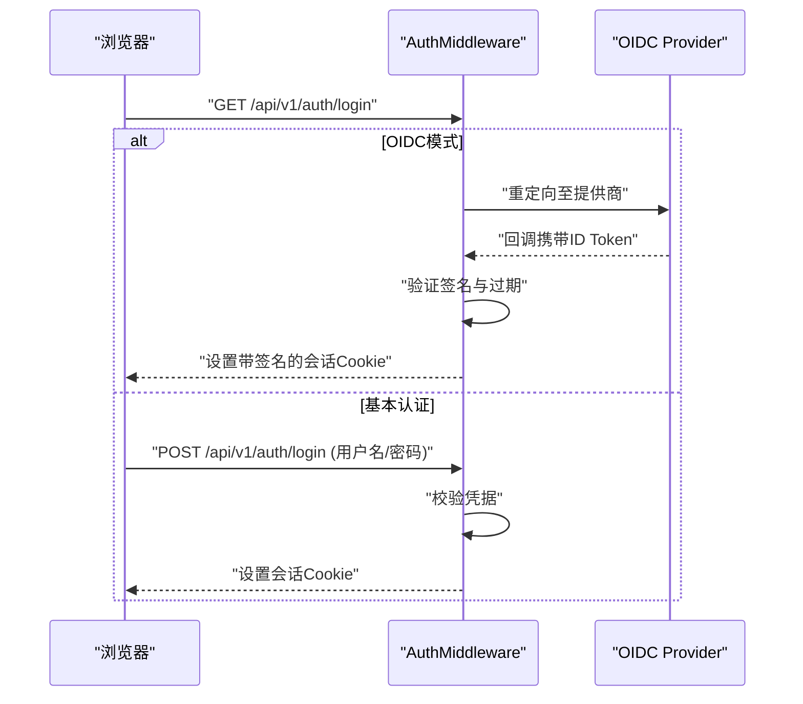
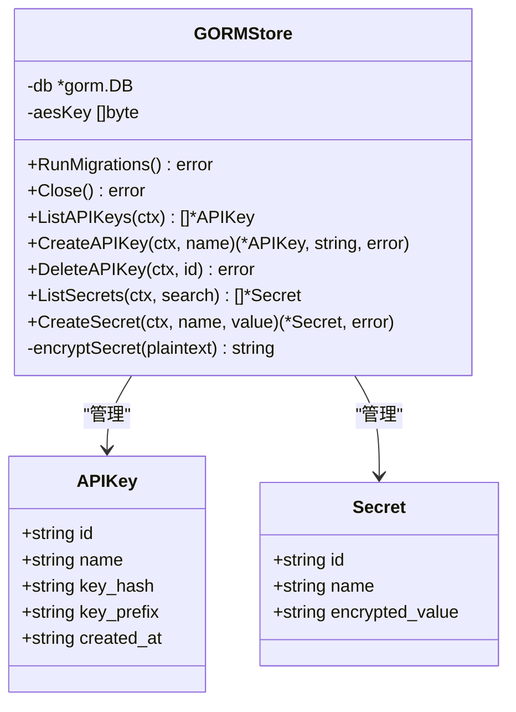
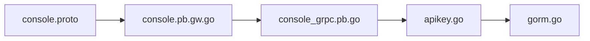

# 安全管理API

<cite>
**本文档引用的文件**
- [console.proto](file://apps/console/api/proto/console/v1/console.proto)
- [apikey.go](file://apps/console/api/handler/apikey.go)
- [auth.go](file://apps/console/api/middleware/auth.go)
- [gorm.go](file://apps/console/api/store/gorm.go)
- [console.pb.gw.go](file://apps/console/api/gen/console/v1/console.pb.gw.go)
- [console_grpc.pb.go](file://apps/console/api/gen/console/v1/console_grpc.pb.go)
- [store_test.go](file://apps/console/api/store/store_test.go)
- [ApiKeysPage.tsx](file://apps/console/web/src/components/settings/ApiKeysPage.tsx)
</cite>

## 目录
1. [简介](#简介)
2. [项目结构](#项目结构)
3. [核心组件](#核心组件)
4. [架构总览](#架构总览)
5. [详细组件分析](#详细组件分析)
6. [依赖关系分析](#依赖关系分析)
7. [性能考虑](#性能考虑)
8. [故障排除指南](#故障排除指南)
9. [结论](#结论)

## 简介
本文件面向AIBrix控制台的安全管理API，系统化梳理API密钥管理与机密管理接口的设计与实现，覆盖API密钥的创建、轮换、禁用、删除；密钥权限控制、使用审计与过期管理；机密存储机制、加密算法、访问控制策略、机密轮换流程与泄露应急处理；安全策略配置、多租户隔离、合规性检查与安全日志记录，并提供安全最佳实践与威胁防护指南。

## 项目结构
安全管理API位于控制台服务中，采用gRPC+HTTP网关的混合架构，结合中间件进行认证与会话管理，数据层通过GORM持久化并内置对称加密保护敏感信息。

**图表来源**
- [console.pb.gw.go:718-781](file://apps/console/api/gen/console/v1/console.pb.gw.go#L718-L781)
- [console_grpc.pb.go:942-1061](file://apps/console/api/gen/console/v1/console_grpc.pb.go#L942-L1061)
- [apikey.go:29-62](file://apps/console/api/handler/apikey.go#L29-L62)
- [gorm.go:125-153](file://apps/console/api/store/gorm.go#L125-L153)

**章节来源**
- [console.proto:547-643](file://apps/console/api/proto/console/v1/console.proto#L547-L643)
- [console.pb.gw.go:718-781](file://apps/console/api/gen/console/v1/console.pb.gw.go#L718-L781)
- [console_grpc.pb.go:942-1061](file://apps/console/api/gen/console/v1/console_grpc.pb.go#L942-L1061)
- [apikey.go:29-62](file://apps/console/api/handler/apikey.go#L29-L62)
- [gorm.go:125-153](file://apps/console/api/store/gorm.go#L125-L153)

## 核心组件
- API密钥服务：提供列表、创建、删除API密钥的能力，返回一次性完整密钥值用于客户端保存。
- 机密服务：提供机密列表、创建、删除能力，机密值在存储层以AES-GCM加密保存。
- 认证中间件：支持开发模式、基本认证与OIDC三种模式，统一会话签名校验与过期控制。
- 存储层：基于GORM的MySQL/SQLite实现，内置对称加密密钥管理与哈希校验。

**章节来源**
- [console.proto:547-643](file://apps/console/api/proto/console/v1/console.proto#L547-L643)
- [apikey.go:46-62](file://apps/console/api/handler/apikey.go#L46-L62)
- [auth.go:245-293](file://apps/console/api/middleware/auth.go#L245-L293)
- [gorm.go:155-175](file://apps/console/api/store/gorm.go#L155-L175)

## 架构总览
下图展示从Web界面到后端服务、再到存储层的数据流与职责分工：

**图表来源**
- [console.pb.gw.go:718-728](file://apps/console/api/gen/console/v1/console.pb.gw.go#L718-L728)
- [console_grpc.pb.go:1027-1043](file://apps/console/api/gen/console/v1/console_grpc.pb.go#L1027-L1043)
- [apikey.go:46-54](file://apps/console/api/handler/apikey.go#L46-L54)
- [gorm.go:549-564](file://apps/console/api/store/gorm.go#L549-L564)

## 详细组件分析

### API密钥管理
- 接口定义：支持列出、创建、删除API密钥，创建时返回一次性完整密钥字符串。
- 处理流程：处理器校验请求参数，委托存储层生成唯一ID与掩码密钥、计算密钥哈希并持久化。
- 前端交互：Web页面提供创建、复制、删除等操作入口，删除后刷新列表。

**图表来源**
- [apikey.go:46-54](file://apps/console/api/handler/apikey.go#L46-L54)
- [gorm.go:549-564](file://apps/console/api/store/gorm.go#L549-L564)

**章节来源**
- [console.proto:547-596](file://apps/console/api/proto/console/v1/console.proto#L547-L596)
- [apikey.go:38-62](file://apps/console/api/handler/apikey.go#L38-L62)
- [console.pb.gw.go:718-746](file://apps/console/api/gen/console/v1/console.pb.gw.go#L718-L746)
- [ApiKeysPage.tsx:1-110](file://apps/console/web/src/components/settings/ApiKeysPage.tsx#L1-L110)
- [store_test.go:731-756](file://apps/console/api/store/store_test.go#L731-L756)

### 机密管理
- 接口定义：支持列出、创建、删除机密，创建时传入明文value。
- 加密机制：存储层使用AES-256-GCM对机密值进行加密，随机nonce确保相同明文多次加密结果不同。
- 查询与展示：列表返回机密名称与标识，不包含明文内容。

**图表来源**
- [gorm.go:155-170](file://apps/console/api/store/gorm.go#L155-L170)
- [console.proto:598-643](file://apps/console/api/proto/console/v1/console.proto#L598-L643)

**章节来源**
- [console.proto:598-643](file://apps/console/api/proto/console/v1/console.proto#L598-L643)
- [gorm.go:577-613](file://apps/console/api/store/gorm.go#L577-L613)
- [store_test.go:758-777](file://apps/console/api/store/store_test.go#L758-L777)

### 认证与会话管理
- 支持模式：开发模式、基本认证、OIDC。
- 会话签名：使用HMAC-SHA256对会话载荷签名，防止篡改与重放。
- 过期控制：会话载荷包含绝对过期时间戳，即使捕获Cookie也无法绕过有效期限制。
- 路由注册：对外暴露认证配置、登录、回调、用户信息、登出等路由。

**图表来源**
- [auth.go:245-293](file://apps/console/api/middleware/auth.go#L245-L293)
- [auth.go:353-376](file://apps/console/api/middleware/auth.go#L353-L376)
- [auth.go:378-389](file://apps/console/api/middleware/auth.go#L378-L389)
- [auth.go:620-659](file://apps/console/api/middleware/auth.go#L620-L659)

**章节来源**
- [auth.go:245-293](file://apps/console/api/middleware/auth.go#L245-L293)
- [auth.go:620-683](file://apps/console/api/middleware/auth.go#L620-L683)

### 数据模型与持久化
- GORMStore封装MySQL/SQLite连接与迁移，提供统一的增删查改接口。
- 对称加密密钥长度必须为32字节（64字符十六进制），初始化时进行校验。
- APIKey与Secret分别映射到数据库表，APIKey存储哈希值与掩码显示值，Secret存储加密后的值。

**图表来源**
- [gorm.go:125-153](file://apps/console/api/store/gorm.go#L125-L153)
- [gorm.go:533-575](file://apps/console/api/store/gorm.go#L533-L575)
- [gorm.go:577-613](file://apps/console/api/store/gorm.go#L577-L613)

**章节来源**
- [gorm.go:125-153](file://apps/console/api/store/gorm.go#L125-L153)
- [gorm.go:533-613](file://apps/console/api/store/gorm.go#L533-L613)

## 依赖关系分析
- 协议层：console.proto定义了APIKeyService与SecretService的RPC方法与HTTP注解。
- 网关层：console.pb.gw.go负责HTTP到gRPC的转换，解析请求参数与查询条件。
- 服务层：console_grpc.pb.go生成的服务桩，承载具体方法分发。
- 处理器层：apikey.go实现业务逻辑，调用存储层完成数据持久化。
- 存储层：gorm.go封装数据库访问与加密算法，保证机密安全存储。

**图表来源**
- [console.proto:547-643](file://apps/console/api/proto/console/v1/console.proto#L547-L643)
- [console.pb.gw.go:718-781](file://apps/console/api/gen/console/v1/console.pb.gw.go#L718-L781)
- [console_grpc.pb.go:942-1061](file://apps/console/api/gen/console/v1/console_grpc.pb.go#L942-L1061)
- [apikey.go:29-62](file://apps/console/api/handler/apikey.go#L29-L62)
- [gorm.go:125-153](file://apps/console/api/store/gorm.go#L125-L153)

**章节来源**
- [console.proto:547-643](file://apps/console/api/proto/console/v1/console.proto#L547-L643)
- [console.pb.gw.go:718-781](file://apps/console/api/gen/console/v1/console.pb.gw.go#L718-L781)
- [console_grpc.pb.go:942-1061](file://apps/console/api/gen/console/v1/console_grpc.pb.go#L942-L1061)
- [apikey.go:29-62](file://apps/console/api/handler/apikey.go#L29-L62)
- [gorm.go:125-153](file://apps/console/api/store/gorm.go#L125-L153)

## 性能考虑
- 密钥创建：使用SHA-256哈希与UUID生成，开销极低；建议在高并发场景下避免重复创建同名密钥。
- 机密存储：AES-GCM加解密在CPU上开销可控，建议合理设置数据库连接池大小与索引优化。
- 认证会话：HMAC-SHA256签名与JSON反序列化成本较低，注意会话过期时间设置避免频繁重建。
- 网关与gRPC：HTTP到gRPC转换与序列化/反序列化为轻量级操作，建议启用压缩与合理的超时配置。

## 故障排除指南
- 创建API密钥失败：检查请求参数name是否为空，确认存储层连接正常且迁移成功。
- 删除API密钥不存在：返回NotFound错误，需先确认密钥ID或重新拉取列表。
- 机密列表为空：确认已创建机密，或检查搜索关键词是否正确。
- 认证失败：核对认证模式配置、OIDC回调地址、会话签名密钥与过期时间。

**章节来源**
- [apikey.go:46-62](file://apps/console/api/handler/apikey.go#L46-L62)
- [store_test.go:731-756](file://apps/console/api/store/store_test.go#L731-L756)
- [auth.go:245-293](file://apps/console/api/middleware/auth.go#L245-L293)

## 结论
AIBrix的安全管理API通过清晰的协议定义、严格的认证中间件与安全的存储层设计，提供了完整的API密钥与机密生命周期管理能力。建议在生产环境中启用OIDC认证、定期轮换对称加密密钥、实施最小权限原则与审计日志策略，并结合前端UI完善密钥与机密的可视化管理体验。