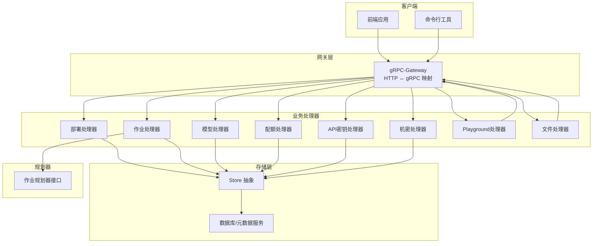
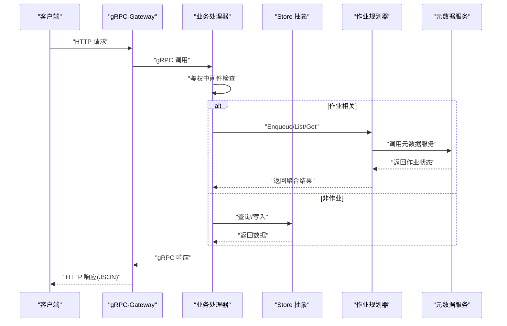
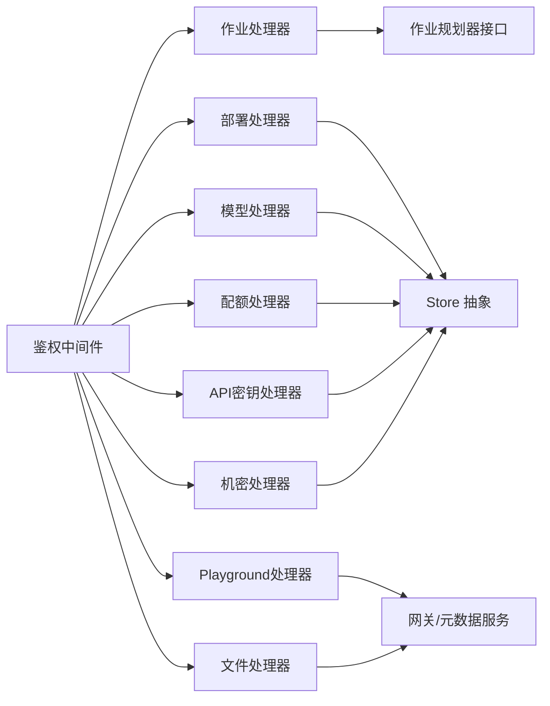

# 控制台管理API

<cite>
**本文档引用的文件**
- [deployment.go](file://apps/console/api/handler/deployment.go)
- [job.go](file://apps/console/api/handler/job.go)
- [model.go](file://apps/console/api/handler/model.go)
- [quota.go](file://apps/console/api/handler/quota.go)
- [apikey.go](file://apps/console/api/handler/apikey.go)
- [secret.go](file://apps/console/api/handler/secret.go)
- [playground.go](file://apps/console/api/handler/playground.go)
- [file.go](file://apps/console/api/handler/file.go)
- [console.pb.gw.go](file://apps/console/api/gen/console/v1/console.pb.gw.go)
- [console.proto](file://apps/console/api/proto/console/v1/console.proto)
- [auth.go](file://apps/console/api/middleware/auth.go)
- [server.go](file://apps/console/api/server/server.go)
- [store.go](file://apps/console/api/store/store.go)
- [deployment.go](file://apps/console/api/store/models/deployment.go)
- [job.go](file://apps/console/api/store/models/job.go)
- [model.go](file://apps/console/api/store/models/model.go)
- [quota.go](file://apps/console/api/store/models/quota.go)
- [api_key.go](file://apps/console/api/store/models/api_key.go)
- [secret.go](file://apps/console/api/store/models/secret.go)
- [planner_jobs.go](file://apps/console/api/planner/api/jobs.go)
- [planner_api.go](file://apps/console/api/planner/api/interface.go)
- [planner_submission.go](file://apps/console/api/planner/client/submission.go)
</cite>

## 目录
1. [简介](#简介)
2. [项目结构](#项目结构)
3. [核心组件](#核心组件)
4. [架构总览](#架构总览)
5. [详细组件分析](#详细组件分析)
6. [依赖关系分析](#依赖关系分析)
7. [性能考虑](#性能考虑)
8. [故障排除指南](#故障排除指南)
9. [结论](#结论)
10. [附录](#附录)

## 简介
本文件为 AIBrix 控制台管理系统的 RESTful API 全面文档，覆盖以下管理域：
- 部署管理：推理部署的创建、查询、删除
- 作业管理：批处理作业的创建、查询、取消、分页列表
- 模型管理：模型注册、分类筛选、版本信息
- 配额管理：资源配额查询与统计
- API 密钥管理：密钥创建、删除、列表
- 机密管理：机密存储、删除、查询
- Playground 接口：模型测试与参数调优（SSE 流式）
- 文件管理：上传、列表、元数据查询、内容下载

文档详细说明每个接口的 HTTP 方法、URL 路径、请求体结构、响应格式、错误处理；并涵盖权限控制、审计日志、批量操作支持等主题。同时提供使用示例与最佳实践建议。

## 项目结构
控制台 API 基于 gRPC-Gateway 将 gRPC 服务暴露为 RESTful HTTP 接口，采用分层设计：
- 协议定义：proto 文件定义服务与消息类型
- 生成代码：通过 buf 生成 gRPC 与 HTTP 网关绑定代码
- 处理器层：各业务 Handler 实现具体逻辑
- 存储层：Store 抽象与数据库交互
- 中间件：鉴权中间件注入用户上下文
- 规划器：作业队列与模板绑定的规划器接口

图表来源
- [console.pb.gw.go](file://apps/console/api/gen/console/v1/console.pb.gw.go)
- [deployment.go](file://apps/console/api/handler/deployment.go)
- [job.go](file://apps/console/api/handler/job.go)
- [model.go](file://apps/console/api/handler/model.go)
- [quota.go](file://apps/console/api/handler/quota.go)
- [apikey.go](file://apps/console/api/handler/apikey.go)
- [secret.go](file://apps/console/api/handler/secret.go)
- [playground.go](file://apps/console/api/handler/playground.go)
- [file.go](file://apps/console/api/handler/file.go)
- [store.go](file://apps/console/api/store/store.go)
- [planner_api.go](file://apps/console/api/planner/api/interface.go)

章节来源
- [console.proto](file://apps/console/api/proto/console/v1/console.proto)
- [console.pb.gw.go](file://apps/console/api/gen/console/v1/console.pb.gw.go)
- [server.go](file://apps/console/api/server/server.go)

## 核心组件
- gRPC-Gateway：将 proto 定义的服务映射为 HTTP 接口，支持 RESTful URL 与 JSON 请求/响应
- Handler 层：实现各业务服务的具体逻辑，负责参数校验、调用 Store 或 Planner、错误映射
- Store 层：抽象数据访问接口，封装数据库与外部元数据服务交互
- Planner 层：作业队列与模板绑定的规划器接口，用于批处理作业的入队与状态查询
- 中间件：鉴权中间件在请求进入时解析用户信息并注入到上下文

章节来源
- [console.proto](file://apps/console/api/proto/console/v1/console.proto)
- [console.pb.gw.go](file://apps/console/api/gen/console/v1/console.pb.gw.go)
- [auth.go](file://apps/console/api/middleware/auth.go)
- [store.go](file://apps/console/api/store/store.go)
- [planner_api.go](file://apps/console/api/planner/api/interface.go)

## 架构总览
下图展示从客户端到后端服务的关键交互流程，包括鉴权、路由、处理器与存储/规划器的协作。

图表来源
- [console.pb.gw.go](file://apps/console/api/gen/console/v1/console.pb.gw.go)
- [job.go](file://apps/console/api/handler/job.go)
- [planner_api.go](file://apps/console/api/planner/api/interface.go)
- [store.go](file://apps/console/api/store/store.go)

## 详细组件分析

### 部署管理 API
- 服务：DeploymentService
- 功能：列出、查询、创建、删除推理部署
- 权限：需要已登录用户上下文（由鉴权中间件注入）

接口定义与行为
- 列出部署
  - 方法：GET
  - 路径：/api/v1/deployments
  - 查询参数：search（可选）
  - 成功响应：ListDeploymentsResponse
- 获取部署
  - 方法：GET
  - 路径：/api/v1/deployments/{id}
  - 路径参数：id（必填）
  - 成功响应：Deployment
- 创建部署
  - 方法：POST
  - 路径：/api/v1/deployments
  - 请求体：CreateDeploymentRequest
  - 成功响应：Deployment
- 删除部署
  - 方法：DELETE
  - 路径：/api/v1/deployments/{id}
  - 路径参数：id（必填）
  - 成功响应：Empty

请求体与响应结构
- CreateDeploymentRequest：包含部署配置字段（如模型标识、副本数、资源规格等），具体字段以 proto 定义为准
- Deployment：包含部署 ID、名称、状态、配置详情、创建时间等

错误处理
- 参数无效：返回 InvalidArgument
- 未找到：返回 NotFound
- 内部错误：返回 Internal
- 网关不可达：返回 Unavailable

最佳实践
- 在创建前先查询模型是否存在与可用
- 使用 search 参数进行模糊匹配
- 对高并发场景建议添加幂等键避免重复创建

章节来源
- [deployment.go](file://apps/console/api/handler/deployment.go)
- [console.pb.gw.go](file://apps/console/api/gen/console/v1/console.pb.gw.go)

### 作业管理 API
- 服务：JobService
- 功能：批处理作业的创建、查询、取消、分页列表
- 依赖：OpenAI 兼容的元数据服务（MDS），通过 openai-go SDK 调用
- 开发模式：当 MDS 不可达时，可回退到本地演示数据

接口定义与行为
- 列出作业
  - 方法：GET
  - 路径：/api/v1/jobs
  - 查询参数：limit（可选，默认20）、after（可选，游标）
  - 成功响应：ListJobsResponse（包含 Jobs 列表与 HasMore）
- 获取作业
  - 方法：GET
  - 路径：/api/v1/jobs/{id}
  - 路径参数：id（必填）
  - 成功响应：Job
- 创建作业
  - 方法：POST
  - 路径：/api/v1/jobs
  - 请求体：CreateJobRequest（包含 input_dataset、endpoint、completion_window、name、created_by、template_name、template_version 等）
  - 成功响应：Job
- 取消作业
  - 方法：POST
  - 路径：/api/v1/jobs/{id}/cancel
  - 路径参数：id（必填）
  - 成功响应：Job

请求体与响应结构
- CreateJobRequest：必填字段包括 input_dataset 与 endpoint；可选字段包括 completion_window、name、template_name、template_version
- Job：包含作业 ID、对象类型、模型、输入/输出/错误数据集、状态、时间戳、请求计数、用量统计等

错误处理
- 参数无效：InvalidArgument
- 权限不足或未授权：PermissionDenied
- 资源不足：ResourceExhausted
- MDS 不可达：Unavailable
- 其他 SDK 错误：映射为 Unavailable 并保留上游消息

开发模式与回退
- 当 devMode 启用且 MDS 不可达时，列表与单条查询会回退到本地演示数据

最佳实践
- 在创建前确保 input_dataset 已上传并可访问
- 使用 completion_window 控制过期时间窗口
- 结合模板系统选择合适的模型部署模板
- 对大规模批处理作业建议设置合理的 limit 与 after 分页

章节来源
- [job.go](file://apps/console/api/handler/job.go)
- [planner_api.go](file://apps/console/api/planner/api/interface.go)
- [planner_jobs.go](file://apps/console/api/planner/api/jobs.go)
- [console.pb.gw.go](file://apps/console/api/gen/console/v1/console.pb.gw.go)

### 模型管理 API
- 服务：ModelService
- 功能：列出与查询模型，支持按分类筛选

接口定义与行为
- 列出模型
  - 方法：GET
  - 路径：/api/v1/models
  - 查询参数：search（可选）、category（可选）
  - 成功响应：ListModelsResponse
- 获取模型
  - 方法：GET
  - 路径：/api/v1/models/{id}
  - 路径参数：id（必填）
  - 成功响应：Model

请求体与响应结构
- ListModelsRequest：search、category
- Model：包含模型 ID、名称、类别、版本、描述、配置等

错误处理
- 参数无效：InvalidArgument
- 未找到：NotFound
- 其他错误：Internal/Unavailable

最佳实践
- 使用 category 进行模型分类检索
- 在创建部署前先确认模型可用性

章节来源
- [model.go](file://apps/console/api/handler/model.go)
- [console.pb.gw.go](file://apps/console/api/gen/console/v1/console.pb.gw.go)

### 配额管理 API
- 服务：QuotaService
- 功能：列出资源配额

接口定义与行为
- 列出配额
  - 方法：GET
  - 路径：/api/v1/quotas
  - 查询参数：search（可选）
  - 成功响应：ListQuotasResponse

请求体与响应结构
- ListQuotasRequest：search
- Quota：包含配额 ID、指标、限制、使用量、单位等

错误处理
- 参数无效：InvalidArgument
- 其他错误：Internal/Unavailable

最佳实践
- 定期监控配额使用情况，避免超限
- 与作业管理配合，预估批处理作业的资源消耗

章节来源
- [quota.go](file://apps/console/api/handler/quota.go)
- [console.pb.gw.go](file://apps/console/api/gen/console/v1/console.pb.gw.go)

### API 密钥管理 API
- 服务：APIKeyService
- 功能：列出、创建、删除 API 密钥

接口定义与行为
- 列出密钥
  - 方法：GET
  - 路径：/api/v1/apikeys
  - 成功响应：ListAPIKeysResponse
- 创建密钥
  - 方法：POST
  - 路径：/api/v1/apikeys
  - 请求体：CreateAPIKeyRequest（name 必填）
  - 成功响应：CreateAPIKeyResponse（包含部分可见密钥与完整密钥）
- 删除密钥
  - 方法：DELETE
  - 路径：/api/v1/apikeys/{id}
  - 路径参数：id（必填）
  - 成功响应：Empty

请求体与响应结构
- CreateAPIKeyRequest：name
- CreateAPIKeyResponse：ApiKey（部分可见）、FullKey（一次性完整密钥，仅首次返回）

错误处理
- 参数无效：InvalidArgument
- 未找到：NotFound
- 其他错误：Internal/Unavailable

最佳实践
- 创建后妥善保存完整密钥，后续无法再次获取
- 为不同环境与用途创建独立密钥
- 定期轮换密钥并撤销不再使用的密钥

章节来源
- [apikey.go](file://apps/console/api/handler/apikey.go)
- [console.pb.gw.go](file://apps/console/api/gen/console/v1/console.pb.gw.go)

### 机密管理 API
- 服务：SecretService
- 功能：列出、创建、删除机密

接口定义与行为
- 列出机密
  - 方法：GET
  - 路径：/api/v1/secrets
  - 查询参数：search（可选）
  - 成功响应：ListSecretsResponse
- 创建机密
  - 方法：POST
  - 路径：/api/v1/secrets
  - 请求体：CreateSecretRequest（name、value 必填）
  - 成功响应：Secret
- 删除机密
  - 方法：DELETE
  - 路径：/api/v1/secrets/{id}
  - 路径参数：id（必填）
  - 成功响应：Empty

请求体与响应结构
- CreateSecretRequest：name、value
- Secret：包含机密 ID、名称、值（不返回明文，仅标识）

错误处理
- 参数无效：InvalidArgument
- 未找到：NotFound
- 其他错误：Internal/Unavailable

最佳实践
- 机密值不返回明文，仅用于标识与删除
- 为敏感配置（如第三方服务凭据）使用机密管理
- 严格控制访问权限与最小化暴露范围

章节来源
- [secret.go](file://apps/console/api/handler/secret.go)
- [console.pb.gw.go](file://apps/console/api/gen/console/v1/console.pb.gw.go)

### Playground 接口 API
- 服务：Playground（HTTP 处理器）
- 功能：将前端聊天补全请求代理至网关，以 Server-Sent Events(SSE) 流式返回

接口定义与行为
- 聊天补全
  - 方法：POST
  - 路径：/api/v1/playground/chat/completions
  - 请求体：chatCompletionRequest（包含 model、messages、温度、最大令牌数、采样参数、停止词、是否流式等）
  - 成功响应：SSE 流（text/event-stream）

请求体与响应结构
- chatCompletionRequest：model、messages（角色与内容）、可选参数（temperature、max_tokens、top_p、top_k、presence_penalty、frequency_penalty、stop、stream=true）
- 响应：SSE 流，逐块推送网关返回的流式数据

错误处理
- 请求体无效：400 Bad Request
- 网关不可达：502 Bad Gateway
- 不支持流式：500 Internal Server Error
- 其他网络错误：500 Internal Server Error

最佳实践
- 强制 stream=true 以获得实时体验
- 保持 Authorization 头透传，确保鉴权一致
- 注意浏览器跨域策略，必要时配置 CORS

章节来源
- [playground.go](file://apps/console/api/handler/playground.go)
- [console.pb.gw.go](file://apps/console/api/gen/console/v1/console.pb.gw.go)

### 文件管理 API
- 服务：文件代理（HTTP 处理器）
- 功能：将文件上传、列表、元数据查询、内容下载代理至元数据服务

接口定义与行为
- 上传文件
  - 方法：POST
  - 路径：/api/v1/files/upload
  - 请求体：multipart/form-data（文件字段）
  - 成功响应：元数据服务返回的文件信息
- 列出文件
  - 方法：GET
  - 路径：/api/v1/files
  - 查询参数：与元数据服务一致
  - 成功响应：文件列表
- 获取文件元数据
  - 方法：GET
  - 路径：/api/v1/files/{file_id}
  - 路径参数：file_id（必填）
  - 成功响应：文件元数据
- 下载文件内容
  - 方法：GET
  - 路径：/api/v1/files/{file_id}/content
  - 路径参数：file_id（必填）
  - 成功响应：文件二进制内容

错误处理
- 请求体无效：500 Internal Server Error
- 元数据服务不可达：502 Bad Gateway
- 其他网络错误：500 Internal Server Error

最佳实践
- 上传时保留 Content-Type 与多部件字段
- 下载大文件时注意超时设置
- 通过 X-User-ID 与 Authorization 透传鉴权头

章节来源
- [file.go](file://apps/console/api/handler/file.go)
- [console.pb.gw.go](file://apps/console/api/gen/console/v1/console.pb.gw.go)

## 依赖关系分析
- Handler 依赖 Store 或 Planner 提供数据与业务能力
- gRPC-Gateway 依赖 proto 定义的服务与消息类型
- 中间件在 Handler 之前执行，负责鉴权与用户上下文注入
- Playground 与 File 处理器直接代理到网关与元数据服务，不经过 Store

图表来源
- [auth.go](file://apps/console/api/middleware/auth.go)
- [job.go](file://apps/console/api/handler/job.go)
- [deployment.go](file://apps/console/api/handler/deployment.go)
- [model.go](file://apps/console/api/handler/model.go)
- [quota.go](file://apps/console/api/handler/quota.go)
- [apikey.go](file://apps/console/api/handler/apikey.go)
- [secret.go](file://apps/console/api/handler/secret.go)
- [playground.go](file://apps/console/api/handler/playground.go)
- [file.go](file://apps/console/api/handler/file.go)
- [planner_api.go](file://apps/console/api/planner/api/interface.go)
- [store.go](file://apps/console/api/store/store.go)

## 性能考虑
- 批处理作业分页：使用 limit 与 after 控制每次拉取数量，避免一次性加载过多作业
- SSE 流式：Playground 使用 SSE，前端应正确处理事件流，避免阻塞主线程
- 文件代理超时：文件操作设置合理超时，防止上游挂起导致资源占用
- 缓存与重试：对频繁查询的模型与部署信息可在前端做缓存，减少后端压力
- 并发与限流：在网关层配置速率限制与并发上限，避免突发流量冲击

## 故障排除指南
常见问题与排查步骤
- 作业创建失败
  - 检查 input_dataset 是否存在且可访问
  - 确认 endpoint 正确且可用
  - 查看 MDS 日志与返回状态码
- 网关不可达
  - Playground 返回 502，检查网关服务健康状态
  - 确认 Authorization 头透传正常
- 文件上传/下载异常
  - 检查元数据服务连通性与超时设置
  - 确认 Content-Type 与多部件字段正确
- 权限错误
  - 确认鉴权中间件已正确注入用户上下文
  - 检查 API 密钥或机密是否正确配置

章节来源
- [job.go](file://apps/console/api/handler/job.go)
- [playground.go](file://apps/console/api/handler/playground.go)
- [file.go](file://apps/console/api/handler/file.go)
- [auth.go](file://apps/console/api/middleware/auth.go)

## 结论
本文件系统性梳理了 AIBrix 控制台管理 API 的接口规范、数据流与错误处理策略。通过 gRPC-Gateway 将内部服务暴露为 RESTful 接口，结合 Store 与 Planner 抽象，实现了部署、作业、模型、配额、密钥、机密与文件管理的统一管理。建议在生产环境中启用鉴权、配置限流与监控，并遵循本文的最佳实践以提升稳定性与安全性。

## 附录
- 权限控制
  - 鉴权中间件在请求进入时解析用户信息并注入上下文，处理器据此进行权限判断
  - 建议为不同角色配置最小权限集合，避免过度授权
- 审计日志
  - 建议在网关层记录请求/响应摘要（不含敏感信息），便于审计与排障
- 批量操作支持
  - 作业列表支持分页与游标，适合批量拉取与增量同步
  - 文件代理支持列表与过滤查询，便于批量管理