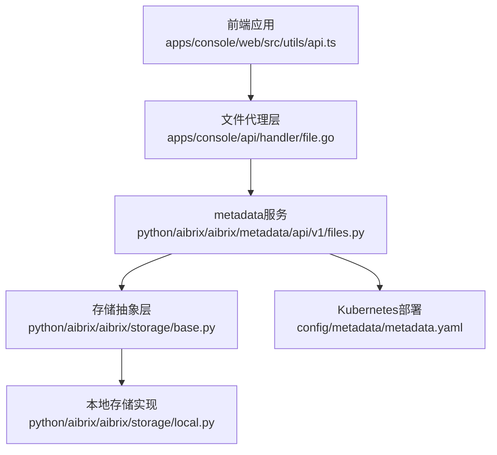
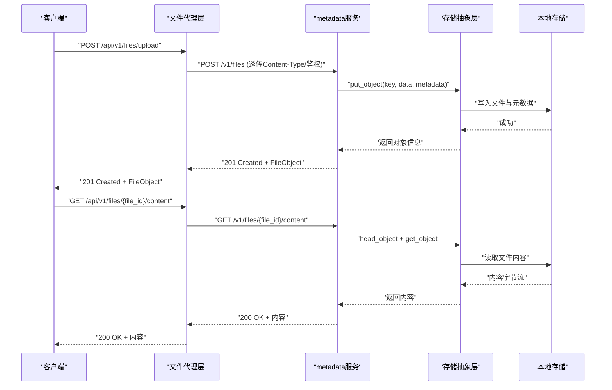
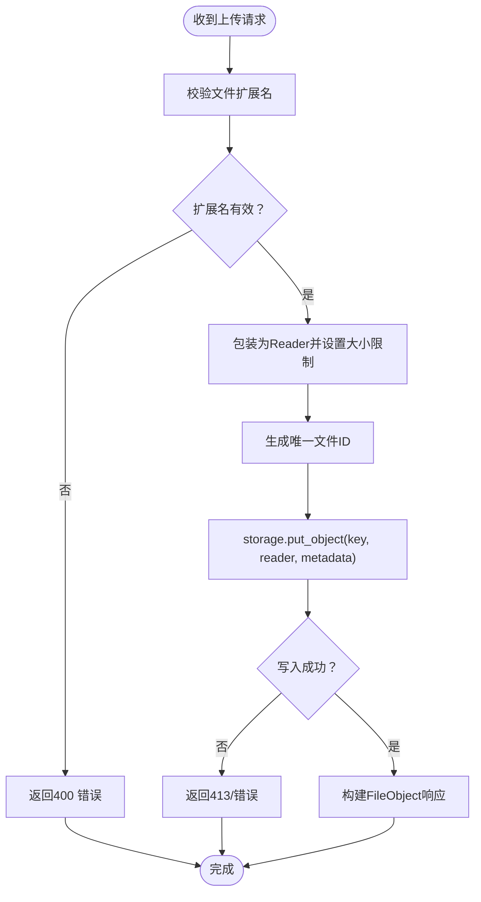
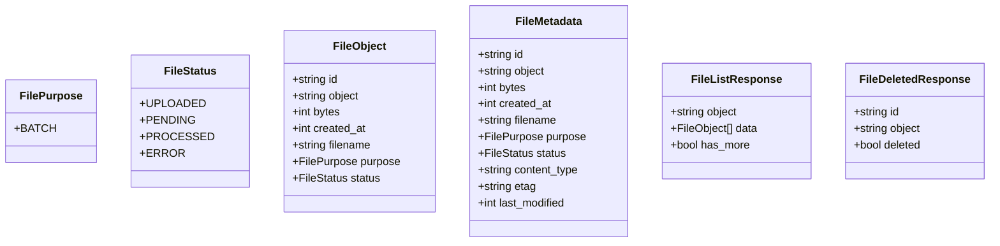
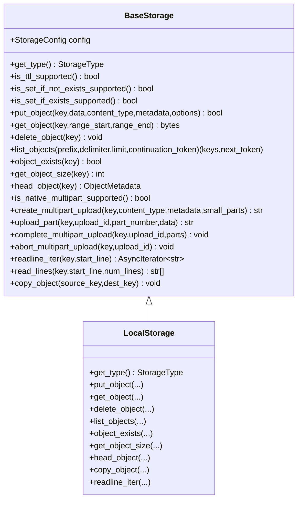

# 文件管理API

<cite>
**本文引用的文件**
- [apps/console/api/handler/file.go](file://apps/console/api/handler/file.go)
- [python/aibrix/aibrix/metadata/api/v1/files.py](file://python/aibrix/aibrix/metadata/api/v1/files.py)
- [python/aibrix/aibrix/storage/base.py](file://python/aibrix/aibrix/storage/base.py)
- [python/aibrix/aibrix/storage/local.py](file://python/aibrix/aibrix/storage/local.py)
- [config/metadata/metadata.yaml](file://config/metadata/metadata.yaml)
- [apps/console/web/src/utils/api.ts](file://apps/console/web/src/utils/api.ts)
</cite>

## 目录
1. [简介](#简介)
2. [项目结构](#项目结构)
3. [核心组件](#核心组件)
4. [架构总览](#架构总览)
5. [详细组件分析](#详细组件分析)
6. [依赖分析](#依赖分析)
7. [性能考虑](#性能考虑)
8. [故障排查指南](#故障排查指南)
9. [结论](#结论)
10. [附录](#附录)

## 简介
本文件管理API基于AIBrix控制台的文件代理层与metadata服务实现，提供统一的文件上传、下载、查询、元数据获取与删除能力。API兼容OpenAI Files风格响应模型，并通过可插拔的存储后端（如本地文件系统、S3/TOS等）实现文件持久化与读写。

## 项目结构
- 控制台文件代理层：负责将前端请求转发至metadata服务，同时透传鉴权头与内容类型。
- metadata服务：FastAPI路由实现，提供文件上传、列表、元数据查询、内容下载、删除等接口。
- 存储抽象层：定义通用存储接口与多后端实现（本地文件系统、S3/TOS等），支持分片上传、范围读取、行迭代等高级特性。
- 前端调用：封装fetch请求，支持multipart表单上传与查询参数传递。

**图表来源**
- [apps/console/api/handler/file.go:48-142](file://apps/console/api/handler/file.go#L48-L142)
- [python/aibrix/aibrix/metadata/api/v1/files.py:137-603](file://python/aibrix/aibrix/metadata/api/v1/files.py#L137-L603)
- [python/aibrix/aibrix/storage/base.py:96-827](file://python/aibrix/aibrix/storage/base.py#L96-L827)
- [python/aibrix/aibrix/storage/local.py:35-520](file://python/aibrix/aibrix/storage/local.py#L35-L520)
- [config/metadata/metadata.yaml:61-134](file://config/metadata/metadata.yaml#L61-L134)

**章节来源**
- [apps/console/api/handler/file.go:48-142](file://apps/console/api/handler/file.go#L48-L142)
- [python/aibrix/aibrix/metadata/api/v1/files.py:137-603](file://python/aibrix/aibrix/metadata/api/v1/files.py#L137-L603)
- [python/aibrix/aibrix/storage/base.py:96-827](file://python/aibrix/aibrix/storage/base.py#L96-L827)
- [python/aibrix/aibrix/storage/local.py:35-520](file://python/aibrix/aibrix/storage/local.py#L35-L520)
- [config/metadata/metadata.yaml:61-134](file://config/metadata/metadata.yaml#L61-L134)

## 核心组件
- 文件代理处理器：注册并转发文件相关路由到metadata服务，透传Content-Type与鉴权头，设置超时保护。
- metadata服务路由：实现文件上传、列表、元数据查询、内容下载、HEAD元数据、删除等接口，兼容OpenAI风格响应。
- 存储抽象层：定义统一的put/get/list/head/delete等操作，支持分片上传、范围读取、条件写入、TTL等高级选项。
- 本地存储实现：基于文件系统，自动推断内容类型、生成ETag、维护元数据文件，支持行迭代读取。

**章节来源**
- [apps/console/api/handler/file.go:48-142](file://apps/console/api/handler/file.go#L48-L142)
- [python/aibrix/aibrix/metadata/api/v1/files.py:137-603](file://python/aibrix/aibrix/metadata/api/v1/files.py#L137-L603)
- [python/aibrix/aibrix/storage/base.py:96-827](file://python/aibrix/aibrix/storage/base.py#L96-L827)
- [python/aibrix/aibrix/storage/local.py:35-520](file://python/aibrix/aibrix/storage/local.py#L35-L520)

## 架构总览
文件管理API采用“代理层+服务层+存储层”的分层设计：
- 代理层：处理HTTP请求转发、鉴权头透传、超时控制。
- 服务层：实现业务逻辑与数据模型，对接存储抽象层。
- 存储层：屏蔽具体后端差异，提供一致的API与扩展能力。

**图表来源**
- [apps/console/api/handler/file.go:64-97](file://apps/console/api/handler/file.go#L64-L97)
- [python/aibrix/aibrix/metadata/api/v1/files.py:137-603](file://python/aibrix/aibrix/metadata/api/v1/files.py#L137-L603)
- [python/aibrix/aibrix/storage/base.py:144-258](file://python/aibrix/aibrix/storage/base.py#L144-L258)
- [python/aibrix/aibrix/storage/local.py:98-251](file://python/aibrix/aibrix/storage/local.py#L98-L251)

## 详细组件分析

### 接口定义与行为
- 上传接口
  - 路径：/api/v1/files/upload
  - 方法：POST
  - 请求体：multipart/form-data，字段包括file与purpose
  - 返回：FileObject（包含id、bytes、created_at、filename、purpose、status）
  - 行为：校验扩展名、读取内容、生成唯一ID、写入存储、记录元数据
- 列表接口
  - 路径：/api/v1/files
  - 方法：GET
  - 查询参数：purpose（过滤）、limit（默认20，上限100）、after（游标）
  - 返回：FileListResponse（包含data与has_more）
  - 行为：列举对象键、head_object获取元数据、应用过滤与分页
- 元数据接口
  - 路径：/api/v1/files/{file_id}
  - 方法：GET
  - 返回：FileMetadata（包含bytes、created_at、filename、purpose、status、content_type、etag、last_modified）
- 内容下载接口
  - 路径：/api/v1/files/{file_id}/content
  - 方法：GET
  - 返回：原始文件内容（无JSON包装）
- HEAD元数据接口
  - 路径：/api/v1/files/{file_id}
  - 方法：HEAD
  - 返回：仅HTTP头（Content-Length、X-File-*等）
- 删除接口
  - 路径：/api/v1/files/{file_id}
  - 方法：DELETE
  - 返回：FileDeletedResponse（deleted=true）

**图表来源**
- [python/aibrix/aibrix/metadata/api/v1/files.py:137-208](file://python/aibrix/aibrix/metadata/api/v1/files.py#L137-L208)
- [python/aibrix/aibrix/storage/base.py:144-167](file://python/aibrix/aibrix/storage/base.py#L144-L167)

**章节来源**
- [apps/console/api/handler/file.go:48-97](file://apps/console/api/handler/file.go#L48-L97)
- [python/aibrix/aibrix/metadata/api/v1/files.py:137-603](file://python/aibrix/aibrix/metadata/api/v1/files.py#L137-L603)

### 数据模型
- FilePurpose：枚举，当前支持batch
- FileStatus：枚举，包含uploaded/pending/processed/error
- FileObject：上传成功后的标准响应模型
- FileMetadata：文件元数据模型（含content_type、etag、last_modified等）
- FileListResponse：文件列表响应模型
- FileDeletedResponse：删除响应模型

**图表来源**
- [python/aibrix/aibrix/metadata/api/v1/files.py:44-115](file://python/aibrix/aibrix/metadata/api/v1/files.py#L44-L115)

**章节来源**
- [python/aibrix/aibrix/metadata/api/v1/files.py:44-115](file://python/aibrix/aibrix/metadata/api/v1/files.py#L44-L115)

### 存储策略与能力
- 支持的文件类型：当前上传接口仅允许特定扩展名（如json、jsonl），扩展名校验在服务端执行。
- 文件大小限制：通过Reader与存储后端的大小限制器共同约束，超出将返回413。
- 分片上传：存储抽象层提供分片上传接口，支持按行、按大小、按部分数三种策略；默认阈值与并发参数可在配置中调整。
- 范围读取与行迭代：支持范围读取与基于范围的行迭代，适合大文件的高效处理。
- 条件写入与TTL：提供条件写入（NX/XX）与TTL选项，具体能力取决于后端实现。
- 本地存储：自动推断内容类型、生成ETag、维护独立元数据文件，支持行迭代读取。

**图表来源**
- [python/aibrix/aibrix/storage/base.py:96-827](file://python/aibrix/aibrix/storage/base.py#L96-L827)
- [python/aibrix/aibrix/storage/local.py:35-520](file://python/aibrix/aibrix/storage/local.py#L35-L520)

**章节来源**
- [python/aibrix/aibrix/storage/base.py:96-827](file://python/aibrix/aibrix/storage/base.py#L96-L827)
- [python/aibrix/aibrix/storage/local.py:35-520](file://python/aibrix/aibrix/storage/local.py#L35-L520)

### 访问权限与鉴权
- 代理层会透传Authorization与X-User-ID头部，确保metadata服务侧可进行鉴权与用户上下文识别。
- metadata服务部署于Kubernetes环境中，通过Service暴露端口，结合RBAC与探活健康检查保障可用性。

**章节来源**
- [apps/console/api/handler/file.go:113-119](file://apps/console/api/handler/file.go#L113-L119)
- [config/metadata/metadata.yaml:61-134](file://config/metadata/metadata.yaml#L61-L134)

### 断点续传、批量上传、压缩与加密
- 断点续传：存储抽象层提供分片上传接口，支持按大小/行/部分数策略，默认阈值与并发参数可配置。
- 批量上传：当前文件API未直接提供批量上传接口，可通过循环调用单文件上传实现。
- 文件压缩：当前上传接口未内置压缩处理，可在客户端预压缩后上传。
- 加密存储：存储抽象层未内置加密实现，如需加密可结合后端（如S3/TOS）的服务器端加密或在应用层对内容进行加密后再写入。

**章节来源**
- [python/aibrix/aibrix/storage/base.py:366-448](file://python/aibrix/aibrix/storage/base.py#L366-L448)
- [python/aibrix/aibrix/storage/base.py:449-596](file://python/aibrix/aibrix/storage/base.py#L449-L596)

### 元数据管理、版本控制与共享
- 元数据管理：文件元数据以键值形式存储，包含filename、purpose、created_at等；head_object与GET /{file_id}均能获取完整元数据。
- 版本控制：当前实现未提供版本化存储；如需版本控制，可在应用层通过命名规则或额外索引实现。
- 文件共享：当前未提供公开分享链接；如需共享，可在应用层生成带过期时间的临时访问令牌。

**章节来源**
- [python/aibrix/aibrix/metadata/api/v1/files.py:396-482](file://python/aibrix/aibrix/metadata/api/v1/files.py#L396-L482)
- [python/aibrix/aibrix/storage/local.py:164-218](file://python/aibrix/aibrix/storage/local.py#L164-L218)

### 清理策略
- 删除接口：DELETE /{file_id}会先探测对象存在性再删除，确保与OpenAI风格一致。
- 本地存储：删除时清理数据文件与元数据文件；分片上传失败时会清理临时对象。

**章节来源**
- [python/aibrix/aibrix/metadata/api/v1/files.py:572-603](file://python/aibrix/aibrix/metadata/api/v1/files.py#L572-L603)
- [python/aibrix/aibrix/storage/local.py:252-264](file://python/aibrix/aibrix/storage/local.py#L252-L264)

## 依赖分析
- 控制台代理层依赖metadata服务URL配置，通过HTTP客户端转发请求并设置超时。
- metadata服务依赖存储抽象层，通过request.app.state.storage访问具体存储实现。
- 本地存储实现依赖文件系统与元数据文件，提供ETag与内容类型推断。

**图表来源**
- [apps/console/api/handler/file.go:41-46](file://apps/console/api/handler/file.go#L41-L46)
- [python/aibrix/aibrix/metadata/api/v1/files.py:165-177](file://python/aibrix/aibrix/metadata/api/v1/files.py#L165-L177)
- [python/aibrix/aibrix/storage/base.py:107-108](file://python/aibrix/aibrix/storage/base.py#L107-L108)

**章节来源**
- [apps/console/api/handler/file.go:41-46](file://apps/console/api/handler/file.go#L41-L46)
- [python/aibrix/aibrix/metadata/api/v1/files.py:165-177](file://python/aibrix/aibrix/metadata/api/v1/files.py#L165-L177)
- [python/aibrix/aibrix/storage/base.py:107-108](file://python/aibrix/aibrix/storage/base.py#L107-L108)

## 性能考虑
- 上传性能：合理设置分片阈值与并发度，避免过小分片导致过多网络往返；对于大文件优先使用分片上传。
- 下载性能：利用范围读取与行迭代减少内存占用，提升大文件处理效率。
- 列表性能：当前列表接口对可见文件数量有上限限制，建议配合purpose与after游标进行分页。
- 超时控制：代理层设置固定超时，避免上游慢请求阻塞连接。

**章节来源**
- [python/aibrix/aibrix/storage/base.py:366-448](file://python/aibrix/aibrix/storage/base.py#L366-L448)
- [python/aibrix/aibrix/metadata/api/v1/files.py:210-342](file://python/aibrix/aibrix/metadata/api/v1/files.py#L210-L342)
- [apps/console/api/handler/file.go:30-32](file://apps/console/api/handler/file.go#L30-L32)

## 故障排查指南
- 上传失败（400/413）：检查文件扩展名是否在支持集合内；确认文件大小未超过限制。
- 下载失败（404）：确认file_id正确且对象存在；检查存储后端状态。
- 列表异常（500）：关注日志中“Failed to list files”错误，检查存储后端连通性与权限。
- 代理不可达（502）：检查metadata服务URL配置与网络连通性；确认探活健康检查正常。

**章节来源**
- [python/aibrix/aibrix/metadata/api/v1/files.py:150-208](file://python/aibrix/aibrix/metadata/api/v1/files.py#L150-L208)
- [python/aibrix/aibrix/metadata/api/v1/files.py:379-394](file://python/aibrix/aibrix/metadata/api/v1/files.py#L379-L394)
- [apps/console/api/handler/file.go:121-126](file://apps/console/api/handler/file.go#L121-L126)

## 结论
AIBrix文件管理API通过清晰的分层设计与可插拔存储后端，提供了与OpenAI风格兼容的文件管理能力。当前实现聚焦于上传、下载、查询与删除等核心功能，并具备分片上传、范围读取与行迭代等性能优化特性。未来可在版本控制、批量上传、压缩与加密等方面进一步增强。

## 附录

### API一览
- 上传文件
  - 方法：POST
  - 路径：/api/v1/files/upload
  - 请求体：multipart/form-data（file、purpose）
  - 响应：FileObject
- 列出文件
  - 方法：GET
  - 路径：/api/v1/files
  - 查询参数：purpose、limit、after
  - 响应：FileListResponse
- 获取文件元数据
  - 方法：GET
  - 路径：/api/v1/files/{file_id}
  - 响应：FileMetadata
- 下载文件内容
  - 方法：GET
  - 路径：/api/v1/files/{file_id}/content
  - 响应：原始文件内容
- HEAD文件元数据
  - 方法：HEAD
  - 路径：/api/v1/files/{file_id}
  - 响应：HTTP头（Content-Length、X-File-*等）
- 删除文件
  - 方法：DELETE
  - 路径：/api/v1/files/{file_id}
  - 响应：FileDeletedResponse

**章节来源**
- [apps/console/api/handler/file.go:48-97](file://apps/console/api/handler/file.go#L48-L97)
- [python/aibrix/aibrix/metadata/api/v1/files.py:137-603](file://python/aibrix/aibrix/metadata/api/v1/files.py#L137-L603)

### 最佳实践与存储优化建议
- 文件类型与大小
  - 严格控制上传扩展名，避免不受支持的格式。
  - 合理设置MAX_FILE_SIZE，避免超大文件影响系统稳定性。
- 上传策略
  - 大文件优先使用分片上传，结合合适的阈值与并发度。
  - 对于文本文件，可考虑按行分片以提升处理效率。
- 下载策略
  - 使用范围读取与行迭代处理超大文件，降低内存压力。
- 元数据与清理
  - 定期清理不再使用的文件，避免磁盘空间膨胀。
  - 对关键文件建立备份与版本索引，便于回溯与恢复。
- 部署与监控
  - 在Kubernetes中启用健康检查与就绪检查，确保服务高可用。
  - 关注代理层超时配置，避免慢请求拖垮整体性能。

**章节来源**
- [python/aibrix/aibrix/metadata/api/v1/files.py:32-41](file://python/aibrix/aibrix/metadata/api/v1/files.py#L32-L41)
- [python/aibrix/aibrix/storage/base.py:366-448](file://python/aibrix/aibrix/storage/base.py#L366-L448)
- [config/metadata/metadata.yaml:122-133](file://config/metadata/metadata.yaml#L122-L133)