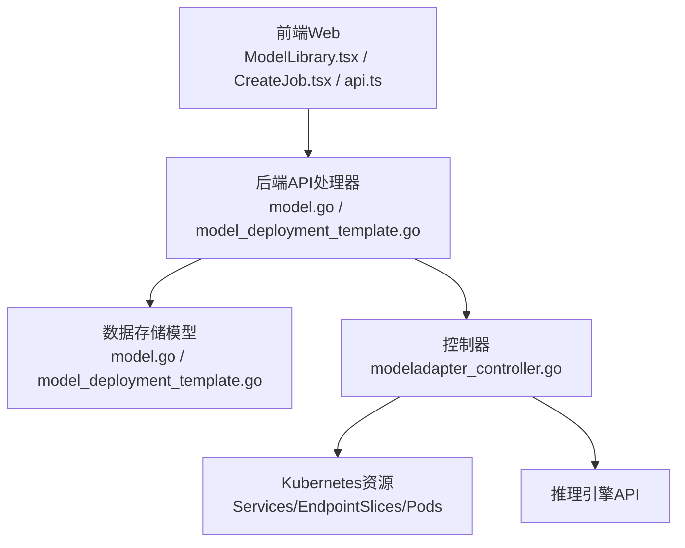
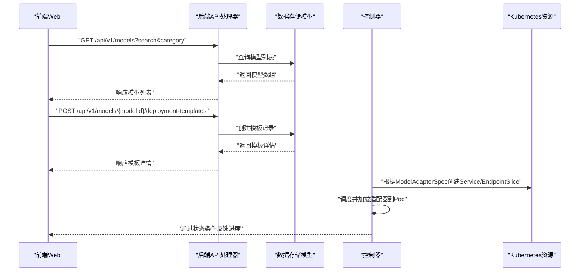
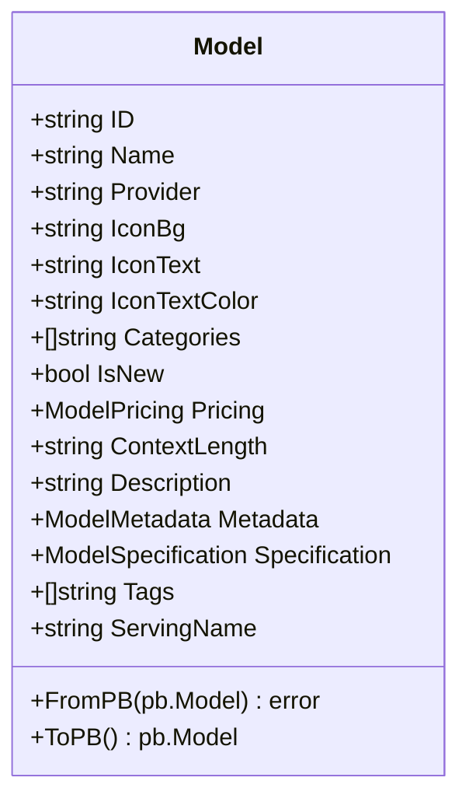
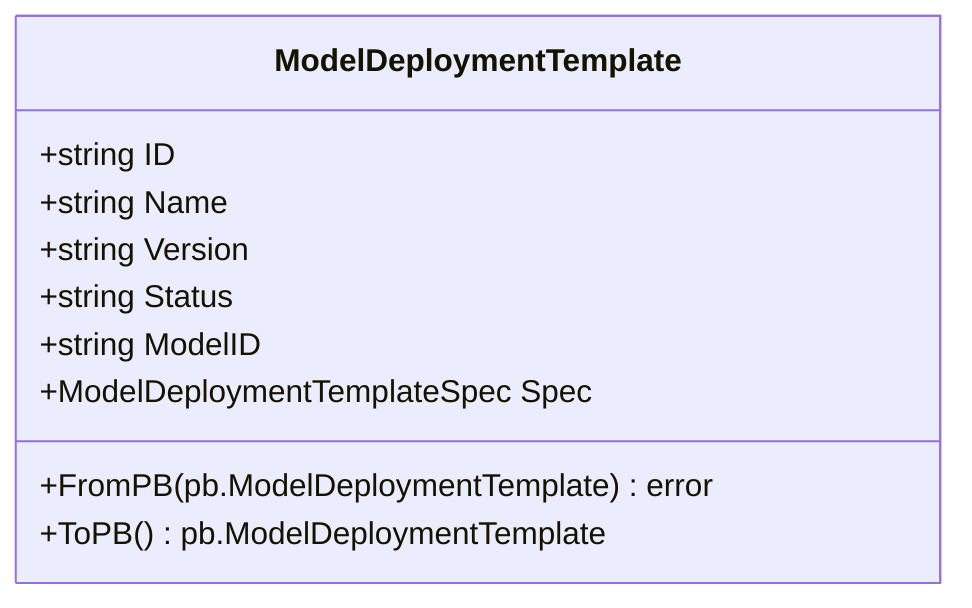
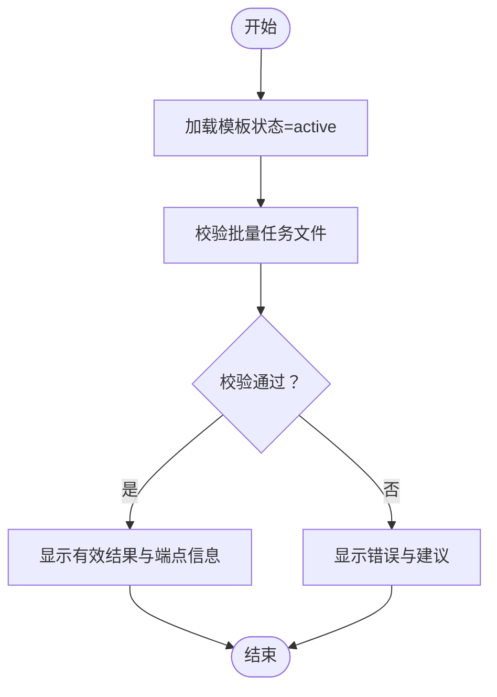
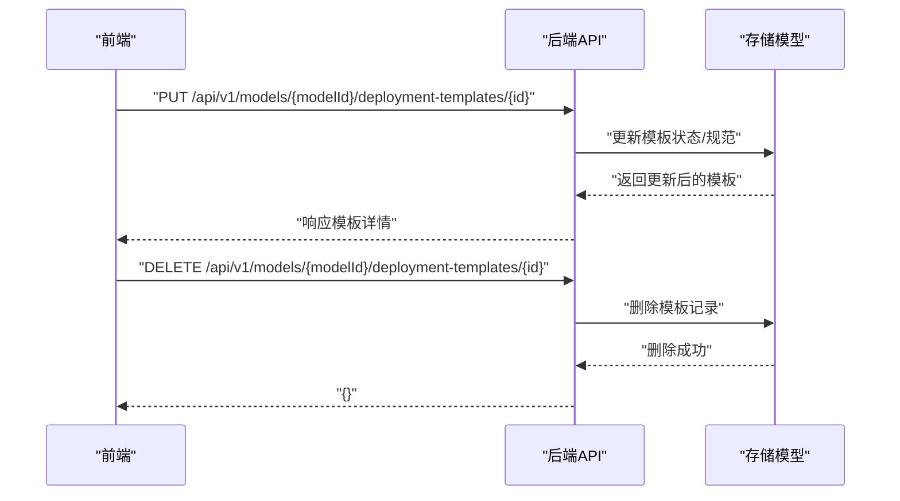
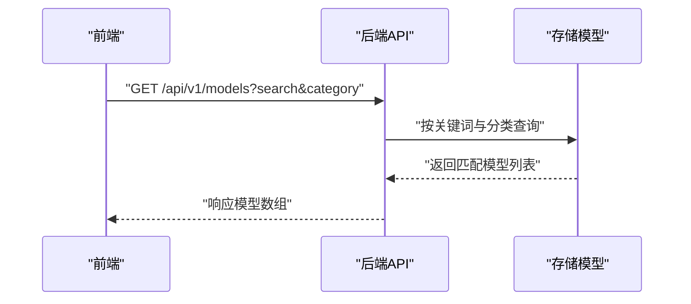
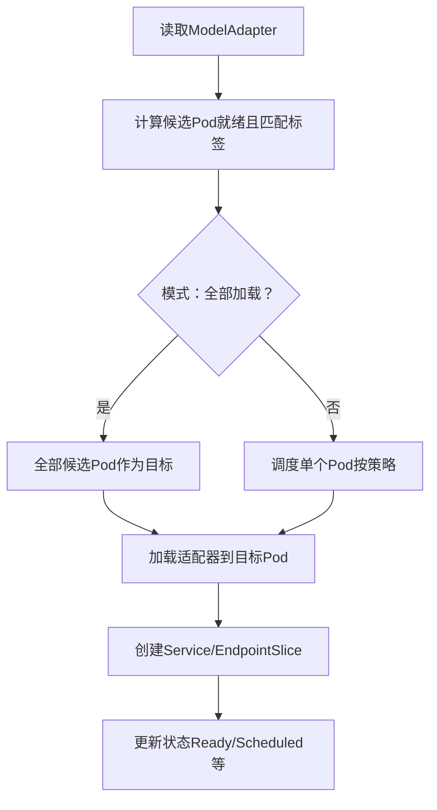
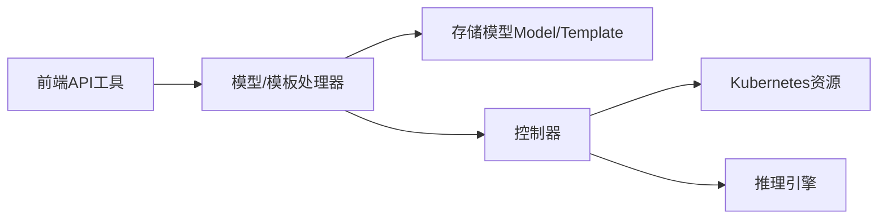

# 模型管理API

<cite>
**本文引用的文件**
- [apps/console/api/handler/model.go](file://apps/console/api/handler/model.go)
- [apps/console/api/handler/model_deployment_template.go](file://apps/console/api/handler/model_deployment_template.go)
- [apps/console/api/store/models/model.go](file://apps/console/api/store/models/model.go)
- [apps/console/api/store/models/model_deployment_template.go](file://apps/console/api/store/models/model_deployment_template.go)
- [apps/console/web/src/utils/api.ts](file://apps/console/web/src/utils/api.ts)
- [apps/console/web/src/components/ModelLibrary.tsx](file://apps/console/web/src/components/ModelLibrary.tsx)
- [apps/console/web/src/components/CreateJob.tsx](file://apps/console/web/src/components/CreateJob.tsx)
- [api/model/v1alpha1/modeladapter_types.go](file://api/model/v1alpha1/modeladapter_types.go)
- [pkg/controller/modeladapter/modeladapter_controller.go](file://pkg/controller/modeladapter/modeladapter_controller.go)
</cite>

## 目录
1. [简介](#简介)
2. [项目结构](#项目结构)
3. [核心组件](#核心组件)
4. [架构总览](#架构总览)
5. [详细组件分析](#详细组件分析)
6. [依赖分析](#依赖分析)
7. [性能考虑](#性能考虑)
8. [故障排查指南](#故障排查指南)
9. [结论](#结论)
10. [附录](#附录)

## 简介
本文件面向AIBrix模型管理API，系统性梳理并说明以下能力与流程：
- 模型注册与目录：模型元数据（名称、描述、分类、图标、定价、上下文长度、标签等）的存储与查询。
- 版本管理：通过“部署模板”对模型进行版本化管理，支持按名称+版本解析与状态管理。
- 配置管理：模型元数据与规格的结构化存储，便于检索与展示。
- 部署模板管理：模板的创建、更新、删除、解析与查询。
- 模型验证与测试：前端侧对批量任务文件的模型标识与端点校验。
- 模型发布与废弃：模板状态（如active）用于控制发布；删除模板可视为废弃。
- 搜索与过滤：基于关键词与分类的模型列表查询。
- 统计与依赖：通过模板状态与实例数量反映运行时依赖关系。

本文件同时给出架构图、序列图与流程图，帮助读者快速理解前后端交互、控制器工作流与数据模型。

## 项目结构
围绕模型管理API的关键模块分布如下：
- 前端Web：提供模型库、模板选择与批量任务提交等交互，调用后端REST接口。
- 控制器层：负责模型适配器（ModelAdapter）生命周期编排，对接推理引擎与Kubernetes资源。
- 后端服务层：提供gRPC/REST接口，封装数据访问与业务逻辑。
- 数据模型层：定义模型与部署模板的数据结构及持久化映射。

**图表来源**
- [apps/console/web/src/components/ModelLibrary.tsx:91-122](file://apps/console/web/src/components/ModelLibrary.tsx#L91-L122)
- [apps/console/web/src/components/CreateJob.tsx:101-118](file://apps/console/web/src/components/CreateJob.tsx#L101-L118)
- [apps/console/web/src/utils/api.ts:337-391](file://apps/console/web/src/utils/api.ts#L337-L391)
- [apps/console/api/handler/model.go:35-45](file://apps/console/api/handler/model.go#L35-L45)
- [apps/console/api/handler/model_deployment_template.go:37-66](file://apps/console/api/handler/model_deployment_template.go#L37-L66)
- [apps/console/api/store/models/model.go:28-99](file://apps/console/api/store/models/model.go#L28-L99)
- [apps/console/api/store/models/model_deployment_template.go:28-71](file://apps/console/api/store/models/model_deployment_template.go#L28-L71)
- [pkg/controller/modeladapter/modeladapter_controller.go:313-369](file://pkg/controller/modeladapter/modeladapter_controller.go#L313-L369)

**章节来源**
- [apps/console/web/src/utils/api.ts:337-391](file://apps/console/web/src/utils/api.ts#L337-L391)
- [apps/console/api/handler/model.go:35-45](file://apps/console/api/handler/model.go#L35-L45)
- [apps/console/api/handler/model_deployment_template.go:37-66](file://apps/console/api/handler/model_deployment_template.go#L37-L66)
- [apps/console/api/store/models/model.go:28-99](file://apps/console/api/store/models/model.go#L28-L99)
- [apps/console/api/store/models/model_deployment_template.go:28-71](file://apps/console/api/store/models/model_deployment_template.go#L28-L71)
- [pkg/controller/modeladapter/modeladapter_controller.go:313-369](file://pkg/controller/modeladapter/modeladapter_controller.go#L313-L369)

## 核心组件
- 模型处理器（ModelHandler）
  - 提供模型列表与详情查询接口，支持关键词与分类过滤。
- 部署模板处理器（ModelDeploymentTemplateHandler）
  - 提供模板列表、解析、详情、创建、更新、删除接口。
- 模型存储模型（Model）
  - 定义模型元数据字段（分类、图标、定价、上下文长度、描述、规格、标签、服务名等），并提供PB与数据库双向转换。
- 部署模板存储模型（ModelDeploymentTemplate）
  - 定义模板的唯一索引（模型ID+名称+版本），状态字段（默认active），以及规范字段。
- 前端API工具（api.ts）
  - 封装模型与模板的REST调用，统一构建查询参数与请求体。
- 控制器（ModelAdapterReconciler）
  - 负责ModelAdapter的生命周期编排，包括副本调度、加载、服务与EndpointSlice创建、状态更新。

**章节来源**
- [apps/console/api/handler/model.go:26-45](file://apps/console/api/handler/model.go#L26-L45)
- [apps/console/api/handler/model_deployment_template.go:28-66](file://apps/console/api/handler/model_deployment_template.go#L28-L66)
- [apps/console/api/store/models/model.go:28-169](file://apps/console/api/store/models/model.go#L28-L169)
- [apps/console/api/store/models/model_deployment_template.go:28-93](file://apps/console/api/store/models/model_deployment_template.go#L28-L93)
- [apps/console/web/src/utils/api.ts:337-391](file://apps/console/web/src/utils/api.ts#L337-L391)
- [pkg/controller/modeladapter/modeladapter_controller.go:282-369](file://pkg/controller/modeladapter/modeladapter_controller.go#L282-L369)

## 架构总览
下图展示了从前端到后端再到控制器的整体交互路径：

**图表来源**
- [apps/console/web/src/utils/api.ts:337-391](file://apps/console/web/src/utils/api.ts#L337-L391)
- [apps/console/api/handler/model.go:35-45](file://apps/console/api/handler/model.go#L35-L45)
- [apps/console/api/handler/model_deployment_template.go:53-59](file://apps/console/api/handler/model_deployment_template.go#L53-L59)
- [apps/console/api/store/models/model.go:113-169](file://apps/console/api/store/models/model.go#L113-L169)
- [apps/console/api/store/models/model_deployment_template.go:73-93](file://apps/console/api/store/models/model_deployment_template.go#L73-L93)
- [pkg/controller/modeladapter/modeladapter_controller.go:417-493](file://pkg/controller/modeladapter/modeladapter_controller.go#L417-L493)

## 详细组件分析

### 模型元数据管理（名称、描述、标签、许可证等）
- 数据模型
  - 分类、图标、定价、上下文长度、描述、规格、标签、服务名等字段均以JSON形式存储于数据库，并提供PB互转方法。
- 查询与展示
  - 前端通过关键词与分类筛选模型列表；模型库组件负责UI渲染与分组展示。
- 元数据扩展
  - 可在metadata中扩展许可证、提供商等信息，便于合规与溯源。

**图表来源**
- [apps/console/api/store/models/model.go:28-169](file://apps/console/api/store/models/model.go#L28-L169)

**章节来源**
- [apps/console/api/store/models/model.go:28-169](file://apps/console/api/store/models/model.go#L28-L169)
- [apps/console/web/src/components/ModelLibrary.tsx:91-122](file://apps/console/web/src/components/ModelLibrary.tsx#L91-L122)

### 部署模板管理（创建、解析、查询、删除）
- 接口能力
  - 列表：支持按模型ID、状态、名称过滤。
  - 解析：按模型ID+模板名+版本解析最新或指定版本。
  - 详情：按模型ID+模板ID获取。
  - 创建/更新：写入模板规范与状态。
  - 删除：物理删除模板记录。
- 数据模型
  - 唯一索引：模型ID+名称+版本，确保模板版本唯一。
  - 状态字段：默认active，用于控制发布与可见性。

**图表来源**
- [apps/console/api/store/models/model_deployment_template.go:28-93](file://apps/console/api/store/models/model_deployment_template.go#L28-L93)

**章节来源**
- [apps/console/api/handler/model_deployment_template.go:37-66](file://apps/console/api/handler/model_deployment_template.go#L37-L66)
- [apps/console/api/store/models/model_deployment_template.go:28-93](file://apps/console/api/store/models/model_deployment_template.go#L28-L93)
- [apps/console/web/src/utils/api.ts:349-391](file://apps/console/web/src/utils/api.ts#L349-L391)

### 模型验证与测试（批量任务文件校验）
- 前端校验
  - 在选择模型与模板后，对批量任务文件进行模型标识与端点一致性校验，提示有效/无效结果。
- 流程
  - 加载模板（状态为active）→ 校验文件中的期望模型标识 → 返回校验结果。

**图表来源**
- [apps/console/web/src/components/CreateJob.tsx:101-118](file://apps/console/web/src/components/CreateJob.tsx#L101-L118)

**章节来源**
- [apps/console/web/src/components/CreateJob.tsx:101-118](file://apps/console/web/src/components/CreateJob.tsx#L101-L118)

### 模型发布与废弃（模板状态与删除）
- 发布：将模板状态设为active，即可对外提供使用。
- 废弃：删除模板记录，即为废弃该版本；可通过新版本替代。

**图表来源**
- [apps/console/web/src/utils/api.ts:381-391](file://apps/console/web/src/utils/api.ts#L381-L391)
- [apps/console/api/handler/model_deployment_template.go:57-66](file://apps/console/api/handler/model_deployment_template.go#L57-L66)
- [apps/console/api/store/models/model_deployment_template.go:73-93](file://apps/console/api/store/models/model_deployment_template.go#L73-L93)

**章节来源**
- [apps/console/api/handler/model_deployment_template.go:53-66](file://apps/console/api/handler/model_deployment_template.go#L53-L66)
- [apps/console/api/store/models/model_deployment_template.go:73-93](file://apps/console/api/store/models/model_deployment_template.go#L73-L93)

### 模型搜索与过滤
- 支持关键词与分类过滤，前端组件负责UI交互与请求拼装。

**图表来源**
- [apps/console/web/src/utils/api.ts:337-341](file://apps/console/web/src/utils/api.ts#L337-L341)
- [apps/console/api/handler/model.go:35-45](file://apps/console/api/handler/model.go#L35-L45)

**章节来源**
- [apps/console/web/src/utils/api.ts:337-341](file://apps/console/web/src/utils/api.ts#L337-L341)
- [apps/console/api/handler/model.go:35-45](file://apps/console/api/handler/model.go#L35-L45)

### 模型依赖关系管理（运行时）
- 控制器负责根据ModelAdapterSpec选择目标Pod，创建Service与EndpointSlice，并向推理引擎加载适配器。
- 实例列表与就绪副本数反映了当前依赖关系与健康状况。

**图表来源**
- [pkg/controller/modeladapter/modeladapter_controller.go:581-697](file://pkg/controller/modeladapter/modeladapter_controller.go#L581-L697)
- [pkg/controller/modeladapter/modeladapter_controller.go:728-800](file://pkg/controller/modeladapter/modeladapter_controller.go#L728-L800)
- [pkg/controller/modeladapter/modeladapter_controller.go:417-493](file://pkg/controller/modeladapter/modeladapter_controller.go#L417-L493)

**章节来源**
- [api/model/v1alpha1/modeladapter_types.go:26-61](file://api/model/v1alpha1/modeladapter_types.go#L26-L61)
- [pkg/controller/modeladapter/modeladapter_controller.go:313-369](file://pkg/controller/modeladapter/modeladapter_controller.go#L313-L369)

## 依赖分析
- 前端依赖后端API，后端依赖存储模型；控制器独立编排资源并与Kubernetes/推理引擎交互。
- 存储模型提供PB互转，保证前后端协议一致。

**图表来源**
- [apps/console/web/src/utils/api.ts:337-391](file://apps/console/web/src/utils/api.ts#L337-L391)
- [apps/console/api/handler/model.go:35-45](file://apps/console/api/handler/model.go#L35-L45)
- [apps/console/api/handler/model_deployment_template.go:37-66](file://apps/console/api/handler/model_deployment_template.go#L37-L66)
- [apps/console/api/store/models/model.go:113-169](file://apps/console/api/store/models/model.go#L113-L169)
- [apps/console/api/store/models/model_deployment_template.go:73-93](file://apps/console/api/store/models/model_deployment_template.go#L73-L93)
- [pkg/controller/modeladapter/modeladapter_controller.go:313-369](file://pkg/controller/modeladapter/modeladapter_controller.go#L313-L369)

**章节来源**
- [apps/console/web/src/utils/api.ts:337-391](file://apps/console/web/src/utils/api.ts#L337-L391)
- [apps/console/api/handler/model.go:35-45](file://apps/console/api/handler/model.go#L35-L45)
- [apps/console/api/handler/model_deployment_template.go:37-66](file://apps/console/api/handler/model_deployment_template.go#L37-L66)
- [apps/console/api/store/models/model.go:113-169](file://apps/console/api/store/models/model.go#L113-L169)
- [apps/console/api/store/models/model_deployment_template.go:73-93](file://apps/console/api/store/models/model_deployment_template.go#L73-L93)
- [pkg/controller/modeladapter/modeladapter_controller.go:313-369](file://pkg/controller/modeladapter/modeladapter_controller.go#L313-L369)

## 性能考虑
- 模板唯一索引（模型ID+名称+版本）避免重复创建，减少存储与查询开销。
- 控制器周期性重排与事件驱动结合，降低不必要的全量扫描。
- 前端缓存与分页（若后续扩展）可减轻列表查询压力。
- 模型与模板的JSON字段需注意索引与查询条件设计，避免全表扫描。

## 故障排查指南
- 模型列表为空
  - 检查关键词与分类参数是否正确；确认数据库中是否存在匹配记录。
- 模板解析失败
  - 确认模板名称与版本是否存在；检查状态是否为active。
- 模板创建/更新报错
  - 检查请求体字段是否符合PB规范；核对唯一索引冲突。
- 运行时适配器未就绪
  - 查看控制器状态条件与实例列表；确认Pod就绪与调度策略；检查推理引擎端点可达性。

**章节来源**
- [apps/console/api/handler/model.go:35-45](file://apps/console/api/handler/model.go#L35-L45)
- [apps/console/api/handler/model_deployment_template.go:37-66](file://apps/console/api/handler/model_deployment_template.go#L37-L66)
- [pkg/controller/modeladapter/modeladapter_controller.go:417-493](file://pkg/controller/modeladapter/modeladapter_controller.go#L417-L493)

## 结论
AIBrix模型管理API通过清晰的前后端职责划分与控制器编排，实现了从模型元数据管理、模板版本控制到运行时适配器加载的完整闭环。结合状态化模板与前端校验机制，能够有效支撑模型注册、发布、测试与废弃等全生命周期管理。

## 附录
- 最佳实践
  - 使用模板版本号与状态字段进行灰度与回滚；变更前先创建新版本。
  - 在创建模板时明确规范字段，确保与推理引擎兼容。
  - 对批量任务文件进行预校验，减少运行期失败。
- 常见问题
  - 模板无法解析：检查名称、版本与状态。
  - 模型列表不显示：检查关键词与分类过滤参数。
  - 适配器未加载：检查Pod就绪、标签选择器与调度策略。