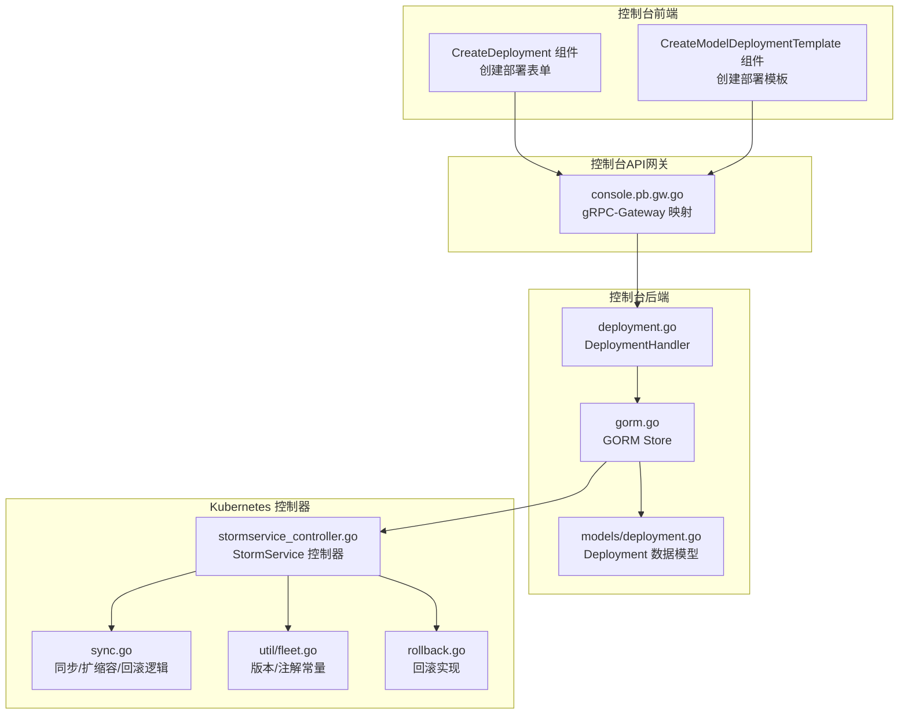
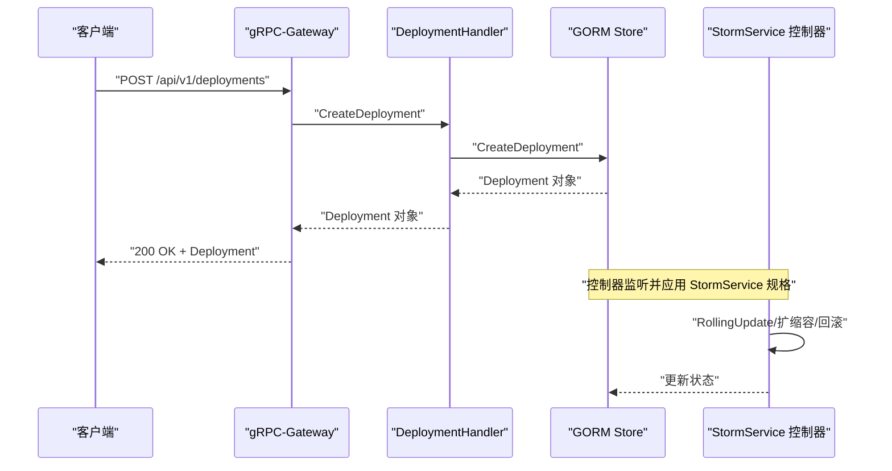
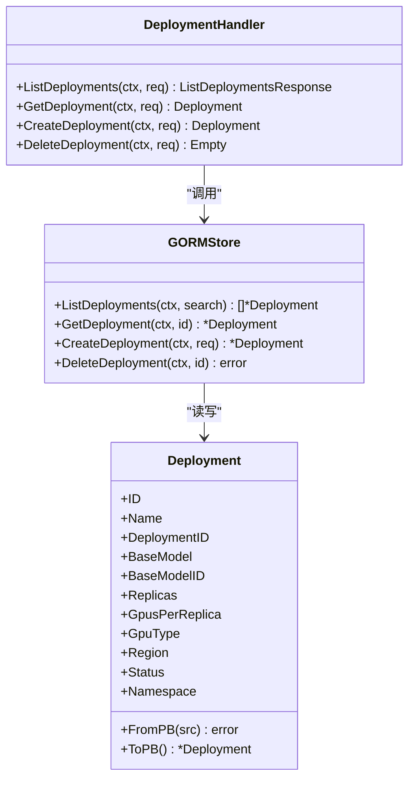
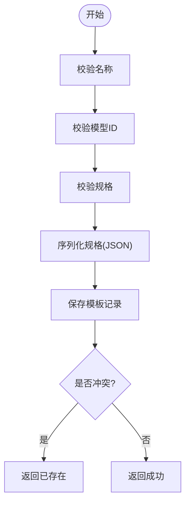
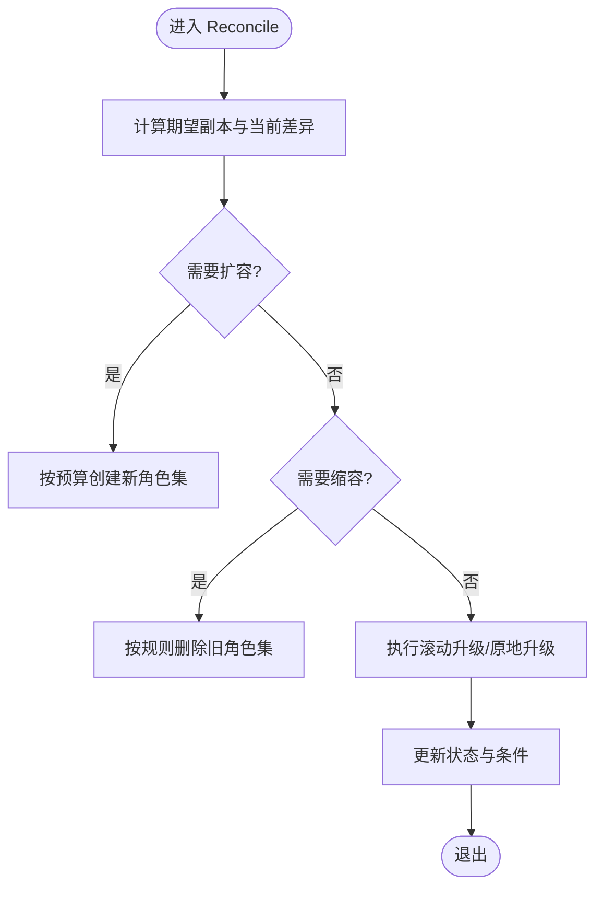
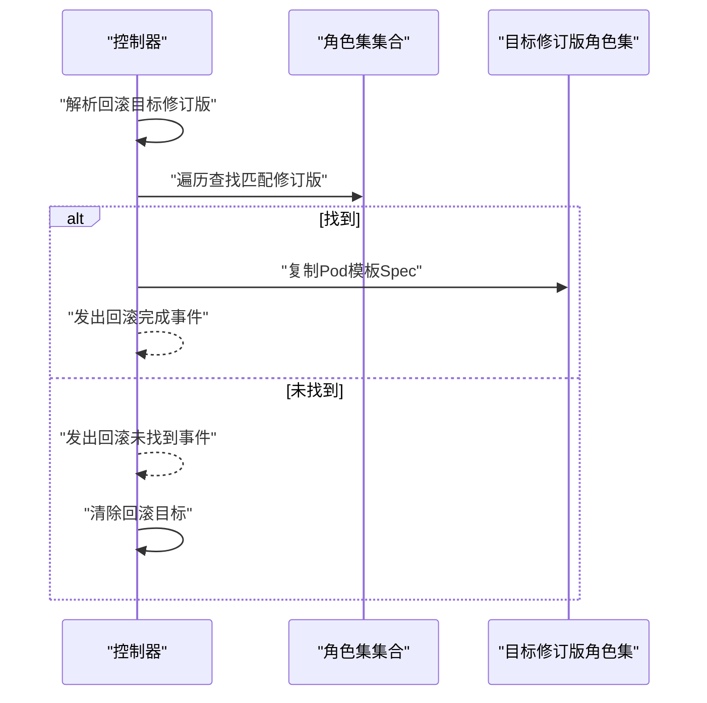
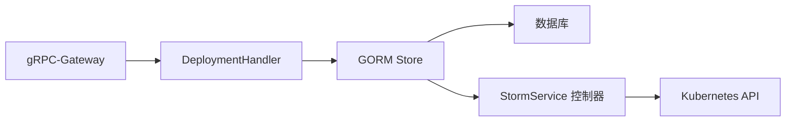

# 部署管理API

<cite>
**本文引用的文件**
- [apps/console/api/handler/deployment.go](file://apps/console/api/handler/deployment.go)
- [apps/console/api/gen/console/v1/console.pb.gw.go](file://apps/console/api/gen/console/v1/console.pb.gw.go)
- [apps/console/api/store/gorm.go](file://apps/console/api/store/gorm.go)
- [apps/console/api/store/models/deployment.go](file://apps/console/api/store/models/deployment.go)
- [pkg/controller/stormservice/stormservice_controller.go](file://pkg/controller/stormservice/stormservice_controller.go)
- [pkg/controller/stormservice/sync.go](file://pkg/controller/stormservice/sync.go)
- [pkg/controller/rayclusterfleet/rollback.go](file://pkg/controller/rayclusterfleet/rollback.go)
- [pkg/controller/rayclusterfleet/util/fleet.go](file://pkg/controller/rayclusterfleet/util/fleet.go)
- [apps/console/api/proto/console/v1/console.proto](file://apps/console/api/proto/console/v1/console.proto)
- [apps/console/api/resource_manager/types/provision.go](file://apps/console/api/resource_manager/types/provision.go)
- [apps/console/web/src/components/CreateDeployment.tsx](file://apps/console/web/src/components/CreateDeployment.tsx)
- [apps/console/web/src/components/CreateModelDeploymentTemplate.tsx](file://apps/console/web/src/components/CreateModelDeploymentTemplate.tsx)
</cite>

## 目录
1. [简介](#简介)
2. [项目结构](#项目结构)
3. [核心组件](#核心组件)
4. [架构总览](#架构总览)
5. [详细组件分析](#详细组件分析)
6. [依赖分析](#依赖分析)
7. [性能考虑](#性能考虑)
8. [故障排除指南](#故障排除指南)
9. [结论](#结论)
10. [附录](#附录)

## 简介
本文件面向AIBrix推理部署管理API，系统性梳理推理部署的创建、查询、更新、删除接口，覆盖部署配置参数（模型选择、资源配置、扩缩容策略）、部署状态监控、部署历史与回滚、部署模板管理、部署验证与迁移等能力。文档同时给出API的HTTP方法、URL路径、请求体字段、响应格式与错误码处理，并提供部署配置示例、常见部署场景与故障排除建议。

## 项目结构
部署管理API由控制台后端服务提供，采用gRPC-Gateway将REST风格请求映射到gRPC服务；数据持久化使用GORM Store；控制器层通过Kubernetes CRD（如StormService）实现部署的编排与滚动升级、扩缩容与回滚。

**图表来源**
- [apps/console/api/gen/console/v1/console.pb.gw.go:118-1539](file://apps/console/api/gen/console/v1/console.pb.gw.go#L118-L1539)
- [apps/console/api/handler/deployment.go:1-58](file://apps/console/api/handler/deployment.go#L1-L58)
- [apps/console/api/store/gorm.go:177-236](file://apps/console/api/store/gorm.go#L177-L236)
- [apps/console/api/store/models/deployment.go:26-89](file://apps/console/api/store/models/deployment.go#L26-L89)
- [pkg/controller/stormservice/stormservice_controller.go:49-83](file://pkg/controller/stormservice/stormservice_controller.go#L49-L83)
- [pkg/controller/stormservice/sync.go:40-71](file://pkg/controller/stormservice/sync.go#L40-L71)
- [pkg/controller/rayclusterfleet/rollback.go:40-72](file://pkg/controller/rayclusterfleet/rollback.go#L40-L72)
- [pkg/controller/rayclusterfleet/util/fleet.go:51-74](file://pkg/controller/rayclusterfleet/util/fleet.go#L51-L74)

**章节来源**
- [apps/console/api/gen/console/v1/console.pb.gw.go:118-1539](file://apps/console/api/gen/console/v1/console.pb.gw.go#L118-L1539)
- [apps/console/api/handler/deployment.go:1-58](file://apps/console/api/handler/deployment.go#L1-L58)
- [apps/console/api/store/gorm.go:177-236](file://apps/console/api/store/gorm.go#L177-L236)
- [apps/console/api/store/models/deployment.go:26-89](file://apps/console/api/store/models/deployment.go#L26-L89)
- [pkg/controller/stormservice/stormservice_controller.go:49-83](file://pkg/controller/stormservice/stormservice_controller.go#L49-L83)
- [pkg/controller/stormservice/sync.go:40-71](file://pkg/controller/stormservice/sync.go#L40-L71)
- [pkg/controller/rayclusterfleet/rollback.go:40-72](file://pkg/controller/rayclusterfleet/rollback.go#L40-L72)
- [pkg/controller/rayclusterfleet/util/fleet.go:51-74](file://pkg/controller/rayclusterfleet/util/fleet.go#L51-L74)

## 核心组件
- API网关与路由：基于gRPC-Gateway生成的HTTP路由，将REST请求映射到DeploymentService。
- 处理器：DeploymentHandler封装对Store的调用，负责业务编排。
- 存储层：GORM Store实现部署的增删改查、模板解析与校验。
- 数据模型：Deployment结构体映射数据库表，提供PB转换。
- 控制器：StormService控制器负责实际的Kubernetes资源编排、滚动升级、扩缩容与回滚。

**章节来源**
- [apps/console/api/handler/deployment.go:27-57](file://apps/console/api/handler/deployment.go#L27-L57)
- [apps/console/api/store/gorm.go:177-236](file://apps/console/api/store/gorm.go#L177-L236)
- [apps/console/api/store/models/deployment.go:26-89](file://apps/console/api/store/models/deployment.go#L26-L89)
- [pkg/controller/stormservice/stormservice_controller.go:85-90](file://pkg/controller/stormservice/stormservice_controller.go#L85-L90)

## 架构总览
下图展示从HTTP请求到Kubernetes资源编排的整体流程，包括模板解析、存储写入、控制器执行与状态更新。

**图表来源**
- [apps/console/api/gen/console/v1/console.pb.gw.go:118-1539](file://apps/console/api/gen/console/v1/console.pb.gw.go#L118-L1539)
- [apps/console/api/handler/deployment.go:48-49](file://apps/console/api/handler/deployment.go#L48-L49)
- [apps/console/api/store/gorm.go:213-225](file://apps/console/api/store/gorm.go#L213-L225)
- [pkg/controller/stormservice/sync.go:40-71](file://pkg/controller/stormservice/sync.go#L40-L71)

## 详细组件分析

### API 定义与路由
- 路由模式与方法
  - 列表部署：GET /api/v1/deployments
  - 获取部署：GET /api/v1/deployments/{id}
  - 创建部署：POST /api/v1/deployments
  - 删除部署：DELETE /api/v1/deployments/{id}
- 请求与响应
  - 请求体字段：名称、基础模型、最小副本数、加速器类型与数量、区域等。
  - 响应体：部署对象，包含ID、名称、状态、GPU配置、命名空间等。
- 错误码
  - 400：参数无效（如必填字段缺失）
  - 404：资源不存在（如部署或模板）
  - 500：内部错误（如数据库或序列化失败）

**章节来源**
- [apps/console/api/gen/console/v1/console.pb.gw.go:1527-1539](file://apps/console/api/gen/console/v1/console.pb.gw.go#L1527-L1539)
- [apps/console/api/handler/deployment.go:36-57](file://apps/console/api/handler/deployment.go#L36-L57)
- [apps/console/api/store/gorm.go:213-225](file://apps/console/api/store/gorm.go#L213-L225)

### 部署处理器与存储
- 处理器职责
  - ListDeployments：按搜索条件查询部署列表。
  - GetDeployment：按ID获取部署详情。
  - CreateDeployment：生成部署ID并写入数据库。
  - DeleteDeployment：根据ID删除部署。
- 存储实现要点
  - 查询支持模糊匹配（名称/基础模型/创建者）。
  - 创建时自动生成DeploymentID与默认状态“Deploying”。
  - 删除返回影响行数，0表示未找到。

**图表来源**
- [apps/console/api/handler/deployment.go:27-57](file://apps/console/api/handler/deployment.go#L27-L57)
- [apps/console/api/store/gorm.go:177-236](file://apps/console/api/store/gorm.go#L177-L236)
- [apps/console/api/store/models/deployment.go:26-89](file://apps/console/api/store/models/deployment.go#L26-L89)

**章节来源**
- [apps/console/api/handler/deployment.go:27-57](file://apps/console/api/handler/deployment.go#L27-L57)
- [apps/console/api/store/gorm.go:177-236](file://apps/console/api/store/gorm.go#L177-L236)
- [apps/console/api/store/models/deployment.go:26-89](file://apps/console/api/store/models/deployment.go#L26-L89)

### 部署模板管理
- 模板创建
  - 字段校验：名称、模型ID、规格必填；默认版本为“v1.0.0”，默认状态为“active”。
  - 规格编码：将模板spec序列化为JSON存入数据库。
  - 冲突检测：同模型下同名模板的版本冲突返回已存在。
- 模板更新
  - 支持更新名称、版本、状态与规格；按ID与模型ID定位记录。
- 模板解析
  - 按模型ID+名称+版本解析；若仅指定名称，则取状态为“active”的最新版本。
- 前端校验
  - 并行度乘积需等于加速器数量；至少选择一个支持的端点。

**图表来源**
- [apps/console/api/store/gorm.go:368-398](file://apps/console/api/store/gorm.go#L368-L398)
- [apps/console/web/src/components/CreateModelDeploymentTemplate.tsx:197-222](file://apps/console/web/src/components/CreateModelDeploymentTemplate.tsx#L197-L222)

**章节来源**
- [apps/console/api/store/gorm.go:368-431](file://apps/console/api/store/gorm.go#L368-L431)
- [apps/console/web/src/components/CreateModelDeploymentTemplate.tsx:197-222](file://apps/console/web/src/components/CreateModelDeploymentTemplate.tsx#L197-L222)

### 扩缩容与滚动升级
- 控制器职责
  - 同步Headless Service、计算副本数、执行扩缩容与滚动升级。
  - 支持暂停时的按修订版比例缩放。
- 关键参数
  - 最小可用、最大Surge、当前/更新修订版副本数。
- 状态更新
  - 聚合各角色集状态，设置就绪/进行中条件。

**图表来源**
- [pkg/controller/stormservice/sync.go:138-259](file://pkg/controller/stormservice/sync.go#L138-L259)
- [pkg/controller/stormservice/sync.go:288-351](file://pkg/controller/stormservice/sync.go#L288-L351)
- [pkg/controller/stormservice/sync.go:353-427](file://pkg/controller/stormservice/sync.go#L353-L427)

**章节来源**
- [pkg/controller/stormservice/sync.go:40-71](file://pkg/controller/stormservice/sync.go#L40-L71)
- [pkg/controller/stormservice/sync.go:138-259](file://pkg/controller/stormservice/sync.go#L138-L259)
- [pkg/controller/stormservice/sync.go:288-351](file://pkg/controller/stormservice/sync.go#L288-L351)
- [pkg/controller/stormservice/sync.go:353-427](file://pkg/controller/stormservice/sync.go#L353-L427)

### 回滚机制
- 回滚触发
  - 根据目标修订版查找对应的角色集模板，复制Pod模板Spec。
  - 若未找到目标修订版，发出警告事件并清除回滚目标。
- 事件与注解
  - 使用修订注解与事件类型标识回滚状态与原因。

**图表来源**
- [pkg/controller/rayclusterfleet/rollback.go:40-72](file://pkg/controller/rayclusterfleet/rollback.go#L40-L72)
- [pkg/controller/rayclusterfleet/util/fleet.go:51-74](file://pkg/controller/rayclusterfleet/util/fleet.go#L51-L74)

**章节来源**
- [pkg/controller/rayclusterfleet/rollback.go:40-72](file://pkg/controller/rayclusterfleet/rollback.go#L40-L72)
- [pkg/controller/rayclusterfleet/util/fleet.go:51-74](file://pkg/controller/rayclusterfleet/util/fleet.go#L51-L74)

### 部署验证与迁移
- 部署验证
  - 前端在创建部署时可启用自动扩缩容，设置最小/最大副本数。
  - 模板创建时校验并行度与加速器数量一致性。
- 迁移
  - 通过模板解析与控制器的修订版机制实现平滑迁移与回滚。

**章节来源**
- [apps/console/web/src/components/CreateDeployment.tsx:325-361](file://apps/console/web/src/components/CreateDeployment.tsx#L325-L361)
- [apps/console/web/src/components/CreateModelDeploymentTemplate.tsx:197-222](file://apps/console/web/src/components/CreateModelDeploymentTemplate.tsx#L197-L222)

## 依赖分析
- 组件耦合
  - API网关与处理器：通过gRPC接口解耦HTTP与gRPC。
  - 处理器与存储：通过Store抽象屏蔽数据库细节。
  - 存储与模型：通过GORM模型映射实现数据持久化。
  - 控制器与Kubernetes：通过CRD与控制器运行时实现资源编排。
- 外部依赖
  - gRPC-Gateway用于HTTP到gRPC的透明代理。
  - Kubernetes API用于角色集与控制器修订版管理。

**图表来源**
- [apps/console/api/gen/console/v1/console.pb.gw.go:1420-1442](file://apps/console/api/gen/console/v1/console.pb.gw.go#L1420-L1442)
- [apps/console/api/handler/deployment.go:27-34](file://apps/console/api/handler/deployment.go#L27-L34)
- [apps/console/api/store/gorm.go:125-137](file://apps/console/api/store/gorm.go#L125-L137)
- [pkg/controller/stormservice/stormservice_controller.go:49-83](file://pkg/controller/stormservice/stormservice_controller.go#L49-L83)

**章节来源**
- [apps/console/api/gen/console/v1/console.pb.gw.go:1420-1442](file://apps/console/api/gen/console/v1/console.pb.gw.go#L1420-L1442)
- [apps/console/api/handler/deployment.go:27-34](file://apps/console/api/handler/deployment.go#L27-L34)
- [apps/console/api/store/gorm.go:125-137](file://apps/console/api/store/gorm.go#L125-L137)
- [pkg/controller/stormservice/stormservice_controller.go:49-83](file://pkg/controller/stormservice/stormservice_controller.go#L49-L83)

## 性能考虑
- 查询优化：列表接口支持模糊搜索，建议在高并发场景下限制每页大小与增加索引。
- 扩缩容策略：合理设置最小可用与最大Surge，避免频繁滚动导致的资源抖动。
- 控制器重试：控制器默认重试间隔为固定秒级，确保在资源不可用时不会过度轮询。
- 模板解析：模板解析仅在创建/更新时进行，建议缓存常用模板以减少重复解析开销。

## 故障排除指南
- 创建部署失败
  - 检查请求体必填字段是否完整；查看存储层返回的参数无效错误。
- 删除部署失败
  - 确认ID是否存在；若返回未找到，确认ID正确性。
- 滚动升级卡住
  - 查看控制器状态中的条件与修订版信息；检查最小可用/最大Surge配置。
- 回滚未生效
  - 确认目标修订版是否存在；查看控制器事件日志。

**章节来源**
- [apps/console/api/store/gorm.go:213-236](file://apps/console/api/store/gorm.go#L213-L236)
- [pkg/controller/stormservice/sync.go:353-427](file://pkg/controller/stormservice/sync.go#L353-L427)
- [pkg/controller/rayclusterfleet/rollback.go:40-72](file://pkg/controller/rayclusterfleet/rollback.go#L40-L72)

## 结论
AIBrix部署管理API通过清晰的分层设计实现了从HTTP请求到Kubernetes资源编排的全链路能力。依托模板管理、扩缩容与回滚机制，用户可以高效地创建、维护与演进推理部署。建议在生产环境中结合监控与告警完善可观测性，并遵循模板与扩缩容最佳实践以提升稳定性与性能。

## 附录

### API 参考

- 列表部署
  - 方法：GET
  - 路径：/api/v1/deployments
  - 查询参数：search（可选，模糊匹配名称/基础模型/创建者）
  - 响应：ListDeploymentsResponse
  - 错误码：400/500

- 获取部署
  - 方法：GET
  - 路径：/api/v1/deployments/{id}
  - 响应：Deployment
  - 错误码：404/500

- 创建部署
  - 方法：POST
  - 路径：/api/v1/deployments
  - 请求体字段：name、baseModel、minReplicas、acceleratorCount、acceleratorType、region
  - 响应：Deployment
  - 错误码：400/500

- 删除部署
  - 方法：DELETE
  - 路径：/api/v1/deployments/{id}
  - 响应：Empty
  - 错误码：404/500

**章节来源**
- [apps/console/api/gen/console/v1/console.pb.gw.go:1527-1539](file://apps/console/api/gen/console/v1/console.pb.gw.go#L1527-L1539)
- [apps/console/api/handler/deployment.go:36-57](file://apps/console/api/handler/deployment.go#L36-L57)
- [apps/console/api/store/gorm.go:213-225](file://apps/console/api/store/gorm.go#L213-L225)

### 部署配置示例（字段说明）
- 名称：部署唯一标识
- 基础模型：推理引擎使用的模型标识
- 最小副本数：初始副本数量
- 加速器类型与数量：GPU/TPU等硬件类型与每副本数量
- 区域：部署所在地理区域
- 环境变量与额外参数：按需传入
- 命名空间：Kubernetes命名空间

**章节来源**
- [apps/console/api/store/models/deployment.go:26-49](file://apps/console/api/store/models/deployment.go#L26-L49)
- [apps/console/web/src/components/CreateDeployment.tsx:325-361](file://apps/console/web/src/components/CreateDeployment.tsx#L325-L361)

### 常见部署场景
- 快速上线：使用模板创建部署，设置最小副本数与加速器配置。
- 弹性扩缩容：开启自动扩缩容，设置最小/最大副本数。
- 版本迁移：通过模板解析与控制器修订版实现平滑升级。
- 紧急回滚：定位目标修订版并触发回滚流程。

**章节来源**
- [apps/console/api/store/gorm.go:497-531](file://apps/console/api/store/gorm.go#L497-L531)
- [pkg/controller/rayclusterfleet/rollback.go:40-72](file://pkg/controller/rayclusterfleet/rollback.go#L40-L72)
- [pkg/controller/stormservice/sync.go:288-351](file://pkg/controller/stormservice/sync.go#L288-L351)