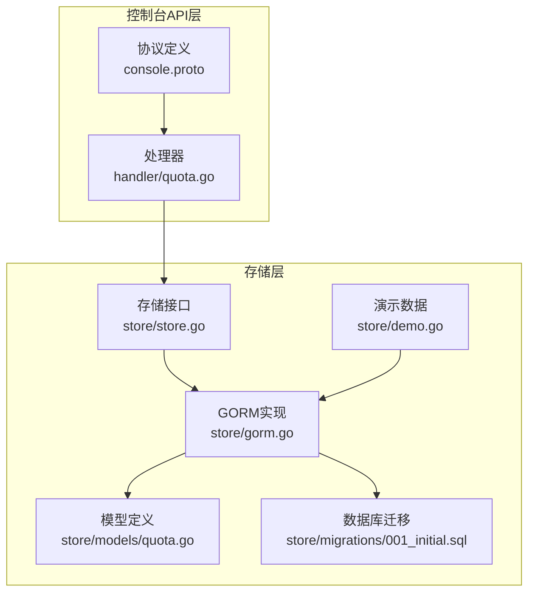
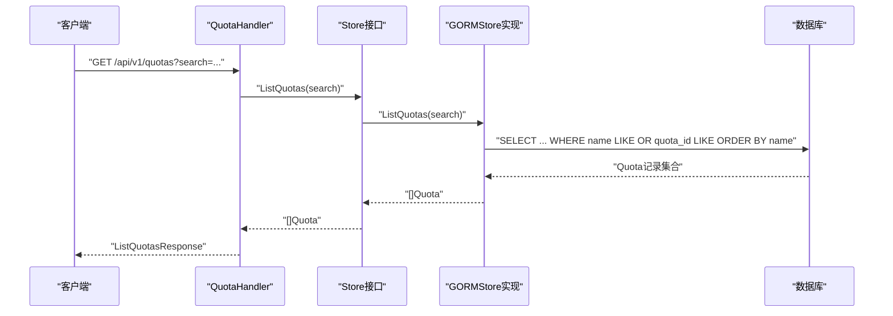
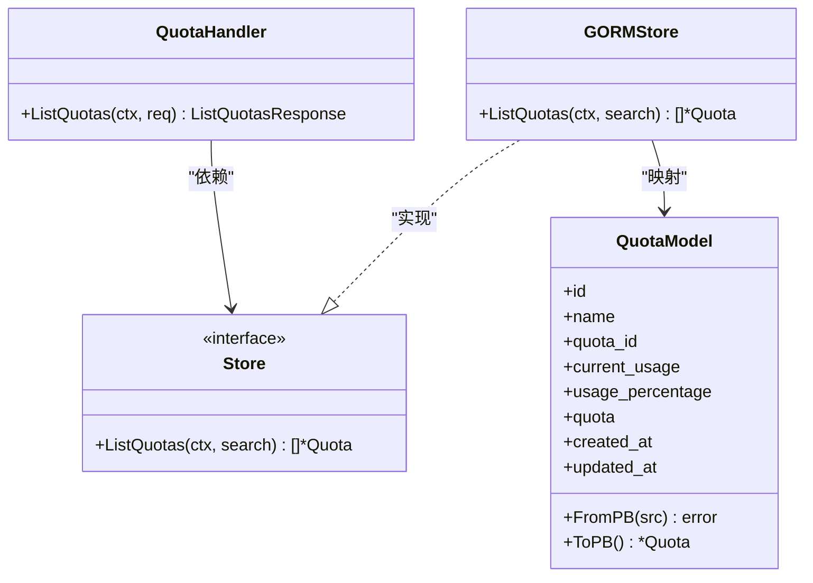
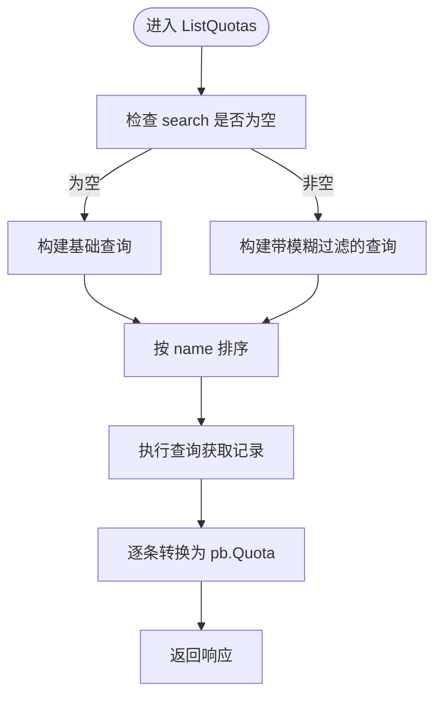
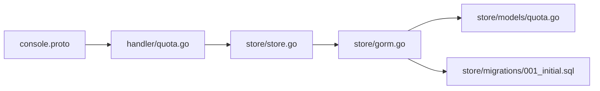

# 配额管理API

<cite>
**本文引用的文件**
- [apps/console/api/proto/console/v1/console.proto](file://apps/console/api/proto/console/v1/console.proto)
- [apps/console/api/handler/quota.go](file://apps/console/api/handler/quota.go)
- [apps/console/api/store/store.go](file://apps/console/api/store/store.go)
- [apps/console/api/store/gorm.go](file://apps/console/api/store/gorm.go)
- [apps/console/api/store/models/quota.go](file://apps/console/api/store/models/quota.go)
- [apps/console/api/store/migrations/001_initial.sql](file://apps/console/api/store/migrations/001_initial.sql)
- [apps/console/api/store/demo.go](file://apps/console/api/store/demo.go)
- [apps/console/api/store/store_test.go](file://apps/console/api/store/store_test.go)
</cite>

## 目录
1. [简介](#简介)
2. [项目结构](#项目结构)
3. [核心组件](#核心组件)
4. [架构总览](#架构总览)
5. [详细组件分析](#详细组件分析)
6. [依赖关系分析](#依赖关系分析)
7. [性能考量](#性能考量)
8. [故障排查指南](#故障排查指南)
9. [结论](#结论)
10. [附录](#附录)

## 简介
本文件面向AIBrix控制台的配额管理API，系统性梳理资源配额的接口能力、数据模型、存储实现与扩展方向。当前仓库中已实现配额查询能力（按名称或配额ID模糊检索），并预留了配额创建、更新、删除等接口契约。本文将基于现有代码对配额API进行完整说明，并给出配额类型、使用量统计、配额预警、配额继承、审计与变更历史、配额回收与超限处理等概念性设计建议，帮助读者在不改变现有实现的前提下完成配额全生命周期管理。

## 项目结构
配额管理相关代码主要分布在以下模块：
- 协议与服务定义：apps/console/api/proto/console/v1/console.proto
- 处理器：apps/console/api/handler/quota.go
- 存储接口与实现：apps/console/api/store/store.go、apps/console/api/store/gorm.go
- 数据模型：apps/console/api/store/models/quota.go
- 初始化迁移：apps/console/api/store/migrations/001_initial.sql
- 示例数据：apps/console/api/store/demo.go
- 测试用例：apps/console/api/store/store_test.go

图表来源
- [apps/console/api/proto/console/v1/console.proto:644-671](file://apps/console/api/proto/console/v1/console.proto#L644-L671)
- [apps/console/api/handler/quota.go:26-41](file://apps/console/api/handler/quota.go#L26-L41)
- [apps/console/api/store/store.go:26-103](file://apps/console/api/store/store.go#L26-L103)
- [apps/console/api/store/gorm.go:626-645](file://apps/console/api/store/gorm.go#L626-L645)
- [apps/console/api/store/models/quota.go:25-64](file://apps/console/api/store/models/quota.go#L25-L64)
- [apps/console/api/store/migrations/001_initial.sql:123-134](file://apps/console/api/store/migrations/001_initial.sql#L123-L134)
- [apps/console/api/store/demo.go:404-424](file://apps/console/api/store/demo.go#L404-L424)

章节来源
- [apps/console/api/proto/console/v1/console.proto:644-671](file://apps/console/api/proto/console/v1/console.proto#L644-L671)
- [apps/console/api/handler/quota.go:26-41](file://apps/console/api/handler/quota.go#L26-L41)
- [apps/console/api/store/store.go:26-103](file://apps/console/api/store/store.go#L26-L103)
- [apps/console/api/store/gorm.go:626-645](file://apps/console/api/store/gorm.go#L626-L645)
- [apps/console/api/store/models/quota.go:25-64](file://apps/console/api/store/models/quota.go#L25-L64)
- [apps/console/api/store/migrations/001_initial.sql:123-134](file://apps/console/api/store/migrations/001_initial.sql#L123-L134)
- [apps/console/api/store/demo.go:404-424](file://apps/console/api/store/demo.go#L404-L424)

## 核心组件
- 服务契约与消息体
  - QuotaService.ListQuotas 提供配额列表查询，支持按名称或配额ID模糊检索。
  - Quota 消息体包含配额标识、显示名称、当前用量、使用百分比、总量等字段。
- 处理器
  - QuotaHandler.ListQuotas 将请求转发至存储层并返回结果。
- 存储接口
  - Store.ListQuotas 定义配额查询接口。
- GORM实现
  - GORMStore.ListQuotas 实现查询逻辑，支持模糊匹配与排序。
- 数据模型
  - models.Quota 映射 quotas 表，包含主键、唯一索引的 quota_id、当前用量、使用百分比、总量及时间戳。
- 迁移与示例
  - migrations/001_initial.sql 定义 quotas 表结构；demo.go 提供演示配额数据。

章节来源
- [apps/console/api/proto/console/v1/console.proto:644-671](file://apps/console/api/proto/console/v1/console.proto#L644-L671)
- [apps/console/api/handler/quota.go:35-41](file://apps/console/api/handler/quota.go#L35-L41)
- [apps/console/api/store/store.go:74-75](file://apps/console/api/store/store.go#L74-L75)
- [apps/console/api/store/gorm.go:626-645](file://apps/console/api/store/gorm.go#L626-L645)
- [apps/console/api/store/models/quota.go:25-64](file://apps/console/api/store/models/quota.go#L25-L64)
- [apps/console/api/store/migrations/001_initial.sql:123-134](file://apps/console/api/store/migrations/001_initial.sql#L123-L134)
- [apps/console/api/store/demo.go:404-424](file://apps/console/api/store/demo.go#L404-L424)

## 架构总览
下图展示从HTTP请求到数据库查询的端到端流程，以及处理器与存储层的交互。

图表来源
- [apps/console/api/proto/console/v1/console.proto:644-671](file://apps/console/api/proto/console/v1/console.proto#L644-L671)
- [apps/console/api/handler/quota.go:35-41](file://apps/console/api/handler/quota.go#L35-L41)
- [apps/console/api/store/store.go:74-75](file://apps/console/api/store/store.go#L74-L75)
- [apps/console/api/store/gorm.go:626-645](file://apps/console/api/store/gorm.go#L626-L645)

## 详细组件分析

### 服务与消息体
- QuotaService
  - ListQuotas: 支持可选的 search 查询参数，返回配额列表。
- Quota
  - 字段含义：id、name、quota_id、current_usage、usage_percentage、quota。
- ListQuotasRequest/Response
  - 请求携带 search；响应包含配额数组。

章节来源
- [apps/console/api/proto/console/v1/console.proto:644-671](file://apps/console/api/proto/console/v1/console.proto#L644-L671)

### 处理器实现
- QuotaHandler
  - 维护 Store 依赖。
  - ListQuotas 调用 Store.ListQuotas 并封装响应。

章节来源
- [apps/console/api/handler/quota.go:26-41](file://apps/console/api/handler/quota.go#L26-L41)

### 存储接口与实现
- Store 接口
  - ListQuotas(ctx, search) 定义查询契约。
- GORMStore 实现
  - ListQuotas 实现：构造查询条件（模糊匹配 name 或 quota_id），排序后查询，逐条转换为 pb.Quota 返回。
- 错误处理
  - 查询失败返回 Internal；转换失败返回 Internal；未找到记录时由上层处理（当前仅实现查询）。

章节来源
- [apps/console/api/store/store.go:74-75](file://apps/console/api/store/store.go#L74-L75)
- [apps/console/api/store/gorm.go:626-645](file://apps/console/api/store/gorm.go#L626-L645)

### 数据模型与迁移
- Quota 模型
  - 主键：id（36字符）
  - 唯一索引：quota_id
  - 字段：name、current_usage、usage_percentage、quota、created_at、updated_at
- 迁移脚本
  - 创建 quotas 表，包含上述列与索引。
- 演示数据
  - 提供多条示例配额，覆盖不同资源类型（如GPU计数类配额）。

章节来源
- [apps/console/api/store/models/quota.go:25-64](file://apps/console/api/store/models/quota.go#L25-L64)
- [apps/console/api/store/migrations/001_initial.sql:123-134](file://apps/console/api/store/migrations/001_initial.sql#L123-L134)
- [apps/console/api/store/demo.go:404-424](file://apps/console/api/store/demo.go#L404-L424)

### 类关系图（代码级）

图表来源
- [apps/console/api/handler/quota.go:26-41](file://apps/console/api/handler/quota.go#L26-L41)
- [apps/console/api/store/store.go:26-103](file://apps/console/api/store/store.go#L26-L103)
- [apps/console/api/store/gorm.go:626-645](file://apps/console/api/store/gorm.go#L626-L645)
- [apps/console/api/store/models/quota.go:25-64](file://apps/console/api/store/models/quota.go#L25-L64)

### 查询流程图（算法实现）

图表来源
- [apps/console/api/store/gorm.go:626-645](file://apps/console/api/store/gorm.go#L626-L645)

### 已有测试验证点
- 按关键字“H100”检索，返回唯一匹配项。
- 返回的配额对象包含 id、name、quota_id 等字段。

章节来源
- [apps/console/api/store/store_test.go:836-862](file://apps/console/api/store/store_test.go#L836-L862)

## 依赖关系分析
- 控制面依赖链
  - console.proto 定义服务与消息体 → handler/quota.go 实现处理器 → store/store.go 定义接口 → store/gorm.go 实现接口 → models/quota.go 映射表结构 → migrations/001_initial.sql 初始化表。
- 外部依赖
  - 使用 gorm/sqlite 进行本地开发与测试；生产环境可替换为 MySQL 等持久化存储。
- 可能的耦合点
  - QuotaHandler 与 Store 的紧耦合；若后续扩展配额 CRUD，建议通过 Store 接口抽象统一处理。

图表来源
- [apps/console/api/proto/console/v1/console.proto:644-671](file://apps/console/api/proto/console/v1/console.proto#L644-L671)
- [apps/console/api/handler/quota.go:26-41](file://apps/console/api/handler/quota.go#L26-L41)
- [apps/console/api/store/store.go:26-103](file://apps/console/api/store/store.go#L26-L103)
- [apps/console/api/store/gorm.go:626-645](file://apps/console/api/store/gorm.go#L626-L645)
- [apps/console/api/store/models/quota.go:25-64](file://apps/console/api/store/models/quota.go#L25-L64)
- [apps/console/api/store/migrations/001_initial.sql:123-134](file://apps/console/api/store/migrations/001_initial.sql#L123-L134)

## 性能考量
- 查询性能
  - 当前实现对 name 与 quota_id 均建立 LIKE 匹配，建议在生产环境为 name、quota_id 添加合适索引以提升模糊查询效率。
- 排序与分页
  - 当前按 name 排序；如数据量增大，建议引入分页参数（limit/offset）以避免一次性返回过多记录。
- 转换开销
  - 每条记录转换为 pb.Quota 存在一定开销，建议在高频场景下评估批量转换与缓存策略。

## 故障排查指南
- 常见错误
  - Internal：数据库查询或转换失败。
  - NotFound：未来扩展删除/查询单条配额时可能返回。
- 排查步骤
  - 确认数据库连接与迁移是否成功。
  - 检查 search 参数是否正确传入。
  - 核对 quotas 表是否存在且字段完整。
- 单元测试参考
  - 参考 store_test 中的 ListQuotas_WithSearch 与 QuotaValues 用例，定位问题范围。

章节来源
- [apps/console/api/store/gorm.go:626-645](file://apps/console/api/store/gorm.go#L626-L645)
- [apps/console/api/store/store_test.go:836-862](file://apps/console/api/store/store_test.go#L836-L862)

## 结论
当前仓库已实现配额查询能力，具备良好的扩展基础。建议下一步完善配额的创建、更新、删除接口与业务规则，同时补充配额使用量统计、预警阈值、继承关系、审计日志与变更历史等能力，以满足生产环境的配额全生命周期管理需求。

## 附录

### 配额API规范（概念性建议）
- 配额类型
  - 计算资源：CPU、内存、存储、GPU 数量/显存占比
  - 请求与并发：QPS、并发会话数、批处理任务数
  - 成本与配额：日/月度额度、调用次数、Token 用量
- 配额分配策略
  - 全局配额：集群/区域级上限
  - 组织/项目配额：按组织或项目维度划分
  - 用户配额：按用户维度隔离
- 使用量统计
  - 实时统计：基于运行时指标（如GPU利用率、内存占用、请求速率）
  - 周期统计：按日/周/月汇总，用于计费与预算控制
- 预警机制
  - 阈值：如达到 80%/90% 触发告警
  - 通知：邮件/IM/Webhook
- 配额限制规则
  - 最小/最大值约束、步长、单位换算
- 配额继承关系
  - 组织 → 项目 → 用户 → 资源实例的层级继承
- 审计与变更历史
  - 记录创建、修改、删除、超额事件的时间、主体、详情
- 配额回收与超限处理
  - 回收：过期/释放资源后回退配额
  - 超限：阻断新增、降级处理、排队或熔断
- 配额计算公式（示例）
  - 使用率 = 当前用量 / 配额总量
  - 剩余额度 = 配额总量 - 当前用量
- 配额规划与优化建议
  - 基于历史峰值与增长趋势设定初始配额
  - 引入弹性与自动扩缩容策略，动态调整配额
  - 对热点资源设置缓冲与优先级队列，避免尾延迟