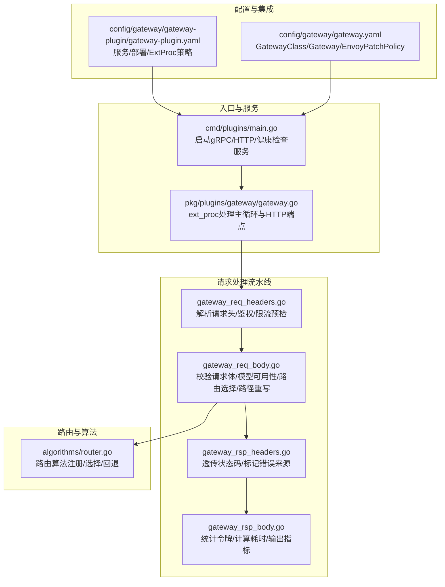
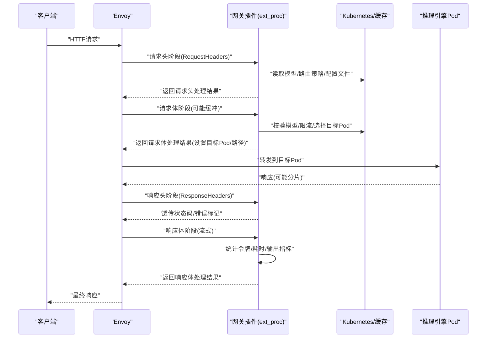
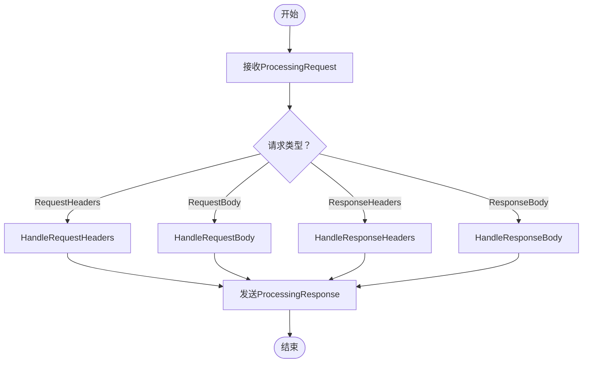
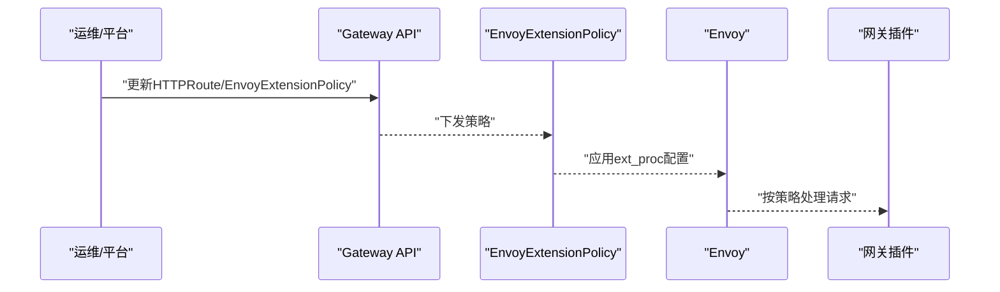
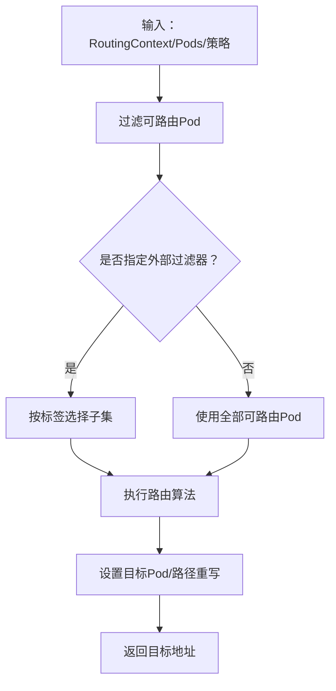
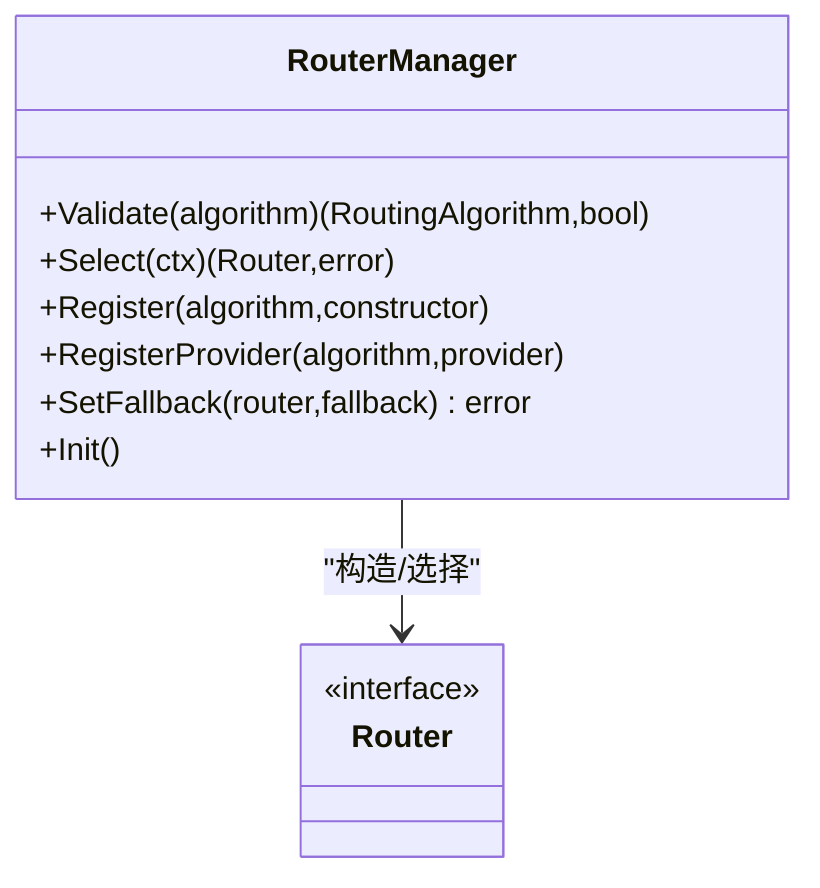
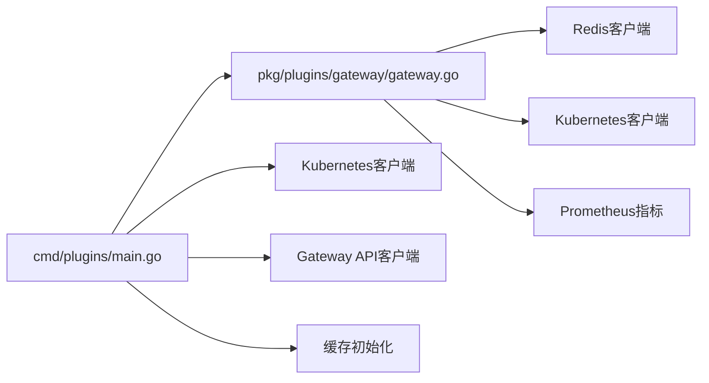

# 网关API

<cite>
**本文引用的文件**
- [pkg/plugins/gateway/gateway.go](file://pkg/plugins/gateway/gateway.go)
- [pkg/plugins/gateway/types.go](file://pkg/plugins/gateway/types.go)
- [pkg/plugins/gateway/gateway_req_headers.go](file://pkg/plugins/gateway/gateway_req_headers.go)
- [pkg/plugins/gateway/gateway_req_body.go](file://pkg/plugins/gateway/gateway_req_body.go)
- [pkg/plugins/gateway/gateway_rsp_headers.go](file://pkg/plugins/gateway/gateway_rsp_headers.go)
- [pkg/plugins/gateway/gateway_rsp_body.go](file://pkg/plugins/gateway/gateway_rsp_body.go)
- [pkg/plugins/gateway/algorithms/router.go](file://pkg/plugins/gateway/algorithms/router.go)
- [cmd/plugins/main.go](file://cmd/plugins/main.go)
- [config/gateway/gateway-plugin/gateway-plugin.yaml](file://config/gateway/gateway-plugin/gateway-plugin.yaml)
- [config/gateway/gateway.yaml](file://config/gateway/gateway.yaml)
</cite>

## 目录
1. [简介](#简介)
2. [项目结构](#项目结构)
3. [核心组件](#核心组件)
4. [架构总览](#架构总览)
5. [详细组件分析](#详细组件分析)
6. [依赖分析](#依赖分析)
7. [性能考虑](#性能考虑)
8. [故障排除指南](#故障排除指南)
9. [结论](#结论)
10. [附录](#附录)

## 简介
本技术文档面向AIBrix网关系统的RESTful API与Envoy扩展处理器（ext_proc）集成，系统性梳理以下能力：
- 请求路由接口：基于模型名与路由策略的动态选择后端推理引擎实例。
- 负载均衡接口：支持多种路由算法（如最小负载、延迟、GPU缓存占用等），并可扩展自定义算法。
- 速率限制接口：支持账户级（TPM/RPM）与模型级速率限制，结合Redis实现。
- 队列管理接口：内置简单队列与SLO队列，用于请求排队与超时控制。
- 算法选择接口：通过请求头或配置文件选择路由算法，并在运行时生效。
- 外部处理器接口：gRPC服务，作为Envoy的外部处理器，按阶段处理请求/响应头与主体。
- 健康检查接口：gRPC健康检查服务，便于Envoy与Kubernetes探针使用。
- 配置接口与动态路由更新：通过Kubernetes Gateway API与EnvoyExtensionPolicy声明式配置，支持运行时路由策略变更。
- 性能监控接口：内置Prometheus指标端点，覆盖请求总量、令牌桶、首Token耗时等。
- 与Envoy的集成方式：通过EnvoyExtensionPolicy将ext_proc注入到HTTP路由链路中，实现请求转发与响应处理。
- 插件扩展接口与自定义算法接入：通过RouterManager注册与选择路由算法，支持幂等初始化与回退策略。
- 部署配置、性能调优与故障排除：涵盖容器资源、探针、路由超时、连接缓冲等运维要点。

## 项目结构
网关系统由“入口命令”、“网关插件服务器”、“路由算法库”、“速率限制器”、“队列模块”、“类型与常量”以及“Kubernetes/Envoy配置”组成。下图展示与API相关的核心文件与职责映射：

**图表来源**
- [cmd/plugins/main.go:1-198](file://cmd/plugins/main.go#L1-L198)
- [pkg/plugins/gateway/gateway.go:123-331](file://pkg/plugins/gateway/gateway.go#L123-L331)
- [pkg/plugins/gateway/gateway_req_headers.go:41-125](file://pkg/plugins/gateway/gateway_req_headers.go#L41-L125)
- [pkg/plugins/gateway/gateway_req_body.go:38-175](file://pkg/plugins/gateway/gateway_req_body.go#L38-L175)
- [pkg/plugins/gateway/gateway_rsp_headers.go:29-97](file://pkg/plugins/gateway/gateway_rsp_headers.go#L29-L97)
- [pkg/plugins/gateway/gateway_rsp_body.go:62-156](file://pkg/plugins/gateway/gateway_rsp_body.go#L62-L156)
- [pkg/plugins/gateway/algorithms/router.go:41-153](file://pkg/plugins/gateway/algorithms/router.go#L41-L153)
- [config/gateway/gateway-plugin/gateway-plugin.yaml:1-227](file://config/gateway/gateway-plugin/gateway-plugin.yaml#L1-L227)
- [config/gateway/gateway.yaml:1-147](file://config/gateway/gateway.yaml#L1-L147)

**章节来源**
- [cmd/plugins/main.go:1-198](file://cmd/plugins/main.go#L1-L198)
- [pkg/plugins/gateway/gateway.go:399-462](file://pkg/plugins/gateway/gateway.go#L399-L462)
- [config/gateway/gateway-plugin/gateway-plugin.yaml:132-227](file://config/gateway/gateway-plugin/gateway-plugin.yaml#L132-L227)
- [config/gateway/gateway.yaml:14-147](file://config/gateway/gateway.yaml#L14-L147)

## 核心组件
- 网关服务器（Server）
  - 提供gRPC ExternalProcessor服务，驱动请求生命周期的多阶段处理。
  - 提供HTTP服务，暴露/metrics与/v1/models端点。
  - 维护速率限制器、缓存、Kubernetes客户端、Gateway API客户端等依赖。
- 请求处理阶段
  - 请求头阶段：解析用户、鉴权、会话ID、路由策略、配置文件等；进行账户级限流预检。
  - 请求体阶段：校验请求体、解析模型、派生引擎类型、应用模型级RPS限制、选择目标Pod、路径重写、记录请求计数。
  - 响应头阶段：透传状态码、标记错误来源、设置路由与目标Pod信息。
  - 响应体阶段：统计令牌用量、计算TTFT/总耗时、输出Prometheus指标、清理追踪。
- 路由算法管理（RouterManager）
  - 注册/选择路由算法，支持回退策略与初始化超时保护。
- 配置与集成
  - 通过Kubernetes Gateway API与EnvoyExtensionPolicy声明式配置，将ext_proc注入到HTTP路由链路。
  - 通过EnvoyPatchPolicy对路由与集群行为进行增强（如原始目标负载均衡、超时、缓冲区大小等）。

**章节来源**
- [pkg/plugins/gateway/gateway.go:62-121](file://pkg/plugins/gateway/gateway.go#L62-L121)
- [pkg/plugins/gateway/gateway_req_headers.go:41-125](file://pkg/plugins/gateway/gateway_req_headers.go#L41-L125)
- [pkg/plugins/gateway/gateway_req_body.go:38-175](file://pkg/plugins/gateway/gateway_req_body.go#L38-L175)
- [pkg/plugins/gateway/gateway_rsp_headers.go:29-97](file://pkg/plugins/gateway/gateway_rsp_headers.go#L29-L97)
- [pkg/plugins/gateway/gateway_rsp_body.go:62-156](file://pkg/plugins/gateway/gateway_rsp_body.go#L62-L156)
- [pkg/plugins/gateway/algorithms/router.go:41-153](file://pkg/plugins/gateway/algorithms/router.go#L41-L153)

## 架构总览
下图展示从客户端到Envoy再到网关插件与后端推理引擎的整体链路，以及各阶段的处理点与指标输出位置。

**图表来源**
- [pkg/plugins/gateway/gateway.go:238-303](file://pkg/plugins/gateway/gateway.go#L238-L303)
- [pkg/plugins/gateway/gateway_req_headers.go:41-125](file://pkg/plugins/gateway/gateway_req_headers.go#L41-L125)
- [pkg/plugins/gateway/gateway_req_body.go:38-175](file://pkg/plugins/gateway/gateway_req_body.go#L38-L175)
- [pkg/plugins/gateway/gateway_rsp_headers.go:29-97](file://pkg/plugins/gateway/gateway_rsp_headers.go#L29-L97)
- [pkg/plugins/gateway/gateway_rsp_body.go:62-156](file://pkg/plugins/gateway/gateway_rsp_body.go#L62-L156)
- [config/gateway/gateway-plugin/gateway-plugin.yaml:212-227](file://config/gateway/gateway-plugin/gateway-plugin.yaml#L212-L227)

## 详细组件分析

### 外部处理器接口（gRPC）
- 服务：ExternalProcessor.Process（双向流）
- 主循环：接收消息、分发到对应阶段处理、发送响应。
- 关键阶段：
  - 请求头：解析用户、鉴权、会话ID、路由策略、配置文件；进行账户级限流预检。
  - 请求体：校验请求体、解析模型、派生引擎类型、应用模型级RPS限制、选择目标Pod、路径重写、记录请求计数。
  - 响应头：透传状态码、标记错误来源、设置路由与目标Pod信息。
  - 响应体：统计令牌用量、计算TTFT/总耗时、输出Prometheus指标、清理追踪。
- 错误处理：根据错误类型生成带错误头的ImmediateResponse，便于上层统一处理。

**图表来源**
- [pkg/plugins/gateway/gateway.go:140-156](file://pkg/plugins/gateway/gateway.go#L140-L156)
- [pkg/plugins/gateway/gateway_req_headers.go:41-125](file://pkg/plugins/gateway/gateway_req_headers.go#L41-L125)
- [pkg/plugins/gateway/gateway_req_body.go:38-175](file://pkg/plugins/gateway/gateway_req_body.go#L38-L175)
- [pkg/plugins/gateway/gateway_rsp_headers.go:29-97](file://pkg/plugins/gateway/gateway_rsp_headers.go#L29-L97)
- [pkg/plugins/gateway/gateway_rsp_body.go:62-156](file://pkg/plugins/gateway/gateway_rsp_body.go#L62-L156)

**章节来源**
- [pkg/plugins/gateway/gateway.go:123-331](file://pkg/plugins/gateway/gateway.go#L123-L331)

### 健康检查接口（gRPC Health）
- 服务：grpc.health.v1.Health
- 状态：SERVING（网关插件就绪）
- 用途：Envoy探针与Kubernetes Liveness/Readiness

**章节来源**
- [cmd/plugins/main.go:169-171](file://cmd/plugins/main.go#L169-L171)

### 配置接口与动态路由更新
- 模型列表接口（HTTP）
  - 路径：/v1/models
  - 方法：GET
  - 行为：返回已注册模型清单（兼容OpenAI风格）
- 动态路由更新
  - 通过Kubernetes Gateway API与EnvoyExtensionPolicy声明式配置，将ext_proc注入到HTTP路由链路。
  - 通过EnvoyPatchPolicy调整路由超时、连接缓冲、原始目标负载均衡等行为。
  - 可通过修改HTTPRoute与EnvoyExtensionPolicy实现路由策略变更与流量切换。

**图表来源**
- [pkg/plugins/gateway/gateway.go:433-462](file://pkg/plugins/gateway/gateway.go#L433-L462)
- [config/gateway/gateway-plugin/gateway-plugin.yaml:132-227](file://config/gateway/gateway-plugin/gateway-plugin.yaml#L132-L227)
- [config/gateway/gateway.yaml:88-147](file://config/gateway/gateway.yaml#L88-L147)

**章节来源**
- [pkg/plugins/gateway/gateway.go:399-462](file://pkg/plugins/gateway/gateway.go#L399-L462)
- [config/gateway/gateway-plugin/gateway-plugin.yaml:132-227](file://config/gateway/gateway-plugin/gateway-plugin.yaml#L132-L227)
- [config/gateway/gateway.yaml:88-147](file://config/gateway/gateway.yaml#L88-L147)

### 性能监控接口（Prometheus）
- 端点：/metrics
- 指标类别：
  - 请求总量/成功/失败
  - 令牌桶分布（提示/补全/总计）
  - TTFT/路由/预填充/KV传输/解码/总耗时桶
  - 首Token超过1秒的事件计数
- 输出：Prometheus文本格式

**章节来源**
- [pkg/plugins/gateway/gateway.go:408-409](file://pkg/plugins/gateway/gateway.go#L408-L409)
- [pkg/plugins/gateway/gateway_rsp_body.go:252-301](file://pkg/plugins/gateway/gateway_rsp_body.go#L252-L301)

### 请求路由与负载均衡接口
- 路由策略来源优先级：请求头 > 配置文件 > 环境变量
- 支持算法：随机、最少请求、最少负载、最少延迟、最少GPU缓存占用、最少KV缓存占用、吞吐优先、SLO、前缀缓存、VTB、PD拆分等
- 目标选择：过滤可路由Pod、应用外部标签筛选、执行路由算法、设置目标Pod与路径重写
- 路由验证：对非PD策略，校验HTTPRoute状态以确保路由生效

**图表来源**
- [pkg/plugins/gateway/gateway.go:333-360](file://pkg/plugins/gateway/gateway.go#L333-L360)
- [pkg/plugins/gateway/gateway_req_body.go:120-153](file://pkg/plugins/gateway/gateway_req_body.go#L120-L153)

**章节来源**
- [pkg/plugins/gateway/gateway.go:333-397](file://pkg/plugins/gateway/gateway.go#L333-L397)
- [pkg/plugins/gateway/gateway_req_body.go:120-153](file://pkg/plugins/gateway/gateway_req_body.go#L120-L153)
- [pkg/plugins/gateway/algorithms/router.go:57-85](file://pkg/plugins/gateway/algorithms/router.go#L57-L85)

### 速率限制接口
- 账户级（TPM/RPM）：基于Redis实现，按用户维度累加令牌与请求次数。
- 模型级RPS：在请求体阶段强制校验与释放，避免过载。
- 限流头：成功时返回更新后的RPM/TPM值，失败时返回相应错误头。

**章节来源**
- [pkg/plugins/gateway/gateway_req_headers.go:88-93](file://pkg/plugins/gateway/gateway_req_headers.go#L88-L93)
- [pkg/plugins/gateway/gateway_req_body.go:110-118](file://pkg/plugins/gateway/gateway_req_body.go#L110-L118)
- [pkg/plugins/gateway/gateway_rsp_body.go:122-136](file://pkg/plugins/gateway/gateway_rsp_body.go#L122-L136)

### 队列管理接口
- 内置队列：simple_queue与slo_queue，支持排队与超时控制。
- 使用场景：在高并发下平滑突发流量，配合路由算法与限流策略。

**章节来源**
- [pkg/plugins/gateway/queue/simple_queue.go](file://pkg/plugins/gateway/queue/simple_queue.go)
- [pkg/plugins/gateway/queue/slo_queue.go](file://pkg/plugins/gateway/queue/slo_queue.go)

### 算法选择接口
- 通过请求头（routing-strategy）、配置文件（config-profile）或环境变量（ROUTING_ALGORITHM）选择算法。
- 支持运行时回退策略与初始化超时保护。

**章节来源**
- [pkg/plugins/gateway/types.go:76-116](file://pkg/plugins/gateway/types.go#L76-L116)
- [pkg/plugins/gateway/algorithms/router.go:115-139](file://pkg/plugins/gateway/algorithms/router.go#L115-L139)

### 插件扩展接口与自定义算法接入
- RouterManager提供注册/选择/回退能力，支持幂等初始化。
- 自定义算法需实现Router接口并通过Register/Provider注册。

**图表来源**
- [pkg/plugins/gateway/algorithms/router.go:41-153](file://pkg/plugins/gateway/algorithms/router.go#L41-L153)

**章节来源**
- [pkg/plugins/gateway/algorithms/router.go:41-153](file://pkg/plugins/gateway/algorithms/router.go#L41-L153)

## 依赖分析
- 入口命令依赖：
  - gRPC服务器、HTTP服务器、健康检查服务
  - Kubernetes与Gateway API客户端
  - 缓存初始化与路由算法工厂
- 网关服务器依赖：
  - Redis（速率限制）
  - Kubernetes（Pod发现/状态）
  - 缓存（模型/指标/请求计数）
  - Prometheus（指标导出）

**图表来源**
- [cmd/plugins/main.go:108-152](file://cmd/plugins/main.go#L108-L152)
- [pkg/plugins/gateway/gateway.go:94-121](file://pkg/plugins/gateway/gateway.go#L94-L121)

**章节来源**
- [cmd/plugins/main.go:108-152](file://cmd/plugins/main.go#L108-L152)
- [pkg/plugins/gateway/gateway.go:94-121](file://pkg/plugins/gateway/gateway.go#L94-L121)

## 性能考虑
- 连接与缓冲
  - 客户端连接缓冲可通过ClientTrafficPolicy设置。
  - EnvoyPatchPolicy对原始目标集群启用原始目标LB与超时，提升直连效率。
- 路由超时
  - 路由超时默认增加，避免长尾请求阻塞。
- 探针与资源
  - 网关插件容器配置CPU/Memory请求与限制，探针使用gRPC端口。
- 指标与阈值
  - TTFT阈值可通过环境变量配置，默认1秒。
  - 指标桶划分便于定位性能瓶颈。

**章节来源**
- [config/gateway/gateway.yaml:88-147](file://config/gateway/gateway.yaml#L88-L147)
- [config/gateway/gateway-plugin/gateway-plugin.yaml:74-130](file://config/gateway/gateway-plugin/gateway-plugin.yaml#L74-L130)
- [pkg/plugins/gateway/gateway_rsp_body.go:48-50](file://pkg/plugins/gateway/gateway_rsp_body.go#L48-L50)

## 故障排除指南
- 常见错误头
  - 用户/路由/请求体处理/响应反序列化/未知响应错误头，便于快速定位问题阶段。
- HTTP端点
  - /v1/models仅支持GET，其他方法返回405。
- gRPC健康检查
  - 若健康检查失败，检查网关插件端口与探针配置。
- 路由失败
  - 非PD策略时若HTTPRoute未被接受或引用未解析，将返回503并附带原因。
- 速率限制
  - 账户级/模型级限流失败时，检查Redis连通性与限流头返回值。
- 响应处理
  - 流式响应解析失败时，检查后端返回格式与SSE解码逻辑。

**章节来源**
- [pkg/plugins/gateway/types.go:24-121](file://pkg/plugins/gateway/types.go#L24-L121)
- [pkg/plugins/gateway/gateway.go:433-462](file://pkg/plugins/gateway/gateway.go#L433-L462)
- [pkg/plugins/gateway/gateway.go:482-507](file://pkg/plugins/gateway/gateway.go#L482-L507)
- [pkg/plugins/gateway/gateway_req_headers.go:76-93](file://pkg/plugins/gateway/gateway_req_headers.go#L76-L93)
- [pkg/plugins/gateway/gateway_req_body.go:120-124](file://pkg/plugins/gateway/gateway_req_body.go#L120-L124)
- [pkg/plugins/gateway/gateway_rsp_body.go:99-108](file://pkg/plugins/gateway/gateway_rsp_body.go#L99-L108)

## 结论
AIBrix网关通过Envoy扩展处理器实现了对OpenAI兼容API的统一接入与治理，具备完善的路由、限流、队列、监控与可观测能力。借助声明式配置，可在不重启的情况下动态调整路由策略与性能参数。建议在生产环境中结合Redis限流、Prometheus指标与探针配置，持续优化路由算法与超时策略，以获得稳定与低延迟的服务体验。

## 附录
- 端点与方法
  - GET /v1/models：列出已注册模型
  - /metrics：Prometheus指标
- 关键请求头
  - routing-strategy：路由算法
  - config-profile：配置文件
  - x-session-id：会话亲和
  - external-filter：外部标签过滤
  - target-pod/target-pod-ip：目标Pod信息
- 环境变量
  - AIBRIX_TTFT_THRESHOLD_S：TTFT阈值（秒）
  - REDIS_HOST/REDIS_PORT：Redis连接
  - 各类缓存与前缀缓存相关参数

**章节来源**
- [pkg/plugins/gateway/types.go:76-116](file://pkg/plugins/gateway/types.go#L76-L116)
- [pkg/plugins/gateway/gateway.go:408-409](file://pkg/plugins/gateway/gateway.go#L408-L409)
- [config/gateway/gateway-plugin/gateway-plugin.yaml:92-120](file://config/gateway/gateway-plugin/gateway-plugin.yaml#L92-L120)