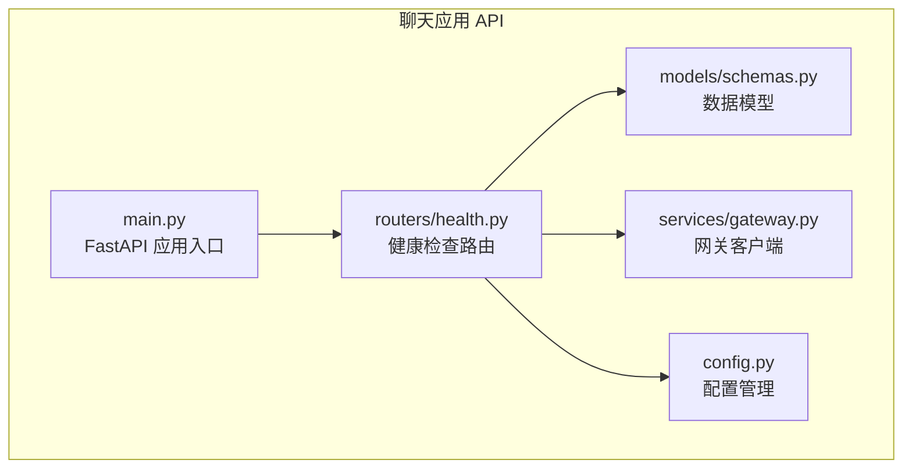
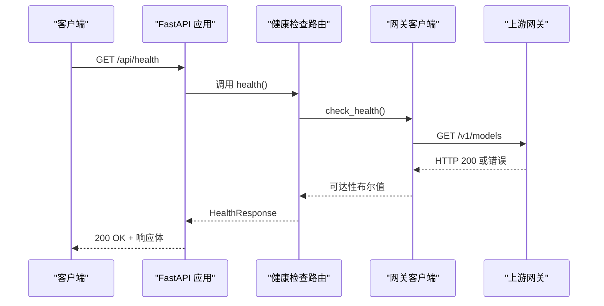
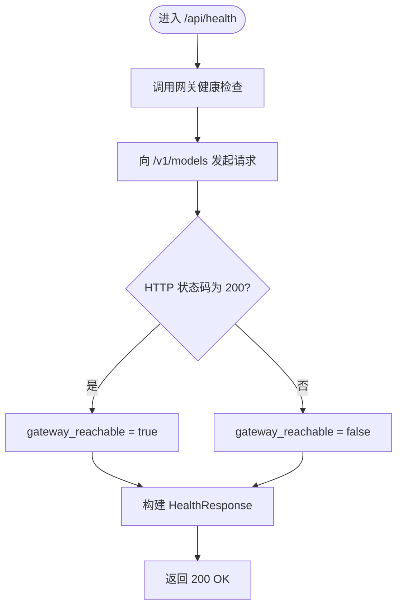
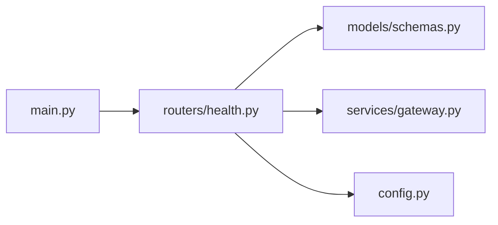

# 健康检查API

<cite>
**本文档引用的文件**
- [apps/chat/api/routers/health.py](file://apps/chat/api/routers/health.py)
- [apps/chat/api/models/schemas.py](file://apps/chat/api/models/schemas.py)
- [apps/chat/api/services/gateway.py](file://apps/chat/api/services/gateway.py)
- [apps/chat/api/config.py](file://apps/chat/api/config.py)
- [apps/chat/api/main.py](file://apps/chat/api/main.py)
- [deployment/standalone/scripts/health-check.sh](file://deployment/standalone/scripts/health-check.sh)
- [config/prometheus/monitor.yaml](file://config/prometheus/monitor.yaml)
- [observability/monitor/service_monitor_vllm.yaml](file://observability/monitor/service_monitor_vllm.yaml)
</cite>

## 目录
1. [简介](#简介)
2. [项目结构](#项目结构)
3. [核心组件](#核心组件)
4. [架构概览](#架构概览)
5. [详细组件分析](#详细组件分析)
6. [依赖关系分析](#依赖关系分析)
7. [性能考虑](#性能考虑)
8. [故障排查指南](#故障排查指南)
9. [结论](#结论)
10. [附录](#附录)

## 简介
本文件为 AIBrix 聊天应用的健康检查 API 提供完整的技术文档。内容涵盖：
- 所有健康检查相关的 HTTP 端点定义（方法、路径、参数、响应格式、状态码）
- 服务状态检查、依赖服务检查、网关可达性检查等能力说明
- 健康检查指标、故障诊断与性能监控建议
- 完整的 curl 示例与集成指南，帮助开发者正确监控系统状态

## 项目结构
AIBrix 聊天应用采用 FastAPI 构建后端，健康检查功能位于聊天应用的 API 层中，通过路由注册到主应用实例上，并依赖网关服务进行外部依赖检查。

**图表来源**
- [apps/chat/api/main.py:63](file://apps/chat/api/main.py#L63)
- [apps/chat/api/routers/health.py:9](file://apps/chat/api/routers/health.py#L9)
- [apps/chat/api/models/schemas.py:228](file://apps/chat/api/models/schemas.py#L228)
- [apps/chat/api/services/gateway.py:31](file://apps/chat/api/services/gateway.py#L31)
- [apps/chat/api/config.py:56](file://apps/chat/api/config.py#L56)

**章节来源**
- [apps/chat/api/main.py:11-71](file://apps/chat/api/main.py#L11-L71)
- [apps/chat/api/routers/health.py:1-19](file://apps/chat/api/routers/health.py#L1-L19)

## 核心组件
- 健康检查路由：提供 /api/health 端点，返回应用状态、版本以及网关可达性
- 数据模型：HealthResponse 定义了健康检查的标准响应结构
- 网关客户端：封装对上游网关的健康检查调用
- 配置管理：提供网关地址、密钥及应用版本等运行时配置

**章节来源**
- [apps/chat/api/routers/health.py:12-19](file://apps/chat/api/routers/health.py#L12-L19)
- [apps/chat/api/models/schemas.py:228-231](file://apps/chat/api/models/schemas.py#L228-L231)
- [apps/chat/api/services/gateway.py:31-41](file://apps/chat/api/services/gateway.py#L31-L41)
- [apps/chat/api/config.py:52](file://apps/chat/api/config.py#L52)

## 架构概览
健康检查流程从 FastAPI 路由触发，调用网关客户端检查上游网关的可用性，最终返回统一的数据模型。

**图表来源**
- [apps/chat/api/routers/health.py:12-19](file://apps/chat/api/routers/health.py#L12-L19)
- [apps/chat/api/services/gateway.py:31-41](file://apps/chat/api/services/gateway.py#L31-L41)

## 详细组件分析

### 健康检查端点定义
- HTTP 方法：GET
- URL 模式：/api/health
- 请求参数：无
- 响应格式：HealthResponse
- 状态码：200 成功；异常情况下由框架抛出相应异常（如认证失败、内部错误）

响应字段说明：
- status：字符串，表示服务整体状态
- version：字符串，应用版本号
- gateway_reachable：布尔值，指示上游网关是否可达

**章节来源**
- [apps/chat/api/routers/health.py:12-19](file://apps/chat/api/routers/health.py#L12-L19)
- [apps/chat/api/models/schemas.py:228-231](file://apps/chat/api/models/schemas.py#L228-L231)

### 健康检查处理逻辑
- 路由层调用网关客户端的健康检查函数
- 网关客户端向上游网关发起 /v1/models 请求，仅根据 HTTP 状态码判断可达性
- 返回 HealthResponse，包含状态、版本与网关可达性

**图表来源**
- [apps/chat/api/routers/health.py:12-19](file://apps/chat/api/routers/health.py#L12-L19)
- [apps/chat/api/services/gateway.py:31-41](file://apps/chat/api/services/gateway.py#L31-L41)

**章节来源**
- [apps/chat/api/routers/health.py:12-19](file://apps/chat/api/routers/health.py#L12-L19)
- [apps/chat/api/services/gateway.py:31-41](file://apps/chat/api/services/gateway.py#L31-L41)

### 数据模型定义
HealthResponse 字段：
- status：字符串类型
- version：字符串类型
- gateway_reachable：布尔类型

该模型用于标准化健康检查响应，便于前端或监控系统解析。

**章节来源**
- [apps/chat/api/models/schemas.py:228-231](file://apps/chat/api/models/schemas.py#L228-L231)

### 网关客户端与配置
- 网关客户端负责构造请求头（含可选的 Authorization），并以短超时时间访问 /v1/models
- 配置模块提供网关地址与密钥的获取方法，并包含应用版本信息

关键行为：
- 使用较短超时时间进行健康检查，避免阻塞主业务
- 支持通过环境变量覆盖默认网关地址与密钥

**章节来源**
- [apps/chat/api/services/gateway.py:23-28](file://apps/chat/api/services/gateway.py#L23-L28)
- [apps/chat/api/services/gateway.py:31-41](file://apps/chat/api/services/gateway.py#L31-L41)
- [apps/chat/api/config.py:56](file://apps/chat/api/config.py#L56)
- [apps/chat/api/config.py:59](file://apps/chat/api/config.py#L59)

### 主应用集成
- 主应用在启动时挂载健康检查路由
- 同时注册其他业务路由，形成统一的 API 平台

**章节来源**
- [apps/chat/api/main.py:63](file://apps/chat/api/main.py#L63)

## 依赖关系分析
健康检查模块的内部依赖关系如下：

**图表来源**
- [apps/chat/api/routers/health.py:5-7](file://apps/chat/api/routers/health.py#L5-L7)
- [apps/chat/api/main.py:63](file://apps/chat/api/main.py#L63)

**章节来源**
- [apps/chat/api/routers/health.py:1-19](file://apps/chat/api/routers/health.py#L1-L19)
- [apps/chat/api/main.py:63](file://apps/chat/api/main.py#L63)

## 性能考虑
- 健康检查使用短超时（约 5 秒）访问上游网关，避免影响主业务吞吐
- 响应体仅包含必要字段，减少网络传输开销
- 建议在生产环境中结合外部健康检查脚本进行多维度探测（见附录）

[本节为通用性能建议，不直接分析具体文件]

## 故障排查指南
常见问题与定位步骤：
- 网关不可达：检查网关地址与密钥配置，确认上游服务正常
- 认证失败：核对 Authorization 头部是否正确设置
- 超时：调整网关客户端超时阈值或优化上游服务性能
- 端口冲突：确认 /api/health 端口未被占用

辅助工具：
- 部署脚本中的健康检查脚本可用于批量探测多个服务组件的状态

**章节来源**
- [apps/chat/api/services/gateway.py:31-41](file://apps/chat/api/services/gateway.py#L31-L41)
- [deployment/standalone/scripts/health-check.sh:95-156](file://deployment/standalone/scripts/health-check.sh#L95-L156)

## 结论
AIBrix 聊天应用的健康检查 API 设计简洁、职责明确：通过单一端点快速反映服务与依赖的健康状况。配合外部脚本与监控配置，可实现自动化运维与告警联动。

[本节为总结性内容，不直接分析具体文件]

## 附录

### API 规范与示例
- 端点：GET /api/health
- 请求：无
- 响应：HealthResponse
- 示例 curl：
  - 基本调用：curl -sS http://localhost:80/api/health
  - 输出解析：status、version、gateway_reachable

**章节来源**
- [apps/chat/api/routers/health.py:12-19](file://apps/chat/api/routers/health.py#L12-L19)

### 监控与集成
- Prometheus 监控配置：可通过 ServiceMonitor 将指标暴露给 Prometheus 抓取
- vLLM 指标监控：提供独立的 ServiceMonitor 配置示例

**章节来源**
- [config/prometheus/monitor.yaml:12-14](file://config/prometheus/monitor.yaml#L12-L14)
- [observability/monitor/service_monitor_vllm.yaml:9-12](file://observability/monitor/service_monitor_vllm.yaml#L9-L12)

### 外部健康检查脚本
- 功能：探测 Redis、Envoy、Metadata Service、vLLM、HTTP Proxy 等服务
- 选项：支持 JSON 输出与持续监控模式
- 使用场景：容器化部署下的健康巡检与自动化运维

**章节来源**
- [deployment/standalone/scripts/health-check.sh:5-67](file://deployment/standalone/scripts/health-check.sh#L5-L67)
- [deployment/standalone/scripts/health-check.sh:95-156](file://deployment/standalone/scripts/health-check.sh#L95-L156)