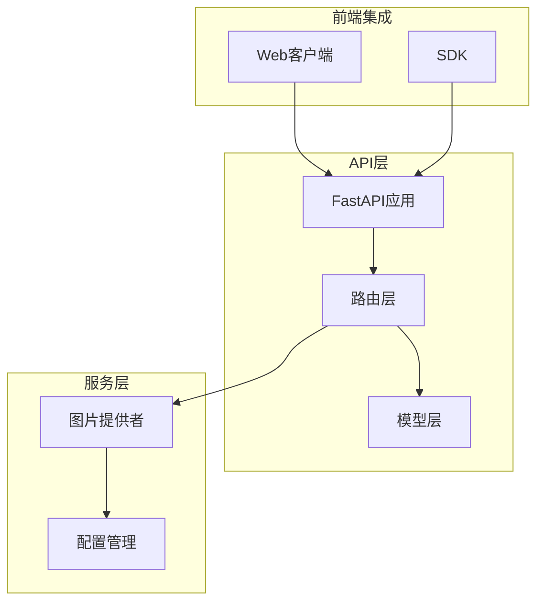
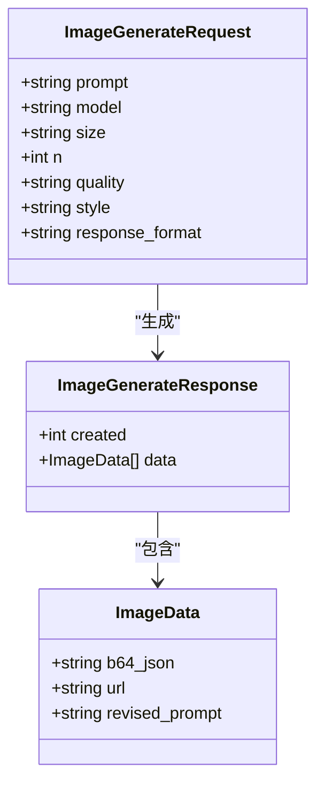
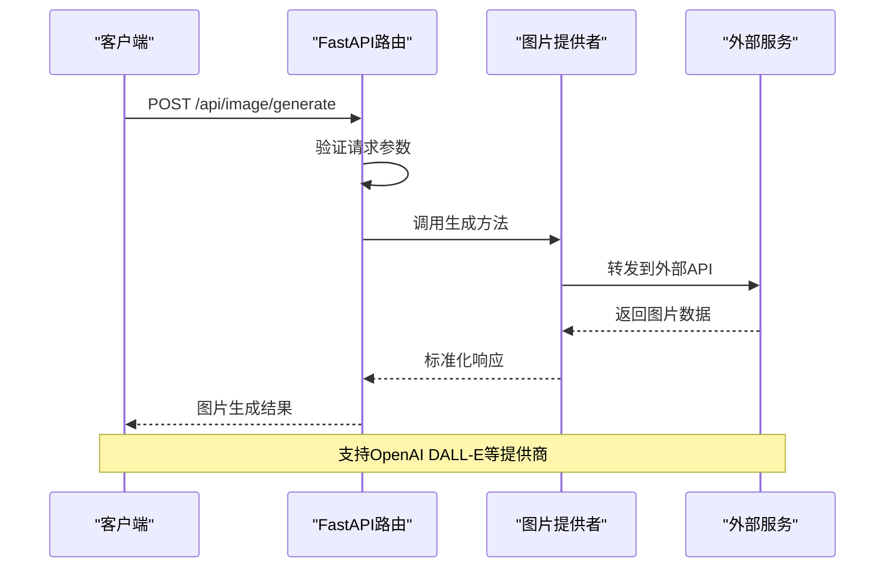
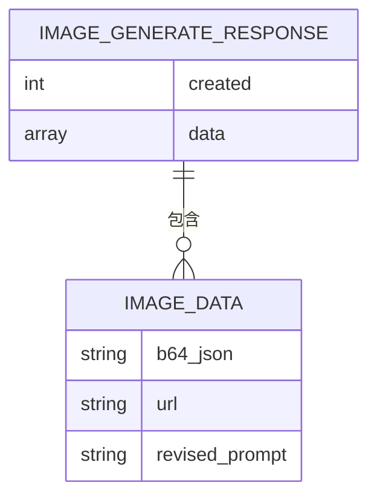
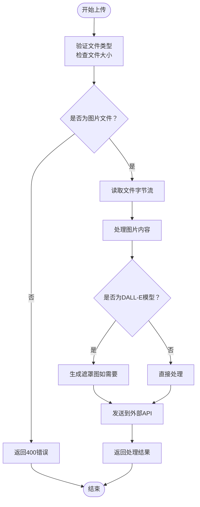
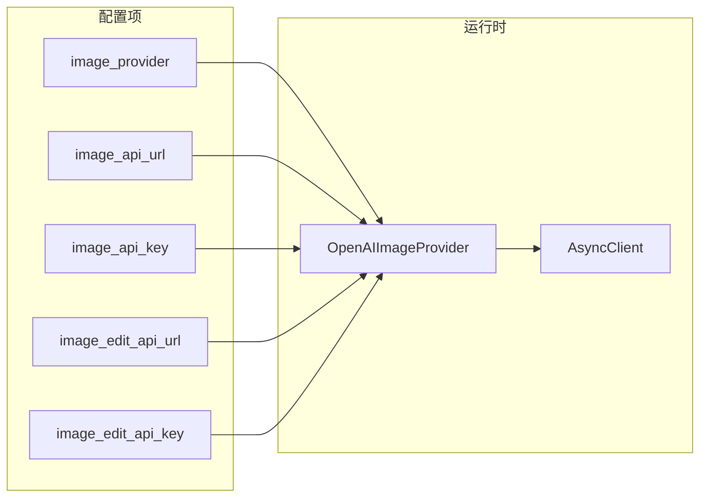
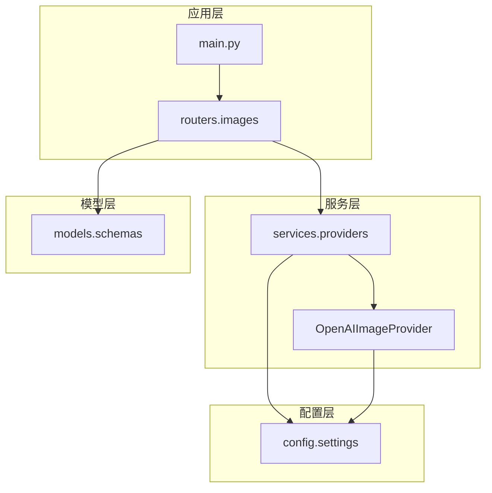

# 图片生成API

<cite>
**本文档引用的文件**
- [images.py](file://apps/chat/api/routers/images.py)
- [schemas.py](file://apps/chat/api/models/schemas.py)
- [openai.py](file://apps/chat/api/services/providers/openai.py)
- [config.py](file://apps/chat/api/config.py)
- [main.py](file://apps/chat/api/main.py)
- [client.ts](file://apps/chat/web/src/api/client.ts)
</cite>

## 目录
1. [简介](#简介)
2. [项目结构](#项目结构)
3. [核心组件](#核心组件)
4. [架构概览](#架构概览)
5. [详细组件分析](#详细组件分析)
6. [依赖关系分析](#依赖关系分析)
7. [性能考虑](#性能考虑)
8. [故障排除指南](#故障排除指南)
9. [结论](#结论)

## 简介

AIBrix聊天应用提供了完整的图片生成和编辑API，支持多种图片生成服务提供商。该API基于FastAPI构建，采用BFF（Backend-for-Frontend）架构模式，为前端应用提供统一的图片处理接口。

主要功能包括：
- 文本到图片生成（DALL-E兼容）
- 图片编辑和修改
- 多种图片提供商集成
- 文件上传和格式验证
- 质量控制和响应格式管理

## 项目结构

AIBrix图片API位于聊天应用的API模块中，采用分层架构设计：

**图表来源**
- [main.py:37-50](file://apps/chat/api/main.py#L37-L50)
- [images.py:16](file://apps/chat/api/routers/images.py#L16)

**章节来源**
- [main.py:1-87](file://apps/chat/api/main.py#L1-L87)
- [images.py:1-72](file://apps/chat/api/routers/images.py#L1-L72)

## 核心组件

### 主要端点

系统提供两个核心图片处理端点：

1. **POST /api/image/generate** - 文本到图片生成
2. **POST /api/image/edit** - 图片编辑和修改

### 数据模型

API使用标准化的数据模型进行请求和响应处理：

**图表来源**
- [schemas.py:102-121](file://apps/chat/api/models/schemas.py#L102-L121)

**章节来源**
- [schemas.py:102-121](file://apps/chat/api/models/schemas.py#L102-L121)

## 架构概览

AIBrix图片API采用多层架构设计，实现了松耦合的服务集成：

**图表来源**
- [images.py:19-42](file://apps/chat/api/routers/images.py#L19-L42)
- [openai.py:193-218](file://apps/chat/api/services/providers/openai.py#L193-L218)

## 详细组件分析

### 图片生成端点

#### 端点定义
- **方法**: POST
- **路径**: `/api/image/generate`
- **响应模型**: `ImageGenerateResponse`

#### 请求参数

| 参数名 | 类型 | 必需 | 默认值 | 描述 |
|--------|------|------|--------|------|
| prompt | string | 是 | - | 图片描述文本，最大长度4000字符 |
| model | string | 否 | settings.image_model或"dall-e-3" | 图片生成模型名称 |
| size | string | 否 | "1024x1024" | 输出图片尺寸，格式如"1024x1024" |
| n | integer | 否 | 1 | 生成图片数量，范围1-4 |
| quality | string | 否 | null | 图片质量选项 |
| style | string | 否 | null | 图片风格选项 |
| response_format | string | 否 | null | 响应格式（url或b64_json） |

#### 响应格式

**图表来源**
- [schemas.py:118-121](file://apps/chat/api/models/schemas.py#L118-L121)

#### 错误处理
- **HTTP 502**: 外部服务调用失败
- **HTTP 422**: 请求参数验证失败
- **HTTP 500**: 内部服务器错误

**章节来源**
- [images.py:19-42](file://apps/chat/api/routers/images.py#L19-L42)
- [schemas.py:102-121](file://apps/chat/api/models/schemas.py#L102-L121)

### 图片编辑端点

#### 端点定义
- **方法**: POST
- **路径**: `/api/image/edit`
- **响应模型**: `ImageGenerateResponse`

#### 请求参数

| 参数名 | 类型 | 必需 | 默认值 | 描述 |
|--------|------|------|--------|------|
| image | file | 是 | - | 要编辑的图片文件 |
| prompt | string | 是 | - | 编辑指令描述 |
| model | string | 否 | settings.image_edit_model或"dall-e-2" | 编辑模型名称 |
| size | string | 否 | "1024x1024" | 输出图片尺寸 |
| n | integer | 否 | 1 | 生成图片数量 |

#### 文件上传处理

**图表来源**
- [images.py:45-71](file://apps/chat/api/routers/images.py#L45-L71)
- [openai.py:220-291](file://apps/chat/api/services/providers/openai.py#L220-L291)

#### 图片格式转换

系统自动处理不同图片格式的转换：

| 模型类型 | 输入格式 | 输出格式 | 特殊处理 |
|----------|----------|----------|----------|
| DALL-E 2 | 任意 | PNG | 自动添加透明遮罩 |
| 其他模型 | 任意 | 原始格式 | 直接处理 |

**章节来源**
- [images.py:45-71](file://apps/chat/api/routers/images.py#L45-L71)
- [openai.py:220-291](file://apps/chat/api/services/providers/openai.py#L220-L291)

### 图片提供者集成

#### OpenAI DALL-E集成

系统默认集成OpenAI DALL-E服务，支持以下API端点：

- **生成**: `POST /v1/images/generations`
- **编辑**: `POST /v1/images/edits`

#### 配置管理

**图表来源**
- [config.py:4-94](file://apps/chat/api/config.py#L4-L94)
- [openai.py:157-191](file://apps/chat/api/services/providers/openai.py#L157-L191)

**章节来源**
- [config.py:4-94](file://apps/chat/api/config.py#L4-L94)
- [openai.py:157-191](file://apps/chat/api/services/providers/openai.py#L157-L191)

## 依赖关系分析

### 组件依赖图

**图表来源**
- [main.py:11-18](file://apps/chat/api/main.py#L11-L18)
- [images.py:10-12](file://apps/chat/api/routers/images.py#L10-L12)
- [openai.py:157-170](file://apps/chat/api/services/providers/openai.py#L157-L170)

### 外部依赖

系统依赖以下外部组件：

- **httpx**: 异步HTTP客户端库
- **PIL (Pillow)**: 图片处理库
- **FastAPI**: Web框架
- **Pydantic**: 数据验证和序列化

**章节来源**
- [openai.py:10-23](file://apps/chat/api/services/providers/openai.py#L10-L23)
- [main.py:6-12](file://apps/chat/api/main.py#L6-L12)

## 性能考虑

### 连接池管理

系统使用连接池优化HTTP请求性能：

- **最大连接数**: 100
- **保活连接**: 20
- **超时设置**: 
  - 连接: 10秒
  - 读取: 120秒
  - 写入: 10秒
  - 连接池: 5秒

### 缓存策略

- **提供者单例**: 使用全局缓存避免重复初始化
- **连接复用**: 长连接减少握手开销
- **事件钩子**: 记录请求和响应日志

### 并发处理

- **异步I/O**: 支持高并发请求
- **流式响应**: 大文件传输优化
- **资源清理**: 自动关闭连接和释放资源

## 故障排除指南

### 常见错误及解决方案

| 错误类型 | HTTP状态码 | 可能原因 | 解决方案 |
|----------|------------|----------|----------|
| 认证错误 | 401 | API密钥无效 | 检查环境变量配置 |
| 参数错误 | 400 | 请求参数不合法 | 验证参数格式和范围 |
| 速率限制 | 429 | 超过API配额 | 实现重试逻辑和退避算法 |
| 服务不可用 | 503 | 外部服务故障 | 检查服务状态和网络连接 |
| 内部错误 | 500 | 服务器内部异常 | 查看日志文件和堆栈跟踪 |

### 调试建议

1. **启用详细日志**: 检查请求和响应详情
2. **验证配置**: 确认所有必需的环境变量已设置
3. **测试连接**: 验证与外部服务的连通性
4. **监控指标**: 关注API性能和错误率

**章节来源**
- [openai.py:29-45](file://apps/chat/api/services/providers/openai.py#L29-L45)

## 结论

AIBrix图片生成API提供了完整、灵活且高性能的图片处理解决方案。通过模块化的架构设计和标准化的数据模型，系统能够轻松集成多种图片生成服务提供商，同时为前端应用提供了简洁易用的API接口。

关键优势包括：
- **多提供商支持**: 易于切换和扩展不同的图片生成服务
- **类型安全**: 完整的请求和响应数据验证
- **性能优化**: 连接池管理和异步处理
- **错误处理**: 完善的错误分类和恢复机制
- **开发友好**: 清晰的API文档和示例代码

该API为构建现代化的AI驱动应用奠定了坚实的基础，支持从简单的图片生成到复杂的图片编辑场景。