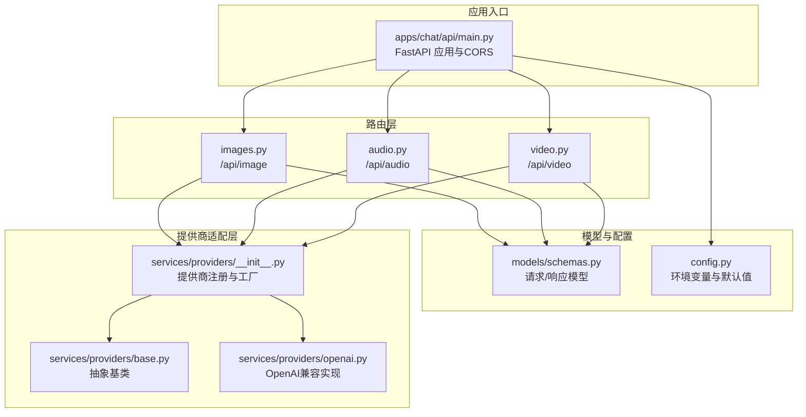
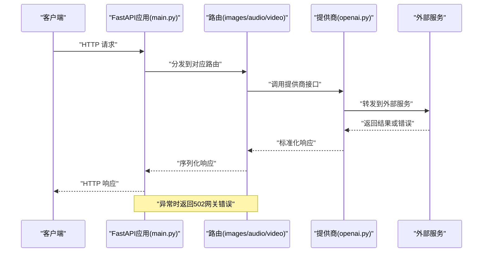
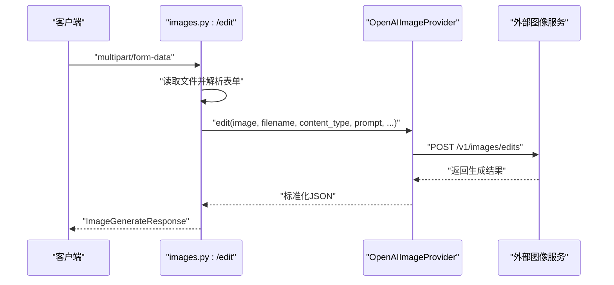
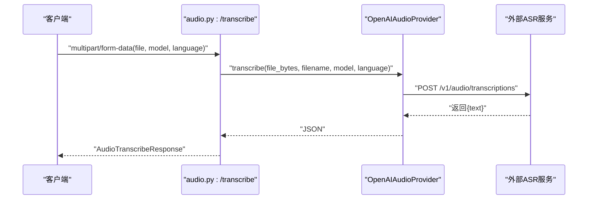
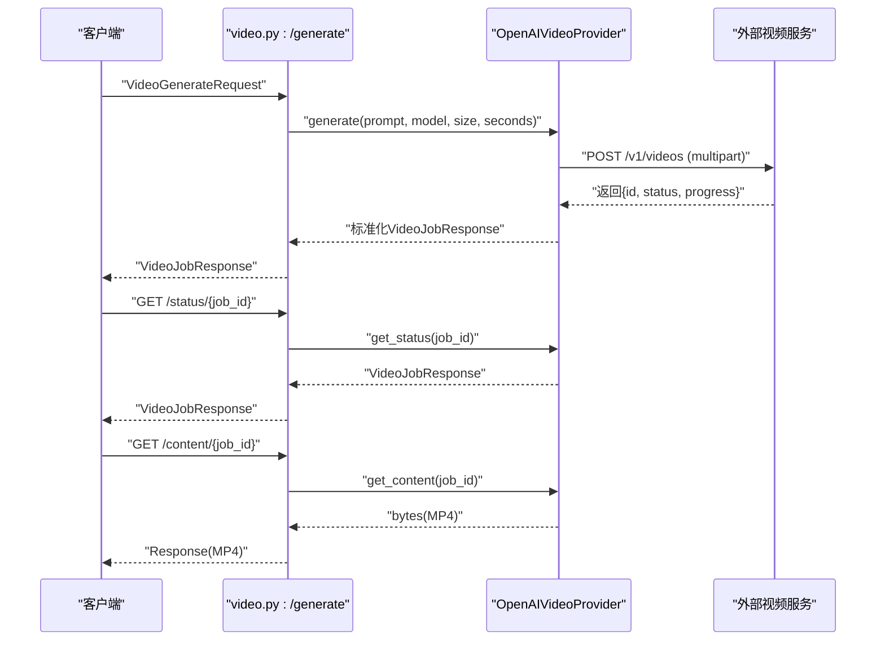
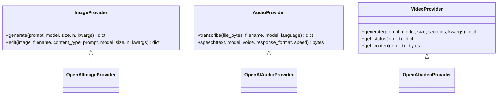

# 多媒体内容API

<cite>
**本文档引用的文件**
- [apps/chat/api/main.py](file://apps/chat/api/main.py)
- [apps/chat/api/routers/images.py](file://apps/chat/api/routers/images.py)
- [apps/chat/api/routers/audio.py](file://apps/chat/api/routers/audio.py)
- [apps/chat/api/routers/video.py](file://apps/chat/api/routers/video.py)
- [apps/chat/api/models/schemas.py](file://apps/chat/api/models/schemas.py)
- [apps/chat/api/config.py](file://apps/chat/api/config.py)
- [apps/chat/api/services/providers/base.py](file://apps/chat/api/services/providers/base.py)
- [apps/chat/api/services/providers/openai.py](file://apps/chat/api/services/providers/openai.py)
- [apps/chat/api/services/providers/__init__.py](file://apps/chat/api/services/providers/__init__.py)
</cite>

## 目录
1. [简介](#简介)
2. [项目结构](#项目结构)
3. [核心组件](#核心组件)
4. [架构总览](#架构总览)
5. [详细组件分析](#详细组件分析)
6. [依赖关系分析](#依赖关系分析)
7. [性能考虑](#性能考虑)
8. [故障排除指南](#故障排除指南)
9. [结论](#结论)
10. [附录](#附录)

## 简介
本文件面向AIBrix聊天应用的多媒体内容API，系统性梳理图片、音频（语音转写与文本转语音）、视频生成的HTTP端点设计与实现，覆盖上传、生成、状态轮询、内容下载等完整流程。文档同时说明数据模型、错误处理、状态码、安全与鉴权机制，并提供curl示例与SDK调用指引，帮助开发者正确集成与扩展。

## 项目结构
AIBrix聊天应用采用FastAPI作为后端入口，通过“后端对前端”（BFF）模式聚合多模态能力。多媒体API位于聊天应用的API子模块中，按功能划分为图像、音频、视频三个路由模块，并通过统一配置中心管理各模态的提供商与默认参数。

**图表来源**
- [apps/chat/api/main.py:1-87](file://apps/chat/api/main.py#L1-L87)
- [apps/chat/api/routers/images.py:1-72](file://apps/chat/api/routers/images.py#L1-L72)
- [apps/chat/api/routers/audio.py:1-66](file://apps/chat/api/routers/audio.py#L1-L66)
- [apps/chat/api/routers/video.py:1-66](file://apps/chat/api/routers/video.py#L1-L66)
- [apps/chat/api/models/schemas.py:1-245](file://apps/chat/api/models/schemas.py#L1-L245)
- [apps/chat/api/config.py:1-94](file://apps/chat/api/config.py#L1-L94)
- [apps/chat/api/services/providers/__init__.py:1-102](file://apps/chat/api/services/providers/__init__.py#L1-L102)
- [apps/chat/api/services/providers/base.py:1-138](file://apps/chat/api/services/providers/base.py#L1-L138)
- [apps/chat/api/services/providers/openai.py:1-496](file://apps/chat/api/services/providers/openai.py#L1-L496)

**章节来源**
- [apps/chat/api/main.py:1-87](file://apps/chat/api/main.py#L1-L87)
- [apps/chat/api/routers/images.py:1-72](file://apps/chat/api/routers/images.py#L1-L72)
- [apps/chat/api/routers/audio.py:1-66](file://apps/chat/api/routers/audio.py#L1-L66)
- [apps/chat/api/routers/video.py:1-66](file://apps/chat/api/routers/video.py#L1-L66)
- [apps/chat/api/models/schemas.py:1-245](file://apps/chat/api/models/schemas.py#L1-L245)
- [apps/chat/api/config.py:1-94](file://apps/chat/api/config.py#L1-L94)
- [apps/chat/api/services/providers/__init__.py:1-102](file://apps/chat/api/services/providers/__init__.py#L1-L102)
- [apps/chat/api/services/providers/base.py:1-138](file://apps/chat/api/services/providers/base.py#L1-L138)
- [apps/chat/api/services/providers/openai.py:1-496](file://apps/chat/api/services/providers/openai.py#L1-L496)

## 核心组件
- FastAPI应用与CORS：在应用生命周期内初始化各提供商连接池，挂载所有路由模块，并启用跨域支持。
- 路由模块：分别提供图像生成/编辑、音频转写/语音合成、视频生成/状态查询/内容下载的HTTP接口。
- 数据模型：基于Pydantic定义请求与响应结构，确保输入校验与输出一致性。
- 提供商适配：通过抽象基类定义统一接口，具体实现（如OpenAI兼容）负责对接外部服务。

**章节来源**
- [apps/chat/api/main.py:21-50](file://apps/chat/api/main.py#L21-L50)
- [apps/chat/api/routers/images.py:16-72](file://apps/chat/api/routers/images.py#L16-L72)
- [apps/chat/api/routers/audio.py:17-66](file://apps/chat/api/routers/audio.py#L17-L66)
- [apps/chat/api/routers/video.py:16-66](file://apps/chat/api/routers/video.py#L16-L66)
- [apps/chat/api/models/schemas.py:102-156](file://apps/chat/api/models/schemas.py#L102-L156)
- [apps/chat/api/services/providers/base.py:44-138](file://apps/chat/api/services/providers/base.py#L44-L138)

## 架构总览
下图展示从客户端到提供商的调用链路与错误处理策略：

**图表来源**
- [apps/chat/api/main.py:11-71](file://apps/chat/api/main.py#L11-L71)
- [apps/chat/api/routers/images.py:30-42](file://apps/chat/api/routers/images.py#L30-L42)
- [apps/chat/api/routers/audio.py:27-39](file://apps/chat/api/routers/audio.py#L27-L39)
- [apps/chat/api/routers/video.py:22-33](file://apps/chat/api/routers/video.py#L22-L33)
- [apps/chat/api/services/providers/openai.py:200-218](file://apps/chat/api/services/providers/openai.py#L200-L218)
- [apps/chat/api/services/providers/openai.py:337-360](file://apps/chat/api/services/providers/openai.py#L337-L360)
- [apps/chat/api/services/providers/openai.py:429-470](file://apps/chat/api/services/providers/openai.py#L429-L470)

## 详细组件分析

### 图像API
- 图像生成
  - 方法与路径：POST /api/image/generate
  - 请求体：ImageGenerateRequest（字段见下方“数据模型”）
  - 响应：ImageGenerateResponse（包含时间戳与图片数据数组）
  - 错误：网络异常映射为502
  - 关键实现：路由调用提供商生成接口，透传质量、风格、响应格式等参数
- 图像编辑
  - 方法与路径：POST /api/image/edit
  - 请求体：multipart/form-data（image文件、prompt、可选model/size/n）
  - 响应：ImageGenerateResponse
  - 特殊处理：针对DALL·E-2自动进行透明度掩码处理与格式转换
  - 错误：网络异常映射为502

**图表来源**
- [apps/chat/api/routers/images.py:45-72](file://apps/chat/api/routers/images.py#L45-L72)
- [apps/chat/api/services/providers/openai.py:220-291](file://apps/chat/api/services/providers/openai.py#L220-L291)

**章节来源**
- [apps/chat/api/routers/images.py:19-43](file://apps/chat/api/routers/images.py#L19-L43)
- [apps/chat/api/routers/images.py:45-72](file://apps/chat/api/routers/images.py#L45-L72)
- [apps/chat/api/services/providers/openai.py:220-291](file://apps/chat/api/services/providers/openai.py#L220-L291)

### 音频API
- 语音转写（ASR）
  - 方法与路径：POST /api/audio/transcribe
  - 请求体：multipart/form-data（file音频文件、可选model/language）
  - 响应：AudioTranscribeResponse（文本）
  - 错误：网络异常映射为502
- 文本转语音（TTS）
  - 方法与路径：POST /api/audio/speech
  - 请求体：AudioSpeechRequest（文本、模型、声音、格式、速度）
  - 响应：二进制音频流（根据格式设置Content-Type）
  - 错误：网络异常映射为502

**图表来源**
- [apps/chat/api/routers/audio.py:20-39](file://apps/chat/api/routers/audio.py#L20-L39)
- [apps/chat/api/services/providers/openai.py:337-360](file://apps/chat/api/services/providers/openai.py#L337-L360)

**章节来源**
- [apps/chat/api/routers/audio.py:20-39](file://apps/chat/api/routers/audio.py#L20-L39)
- [apps/chat/api/routers/audio.py:42-65](file://apps/chat/api/routers/audio.py#L42-L65)
- [apps/chat/api/services/providers/openai.py:337-383](file://apps/chat/api/services/providers/openai.py#L337-L383)

### 视频API
- 视频生成
  - 方法与路径：POST /api/video/generate
  - 请求体：VideoGenerateRequest（提示词、模型、尺寸、时长）
  - 响应：VideoJobResponse（任务ID、状态、进度等）
  - 错误：网络异常映射为502
- 任务状态查询
  - 方法与路径：GET /api/video/status/{job_id}
  - 响应：VideoJobResponse
  - 错误：网络异常映射为502；未找到任务映射为404
- 内容下载
  - 方法与路径：GET /api/video/content/{job_id}
  - 响应：二进制MP4流（带附件下载头）
  - 错误：未找到任务映射为404；网络异常映射为502

**图表来源**
- [apps/chat/api/routers/video.py:19-65](file://apps/chat/api/routers/video.py#L19-L65)
- [apps/chat/api/services/providers/openai.py:429-495](file://apps/chat/api/services/providers/openai.py#L429-L495)

**章节来源**
- [apps/chat/api/routers/video.py:19-65](file://apps/chat/api/routers/video.py#L19-L65)
- [apps/chat/api/services/providers/openai.py:429-495](file://apps/chat/api/services/providers/openai.py#L429-L495)

### 数据模型与请求参数
- 图像生成请求：prompt、model、size、n、quality、style、response_format
- 图像生成响应：created时间戳、data数组（包含url或b64_json）
- 语音转写响应：text文本
- 文本转语音请求：input、model、voice、response_format、speed
- 视频生成请求：prompt、model、size、seconds
- 视频作业响应：id、status、prompt、model、progress、error、generations

**章节来源**
- [apps/chat/api/models/schemas.py:102-156](file://apps/chat/api/models/schemas.py#L102-L156)

### 安全与鉴权机制
- 授权头：所有提供商实现均在请求头添加Authorization: Bearer {api_key}（若配置了密钥）
- CORS：允许GET/POST/PATCH/DELETE方法与Authorization、Content-Type头部
- 网络超时与连接池：提供商内部使用httpx异步客户端，具备连接池与超时配置

**章节来源**
- [apps/chat/api/services/providers/openai.py:48-52](file://apps/chat/api/services/providers/openai.py#L48-L52)
- [apps/chat/api/main.py:52-60](file://apps/chat/api/main.py#L52-L60)

## 依赖关系分析
- 路由依赖：各路由模块依赖对应的请求/响应模型与提供商工厂函数
- 提供商注册：通过注册表选择具体实现（当前默认OpenAI兼容），支持缓存复用与连接池
- 抽象接口：统一的Provider基类确保不同实现的一致行为

**图表来源**
- [apps/chat/api/services/providers/base.py:44-138](file://apps/chat/api/services/providers/base.py#L44-L138)
- [apps/chat/api/services/providers/openai.py:157-291](file://apps/chat/api/services/providers/openai.py#L157-L291)
- [apps/chat/api/services/providers/openai.py:297-383](file://apps/chat/api/services/providers/openai.py#L297-L383)
- [apps/chat/api/services/providers/openai.py:389-495](file://apps/chat/api/services/providers/openai.py#L389-L495)

**章节来源**
- [apps/chat/api/services/providers/__init__.py:27-44](file://apps/chat/api/services/providers/__init__.py#L27-L44)
- [apps/chat/api/services/providers/base.py:44-138](file://apps/chat/api/services/providers/base.py#L44-L138)

## 性能考虑
- 连接池与超时：提供商内部使用httpx异步客户端，配置连接上限与超时，减少握手开销
- 缓存复用：提供商工厂函数维护单例缓存，避免重复创建连接
- 流式传输：音频转写与文本转语音返回原始字节流，便于直接传输
- 异步I/O：FastAPI与httpx异步特性提升并发吞吐

**章节来源**
- [apps/chat/api/services/providers/openai.py:67-72](file://apps/chat/api/services/providers/openai.py#L67-L72)
- [apps/chat/api/services/providers/openai.py:316-321](file://apps/chat/api/services/providers/openai.py#L316-L321)
- [apps/chat/api/services/providers/openai.py:402-407](file://apps/chat/api/services/providers/openai.py#L402-L407)
- [apps/chat/api/services/providers/__init__.py:46-47](file://apps/chat/api/services/providers/__init__.py#L46-L47)

## 故障排除指南
- 502 网关错误：通常由提供商调用外部服务失败导致，检查网关URL与API密钥配置
- 404 未找到：视频内容下载阶段，任务不存在或已完成但资源已清理
- CORS问题：确认前端Origin是否在允许列表中
- 文件格式与掩码：图像编辑对DALL·E-2有透明度掩码要求，需确保输入图像模式兼容

**章节来源**
- [apps/chat/api/routers/images.py:40-42](file://apps/chat/api/routers/images.py#L40-L42)
- [apps/chat/api/routers/audio.py:37-39](file://apps/chat/api/routers/audio.py#L37-L39)
- [apps/chat/api/routers/video.py:31-33](file://apps/chat/api/routers/video.py#L31-L33)
- [apps/chat/api/routers/video.py:61-65](file://apps/chat/api/routers/video.py#L61-L65)
- [apps/chat/api/main.py:52-60](file://apps/chat/api/main.py#L52-L60)

## 结论
本API通过清晰的路由划分与抽象的提供商适配，实现了图像、音频、视频的统一接入。开发者可通过配置中心灵活切换提供商与模型，借助统一的数据模型与错误处理策略快速集成。建议在生产环境中结合监控与日志，持续优化超时与重试策略。

## 附录

### HTTP端点一览与规范
- 图像
  - POST /api/image/generate
    - 请求体：ImageGenerateRequest
    - 响应：ImageGenerateResponse
    - 错误：502
- 图像编辑
  - POST /api/image/edit
    - 请求体：multipart/form-data（image、prompt、可选model/size/n）
    - 响应：ImageGenerateResponse
    - 错误：502
- 语音转写
  - POST /api/audio/transcribe
    - 请求体：multipart/form-data（file、可选model/language）
    - 响应：AudioTranscribeResponse
    - 错误：502
- 文本转语音
  - POST /api/audio/speech
    - 请求体：AudioSpeechRequest
    - 响应：二进制音频流（Content-Type依据格式）
    - 错误：502
- 视频生成
  - POST /api/video/generate
    - 请求体：VideoGenerateRequest
    - 响应：VideoJobResponse
    - 错误：502
- 任务状态
  - GET /api/video/status/{job_id}
    - 响应：VideoJobResponse
    - 错误：502；未找到映射为404
- 内容下载
  - GET /api/video/content/{job_id}
    - 响应：二进制MP4（带附件下载头）
    - 错误：404；502

**章节来源**
- [apps/chat/api/routers/images.py:19-72](file://apps/chat/api/routers/images.py#L19-L72)
- [apps/chat/api/routers/audio.py:20-65](file://apps/chat/api/routers/audio.py#L20-L65)
- [apps/chat/api/routers/video.py:19-65](file://apps/chat/api/routers/video.py#L19-L65)

### curl 示例
- 图像生成
  - curl -X POST "$BASE_URL/api/image/generate" -H "Content-Type: application/json" -d '{...}'
- 图像编辑
  - curl -X POST "$BASE_URL/api/image/edit" -F "image=@/path/to/file" -F "prompt=..."
- 语音转写
  - curl -X POST "$BASE_URL/api/audio/transcribe" -F "file=@/path/to/audio" -F "model=..."
- 文本转语音
  - curl -X POST "$BASE_URL/api/audio/speech" -H "Content-Type: application/json" -d '{...}' -o out.mp3
- 视频生成
  - curl -X POST "$BASE_URL/api/video/generate" -H "Content-Type: application/json" -d '{...}'
- 查询状态
  - curl "$BASE_URL/api/video/status/{job_id}"
- 下载内容
  - curl "$BASE_URL/api/video/content/{job_id}" -o video.mp4

说明：请将$BASE_URL替换为实际部署地址，并根据数据模型填充请求体字段。

### SDK使用指南（Python）
- 使用httpx发送请求，遵循上述端点与数据模型
- 对于multipart请求（图像编辑、语音转写），使用files/data参数构造
- 对于二进制响应（TTS、视频内容），直接读取响应内容并保存为文件
- 在请求头中添加Authorization: Bearer {api_key}（若配置）

**章节来源**
- [apps/chat/api/services/providers/openai.py:265-282](file://apps/chat/api/services/providers/openai.py#L265-L282)
- [apps/chat/api/services/providers/openai.py:348-358](file://apps/chat/api/services/providers/openai.py#L348-L358)
- [apps/chat/api/services/providers/openai.py:448-452](file://apps/chat/api/services/providers/openai.py#L448-L452)