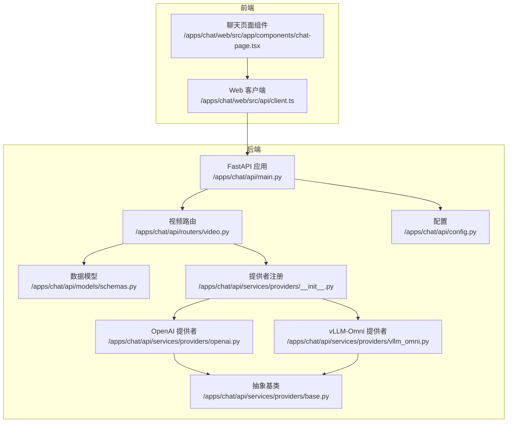
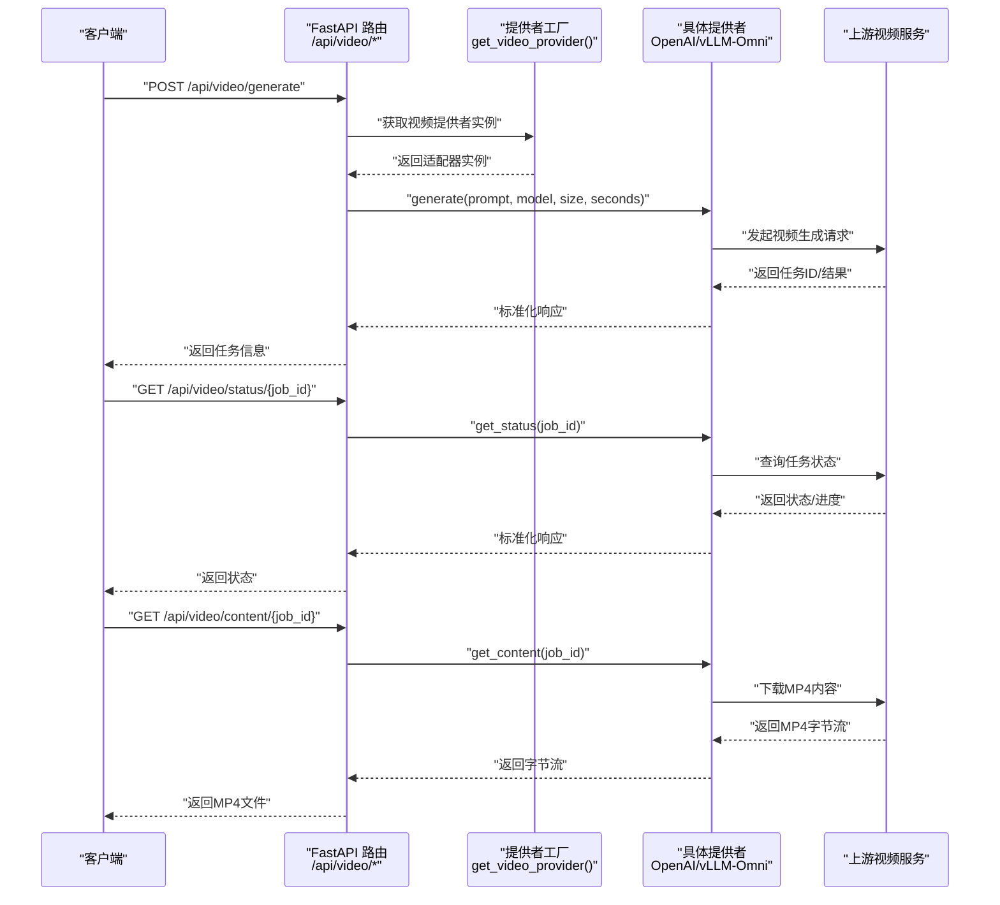
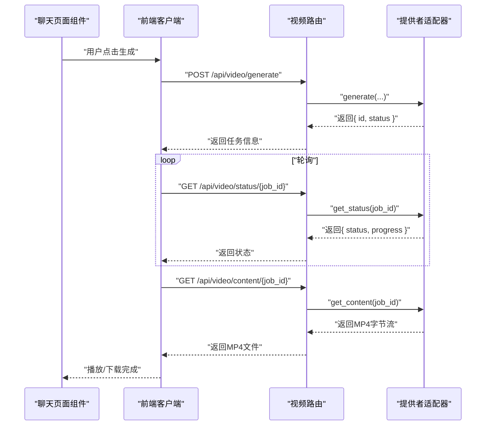
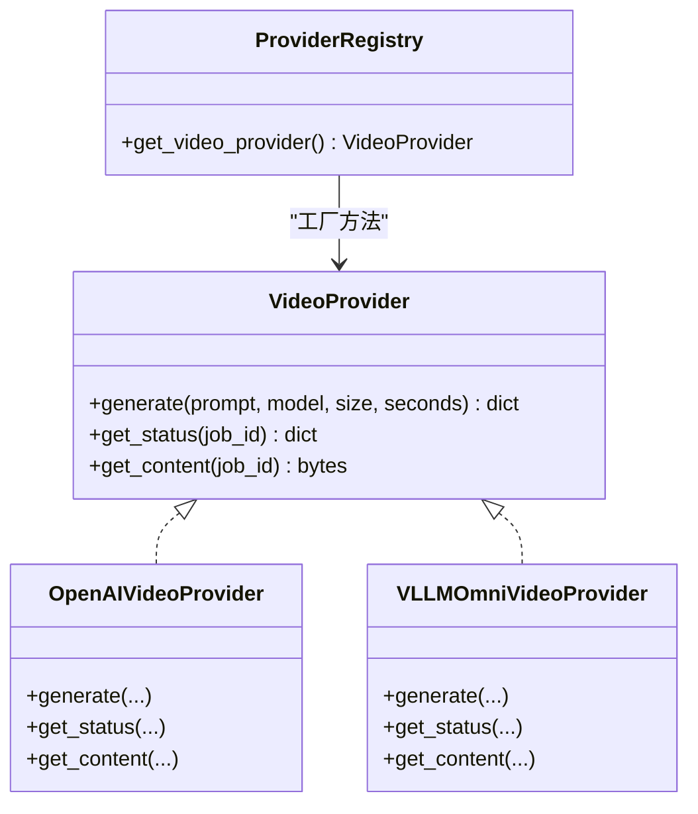

# 视频处理API

<cite>
**本文引用的文件**
- [apps/chat/api/main.py](file://apps/chat/api/main.py)
- [apps/chat/api/routers/video.py](file://apps/chat/api/routers/video.py)
- [apps/chat/api/models/schemas.py](file://apps/chat/api/models/schemas.py)
- [apps/chat/api/services/providers/__init__.py](file://apps/chat/api/services/providers/__init__.py)
- [apps/chat/api/services/providers/base.py](file://apps/chat/api/services/providers/base.py)
- [apps/chat/api/services/providers/openai.py](file://apps/chat/api/services/providers/openai.py)
- [apps/chat/api/services/providers/vllm_omni.py](file://apps/chat/api/services/providers/vllm_omni.py)
- [apps/chat/api/config.py](file://apps/chat/api/config.py)
- [apps/chat/web/src/api/client.ts](file://apps/chat/web/src/api/client.ts)
- [apps/chat/web/src/app/components/chat-page.tsx](file://apps/chat/web/src/app/components/chat-page.tsx)
</cite>

## 目录
1. [简介](#简介)
2. [项目结构](#项目结构)
3. [核心组件](#核心组件)
4. [架构总览](#架构总览)
5. [详细组件分析](#详细组件分析)
6. [依赖关系分析](#依赖关系分析)
7. [性能考量](#性能考量)
8. [故障排查指南](#故障排查指南)
9. [结论](#结论)
10. [附录](#附录)

## 简介
本文件面向AIBrix聊天应用中的视频处理能力，系统性梳理“视频生成”相关HTTP端点与工作流，覆盖以下关键能力：
- 视频生成任务提交与轮询
- 视频内容下载（MP4）
- 转码与预览：当前仓库未实现独立的“视频转码/预览”端点；视频生成完成后可直接下载MP4
- 批量视频处理：通过并发调用生成接口实现
- 进度跟踪：OpenAI兼容提供者返回进度字段；vLLM-Omni提供同步直返能力

本说明严格基于仓库现有实现，不包含未在代码中出现的功能。

## 项目结构
视频处理API位于聊天应用后端（FastAPI），通过路由层暴露HTTP端点，并由“提供者适配器”对接上游视频服务（如OpenAI兼容服务或vLLM-Omni）。

图表来源
- [apps/chat/api/main.py:37-87](file://apps/chat/api/main.py#L37-L87)
- [apps/chat/api/routers/video.py:16-66](file://apps/chat/api/routers/video.py#L16-L66)
- [apps/chat/api/services/providers/__init__.py:92-101](file://apps/chat/api/services/providers/__init__.py#L92-L101)
- [apps/chat/api/services/providers/base.py:111-138](file://apps/chat/api/services/providers/base.py#L111-L138)
- [apps/chat/api/services/providers/openai.py:429-496](file://apps/chat/api/services/providers/openai.py#L429-L496)
- [apps/chat/api/services/providers/vllm_omni.py:473-602](file://apps/chat/api/services/providers/vllm_omni.py#L473-L602)
- [apps/chat/api/models/schemas.py:141-156](file://apps/chat/api/models/schemas.py#L141-L156)
- [apps/chat/api/config.py:86-90](file://apps/chat/api/config.py#L86-L90)

章节来源
- [apps/chat/api/main.py:37-87](file://apps/chat/api/main.py#L37-L87)
- [apps/chat/api/routers/video.py:16-66](file://apps/chat/api/routers/video.py#L16-L66)
- [apps/chat/api/services/providers/__init__.py:92-101](file://apps/chat/api/services/providers/__init__.py#L92-L101)
- [apps/chat/api/services/providers/base.py:111-138](file://apps/chat/api/services/providers/base.py#L111-L138)
- [apps/chat/api/services/providers/openai.py:429-496](file://apps/chat/api/services/providers/openai.py#L429-L496)
- [apps/chat/api/services/providers/vllm_omni.py:473-602](file://apps/chat/api/services/providers/vllm_omni.py#L473-L602)
- [apps/chat/api/models/schemas.py:141-156](file://apps/chat/api/models/schemas.py#L141-L156)
- [apps/chat/api/config.py:86-90](file://apps/chat/api/config.py#L86-L90)

## 核心组件
- FastAPI应用与路由
  - 应用入口挂载视频路由，统一前缀为/api/video
  - 生命周期内初始化各提供者连接池
- 视频路由
  - /api/video/generate：提交生成任务
  - /api/video/status/{job_id}：查询任务状态
  - /api/video/content/{job_id}：下载完成的MP4
- 数据模型
  - VideoGenerateRequest：生成请求参数
  - VideoJobResponse：任务响应（含进度、错误等）
- 提供者适配
  - 抽象基类定义generate/get_status/get_content三类方法
  - OpenAI提供者：异步任务+轮询，支持进度字段
  - vLLM-Omni提供者：同步直返MP4（base64解码）

章节来源
- [apps/chat/api/main.py:37-87](file://apps/chat/api/main.py#L37-L87)
- [apps/chat/api/routers/video.py:19-66](file://apps/chat/api/routers/video.py#L19-L66)
- [apps/chat/api/models/schemas.py:141-156](file://apps/chat/api/models/schemas.py#L141-L156)
- [apps/chat/api/services/providers/base.py:111-138](file://apps/chat/api/services/providers/base.py#L111-L138)
- [apps/chat/api/services/providers/openai.py:429-496](file://apps/chat/api/services/providers/openai.py#L429-L496)
- [apps/chat/api/services/providers/vllm_omni.py:473-602](file://apps/chat/api/services/providers/vllm_omni.py#L473-L602)

## 架构总览
下图展示从客户端到上游视频服务的调用链路与职责分工：

图表来源
- [apps/chat/api/routers/video.py:19-66](file://apps/chat/api/routers/video.py#L19-L66)
- [apps/chat/api/services/providers/__init__.py:92-101](file://apps/chat/api/services/providers/__init__.py#L92-L101)
- [apps/chat/api/services/providers/openai.py:429-496](file://apps/chat/api/services/providers/openai.py#L429-L496)
- [apps/chat/api/services/providers/vllm_omni.py:473-602](file://apps/chat/api/services/providers/vllm_omni.py#L473-L602)

## 详细组件分析

### HTTP端点定义与行为
- 生成任务
  - 方法与路径：POST /api/video/generate
  - 请求体：VideoGenerateRequest（字段见下方“请求参数”）
  - 响应体：VideoJobResponse（包含任务ID、状态、提示词、模型、进度等）
  - 错误码：上游HTTP错误映射为502 Bad Gateway
- 查询状态
  - 方法与路径：GET /api/video/status/{job_id}
  - 响应体：VideoJobResponse（包含进度、错误信息等）
  - 错误码：上游HTTP错误映射为502 Bad Gateway
- 下载内容
  - 方法与路径：GET /api/video/content/{job_id}
  - 响应类型：video/mp4，Content-Disposition为附件下载
  - 错误码：未找到任务返回404；上游HTTP错误映射为502 Bad Gateway

章节来源
- [apps/chat/api/routers/video.py:19-66](file://apps/chat/api/routers/video.py#L19-L66)
- [apps/chat/api/models/schemas.py:141-156](file://apps/chat/api/models/schemas.py#L141-L156)

### 请求参数与响应格式
- 请求参数（VideoGenerateRequest）
  - prompt: 字符串，最大长度4000
  - model: 字符串，默认值来自配置
  - size: 字符串，形如“WxH”，默认“1280x720”
  - seconds: 整数，范围[1,60]，默认4
- 响应格式（VideoJobResponse）
  - id: 任务ID
  - status: 任务状态（如queued、running、completed、failed）
  - prompt/model: 请求携带的提示词与模型
  - progress: 进度百分比（浮点数，可能为空）
  - error: 错误描述（字符串，可能为空）
  - generations: 生成结果列表（可能为空）

章节来源
- [apps/chat/api/models/schemas.py:141-156](file://apps/chat/api/models/schemas.py#L141-L156)

### 状态码定义
- 200 OK：成功返回数据
- 404 Not Found：任务不存在或未完成（下载时）
- 502 Bad Gateway：上游服务不可达或返回非2xx
- 其他：由框架按异常映射为相应HTTP状态

章节来源
- [apps/chat/api/routers/video.py:31-33](file://apps/chat/api/routers/video.py#L31-L33)
- [apps/chat/api/routers/video.py:43-45](file://apps/chat/api/routers/video.py#L43-L45)
- [apps/chat/api/routers/video.py:61-65](file://apps/chat/api/routers/video.py#L61-L65)

### 视频格式与分辨率
- 输出格式：MP4（下载端点返回video/mp4）
- 分辨率与时长：由请求参数size与seconds控制
  - size：字符串“WxH”，例如“1280x720”
  - seconds：整数秒，范围[1,60]
- 编码与压缩：由上游视频服务决定；当前实现未暴露额外编码参数

章节来源
- [apps/chat/api/routers/video.py:48-60](file://apps/chat/api/routers/video.py#L48-L60)
- [apps/chat/api/models/schemas.py:141-146](file://apps/chat/api/models/schemas.py#L141-L146)

### 进度跟踪与轮询策略
- OpenAI兼容提供者
  - 返回progress字段，支持轮询查询
  - 轮询频率建议：根据任务耗时与进度变化率调整，避免过于频繁导致限流
- vLLM-Omni提供者
  - 同步直返MP4（base64），无需轮询
  - get_status直接返回缓存结果（completed或failed）

章节来源
- [apps/chat/api/services/providers/openai.py:472-487](file://apps/chat/api/services/providers/openai.py#L472-L487)
- [apps/chat/api/services/providers/vllm_omni.py:508-577](file://apps/chat/api/services/providers/vllm_omni.py#L508-L577)

### 批量视频处理
- 并发提交多个生成任务，分别轮询各自job_id
- 建议使用任务队列或并发限制避免触发上游速率限制
- 前端示例：客户端可并行调用生成接口，再分别轮询状态

章节来源
- [apps/chat/web/src/api/client.ts:367-383](file://apps/chat/web/src/api/client.ts#L367-L383)
- [apps/chat/web/src/api/client.ts:385-391](file://apps/chat/web/src/api/client.ts#L385-L391)

### 视频预览生成
- 当前仓库未实现独立的“视频转码/预览”端点
- 可直接下载生成的MP4进行播放或预览
- 若需生成缩略图或低码率版本，请在上游服务侧配置或扩展提供者

章节来源
- [apps/chat/api/routers/video.py:48-60](file://apps/chat/api/routers/video.py#L48-L60)

### 完整工作流示例（前端视角）
- 步骤1：提交生成任务
  - 调用POST /api/video/generate，传入prompt、model、size、seconds
  - 获取jobId与初始状态
- 步骤2：轮询状态
  - 每隔固定时间调用GET /api/video/status/{job_id}
  - 监听progress变化，直到completed或error
- 步骤3：下载内容
  - GET /api/video/content/{job_id}，保存为MP4文件
  - 或在页面中直接播放

图表来源
- [apps/chat/web/src/api/client.ts:367-391](file://apps/chat/web/src/api/client.ts#L367-L391)
- [apps/chat/web/src/app/components/chat-page.tsx:648-674](file://apps/chat/web/src/app/components/chat-page.tsx#L648-L674)
- [apps/chat/api/routers/video.py:19-66](file://apps/chat/api/routers/video.py#L19-L66)

## 依赖关系分析
- 组件耦合
  - 路由层仅依赖提供者工厂与数据模型，保持高内聚低耦合
  - 提供者工厂通过注册表选择具体实现，便于扩展新提供者
- 外部依赖
  - 上游视频服务（OpenAI兼容或vLLM-Omni）
  - httpx异步HTTP客户端
- 配置注入
  - 通过配置对象注入base_url与api_key，支持多环境切换

图表来源
- [apps/chat/api/services/providers/base.py:111-138](file://apps/chat/api/services/providers/base.py#L111-L138)
- [apps/chat/api/services/providers/openai.py:429-496](file://apps/chat/api/services/providers/openai.py#L429-L496)
- [apps/chat/api/services/providers/vllm_omni.py:473-602](file://apps/chat/api/services/providers/vllm_omni.py#L473-L602)
- [apps/chat/api/services/providers/__init__.py:92-101](file://apps/chat/api/services/providers/__init__.py#L92-L101)

章节来源
- [apps/chat/api/services/providers/base.py:111-138](file://apps/chat/api/services/providers/base.py#L111-L138)
- [apps/chat/api/services/providers/openai.py:429-496](file://apps/chat/api/services/providers/openai.py#L429-L496)
- [apps/chat/api/services/providers/vllm_omni.py:473-602](file://apps/chat/api/services/providers/vllm_omni.py#L473-L602)
- [apps/chat/api/services/providers/__init__.py:92-101](file://apps/chat/api/services/providers/__init__.py#L92-L101)

## 性能考量
- 连接池复用
  - 应用启动时初始化提供者连接池，减少TCP握手开销
- 异步I/O
  - 使用httpx异步客户端，提升并发吞吐
- 轮询节流
  - OpenAI兼容提供者建议合理设置轮询间隔，避免频繁请求
- 结果缓存
  - vLLM-Omni提供者对已完成结果做有限缓存，降低重复查询成本

章节来源
- [apps/chat/api/main.py:21-35](file://apps/chat/api/main.py#L21-L35)
- [apps/chat/api/services/providers/openai.py:67-86](file://apps/chat/api/services/providers/openai.py#L67-L86)
- [apps/chat/api/services/providers/vllm_omni.py:488-506](file://apps/chat/api/services/providers/vllm_omni.py#L488-L506)

## 故障排查指南
- 生成失败（502）
  - 检查上游服务地址与鉴权头是否正确
  - 查看后端日志中的HTTP状态码与错误文本
- 状态查询失败（502）
  - 确认job_id有效且任务仍在系统中
- 下载失败（404/502）
  - 404：任务未完成或不存在
  - 502：上游服务异常
- 前端播放问题
  - 确保下载端点返回video/mp4
  - 检查浏览器对MP4的支持与网络状况

章节来源
- [apps/chat/api/routers/video.py:31-33](file://apps/chat/api/routers/video.py#L31-L33)
- [apps/chat/api/routers/video.py:43-45](file://apps/chat/api/routers/video.py#L43-L45)
- [apps/chat/api/routers/video.py:61-65](file://apps/chat/api/routers/video.py#L61-L65)

## 结论
- 本实现提供标准的视频生成、状态查询与MP4下载能力
- OpenAI兼容提供者支持进度跟踪，vLLM-Omni提供者支持同步直返
- 未实现独立的“视频转码/预览”端点，如需该能力可在上游服务侧扩展或新增提供者适配
- 建议结合并发与轮询策略优化用户体验，并在生产环境配置合理的超时与重试

## 附录

### 端点一览（汇总）
- POST /api/video/generate
  - 请求体：VideoGenerateRequest
  - 响应体：VideoJobResponse
  - 错误码：502
- GET /api/video/status/{job_id}
  - 响应体：VideoJobResponse
  - 错误码：502
- GET /api/video/content/{job_id}
  - 响应类型：video/mp4
  - 错误码：404/502

章节来源
- [apps/chat/api/routers/video.py:19-66](file://apps/chat/api/routers/video.py#L19-L66)
- [apps/chat/api/models/schemas.py:141-156](file://apps/chat/api/models/schemas.py#L141-L156)

### 配置项（与视频相关）
- 视频提供者选择：video_provider（默认openai）
- 视频服务地址与密钥：video_api_url、video_api_key
- 默认模型：video_model
- CORS允许源：cors_origins

章节来源
- [apps/chat/api/config.py:10-13](file://apps/chat/api/config.py#L10-L13)
- [apps/chat/api/config.py:26-27](file://apps/chat/api/config.py#L26-L27)
- [apps/chat/api/config.py:35](file://apps/chat/api/config.py#L35)
- [apps/chat/api/config.py:46](file://apps/chat/api/config.py#L46)
- [apps/chat/api/config.py:86-90](file://apps/chat/api/config.py#L86-L90)