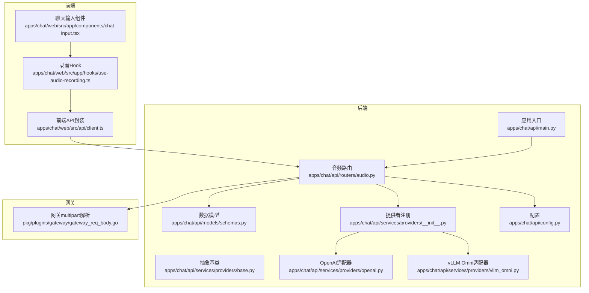
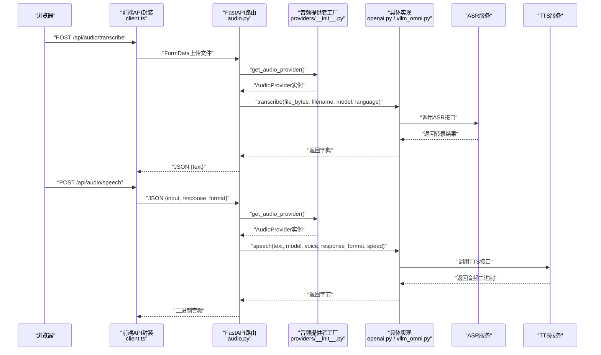
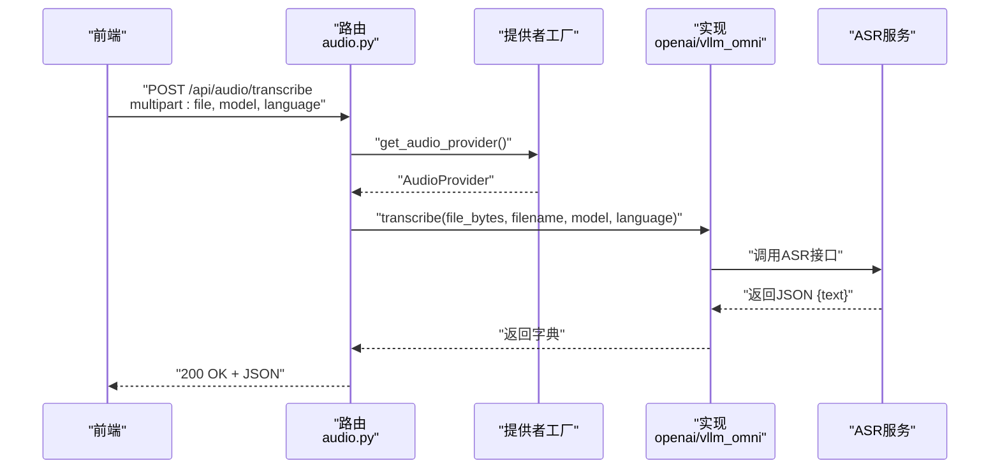
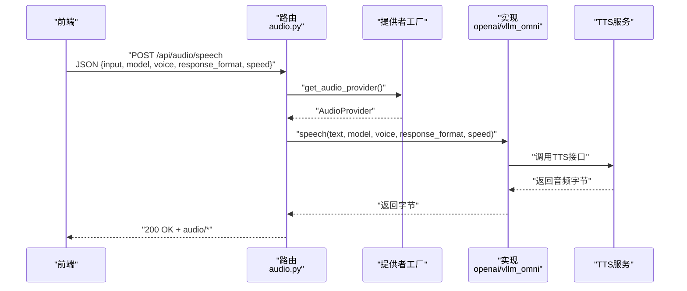
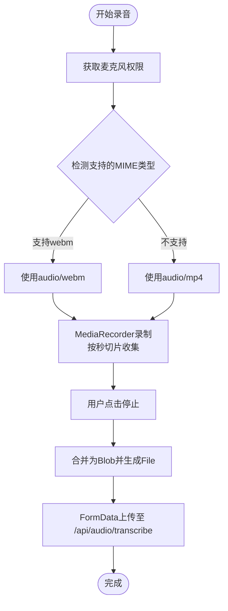
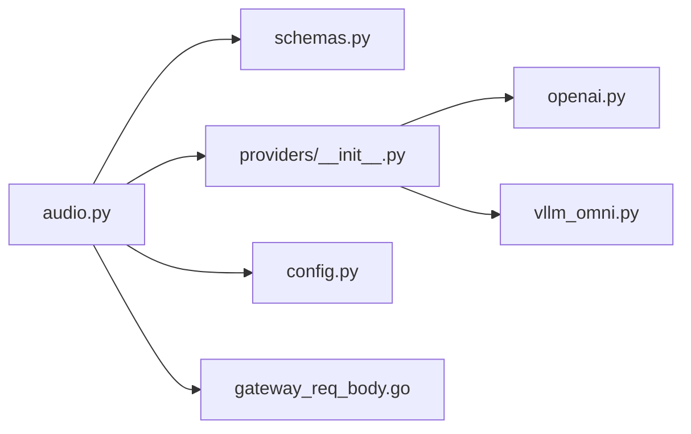

# 音频处理API

<cite>
**本文引用的文件**
- [apps/chat/api/routers/audio.py](file://apps/chat/api/routers/audio.py)
- [apps/chat/api/models/schemas.py](file://apps/chat/api/models/schemas.py)
- [apps/chat/api/services/providers/__init__.py](file://apps/chat/api/services/providers/__init__.py)
- [apps/chat/api/services/providers/base.py](file://apps/chat/api/services/providers/base.py)
- [apps/chat/api/services/providers/openai.py](file://apps/chat/api/services/providers/openai.py)
- [apps/chat/api/services/providers/vllm_omni.py](file://apps/chat/api/services/providers/vllm_omni.py)
- [apps/chat/api/config.py](file://apps/chat/api/config.py)
- [apps/chat/api/main.py](file://apps/chat/api/main.py)
- [apps/chat/web/src/api/client.ts](file://apps/chat/web/src/api/client.ts)
- [apps/chat/web/src/app/hooks/use-audio-recording.ts](file://apps/chat/web/src/app/hooks/use-audio-recording.ts)
- [apps/chat/web/src/app/components/chat-input.tsx](file://apps/chat/web/src/app/components/chat-input.tsx)
- [pkg/plugins/gateway/gateway_req_body.go](file://pkg/plugins/gateway/gateway_req_body.go)
</cite>

## 目录
1. [简介](#简介)
2. [项目结构](#项目结构)
3. [核心组件](#核心组件)
4. [架构总览](#架构总览)
5. [详细组件分析](#详细组件分析)
6. [依赖关系分析](#依赖关系分析)
7. [性能考虑](#性能考虑)
8. [故障排查指南](#故障排查指南)
9. [结论](#结论)
10. [附录](#附录)

## 简介
本文件面向AIBrix聊天应用的音频处理API，覆盖音频录制、上传、转录（ASR）与语音生成（TTS）的完整HTTP接口规范与实现要点。内容包括：
- HTTP端点定义：方法、URL模式、请求参数、响应格式、状态码
- 音频格式支持与质量控制：WAV、MP3、OGG（通过后端适配器映射）
- 采样率与编码处理：由上游ASR/TTS服务决定，本层进行兼容性转发
- 转录准确性优化：语言参数、模型选择、批处理策略
- 前后端集成示例：录音工具、实时流式处理、批量处理思路
- 错误处理与排障建议

## 项目结构
围绕音频能力的关键目录与文件如下：
- 后端FastAPI路由与服务
  - 路由：apps/chat/api/routers/audio.py
  - 模型定义：apps/chat/api/models/schemas.py
  - 提供者注册与工厂：apps/chat/api/services/providers/__init__.py
  - 抽象基类：apps/chat/api/services/providers/base.py
  - 具体提供者：OpenAI与vLLM Omni适配器
  - 配置：apps/chat/api/config.py
  - 应用入口：apps/chat/api/main.py
- 前端客户端与录音Hook
  - 客户端API封装：apps/chat/web/src/api/client.ts
  - 录音Hook：apps/chat/web/src/app/hooks/use-audio-recording.ts
  - 聊天输入组件（触发录音UI）：apps/chat/web/src/app/components/chat-input.tsx
- 网关插件（网关侧multipart解析）
  - pkg/plugins/gateway/gateway_req_body.go

图表来源
- [apps/chat/api/main.py:1-87](file://apps/chat/api/main.py#L1-L87)
- [apps/chat/api/routers/audio.py:1-65](file://apps/chat/api/routers/audio.py#L1-L65)
- [apps/chat/api/services/providers/__init__.py:1-102](file://apps/chat/api/services/providers/__init__.py#L1-L102)
- [apps/chat/api/services/providers/base.py:1-138](file://apps/chat/api/services/providers/base.py#L1-L138)
- [apps/chat/api/services/providers/openai.py:337-386](file://apps/chat/api/services/providers/openai.py#L337-L386)
- [apps/chat/api/services/providers/vllm_omni.py:378-419](file://apps/chat/api/services/providers/vllm_omni.py#L378-L419)
- [apps/chat/api/models/schemas.py:123-136](file://apps/chat/api/models/schemas.py#L123-L136)
- [apps/chat/api/config.py:1-94](file://apps/chat/api/config.py#L1-L94)
- [apps/chat/web/src/api/client.ts:331-363](file://apps/chat/web/src/api/client.ts#L331-L363)
- [apps/chat/web/src/app/hooks/use-audio-recording.ts:1-89](file://apps/chat/web/src/app/hooks/use-audio-recording.ts#L1-L89)
- [pkg/plugins/gateway/gateway_req_body.go:41-77](file://pkg/plugins/gateway/gateway_req_body.go#L41-L77)

章节来源
- [apps/chat/api/main.py:1-87](file://apps/chat/api/main.py#L1-L87)
- [apps/chat/api/routers/audio.py:1-65](file://apps/chat/api/routers/audio.py#L1-L65)
- [apps/chat/api/services/providers/__init__.py:1-102](file://apps/chat/api/services/providers/__init__.py#L1-L102)
- [apps/chat/api/services/providers/base.py:1-138](file://apps/chat/api/services/providers/base.py#L1-L138)
- [apps/chat/api/services/providers/openai.py:337-386](file://apps/chat/api/services/providers/openai.py#L337-L386)
- [apps/chat/api/services/providers/vllm_omni.py:378-419](file://apps/chat/api/services/providers/vllm_omni.py#L378-L419)
- [apps/chat/api/models/schemas.py:123-136](file://apps/chat/api/models/schemas.py#L123-L136)
- [apps/chat/api/config.py:1-94](file://apps/chat/api/config.py#L1-L94)
- [apps/chat/web/src/api/client.ts:331-363](file://apps/chat/web/src/api/client.ts#L331-L363)
- [apps/chat/web/src/app/hooks/use-audio-recording.ts:1-89](file://apps/chat/web/src/app/hooks/use-audio-recording.ts#L1-L89)
- [pkg/plugins/gateway/gateway_req_body.go:41-77](file://pkg/plugins/gateway/gateway_req_body.go#L41-L77)

## 核心组件
- 音频路由与端点
  - /api/audio/transcribe：POST，表单上传音频文件，返回转录文本
  - /api/audio/speech：POST，JSON输入文本，返回指定格式音频二进制
- 数据模型
  - AudioTranscribeResponse：text字段
  - AudioSpeechRequest：input、model、voice、response_format、speed
- 提供者体系
  - 抽象基类AudioProvider定义transcribe与speech两个异步接口
  - 工厂函数get_audio_provider按配置选择OpenAI或vLLM Omni实现
- 配置
  - 支持通过环境变量设置ASR/TTS服务URL与密钥，以及默认模型名
- 网关插件
  - 对音频multipart请求进行解析，以便路由与计费统计

章节来源
- [apps/chat/api/routers/audio.py:20-65](file://apps/chat/api/routers/audio.py#L20-L65)
- [apps/chat/api/models/schemas.py:126-136](file://apps/chat/api/models/schemas.py#L126-L136)
- [apps/chat/api/services/providers/base.py:80-109](file://apps/chat/api/services/providers/base.py#L80-L109)
- [apps/chat/api/services/providers/__init__.py:76-89](file://apps/chat/api/services/providers/__init__.py#L76-L89)
- [apps/chat/api/config.py:4-94](file://apps/chat/api/config.py#L4-L94)
- [pkg/plugins/gateway/gateway_req_body.go:41-77](file://pkg/plugins/gateway/gateway_req_body.go#L41-L77)

## 架构总览
下图展示从浏览器到后端再到ASR/TTS服务的整体调用链路。

图表来源
- [apps/chat/api/routers/audio.py:20-65](file://apps/chat/api/routers/audio.py#L20-L65)
- [apps/chat/api/services/providers/__init__.py:76-89](file://apps/chat/api/services/providers/__init__.py#L76-L89)
- [apps/chat/api/services/providers/openai.py:337-386](file://apps/chat/api/services/providers/openai.py#L337-L386)
- [apps/chat/api/services/providers/vllm_omni.py:378-419](file://apps/chat/api/services/providers/vllm_omni.py#L378-L419)
- [apps/chat/web/src/api/client.ts:331-363](file://apps/chat/web/src/api/client.ts#L331-L363)

## 详细组件分析

### 音频转录（ASR）接口
- HTTP方法与URL
  - 方法：POST
  - 路径：/api/audio/transcribe
- 请求参数
  - 表单字段：
    - file：必填，音频文件（multipart/form-data）
    - model：可选，默认来自配置
    - language：可选，语言代码（如zh、en）
- 响应格式
  - JSON对象，包含text字段
- 状态码
  - 200：成功
  - 502：上游ASR服务异常
- 实现要点
  - 路由读取上传文件并调用AudioProvider.transcribe
  - OpenAI与vLLM Omni适配器均将language参数透传至对应服务
  - 网关侧对multipart请求进行解析，避免路由错误

图表来源
- [apps/chat/api/routers/audio.py:20-39](file://apps/chat/api/routers/audio.py#L20-L39)
- [apps/chat/api/services/providers/openai.py:337-360](file://apps/chat/api/services/providers/openai.py#L337-L360)
- [apps/chat/api/services/providers/vllm_omni.py:389-409](file://apps/chat/api/services/providers/vllm_omni.py#L389-L409)
- [pkg/plugins/gateway/gateway_req_body.go:41-77](file://pkg/plugins/gateway/gateway_req_body.go#L41-L77)

章节来源
- [apps/chat/api/routers/audio.py:20-39](file://apps/chat/api/routers/audio.py#L20-L39)
- [apps/chat/api/services/providers/openai.py:337-360](file://apps/chat/api/services/providers/openai.py#L337-L360)
- [apps/chat/api/services/providers/vllm_omni.py:389-409](file://apps/chat/api/services/providers/vllm_omni.py#L389-L409)
- [apps/chat/api/models/schemas.py:126](file://apps/chat/api/models/schemas.py#L126)
- [pkg/plugins/gateway/gateway_req_body.go:41-77](file://pkg/plugins/gateway/gateway_req_body.go#L41-L77)

### 语音合成（TTS）接口
- HTTP方法与URL
  - 方法：POST
  - 路径：/api/audio/speech
- 请求参数
  - JSON对象：
    - input：必填，文本内容（最大长度见模型定义）
    - model：可选，默认来自配置
    - voice：可选，默认来自配置
    - response_format：可选，支持mp3、opus、aac、flac、wav
    - speed：可选，语速
- 响应格式
  - 二进制音频数据，媒体类型根据response_format映射
- 状态码
  - 200：成功
  - 502：上游TTS服务异常
- 实现要点
  - 路由根据response_format映射媒体类型并返回二进制
  - OpenAI与vLLM Omni适配器分别调用对应服务的TTS接口

图表来源
- [apps/chat/api/routers/audio.py:42-65](file://apps/chat/api/routers/audio.py#L42-L65)
- [apps/chat/api/services/providers/openai.py:362-383](file://apps/chat/api/services/providers/openai.py#L362-L383)
- [apps/chat/api/services/providers/vllm_omni.py:411-419](file://apps/chat/api/services/providers/vllm_omni.py#L411-L419)
- [apps/chat/api/models/schemas.py:130-136](file://apps/chat/api/models/schemas.py#L130-L136)

章节来源
- [apps/chat/api/routers/audio.py:42-65](file://apps/chat/api/routers/audio.py#L42-L65)
- [apps/chat/api/services/providers/openai.py:362-383](file://apps/chat/api/services/providers/openai.py#L362-L383)
- [apps/chat/api/services/providers/vllm_omni.py:411-419](file://apps/chat/api/services/providers/vllm_omni.py#L411-L419)
- [apps/chat/api/models/schemas.py:130-136](file://apps/chat/api/models/schemas.py#L130-L136)

### 前端录音与上传
- 录音流程
  - 使用浏览器MediaRecorder录制音频，支持webm或mp4
  - 录制期间按秒切片收集，停止时合并为Blob并转换为File
  - 将File以FormData形式上传至/ api/audio/transcribe
- UI交互
  - 聊天输入组件提供录音按钮与录制状态显示
- 示例流程

图表来源
- [apps/chat/web/src/app/hooks/use-audio-recording.ts:39-88](file://apps/chat/web/src/app/hooks/use-audio-recording.ts#L39-L88)
- [apps/chat/web/src/api/client.ts:333-348](file://apps/chat/web/src/api/client.ts#L333-L348)
- [apps/chat/web/src/app/components/chat-input.tsx:293-339](file://apps/chat/web/src/app/components/chat-input.tsx#L293-L339)

章节来源
- [apps/chat/web/src/app/hooks/use-audio-recording.ts:1-89](file://apps/chat/web/src/app/hooks/use-audio-recording.ts#L1-L89)
- [apps/chat/web/src/api/client.ts:331-348](file://apps/chat/web/src/api/client.ts#L331-L348)
- [apps/chat/web/src/app/components/chat-input.tsx:293-339](file://apps/chat/web/src/app/components/chat-input.tsx#L293-L339)

### 批量音频处理与实时流处理
- 批量处理
  - 可将多段音频文件按顺序上传至/ api/audio/transcribe，逐个获取转录结果
  - 建议在前端维护任务队列与重试机制，结合后端错误码进行幂等处理
- 实时流处理
  - 网关侧对multipart请求进行解析，便于后续扩展为流式ASR（当前路由未暴露流式端点）
  - 前端可通过定时切片录制（已实现）配合后端批处理满足低延迟需求

章节来源
- [pkg/plugins/gateway/gateway_req_body.go:41-77](file://pkg/plugins/gateway/gateway_req_body.go#L41-L77)
- [apps/chat/web/src/app/hooks/use-audio-recording.ts:60-68](file://apps/chat/web/src/app/hooks/use-audio-recording.ts#L60-L68)

## 依赖关系分析
- 组件耦合
  - 路由层仅依赖提供者工厂与数据模型，保持高内聚低耦合
  - 提供者工厂通过配置选择具体实现，便于替换与扩展
- 外部依赖
  - ASR/TTS服务通过OpenAI或vLLM Omni适配器访问
  - 网关插件负责multipart解析，保障路由一致性

图表来源
- [apps/chat/api/routers/audio.py:1-65](file://apps/chat/api/routers/audio.py#L1-L65)
- [apps/chat/api/models/schemas.py:123-136](file://apps/chat/api/models/schemas.py#L123-L136)
- [apps/chat/api/services/providers/__init__.py:76-89](file://apps/chat/api/services/providers/__init__.py#L76-L89)
- [apps/chat/api/services/providers/openai.py:337-386](file://apps/chat/api/services/providers/openai.py#L337-L386)
- [apps/chat/api/services/providers/vllm_omni.py:378-419](file://apps/chat/api/services/providers/vllm_omni.py#L378-L419)
- [apps/chat/api/config.py:1-94](file://apps/chat/api/config.py#L1-L94)
- [pkg/plugins/gateway/gateway_req_body.go:41-77](file://pkg/plugins/gateway/gateway_req_body.go#L41-L77)

章节来源
- [apps/chat/api/routers/audio.py:1-65](file://apps/chat/api/routers/audio.py#L1-L65)
- [apps/chat/api/services/providers/__init__.py:76-89](file://apps/chat/api/services/providers/__init__.py#L76-L89)
- [apps/chat/api/services/providers/openai.py:337-386](file://apps/chat/api/services/providers/openai.py#L337-L386)
- [apps/chat/api/services/providers/vllm_omni.py:378-419](file://apps/chat/api/services/providers/vllm_omni.py#L378-L419)
- [apps/chat/api/config.py:1-94](file://apps/chat/api/config.py#L1-L94)
- [pkg/plugins/gateway/gateway_req_body.go:41-77](file://pkg/plugins/gateway/gateway_req_body.go#L41-L77)

## 性能考虑
- 连接池与生命周期
  - 应用启动时初始化提供者连接池，关闭时释放资源，减少重复握手开销
- 传输格式与压缩
  - TTS支持多种格式，前端可按需选择以平衡体积与兼容性
- 语言与模型
  - 显式指定language与model可提升转录准确率与速度
- 前端录制策略
  - 使用timeslice按秒切片，降低内存峰值并提升用户体验

章节来源
- [apps/chat/api/main.py:21-35](file://apps/chat/api/main.py#L21-L35)
- [apps/chat/api/routers/audio.py:54-62](file://apps/chat/api/routers/audio.py#L54-L62)
- [apps/chat/web/src/app/hooks/use-audio-recording.ts:60-68](file://apps/chat/web/src/app/hooks/use-audio-recording.ts#L60-L68)

## 故障排查指南
- 常见错误与定位
  - 502 Bad Gateway：上游ASR/TTS服务不可达或认证失败
  - 400/422：请求参数缺失或格式错误（如multipart字段不完整）
  - 401：鉴权头缺失或无效
- 排查步骤
  - 检查环境变量与配置项（ASR/TTS URL与密钥）
  - 确认前端是否正确构造FormData与JSON负载
  - 查看后端日志中的异常堆栈与上游响应详情
- 建议
  - 在前端捕获并提示具体错误信息
  - 对网络波动场景增加重试与降级策略

章节来源
- [apps/chat/api/routers/audio.py:37-39](file://apps/chat/api/routers/audio.py#L37-L39)
- [apps/chat/api/routers/audio.py:63-65](file://apps/chat/api/routers/audio.py#L63-L65)
- [apps/chat/web/src/api/client.ts:343-346](file://apps/chat/web/src/api/client.ts#L343-L346)
- [apps/chat/web/src/api/client.ts:358-361](file://apps/chat/web/src/api/client.ts#L358-L361)

## 结论
AIBrix的音频处理API通过统一的路由与提供者抽象，实现了对OpenAI与vLLM Omni的无缝适配。前端提供了完整的录音与上传流程，后端保证了跨服务的稳定性与可扩展性。开发者可基于本文档快速实现音频录制、转录与语音生成的前后端交互，并结合配置与网关能力实现更高级的批量与流式处理。

## 附录
- 端点一览
  - POST /api/audio/transcribe
    - 表单参数：file、model、language
    - 响应：JSON { text }
    - 状态码：200、502
  - POST /api/audio/speech
    - JSON参数：input、model、voice、response_format、speed
    - 响应：二进制音频（媒体类型依据response_format）
    - 状态码：200、502
- 音频格式支持
  - TTS支持：mp3、opus、aac、flac、wav（由实现映射）
  - 录音前端：优先webm，否则mp4
- 配置项参考
  - ASR/TTS服务URL与密钥、默认模型名、CORS来源等

章节来源
- [apps/chat/api/routers/audio.py:20-65](file://apps/chat/api/routers/audio.py#L20-L65)
- [apps/chat/api/models/schemas.py:126-136](file://apps/chat/api/models/schemas.py#L126-L136)
- [apps/chat/api/config.py:4-94](file://apps/chat/api/config.py#L4-L94)
- [apps/chat/web/src/app/hooks/use-audio-recording.ts:40-43](file://apps/chat/web/src/app/hooks/use-audio-recording.ts#L40-L43)