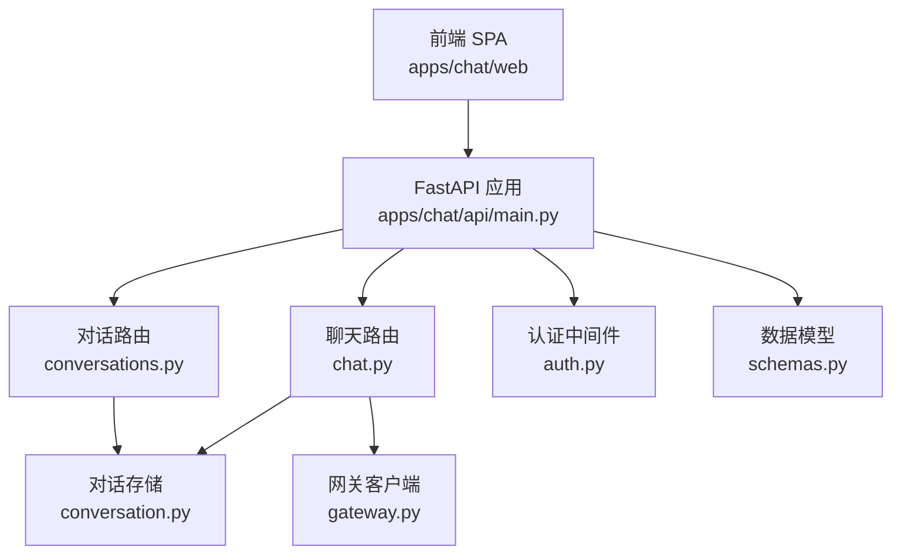
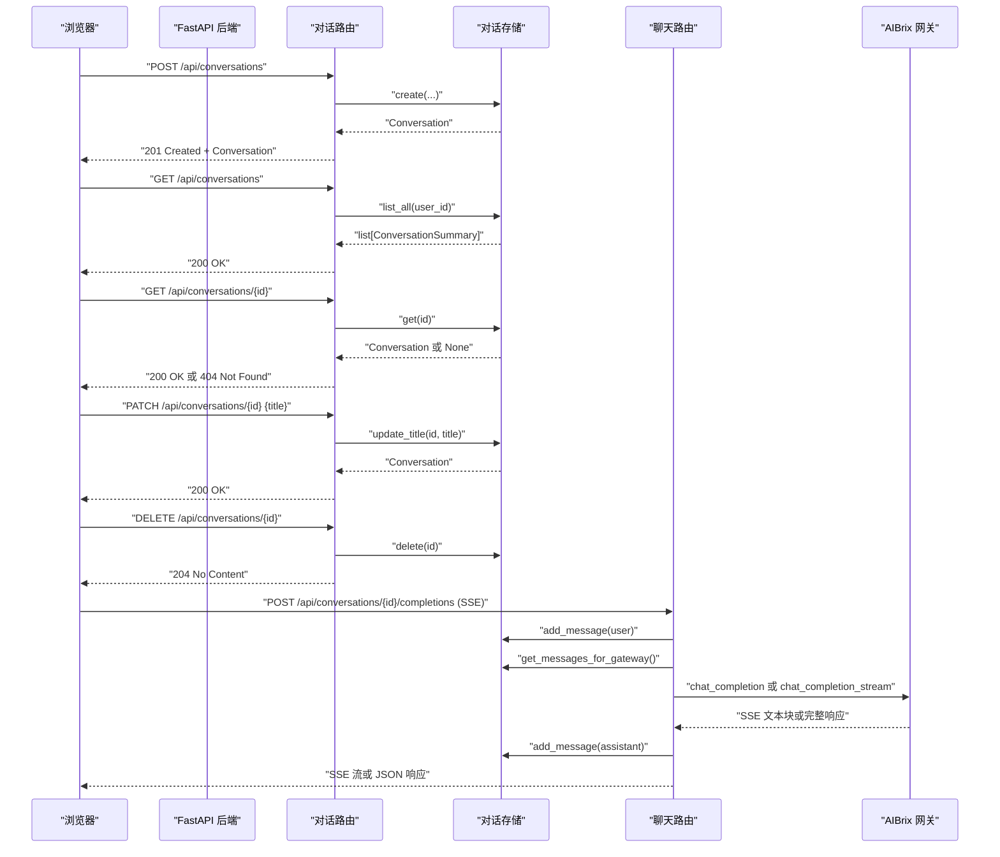
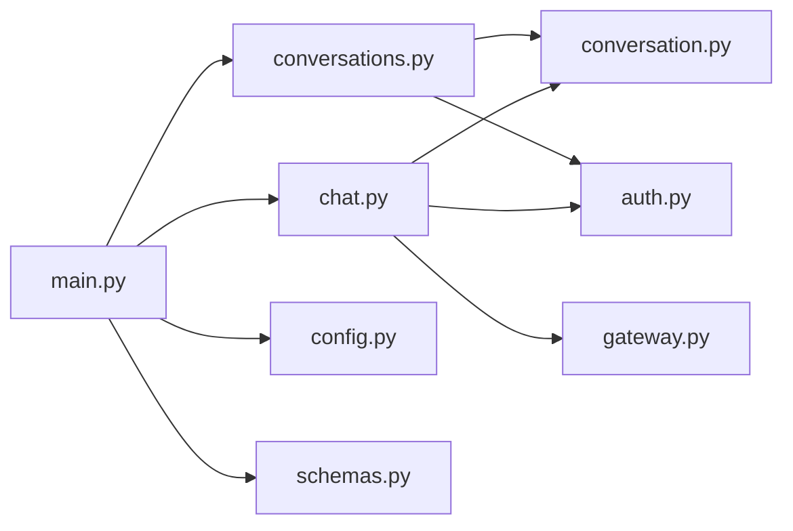

# 对话管理API

<cite>
**本文档引用的文件**
- [apps/chat/api/routers/conversations.py](file://apps/chat/api/routers/conversations.py)
- [apps/chat/api/routers/chat.py](file://apps/chat/api/routers/chat.py)
- [apps/chat/api/services/conversation.py](file://apps/chat/api/services/conversation.py)
- [apps/chat/api/models/schemas.py](file://apps/chat/api/models/schemas.py)
- [apps/chat/api/middleware/auth.py](file://apps/chat/api/middleware/auth.py)
- [apps/chat/api/main.py](file://apps/chat/api/main.py)
- [apps/chat/api/config.py](file://apps/chat/api/config.py)
- [apps/chat/web/src/api/client.ts](file://apps/chat/web/src/api/client.ts)
- [apps/chat/README.md](file://apps/chat/README.md)
</cite>

## 目录
1. [简介](#简介)
2. [项目结构](#项目结构)
3. [核心组件](#核心组件)
4. [架构总览](#架构总览)
5. [详细组件分析](#详细组件分析)
6. [依赖关系分析](#依赖关系分析)
7. [性能考虑](#性能考虑)
8. [故障排查指南](#故障排查指南)
9. [结论](#结论)
10. [附录](#附录)

## 简介
本文件面向开发者，系统性地阐述 AIBrix 聊天应用的“对话管理 API”。该 API 提供完整的对话生命周期管理能力：创建新对话、列出对话、获取对话详情、重命名对话、删除对话，并支持在对话中进行消息交互（文本与图片附件），通过服务器推送事件（SSE）流式返回模型回复。

本文件覆盖：
- 所有 HTTP 端点的 HTTP 方法、URL 模式、请求参数、响应格式与状态码
- 对话状态管理、消息历史记录、权限控制机制
- curl 示例与前端 SDK 使用指南
- 基于源码的架构与数据流图示

## 项目结构
AIBrix Chat 的后端采用 FastAPI（BFF）作为统一入口，前端为 React SPA，二者通过 /api/* 代理访问后端。对话管理 API 位于后端的 conversations 路由模块，核心业务逻辑由内存存储实现，消息历史构建与网关调用由聊天路由负责。

图表来源
- [apps/chat/api/main.py:62-71](file://apps/chat/api/main.py#L62-L71)
- [apps/chat/api/routers/conversations.py:10](file://apps/chat/api/routers/conversations.py#L10)
- [apps/chat/api/routers/chat.py:21](file://apps/chat/api/routers/chat.py#L21)
- [apps/chat/api/services/conversation.py:10](file://apps/chat/api/services/conversation.py#L10)

章节来源
- [apps/chat/api/main.py:37-87](file://apps/chat/api/main.py#L37-L87)
- [apps/chat/README.md:75-96](file://apps/chat/README.md#L75-L96)

## 核心组件
- 认证中间件：根据配置决定是否启用认证，解析 Bearer Token 并解析当前用户。
- 数据模型：定义消息、对话、对话摘要、完成请求/响应等结构。
- 对话存储：基于内存的线程安全存储，提供创建、读取、列表、更新标题、删除、追加消息、构建网关消息列表等能力。
- 对话路由：提供创建、列出、获取、重命名、删除对话的 REST 接口。
- 聊天路由：接收用户消息，构建完整历史，调用网关并以 SSE 流式返回结果；非流式时一次性返回完整响应。

章节来源
- [apps/chat/api/middleware/auth.py:17-36](file://apps/chat/api/middleware/auth.py#L17-L36)
- [apps/chat/api/models/schemas.py:34-71](file://apps/chat/api/models/schemas.py#L34-L71)
- [apps/chat/api/services/conversation.py:10-124](file://apps/chat/api/services/conversation.py#L10-L124)
- [apps/chat/api/routers/conversations.py:13-73](file://apps/chat/api/routers/conversations.py#L13-L73)
- [apps/chat/api/routers/chat.py:40-199](file://apps/chat/api/routers/chat.py#L40-L199)

## 架构总览
下图展示从浏览器到后端、再到 AIBrix 网关的端到端流程，重点体现对话管理与消息交互的职责边界。

图表来源
- [apps/chat/api/routers/conversations.py:23-73](file://apps/chat/api/routers/conversations.py#L23-L73)
- [apps/chat/api/routers/chat.py:40-199](file://apps/chat/api/routers/chat.py#L40-L199)
- [apps/chat/api/services/conversation.py:16-124](file://apps/chat/api/services/conversation.py#L16-L124)

## 详细组件分析

### 对话管理端点
以下为对话生命周期管理的全部 HTTP 端点，含请求参数、响应格式与状态码说明。

- 创建对话
  - 方法与路径：POST /api/conversations
  - 请求头：Content-Type: application/json；可选 Authorization: Bearer <token>
  - 请求体字段：
    - model: 字符串，可选，模型标识
    - title: 字符串，默认 "New Chat"
    - project_id: 字符串，可选，关联项目 ID
  - 成功响应：201 Created，响应体为 Conversation 对象
  - 失败响应：401 未认证（当启用认证且令牌无效）

- 列出对话
  - 方法与路径：GET /api/conversations
  - 请求头：可选 Authorization: Bearer <token>
  - 成功响应：200 OK，响应体为 ConversationSummary 数组，按 updated_at 降序排列
  - 失败响应：401 未认证

- 获取对话详情
  - 方法与路径：GET /api/conversations/{conversation_id}
  - 请求头：可选 Authorization: Bearer <token>
  - 成功响应：200 OK，响应体为 Conversation 对象（包含消息历史）
  - 失败响应：404 未找到（不存在或不属于当前用户）

- 更新对话标题
  - 方法与路径：PATCH /api/conversations/{conversation_id}
  - 请求头：Content-Type: application/json；可选 Authorization: Bearer <token>
  - 请求体字段：title: 字符串
  - 成功响应：200 OK，响应体为 Conversation 对象
  - 失败响应：404 未找到

- 删除对话
  - 方法与路径：DELETE /api/conversations/{conversation_id}
  - 请求头：可选 Authorization: Bearer <token>
  - 成功响应：204 No Content
  - 失败响应：404 未找到

- 发送消息并流式获取回答
  - 方法与路径：POST /api/conversations/{conversation_id}/completions
  - 请求头：multipart/form-data；可选 Authorization: Bearer <token>
  - 表单字段：
    - message: 字符串，最新用户消息内容
    - model: 字符串，目标模型标识
    - stream: 布尔值，默认 true，是否启用 SSE 流式输出
    - temperature: 浮点数，默认 0.7
    - max_tokens: 整数，默认 2048
    - system_prompt: 字符串，可选，显式系统提示
    - files: 文件数组，可选，最多 20MB/个，仅支持图片（自动转 base64 预览）
  - 成功响应：
    - 流式：200 OK，Content-Type: text/event-stream，事件类型 text_delta/done/error
    - 非流式：200 OK，JSON，包含 id、conversation_id、model、message、usage
  - 失败响应：404 未找到；413 文件过大；502 网关错误

章节来源
- [apps/chat/api/routers/conversations.py:23-73](file://apps/chat/api/routers/conversations.py#L23-L73)
- [apps/chat/api/routers/chat.py:40-199](file://apps/chat/api/routers/chat.py#L40-L199)
- [apps/chat/api/middleware/auth.py:23-36](file://apps/chat/api/middleware/auth.py#L23-L36)

### 数据模型与状态管理
- Conversation/ConversationSummary
  - Conversation 包含 id、title、messages、model、user_id、project_id、created_at、updated_at
  - ConversationSummary 用于列表页，包含 id、title、model、message_count、created_at、updated_at
- Message
  - 包含 id、role、content（字符串或内容块列表）、parent_id、model、attachments、created_at
  - 支持多模态内容块：text 与 image_url
- ChatAttachment
  - 记录上传文件元数据（名称、类型、kind、预览 URL）
- 状态管理
  - 对话标题默认为 "New Chat"，首次收到用户消息时会自动截取前 40 字作为标题
  - 每次消息变更均更新 updated_at
  - 当 model 变更时，会同步更新对话的 model 字段

章节来源
- [apps/chat/api/models/schemas.py:34-71](file://apps/chat/api/models/schemas.py#L34-L71)
- [apps/chat/api/models/schemas.py:16-44](file://apps/chat/api/models/schemas.py#L16-L44)
- [apps/chat/api/services/conversation.py:24-62](file://apps/chat/api/services/conversation.py#L24-L62)
- [apps/chat/api/routers/chat.py:24-37](file://apps/chat/api/routers/chat.py#L24-L37)

### 权限控制与认证
- 认证模式
  - auth_mode: none（默认）时不强制认证，返回默认用户
  - auth_mode: simple 时要求 Authorization: Bearer <token>
- 用户解析
  - 从请求头提取 Bearer token，查询用户；无效或过期返回 401
- 资源访问控制
  - 对话与项目接口均校验 user_id 是否匹配当前用户，不匹配返回 404

章节来源
- [apps/chat/api/middleware/auth.py:17-36](file://apps/chat/api/middleware/auth.py#L17-L36)
- [apps/chat/api/routers/conversations.py:47-48](file://apps/chat/api/routers/conversations.py#L47-L48)
- [apps/chat/api/routers/projects.py:37-40](file://apps/chat/api/routers/projects.py#L37-L40)

### 消息历史与网关集成
- 历史构建
  - 将系统提示（优先使用请求中的 system_prompt，否则回退到项目 instructions）与对话历史合并
  - 用户消息支持纯文本与图文混合内容块
- 网关调用
  - 流式：通过 SSE 事件持续推送 text_delta
  - 非流式：一次性返回 choices[0].message.content 与 usage
- 错误处理
  - 网关 HTTP 异常映射为 502；客户端断开连接时仍保存已收集的 assistant 回复

章节来源
- [apps/chat/api/services/conversation.py:106-119](file://apps/chat/api/services/conversation.py#L106-L119)
- [apps/chat/api/routers/chat.py:95-124](file://apps/chat/api/routers/chat.py#L95-L124)
- [apps/chat/api/routers/chat.py:127-199](file://apps/chat/api/routers/chat.py#L127-L199)

### curl 示例
- 创建对话
  - curl -X POST "$BASE_URL/api/conversations" -H "Authorization: Bearer $TOKEN" -H "Content-Type: application/json" -d '{"title":"我的对话","model":"gpt-4","project_id":"<project-id>"}'
- 列出对话
  - curl -X GET "$BASE_URL/api/conversations" -H "Authorization: Bearer $TOKEN"
- 获取对话详情
  - curl -X GET "$BASE_URL/api/conversations/<conversation-id>" -H "Authorization: Bearer $TOKEN"
- 重命名对话
  - curl -X PATCH "$BASE_URL/api/conversations/<conversation-id>" -H "Authorization: Bearer $TOKEN" -H "Content-Type: application/json" -d '{"title":"新标题"}'
- 删除对话
  - curl -X DELETE "$BASE_URL/api/conversations/<conversation-id>" -H "Authorization: Bearer $TOKEN"
- 发送消息并流式获取
  - curl -N -X POST "$BASE_URL/api/conversations/<conversation-id>/completions" -H "Authorization: Bearer $TOKEN" -F "message=你好" -F "model=gpt-4" -F "stream=true" -F "temperature=0.7" -F "max_tokens=2048"

章节来源
- [apps/chat/api/routers/conversations.py:23-73](file://apps/chat/api/routers/conversations.py#L23-L73)
- [apps/chat/api/routers/chat.py:40-124](file://apps/chat/api/routers/chat.py#L40-L124)

### SDK 使用指南（前端）
- 初始化
  - 通过 Vite 代理将 /api/* 转发至后端 8000 端口
  - SDK 自动从本地存储读取 token 并附加到请求头
- 常用操作
  - 创建对话：createConversation(model?, title?, projectId?)
  - 列出对话：listConversations()
  - 获取对话：getConversation(id)
  - 重命名对话：renameConversation(id, title)
  - 删除对话：deleteConversation(id)
  - 流式补全：streamCompletion(conversationId, message, model, attachments?, callbacks, opts?)
    - callbacks.onDelta: 追加增量文本
    - callbacks.onDone: 完成回调
    - callbacks.onError: 错误回调
- 错误处理
  - 401 时清除本地 token 并跳转登录页

章节来源
- [apps/chat/web/src/api/client.ts:143-193](file://apps/chat/web/src/api/client.ts#L143-L193)
- [apps/chat/web/src/api/client.ts:196-281](file://apps/chat/web/src/api/client.ts#L196-L281)
- [apps/chat/web/src/api/client.ts:27-34](file://apps/chat/web/src/api/client.ts#L27-L34)

## 依赖关系分析
- 组件耦合
  - 路由层仅负责参数解析与鉴权，业务逻辑集中在服务层（对话存储、网关客户端）
  - 对话存储对消息结构与附件格式有强约束，保证历史一致性
- 外部依赖
  - AIBrix 网关：通过环境变量配置 URL 与密钥，支持多模态与流式输出
  - 认证：可禁用或启用简单 Bearer Token 模式
- 潜在循环依赖
  - 无直接循环导入；路由与服务通过模块化组织

图表来源
- [apps/chat/api/main.py:62-71](file://apps/chat/api/main.py#L62-L71)
- [apps/chat/api/routers/conversations.py:10](file://apps/chat/api/routers/conversations.py#L10)
- [apps/chat/api/routers/chat.py:21](file://apps/chat/api/routers/chat.py#L21)
- [apps/chat/api/services/conversation.py:10](file://apps/chat/api/services/conversation.py#L10)

章节来源
- [apps/chat/api/main.py:37-87](file://apps/chat/api/main.py#L37-L87)
- [apps/chat/api/config.py:4-94](file://apps/chat/api/config.py#L4-L94)

## 性能考虑
- 内存存储
  - 当前为内存存储，适合开发与小规模测试；生产建议替换为持久化存储（如 SQLite/PostgreSQL）
- 流式传输
  - SSE 流式返回减少首字节延迟，适合长回复场景；客户端需正确处理断连与重连
- 附件处理
  - 图片自动转 base64 预览，注意内存占用；建议限制文件大小与数量
- 网关调用
  - 合理设置 temperature 与 max_tokens，避免超长上下文导致延迟增加

## 故障排查指南
- 401 未认证
  - 检查 Authorization 头是否为 Bearer <token>；确认 auth_mode 配置与后端一致
- 404 对话不存在
  - 确认 conversation_id 正确；检查 user_id 是否匹配当前用户
- 413 文件过大
  - 单文件不超过 20MB；请压缩或选择合适格式
- 502 网关错误
  - 检查 AIBRIX_GATEWAY_URL 与 API_KEY；确认网关可达且模型可用
- SSE 不断流
  - 检查客户端是否正确解析 data: 行；关注 error 事件与网络中断

章节来源
- [apps/chat/api/middleware/auth.py:23-36](file://apps/chat/api/middleware/auth.py#L23-L36)
- [apps/chat/api/routers/conversations.py:47-72](file://apps/chat/api/routers/conversations.py#L47-L72)
- [apps/chat/api/routers/chat.py:64-68](file://apps/chat/api/routers/chat.py#L64-L68)
- [apps/chat/api/routers/chat.py:149-152](file://apps/chat/api/routers/chat.py#L149-L152)

## 结论
AIBrix 聊天应用的对话管理 API 以清晰的路由分层与简洁的数据模型实现了完整的对话生命周期管理，并通过 SSE 提供流畅的消息交互体验。结合可插拔的认证与网关配置，开发者可在本地快速验证，亦可平滑迁移到生产环境。建议在生产环境中替换内存存储、完善鉴权策略与监控告警，并对大文件与长上下文进行资源限制与缓存优化。

## 附录

### 端点一览表
- 对话管理
  - POST /api/conversations → 创建对话
  - GET /api/conversations → 列出对话
  - GET /api/conversations/{id} → 获取对话详情
  - PATCH /api/conversations/{id} → 更新标题
  - DELETE /api/conversations/{id} → 删除对话
- 消息交互
  - POST /api/conversations/{id}/completions → 发送消息并流式获取回答

章节来源
- [apps/chat/README.md:50-64](file://apps/chat/README.md#L50-L64)
- [apps/chat/api/routers/conversations.py:23-73](file://apps/chat/api/routers/conversations.py#L23-L73)
- [apps/chat/api/routers/chat.py:40-124](file://apps/chat/api/routers/chat.py#L40-L124)