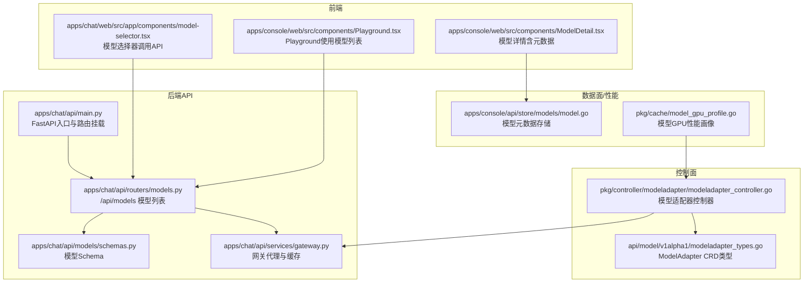
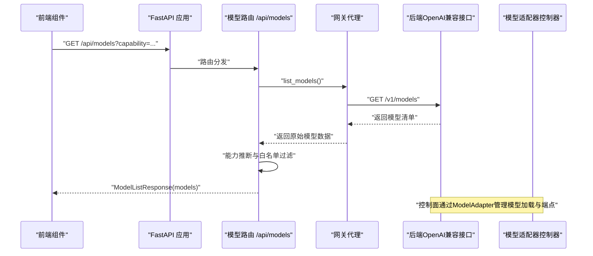
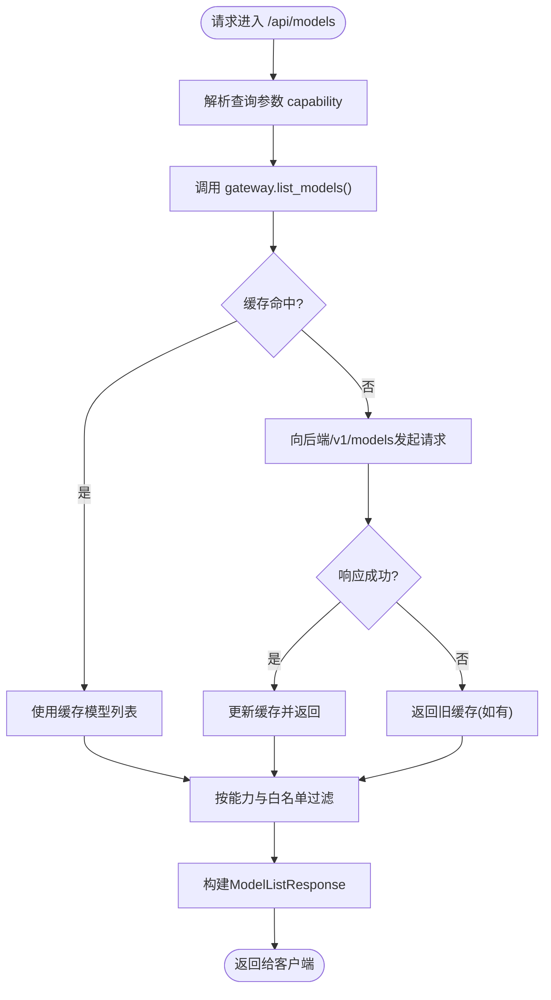
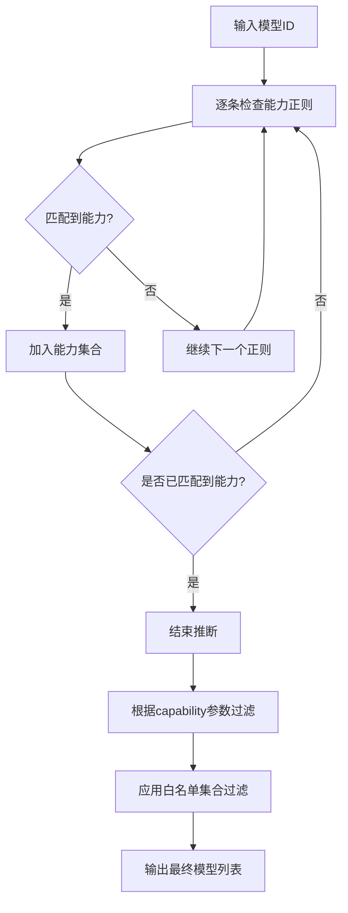
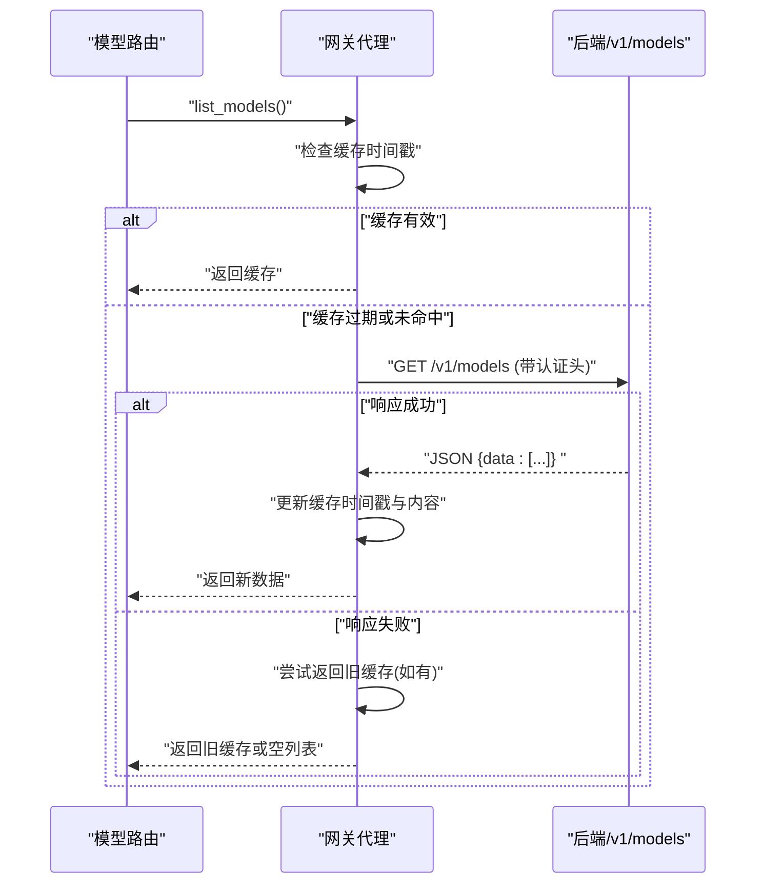
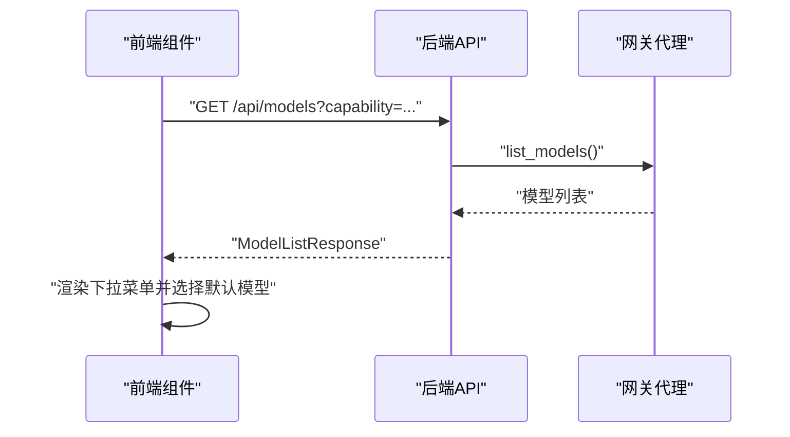
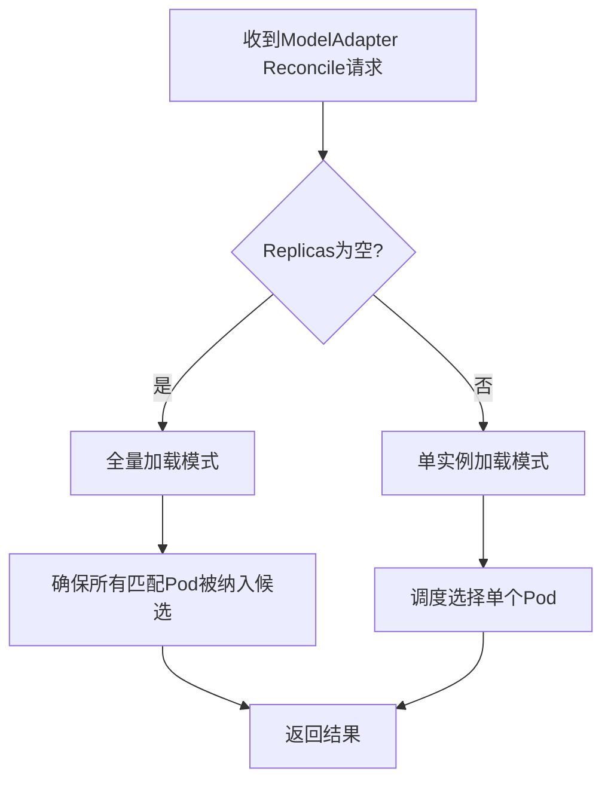
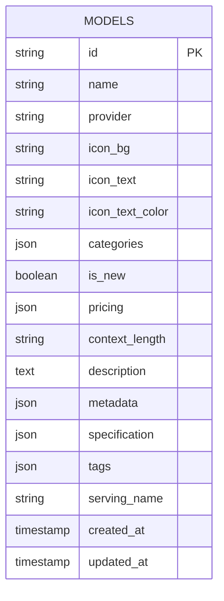
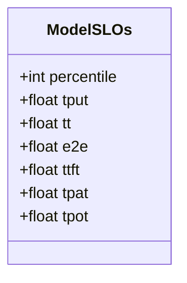
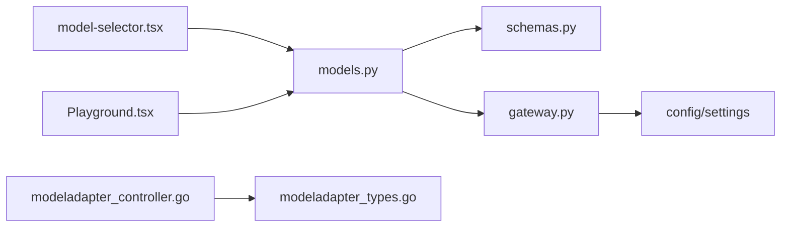

# 模型选择API

<cite>
**本文档引用的文件**
- [apps/chat/api/routers/models.py](file://apps/chat/api/routers/models.py)
- [apps/chat/api/services/gateway.py](file://apps/chat/api/services/gateway.py)
- [apps/chat/api/models/schemas.py](file://apps/chat/api/models/schemas.py)
- [apps/chat/api/main.py](file://apps/chat/api/main.py)
- [apps/chat/web/src/app/components/model-selector.tsx](file://apps/chat/web/src/app/components/model-selector.tsx)
- [apps/console/web/src/components/Playground.tsx](file://apps/console/web/src/components/Playground.tsx)
- [apps/console/web/src/components/ModelDetail.tsx](file://apps/console/web/src/components/ModelDetail.tsx)
- [apps/console/api/store/models/model.go](file://apps/console/api/store/models/model.go)
- [pkg/cache/model_gpu_profile.go](file://pkg/cache/model_gpu_profile.go)
- [pkg/controller/modeladapter/modeladapter_controller.go](file://pkg/controller/modeladapter/modeladapter_controller.go)
- [api/model/v1alpha1/modeladapter_types.go](file://api/model/v1alpha1/modeladapter_types.go)
</cite>

## 目录
1. [简介](#简介)
2. [项目结构](#项目结构)
3. [核心组件](#核心组件)
4. [架构总览](#架构总览)
5. [详细组件分析](#详细组件分析)
6. [依赖关系分析](#依赖关系分析)
7. [性能考虑](#性能考虑)
8. [故障排除指南](#故障排除指南)
9. [结论](#结论)
10. [附录](#附录)

## 简介
本文件面向AIBrix聊天应用的模型选择API，系统性梳理并说明以下内容：
- 模型发现与列表接口：获取可用模型清单、按能力过滤、基于白名单控制展示
- 模型能力推断机制：通过模型ID模式匹配推断文本/图像/音频/视频/嵌入等能力
- 模型配置与管理：环境变量白名单策略、缓存机制、错误降级
- 前端集成要点：前端如何调用后端模型列表API、自动选择默认模型
- 控制面与数据面联动：模型适配器（ModelAdapter）在Kubernetes中的部署与发现
- 性能指标与SLO：模型GPU性能画像与关键延迟指标

本指南旨在帮助开发者正确选择与配置推理模型，确保在不同运行环境下稳定地进行模型发现与切换。

## 项目结构
围绕模型选择API的关键目录与文件如下：
- 后端FastAPI应用入口与路由挂载
- 模型路由与能力推断逻辑
- 网关代理与模型列表缓存
- 前端组件对模型列表API的调用
- 控制面模型适配器资源与控制器
- 模型元数据与规格存储

**图表来源**
- [apps/chat/api/main.py:1-87](file://apps/chat/api/main.py#L1-L87)
- [apps/chat/api/routers/models.py:1-128](file://apps/chat/api/routers/models.py#L1-L128)
- [apps/chat/api/services/gateway.py:1-103](file://apps/chat/api/services/gateway.py#L1-L103)
- [apps/chat/api/models/schemas.py:158-170](file://apps/chat/api/models/schemas.py#L158-L170)
- [apps/chat/web/src/app/components/model-selector.tsx:1-40](file://apps/chat/web/src/app/components/model-selector.tsx#L1-L40)
- [apps/console/web/src/components/Playground.tsx:476-498](file://apps/console/web/src/components/Playground.tsx#L476-L498)
- [apps/console/web/src/components/ModelDetail.tsx:250-275](file://apps/console/web/src/components/ModelDetail.tsx#L250-L275)
- [apps/console/api/store/models/model.go:28-47](file://apps/console/api/store/models/model.go#L28-L47)
- [pkg/cache/model_gpu_profile.go:71-111](file://pkg/cache/model_gpu_profile.go#L71-L111)
- [pkg/controller/modeladapter/modeladapter_controller.go:313-340](file://pkg/controller/modeladapter/modeladapter_controller.go#L313-L340)
- [api/model/v1alpha1/modeladapter_types.go:144-160](file://api/model/v1alpha1/modeladapter_types.go#L144-L160)

**章节来源**
- [apps/chat/api/main.py:62-71](file://apps/chat/api/main.py#L62-L71)
- [apps/chat/api/routers/models.py:11-128](file://apps/chat/api/routers/models.py#L11-L128)

## 核心组件
- 模型列表路由：提供GET /api/models，支持按能力过滤与白名单控制
- 能力推断引擎：基于模型ID正则匹配推断文本/图像/音频/视频/嵌入能力
- 网关代理与缓存：代理到后端OpenAI兼容接口，带60秒TTL缓存与错误降级
- Schema定义：ModelInfo与ModelListResponse用于统一响应结构
- 前端集成：前端组件通过fetchModels或apiListModels调用后端模型列表API
- 控制面模型适配器：Kubernetes中管理模型加载与端点切片

**章节来源**
- [apps/chat/api/routers/models.py:92-128](file://apps/chat/api/routers/models.py#L92-L128)
- [apps/chat/api/services/gateway.py:44-68](file://apps/chat/api/services/gateway.py#L44-L68)
- [apps/chat/api/models/schemas.py:161-170](file://apps/chat/api/models/schemas.py#L161-L170)
- [apps/chat/web/src/app/components/model-selector.tsx:18-38](file://apps/chat/web/src/app/components/model-selector.tsx#L18-L38)
- [apps/console/web/src/components/Playground.tsx:487-497](file://apps/console/web/src/components/Playground.tsx#L487-L497)

## 架构总览
下图展示了从客户端到后端API再到网关与控制面的整体交互流程：

**图表来源**
- [apps/chat/api/main.py:62-71](file://apps/chat/api/main.py#L62-L71)
- [apps/chat/api/routers/models.py:92-128](file://apps/chat/api/routers/models.py#L92-L128)
- [apps/chat/api/services/gateway.py:44-68](file://apps/chat/api/services/gateway.py#L44-L68)

## 详细组件分析

### 组件A：模型列表API
- 功能概述
  - 提供GET /api/models，代理后端/v1/models并返回统一结构
  - 支持按能力过滤（text/image/audio/video/embedding）
  - 支持全局与按能力维度的白名单控制
  - 内置能力推断：根据模型ID正则匹配推断能力集合
  - 白名单解析：逗号分隔的模型ID集合，忽略大小写
- 关键实现路径
  - 路由定义与描述：[apps/chat/api/routers/models.py:92-128](file://apps/chat/api/routers/models.py#L92-L128)
  - 能力推断函数：[apps/chat/api/routers/models.py:43-64](file://apps/chat/api/routers/models.py#L43-L64)
  - 白名单解析与优先级：[apps/chat/api/routers/models.py:67-90](file://apps/chat/api/routers/models.py#L67-L90)
  - 网关代理与缓存：[apps/chat/api/services/gateway.py:44-68](file://apps/chat/api/services/gateway.py#L44-L68)
  - 响应Schema：[apps/chat/api/models/schemas.py:161-170](file://apps/chat/api/models/schemas.py#L161-L170)

**图表来源**
- [apps/chat/api/routers/models.py:92-128](file://apps/chat/api/routers/models.py#L92-L128)
- [apps/chat/api/services/gateway.py:44-68](file://apps/chat/api/services/gateway.py#L44-L68)

**章节来源**
- [apps/chat/api/routers/models.py:92-128](file://apps/chat/api/routers/models.py#L92-L128)
- [apps/chat/api/services/gateway.py:44-68](file://apps/chat/api/services/gateway.py#L44-L68)
- [apps/chat/api/models/schemas.py:161-170](file://apps/chat/api/models/schemas.py#L161-L170)

### 组件B：能力推断与白名单过滤
- 能力推断规则
  - 图像类：dall-e、chatgpt-image、flux、stable-diffusion/sdxl、midjourney、imagen
  - 视频类：sora、hunyuan-video、runway、kling、seedance
  - 音频类：whisper、tts
  - 嵌入类：embedding
  - 默认：若未匹配任何特殊能力，则视为text
- 白名单策略
  - 全局白名单：MODELS_ALLOWLIST（逗号分隔）
  - 按能力白名单：TEXT_MODELS_ALLOWLIST、IMAGE_MODELS_ALLOWLIST、AUDIO_MODELS_ALLOWLIST、VIDEO_MODELS_ALLOWLIST
  - 优先级：按能力白名单 > 全局白名单 > 不限制（显示全部）

**图表来源**
- [apps/chat/api/routers/models.py:15-64](file://apps/chat/api/routers/models.py#L15-L64)
- [apps/chat/api/routers/models.py:74-90](file://apps/chat/api/routers/models.py#L74-L90)

**章节来源**
- [apps/chat/api/routers/models.py:15-64](file://apps/chat/api/routers/models.py#L15-L64)
- [apps/chat/api/routers/models.py:74-90](file://apps/chat/api/routers/models.py#L74-L90)

### 组件C：网关代理与缓存
- 缓存策略
  - TTL：60秒
  - 命中：直接返回缓存
  - 未命中：请求后端/v1/models，解析JSON中的data字段作为模型列表
  - 错误降级：若请求失败，返回旧缓存（如存在），否则返回空列表
- 认证头
  - 若配置了密钥，自动附加Authorization: Bearer {key}

**图表来源**
- [apps/chat/api/services/gateway.py:44-68](file://apps/chat/api/services/gateway.py#L44-L68)

**章节来源**
- [apps/chat/api/services/gateway.py:17-29](file://apps/chat/api/services/gateway.py#L17-L29)
- [apps/chat/api/services/gateway.py:44-68](file://apps/chat/api/services/gateway.py#L44-L68)

### 组件D：前端集成与SDK使用
- 前端调用方式
  - React组件通过fetchModels获取模型列表，并在首次渲染时自动选择第一个可用模型
  - Console Playground通过apiListModels获取模型列表并设置默认选中项
- SDK建议
  - 使用标准HTTP客户端（如axios/fetch）调用GET /api/models
  - 可选参数：capability=text|image|audio|video|embedding
  - 处理响应：遍历models数组，渲染模型选项；保存当前选中模型ID

**图表来源**
- [apps/chat/web/src/app/components/model-selector.tsx:18-38](file://apps/chat/web/src/app/components/model-selector.tsx#L18-L38)
- [apps/console/web/src/components/Playground.tsx:487-497](file://apps/console/web/src/components/Playground.tsx#L487-L497)

**章节来源**
- [apps/chat/web/src/app/components/model-selector.tsx:18-38](file://apps/chat/web/src/app/components/model-selector.tsx#L18-L38)
- [apps/console/web/src/components/Playground.tsx:487-497](file://apps/console/web/src/components/Playground.tsx#L487-L497)

### 组件E：控制面模型适配器（ModelAdapter）
- 职责
  - 在Kubernetes环境中管理模型加载与端点切片
  - 支持“全量加载”与“单实例加载”两种模式
  - 通过EndpontSlice暴露模型服务地址
- 关键流程
  - Reconcile主循环：根据Spec与状态计算DesiredReplicas
  - 全量加载：将适配器加载到所有匹配的Pod
  - 单实例加载：通过调度器选择单个Pod加载

**图表来源**
- [pkg/controller/modeladapter/modeladapter_controller.go:313-340](file://pkg/controller/modeladapter/modeladapter_controller.go#L313-L340)
- [pkg/controller/modeladapter/modeladapter_controller.go:606-631](file://pkg/controller/modeladapter/modeladapter_controller.go#L606-L631)
- [pkg/controller/modeladapter/modeladapter_controller.go:620-626](file://pkg/controller/modeladapter/modeladapter_controller.go#L620-L626)
- [pkg/controller/modeladapter/modeladapter_controller.go:628-631](file://pkg/controller/modeladapter/modeladapter_controller.go#L628-L631)

**章节来源**
- [pkg/controller/modeladapter/modeladapter_controller.go:313-340](file://pkg/controller/modeladapter/modeladapter_controller.go#L313-L340)
- [pkg/controller/modeladapter/modeladapter_controller.go:606-631](file://pkg/controller/modeladapter/modeladapter_controller.go#L606-L631)

### 组件F：模型元数据与规格
- 数据结构
  - 模型表包含ID、名称、提供商、图标、分类、价格、上下文长度、描述、元数据、规格、标签、服务名等字段
  - ToPB转换：将数据库模型映射为protobuf消息，便于跨组件传递
- 元数据与规格
  - 元数据：状态、创建时间等
  - 规格：高阶架构细节
  - 价格：定价信息

**图表来源**
- [apps/console/api/store/models/model.go:28-47](file://apps/console/api/store/models/model.go#L28-L47)
- [apps/console/api/store/models/model.go:113-169](file://apps/console/api/store/models/model.go#L113-L169)

**章节来源**
- [apps/console/api/store/models/model.go:28-47](file://apps/console/api/store/models/model.go#L28-L47)
- [apps/console/api/store/models/model.go:113-169](file://apps/console/api/store/models/model.go#L113-L169)

### 组件G：模型性能画像与SLO
- 模型GPU性能画像
  - 包含百分位、吞吐（RPS/TPT）、端到端延迟、首Token时间、每输出Token时间等指标
  - 特征归一化：对索引特征取对数以提升稳定性
- 应用场景
  - 用于指导模型选择与容量规划
  - 与控制面结合评估不同模型在特定硬件上的表现

**图表来源**
- [pkg/cache/model_gpu_profile.go:71-79](file://pkg/cache/model_gpu_profile.go#L71-L79)
- [pkg/cache/model_gpu_profile.go:99-111](file://pkg/cache/model_gpu_profile.go#L99-L111)

**章节来源**
- [pkg/cache/model_gpu_profile.go:71-79](file://pkg/cache/model_gpu_profile.go#L71-L79)
- [pkg/cache/model_gpu_profile.go:99-111](file://pkg/cache/model_gpu_profile.go#L99-L111)

## 依赖关系分析
- 路由依赖
  - /api/models路由依赖网关代理与Schema定义
- 网关代理依赖
  - 依赖配置模块读取后端URL与密钥
  - 依赖提供者层完成实际推理调用（在聊天完成接口中体现）
- 前端依赖
  - 通过HTTP调用后端模型列表API，无需SDK即可直接使用
- 控制面依赖
  - ModelAdapter CRD与控制器共同决定模型在集群内的部署与暴露

**图表来源**
- [apps/chat/api/routers/models.py:11](file://apps/chat/api/routers/models.py#L11)
- [apps/chat/api/models/schemas.py:158-170](file://apps/chat/api/models/schemas.py#L158-L170)
- [apps/chat/api/services/gateway.py:14-15](file://apps/chat/api/services/gateway.py#L14-L15)
- [apps/chat/web/src/app/components/model-selector.tsx:3](file://apps/chat/web/src/app/components/model-selector.tsx#L3)
- [apps/console/web/src/components/Playground.tsx:487-497](file://apps/console/web/src/components/Playground.tsx#L487-L497)
- [pkg/controller/modeladapter/modeladapter_controller.go:313-340](file://pkg/controller/modeladapter/modeladapter_controller.go#L313-L340)
- [api/model/v1alpha1/modeladapter_types.go:144-160](file://api/model/v1alpha1/modeladapter_types.go#L144-L160)

**章节来源**
- [apps/chat/api/routers/models.py:11](file://apps/chat/api/routers/models.py#L11)
- [apps/chat/api/services/gateway.py:14-15](file://apps/chat/api/services/gateway.py#L14-L15)
- [apps/chat/web/src/app/components/model-selector.tsx:3](file://apps/chat/web/src/app/components/model-selector.tsx#L3)
- [apps/console/web/src/components/Playground.tsx:487-497](file://apps/console/web/src/components/Playground.tsx#L487-L497)
- [pkg/controller/modeladapter/modeladapter_controller.go:313-340](file://pkg/controller/modeladapter/modeladapter_controller.go#L313-L340)
- [api/model/v1alpha1/modeladapter_types.go:144-160](file://api/model/v1alpha1/modeladapter_types.go#L144-L160)

## 性能考虑
- 模型列表缓存
  - 60秒TTL降低后端压力，提升响应速度
  - 请求失败时的缓存降级保证可用性
- 能力推断与白名单
  - 在路由侧完成过滤，减少前端重复处理
  - 白名单可显著缩小模型集，提高筛选效率
- SSE流式响应
  - 聊天完成接口支持SSE流式输出，前端可实时接收增量内容
- 控制面调度
  - ModelAdapter控制器支持“全量加载”与“单实例加载”，可根据负载与资源情况选择最优模式

**章节来源**
- [apps/chat/api/services/gateway.py:17-29](file://apps/chat/api/services/gateway.py#L17-L29)
- [apps/chat/api/routers/models.py:74-90](file://apps/chat/api/routers/models.py#L74-L90)
- [apps/chat/api/routers/chat.py:127-161](file://apps/chat/api/routers/chat.py#L127-L161)
- [pkg/controller/modeladapter/modeladapter_controller.go:606-631](file://pkg/controller/modeladapter/modeladapter_controller.go#L606-L631)

## 故障排除指南
- 模型列表为空
  - 检查后端/v1/models可达性与返回格式
  - 查看网关代理日志，确认是否触发缓存降级
  - 确认白名单配置是否过于严格
- 能力过滤不生效
  - 确认模型ID是否符合预设正则
  - 检查capability参数值是否正确（text/image/audio/video/embedding）
- 前端无法渲染模型
  - 确认CORS配置允许OPTIONS/GET请求
  - 检查静态资源挂载与SPA回退逻辑
- 控制面模型未加载
  - 检查ModelAdapter状态与EndpontSlice是否创建成功
  - 确认Pod就绪与调度策略

**章节来源**
- [apps/chat/api/services/gateway.py:31-42](file://apps/chat/api/services/gateway.py#L31-L42)
- [apps/chat/api/routers/models.py:92-128](file://apps/chat/api/routers/models.py#L92-L128)
- [apps/chat/api/main.py:52-60](file://apps/chat/api/main.py#L52-L60)
- [pkg/controller/modeladapter/modeladapter_controller.go:980-1011](file://pkg/controller/modeladapter/modeladapter_controller.go#L980-L1011)

## 结论
AIBrix的模型选择API通过清晰的路由设计、能力推断与白名单策略、以及网关代理缓存，实现了高效稳定的模型发现与筛选。配合前端组件与控制面ModelAdapter，开发者可以在不同运行环境中灵活选择与配置推理模型。建议在生产环境中：
- 合理设置白名单，避免模型过多导致筛选困难
- 利用缓存与降级策略提升可用性
- 结合模型性能画像与SLO指标优化模型选择与容量规划

## 附录

### API定义与使用示例

- 获取可用模型列表
  - 方法与路径：GET /api/models
  - 查询参数：
    - capability：可选，支持 text、image、audio、video、embedding
  - 成功响应：ModelListResponse，包含models数组
  - 状态码：200 成功；502 网关错误（当后端不可达且无缓存时）
  - curl示例：
    - curl -s "http://localhost:8000/api/models?capability=text"
    - curl -s "http://localhost:8000/api/models"
  - SDK使用建议：
    - 使用HTTP客户端调用GET /api/models
    - 可选传入capability参数进行过滤
    - 解析响应中的models数组，渲染模型选择器

- 模型能力与元数据
  - 能力推断：基于模型ID正则匹配
  - 元数据：包含owned_by等字段（来自后端/v1/models）
  - 前端展示：Console Playground与ModelDetail组件展示模型规格与元数据

- 模型配置管理
  - 白名单：通过环境变量MODELS_ALLOWLIST与按能力白名单控制可见模型
  - 缓存：60秒TTL，请求失败时返回旧缓存（如存在）
  - 认证：若配置密钥，自动附加Authorization头

**章节来源**
- [apps/chat/api/routers/models.py:92-128](file://apps/chat/api/routers/models.py#L92-L128)
- [apps/chat/api/services/gateway.py:44-68](file://apps/chat/api/services/gateway.py#L44-L68)
- [apps/chat/api/models/schemas.py:161-170](file://apps/chat/api/models/schemas.py#L161-L170)
- [apps/console/web/src/components/Playground.tsx:476-498](file://apps/console/web/src/components/Playground.tsx#L476-L498)
- [apps/console/web/src/components/ModelDetail.tsx:250-275](file://apps/console/web/src/components/ModelDetail.tsx#L250-L275)