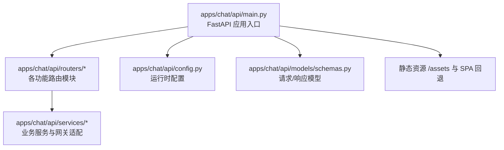
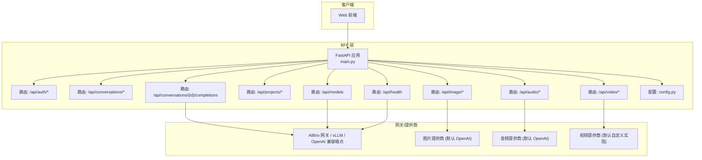
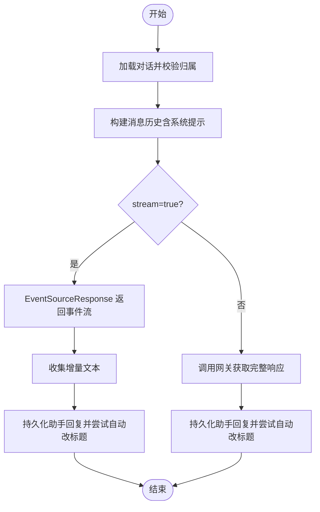
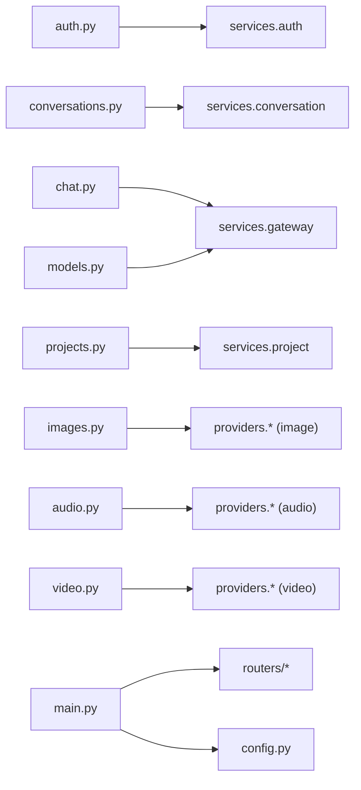

# 聊天应用API

<cite>
**本文档引用的文件**
- [apps/chat/api/main.py](file://apps/chat/api/main.py)
- [apps/chat/api/config.py](file://apps/chat/api/config.py)
- [apps/chat/api/routers/auth.py](file://apps/chat/api/routers/auth.py)
- [apps/chat/api/routers/conversations.py](file://apps/chat/api/routers/conversations.py)
- [apps/chat/api/routers/chat.py](file://apps/chat/api/routers/chat.py)
- [apps/chat/api/routers/projects.py](file://apps/chat/api/routers/projects.py)
- [apps/chat/api/routers/models.py](file://apps/chat/api/routers/models.py)
- [apps/chat/api/routers/images.py](file://apps/chat/api/routers/images.py)
- [apps/chat/api/routers/audio.py](file://apps/chat/api/routers/audio.py)
- [apps/chat/api/routers/video.py](file://apps/chat/api/routers/video.py)
- [apps/chat/api/routers/health.py](file://apps/chat/api/routers/health.py)
- [apps/chat/api/models/schemas.py](file://apps/chat/api/models/schemas.py)
</cite>

## 目录
1. [简介](#简介)
2. [项目结构](#项目结构)
3. [核心组件](#核心组件)
4. [架构总览](#架构总览)
5. [详细组件分析](#详细组件分析)
6. [依赖分析](#依赖分析)
7. [性能考虑](#性能考虑)
8. [故障排查指南](#故障排查指南)
9. [结论](#结论)
10. [附录](#附录)

## 简介
本文件为 AIBrix 聊天应用的 Backend-for-Frontend（BFF）层 RESTful API 的权威文档。该服务基于 FastAPI 构建，通过统一入口代理到任意 OpenAI 兼容后端（如 AIBrix 网关、vLLM、OpenAI 云等），并提供以下能力：
- 用户认证与会话管理（登录、登出、当前用户）
- 对话生命周期管理（创建、查询、更新标题、删除）
- 消息处理与流式响应（SSE）
- 项目管理（创建、查询、更新、删除）
- 模型发现与过滤（按文本/图像/音频/视频能力筛选）
- 多媒体内容处理（图片生成/编辑、音频转写、语音合成、视频生成/状态轮询/下载）

此外，文档还涵盖认证机制、CORS 配置、静态文件服务、状态码定义、curl 示例与 SDK 使用建议，帮助开发者快速集成聊天功能。

## 项目结构
BFF 应用位于 apps/chat/api，核心由入口文件、配置、路由模块、数据模型与服务层组成。入口文件负责初始化 FastAPI 应用、挂载路由、设置 CORS、启动/关闭时的外部服务连接池，并提供前端静态资源服务。

图表来源
- [apps/chat/api/main.py:1-87](file://apps/chat/api/main.py#L1-L87)
- [apps/chat/api/config.py:1-94](file://apps/chat/api/config.py#L1-L94)

章节来源
- [apps/chat/api/main.py:1-87](file://apps/chat/api/main.py#L1-L87)
- [apps/chat/api/config.py:1-94](file://apps/chat/api/config.py#L1-L94)

## 核心组件
- 应用入口与生命周期：在 lifespan 中初始化并关闭聊天、图片、音频、视频提供商的连接池，保证长连接复用与优雅关停。
- 路由组织：按功能划分路由模块，统一前缀与标签，便于 API 文档生成与维护。
- 配置中心：集中管理网关地址、API Key、各模态提供商、默认模型、模型白名单、CORS 与认证模式等。
- 数据模型：使用 Pydantic 定义请求/响应结构，确保前后端契约一致。
- 服务层：封装对网关或第三方提供商的调用，支持流式与非流式两种响应路径。

章节来源
- [apps/chat/api/main.py:21-35](file://apps/chat/api/main.py#L21-L35)
- [apps/chat/api/config.py:4-94](file://apps/chat/api/config.py#L4-L94)
- [apps/chat/api/models/schemas.py:1-245](file://apps/chat/api/models/schemas.py#L1-L245)

## 架构总览
下图展示从客户端到 BFF、再到网关/提供商的典型交互流程，以及静态资源与健康检查的路径。

图表来源
- [apps/chat/api/main.py:37-87](file://apps/chat/api/main.py#L37-L87)
- [apps/chat/api/routers/auth.py:12-42](file://apps/chat/api/routers/auth.py#L12-L42)
- [apps/chat/api/routers/conversations.py:10-73](file://apps/chat/api/routers/conversations.py#L10-L73)
- [apps/chat/api/routers/chat.py:21-199](file://apps/chat/api/routers/chat.py#L21-L199)
- [apps/chat/api/routers/projects.py:11-71](file://apps/chat/api/routers/projects.py#L11-L71)
- [apps/chat/api/routers/models.py:11-128](file://apps/chat/api/routers/models.py#L11-L128)
- [apps/chat/api/routers/images.py:16-72](file://apps/chat/api/routers/images.py#L16-L72)
- [apps/chat/api/routers/audio.py:17-66](file://apps/chat/api/routers/audio.py#L17-L66)
- [apps/chat/api/routers/video.py:16-66](file://apps/chat/api/routers/video.py#L16-L66)
- [apps/chat/api/routers/health.py:9-20](file://apps/chat/api/routers/health.py#L9-L20)
- [apps/chat/api/config.py:4-94](file://apps/chat/api/config.py#L4-L94)

## 详细组件分析

### 认证与用户会话
- 功能概述
  - 获取认证模式：用于前端动态调整 UI。
  - 登录：创建用户并返回令牌。
  - 当前用户：基于中间件校验令牌后返回用户信息。
  - 登出：解析 Authorization 头中的 Bearer 令牌并执行登出。

- 关键端点
  - GET /api/auth/mode
    - 响应：返回当前认证模式（如 none 或 simple）。
  - POST /api/auth/login
    - 请求体：包含用户名字段。
    - 成功：返回用户对象与令牌。
    - 错误：当用户名为空时返回 400。
  - GET /api/auth/me
    - 需要：携带有效令牌。
    - 成功：返回当前用户信息。
  - POST /api/auth/logout
    - 请求头：Authorization: Bearer <token>。
    - 成功：返回操作结果。

- 认证机制
  - 支持“无认证”和“简单认证”两种模式，具体行为由配置决定。
  - 令牌存储与校验由服务层实现，路由层通过依赖注入获取当前用户。

- curl 示例
  - 获取认证模式
    - curl -sS http://localhost:8000/api/auth/mode
  - 登录
    - curl -sS -X POST http://localhost:8000/api/auth/login -H "Content-Type: application/json" -d '{"name":"Alice"}'
  - 获取当前用户
    - curl -sS -H "Authorization: Bearer YOUR_TOKEN" http://localhost:8000/api/auth/me
  - 登出
    - curl -sS -X POST -H "Authorization: Bearer YOUR_TOKEN" http://localhost:8000/api/auth/logout

- SDK 使用建议
  - 在前端保存令牌并在后续请求头中携带 Authorization: Bearer。
  - 根据 /api/auth/mode 切换 UI 行为（例如隐藏/显示登录入口）。

章节来源
- [apps/chat/api/routers/auth.py:15-42](file://apps/chat/api/routers/auth.py#L15-L42)
- [apps/chat/api/config.py:48-52](file://apps/chat/api/config.py#L48-L52)

### 对话管理
- 功能概述
  - 创建对话：可选指定模型、标题与所属项目。
  - 列表查询：返回对话摘要列表。
  - 获取详情：按 ID 查询单个对话，校验归属。
  - 更新标题：修改对话标题。
  - 删除对话：按 ID 删除，校验归属。

- 关键端点
  - POST /api/conversations
    - 请求体：模型、标题、项目 ID。
    - 成功：返回完整对话（201）。
  - GET /api/conversations
    - 成功：返回对话摘要列表。
  - GET /api/conversations/{conversation_id}
    - 成功：返回完整对话；若不存在或非本人则 404。
  - PATCH /api/conversations/{conversation_id}
    - 请求体：新标题。
    - 成功：返回更新后的对话。
  - DELETE /api/conversations/{conversation_id}
    - 成功：204（无内容）。

- curl 示例
  - 创建对话
    - curl -sS -X POST http://localhost:8000/api/conversations -H "Authorization: Bearer YOUR_TOKEN" -H "Content-Type: application/json" -d '{"model":"gpt-4","title":"我的新聊天","project_id":"proj-xxx"}'
  - 列表
    - curl -sS http://localhost:8000/api/conversations -H "Authorization: Bearer YOUR_TOKEN"
  - 获取详情
    - curl -sS http://localhost:8000/api/conversations/conv-xxx -H "Authorization: Bearer YOUR_TOKEN"
  - 更新标题
    - curl -sS -X PATCH http://localhost:8000/api/conversations/conv-xxx -H "Authorization: Bearer YOUR_TOKEN" -H "Content-Type: application/json" -d '{"title":"新标题"}'
  - 删除
    - curl -sS -X DELETE http://localhost:8000/api/conversations/conv-xxx -H "Authorization: Bearer YOUR_TOKEN"

- SDK 使用建议
  - 将对话 ID 存储在本地，以便后续消息提交与历史拉取。
  - 在创建对话时根据需要传入项目 ID，以继承项目指令。

章节来源
- [apps/chat/api/routers/conversations.py:23-73](file://apps/chat/api/routers/conversations.py#L23-L73)

### 消息处理与流式响应
- 功能概述
  - 提交消息并获取回复，支持流式（SSE）与非流式两种模式。
  - 自动构建完整消息历史（含系统提示与附件）并转发至网关。
  - 流式场景下，收集增量文本并持久化最终回复；非流式直接返回完整响应。
  - 支持上传图片附件（自动预览）。

- 关键端点
  - POST /api/conversations/{conversation_id}/completions
    - 表单参数：
      - message: 字符串（最新用户消息）
      - model: 字符串（目标模型）
      - stream: 布尔（是否流式，默认 true）
      - temperature: 浮点数（0.0~2.0）
      - max_tokens: 整数（1~32768）
      - system_prompt: 可选字符串（显式系统提示）
      - files: 文件数组（最多 20MB/个，仅允许图片）
    - 成功：
      - 流式：SSE 返回事件流（事件类型见服务层）。
      - 非流式：JSON 响应，包含消息与用量。
    - 错误：404（对话不存在或非本人）、413（文件过大）、502（网关错误）。

- 流程图（流式）

图表来源
- [apps/chat/api/routers/chat.py:40-199](file://apps/chat/api/routers/chat.py#L40-L199)

- curl 示例
  - 流式（SSE）
    - curl -N -H "Authorization: Bearer YOUR_TOKEN" -F "message=你好" -F "model=gpt-4" -F "stream=true" -F "temperature=0.7" -F "max_tokens=2048" -F "files=@image.jpg" http://localhost:8000/api/conversations/conv-xxx/completions
  - 非流式
    - curl -sS -H "Authorization: Bearer YOUR_TOKEN" -F "message=你好" -F "model=gpt-4" -F "stream=false" -F "temperature=0.7" -F "max_tokens=2048" http://localhost:8000/api/conversations/conv-xxx/completions

- SDK 使用建议
  - 流式场景建议使用浏览器 EventSource 或对应 SDK，逐条渲染增量文本。
  - 非流式场景等待完整 JSON 后一次性渲染。
  - 上传图片时注意大小限制与 MIME 类型。

章节来源
- [apps/chat/api/routers/chat.py:40-199](file://apps/chat/api/routers/chat.py#L40-L199)

### 项目管理
- 功能概述
  - 创建项目：名称与描述必填，可选指令。
  - 列表查询：返回当前用户项目列表。
  - 获取详情：按 ID 查询，校验归属。
  - 更新项目：可更新名称、描述与指令。
  - 删除项目：按 ID 删除，校验归属。

- 关键端点
  - POST /api/projects
    - 请求体：名称、描述。
    - 成功：返回创建的项目。
  - GET /api/projects
    - 成功：返回项目列表。
  - GET /api/projects/{project_id}
    - 成功：返回项目详情；若不存在或非本人则 404。
  - PATCH /api/projects/{project_id}
    - 请求体：名称、描述、指令。
    - 成功：返回更新后的项目。
  - DELETE /api/projects/{project_id}
    - 成功：返回操作结果（200，内容为 {"ok": true}）；若不存在或非本人则 404。

- curl 示例
  - 创建
    - curl -sS -X POST http://localhost:8000/api/projects -H "Authorization: Bearer YOUR_TOKEN" -H "Content-Type: application/json" -d '{"name":"项目A","description":"测试描述"}'
  - 更新
    - curl -sS -X PATCH http://localhost:8000/api/projects/proj-xxx -H "Authorization: Bearer YOUR_TOKEN" -H "Content-Type: application/json" -d '{"instructions":"请扮演专家助手"}'

- SDK 使用建议
  - 将项目指令注入对话系统提示，提升上下文一致性。

章节来源
- [apps/chat/api/routers/projects.py:14-71](file://apps/chat/api/routers/projects.py#L14-L71)

### 模型选择与发现
- 功能概述
  - 代理获取可用模型列表，按模型 ID 推断能力（文本/图像/音频/视频/嵌入）。
  - 支持按能力过滤（capability=text|image|audio|video）。
  - 支持全局与按能力维度的模型白名单过滤。

- 关键端点
  - GET /api/models
    - 查询参数：capability（可选）。
    - 成功：返回模型列表（包含推断的能力集合）。
    - 过滤：优先使用能力级白名单，其次全局白名单，最后不过滤。

- curl 示例
  - 获取全部模型
    - curl -sS http://localhost:8000/api/models -H "Authorization: Bearer YOUR_TOKEN"
  - 仅图像模型
    - curl -sS "http://localhost:8000/api/models?capability=image" -H "Authorization: Bearer YOUR_TOKEN"

- SDK 使用建议
  - 在前端渲染模型下拉框时，先拉取 /api/models 并按 capability 进行分组展示。

章节来源
- [apps/chat/api/routers/models.py:92-128](file://apps/chat/api/routers/models.py#L92-L128)

### 图片内容处理
- 功能概述
  - 生成图片：支持尺寸、数量、质量、风格、响应格式等参数。
  - 编辑图片：基于文本提示对上传图片进行编辑。

- 关键端点
  - POST /api/image/generate
    - 表单参数：prompt、model、size、n、quality、style、response_format。
    - 成功：返回生成结果（包含时间戳与数据列表）。
    - 错误：502（提供商错误）。
  - POST /api/image/edit
    - 表单参数：image（文件）、prompt（文本）、model、size、n。
    - 成功：返回编辑结果。
    - 错误：502（提供商错误）。

- curl 示例
  - 生成
    - curl -sS -F "prompt=一个绿色的城堡" -F "model=dall-e-3" -F "size=1024x1024" -F "n=1" http://localhost:8000/api/image/generate
  - 编辑
    - curl -sS -F "image=@input.png" -F "prompt=让城堡更宏伟" -F "model=dall-e-2" -F "size=1024x1024" -F "n=1" http://localhost:8000/api/image/edit

- SDK 使用建议
  - 生成完成后将返回的 URL 或 Base64 数据渲染到页面。
  - 编辑场景需注意输入图片的大小与格式。

章节来源
- [apps/chat/api/routers/images.py:19-72](file://apps/chat/api/routers/images.py#L19-L72)

### 音频内容处理（转写与语音）
- 功能概述
  - 转写（ASR）：将音频文件转为文本。
  - 语音（TTS）：将文本合成为音频流。

- 关键端点
  - POST /api/audio/transcribe
    - 表单参数：file（音频文件）、model、language。
    - 成功：返回转写文本。
    - 错误：502（提供商错误）。
  - POST /api/audio/speech
    - 请求体：input、model、voice、response_format、speed。
    - 成功：返回指定格式的音频字节流（自动设置 Content-Type）。
    - 错误：502（提供商错误）。

- curl 示例
  - 转写
    - curl -sS -F "file=@audio.mp3" -F "model=whisper-1" http://localhost:8000/api/audio/transcribe
  - 语音
    - curl -sS -X POST http://localhost:8000/api/audio/speech -H "Content-Type: application/json" -o out.mp3 -d '{"input":"你好世界","model":"tts-1","voice":"alloy","response_format":"mp3","speed":1.0}'

- SDK 使用建议
  - TTS 返回二进制流时，前端可直接播放或下载。
  - ASR 结果可用于消息正文或附件预览。

章节来源
- [apps/chat/api/routers/audio.py:20-66](file://apps/chat/api/routers/audio.py#L20-L66)

### 视频内容处理
- 功能概述
  - 提交视频生成任务：异步作业，返回作业 ID。
  - 轮询任务状态：返回进度与状态。
  - 下载完成视频：返回 MP4 文件。

- 关键端点
  - POST /api/video/generate
    - 请求体：prompt、model、size、seconds。
    - 成功：返回作业 ID 与初始状态。
  - GET /api/video/status/{job_id}
    - 成功：返回作业状态与进度。
  - GET /api/video/content/{job_id}
    - 成功：返回 MP4 文件（带下载头）；若未找到返回 404。

- curl 示例
  - 提交任务
    - curl -sS -X POST http://localhost:8000/api/video/generate -H "Content-Type: application/json" -d '{"prompt":"一个跳舞的小猫","model":"sora-2","size":"1280x720","seconds":4}'
  - 轮询状态
    - curl -sS http://localhost:8000/api/video/status/job-xxx
  - 下载
    - curl -sS http://localhost:8000/api/video/content/job-xxx -o output.mp4

- SDK 使用建议
  - 建议采用轮询策略（指数退避）或 WebSocket（如提供商支持）。
  - 下载前检查状态为完成后再触发下载。

章节来源
- [apps/chat/api/routers/video.py:19-66](file://apps/chat/api/routers/video.py#L19-L66)

### 健康检查
- 功能概述
  - 检查 BFF 与网关连通性，返回版本与可达性信息。

- 关键端点
  - GET /api/health
    - 成功：返回状态、版本与网关可达性。

- curl 示例
  - curl -sS http://localhost:8000/api/health

- SDK 使用建议
  - 在前端展示健康面板，或在 CI 中作为就绪探针使用。

章节来源
- [apps/chat/api/routers/health.py:12-20](file://apps/chat/api/routers/health.py#L12-L20)

## 依赖分析
- 组件耦合
  - 路由层仅依赖配置与服务层，保持高内聚低耦合。
  - 服务层通过网关适配器访问外部系统，便于替换与扩展。
- 外部依赖
  - OpenAI 兼容后端（AIBrix 网关、vLLM、OpenAI 云）。
  - 多媒体提供商（图片/音频/视频，可配置为不同实现）。
- 循环依赖
  - 未发现循环导入；路由、服务、配置间为单向依赖。

图表来源
- [apps/chat/api/main.py:11-18](file://apps/chat/api/main.py#L11-L18)
- [apps/chat/api/routers/auth.py:8-10](file://apps/chat/api/routers/auth.py#L8-L10)
- [apps/chat/api/routers/conversations.py:7-8](file://apps/chat/api/routers/conversations.py#L7-L8)
- [apps/chat/api/routers/chat.py:14-17](file://apps/chat/api/routers/chat.py#L14-L17)
- [apps/chat/api/routers/projects.py:8-9](file://apps/chat/api/routers/projects.py#L8-L9)
- [apps/chat/api/routers/models.py:7-9](file://apps/chat/api/routers/models.py#L7-L9)
- [apps/chat/api/routers/images.py:10-12](file://apps/chat/api/routers/images.py#L10-L12)
- [apps/chat/api/routers/audio.py:11-13](file://apps/chat/api/routers/audio.py#L11-L13)
- [apps/chat/api/routers/video.py:11-12](file://apps/chat/api/routers/video.py#L11-L12)

## 性能考虑
- 连接池复用
  - 在应用生命周期中启动/关闭外部提供商连接池，减少握手开销。
- 流式传输
  - SSE 场景下边产生边推送，降低首字节延迟；客户端应及时消费事件。
- 文件上传
  - 单文件最大 20MB，建议前端压缩与分片（如需要）。
- 模型过滤
  - 通过白名单减少前端渲染压力，提高选择效率。
- 缓存与重试
  - 网关/提供商侧可配置重试与缓存策略，避免抖动影响用户体验。

## 故障排查指南
- 常见错误与定位
  - 401/403：令牌无效或缺失，检查 Authorization 头与认证模式。
  - 404：资源不存在或越权（对话/项目），确认 ID 与归属。
  - 413：上传文件超限，调整文件大小或切分。
  - 502：网关/提供商异常，查看日志并重试。
- 日志与可观测性
  - 路由层捕获 HTTP 异常并记录；服务层对网关调用失败进行异常记录。
- 健康检查
  - 使用 /api/health 快速判断 BFF 与网关连通性。

章节来源
- [apps/chat/api/routers/chat.py:149-152](file://apps/chat/api/routers/chat.py#L149-L152)
- [apps/chat/api/routers/chat.py:196-198](file://apps/chat/api/routers/chat.py#L196-L198)
- [apps/chat/api/routers/images.py:40-42](file://apps/chat/api/routers/images.py#L40-L42)
- [apps/chat/api/routers/audio.py:37-40](file://apps/chat/api/routers/audio.py#L37-L40)
- [apps/chat/api/routers/video.py:31-33](file://apps/chat/api/routers/video.py#L31-L33)
- [apps/chat/api/routers/health.py:12-20](file://apps/chat/api/routers/health.py#L12-L20)

## 结论
本 BFF 层以清晰的路由分层、完善的配置中心与稳健的服务适配，为聊天应用提供了统一的 RESTful 接口与丰富的多媒体能力。通过模型发现、项目指令注入与流式响应，开发者可以快速搭建具备专业体验的聊天产品。建议在生产环境中结合健康检查、重试与限流策略，持续优化性能与稳定性。

## 附录

### 认证机制与 CORS
- 认证模式
  - 通过配置项控制（如 none/simple），路由层据此决定是否校验令牌。
- CORS
  - 支持跨域来源、凭证、方法与头部白名单，满足前端开发环境需求。

章节来源
- [apps/chat/api/config.py:48-52](file://apps/chat/api/config.py#L48-L52)
- [apps/chat/api/main.py:52-60](file://apps/chat/api/main.py#L52-L60)

### 静态文件服务
- BFF 会挂载前端构建产物目录，提供静态资源与 SPA 回退（回退到 index.html）。
- 适用于将前端与后端打包部署在同一域名下的场景。

章节来源
- [apps/chat/api/main.py:73-87](file://apps/chat/api/main.py#L73-L87)

### 数据模型概览
- 消息与对话：支持多内容块、附件、时间戳与模型字段。
- 项目：名称、描述、指令与时间戳。
- 健康：状态、版本与网关可达性。
- 错误：统一错误结构，便于前端呈现。

章节来源
- [apps/chat/api/models/schemas.py:16-245](file://apps/chat/api/models/schemas.py#L16-L245)