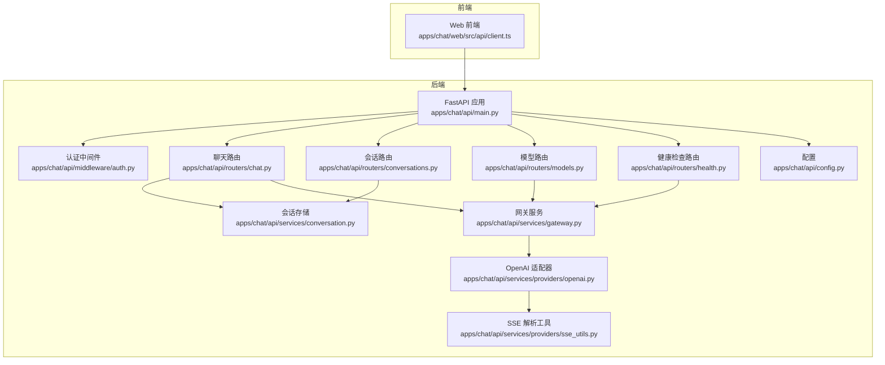
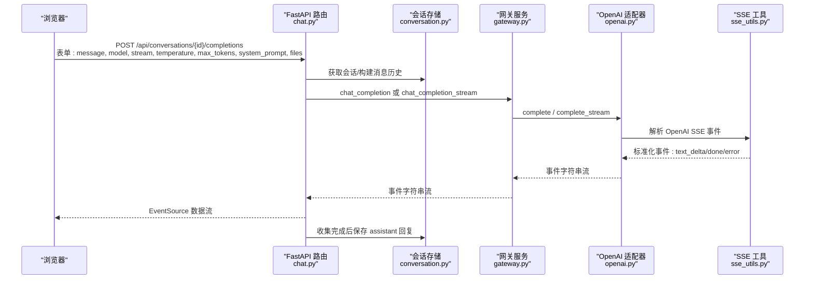
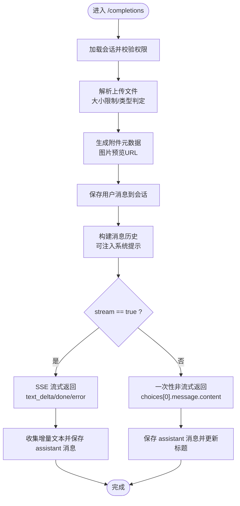
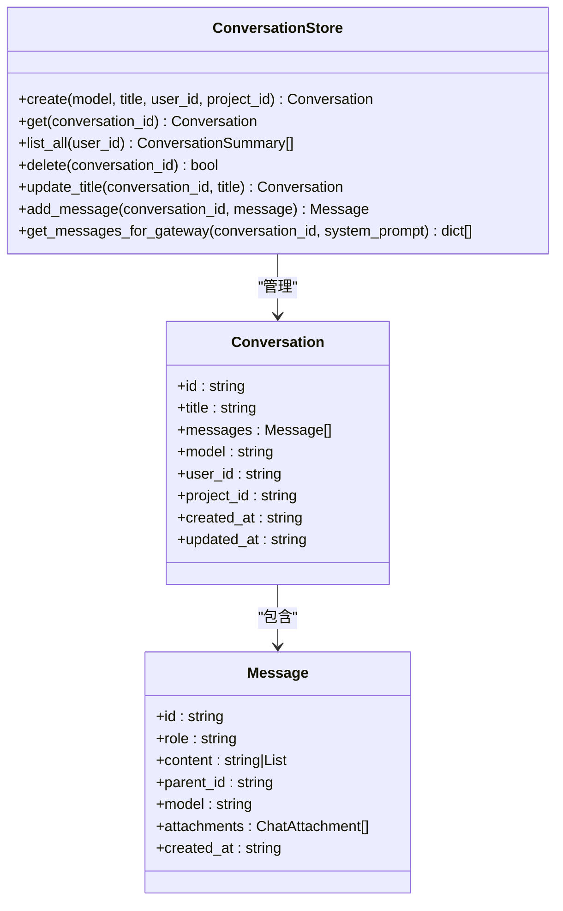
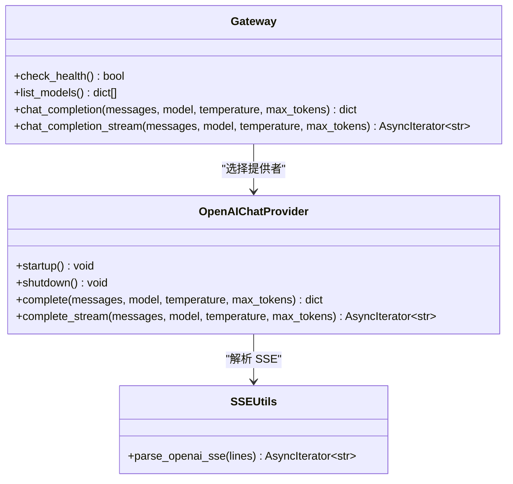
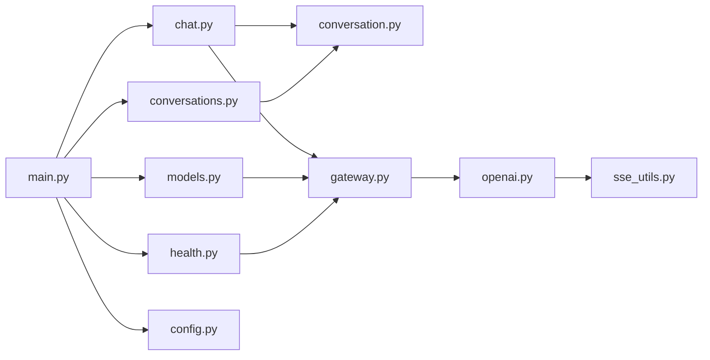

# 聊天消息API

<cite>
**本文档引用的文件**
- [apps/chat/api/routers/chat.py](file://apps/chat/api/routers/chat.py)
- [apps/chat/api/models/schemas.py](file://apps/chat/api/models/schemas.py)
- [apps/chat/api/services/gateway.py](file://apps/chat/api/services/gateway.py)
- [apps/chat/api/services/conversation.py](file://apps/chat/api/services/conversation.py)
- [apps/chat/api/services/providers/openai.py](file://apps/chat/api/services/providers/openai.py)
- [apps/chat/api/services/providers/sse_utils.py](file://apps/chat/api/services/providers/sse_utils.py)
- [apps/chat/api/config.py](file://apps/chat/api/config.py)
- [apps/chat/api/main.py](file://apps/chat/api/main.py)
- [apps/chat/api/routers/conversations.py](file://apps/chat/api/routers/conversations.py)
- [apps/chat/api/routers/health.py](file://apps/chat/api/routers/health.py)
- [apps/chat/api/routers/models.py](file://apps/chat/api/routers/models.py)
- [apps/chat/api/middleware/auth.py](file://apps/chat/api/middleware/auth.py)
- [apps/chat/web/src/api/client.ts](file://apps/chat/web/src/api/client.ts)
</cite>

## 目录
1. [简介](#简介)
2. [项目结构](#项目结构)
3. [核心组件](#核心组件)
4. [架构总览](#架构总览)
5. [详细组件分析](#详细组件分析)
6. [依赖关系分析](#依赖关系分析)
7. [性能考虑](#性能考虑)
8. [故障排除指南](#故障排除指南)
9. [结论](#结论)
10. [附录：API参考与示例](#附录api参考与示例)

## 简介
本文件为 AIBrix 聊天应用的聊天消息 API 提供完整技术文档。内容覆盖消息发送、消息历史构建、流式响应（SSE）处理、非流式响应、消息状态管理、OpenAI 兼容接口、错误处理机制等。同时提供 curl 示例与前端 SDK 使用指南，帮助开发者快速集成高效的聊天功能。

## 项目结构
后端采用 FastAPI 构建，核心模块包括：
- 路由层：负责 HTTP 接口定义与参数解析
- 服务层：会话存储、网关代理、提供者适配（OpenAI 兼容）
- 模型层：请求/响应数据结构定义
- 配置与中间件：运行时配置、CORS、认证

图表来源
- [apps/chat/api/main.py:1-87](file://apps/chat/api/main.py#L1-L87)
- [apps/chat/api/routers/chat.py:1-199](file://apps/chat/api/routers/chat.py#L1-L199)
- [apps/chat/api/routers/conversations.py:1-73](file://apps/chat/api/routers/conversations.py#L1-L73)
- [apps/chat/api/routers/models.py:1-128](file://apps/chat/api/routers/models.py#L1-L128)
- [apps/chat/api/routers/health.py:1-20](file://apps/chat/api/routers/health.py#L1-L20)
- [apps/chat/api/services/gateway.py:1-103](file://apps/chat/api/services/gateway.py#L1-L103)
- [apps/chat/api/services/conversation.py:1-124](file://apps/chat/api/services/conversation.py#L1-L124)
- [apps/chat/api/services/providers/openai.py:1-496](file://apps/chat/api/services/providers/openai.py#L1-L496)
- [apps/chat/api/services/providers/sse_utils.py:1-47](file://apps/chat/api/services/providers/sse_utils.py#L1-L47)
- [apps/chat/api/config.py:1-94](file://apps/chat/api/config.py#L1-L94)

章节来源
- [apps/chat/api/main.py:1-87](file://apps/chat/api/main.py#L1-L87)
- [apps/chat/api/config.py:1-94](file://apps/chat/api/config.py#L1-L94)

## 核心组件
- 聊天路由与流式处理：提供消息发送、系统提示注入、附件上传、SSE 流式返回、非流式一次性返回
- 会话存储：内存级会话与消息持久化，支持标题自动设置、消息历史构建
- 网关服务：统一代理到 OpenAI 兼容后端（AIBrix 网关、vLLM、OpenAI 等），并缓存模型列表
- 提供者适配：OpenAI 兼容聊天、图片、音频、视频能力；SSE 解析标准化事件
- 认证与跨域：基于 Bearer Token 的简单认证；可配置 CORS

章节来源
- [apps/chat/api/routers/chat.py:40-199](file://apps/chat/api/routers/chat.py#L40-L199)
- [apps/chat/api/services/conversation.py:10-124](file://apps/chat/api/services/conversation.py#L10-L124)
- [apps/chat/api/services/gateway.py:44-103](file://apps/chat/api/services/gateway.py#L44-L103)
- [apps/chat/api/services/providers/openai.py:61-152](file://apps/chat/api/services/providers/openai.py#L61-L152)
- [apps/chat/api/services/providers/sse_utils.py:12-47](file://apps/chat/api/services/providers/sse_utils.py#L12-L47)
- [apps/chat/api/middleware/auth.py:17-36](file://apps/chat/api/middleware/auth.py#L17-L36)

## 架构总览
下图展示从浏览器到后端再到 OpenAI 兼容服务的调用链路，以及 SSE 流式事件的生成与转发。

图表来源
- [apps/chat/api/routers/chat.py:107-161](file://apps/chat/api/routers/chat.py#L107-L161)
- [apps/chat/api/services/gateway.py:70-103](file://apps/chat/api/services/gateway.py#L70-L103)
- [apps/chat/api/services/providers/openai.py:118-151](file://apps/chat/api/services/providers/openai.py#L118-L151)
- [apps/chat/api/services/providers/sse_utils.py:12-47](file://apps/chat/api/services/providers/sse_utils.py#L12-L47)
- [apps/chat/api/services/conversation.py:64-119](file://apps/chat/api/services/conversation.py#L64-L119)

## 详细组件分析

### 聊天消息发送与流式响应
- 终端路径：POST /api/conversations/{conversation_id}/completions
- 请求方式：multipart/form-data（支持文件上传）
- 关键参数：
  - message：用户最新一条消息文本或内容块
  - model：目标模型名称
  - stream：是否启用流式返回（默认开启）
  - temperature：采样温度
  - max_tokens：最大生成长度
  - system_prompt：显式系统提示（优先于项目指令）
  - files：多文件上传（限制大小、类型判断）
- 处理流程：
  - 校验会话归属
  - 解析附件并生成预览（图片转 base64 data URL）
  - 将用户消息写入会话存储
  - 合成完整消息历史（可注入系统提示）
  - 若 stream=true：通过 EventSource 返回 SSE；否则一次性返回完整响应
- 响应：
  - 流式：事件类型 text_delta（增量文本）、done（结束）、error（异常）
  - 非流式：JSON 包含 id、conversation_id、model、message、usage

图表来源
- [apps/chat/api/routers/chat.py:40-199](file://apps/chat/api/routers/chat.py#L40-L199)
- [apps/chat/api/services/conversation.py:64-119](file://apps/chat/api/services/conversation.py#L64-L119)

章节来源
- [apps/chat/api/routers/chat.py:40-199](file://apps/chat/api/routers/chat.py#L40-L199)
- [apps/chat/api/models/schemas.py:16-97](file://apps/chat/api/models/schemas.py#L16-L97)

### 会话存储与消息历史
- ConversationStore 提供线程安全的内存存储
- 自动设置标题：当会话标题仍为默认值且存在用户消息时，取首条用户消息前 40 字作为标题
- 消息历史构建：
  - 用户消息支持纯文本或混合内容块（文本+图片）
  - 图片附件转换为 OpenAI 格式的 content 数组
  - 可选系统提示插入在最前

图表来源
- [apps/chat/api/services/conversation.py:10-124](file://apps/chat/api/services/conversation.py#L10-L124)
- [apps/chat/api/models/schemas.py:34-71](file://apps/chat/api/models/schemas.py#L34-L71)

章节来源
- [apps/chat/api/services/conversation.py:10-124](file://apps/chat/api/services/conversation.py#L10-L124)
- [apps/chat/api/models/schemas.py:34-71](file://apps/chat/api/models/schemas.py#L34-L71)

### 网关服务与提供者适配
- 网关服务：
  - 健康检查：访问 /v1/models 并判断 200
  - 模型列表：带 TTL 缓存（60 秒），失败时回退到旧缓存
  - 聊天补全：非流式与流式分别委托给具体提供者
- OpenAI 兼容提供者：
  - 聊天：构造 OpenAI 兼容 payload，支持 stream=true/false
  - SSE：使用 sse_utils 解析标准事件
  - 图片/音频/视频：按 OpenAI API 规范对接

图表来源
- [apps/chat/api/services/gateway.py:31-103](file://apps/chat/api/services/gateway.py#L31-L103)
- [apps/chat/api/services/providers/openai.py:61-152](file://apps/chat/api/services/providers/openai.py#L61-L152)
- [apps/chat/api/services/providers/sse_utils.py:12-47](file://apps/chat/api/services/providers/sse_utils.py#L12-L47)

章节来源
- [apps/chat/api/services/gateway.py:31-103](file://apps/chat/api/services/gateway.py#L31-L103)
- [apps/chat/api/services/providers/openai.py:61-152](file://apps/chat/api/services/providers/openai.py#L61-L152)
- [apps/chat/api/services/providers/sse_utils.py:12-47](file://apps/chat/api/services/providers/sse_utils.py#L12-L47)

### 认证与跨域
- 认证中间件：
  - auth_mode="none"：默认用户，无需鉴权
  - auth_mode="simple"：从 Authorization: Bearer 提取令牌并查询用户
- CORS：允许指定来源、方法与头部

章节来源
- [apps/chat/api/middleware/auth.py:17-36](file://apps/chat/api/middleware/auth.py#L17-L36)
- [apps/chat/api/main.py:52-60](file://apps/chat/api/main.py#L52-L60)

## 依赖关系分析
- 路由依赖：
  - chat.py 依赖 conversation 存储与 gateway 服务
  - conversations.py 依赖 conversation 存储
  - models.py 依赖 gateway 列表
  - health.py 依赖 gateway 健康检查
- 服务依赖：
  - gateway 依赖 provider 选择器与 httpx 客户端
  - OpenAI 适配器依赖 httpx 与 SSE 工具
- 配置依赖：
  - 所有服务读取 settings（网关地址、API Key、各能力提供者 URL/Key）

图表来源
- [apps/chat/api/routers/chat.py:14-17](file://apps/chat/api/routers/chat.py#L14-L17)
- [apps/chat/api/routers/conversations.py:7-8](file://apps/chat/api/routers/conversations.py#L7-L8)
- [apps/chat/api/routers/models.py:8-9](file://apps/chat/api/routers/models.py#L8-L9)
- [apps/chat/api/routers/health.py:7](file://apps/chat/api/routers/health.py#L7)
- [apps/chat/api/services/gateway.py:14-15](file://apps/chat/api/services/gateway.py#L14-L15)
- [apps/chat/api/services/providers/openai.py:18-23](file://apps/chat/api/services/providers/openai.py#L18-L23)
- [apps/chat/api/main.py:12-18](file://apps/chat/api/main.py#L12-L18)
- [apps/chat/api/config.py:4-94](file://apps/chat/api/config.py#L4-L94)

章节来源
- [apps/chat/api/main.py:12-18](file://apps/chat/api/main.py#L12-L18)
- [apps/chat/api/config.py:4-94](file://apps/chat/api/config.py#L4-L94)

## 性能考虑
- 连接池与生命周期：应用启动时初始化提供者连接池，关闭时释放
- 模型列表缓存：60 秒 TTL，降低对后端的频繁请求
- SSE 流式传输：边到边输出，减少前端等待时间
- 文件上传限制：单文件大小上限避免过大负载
- 并发与超时：提供者 httpx 客户端配置了连接/读/写/池限制与超时

章节来源
- [apps/chat/api/main.py:21-35](file://apps/chat/api/main.py#L21-L35)
- [apps/chat/api/services/gateway.py:17-20](file://apps/chat/api/services/gateway.py#L17-L20)
- [apps/chat/api/routers/chat.py:64-68](file://apps/chat/api/routers/chat.py#L64-L68)
- [apps/chat/api/services/providers/openai.py:67-72](file://apps/chat/api/services/providers/openai.py#L67-L72)

## 故障排除指南
- 401 未认证：检查 Authorization 头是否为 Bearer Token，或确认 auth_mode 设置
- 404 会话不存在：确认 conversation_id 是否正确且属于当前用户
- 413 文件过大：单文件超过 20MB 会被拒绝
- 502 网关错误：上游 OpenAI 兼容服务返回非 200，需检查网关地址与 API Key
- SSE 错误事件：后端捕获上游异常并以 event="error" 发送，前端回调 onError

章节来源
- [apps/chat/api/middleware/auth.py:26-35](file://apps/chat/api/middleware/auth.py#L26-L35)
- [apps/chat/api/routers/chat.py:58-60](file://apps/chat/api/routers/chat.py#L58-L60)
- [apps/chat/api/routers/chat.py:67-68](file://apps/chat/api/routers/chat.py#L67-L68)
- [apps/chat/api/routers/chat.py:149-152](file://apps/chat/api/routers/chat.py#L149-L152)
- [apps/chat/api/routers/chat.py:196-198](file://apps/chat/api/routers/chat.py#L196-L198)

## 结论
该聊天消息 API 通过清晰的路由分层、可插拔的提供者适配与 SSE 流式传输，实现了与 OpenAI 兼容的聊天体验，并提供了会话管理、模型发现、健康检查等配套能力。结合前端 SDK 与 curl 示例，开发者可以快速集成端到端的聊天功能。

## 附录：API参考与示例

### 聊天消息发送（流式与非流式）
- 方法与路径
  - POST /api/conversations/{conversation_id}/completions
- 内容类型
  - multipart/form-data
- 表单字段
  - message: 字符串或内容块数组
  - model: 目标模型名称
  - stream: 布尔值，默认 true
  - temperature: 浮点数，默认 0.7
  - max_tokens: 整数，默认 2048
  - system_prompt: 可选系统提示
  - files: 多个文件（图片优先，自动 base64 预览）
- 成功响应
  - 流式：SSE 事件，事件类型 text_delta/done/error
  - 非流式：JSON 对象，包含 id、conversation_id、model、message、usage
- 错误码
  - 401 未认证
  - 404 会话不存在或无权限
  - 413 文件过大
  - 502 网关错误

章节来源
- [apps/chat/api/routers/chat.py:40-199](file://apps/chat/api/routers/chat.py#L40-L199)
- [apps/chat/api/models/schemas.py:76-97](file://apps/chat/api/models/schemas.py#L76-L97)

### 会话管理
- 创建会话
  - POST /api/conversations
  - 请求体：{ model, title, project_id }
  - 响应：Conversation
- 列出会话
  - GET /api/conversations
  - 响应：List<ConversationSummary>
- 获取会话详情
  - GET /api/conversations/{conversation_id}
- 更新会话标题
  - PATCH /api/conversations/{conversation_id}
  - 请求体：{ title }
- 删除会话
  - DELETE /api/conversations/{conversation_id}

章节来源
- [apps/chat/api/routers/conversations.py:23-73](file://apps/chat/api/routers/conversations.py#L23-L73)

### 模型发现
- GET /api/models
  - 查询参数：capability（text/image/audio/video）
  - 响应：ModelListResponse
  - 特性：根据模型 ID 模式推断能力；支持全局/按能力白名单过滤

章节来源
- [apps/chat/api/routers/models.py:92-128](file://apps/chat/api/routers/models.py#L92-L128)

### 健康检查
- GET /api/health
  - 响应：HealthResponse（包含版本与网关可达性）

章节来源
- [apps/chat/api/routers/health.py:12-19](file://apps/chat/api/routers/health.py#L12-L19)

### 配置项（关键）
- 网关与密钥
  - aibrix_gateway_url：默认网关地址
  - api_key：通用 API Key
  - chat_api_url/chat_api_key：聊天能力独立覆盖
- 跨域
  - cors_origins：逗号分隔的允许来源
- 认证
  - auth_mode：none/simple
- 模型过滤
  - models_allowlist、text/image/audio/video_models_allowlist

章节来源
- [apps/chat/api/config.py:4-94](file://apps/chat/api/config.py#L4-L94)

### curl 示例
- 创建会话
  - curl -X POST "$BASE/api/conversations" -H "Authorization: Bearer $TOKEN" -H "Content-Type: application/json" -d '{"model":"gpt-4","title":"我的会话"}'
- 发送消息（流式）
  - curl -N -X POST "$BASE/api/conversations/$CONV_ID/completions" -H "Authorization: Bearer $TOKEN" -F "message=你好" -F "model=gpt-4" -F "stream=true"
- 发送消息（非流式）
  - curl -X POST "$BASE/api/conversations/$CONV_ID/completions" -H "Authorization: Bearer $TOKEN" -F "message=你好" -F "model=gpt-4" -F "stream=false"
- 获取模型列表
  - curl "$BASE/api/models?capability=text" -H "Authorization: Bearer $TOKEN"

### 前端 SDK 使用要点
- 认证头：本地存储 token，自动附加 Authorization: Bearer
- 流式回调：onDelta、onDone、onError
- 上传附件：使用 FormData，files 字段追加多个 File
- 会话操作：创建/列出/获取/重命名/删除

章节来源
- [apps/chat/web/src/api/client.ts:13-35](file://apps/chat/web/src/api/client.ts#L13-L35)
- [apps/chat/web/src/api/client.ts:196-281](file://apps/chat/web/src/api/client.ts#L196-L281)