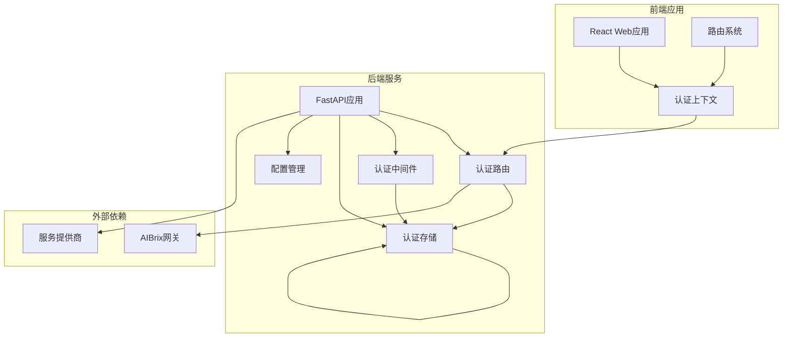
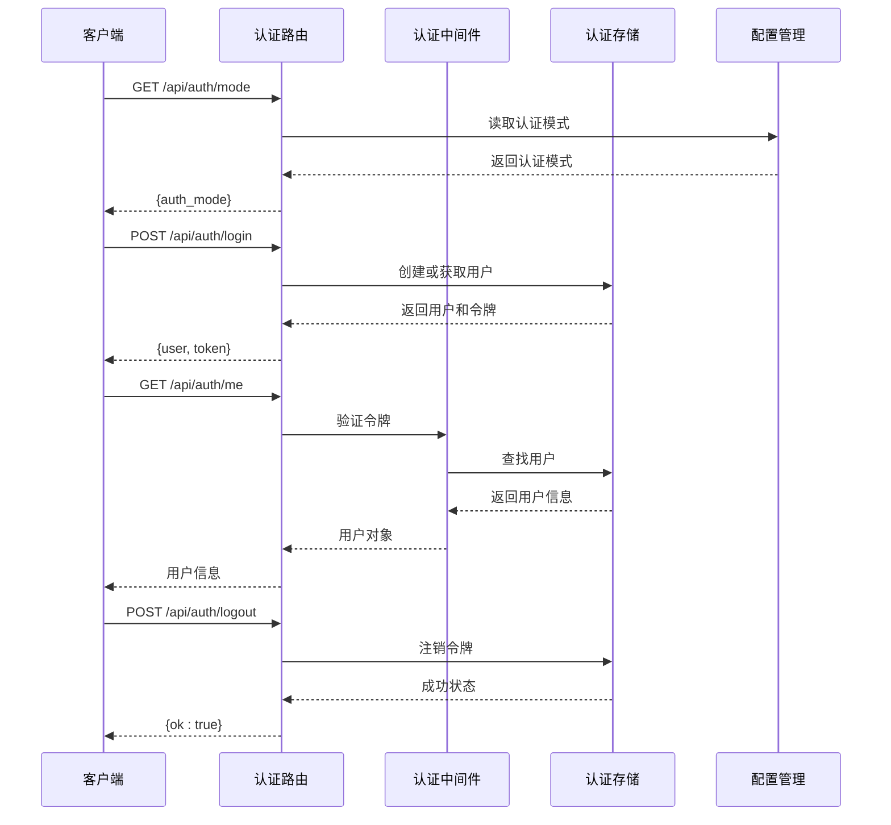
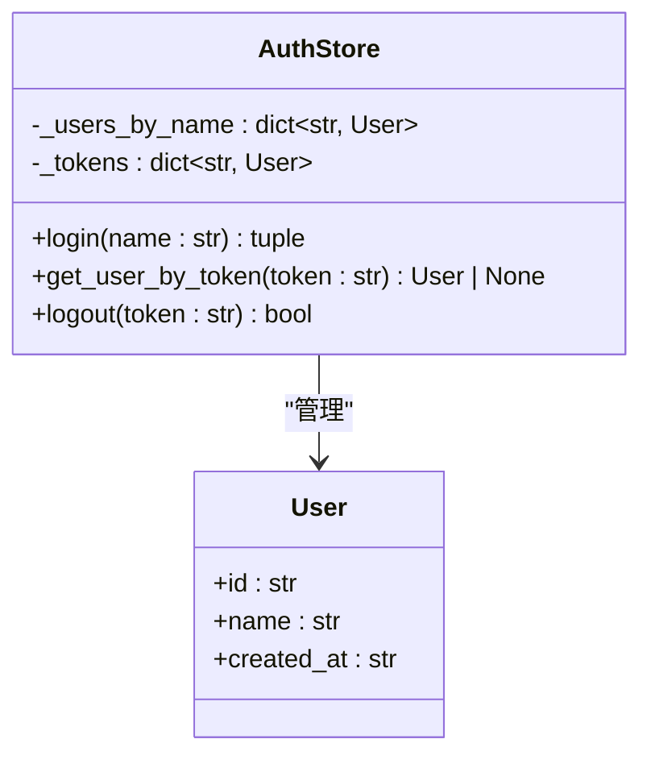
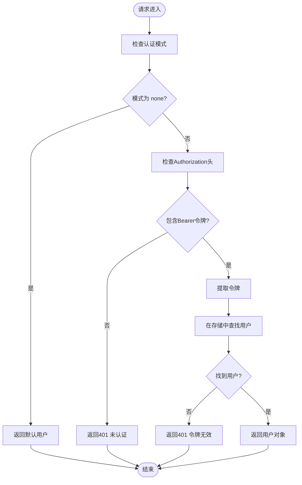
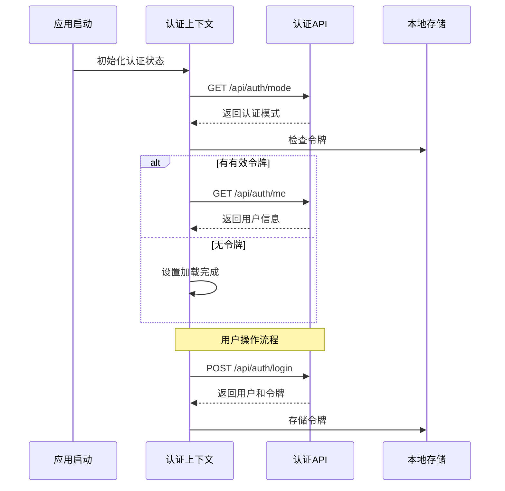
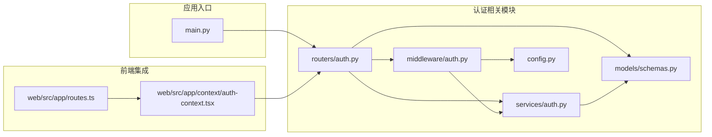

# 认证管理API

<cite>
**本文档引用的文件**
- [apps/chat/api/routers/auth.py](file://apps/chat/api/routers/auth.py)
- [apps/chat/api/models/schemas.py](file://apps/chat/api/models/schemas.py)
- [apps/chat/api/services/auth.py](file://apps/chat/api/services/auth.py)
- [apps/chat/api/middleware/auth.py](file://apps/chat/api/middleware/auth.py)
- [apps/chat/api/config.py](file://apps/chat/api/config.py)
- [apps/chat/api/main.py](file://apps/chat/api/main.py)
- [apps/chat/web/src/app/context/auth-context.tsx](file://apps/chat/web/src/app/context/auth-context.tsx)
- [apps/chat/web/src/app/routes.ts](file://apps/chat/web/src/app/routes.ts)
</cite>

## 目录
1. [简介](#简介)
2. [项目结构](#项目结构)
3. [核心组件](#核心组件)
4. [架构概览](#架构概览)
5. [详细组件分析](#详细组件分析)
6. [依赖关系分析](#依赖关系分析)
7. [性能考虑](#性能考虑)
8. [故障排除指南](#故障排除指南)
9. [结论](#结论)
10. [附录](#附录)

## 简介
本文件为AIBrix聊天应用的认证管理API提供完整的技术文档。该系统采用基于Bearer Token的简单认证模式，支持用户注册式登录、会话管理和基本的权限验证。文档涵盖所有认证相关HTTP端点的详细规范、数据模型、错误处理以及前端集成指南。

## 项目结构
AIBrix聊天应用采用前后端分离架构，认证功能主要由后端FastAPI服务提供，前端React应用通过HTTP接口进行交互。



**图表来源**
- [apps/chat/api/main.py:37-50](file://apps/chat/api/main.py#L37-L50)
- [apps/chat/api/routers/auth.py:12](file://apps/chat/api/routers/auth.py#L12)
- [apps/chat/api/middleware/auth.py:17](file://apps/chat/api/middleware/auth.py#L17)

**章节来源**
- [apps/chat/api/main.py:11-71](file://apps/chat/api/main.py#L11-L71)
- [apps/chat/api/config.py:48-49](file://apps/chat/api/config.py#L48-L49)

## 核心组件
认证系统由四个核心组件构成：认证路由、认证存储、认证中间件和配置管理。

### 认证路由层
负责暴露REST API端点，处理HTTP请求和响应。

### 认证存储层
提供内存中的用户和令牌存储，支持用户注册、令牌验证和会话管理。

### 认证中间件层
实现请求级别的身份验证逻辑，支持多种认证模式。

### 配置管理层
集中管理应用配置，包括认证模式设置。

**章节来源**
- [apps/chat/api/routers/auth.py:1-41](file://apps/chat/api/routers/auth.py#L1-L41)
- [apps/chat/api/services/auth.py:10-38](file://apps/chat/api/services/auth.py#L10-L38)
- [apps/chat/api/middleware/auth.py:17-35](file://apps/chat/api/middleware/auth.py#L17-L35)
- [apps/chat/api/config.py:48-49](file://apps/chat/api/config.py#L48-L49)

## 架构概览
认证系统采用分层架构设计，确保职责分离和可维护性。



**图表来源**
- [apps/chat/api/routers/auth.py:15-41](file://apps/chat/api/routers/auth.py#L15-L41)
- [apps/chat/api/middleware/auth.py:17-35](file://apps/chat/api/middleware/auth.py#L17-L35)
- [apps/chat/api/services/auth.py:17-34](file://apps/chat/api/services/auth.py#L17-L34)

## 详细组件分析

### 认证路由API规范

#### 获取认证模式
- **方法**: GET
- **路径**: `/api/auth/mode`
- **描述**: 返回当前系统的认证模式配置
- **响应**: `{ "auth_mode": "none" | "simple" }`
- **状态码**: 200 成功

#### 用户登录
- **方法**: POST
- **路径**: `/api/auth/login`
- **请求体**: `{ "name": string }`
- **响应**: `{ "user": User, "token": string }`
- **状态码**: 
  - 200 登录成功
  - 400 请求参数无效

#### 获取当前用户
- **方法**: GET
- **路径**: `/api/auth/me`
- **认证**: Bearer Token
- **响应**: `User` 对象
- **状态码**:
  - 200 成功
  - 401 未认证或令牌无效

#### 用户登出
- **方法**: POST
- **路径**: `/api/auth/logout`
- **认证**: Bearer Token
- **响应**: `{ "ok": true }`
- **状态码**: 200 成功

**章节来源**
- [apps/chat/api/routers/auth.py:15-41](file://apps/chat/api/routers/auth.py#L15-L41)

### 数据模型定义

#### User 模型
- **字段**:
  - `id`: string - 用户唯一标识符
  - `name`: string - 用户名称
  - `created_at`: string - ISO 8601格式创建时间

#### LoginRequest 模型
- **字段**:
  - `name`: string - 用户名称（必填）

#### LoginResponse 模型
- **字段**:
  - `user`: User - 用户对象
  - `token`: string - 认证令牌

**章节来源**
- [apps/chat/api/models/schemas.py:210-223](file://apps/chat/api/models/schemas.py#L210-L223)

### 认证存储实现

认证存储采用内存数据结构实现：



**图表来源**
- [apps/chat/api/services/auth.py:10-38](file://apps/chat/api/services/auth.py#L10-L38)
- [apps/chat/api/models/schemas.py:210-214](file://apps/chat/api/models/schemas.py#L210-L214)

**章节来源**
- [apps/chat/api/services/auth.py:17-34](file://apps/chat/api/services/auth.py#L17-L34)

### 认证中间件逻辑

认证中间件实现多模式认证支持：



**图表来源**
- [apps/chat/api/middleware/auth.py:17-35](file://apps/chat/api/middleware/auth.py#L17-L35)

**章节来源**
- [apps/chat/api/middleware/auth.py:17-35](file://apps/chat/api/middleware/auth.py#L17-L35)

### 前端集成指南

前端使用React Context管理认证状态：



**图表来源**
- [apps/chat/web/src/app/context/auth-context.tsx:22-88](file://apps/chat/web/src/app/context/auth-context.tsx#L22-L88)

**章节来源**
- [apps/chat/web/src/app/context/auth-context.tsx:90-114](file://apps/chat/web/src/app/context/auth-context.tsx#L90-L114)

## 依赖关系分析



**图表来源**
- [apps/chat/api/main.py:12](file://apps/chat/api/main.py#L12)
- [apps/chat/api/routers/auth.py:8](file://apps/chat/api/routers/auth.py#L8)
- [apps/chat/api/middleware/auth.py:8](file://apps/chat/api/middleware/auth.py#L8)

**章节来源**
- [apps/chat/api/main.py:12](file://apps/chat/api/main.py#L12)
- [apps/chat/api/routers/auth.py:8](file://apps/chat/api/routers/auth.py#L8)

## 性能考虑
- **内存存储**: 当前实现使用内存存储，适合开发和测试环境
- **令牌管理**: 支持即时令牌验证，无过期机制
- **并发处理**: FastAPI异步处理，支持高并发请求
- **CORS配置**: 已配置允许的跨域来源和头部

## 故障排除指南

### 常见问题及解决方案

#### 401 未认证错误
- **原因**: 缺少Authorization头或令牌格式不正确
- **解决方案**: 确保请求头格式为`Authorization: Bearer <token>`

#### 401 令牌无效
- **原因**: 令牌不存在或已过期
- **解决方案**: 重新登录获取新令牌

#### 400 请求参数错误
- **原因**: 登录请求缺少name字段
- **解决方案**: 确保请求体包含有效的name字段

#### 跨域问题
- **原因**: CORS配置不正确
- **解决方案**: 检查`cors_origins`配置项

**章节来源**
- [apps/chat/api/middleware/auth.py:26-33](file://apps/chat/api/middleware/auth.py#L26-L33)
- [apps/chat/api/routers/auth.py:24](file://apps/chat/api/routers/auth.py#L24)

## 结论
AIBrix聊天应用的认证管理系统提供了简洁高效的用户认证解决方案。系统采用分层架构设计，支持灵活的认证模式配置，并通过清晰的API接口和数据模型实现了良好的可扩展性。当前实现适合开发和测试场景，生产环境建议考虑持久化存储和令牌过期机制。

## 附录

### curl 使用示例

#### 获取认证模式
```bash
curl -X GET http://localhost:8000/api/auth/mode
```

#### 用户登录
```bash
curl -X POST http://localhost:8000/api/auth/login \
  -H "Content-Type: application/json" \
  -d '{"name":"john_doe"}'
```

#### 获取当前用户
```bash
curl -X GET http://localhost:8000/api/auth/me \
  -H "Authorization: Bearer YOUR_TOKEN_HERE"
```

#### 用户登出
```bash
curl -X POST http://localhost:8000/api/auth/logout \
  -H "Authorization: Bearer YOUR_TOKEN_HERE"
```

### SDK使用指南

#### JavaScript/TypeScript
```typescript
// 获取认证模式
const mode = await fetch('/api/auth/mode').then(r => r.json());

// 用户登录
const login = async (name: string) => {
  const response = await fetch('/api/auth/login', {
    method: 'POST',
    headers: { 'Content-Type': 'application/json' },
    body: JSON.stringify({ name })
  });
  return response.json();
};

// 获取当前用户
const getCurrentUser = async (token: string) => {
  const response = await fetch('/api/auth/me', {
    headers: { Authorization: `Bearer ${token}` }
  });
  return response.json();
};
```

**章节来源**
- [apps/chat/web/src/app/context/auth-context.tsx:90-114](file://apps/chat/web/src/app/context/auth-context.tsx#L90-L114)