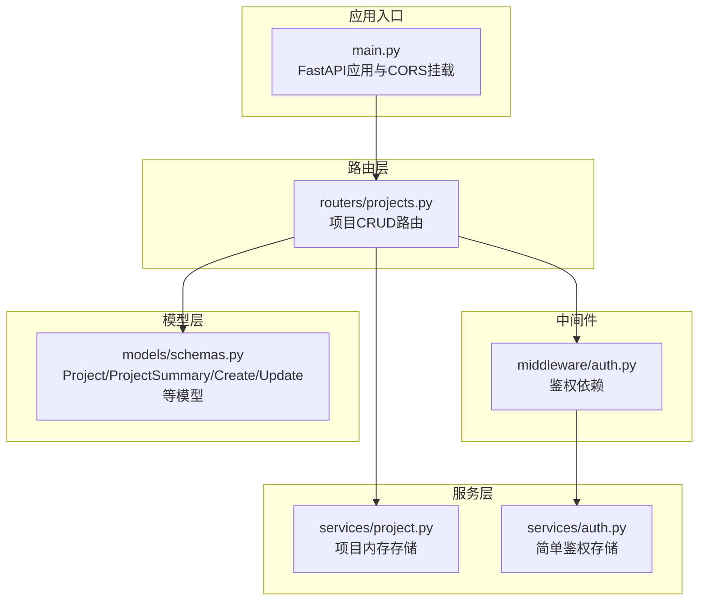
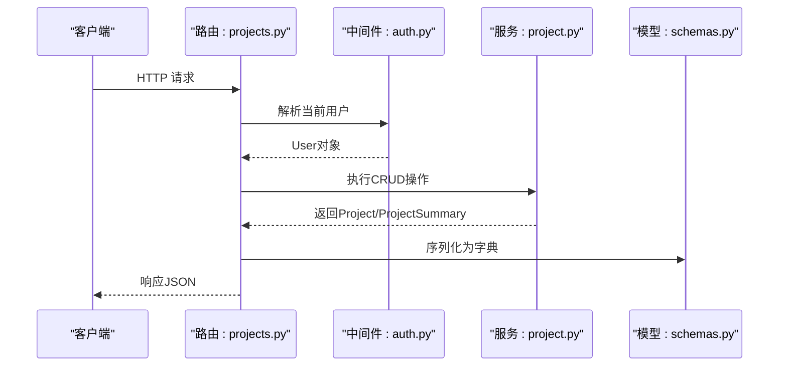
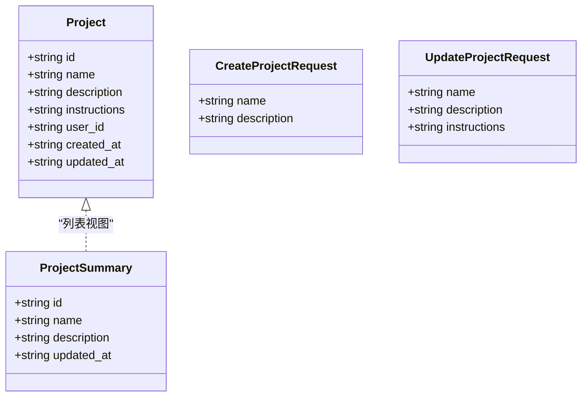
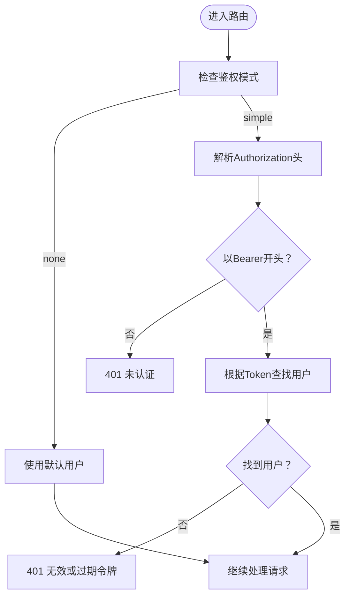
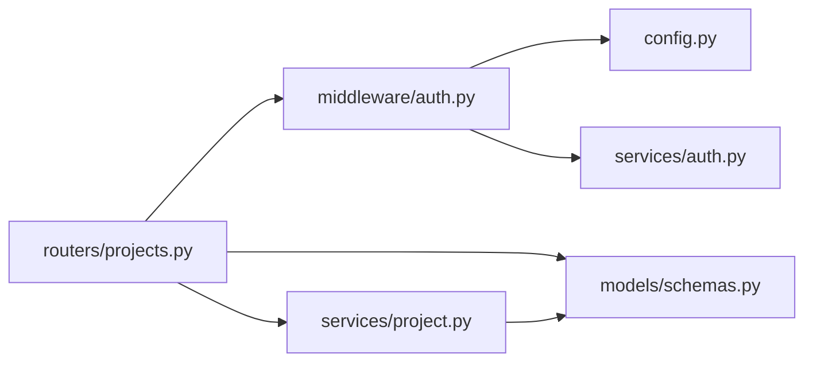

# 项目管理API

<cite>
**本文档引用的文件**
- [apps/chat/api/routers/projects.py](file://apps/chat/api/routers/projects.py)
- [apps/chat/api/services/project.py](file://apps/chat/api/services/project.py)
- [apps/chat/api/models/schemas.py](file://apps/chat/api/models/schemas.py)
- [apps/chat/api/middleware/auth.py](file://apps/chat/api/middleware/auth.py)
- [apps/chat/api/main.py](file://apps/chat/api/main.py)
- [apps/chat/api/config.py](file://apps/chat/api/config.py)
- [apps/chat/api/services/auth.py](file://apps/chat/api/services/auth.py)
</cite>

## 目录
1. [简介](#简介)
2. [项目结构](#项目结构)
3. [核心组件](#核心组件)
4. [架构总览](#架构总览)
5. [详细组件分析](#详细组件分析)
6. [依赖关系分析](#依赖关系分析)
7. [性能考虑](#性能考虑)
8. [故障排除指南](#故障排除指南)
9. [结论](#结论)
10. [附录](#附录)

## 简介
本文件面向AIBrix聊天应用的“项目管理API”，系统性梳理并说明项目CRUD（创建、查询、更新、删除）相关HTTP端点，涵盖：
- 创建项目
- 获取项目列表
- 获取指定项目详情
- 更新项目信息
- 删除项目

同时，文档对权限控制机制、项目数据模型、请求/响应格式、状态码约定进行完整说明，并提供curl示例与SDK调用建议，帮助开发者正确管理项目资源。

## 项目结构
项目管理API位于聊天应用后端服务中，采用FastAPI框架构建，遵循“路由-中间件-服务-模型”的分层组织方式：
- 路由层：定义REST接口与路径规则
- 中间件：鉴权依赖解析当前用户
- 服务层：封装业务逻辑与数据存储
- 模型层：定义请求/响应数据结构

图表来源
- [apps/chat/api/main.py:62-71](file://apps/chat/api/main.py#L62-L71)
- [apps/chat/api/routers/projects.py:11](file://apps/chat/api/routers/projects.py#L11)
- [apps/chat/api/middleware/auth.py:17-35](file://apps/chat/api/middleware/auth.py#L17-L35)
- [apps/chat/api/services/project.py:10-86](file://apps/chat/api/services/project.py#L10-L86)
- [apps/chat/api/services/auth.py:10-37](file://apps/chat/api/services/auth.py#L10-L37)
- [apps/chat/api/models/schemas.py:175-205](file://apps/chat/api/models/schemas.py#L175-L205)

章节来源
- [apps/chat/api/main.py:37-71](file://apps/chat/api/main.py#L37-L71)
- [apps/chat/api/routers/projects.py:11](file://apps/chat/api/routers/projects.py#L11)

## 核心组件
- 项目路由模块：提供项目CRUD端点，统一前缀为/api/projects
- 鉴权中间件：根据配置决定是否启用鉴权；在非鉴权模式下返回默认用户
- 项目服务：基于内存字典的线程安全项目存储，支持创建、查询、列表、更新、删除
- 数据模型：定义Project、ProjectSummary、CreateProjectRequest、UpdateProjectRequest等

章节来源
- [apps/chat/api/routers/projects.py:14-70](file://apps/chat/api/routers/projects.py#L14-L70)
- [apps/chat/api/middleware/auth.py:17-35](file://apps/chat/api/middleware/auth.py#L17-L35)
- [apps/chat/api/services/project.py:10-86](file://apps/chat/api/services/project.py#L10-L86)
- [apps/chat/api/models/schemas.py:175-205](file://apps/chat/api/models/schemas.py#L175-L205)

## 架构总览
项目管理API的调用链路如下：
- 客户端通过HTTP请求访问路由层
- 路由层依赖中间件解析当前用户
- 路由层调用项目服务执行业务逻辑
- 服务层返回模型化的数据结构

图表来源
- [apps/chat/api/routers/projects.py:14-70](file://apps/chat/api/routers/projects.py#L14-L70)
- [apps/chat/api/middleware/auth.py:17-35](file://apps/chat/api/middleware/auth.py#L17-L35)
- [apps/chat/api/services/project.py:38-82](file://apps/chat/api/services/project.py#L38-L82)
- [apps/chat/api/models/schemas.py:175-205](file://apps/chat/api/models/schemas.py#L175-L205)

## 详细组件分析

### 项目数据模型
- Project：完整项目实体，包含标识、名称、描述、指令、所属用户ID、创建/更新时间戳
- ProjectSummary：列表视图，包含标识、名称、描述、更新时间
- CreateProjectRequest：创建请求体，包含名称与可选描述
- UpdateProjectRequest：更新请求体，包含可选名称、描述、指令

图表来源
- [apps/chat/api/models/schemas.py:175-205](file://apps/chat/api/models/schemas.py#L175-L205)

章节来源
- [apps/chat/api/models/schemas.py:175-205](file://apps/chat/api/models/schemas.py#L175-L205)

### 权限与鉴权机制
- 鉴权模式由配置项控制，默认为“无鉴权”
- 当启用鉴权时，要求请求头携带Bearer Token；服务端从内存存储中查找对应用户
- 未启用鉴权时，返回默认用户，且项目列表不按用户过滤（便于演示）

图表来源
- [apps/chat/api/middleware/auth.py:23-35](file://apps/chat/api/middleware/auth.py#L23-L35)
- [apps/chat/api/config.py:48-50](file://apps/chat/api/config.py#L48-L50)

章节来源
- [apps/chat/api/middleware/auth.py:17-35](file://apps/chat/api/middleware/auth.py#L17-L35)
- [apps/chat/api/config.py:48-50](file://apps/chat/api/config.py#L48-L50)

### 项目CRUD端点定义

- 基础路径
  - 前缀：/api/projects
  - 标签：projects

- 创建项目
  - 方法：POST
  - 路径：/api/projects
  - 认证：需要当前用户（取决于鉴权模式）
  - 请求体：CreateProjectRequest
    - name: 字符串，必填
    - description: 字符串，可选
  - 成功响应：Project（JSON）
  - 状态码：201 Created（注：实际代码返回200，见下方“状态码说明”）
  - 错误：401 未认证（当启用鉴权且令牌无效时）

- 获取项目列表
  - 方法：GET
  - 路径：/api/projects
  - 认证：需要当前用户
  - 查询参数：无
  - 成功响应：ProjectSummary数组（按更新时间倒序）
  - 状态码：200 OK

- 获取指定项目详情
  - 方法：GET
  - 路径：/api/projects/{project_id}
  - 认证：需要当前用户
  - 成功响应：Project（JSON）
  - 状态码：200 OK
  - 错误：404 未找到（当项目不存在或不属于当前用户时）

- 更新项目
  - 方法：PATCH
  - 路径：/api/projects/{project_id}
  - 认证：需要当前用户
  - 请求体：UpdateProjectRequest
    - name: 字符串，可选
    - description: 字符串，可选
    - instructions: 字符串，可选
  - 成功响应：Project（JSON）
  - 状态码：200 OK
  - 错误：404 未找到（当项目不存在或不属于当前用户时）

- 删除项目
  - 方法：DELETE
  - 路径：/api/projects/{project_id}
  - 认证：需要当前用户
  - 成功响应：{"ok": true}
  - 状态码：200 OK
  - 错误：404 未找到（当项目不存在或不属于当前用户时）

- 状态码说明
  - 200 OK：成功（更新、删除、获取详情、获取列表）
  - 201 Created：创建成功（注：当前实现返回200，详见“实现细节”）
  - 401 未认证：未提供有效Bearer令牌（启用鉴权时）
  - 404 未找到：资源不存在或越权访问

实现细节与注意事项
- 路由层在获取/更新/删除项目时，会校验项目是否存在以及是否属于当前用户；若不匹配则抛出404
- 列表接口会按updated_at降序排列
- 更新接口仅更新传入的非空字段，并更新updated_at

章节来源
- [apps/chat/api/routers/projects.py:14-70](file://apps/chat/api/routers/projects.py#L14-L70)
- [apps/chat/api/services/project.py:46-82](file://apps/chat/api/services/project.py#L46-L82)
- [apps/chat/api/models/schemas.py:175-205](file://apps/chat/api/models/schemas.py#L175-L205)

### 请求与响应格式

- 请求体（JSON）
  - 创建项目：name, description（可选）
  - 更新项目：name（可选）、description（可选）、instructions（可选）

- 响应体（JSON）
  - 项目详情：包含id、name、description、instructions、user_id、created_at、updated_at
  - 项目列表：包含id、name、description、updated_at（数组）
  - 删除响应：{"ok": true}

- 错误响应（JSON）
  - 包含错误码、消息与HTTP状态码

章节来源
- [apps/chat/api/models/schemas.py:175-205](file://apps/chat/api/models/schemas.py#L175-L205)
- [apps/chat/api/models/schemas.py:237-245](file://apps/chat/api/models/schemas.py#L237-L245)

### curl示例
以下示例假设服务运行在本地端口8000，且鉴权模式为“无鉴权”。如需启用鉴权，请在请求头添加Authorization: Bearer <token>。

- 创建项目
  - curl -X POST http://localhost:8000/api/projects -H "Content-Type: application/json" -d '{"name":"My Project","description":"A demo project"}'

- 获取项目列表
  - curl http://localhost:8000/api/projects

- 获取指定项目详情
  - curl http://localhost:8000/api/projects/<project_id>

- 更新项目
  - curl -X PATCH http://localhost:8000/api/projects/<project_id> -H "Content-Type: application/json" -d '{"name":"Updated Name","description":"Updated desc"}'

- 删除项目
  - curl -X DELETE http://localhost:8000/api/projects/<project_id>

注意
- 将<project_id>替换为实际项目ID
- 若启用鉴权，需在请求头添加Authorization: Bearer <token>

章节来源
- [apps/chat/api/routers/projects.py:14-70](file://apps/chat/api/routers/projects.py#L14-L70)

### SDK使用指南（Python）
- 使用httpx或requests发送HTTP请求
- 设置Content-Type: application/json
- 如启用鉴权，在请求头添加Authorization: Bearer <token>
- 解析响应为JSON并映射到Project/ProjectSummary模型

章节来源
- [apps/chat/api/requirements.txt:1-8](file://apps/chat/api/requirements.txt#L1-L8)

## 依赖关系分析
- 路由依赖中间件解析用户
- 路由调用项目服务执行业务
- 服务依赖模型层的数据结构
- 中间件依赖配置与鉴权存储

图表来源
- [apps/chat/api/routers/projects.py:7-9](file://apps/chat/api/routers/projects.py#L7-L9)
- [apps/chat/api/middleware/auth.py:7-9](file://apps/chat/api/middleware/auth.py#L7-L9)
- [apps/chat/api/services/project.py:7](file://apps/chat/api/services/project.py#L7)
- [apps/chat/api/config.py:48-50](file://apps/chat/api/config.py#L48-L50)
- [apps/chat/api/services/auth.py:10-37](file://apps/chat/api/services/auth.py#L10-L37)
- [apps/chat/api/models/schemas.py:175-205](file://apps/chat/api/models/schemas.py#L175-L205)

章节来源
- [apps/chat/api/main.py:62-71](file://apps/chat/api/main.py#L62-L71)
- [apps/chat/api/routers/projects.py:7-9](file://apps/chat/api/routers/projects.py#L7-L9)
- [apps/chat/api/middleware/auth.py:7-9](file://apps/chat/api/middleware/auth.py#L7-L9)
- [apps/chat/api/services/project.py:7](file://apps/chat/api/services/project.py#L7)
- [apps/chat/api/services/auth.py:10-37](file://apps/chat/api/services/auth.py#L10-L37)
- [apps/chat/api/models/schemas.py:175-205](file://apps/chat/api/models/schemas.py#L175-L205)

## 性能考虑
- 存储层为内存字典，适合开发与演示场景；生产环境建议持久化存储
- 列表接口对所有项目进行过滤与排序，复杂度O(n log n)，其中n为项目数量
- 更新接口仅更新传入字段并刷新时间戳，避免不必要的写放大
- 鉴权中间件为内存查找，延迟极低

## 故障排除指南
- 401 未认证
  - 检查是否启用了鉴权模式
  - 确认Authorization头格式为Bearer <token>
  - 验证令牌是否存在于内存存储中
- 404 未找到
  - 确认project_id是否正确
  - 在启用鉴权时，确认项目归属当前用户
- CORS问题
  - 检查CORS允许的源是否包含前端地址
- 版本与文档
  - 可通过/api/docs或/api/redoc查看OpenAPI文档

章节来源
- [apps/chat/api/middleware/auth.py:23-35](file://apps/chat/api/middleware/auth.py#L23-L35)
- [apps/chat/api/main.py:52-60](file://apps/chat/api/main.py#L52-L60)
- [apps/chat/api/main.py:42-49](file://apps/chat/api/main.py#L42-L49)

## 结论
项目管理API提供了完整的项目CRUD能力，结合灵活的鉴权配置与清晰的数据模型，满足从开发到生产的多种需求。建议在生产环境中替换内存存储为持久化方案，并完善权限控制与审计日志。

## 附录

### 端点一览表
- POST /api/projects
  - 请求体：CreateProjectRequest
  - 响应：Project
  - 状态码：200 OK（当前实现），预期201 Created
- GET /api/projects
  - 响应：ProjectSummary[]
  - 状态码：200 OK
- GET /api/projects/{project_id}
  - 响应：Project
  - 状态码：200 OK，404 未找到
- PATCH /api/projects/{project_id}
  - 请求体：UpdateProjectRequest
  - 响应：Project
  - 状态码：200 OK，404 未找到
- DELETE /api/projects/{project_id}
  - 响应：{"ok": true}
  - 状态码：200 OK，404 未找到

章节来源
- [apps/chat/api/routers/projects.py:14-70](file://apps/chat/api/routers/projects.py#L14-L70)