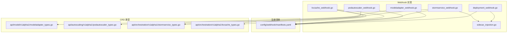
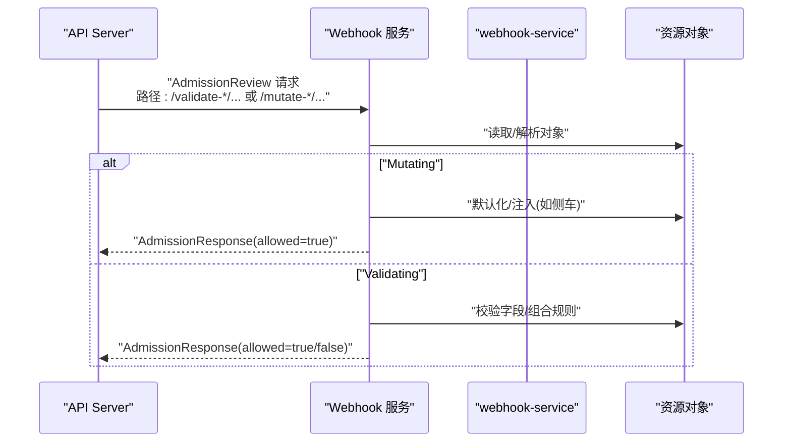
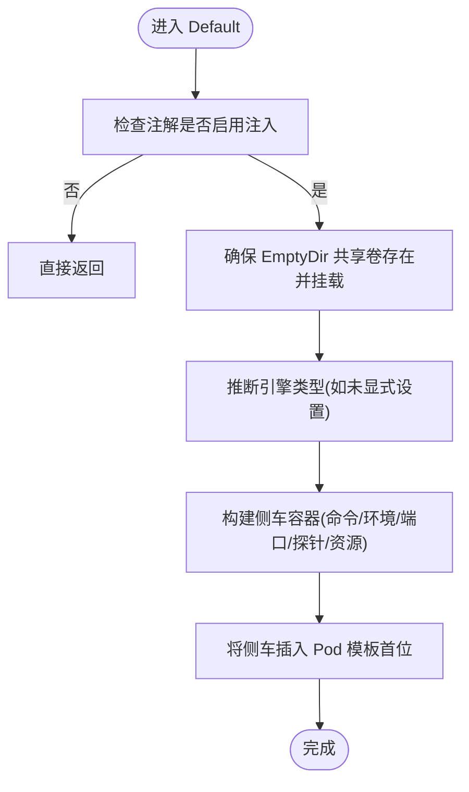
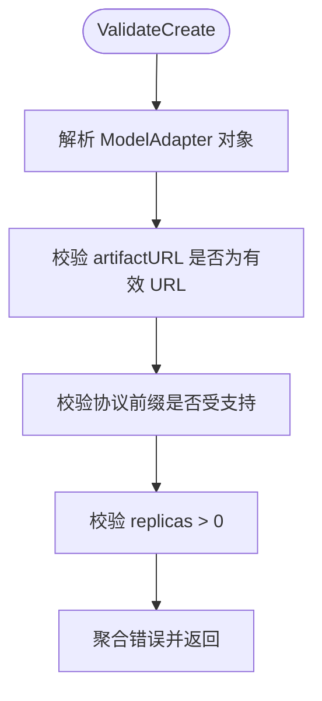
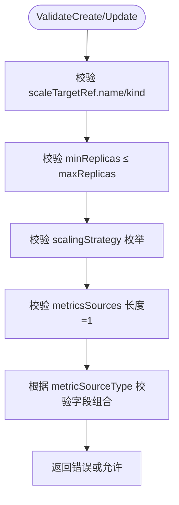
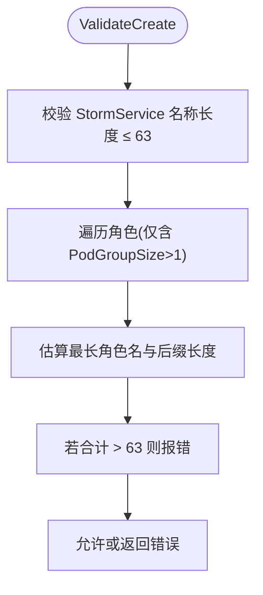
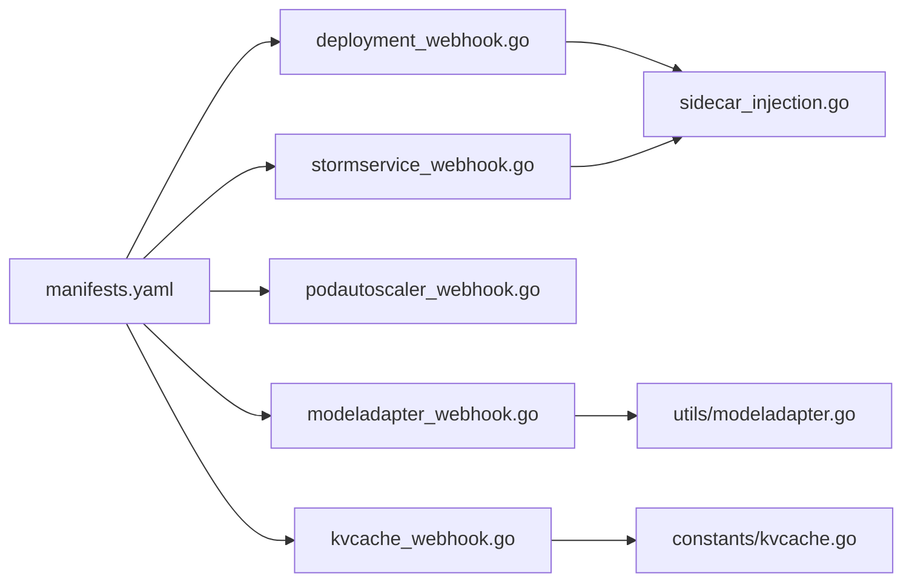

# Webhook API

<cite>
**本文引用的文件**
- [pkg/webhook/deployment_webhook.go](file://pkg/webhook/deployment_webhook.go)
- [pkg/webhook/modeladapter_webhook.go](file://pkg/webhook/modeladapter_webhook.go)
- [pkg/webhook/podautoscaler_webhook.go](file://pkg/webhook/podautoscaler_webhook.go)
- [pkg/webhook/stormservice_webhook.go](file://pkg/webhook/stormservice_webhook.go)
- [pkg/webhook/kvcache_webhook.go](file://pkg/webhook/kvcache_webhook.go)
- [pkg/webhook/sidecar_injection.go](file://pkg/webhook/sidecar_injection.go)
- [config/webhook/manifests.yaml](file://config/webhook/manifests.yaml)
- [api/model/v1alpha1/modeladapter_types.go](file://api/model/v1alpha1/modeladapter_types.go)
- [api/autoscaling/v1alpha1/podautoscaler_types.go](file://api/autoscaling/v1alpha1/podautoscaler_types.go)
- [api/orchestration/v1alpha1/stormservice_types.go](file://api/orchestration/v1alpha1/stormservice_types.go)
- [api/orchestration/v1alpha1/kvcache_types.go](file://api/orchestration/v1alpha1/kvcache_types.go)
- [pkg/constants/kvcache.go](file://pkg/constants/kvcache.go)
- [pkg/utils/modeladapter.go](file://pkg/utils/modeladapter.go)
- [config/samples/model_v1alpha1_modeladapter.yaml](file://config/samples/model_v1alpha1_modeladapter.yaml)
</cite>

## 目录
1. [简介](#简介)
2. [项目结构](#项目结构)
3. [核心组件](#核心组件)
4. [架构总览](#架构总览)
5. [详细组件分析](#详细组件分析)
6. [依赖分析](#依赖分析)
7. [性能考量](#性能考量)
8. [故障排查指南](#故障排查指南)
9. [结论](#结论)
10. [附录](#附录)

## 简介
本文件为 AIBrix 的 Webhook API 参考文档，覆盖所有入站与出站 Webhook 接口，重点围绕以下资源的准入控制、默认值注入、变更校验与错误处理进行系统化说明：
- Deployment（含容器侧车注入）
- ModelAdapter
- PodAutoscaler
- StormService（含 RoleSet/多角色 Pod 模板注入）
- KVCache（含后端与模式默认化）

同时提供：
- 触发条件与请求/响应流程
- 配置示例（准入规则、注解、字段校验）
- 安全机制与运维建议（证书、失败策略、健康探针）
- 调试与监控要点

## 项目结构
Webhook 相关代码主要位于 pkg/webhook，注册清单位于 config/webhook，CRD 类型定义位于 api/*/v1alpha1。

**图表来源**
- [pkg/webhook/deployment_webhook.go:34-40](file://pkg/webhook/deployment_webhook.go#L34-L40)
- [pkg/webhook/modeladapter_webhook.go:36-43](file://pkg/webhook/modeladapter_webhook.go#L36-L43)
- [pkg/webhook/podautoscaler_webhook.go:40-46](file://pkg/webhook/podautoscaler_webhook.go#L40-L46)
- [pkg/webhook/stormservice_webhook.go:34-40](file://pkg/webhook/stormservice_webhook.go#L34-L40)
- [pkg/webhook/kvcache_webhook.go:38-44](file://pkg/webhook/kvcache_webhook.go#L38-L44)
- [pkg/webhook/sidecar_injection.go:28-43](file://pkg/webhook/sidecar_injection.go#L28-L43)
- [config/webhook/manifests.yaml:1-213](file://config/webhook/manifests.yaml#L1-L213)
- [api/model/v1alpha1/modeladapter_types.go:26-61](file://api/model/v1alpha1/modeladapter_types.go#L26-L61)
- [api/autoscaling/v1alpha1/podautoscaler_types.go:53-84](file://api/autoscaling/v1alpha1/podautoscaler_types.go#L53-L84)
- [api/orchestration/v1alpha1/stormservice_types.go:24-60](file://api/orchestration/v1alpha1/stormservice_types.go#L24-L60)
- [api/orchestration/v1alpha1/kvcache_types.go:85-107](file://api/orchestration/v1alpha1/kvcache_types.go#L85-L107)

**章节来源**
- [config/webhook/manifests.yaml:1-213](file://config/webhook/manifests.yaml#L1-L213)

## 核心组件
- 准入 Webhook 注册与路由
  - 通过 MutatingWebhookConfiguration 与 ValidatingWebhookConfiguration 将不同资源的准入路径映射到 webhook-service。
  - 失败策略统一为忽略（failurePolicy=Ignore），以避免在 webhook 异常时阻塞集群操作。
- 资源侧车注入
  - Deployment 与 StormService 在满足注解条件时，自动向 Pod 模板注入 aibrix-runtime 侧车容器，并共享适配器存储卷。
- 资源校验
  - ModelAdapter：校验 artifactURL 合法性与副本数约束。
  - PodAutoscaler：校验目标引用、副本边界、度量类型与字段组合。
  - KVCache：校验后端模式与默认化注解。
  - StormService：校验名称长度与 PodSet 名称上限风险。

**章节来源**
- [config/webhook/manifests.yaml:1-213](file://config/webhook/manifests.yaml#L1-L213)
- [pkg/webhook/deployment_webhook.go:45-70](file://pkg/webhook/deployment_webhook.go#L45-L70)
- [pkg/webhook/stormservice_webhook.go:45-70](file://pkg/webhook/stormservice_webhook.go#L45-L70)
- [pkg/webhook/modeladapter_webhook.go:54-78](file://pkg/webhook/modeladapter_webhook.go#L54-L78)
- [pkg/webhook/podautoscaler_webhook.go:76-117](file://pkg/webhook/podautoscaler_webhook.go#L76-L117)
- [pkg/webhook/kvcache_webhook.go:84-118](file://pkg/webhook/kvcache_webhook.go#L84-L118)

## 架构总览
Webhook 在 Kubernetes API Server 收到资源创建/更新请求时被调用，执行默认化或校验逻辑，返回允许或拒绝的结果。注册清单定义了各资源的准入路径与服务端点。

**图表来源**
- [config/webhook/manifests.yaml:1-213](file://config/webhook/manifests.yaml#L1-L213)
- [pkg/webhook/deployment_webhook.go:45-70](file://pkg/webhook/deployment_webhook.go#L45-L70)
- [pkg/webhook/stormservice_webhook.go:45-70](file://pkg/webhook/stormservice_webhook.go#L45-L70)
- [pkg/webhook/modeladapter_webhook.go:54-78](file://pkg/webhook/modeladapter_webhook.go#L54-L78)
- [pkg/webhook/podautoscaler_webhook.go:76-117](file://pkg/webhook/podautoscaler_webhook.go#L76-L117)
- [pkg/webhook/kvcache_webhook.go:84-118](file://pkg/webhook/kvcache_webhook.go#L84-L118)

## 详细组件分析

### Deployment Webhook（容器侧车注入）
- 触发条件
  - 资源：apps/v1/Deployment
  - 动作：CREATE/UPDATE
  - 注解：需存在指定注解且值为 "true" 才触发注入
- 默认化（Mutating）
  - 若未设置自定义镜像，则使用默认侧车镜像；若未显式设置引擎类型，则从主容器镜像推断。
  - 自动创建 EmptyDir 卷并挂载到除侧车外的所有容器，确保适配器下载目录共享。
  - 将 aibrix-runtime 作为第一个容器注入，内置健康/就绪探针与资源限制。
- 校验（Validating）
  - 当前预留实现，可按需扩展（例如校验模板字段）。
- 错误处理
  - 对象类型不匹配时返回错误；否则忽略（failurePolicy=Ignore）。

**图表来源**
- [pkg/webhook/deployment_webhook.go:50-146](file://pkg/webhook/deployment_webhook.go#L50-L146)
- [pkg/webhook/sidecar_injection.go:45-110](file://pkg/webhook/sidecar_injection.go#L45-L110)

**章节来源**
- [pkg/webhook/deployment_webhook.go:34-70](file://pkg/webhook/deployment_webhook.go#L34-L70)
- [pkg/webhook/deployment_webhook.go:148-169](file://pkg/webhook/deployment_webhook.go#L148-L169)
- [pkg/webhook/sidecar_injection.go:28-43](file://pkg/webhook/sidecar_injection.go#L28-L43)
- [pkg/webhook/sidecar_injection.go:112-133](file://pkg/webhook/sidecar_injection.go#L112-L133)

### ModelAdapter Webhook（模型适配器）
- 触发条件
  - 资源：model.aibrix.ai/v1alpha1/ModelAdapter
  - 动作：CREATE/UPDATE
- 默认化（Mutating）
  - 当前为空实现，预留扩展空间。
- 校验（Validating）
  - artifactURL 必填且必须为合法 URL；支持多种协议前缀。
  - replicas 必须大于 0；当前仅支持 1 副本或全部匹配（nil）。
- 错误处理
  - 使用字段级校验错误集合，聚合后一次性返回。

**图表来源**
- [pkg/webhook/modeladapter_webhook.go:58-78](file://pkg/webhook/modeladapter_webhook.go#L58-L78)
- [pkg/utils/modeladapter.go:26-34](file://pkg/utils/modeladapter.go#L26-L34)

**章节来源**
- [pkg/webhook/modeladapter_webhook.go:36-89](file://pkg/webhook/modeladapter_webhook.go#L36-L89)
- [pkg/utils/modeladapter.go:24-34](file://pkg/utils/modeladapter.go#L24-L34)
- [api/model/v1alpha1/modeladapter_types.go:42-56](file://api/model/v1alpha1/modeladapter_types.go#L42-L56)

### PodAutoscaler Webhook（Pod 自动伸缩）
- 触发条件
  - 资源：autoscaling.aibrix.ai/v1alpha1/PodAutoscaler
  - 动作：CREATE/UPDATE
- 默认化（Mutating）
  - 当前为空实现，预留扩展空间。
- 校验（Validating）
  - scaleTargetRef.name/kind 必填。
  - minReplicas/maxReplicas 边界一致性。
  - scalingStrategy 限定枚举（HPA/KPA/APA）。
  - metricsSources 仅允许一个元素；对不同 metricSourceType 校验必填字段与互斥字段组合。
- 错误处理
  - 使用 Invalid/NotSupported/Forbidden 等错误类型精确反馈问题。

**图表来源**
- [pkg/webhook/podautoscaler_webhook.go:88-117](file://pkg/webhook/podautoscaler_webhook.go#L88-L117)
- [pkg/webhook/podautoscaler_webhook.go:119-249](file://pkg/webhook/podautoscaler_webhook.go#L119-L249)
- [api/autoscaling/v1alpha1/podautoscaler_types.go:107-152](file://api/autoscaling/v1alpha1/podautoscaler_types.go#L107-L152)

**章节来源**
- [pkg/webhook/podautoscaler_webhook.go:40-117](file://pkg/webhook/podautoscaler_webhook.go#L40-L117)
- [pkg/webhook/podautoscaler_webhook.go:119-249](file://pkg/webhook/podautoscaler_webhook.go#L119-L249)
- [api/autoscaling/v1alpha1/podautoscaler_types.go:53-84](file://api/autoscaling/v1alpha1/podautoscaler_types.go#L53-L84)
- [api/autoscaling/v1alpha1/podautoscaler_types.go:130-152](file://api/autoscaling/v1alpha1/podautoscaler_types.go#L130-L152)

### StormService Webhook（多角色服务）
- 触发条件
  - 资源：orchestration.aibrix.ai/v1alpha1/StormService
  - 动作：CREATE/UPDATE
- 默认化（Mutating）
  - 若注解启用，则遍历每个 Role 的 Pod 模板，执行与 Deployment 相同的侧车注入流程。
- 校验（Validating）
  - 校验 StormService 名称长度不超过 63。
  - 若存在 PodSet 角色（PodGroupSize>1），计算估计的 PodSet 名称长度，防止超过 63 字符上限。
- 错误处理
  - 返回人类可读的长度超限提示。

**图表来源**
- [pkg/webhook/stormservice_webhook.go:167-204](file://pkg/webhook/stormservice_webhook.go#L167-L204)
- [pkg/webhook/stormservice_webhook.go:72-154](file://pkg/webhook/stormservice_webhook.go#L72-L154)

**章节来源**
- [pkg/webhook/stormservice_webhook.go:34-70](file://pkg/webhook/stormservice_webhook.go#L34-L70)
- [pkg/webhook/stormservice_webhook.go:157-217](file://pkg/webhook/stormservice_webhook.go#L157-L217)
- [api/orchestration/v1alpha1/stormservice_types.go:24-60](file://api/orchestration/v1alpha1/stormservice_types.go#L24-L60)

### KVCache Webhook（KV 缓存）
- 触发条件
  - 资源：orchestration.aibrix.ai/v1alpha1/KVCache
  - 动作：CREATE/UPDATE
- 默认化（Mutating）
  - 若未设置后端注解，则写入默认后端与模式注解。
- 校验（Validating）
  - 调用工具函数校验后端配置合法性。
- 错误处理
  - 返回具体错误信息以便定位配置问题。

**章节来源**
- [pkg/webhook/kvcache_webhook.go:38-79](file://pkg/webhook/kvcache_webhook.go#L38-L79)
- [pkg/webhook/kvcache_webhook.go:81-118](file://pkg/webhook/kvcache_webhook.go#L81-L118)
- [pkg/constants/kvcache.go:19-43](file://pkg/constants/kvcache.go#L19-L43)
- [api/orchestration/v1alpha1/kvcache_types.go:85-107](file://api/orchestration/v1alpha1/kvcache_types.go#L85-L107)

## 依赖分析
- 组件耦合
  - Deployment 与 StormService 共享侧车注入逻辑（sidecar_injection.go），降低重复实现。
  - Webhook 清单集中管理准入规则与服务端点，便于统一维护。
- 外部依赖
  - AdmissionRegistration API（Mutating/ValidatingWebhookConfiguration）
  - Kubernetes API Server（AdmissionReview）
- 潜在循环依赖
  - Webhook 文件之间无直接 import 循环；通过公共常量与工具函数间接交互。

**图表来源**
- [config/webhook/manifests.yaml:1-213](file://config/webhook/manifests.yaml#L1-L213)
- [pkg/webhook/deployment_webhook.go:19-32](file://pkg/webhook/deployment_webhook.go#L19-L32)
- [pkg/webhook/stormservice_webhook.go:19-32](file://pkg/webhook/stormservice_webhook.go#L19-L32)
- [pkg/webhook/kvcache_webhook.go:19-32](file://pkg/webhook/kvcache_webhook.go#L19-L32)
- [pkg/webhook/sidecar_injection.go:28-43](file://pkg/webhook/sidecar_injection.go#L28-L43)
- [pkg/constants/kvcache.go:19-43](file://pkg/constants/kvcache.go#L19-L43)
- [pkg/utils/modeladapter.go:24-34](file://pkg/utils/modeladapter.go#L24-L34)

**章节来源**
- [config/webhook/manifests.yaml:1-213](file://config/webhook/manifests.yaml#L1-L213)

## 性能考量
- 失败策略
  - 所有准入 Webhook 的 failurePolicy=Ignore，避免在 webhook 不可用时阻塞集群关键操作。
- 调用开销
  - 默认化/校验逻辑应保持轻量，避免复杂外部依赖与阻塞式 I/O。
- 并发与稳定性
  - 建议在生产环境中为 webhook 服务配置充足的副本与资源限制，结合健康/就绪探针保障可用性。

## 故障排查指南
- 常见问题
  - 注解缺失导致未注入侧车：确认 Deployment/StormService 上存在启用注解。
  - artifactURL 不合法：检查协议前缀是否在允许列表中。
  - PodAutoscaler 度量字段组合错误：根据类型补齐必填字段并移除互斥字段。
  - StormService 名称过长导致 PodSet 名称超限：缩短名称或角色名。
- 调试步骤
  - 查看 API Server 的 AdmissionReview 日志与 webhook 服务日志。
  - 使用 kubectl describe 获取资源状态与事件。
  - 临时将 failurePolicy 调整为 Fail 进行严格测试（仅限开发环境）。
- 监控建议
  - 监控 webhook 服务的请求延迟、错误率与存活/就绪探针状态。
  - 关注 AdmissionReview 的拒绝率与错误详情。

**章节来源**
- [pkg/webhook/modeladapter_webhook.go:58-78](file://pkg/webhook/modeladapter_webhook.go#L58-L78)
- [pkg/webhook/podautoscaler_webhook.go:119-249](file://pkg/webhook/podautoscaler_webhook.go#L119-L249)
- [pkg/webhook/stormservice_webhook.go:167-204](file://pkg/webhook/stormservice_webhook.go#L167-L204)

## 结论
AIBrix 的 Webhook API 通过标准化的准入控制实现了对关键资源的默认化与强约束校验，配合统一的服务端点与失败策略，既保证了资源创建/更新的可控性，也提升了系统的可观测性与稳定性。后续可在现有基础上扩展更丰富的校验规则与默认化策略，持续提升自动化水平。

## 附录

### Webhook 配置示例（节选）
- ModelAdapter 示例（用于演示字段结构）
  - 参考文件：[config/samples/model_v1alpha1_modeladapter.yaml:1-10](file://config/samples/model_v1alpha1_modeladapter.yaml#L1-L10)
- AdmissionWebhook 清单（准入规则与服务端点）
  - 参考文件：[config/webhook/manifests.yaml:1-213](file://config/webhook/manifests.yaml#L1-L213)

### 安全与合规
- 认证与授权
  - Webhook 服务通过 Kubernetes Service 暴露，建议结合 RBAC 与网络策略限制访问范围。
- TLS 与证书
  - 建议为 webhook-service 配置自签或受信 CA 证书，确保 API Server 与 webhook 之间的通信安全。
- 数据最小化
  - 仅注入必要注解与卷挂载，避免暴露敏感信息。

### Webhook 与控制器协作
- Webhook 负责“准入阶段”的默认化与校验；
- 控制器负责“运行阶段”的状态收敛与资源编排；
- 二者协同确保从“可创建”到“可运行”的一致性。