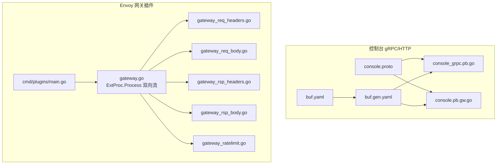
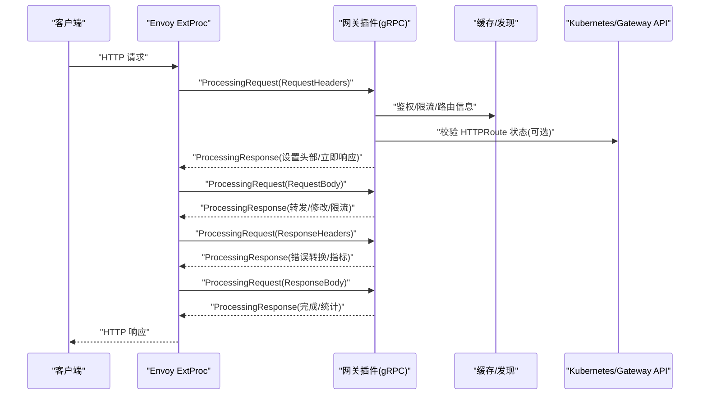
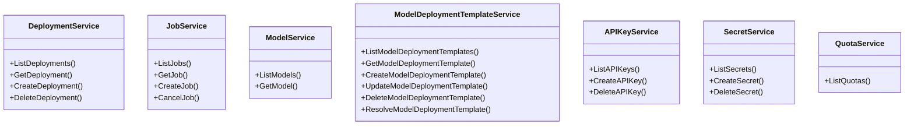
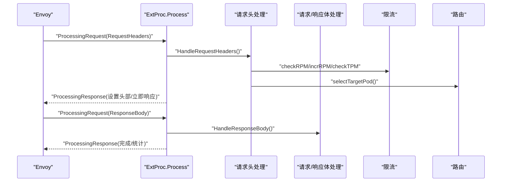
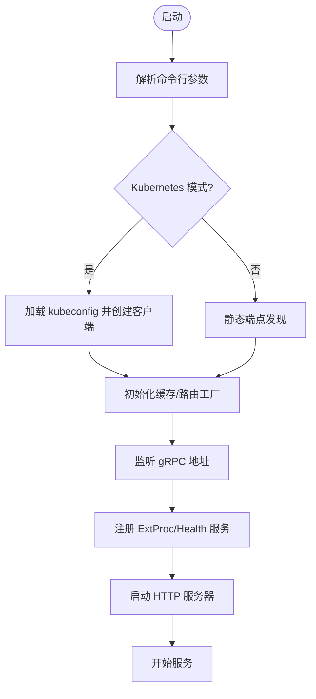
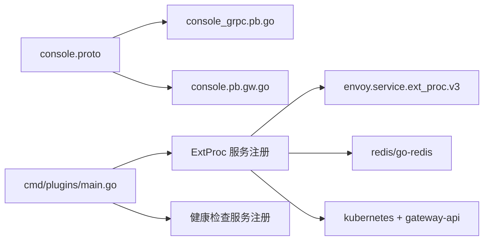

# gRPC API

<cite>
**本文引用的文件**
- [apps/console/api/proto/console/v1/console.proto](file://apps/console/api/proto/console/v1/console.proto)
- [apps/console/api/gen/console/v1/console_grpc.pb.go](file://apps/console/api/gen/console/v1/console_grpc.pb.go)
- [apps/console/api/gen/console/v1/console.pb.gw.go](file://apps/console/api/gen/console/v1/console.pb.gw.go)
- [apps/console/api/buf.gen.yaml](file://apps/console/api/buf.gen.yaml)
- [apps/console/api/buf.yaml](file://apps/console/api/buf.yaml)
- [cmd/plugins/main.go](file://cmd/plugins/main.go)
- [pkg/plugins/gateway/gateway.go](file://pkg/plugins/gateway/gateway.go)
- [pkg/plugins/gateway/gateway_ratelimit.go](file://pkg/plugins/gateway/gateway_ratelimit.go)
- [pkg/plugins/gateway/gateway_req_headers.go](file://pkg/plugins/gateway/gateway_req_headers.go)
- [pkg/plugins/gateway/gateway_req_headers_test.go](file://pkg/plugins/gateway/gateway_req_headers_test.go)
- [pkg/plugins/gateway/gateway_req_body.go](file://pkg/plugins/gateway/gateway_req_body.go)
- [pkg/plugins/gateway/gateway_rsp_headers.go](file://pkg/plugins/gateway/gateway_rsp_headers.go)
- [pkg/plugins/gateway/gateway_rsp_body.go](file://pkg/plugins/gateway/gateway_rsp_body.go)
- [pkg/plugins/gateway/gateway_test.go](file://pkg/plugins/gateway/gateway_test.go)
- [pkg/plugins/gateway/gateway_benchmark_test.go](file://pkg/plugins/gateway/gateway_benchmark_test.go)
- [pkg/plugins/gateway/util_test.go](file://pkg/plugins/gateway/util_test.go)
- [go.mod](file://go.mod)
</cite>

## 目录
1. [简介](#简介)
2. [项目结构](#项目结构)
3. [核心组件](#核心组件)
4. [架构总览](#架构总览)
5. [详细组件分析](#详细组件分析)
6. [依赖关系分析](#依赖关系分析)
7. [性能考量](#性能考量)
8. [故障排查指南](#故障排查指南)
9. [结论](#结论)
10. [附录](#附录)

## 简介
本文件为 AIBrix 的 gRPC API 参考文档，聚焦三类接口与协议：
- Envoy 外部处理器（ExtProc）gRPC 接口：用于在 Envoy 中以 gRPC 流式方式对请求/响应进行拦截、鉴权、限流、路由与可观测性增强。
- 控制台服务 gRPC 接口：基于 .proto 定义的服务契约，覆盖部署、作业（批推理）、模型目录、模板、API 密钥、密文与配额等能力，并通过网关插件生成 HTTP 映射。
- 网关插件 gRPC 通信协议：面向 Envoy ExtProc 的双向流式协议，支持请求头、请求体、响应头、响应体阶段的处理与错误传播。

文档同时提供 .proto 文件定义、代码生成指南、客户端实现要点、流式 RPC 与错误传播机制说明，以及性能优化、连接池与安全认证等高级主题。

## 项目结构
围绕 gRPC API 的关键位置如下：
- 控制台 gRPC/HTTP 服务定义与生成：apps/console/api/proto 与 apps/console/api/gen
- Envoy 网关插件 gRPC 服务：pkg/plugins/gateway 下的 gateway.go 与各阶段处理文件
- 插件进程入口与注册：cmd/plugins/main.go
- 依赖与版本：go.mod

图表来源
- [apps/console/api/proto/console/v1/console.proto:1-672](file://apps/console/api/proto/console/v1/console.proto#L1-L672)
- [apps/console/api/gen/console/v1/console_grpc.pb.go:1-200](file://apps/console/api/gen/console/v1/console_grpc.pb.go#L1-L200)
- [apps/console/api/gen/console/v1/console.pb.gw.go](file://apps/console/api/gen/console/v1/console.pb.gw.go)
- [apps/console/api/buf.gen.yaml:1-12](file://apps/console/api/buf.gen.yaml#L1-L12)
- [apps/console/api/buf.yaml:1-6](file://apps/console/api/buf.yaml#L1-L6)
- [cmd/plugins/main.go:147-197](file://cmd/plugins/main.go#L147-L197)
- [pkg/plugins/gateway/gateway.go:123-156](file://pkg/plugins/gateway/gateway.go#L123-L156)

章节来源
- [apps/console/api/proto/console/v1/console.proto:1-672](file://apps/console/api/proto/console/v1/console.proto#L1-L672)
- [apps/console/api/buf.gen.yaml:1-12](file://apps/console/api/buf.gen.yaml#L1-L12)
- [apps/console/api/buf.yaml:1-6](file://apps/console/api/buf.yaml#L1-L6)
- [cmd/plugins/main.go:147-197](file://cmd/plugins/main.go#L147-L197)
- [pkg/plugins/gateway/gateway.go:123-156](file://pkg/plugins/gateway/gateway.go#L123-L156)

## 核心组件
- 控制台 gRPC 服务族
  - 部署服务：部署列表、详情、创建、删除
  - 作业服务（批推理）：作业列表、详情、创建、取消
  - 模型服务：模型目录、详情
  - 模型部署模板服务：模板列表、详情、创建、更新、删除、按名称解析
  - API 密钥服务：密钥列表、创建、删除
  - 密文服务：密文列表、创建、删除
  - 配额服务：配额列表
- Envoy 网关插件 gRPC 服务
  - ExtProc.Process 双向流：请求头、请求体、响应头、响应体阶段处理
  - 速率限制：用户级 RPM/TPM 限制
  - 路由选择：根据上下文与算法选择目标 Pod
  - 错误传播：将错误映射为 Envoy 状态码并返回立即响应或继续流

章节来源
- [apps/console/api/proto/console/v1/console.proto:28-672](file://apps/console/api/proto/console/v1/console.proto#L28-L672)
- [pkg/plugins/gateway/gateway.go:238-303](file://pkg/plugins/gateway/gateway.go#L238-L303)
- [pkg/plugins/gateway/gateway_ratelimit.go:39-113](file://pkg/plugins/gateway/gateway_ratelimit.go#L39-L113)

## 架构总览
AIBrix 的 gRPC API 分布于两类路径：
- 控制台侧：.proto 定义经 buf 生成 gRPC 与 HTTP 网关代码，供控制台后端使用。
- 网关插件侧：以 gRPC 服务形式接入 Envoy ExtProc，对在线推理请求进行实时处理。

图表来源
- [pkg/plugins/gateway/gateway.go:238-303](file://pkg/plugins/gateway/gateway.go#L238-L303)
- [pkg/plugins/gateway/gateway_req_headers.go](file://pkg/plugins/gateway/gateway_req_headers.go)
- [pkg/plugins/gateway/gateway_req_body.go](file://pkg/plugins/gateway/gateway_req_body.go)
- [pkg/plugins/gateway/gateway_rsp_headers.go](file://pkg/plugins/gateway/gateway_rsp_headers.go)
- [pkg/plugins/gateway/gateway_rsp_body.go](file://pkg/plugins/gateway/gateway_rsp_body.go)
- [cmd/plugins/main.go:166-171](file://cmd/plugins/main.go#L166-L171)

## 详细组件分析

### 控制台 gRPC 服务族（console.v1）
- 服务与方法
  - DeploymentService：ListDeployments、GetDeployment、CreateDeployment、DeleteDeployment
  - JobService：ListJobs、GetJob、CreateJob、CancelJob
  - ModelService：ListModels、GetModel
  - ModelDeploymentTemplateService：List/Get/Create/Update/Delete、ResolveModelDeploymentTemplate
  - APIKeyService：ListAPIKeys、CreateAPIKey、DeleteAPIKey
  - SecretService：ListSecrets、CreateSecret、DeleteSecret
  - QuotaService：ListQuotas
- 消息格式
  - 使用标准 protobuf 类型与自定义消息，如 Deployment、Job、Model、APIKey、Secret、Quota、模板规格等
- HTTP 映射
  - 通过 google.api.http 注解将 gRPC 方法映射到 REST 风格路径，便于浏览器与 HTTP 客户端直接访问
- 生成产物
  - console_grpc.pb.go：gRPC 服务桩代码
  - console.pb.gw.go：基于 grpc-gateway 的 HTTP->gRPC 映射
  - buf.gen.yaml 指定生成插件与输出目录

图表来源
- [apps/console/api/proto/console/v1/console.proto:28-672](file://apps/console/api/proto/console/v1/console.proto#L28-L672)
- [apps/console/api/gen/console/v1/console_grpc.pb.go:36-150](file://apps/console/api/gen/console/v1/console_grpc.pb.go#L36-L150)

章节来源
- [apps/console/api/proto/console/v1/console.proto:28-672](file://apps/console/api/proto/console/v1/console.proto#L28-L672)
- [apps/console/api/gen/console/v1/console_grpc.pb.go:36-150](file://apps/console/api/gen/console/v1/console_grpc.pb.go#L36-L150)
- [apps/console/api/gen/console/v1/console.pb.gw.go](file://apps/console/api/gen/console/v1/console.pb.gw.go)
- [apps/console/api/buf.gen.yaml:1-12](file://apps/console/api/buf.gen.yaml#L1-L12)
- [apps/console/api/buf.yaml:1-6](file://apps/console/api/buf.yaml#L1-L6)

### Envoy 外部处理器 gRPC 接口（ExtProc.Process）
- 协议与流式模式
  - 单个 gRPC 双向流，消息类型包括 RequestHeaders、RequestBody、ResponseHeaders、ResponseBody
  - 服务器端循环接收消息并发送响应，直至客户端关闭或发生错误
- 处理流程
  - 请求头阶段：鉴权、速率限制、路由上下文构建
  - 请求体阶段：流式数据处理、令牌计数、追踪标记
  - 响应头阶段：错误状态码转换、错误头注入
  - 响应体阶段：流式响应处理、完成标记、指标上报
- 错误传播
  - 将 gRPC 错误映射为 Envoy 状态码；非 gRPC 错误包装为 Unknown
  - 在特定阶段（如响应头）将业务错误转换为立即响应并携带错误类型
- 关键实现点
  - Process 循环与 preRecvCheck、handleRecvError
  - handleProcessingRequest 分发至各阶段处理函数
  - sendProcessingResponse 发送响应并记录指标与清理

图表来源
- [pkg/plugins/gateway/gateway.go:123-156](file://pkg/plugins/gateway/gateway.go#L123-L156)
- [pkg/plugins/gateway/gateway.go:238-303](file://pkg/plugins/gateway/gateway.go#L238-L303)
- [pkg/plugins/gateway/gateway_ratelimit.go:39-113](file://pkg/plugins/gateway/gateway_ratelimit.go#L39-L113)
- [pkg/plugins/gateway/gateway_req_headers.go](file://pkg/plugins/gateway/gateway_req_headers.go)
- [pkg/plugins/gateway/gateway_req_body.go](file://pkg/plugins/gateway/gateway_req_body.go)
- [pkg/plugins/gateway/gateway_rsp_headers.go](file://pkg/plugins/gateway/gateway_rsp_headers.go)
- [pkg/plugins/gateway/gateway_rsp_body.go](file://pkg/plugins/gateway/gateway_rsp_body.go)

章节来源
- [pkg/plugins/gateway/gateway.go:123-156](file://pkg/plugins/gateway/gateway.go#L123-L156)
- [pkg/plugins/gateway/gateway.go:238-303](file://pkg/plugins/gateway/gateway.go#L238-L303)
- [pkg/plugins/gateway/gateway_test.go:1187-1340](file://pkg/plugins/gateway/gateway_test.go#L1187-L1340)
- [pkg/plugins/gateway/gateway_benchmark_test.go:1-38](file://pkg/plugins/gateway/gateway_benchmark_test.go#L1-L38)

### 网关插件启动与注册
- 启动参数
  - --grpc-bind-address：gRPC 服务监听地址
  - --http-bind-address：HTTP 服务监听地址（含指标与 /v1/models）
  - --standalone/--endpoints-config：独立模式与端点配置
- 服务注册
  - 注册 ExtProc 服务与健康检查服务
  - 启动 HTTP 服务器（/v1/models、指标）

图表来源
- [cmd/plugins/main.go:54-197](file://cmd/plugins/main.go#L54-L197)

章节来源
- [cmd/plugins/main.go:54-197](file://cmd/plugins/main.go#L54-L197)

## 依赖关系分析
- 控制台 gRPC 服务依赖
  - google.api.http：用于 HTTP 映射
  - google.protobuf.empty：空消息
- 网关插件 gRPC 服务依赖
  - envoy.service.ext_proc.v3：ExtProc 协议
  - google.golang.org/grpc/health：健康检查
  - redis/go-redis：速率限制与缓存
  - kubernetes 客户端与 Gateway API 客户端：校验路由状态

图表来源
- [apps/console/api/proto/console/v1/console.proto:21-22](file://apps/console/api/proto/console/v1/console.proto#L21-L22)
- [apps/console/api/gen/console/v1/console_grpc.pb.go:23-29](file://apps/console/api/gen/console/v1/console_grpc.pb.go#L23-L29)
- [apps/console/api/gen/console/v1/console.pb.gw.go](file://apps/console/api/gen/console/v1/console.pb.gw.go)
- [cmd/plugins/main.go:34-43](file://cmd/plugins/main.go#L34-L43)
- [pkg/plugins/gateway/gateway.go:32-51](file://pkg/plugins/gateway/gateway.go#L32-L51)

章节来源
- [apps/console/api/proto/console/v1/console.proto:21-22](file://apps/console/api/proto/console/v1/console.proto#L21-L22)
- [apps/console/api/gen/console/v1/console_grpc.pb.go:23-29](file://apps/console/api/gen/console/v1/console_grpc.pb.go#L23-L29)
- [apps/console/api/gen/console/v1/console.pb.gw.go](file://apps/console/api/gen/console/v1/console.pb.gw.go)
- [cmd/plugins/main.go:34-43](file://cmd/plugins/main.go#L34-L43)
- [pkg/plugins/gateway/gateway.go:32-51](file://pkg/plugins/gateway/gateway.go#L32-L51)
- [go.mod:58-84](file://go.mod#L58-L84)

## 性能考量
- 流式处理
  - 使用 ExtProc 双向流逐段处理请求/响应，降低内存占用与延迟
- 速率限制
  - 用户级 RPM/TPM 限制，失败时返回 TooManyRequests 并设置错误头
- 路由与负载均衡
  - 支持多算法路由，过滤可路由 Pod，必要时随机打散
- 指标与可观测性
  - 按模型与阶段统计成功/失败计数，辅助容量规划与问题定位
- 连接与资源
  - gRPC 服务监听独立端口，HTTP 服务承载指标与模型列表查询
- 建议
  - 在高并发场景下启用 Redis 以获得稳定限流与缓存能力
  - 对长尾请求开启流式响应，避免一次性缓冲大量响应体
  - 结合 Prometheus/Grafana 监控指标，持续优化路由与限流阈值

章节来源
- [pkg/plugins/gateway/gateway_ratelimit.go:39-113](file://pkg/plugins/gateway/gateway_ratelimit.go#L39-L113)
- [pkg/plugins/gateway/gateway.go:333-360](file://pkg/plugins/gateway/gateway.go#L333-L360)
- [pkg/plugins/gateway/gateway.go:123-156](file://pkg/plugins/gateway/gateway.go#L123-L156)
- [cmd/plugins/main.go:161-164](file://cmd/plugins/main.go#L161-L164)

## 故障排查指南
- gRPC 错误传播
  - 非 gRPC 错误会被包装为 Unknown；gRPC 错误保留原始状态码
  - 特定阶段（如响应头）会将业务错误转换为立即响应并设置错误类型
- 关闭与取消
  - 客户端 EOF 或上下文取消：记录相应指标并清理请求计数
  - 服务器主动关闭：返回 Unavailable 并记录“正在关闭”
- 常见问题定位
  - HTTPRoute 状态不正确：校验 Gateway API 对象状态，确保 Accepted 与 ResolvedRefs 条件满足
  - 无可用 Pod：检查就绪 Pod 列表与标签选择器过滤结果
  - 限流触发：确认用户 RPM/TPM 配置与当前计数

章节来源
- [pkg/plugins/gateway/gateway.go:181-236](file://pkg/plugins/gateway/gateway.go#L181-L236)
- [pkg/plugins/gateway/gateway.go:305-314](file://pkg/plugins/gateway/gateway.go#L305-L314)
- [pkg/plugins/gateway/gateway_test.go:1187-1340](file://pkg/plugins/gateway/gateway_test.go#L1187-L1340)
- [pkg/plugins/gateway/util_test.go:992-1022](file://pkg/plugins/gateway/util_test.go#L992-L1022)
- [pkg/plugins/gateway/gateway.go:362-397](file://pkg/plugins/gateway/gateway.go#L362-L397)

## 结论
AIBrix 的 gRPC API 通过清晰的服务契约与 .proto 定义，结合 Envoy ExtProc 的流式处理能力，实现了从控制台到推理引擎的全链路可观测与可控。控制台侧提供 REST/gRPC 双栈接口，网关插件侧则以高吞吐、低延迟的方式完成鉴权、限流与路由决策。配合完善的错误传播与指标体系，能够支撑生产环境的稳定性与可运维性。

## 附录

### .proto 文件定义与代码生成
- .proto 定义位置
  - [apps/console/api/proto/console/v1/console.proto:1-672](file://apps/console/api/proto/console/v1/console.proto#L1-L672)
- 生成配置
  - [apps/console/api/buf.gen.yaml:1-12](file://apps/console/api/buf.gen.yaml#L1-L12)
  - [apps/console/api/buf.yaml:1-6](file://apps/console/api/buf.yaml#L1-L6)
- 生成产物
  - gRPC 服务桩：apps/console/api/gen/console/v1/console_grpc.pb.go
  - HTTP 网关：apps/console/api/gen/console/v1/console.pb.gw.go

章节来源
- [apps/console/api/proto/console/v1/console.proto:1-672](file://apps/console/api/proto/console/v1/console.proto#L1-L672)
- [apps/console/api/buf.gen.yaml:1-12](file://apps/console/api/buf.gen.yaml#L1-L12)
- [apps/console/api/buf.yaml:1-6](file://apps/console/api/buf.yaml#L1-L6)
- [apps/console/api/gen/console/v1/console_grpc.pb.go:1-200](file://apps/console/api/gen/console/v1/console_grpc.pb.go#L1-L200)
- [apps/console/api/gen/console/v1/console.pb.gw.go](file://apps/console/api/gen/console/v1/console.pb.gw.go)

### 客户端实现要点
- 控制台 gRPC 客户端
  - 使用生成的 console_grpc.pb.go 中的 DeploymentServiceClient、JobServiceClient 等
  - 参考方法签名与 FullMethodName 定义进行调用
- 网关插件客户端
  - 作为 Envoy 扩展，无需手动编写客户端；确保 Envoy 正确配置 ExternalProcessor 即可
- HTTP 访问
  - 通过 google.api.http 注解提供的 REST 路径访问控制台服务

章节来源
- [apps/console/api/gen/console/v1/console_grpc.pb.go:36-150](file://apps/console/api/gen/console/v1/console_grpc.pb.go#L36-L150)
- [apps/console/api/proto/console/v1/console.proto:28-672](file://apps/console/api/proto/console/v1/console.proto#L28-L672)

### gRPC 特性说明
- 流式 RPC
  - ExtProc.Process 为双向流，支持请求头/体与响应头/体分阶段处理
- 双向流
  - 服务器端循环处理消息，客户端可随时结束流
- 超时与取消
  - 通过 context 控制生命周期；客户端取消或上下文过期时返回相应状态码
- 错误传播
  - gRPC 错误保持原样；非 gRPC 错误包装为 Unknown；阶段化错误转换为立即响应

章节来源
- [pkg/plugins/gateway/gateway.go:123-156](file://pkg/plugins/gateway/gateway.go#L123-L156)
- [pkg/plugins/gateway/gateway.go:181-236](file://pkg/plugins/gateway/gateway.go#L181-L236)
- [pkg/plugins/gateway/gateway.go:238-303](file://pkg/plugins/gateway/gateway.go#L238-L303)

### 安全与认证
- API 密钥管理
  - 提供 APIKeyService，支持创建与删除 API 密钥
  - 密钥创建后仅在首次返回完整密钥，后续仅掩码展示
- 认证与授权
  - 在请求头阶段进行鉴权与速率限制
- 传输安全
  - 建议在生产环境中启用 TLS 与 mTLS，结合 Envoy 证书管理

章节来源
- [apps/console/api/proto/console/v1/console.proto:550-596](file://apps/console/api/proto/console/v1/console.proto#L550-L596)
- [pkg/plugins/gateway/gateway_req_headers.go](file://pkg/plugins/gateway/gateway_req_headers.go)