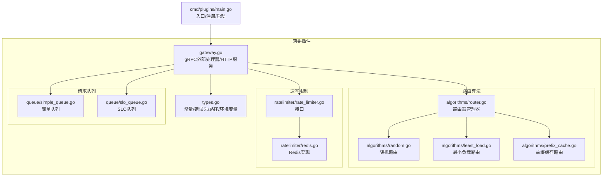
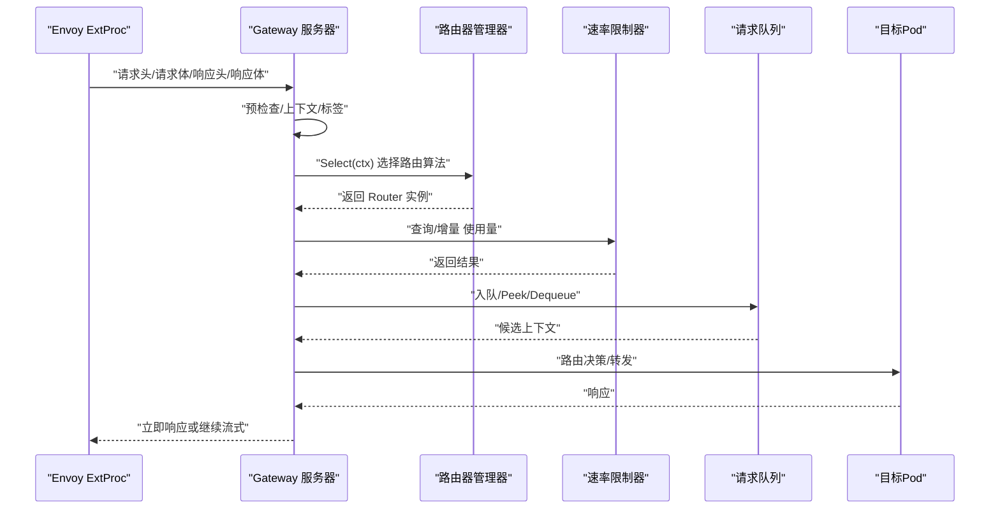
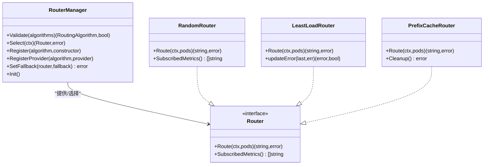
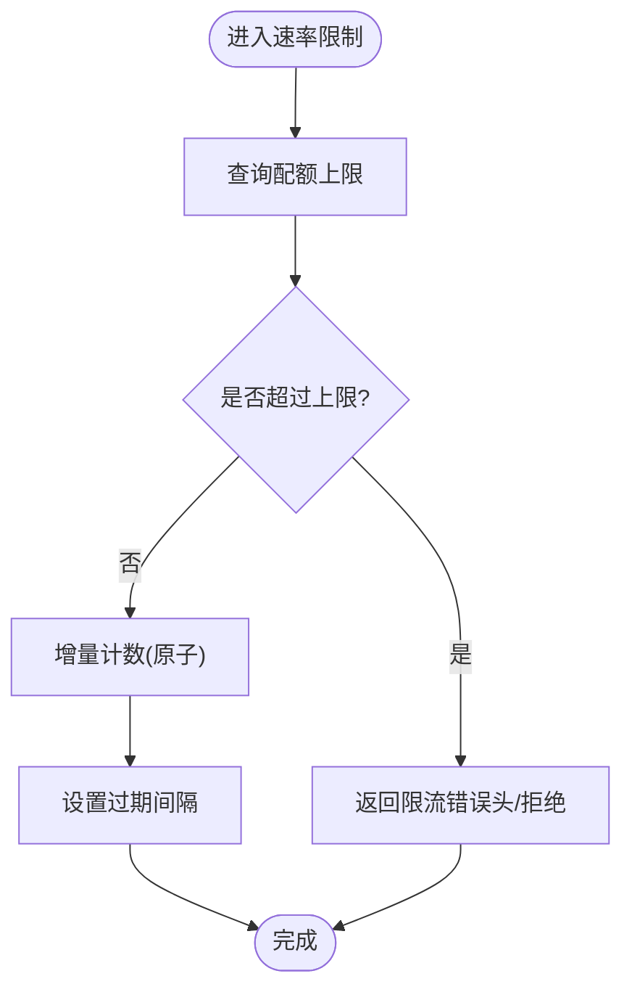
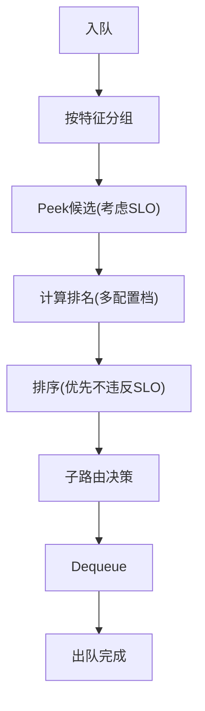
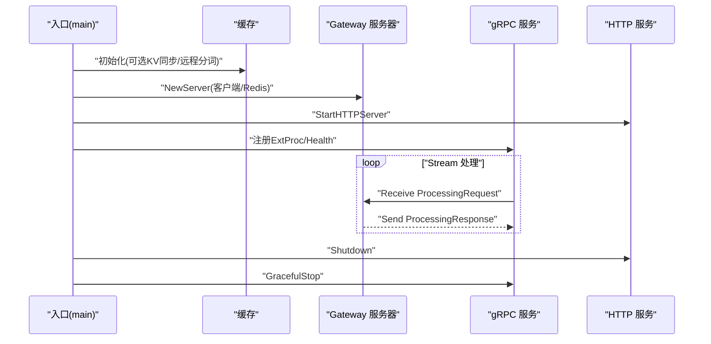
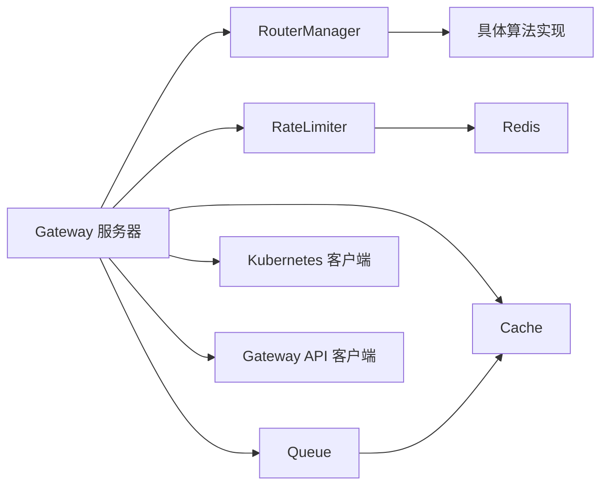

# 插件API

<cite>
**本文引用的文件**
- [pkg/plugins/gateway/gateway.go](file://pkg/plugins/gateway/gateway.go)
- [pkg/plugins/gateway/types.go](file://pkg/plugins/gateway/types.go)
- [pkg/plugins/gateway/algorithms/router.go](file://pkg/plugins/gateway/algorithms/router.go)
- [pkg/plugins/gateway/algorithms/random.go](file://pkg/plugins/gateway/algorithms/random.go)
- [pkg/plugins/gateway/algorithms/least_load.go](file://pkg/plugins/gateway/algorithms/least_load.go)
- [pkg/plugins/gateway/algorithms/prefix_cache.go](file://pkg/plugins/gateway/algorithms/prefix_cache.go)
- [pkg/plugins/gateway/ratelimiter/rate_limiter.go](file://pkg/plugins/gateway/ratelimiter/rate_limiter.go)
- [pkg/plugins/gateway/ratelimiter/redis.go](file://pkg/plugins/gateway/ratelimiter/redis.go)
- [pkg/plugins/gateway/queue/simple_queue.go](file://pkg/plugins/gateway/queue/simple_queue.go)
- [pkg/plugins/gateway/queue/slo_queue.go](file://pkg/plugins/gateway/queue/slo_queue.go)
- [cmd/plugins/main.go](file://cmd/plugins/main.go)
</cite>

## 目录
1. [简介](#简介)
2. [项目结构](#项目结构)
3. [核心组件](#核心组件)
4. [架构总览](#架构总览)
5. [详细组件分析](#详细组件分析)
6. [依赖分析](#依赖分析)
7. [性能考虑](#性能考虑)
8. [故障排除指南](#故障排除指南)
9. [结论](#结论)
10. [附录](#附录)

## 简介
本文件为 AIBrix 网关插件API的权威参考文档，聚焦于扩展接口与内置插件实现，覆盖路由算法插件、速率限制插件、请求队列插件三大类。文档从接口定义、实现要求、生命周期管理到配置参数、注册机制、内置算法特性、协作与数据交换格式进行系统化说明，并提供性能调优与故障排除建议。

## 项目结构
AIBrix 的网关插件位于 pkg/plugins/gateway 目录，核心由以下子模块构成：
- 路由算法：algorithms（含工厂、路由器管理器、具体算法）
- 速率限制：ratelimiter（接口与Redis实现）
- 请求队列：queue（简单队列与基于SLO的队列）
- 类型与常量：types（错误头、路径、环境变量、OpenAI错误码等）
- 网关服务：gateway（gRPC外部处理器、HTTP指标与模型列表、生命周期与错误处理）

图表来源
- [pkg/plugins/gateway/gateway.go:123-331](file://pkg/plugins/gateway/gateway.go#L123-L331)
- [pkg/plugins/gateway/algorithms/router.go:41-153](file://pkg/plugins/gateway/algorithms/router.go#L41-L153)
- [pkg/plugins/gateway/algorithms/random.go:27-62](file://pkg/plugins/gateway/algorithms/random.go#L27-L62)
- [pkg/plugins/gateway/algorithms/least_load.go:42-140](file://pkg/plugins/gateway/algorithms/least_load.go#L42-L140)
- [pkg/plugins/gateway/algorithms/prefix_cache.go:197-326](file://pkg/plugins/gateway/algorithms/prefix_cache.go#L197-L326)
- [pkg/plugins/gateway/ratelimiter/rate_limiter.go:23-37](file://pkg/plugins/gateway/ratelimiter/rate_limiter.go#L23-L37)
- [pkg/plugins/gateway/ratelimiter/redis.go:30-89](file://pkg/plugins/gateway/ratelimiter/redis.go#L30-L89)
- [pkg/plugins/gateway/queue/simple_queue.go:33-219](file://pkg/plugins/gateway/queue/simple_queue.go#L33-L219)
- [pkg/plugins/gateway/queue/slo_queue.go:80-514](file://pkg/plugins/gateway/queue/slo_queue.go#L80-L514)
- [cmd/plugins/main.go:95-152](file://cmd/plugins/main.go#L95-L152)

章节来源
- [pkg/plugins/gateway/gateway.go:123-331](file://pkg/plugins/gateway/gateway.go#L123-L331)
- [cmd/plugins/main.go:95-152](file://cmd/plugins/main.go#L95-L152)

## 核心组件
- 外部处理器服务器：接收 Envoy ext_proc 流式事件，按阶段处理请求头、请求体、响应头、响应体，驱动路由、限流、队列与指标上报。
- 路由器管理器：统一注册、选择与回退策略，支持运行时初始化与回退设置。
- 速率限制器接口：抽象计数、上限查询与增量操作；提供Redis实现与空实现。
- 队列系统：简单队列用于通用排队；SLO队列结合模型GPU配置与SLO目标进行排序决策。
- 类型与常量：统一的错误头、路径、环境变量、OpenAI错误类型与代码，便于跨模块协作。

章节来源
- [pkg/plugins/gateway/gateway.go:62-121](file://pkg/plugins/gateway/gateway.go#L62-L121)
- [pkg/plugins/gateway/algorithms/router.go:41-153](file://pkg/plugins/gateway/algorithms/router.go#L41-L153)
- [pkg/plugins/gateway/ratelimiter/rate_limiter.go:23-37](file://pkg/plugins/gateway/ratelimiter/rate_limiter.go#L23-L37)
- [pkg/plugins/gateway/queue/simple_queue.go:33-219](file://pkg/plugins/gateway/queue/simple_queue.go#L33-L219)
- [pkg/plugins/gateway/queue/slo_queue.go:80-514](file://pkg/plugins/gateway/queue/slo_queue.go#L80-L514)
- [pkg/plugins/gateway/types.go:24-121](file://pkg/plugins/gateway/types.go#L24-L121)

## 架构总览
下图展示从 Envoy 到网关插件再到后端引擎的端到端流程，以及插件内部的处理阶段与组件交互。

图表来源
- [pkg/plugins/gateway/gateway.go:238-303](file://pkg/plugins/gateway/gateway.go#L238-L303)
- [pkg/plugins/gateway/algorithms/router.go:73-85](file://pkg/plugins/gateway/algorithms/router.go#L73-L85)
- [pkg/plugins/gateway/ratelimiter/rate_limiter.go:23-37](file://pkg/plugins/gateway/ratelimiter/rate_limiter.go#L23-L37)
- [pkg/plugins/gateway/queue/slo_queue.go:137-300](file://pkg/plugins/gateway/queue/slo_queue.go#L137-L300)

## 详细组件分析

### 路由算法插件接口与实现
- 接口与管理器
  - 路由器管理器负责算法注册、提供者注册、选择与回退设置；在初始化阶段将构造函数转换为提供者，确保算法可用性与超时保护。
  - 提供 Validate/Select/Register/RegisterProvider/SetFallback 等方法，支持运行时扩展与回退策略。
- 内置算法
  - 随机路由：在就绪Pod中随机选择，适合快速验证与均匀分布。
  - 最小负载路由：支持推送模式与拉取模式，依据负载提供者或受限负载提供者的利用率与消耗进行选择。
  - 前缀缓存路由：基于分词索引匹配前缀，优先选择高匹配度且请求量在标准差范围内的Pod，否则回退至最少请求数。
- 生命周期
  - 初始化：通过入口程序注册依赖算法（如需要）。
  - 运行期：根据 RoutingContext 中的算法标识选择对应 Router 实例。
  - 清理：前缀缓存路由可清理远程分词器池。

图表来源
- [pkg/plugins/gateway/algorithms/router.go:41-153](file://pkg/plugins/gateway/algorithms/router.go#L41-L153)
- [pkg/plugins/gateway/algorithms/random.go:38-62](file://pkg/plugins/gateway/algorithms/random.go#L38-L62)
- [pkg/plugins/gateway/algorithms/least_load.go:42-140](file://pkg/plugins/gateway/algorithms/least_load.go#L42-L140)
- [pkg/plugins/gateway/algorithms/prefix_cache.go:169-326](file://pkg/plugins/gateway/algorithms/prefix_cache.go#L169-L326)

章节来源
- [pkg/plugins/gateway/algorithms/router.go:41-153](file://pkg/plugins/gateway/algorithms/router.go#L41-L153)
- [pkg/plugins/gateway/algorithms/random.go:27-62](file://pkg/plugins/gateway/algorithms/random.go#L27-L62)
- [pkg/plugins/gateway/algorithms/least_load.go:42-140](file://pkg/plugins/gateway/algorithms/least_load.go#L42-L140)
- [pkg/plugins/gateway/algorithms/prefix_cache.go:197-326](file://pkg/plugins/gateway/algorithms/prefix_cache.go#L197-L326)

### 速率限制插件接口与实现
- 接口定义
  - RateLimiter 定义 Get、GetLimit、Incr 三个核心方法，统一计数查询、上限查询与增量操作。
- Redis 实现
  - 固定窗口计数，按秒级分桶，使用管道执行自增与过期设置，保证原子性与时效性。
  - 支持按用户与模型维度的键空间隔离。
- 生命周期
  - 在网关服务器初始化时创建；若未提供 Redis，则降级为空实现。
- 错误处理
  - Redis Nil 视作0；其他错误透传，便于上层统一处理。

图表来源
- [pkg/plugins/gateway/ratelimiter/rate_limiter.go:23-37](file://pkg/plugins/gateway/ratelimiter/rate_limiter.go#L23-L37)
- [pkg/plugins/gateway/ratelimiter/redis.go:30-89](file://pkg/plugins/gateway/ratelimiter/redis.go#L30-L89)

章节来源
- [pkg/plugins/gateway/ratelimiter/rate_limiter.go:23-37](file://pkg/plugins/gateway/ratelimiter/rate_limiter.go#L23-L37)
- [pkg/plugins/gateway/ratelimiter/redis.go:30-89](file://pkg/plugins/gateway/ratelimiter/redis.go#L30-L89)

### 请求队列插件接口与实现
- 简单队列
  - 无界环形缓冲，支持并发安全的入队/出队，自动扩容与压缩；提供容量与长度查询。
- SLO 队列
  - 按请求特征分组子队列，结合模型GPU配置与SLO目标计算“排名”，优先放行不违反SLO的请求；支持多配置档排序与回退策略。
  - 支持 TTFT、TPOT、TPAT、E2E 等SLO目标；当无SLO信息时回退至FIFO。
  - 与路由器提供者解耦，先Peek再路由，最后Dequeue。

图表来源
- [pkg/plugins/gateway/queue/simple_queue.go:44-151](file://pkg/plugins/gateway/queue/simple_queue.go#L44-L151)
- [pkg/plugins/gateway/queue/slo_queue.go:137-300](file://pkg/plugins/gateway/queue/slo_queue.go#L137-L300)

章节来源
- [pkg/plugins/gateway/queue/simple_queue.go:33-219](file://pkg/plugins/gateway/queue/simple_queue.go#L33-L219)
- [pkg/plugins/gateway/queue/slo_queue.go:80-514](file://pkg/plugins/gateway/queue/slo_queue.go#L80-L514)

### 网关服务器与生命周期
- 启动与注册
  - 入口程序加载Redis、K8s客户端与发现提供者，初始化缓存与路由工厂，启动gRPC与HTTP服务。
  - 注册健康检查与插件服务。
- 处理循环
  - Stream 循环接收 Envoy 事件，按阶段处理：请求头、请求体、响应头、响应体。
  - 每阶段生成指标、错误头与最终响应。
- 关闭与清理
  - 优雅关闭HTTP服务与gRPC服务，触发缓存与资源清理。

图表来源
- [cmd/plugins/main.go:147-197](file://cmd/plugins/main.go#L147-L197)
- [pkg/plugins/gateway/gateway.go:123-331](file://pkg/plugins/gateway/gateway.go#L123-L331)

章节来源
- [cmd/plugins/main.go:95-152](file://cmd/plugins/main.go#L95-L152)
- [pkg/plugins/gateway/gateway.go:123-331](file://pkg/plugins/gateway/gateway.go#L123-L331)

## 依赖分析
- 组件耦合
  - Gateway 依赖 RouterManager、RateLimiter、Queue、Cache、K8s/Gateway 客户端与指标系统。
  - RouterManager 对外暴露注册与选择接口，内部以工厂/提供者模式解耦算法实现。
  - SLOQueue 依赖 Cache 获取模型配置与输出预测器，耦合度集中在特征提取与SLO计算。
- 外部依赖
  - Redis：速率限制与KV事件同步（可选）。
  - Kubernetes/Gateway API：HTTPRoute状态校验与对象解析。
  - Prometheus：指标导出。

图表来源
- [pkg/plugins/gateway/gateway.go:94-121](file://pkg/plugins/gateway/gateway.go#L94-L121)
- [pkg/plugins/gateway/algorithms/router.go:41-153](file://pkg/plugins/gateway/algorithms/router.go#L41-L153)
- [pkg/plugins/gateway/ratelimiter/redis.go:30-89](file://pkg/plugins/gateway/ratelimiter/redis.go#L30-L89)
- [pkg/plugins/gateway/queue/slo_queue.go:94-109](file://pkg/plugins/gateway/queue/slo_queue.go#L94-L109)

章节来源
- [pkg/plugins/gateway/gateway.go:94-121](file://pkg/plugins/gateway/gateway.go#L94-L121)
- [pkg/plugins/gateway/algorithms/router.go:41-153](file://pkg/plugins/gateway/algorithms/router.go#L41-L153)
- [pkg/plugins/gateway/ratelimiter/redis.go:30-89](file://pkg/plugins/gateway/ratelimiter/redis.go#L30-L89)
- [pkg/plugins/gateway/queue/slo_queue.go:94-109](file://pkg/plugins/gateway/queue/slo_queue.go#L94-L109)

## 性能考虑
- 路由算法
  - 随机路由开销最低；最小负载路由需访问负载提供者，注意I/O与缓存命中率。
  - 前缀缓存路由在高匹配场景收益显著，但分词与索引维护有额外成本；可通过环境变量调节分词器与统计阈值。
- 速率限制
  - Redis 实现采用管道减少往返；窗口大小与分桶数量影响内存占用与精度。
- 队列
  - SLO 队列在多配置档排序与子队列管理上有额外CPU开销；建议仅在存在明确SLO目标时启用。
  - 简单队列扩容策略避免频繁分配，适合高吞吐场景。
- 指标与日志
  - 启用指标导出会带来少量开销；建议在生产环境按需开启。

## 故障排除指南
- 速率限制相关
  - Redis 不可用：降级为空实现，限流失效；检查连接与权限。
  - 计数异常：确认键空间命名与窗口分桶逻辑；核对过期时间。
- 路由相关
  - 无可用Pod：检查就绪探针与过滤条件；确认外部过滤表达式。
  - 路由算法未生效：确认算法名称与注册顺序；检查初始化超时。
- 队列相关
  - SLO 无法计算：检查模型配置与SLO字段；无SLO时会回退FIFO。
  - 子队列阻塞：观察Peek/Dequeue日志，定位具体子队列与特征分组。
- HTTP/指标
  - /metrics 无法访问：确认HTTP绑定地址与健康检查状态。
  - /v1/models 返回空：检查缓存模型列表与发现提供者。

章节来源
- [pkg/plugins/gateway/gateway.go:181-236](file://pkg/plugins/gateway/gateway.go#L181-L236)
- [pkg/plugins/gateway/ratelimiter/redis.go:57-89](file://pkg/plugins/gateway/ratelimiter/redis.go#L57-L89)
- [pkg/plugins/gateway/queue/slo_queue.go:154-156](file://pkg/plugins/gateway/queue/slo_queue.go#L154-L156)

## 结论
AIBrix 网关插件API通过清晰的接口与模块化设计，提供了可扩展的路由、限流与队列能力。借助路由器管理器与SLO队列，可在不同负载与SLA目标下实现高效稳定的推理调度。建议在生产环境中结合Redis与K8s/Gateway API，合理配置算法与队列策略，并持续监控指标以优化性能与稳定性。

## 附录

### 插件开发指南（路由算法）
- 接口实现
  - 实现 Router 接口的 Route 方法，返回目标Pod地址；必要时实现 SubscribedMetrics。
- 注册机制
  - 使用 RouterManager.Register 或 RegisterProvider 注册算法；在入口处调用 Init 完成构建。
- 配置参数
  - 环境变量 ROUTING_ALGORITHM 控制默认算法；可通过路由上下文覆盖。
- 数据交换
  - 通过 RoutingContext 传递模型、消息、请求ID、特征等；通过头部传递路由策略与目标信息。

章节来源
- [pkg/plugins/gateway/algorithms/router.go:87-113](file://pkg/plugins/gateway/algorithms/router.go#L87-L113)
- [pkg/plugins/gateway/types.go:77-116](file://pkg/plugins/gateway/types.go#L77-L116)

### 插件开发指南（速率限制）
- 接口实现
  - 实现 RateLimiter 接口；Redis 实现提供固定窗口计数与过期控制。
- 注册机制
  - 在服务器初始化时注入；若无Redis则使用空实现。
- 配置参数
  - 窗口大小与键空间命名由实现决定；注意过期时间与内存占用平衡。

章节来源
- [pkg/plugins/gateway/ratelimiter/rate_limiter.go:23-37](file://pkg/plugins/gateway/ratelimiter/rate_limiter.go#L23-L37)
- [pkg/plugins/gateway/ratelimiter/redis.go:36-89](file://pkg/plugins/gateway/ratelimiter/redis.go#L36-L89)

### 插件开发指南（请求队列）
- 接口实现
  - 实现 RouterQueue 接口；SLO 队列依赖模型配置与SLO目标。
- 注册机制
  - 通过路由器提供者注入；无需全局注册。
- 配置参数
  - 特征分组、SLO目标、回退策略与多配置档排序由实现内部控制。

章节来源
- [pkg/plugins/gateway/queue/slo_queue.go:80-109](file://pkg/plugins/gateway/queue/slo_queue.go#L80-L109)

### 内置插件功能特性
- 随机路由：均匀分布，适合测试与简单场景。
- 最小负载路由：支持推送/拉取模式，结合负载提供者与受限负载提供者进行决策。
- 前缀缓存路由：基于分词前缀匹配，优先高匹配度且请求量在标准差范围内的Pod，否则回退最少请求数。
- SLO 队列：按SLO目标排序，优先满足SLA；无SLO时回退FIFO。
- 简单队列：低开销、高吞吐，适合一般排队需求。

章节来源
- [pkg/plugins/gateway/algorithms/random.go:45-57](file://pkg/plugins/gateway/algorithms/random.go#L45-L57)
- [pkg/plugins/gateway/algorithms/least_load.go:64-130](file://pkg/plugins/gateway/algorithms/least_load.go#L64-L130)
- [pkg/plugins/gateway/algorithms/prefix_cache.go:352-445](file://pkg/plugins/gateway/algorithms/prefix_cache.go#L352-L445)
- [pkg/plugins/gateway/queue/slo_queue.go:137-300](file://pkg/plugins/gateway/queue/slo_queue.go#L137-L300)
- [pkg/plugins/gateway/queue/simple_queue.go:44-151](file://pkg/plugins/gateway/queue/simple_queue.go#L44-L151)

### 插件配置示例与最佳实践
- 环境变量
  - ROUTING_ALGORITHM：指定默认路由算法。
  - AIBRIX_PREFIX_CACHE_*：前缀缓存相关行为与阈值。
  - AIBRIX_TOKENIZER_*：远程分词器池配置。
- 启动参数
  - --grpc-bind-address：gRPC监听地址。
  - --http-bind-address：HTTP指标与模型列表服务地址。
  - --standalone/--endpoints-config：独立模式与端点配置。
- 最佳实践
  - 生产环境启用Redis以获得准确限流与KV事件同步。
  - 在存在明确SLO目标时启用SLO队列，提升SLA保障。
  - 对高负载场景优先选择最小负载路由或前缀缓存路由。

章节来源
- [pkg/plugins/gateway/types.go:77-96](file://pkg/plugins/gateway/types.go#L77-L96)
- [cmd/plugins/main.go:54-78](file://cmd/plugins/main.go#L54-L78)