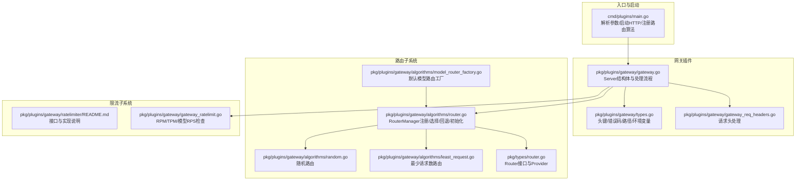
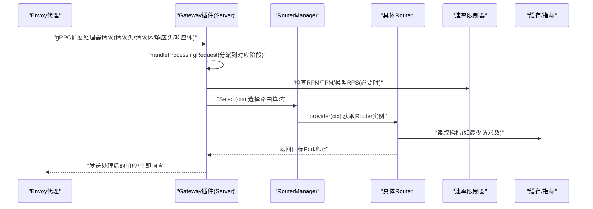
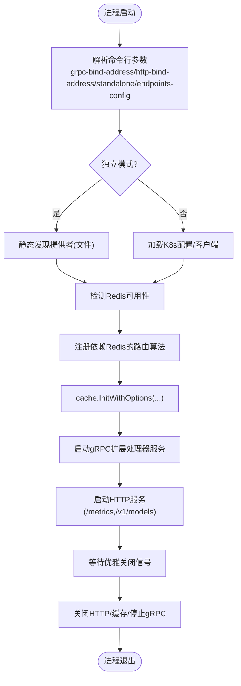
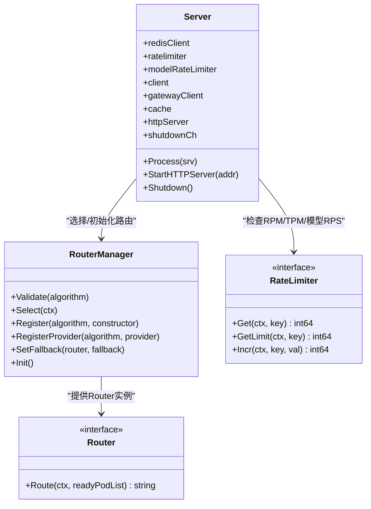
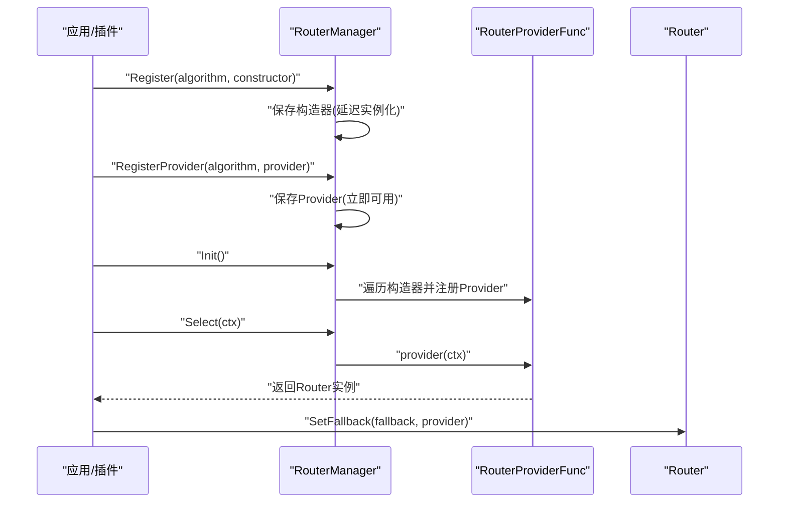
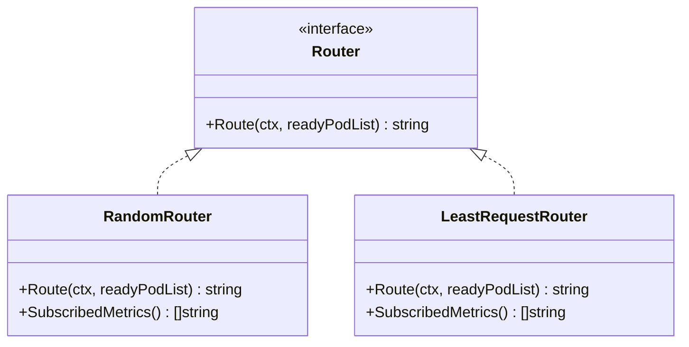
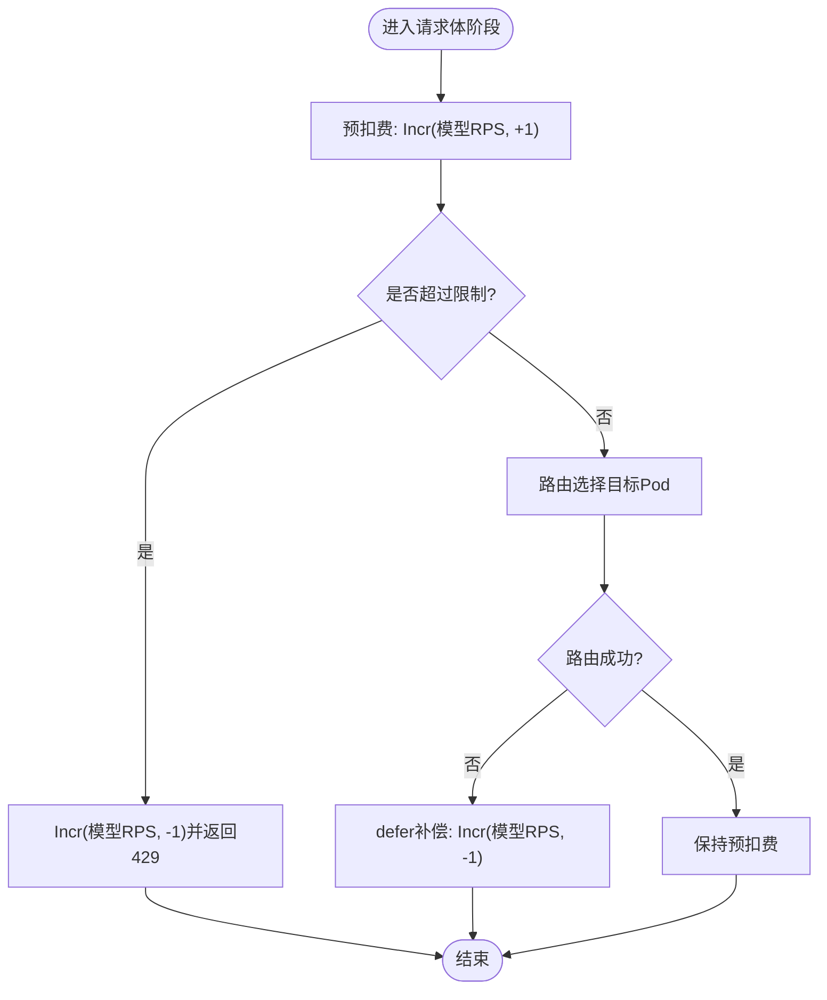
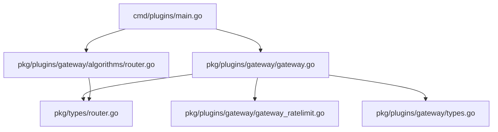

# 插件开发指南

<cite>
**本文引用的文件**
- [cmd/plugins/main.go](file://cmd/plugins/main.go)
- [pkg/plugins/gateway/gateway.go](file://pkg/plugins/gateway/gateway.go)
- [pkg/plugins/gateway/types.go](file://pkg/plugins/gateway/types.go)
- [pkg/plugins/gateway/gateway_req_headers.go](file://pkg/plugins/gateway/gateway_req_headers.go)
- [pkg/plugins/gateway/algorithms/router.go](file://pkg/plugins/gateway/algorithms/router.go)
- [pkg/plugins/gateway/algorithms/model_router_factory.go](file://pkg/plugins/gateway/algorithms/model_router_factory.go)
- [pkg/plugins/gateway/algorithms/random.go](file://pkg/plugins/gateway/algorithms/random.go)
- [pkg/plugins/gateway/algorithms/least_request.go](file://pkg/plugins/gateway/algorithms/least_request.go)
- [pkg/plugins/gateway/ratelimiter/README.md](file://pkg/plugins/gateway/ratelimiter/README.md)
- [pkg/plugins/gateway/gateway_ratelimit.go](file://pkg/plugins/gateway/gateway_ratelimit.go)
- [pkg/types/router.go](file://pkg/types/router.go)
- [apps/console/api/config/config.go](file://apps/console/api/config/config.go)
</cite>

## 目录
1. [简介](#简介)
2. [项目结构](#项目结构)
3. [核心组件](#核心组件)
4. [架构总览](#架构总览)
5. [详细组件分析](#详细组件分析)
6. [依赖分析](#依赖分析)
7. [性能考虑](#性能考虑)
8. [故障排查指南](#故障排查指南)
9. [结论](#结论)
10. [附录](#附录)

## 简介
本指南面向AIBrix网关插件开发者，系统性阐述插件系统的整体架构与生命周期管理（注册、初始化、运行时管理、销毁），并给出插件接口通用规范、参数传递与错误处理、状态管理、最佳实践（性能优化、内存管理、并发安全、错误恢复）、配置与参数传递机制（含环境变量）、插件间数据交换格式，以及从Hello World到复杂功能插件的完整开发示例与调试测试方法。

## 项目结构
AIBrix网关插件位于pkg/plugins/gateway目录，核心由以下模块构成：
- 网关服务器：负责gRPC扩展处理器服务、HTTP指标与模型列表服务、请求/响应阶段处理。
- 路由器管理：统一注册、选择与初始化路由算法，支持回退策略。
- 路由算法：内置多种路由策略（如随机、最少请求数等），可扩展新算法。
- 速率限制：基于Redis的分布式固定窗口计数器，支持用户级与模型级配额。
- 类型与常量：定义路由上下文、路由器接口、HTTP头键、OpenAI错误类型与路径等。

**图表来源**
- [cmd/plugins/main.go:54-198](file://cmd/plugins/main.go#L54-L198)
- [pkg/plugins/gateway/gateway.go:94-121](file://pkg/plugins/gateway/gateway.go#L94-L121)
- [pkg/plugins/gateway/algorithms/router.go:41-153](file://pkg/plugins/gateway/algorithms/router.go#L41-L153)
- [pkg/plugins/gateway/algorithms/model_router_factory.go:18](file://pkg/plugins/gateway/algorithms/model_router_factory.go#L18)
- [pkg/plugins/gateway/algorithms/random.go:27-62](file://pkg/plugins/gateway/algorithms/random.go#L27-L62)
- [pkg/plugins/gateway/algorithms/least_request.go:35-233](file://pkg/plugins/gateway/algorithms/least_request.go#L35-L233)
- [pkg/plugins/gateway/types.go:24-122](file://pkg/plugins/gateway/types.go#L24-L122)
- [pkg/plugins/gateway/gateway_req_headers.go:41-126](file://pkg/plugins/gateway/gateway_req_headers.go#L41-L126)
- [pkg/plugins/gateway/ratelimiter/README.md:1-89](file://pkg/plugins/gateway/ratelimiter/README.md#L1-L89)
- [pkg/plugins/gateway/gateway_ratelimit.go:86-113](file://pkg/plugins/gateway/gateway_ratelimit.go#L86-L113)
- [pkg/types/router.go:19-56](file://pkg/types/router.go#L19-L56)

**章节来源**
- [cmd/plugins/main.go:54-198](file://cmd/plugins/main.go#L54-L198)
- [pkg/plugins/gateway/gateway.go:94-121](file://pkg/plugins/gateway/gateway.go#L94-L121)
- [pkg/plugins/gateway/types.go:24-122](file://pkg/plugins/gateway/types.go#L24-L122)

## 核心组件
- 网关Server：封装gRPC扩展处理器、HTTP指标与模型列表、请求/响应阶段处理逻辑；负责路由选择、速率限制、错误生成与指标上报。
- RouterManager：集中式路由算法注册、验证、选择与初始化；支持设置回退路由。
- 路由算法：实现Router接口，按策略选择目标Pod或端口；可实现QueueRouter/FallbackRouter扩展能力。
- 速率限制器：提供用户级RPM/TPM与模型级RPS的原子计数与过载保护。
- 类型与常量：统一的路由上下文、错误头键、OpenAI兼容错误类型与路径定义。

**章节来源**
- [pkg/plugins/gateway/gateway.go:62-121](file://pkg/plugins/gateway/gateway.go#L62-L121)
- [pkg/plugins/gateway/algorithms/router.go:41-153](file://pkg/plugins/gateway/algorithms/router.go#L41-L153)
- [pkg/types/router.go:19-56](file://pkg/types/router.go#L19-L56)
- [pkg/plugins/gateway/ratelimiter/README.md:7-89](file://pkg/plugins/gateway/ratelimiter/README.md#L7-L89)

## 架构总览
AIBrix网关插件通过Envoy扩展处理器（External Processor）在gRPC流中逐阶段处理请求与响应。启动时加载Redis与缓存，注册路由算法，启动HTTP服务暴露指标与模型列表，随后进入gRPC服务循环，按阶段调用请求头、请求体、响应头、响应体处理函数，并根据路由算法选择目标Pod。

**图表来源**
- [pkg/plugins/gateway/gateway.go:123-303](file://pkg/plugins/gateway/gateway.go#L123-L303)
- [pkg/plugins/gateway/algorithms/router.go:73-85](file://pkg/plugins/gateway/algorithms/router.go#L73-L85)
- [pkg/plugins/gateway/gateway_ratelimit.go:86-113](file://pkg/plugins/gateway/gateway_ratelimit.go#L86-L113)

**章节来源**
- [pkg/plugins/gateway/gateway.go:123-303](file://pkg/plugins/gateway/gateway.go#L123-L303)
- [cmd/plugins/main.go:147-152](file://cmd/plugins/main.go#L147-L152)

## 详细组件分析

### 启动与生命周期管理
- 参数解析与模式：支持独立模式与Kubernetes模式，独立模式需提供端点配置文件；Kubernetes模式自动加载集群配置。
- Redis与缓存：优先使用Redis进行速率限制与远程分词器；若不可用，在独立模式下降级为无操作限流器。
- 路由算法注册：启动时注册额外依赖Redis的路由算法，并初始化RouterManager。
- 服务启动：启动gRPC扩展处理器与HTTP服务（指标与/v1/models），监听优雅关闭信号并触发缓存与HTTP服务关闭。

**图表来源**
- [cmd/plugins/main.go:54-198](file://cmd/plugins/main.go#L54-L198)

**章节来源**
- [cmd/plugins/main.go:54-198](file://cmd/plugins/main.go#L54-L198)

### 网关Server与处理流程
- Server结构体：持有Redis客户端、速率限制器、K8s客户端、缓存、HTTP服务与广播关闭通道。
- 处理主循环：接收Envoy请求，按阶段处理并发送响应；在每个阶段记录指标与错误。
- 路由选择：从RoutingContext中选择算法，调用Router.Route获取目标Pod地址；支持外部过滤表达式筛选。
- 错误处理：统一生成OpenAI兼容错误响应，设置错误头键，区分不同错误场景（认证、内部错误、过载等）。

**图表来源**
- [pkg/plugins/gateway/gateway.go:62-121](file://pkg/plugins/gateway/gateway.go#L62-L121)
- [pkg/plugins/gateway/algorithms/router.go:41-153](file://pkg/plugins/gateway/algorithms/router.go#L41-L153)
- [pkg/types/router.go:19-56](file://pkg/types/router.go#L19-L56)
- [pkg/plugins/gateway/ratelimiter/README.md:7-89](file://pkg/plugins/gateway/ratelimiter/README.md#L7-L89)

**章节来源**
- [pkg/plugins/gateway/gateway.go:62-121](file://pkg/plugins/gateway/gateway.go#L62-L121)
- [pkg/plugins/gateway/gateway.go:333-360](file://pkg/plugins/gateway/gateway.go#L333-L360)

### 路由器管理与算法
- RouterManager：线程安全地维护算法构造器与工厂映射；支持初始化批量注册、回退路由设置与超时控制。
- 算法注册：支持两种方式——构造器注册（带错误处理）与Provider注册（直接提供工厂函数）。
- 算法选择：根据RoutingContext中的算法名选择Provider并实例化Router；不支持时回退到随机算法。
- 回退策略：仅对实现FallbackRouter的Router生效，需在RouterManager初始化完成后设置。

**图表来源**
- [pkg/plugins/gateway/algorithms/router.go:87-153](file://pkg/plugins/gateway/algorithms/router.go#L87-L153)
- [pkg/plugins/gateway/algorithms/model_router_factory.go:18](file://pkg/plugins/gateway/algorithms/model_router_factory.go#L18)

**章节来源**
- [pkg/plugins/gateway/algorithms/router.go:41-153](file://pkg/plugins/gateway/algorithms/router.go#L41-L153)
- [pkg/plugins/gateway/algorithms/model_router_factory.go:18](file://pkg/plugins/gateway/algorithms/model_router_factory.go#L18)

### 内置路由算法示例
- 随机路由：随机选择就绪Pod，适合简单场景或作为回退。
- 最少请求数路由：基于缓存指标选择运行中请求数最少的Pod或端口；无有效指标时回退到随机选择。

**图表来源**
- [pkg/plugins/gateway/algorithms/random.go:27-62](file://pkg/plugins/gateway/algorithms/random.go#L27-L62)
- [pkg/plugins/gateway/algorithms/least_request.go:35-233](file://pkg/plugins/gateway/algorithms/least_request.go#L35-L233)
- [pkg/types/router.go:19-56](file://pkg/types/router.go#L19-L56)

**章节来源**
- [pkg/plugins/gateway/algorithms/random.go:27-62](file://pkg/plugins/gateway/algorithms/random.go#L27-L62)
- [pkg/plugins/gateway/algorithms/least_request.go:35-233](file://pkg/plugins/gateway/algorithms/least_request.go#L35-L233)

### 速率限制与配额控制
- 接口与实现：提供Get/GetLimit/Incr三类方法，支持Redis固定窗口计数与无操作实现。
- 用户级限制：RPM（每分钟请求）与TPM（每分钟令牌），用于全局速率控制。
- 模型级限制：每模型RPS（每秒请求），通过配置文件profile启用。
- 强制执行流程：预扣费（原子自增）→失败则回滚→成功后补偿禁用；确保无竞争条件导致超额。

**图表来源**
- [pkg/plugins/gateway/ratelimiter/README.md:77-88](file://pkg/plugins/gateway/ratelimiter/README.md#L77-L88)
- [pkg/plugins/gateway/gateway_ratelimit.go:86-113](file://pkg/plugins/gateway/gateway_ratelimit.go#L86-L113)

**章节来源**
- [pkg/plugins/gateway/ratelimiter/README.md:7-89](file://pkg/plugins/gateway/ratelimiter/README.md#L7-L89)
- [pkg/plugins/gateway/gateway_ratelimit.go:86-113](file://pkg/plugins/gateway/gateway_ratelimit.go#L86-L113)

### 请求头处理与上下文
- 请求头解析：提取用户、路径、鉴权、内容类型、会话ID、外部过滤表达式、路由策略、配置文件等。
- 用户与限额：当存在用户名且Redis可用时，查询用户并检查RPM/TPM；失败时返回内部错误并设置相应错误头。
- 路由上下文：构建RoutingContext，填充请求路径、头键值、配置文件名等，供后续阶段使用。

**章节来源**
- [pkg/plugins/gateway/gateway_req_headers.go:41-126](file://pkg/plugins/gateway/gateway_req_headers.go#L41-L126)
- [pkg/plugins/gateway/types.go:24-122](file://pkg/plugins/gateway/types.go#L24-L122)

## 依赖分析
- 入口依赖：gRPC、HTTP、Kubernetes客户端、Redis、缓存与指标库。
- 网关依赖：RouterManager、Router接口族、速率限制器接口、类型与工具集。
- 路由算法：依赖缓存指标与工具集进行Pod筛选与随机选择。
- 限流实现：依赖Redis管道原子性保证与时间桶轮转。

**图表来源**
- [cmd/plugins/main.go:19-44](file://cmd/plugins/main.go#L19-L44)
- [pkg/plugins/gateway/gateway.go:19-52](file://pkg/plugins/gateway/gateway.go#L19-L52)
- [pkg/plugins/gateway/algorithms/router.go:19-28](file://pkg/plugins/gateway/algorithms/router.go#L19-L28)
- [pkg/types/router.go:19-56](file://pkg/types/router.go#L19-L56)
- [pkg/plugins/gateway/gateway_ratelimit.go:86-113](file://pkg/plugins/gateway/gateway_ratelimit.go#L86-L113)
- [pkg/plugins/gateway/types.go:24-122](file://pkg/plugins/gateway/types.go#L24-L122)

**章节来源**
- [cmd/plugins/main.go:19-44](file://cmd/plugins/main.go#L19-L44)
- [pkg/plugins/gateway/gateway.go:19-52](file://pkg/plugins/gateway/gateway.go#L19-L52)

## 性能考虑
- 并发与锁：RouterManager使用读写锁保护算法注册表，避免竞态；建议在初始化阶段完成注册，运行期尽量只做选择。
- 指标访问：最少请求数路由依赖缓存指标，多实例部署时建议收敛到单一领导者或引入跨实例状态同步。
- 随机选择：随机路由避免热点，但缺乏负载感知；在高并发场景建议使用最少请求数或更智能的指标路由。
- 限流原子性：Redis固定窗口计数通过单次管道操作保证原子性，减少往返开销；合理设置窗口大小与桶数量。
- 序列化与错误：错误响应采用JSON格式，注意Content-Type设置与错误头键一致性，避免重复序列化。

[本节为通用指导，无需特定文件引用]

## 故障排查指南
- 启动失败
  - 独立模式缺少端点配置：检查--endpoints-config参数。
  - Kubernetes模式缺少Redis：在K8s模式下必须提供Redis。
  - gRPC/HTTP监听失败：确认绑定地址未被占用。
- 运行期错误
  - 收包/发包错误：查看gRPC错误码与消息，结合指标与日志定位。
  - 路由失败：确认RoutingContext算法名有效，检查RouterManager初始化是否完成。
  - 速率限制异常：检查Redis连通性与窗口配置；关注预扣费与补偿逻辑。
- 常见问题
  - 无就绪Pod：检查Pod健康状态与标签选择器过滤。
  - HTTP路由状态异常：在非PD算法下校验HTTPRoute状态，确保Accepted与ResolvedRefs条件满足。
  - 错误响应不一致：核对错误头键与OpenAI错误类型/代码映射。

**章节来源**
- [cmd/plugins/main.go:75-78](file://cmd/plugins/main.go#L75-L78)
- [pkg/plugins/gateway/gateway.go:181-236](file://pkg/plugins/gateway/gateway.go#L181-L236)
- [pkg/plugins/gateway/gateway.go:362-397](file://pkg/plugins/gateway/gateway.go#L362-L397)
- [pkg/plugins/gateway/gateway.go:480-507](file://pkg/plugins/gateway/gateway.go#L480-L507)

## 结论
AIBrix网关插件通过清晰的生命周期管理、可扩展的路由算法体系与严格的速率限制机制，提供了稳定高效的推理服务接入层。开发者应遵循接口规范、正确传递参数与状态、重视错误处理与指标上报，并结合环境变量与配置文件实现灵活部署与运维。

[本节为总结，无需特定文件引用]

## 附录

### 插件接口通用规范与实现要求
- 接口定义
  - Router：实现Route(ctx, readyPodList)选择目标Pod或端口。
  - QueueRouter：扩展长度查询能力，适用于内置队列的路由。
  - FallbackRouter：支持设置回退算法与Provider。
- 参数传递
  - RoutingContext包含模型、路径、头键、配置文件名、会话ID等；通过头键传递路由策略与外部过滤表达式。
  - 速率限制参数通过配置文件profile与请求头组合生效。
- 错误处理
  - 使用统一错误响应生成器，设置Content-Type与OpenAI兼容错误字段。
  - 区分认证、内部错误、过载等场景，设置相应错误头键。
- 状态管理
  - 路由算法注册与初始化需在Server启动前完成；回退设置需在RouterManager初始化完成后进行。
  - 速率限制器在Redis可用时启用，否则降级为无操作实现。

**章节来源**
- [pkg/types/router.go:19-56](file://pkg/types/router.go#L19-L56)
- [pkg/plugins/gateway/types.go:24-122](file://pkg/plugins/gateway/types.go#L24-L122)
- [pkg/plugins/gateway/gateway.go:474-507](file://pkg/plugins/gateway/gateway.go#L474-L507)

### 插件开发最佳实践
- 性能优化
  - 将路由算法注册集中在初始化阶段，运行期避免频繁注册/注销。
  - 使用原子计数与固定窗口减少网络往返与竞争条件。
- 内存管理
  - 路由算法内部避免持有大对象引用；及时释放临时缓冲区。
- 并发安全
  - 使用读写锁保护共享注册表；避免在热路径上进行阻塞操作。
- 错误恢复
  - 在路由失败时快速回退到随机算法；在速率限制失败时进行补偿回滚。
- 可观测性
  - 记录关键指标与错误头键，便于监控与排障。

**章节来源**
- [pkg/plugins/gateway/algorithms/router.go:41-153](file://pkg/plugins/gateway/algorithms/router.go#L41-L153)
- [pkg/plugins/gateway/ratelimiter/README.md:77-88](file://pkg/plugins/gateway/ratelimiter/README.md#L77-L88)

### 插件配置与参数传递机制
- 环境变量
  - ROUTING_ALGORITHM：默认路由算法名（通过头键传入）。
  - 缓存与远程分词器开关：通过环境变量控制KV事件同步与远程分词器启用。
  - 控制台配置：AUTH_MODE、SESSION_SECRET、SECRETS_ENCRYPTION_KEY等用于认证与安全。
- 请求头键
  - 路由策略、配置文件、会话ID、外部过滤表达式、目标Pod/IP等。
- 数据交换格式
  - 请求/响应头键与错误响应遵循OpenAI兼容格式，便于前端与SDK适配。

**章节来源**
- [pkg/plugins/gateway/types.go:76-122](file://pkg/plugins/gateway/types.go#L76-L122)
- [apps/console/api/config/config.go:125-218](file://apps/console/api/config/config.go#L125-L218)

### 开发示例
- Hello World插件（最小化）
  - 步骤：实现Router接口的最简实现（例如固定返回某Pod），在init中通过RegisterProvider注册；在main中调用routing.Init()。
  - 关注点：确保路由算法名称唯一，正确设置目标Pod与端口，处理空集合与错误。
- 复杂功能插件（基于指标的最少请求数路由）
  - 步骤：实现Router接口，读取缓存指标计算候选Pod，无指标时回退到随机；在init中通过Register注册构造器。
  - 关注点：多端口Pod的特殊处理、错误日志与指标打印、回退策略设置。
- 速率限制插件（模型级RPS）
  - 步骤：在Server中启用模型级速率限制器，实现预扣费与补偿逻辑；在配置文件profile中设置requestsPerSecond。
  - 关注点：原子计数与窗口轮转、失败回滚与成功补偿、错误响应生成。

**章节来源**
- [pkg/plugins/gateway/algorithms/random.go:27-62](file://pkg/plugins/gateway/algorithms/random.go#L27-L62)
- [pkg/plugins/gateway/algorithms/least_request.go:35-233](file://pkg/plugins/gateway/algorithms/least_request.go#L35-L233)
- [pkg/plugins/gateway/ratelimiter/README.md:77-88](file://pkg/plugins/gateway/ratelimiter/README.md#L77-L88)

### 调试与测试方法
- 调试
  - 启用pprof：本地启动HTTP服务监听6060端口，使用go tool pprof分析CPU/内存。
  - 日志：使用klog输出关键事件与错误，结合指标定位问题。
- 测试
  - 单元测试：针对路由算法与速率限制器的关键分支进行断言。
  - 集成测试：模拟Envoy扩展处理器流，覆盖请求头/请求体/响应头/响应体各阶段。
  - E2E测试：结合K8s与Redis，验证路由、限流与错误处理端到端行为。

**章节来源**
- [cmd/plugins/main.go:175-179](file://cmd/plugins/main.go#L175-L179)
- [pkg/plugins/gateway/gateway_test.go:45-83](file://pkg/plugins/gateway/gateway_test.go#L45-L83)