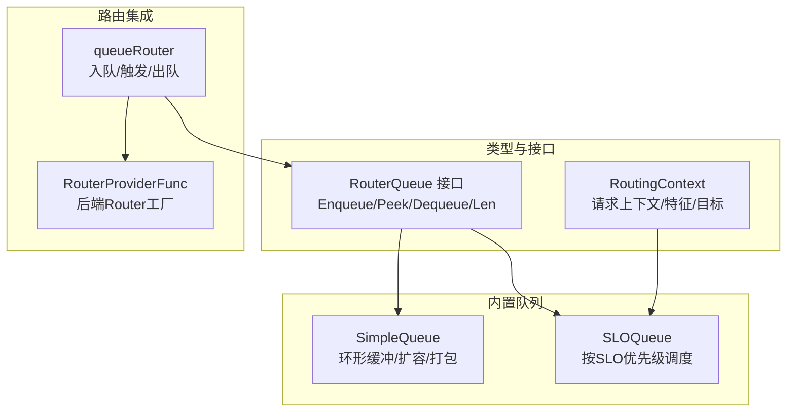
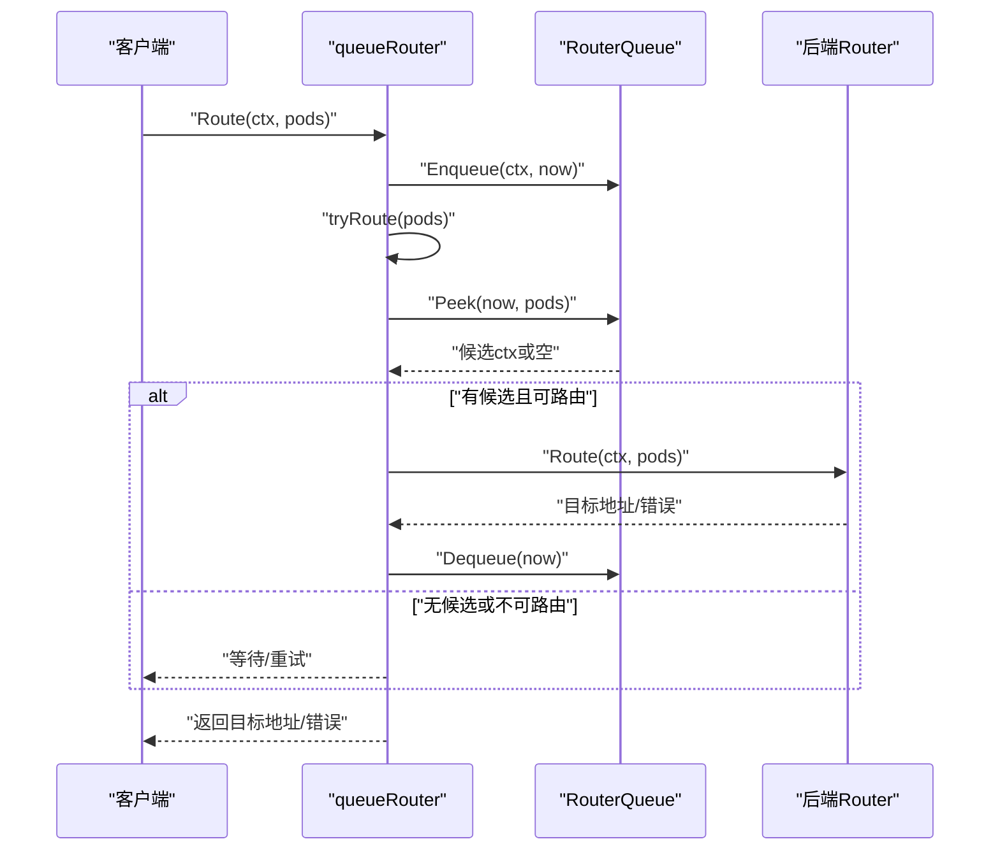
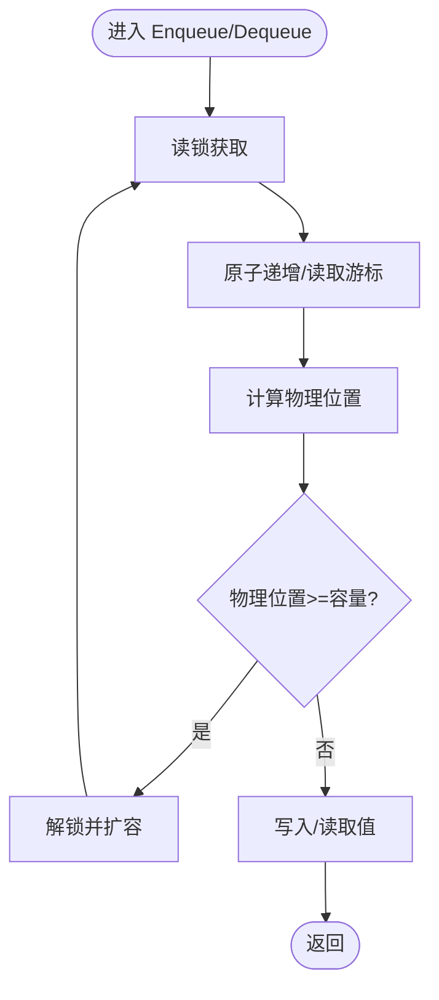
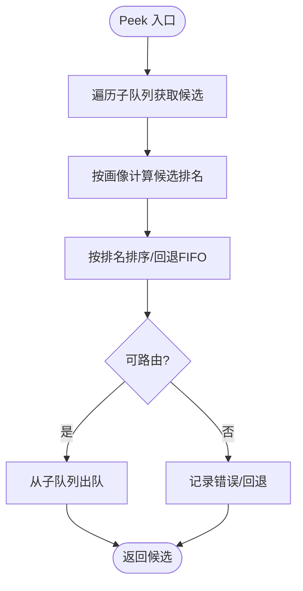
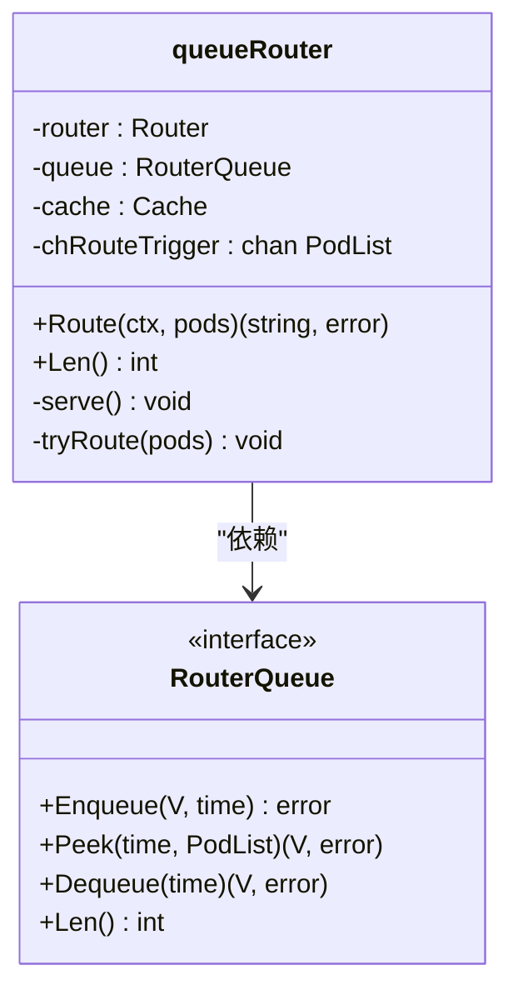
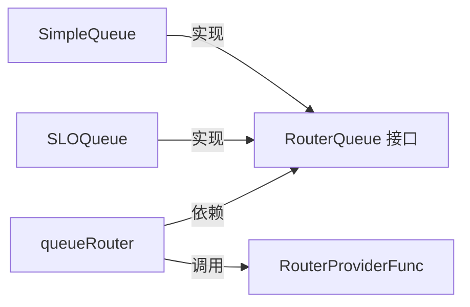

# 请求队列插件

<cite>
**本文引用的文件**
- [simple_queue.go](file://pkg/plugins/gateway/queue/simple_queue.go)
- [slo_queue.go](file://pkg/plugins/gateway/queue/slo_queue.go)
- [router_queue.go](file://pkg/types/router_queue.go)
- [queue_router.go](file://pkg/plugins/gateway/algorithms/queue_router.go)
- [router_context.go](file://pkg/types/router_context.go)
- [router.go](file://pkg/plugins/gateway/algorithms/router.go)
- [simple_queue_test.go](file://pkg/plugins/gateway/queue/simple_queue_test.go)
- [queue_test.go](file://pkg/plugins/gateway/queue/queue_test.go)
</cite>

## 目录
1. [简介](#简介)
2. [项目结构](#项目结构)
3. [核心组件](#核心组件)
4. [架构总览](#架构总览)
5. [详细组件分析](#详细组件分析)
6. [依赖分析](#依赖分析)
7. [性能考虑](#性能考虑)
8. [故障排查指南](#故障排查指南)
9. [结论](#结论)
10. [附录](#附录)

## 简介
本文件为 AIBrix 请求队列插件的详细 API 文档，聚焦于 Queue 接口设计与实现规范，涵盖请求排队、优先级调度、超时处理、内置队列插件（SimpleQueue 与 SLOQueue）的差异与适用场景、队列配置参数、容量管理与内存优化、并发处理机制、自定义队列插件开发指南、性能调优策略、队列状态监控与统计方法，以及队列与路由算法、速率限制的协作机制。

## 项目结构
队列插件位于网关插件子系统中，核心接口与实现如下：
- 类型与接口：RouterQueue 接口定义了通用的排队能力；RoutingContext 提供请求上下文与特征提取。
- 内置队列：SimpleQueue 实现无锁环形缓冲扩容与物理地址映射；SLOQueue 基于 GPU 配置画像进行 SLO 优先级调度。
- 路由集成：queueRouter 将队列与后端 Router 解耦，通过异步触发完成“入队—候选选择—出队”的流程。
- 测试：覆盖基本操作、扩展与打包、并发一致性、边界条件等。

**图表来源**
- [router_queue.go:30-35](file://pkg/types/router_queue.go#L30-L35)
- [router_context.go:59-105](file://pkg/types/router_context.go#L59-L105)
- [simple_queue.go:33-42](file://pkg/plugins/gateway/queue/simple_queue.go#L33-L42)
- [slo_queue.go:80-92](file://pkg/plugins/gateway/queue/slo_queue.go#L80-L92)
- [queue_router.go:47-70](file://pkg/plugins/gateway/algorithms/queue_router.go#L47-L70)

**章节来源**
- [router_queue.go:24-35](file://pkg/types/router_queue.go#L24-L35)
- [router_context.go:59-105](file://pkg/types/router_context.go#L59-L105)
- [simple_queue.go:33-55](file://pkg/plugins/gateway/queue/simple_queue.go#L33-L55)
- [slo_queue.go:80-109](file://pkg/plugins/gateway/queue/slo_queue.go#L80-L109)
- [queue_router.go:47-70](file://pkg/plugins/gateway/algorithms/queue_router.go#L47-L70)

## 核心组件
- RouterQueue 接口：统一的排队抽象，支持入队、窥视（不移除）、出队与长度查询。
- SimpleQueue：泛型无锁环形缓冲队列，基于逻辑游标与物理地址映射，自动扩容与低利用率时打包回收。
- SLOQueue：按 GPU 模型画像的 SLO 优先级调度队列，支持多子队列按请求特征分组，候选生成与路由决策。
- queueRouter：队列路由器，负责将请求入队、触发候选选择、调用后端 Router 并在成功后出队。
- RoutingContext：请求上下文，提供特征提取（提示词与输出长度）、目标 Pod 设置与错误传播。

**章节来源**
- [router_queue.go:30-35](file://pkg/types/router_queue.go#L30-L35)
- [simple_queue.go:33-55](file://pkg/plugins/gateway/queue/simple_queue.go#L33-L55)
- [slo_queue.go:80-109](file://pkg/plugins/gateway/queue/slo_queue.go#L80-L109)
- [queue_router.go:47-70](file://pkg/plugins/gateway/algorithms/queue_router.go#L47-L70)
- [router_context.go:59-105](file://pkg/types/router_context.go#L59-L105)

## 架构总览
队列与路由的协作流程如下：客户端请求到达后，queueRouter 先将请求入队，随后通过通道触发内部循环尝试 Peek 候选，交由后端 Router 进行目标选择，最后在成功后从对应子队列出队。

**图表来源**
- [queue_router.go:72-146](file://pkg/plugins/gateway/algorithms/queue_router.go#L72-L146)
- [router_queue.go:30-35](file://pkg/types/router_queue.go#L30-L35)

**章节来源**
- [queue_router.go:72-146](file://pkg/plugins/gateway/algorithms/queue_router.go#L72-L146)

## 详细组件分析

### SimpleQueue 组件分析
- 设计要点
  - 使用原子游标与读写锁保护，避免锁竞争。
  - 逻辑游标与物理地址映射，支持 O(1) 访问与扩容。
  - 扩容策略：当使用率超过一半时倍增容量并复制元素；低使用率时打包并零值回收，减少内存占用。
  - 不支持零值入队，防止与“空队列”语义混淆。
- 关键方法
  - Enqueue：原子递增入队游标，定位物理位置，必要时触发扩容。
  - Peek/Dequeue：循环检查游标，若值为空则让出 CPU 并重试，保证可见性。
  - Len/Cap：读取原子计数与底层数组容量。
  - expand：根据使用率决定扩容或打包回收，并更新基游标。
- 并发模型
  - 多个生产者/消费者可并发运行，Peek/Dequeue 在空值时主动让出 CPU，降低争用。
- 性能特性
  - 均摊 O(1) 入队/出队；扩容时 O(n) 复制，但频率较低。
  - 低使用率时通过打包回收减少内存碎片。

**图表来源**
- [simple_queue.go:57-75](file://pkg/plugins/gateway/queue/simple_queue.go#L57-L75)
- [simple_queue.go:104-151](file://pkg/plugins/gateway/queue/simple_queue.go#L104-L151)
- [simple_queue.go:172-218](file://pkg/plugins/gateway/queue/simple_queue.go#L172-L218)

**章节来源**
- [simple_queue.go:33-55](file://pkg/plugins/gateway/queue/simple_queue.go#L33-L55)
- [simple_queue.go:57-75](file://pkg/plugins/gateway/queue/simple_queue.go#L57-L75)
- [simple_queue.go:77-151](file://pkg/plugins/gateway/queue/simple_queue.go#L77-L151)
- [simple_queue.go:153-165](file://pkg/plugins/gateway/queue/simple_queue.go#L153-L165)
- [simple_queue.go:167-179](file://pkg/plugins/gateway/queue/simple_queue.go#L167-L179)
- [simple_queue.go:172-218](file://pkg/plugins/gateway/queue/simple_queue.go#L172-L218)

### SLOQueue 组件分析
- 设计要点
  - 按请求特征（提示词长度、预测输出长度）对子队列分组，使用 sync.Pool 复用子队列。
  - Peek 时遍历所有子队列，基于 GPU 模型画像计算候选“排名”，优先选择最可能满足 SLO 的请求。
  - 支持多种 SLO 指标：E2E、TTFT、TPAT、TPOT，按可用指标动态选择。
  - 当无画像或违反 SLO 时，回退到 FIFO 或标记错误，确保系统稳定。
  - 最终路由由后端 RouterProviderFunc 提供的 Router 完成。
- 关键方法
  - Enqueue：获取 OutputPredictor，按特征生成子队列键，入队到对应子队列。
  - Peek：收集各子队列候选，计算每个部署的画像排名，排序后尝试路由；支持单/多 GPU 部署策略。
  - Dequeue：需先调用 Peek，记录候选子队列键后从该子队列出队。
  - Len：汇总所有子队列长度。
  - Route/LastError：在 Peek 未路由时提供错误信息，便于上层处理。
- 参数与策略
  - 特征分桶：对特征取对数后拼接作为子队列键，平衡不同规模请求。
  - 排名函数：综合等待时间、队列服务时间与目标 SLO，越小越优。
  - 回退策略：无画像或违反 SLO 时回退 FIFO 或记录错误。
- 适用场景
  - 对延迟敏感、需要保障端到端时延或首字节时间的服务。
  - 多 GPU 部署、不同硬件配置下存在显著吞吐差异的场景。

**图表来源**
- [slo_queue.go:137-300](file://pkg/plugins/gateway/queue/slo_queue.go#L137-L300)
- [slo_queue.go:302-335](file://pkg/plugins/gateway/queue/slo_queue.go#L302-L335)
- [slo_queue.go:375-468](file://pkg/plugins/gateway/queue/slo_queue.go#L375-L468)

**章节来源**
- [slo_queue.go:80-109](file://pkg/plugins/gateway/queue/slo_queue.go#L80-L109)
- [slo_queue.go:111-135](file://pkg/plugins/gateway/queue/slo_queue.go#L111-L135)
- [slo_queue.go:137-300](file://pkg/plugins/gateway/queue/slo_queue.go#L137-L300)
- [slo_queue.go:302-335](file://pkg/plugins/gateway/queue/slo_queue.go#L302-L335)
- [slo_queue.go:368-373](file://pkg/plugins/gateway/queue/slo_queue.go#L368-L373)
- [slo_queue.go:375-468](file://pkg/plugins/gateway/queue/slo_queue.go#L375-L468)

### queueRouter 组件分析
- 设计要点
  - 将入队与路由解耦：Route(ctx, pods) 仅入队，实际路由在后台 goroutine 中执行。
  - 通过带缓冲通道触发路由循环，避免阻塞主路径。
  - 在每次路由后更新缓存计数，确保实时指标一致。
- 关键方法
  - Route：入队、触发路由、等待目标 Pod 或错误。
  - Len：委托队列查询当前长度。
  - serve：循环从通道接收 pods，Peek 候选、调用 Router、Dequeue。
- 协作关系
  - 依赖 RouterQueue 提供排队顺序（FIFO 或 SLO）。
  - 依赖 RouterProviderFunc 获取后端 Router。

**图表来源**
- [queue_router.go:47-70](file://pkg/plugins/gateway/algorithms/queue_router.go#L47-L70)
- [queue_router.go:72-146](file://pkg/plugins/gateway/algorithms/queue_router.go#L72-L146)
- [router_queue.go:30-35](file://pkg/types/router_queue.go#L30-L35)

**章节来源**
- [queue_router.go:47-70](file://pkg/plugins/gateway/algorithms/queue_router.go#L47-L70)
- [queue_router.go:72-146](file://pkg/plugins/gateway/algorithms/queue_router.go#L72-L146)

### RoutingContext 组件分析
- 设计要点
  - 提供请求生命周期关键字段：模型、消息、用户、请求时间、路由耗时、目标 Pod/端口、错误等。
  - 支持特征提取（提示词与输出长度），用于 SLOQueue 的子队列分组与排名。
  - 目标 Pod 设置采用原子指针与通道通知，实现异步等待与取消。
- 关键方法
  - Features/PromptLength/TokenLength：特征与长度计算。
  - SetTargetPod/SetError/TargetPod/TargetAddress：目标设置与等待。
  - HasRouted/HasError：状态判断。
- 与队列协作
  - SLOQueue 在 Peek 时使用 Features 计算排名；queueRouter 在路由成功后更新缓存计数。

**章节来源**
- [router_context.go:59-105](file://pkg/types/router_context.go#L59-L105)
- [router_context.go:178-192](file://pkg/types/router_context.go#L178-L192)
- [router_context.go:194-211](file://pkg/types/router_context.go#L194-L211)
- [router_context.go:213-258](file://pkg/types/router_context.go#L213-L258)
- [router_context.go:303-309](file://pkg/types/router_context.go#L303-L309)

## 依赖分析
- 接口耦合
  - queueRouter 依赖 RouterQueue 接口，实现与具体队列（SimpleQueue/SLOQueue）解耦。
  - SLOQueue 依赖 RouterQueue 子队列接口与 RouterProviderFunc。
- 数据流
  - 请求从 queueRouter 进入 RouterQueue，再由 queueRouter 触发后端 Router，最终出队。
- 可能的循环依赖
  - 代码中未发现直接循环依赖；queueRouter 仅持有接口，不持有具体实现。

**图表来源**
- [queue_router.go:47-70](file://pkg/plugins/gateway/algorithms/queue_router.go#L47-L70)
- [router_queue.go:30-35](file://pkg/types/router_queue.go#L30-L35)
- [slo_queue.go:80-109](file://pkg/plugins/gateway/queue/slo_queue.go#L80-L109)

**章节来源**
- [queue_router.go:47-70](file://pkg/plugins/gateway/algorithms/queue_router.go#L47-L70)
- [router_queue.go:30-35](file://pkg/types/router_queue.go#L30-L35)
- [slo_queue.go:80-109](file://pkg/plugins/gateway/queue/slo_queue.go#L80-L109)

## 性能考虑
- 扩容与打包
  - SimpleQueue 在使用率高时倍增容量，低使用率时打包回收，减少内存占用。
  - SLOQueue 通过子队列池复用，避免频繁分配。
- 并发与锁粒度
  - SimpleQueue 使用读写锁与原子游标，降低锁竞争；Peek/Dequeue 在空值时让出 CPU。
  - queueRouter 后台 goroutine 串行化路由，避免并发冲突。
- 排序与回退
  - SLOQueue 在候选较多时进行排序，建议控制候选数量（初始子队列大小与候选池大小）以降低排序开销。
- 指标与画像
  - SLOQueue 依赖 GPU 模型画像，画像缺失或异常会触发回退策略，建议确保画像数据准确与及时更新。

[本节为通用性能讨论，无需特定文件来源]

## 故障排查指南
- 常见错误
  - 队列为空：Peek/Dequeue 返回“队列为空”错误。
  - 零值入队：SimpleQueue 不支持零值入队，返回相应错误。
  - 未先 Peek 直接 Dequeue：SLOQueue 报错提示需先 Peek。
- 日志与调试
  - SLOQueue 在调试级别输出子队列统计与候选详情，便于定位问题。
  - queueRouter 在路由循环中记录 Peek/Dequeue 错误，便于定位队列或后端 Router 异常。
- 并发一致性
  - SimpleQueue 的并发测试覆盖了大量场景，可参考测试用例定位并发问题。
- 建议排查步骤
  - 检查队列容量与使用率，确认是否触发扩容或打包。
  - 检查 SLO 画像是否可用，确认回退逻辑是否生效。
  - 查看路由通道是否被正确触发，确认后台 goroutine 是否正常运行。

**章节来源**
- [simple_queue.go:29-31](file://pkg/plugins/gateway/queue/simple_queue.go#L29-L31)
- [simple_queue.go:86-88](file://pkg/plugins/gateway/queue/simple_queue.go#L86-L88)
- [slo_queue.go:303-305](file://pkg/plugins/gateway/queue/slo_queue.go#L303-L305)
- [simple_queue_test.go:69-77](file://pkg/plugins/gateway/queue/simple_queue_test.go#L69-L77)
- [simple_queue_test.go:274-286](file://pkg/plugins/gateway/queue/simple_queue_test.go#L274-L286)
- [queue_router.go:115-144](file://pkg/plugins/gateway/algorithms/queue_router.go#L115-L144)

## 结论
AIBrix 请求队列插件通过 RouterQueue 接口实现了与路由算法的解耦，内置 SimpleQueue 提供高效的基础排队能力，SLOQueue 则在多 GPU 场景下结合模型画像实现 SLO 优先级调度。queueRouter 将入队、候选选择与出队流程异步化，配合后端 Router 完成目标选择。整体设计兼顾性能、可扩展性与可观测性，适用于高并发与低延迟的推理网关场景。

[本节为总结性内容，无需特定文件来源]

## 附录

### API 规范与配置参数
- RouterQueue 接口
  - 方法：Enqueue(V, time)，Peek(time, PodList)，Dequeue(time)，Len()。
  - 默认容量：DefaultQueueCapacity。
- SimpleQueue
  - 初始化：NewSimpleQueue(initialCapacity)；容量小于 1 时使用默认容量。
  - 行为：不支持零值；入队/出队均摊 O(1)；低使用率时打包回收。
- SLOQueue
  - 初始化：NewSLOQueue(provider, modelName)。
  - 特征分组：对数分桶后拼接作为子队列键。
  - 排名函数：综合等待时间、队列服务时间与目标 SLO。
  - 回退策略：无画像或违反 SLO 时回退 FIFO 或记录错误。
- queueRouter
  - 构造：NewQueueRouter(backend, queue)。
  - 行为：入队后触发后台路由循环；路由成功后出队。
- RoutingContext
  - 特征：Features()、PromptLength()、TokenLength()。
  - 目标：SetTargetPod()/TargetPod()/TargetAddress()。
  - 错误：SetError()/GetError()。

**章节来源**
- [router_queue.go:24-35](file://pkg/types/router_queue.go#L24-L35)
- [simple_queue.go:44-55](file://pkg/plugins/gateway/queue/simple_queue.go#L44-L55)
- [slo_queue.go:94-109](file://pkg/plugins/gateway/queue/slo_queue.go#L94-L109)
- [queue_router.go:54-70](file://pkg/plugins/gateway/algorithms/queue_router.go#L54-L70)
- [router_context.go:178-192](file://pkg/types/router_context.go#L178-L192)
- [router_context.go:194-211](file://pkg/types/router_context.go#L194-L211)
- [router_context.go:213-258](file://pkg/types/router_context.go#L213-L258)

### 自定义队列插件开发指南
- 实现 RouterQueue 接口
  - 确保 Enqueue/Peek/Dequeue/Len 的线程安全与幂等。
  - 明确空队列与错误语义，返回与现有错误保持一致。
- 与 queueRouter 协作
  - 遵循“先 Peek 再 Dequeue”的调用约定（SLOQueue）。
  - 在 Dequeue 成功后，确保后续路由成功。
- 与后端 Router 集成
  - 通过 RouterProviderFunc 注册后端 Router，确保在 Peek/Dequeue 后能正确路由。
- 性能与可观测性
  - 提供 Len 查询以便上层监控。
  - 在关键路径添加日志或指标，便于排障。

**章节来源**
- [router_queue.go:30-35](file://pkg/types/router_queue.go#L30-L35)
- [slo_queue.go:302-312](file://pkg/plugins/gateway/queue/slo_queue.go#L302-L312)
- [router.go:87-113](file://pkg/plugins/gateway/algorithms/router.go#L87-L113)

### 队列状态监控与统计
- 队列长度：通过 RouterQueue.Len() 获取当前排队请求数量。
- 子队列统计：SLOQueue 在调试级别输出各子队列长度与候选详情。
- 缓存计数：queueRouter 在路由成功后更新缓存计数，便于实时指标统计。

**章节来源**
- [router_queue.go:34-35](file://pkg/types/router_queue.go#L34-L35)
- [slo_queue.go:470-484](file://pkg/plugins/gateway/queue/slo_queue.go#L470-L484)
- [queue_router.go:133-136](file://pkg/plugins/gateway/algorithms/queue_router.go#L133-L136)

### 队列与路由算法、速率限制的协作机制
- 路由算法注册：通过 RouterManager 注册或提供 RouterProviderFunc，queueRouter 通过该工厂获取后端 Router。
- 速率限制：可通过后端 Router 的实现或外部限速器与队列协同，避免瞬时洪峰导致 SLO 违反。
- SLO 优先级：SLOQueue 在 Peek 时计算候选排名，优先选择更可能满足 SLO 的请求，从而与速率限制形成互补。

**章节来源**
- [router.go:87-113](file://pkg/plugins/gateway/algorithms/router.go#L87-L113)
- [slo_queue.go:215-239](file://pkg/plugins/gateway/queue/slo_queue.go#L215-L239)