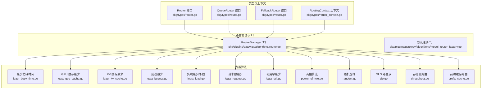
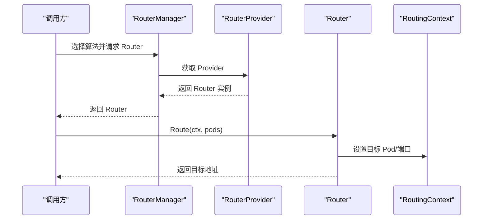
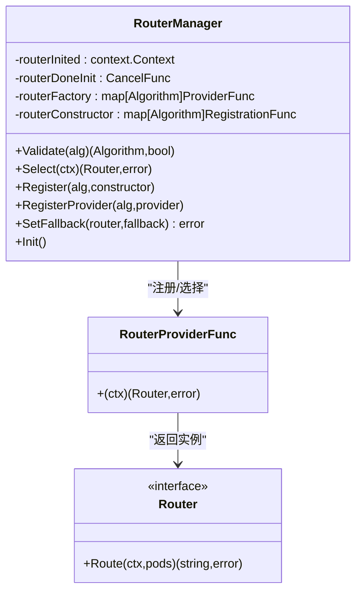
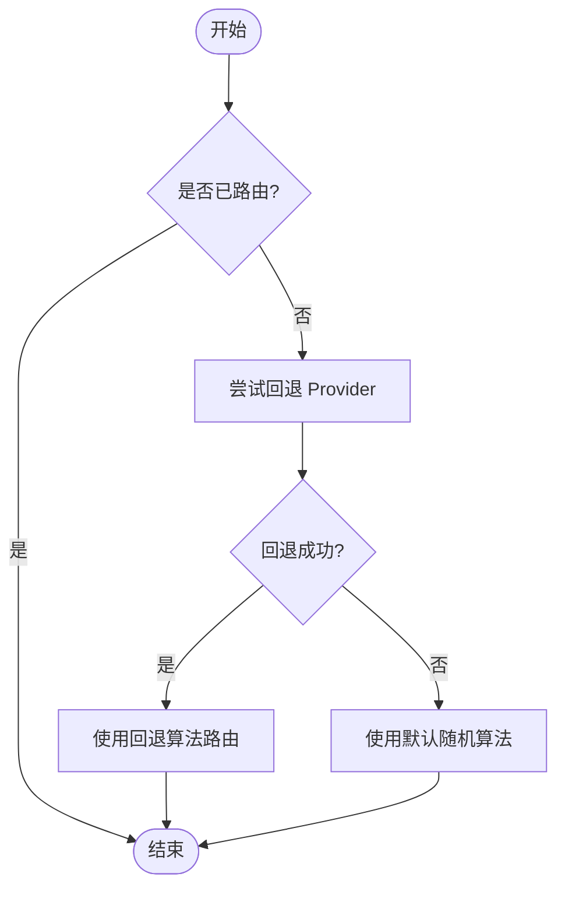
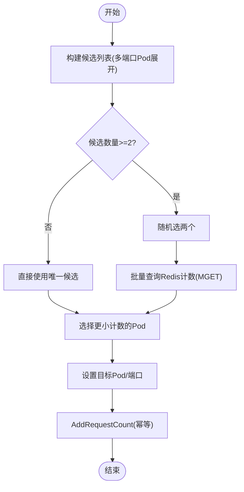
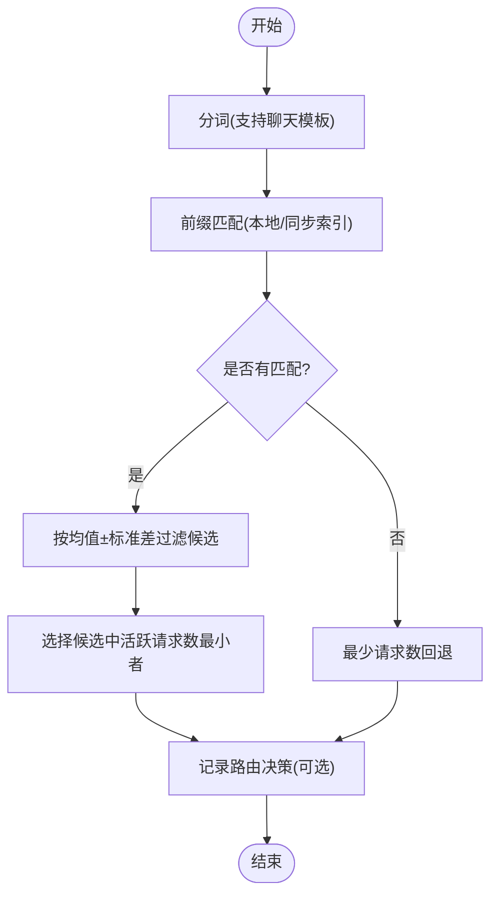
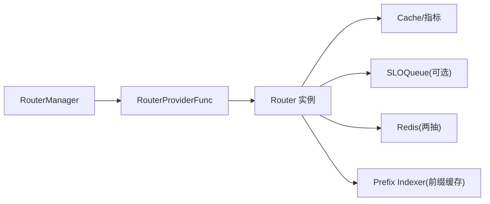

# 路由算法插件

<cite>
**本文引用的文件**
- [pkg/types/router.go](file://pkg/types/router.go)
- [pkg/types/router_context.go](file://pkg/types/router_context.go)
- [pkg/plugins/gateway/algorithms/router.go](file://pkg/plugins/gateway/algorithms/router.go)
- [pkg/plugins/gateway/algorithms/fallback.go](file://pkg/plugins/gateway/algorithms/fallback.go)
- [pkg/plugins/gateway/algorithms/least_busy_time.go](file://pkg/plugins/gateway/algorithms/least_busy_time.go)
- [pkg/plugins/gateway/algorithms/least_gpu_cache.go](file://pkg/plugins/gateway/algorithms/least_gpu_cache.go)
- [pkg/plugins/gateway/algorithms/least_kv_cache.go](file://pkg/plugins/gateway/algorithms/least_kv_cache.go)
- [pkg/plugins/gateway/algorithms/least_latency.go](file://pkg/plugins/gateway/algorithms/least_latency.go)
- [pkg/plugins/gateway/algorithms/least_load.go](file://pkg/plugins/gateway/algorithms/least_load.go)
- [pkg/plugins/gateway/algorithms/least_request.go](file://pkg/plugins/gateway/algorithms/least_request.go)
- [pkg/plugins/gateway/algorithms/least_util.go](file://pkg/plugins/gateway/algorithms/least_util.go)
- [pkg/plugins/gateway/algorithms/power_of_two.go](file://pkg/plugins/gateway/algorithms/power_of_two.go)
- [pkg/plugins/gateway/algorithms/random.go](file://pkg/plugins/gateway/algorithms/random.go)
- [pkg/plugins/gateway/algorithms/slo.go](file://pkg/plugins/gateway/algorithms/slo.go)
- [pkg/plugins/gateway/algorithms/throughput.go](file://pkg/plugins/gateway/algorithms/throughput.go)
- [pkg/plugins/gateway/algorithms/prefix_cache.go](file://pkg/plugins/gateway/algorithms/prefix_cache.go)
</cite>

## 目录
1. [简介](#简介)
2. [项目结构](#项目结构)
3. [核心组件](#核心组件)
4. [架构总览](#架构总览)
5. [详细组件分析](#详细组件分析)
6. [依赖分析](#依赖分析)
7. [性能考虑](#性能考虑)
8. [故障排查指南](#故障排查指南)
9. [结论](#结论)
10. [附录：自定义路由算法开发指南](#附录自定义路由算法开发指南)

## 简介
本文件为 AIBrix 路由算法插件的详细 API 文档，覆盖以下内容：
- 路由接口与上下文模型的定义与职责
- 算法工厂模式与路由管理器的工作机制
- 路由决策流程与错误处理策略
- 内置路由算法的实现原理、配置参数、性能特征与适用场景
- 自定义路由算法插件的开发步骤与最佳实践
- 调试与监控方法

## 项目结构
路由能力位于网关插件模块中，核心类型与上下文在 types 包，具体路由算法实现位于 algorithms 子目录。

**图表来源**
- [pkg/types/router.go:19-56](file://pkg/types/router.go#L19-L56)
- [pkg/types/router_context.go:57-105](file://pkg/types/router_context.go#L57-L105)
- [pkg/plugins/gateway/algorithms/router.go:41-153](file://pkg/plugins/gateway/algorithms/router.go#L41-L153)
- [pkg/plugins/gateway/algorithms/model_router_factory.go:18](file://pkg/plugins/gateway/algorithms/model_router_factory.go#L18)

**章节来源**
- [pkg/types/router.go:19-56](file://pkg/types/router.go#L19-L56)
- [pkg/types/router_context.go:57-105](file://pkg/types/router_context.go#L57-L105)
- [pkg/plugins/gateway/algorithms/router.go:41-153](file://pkg/plugins/gateway/algorithms/router.go#L41-L153)

## 核心组件
- Router 接口：定义路由选择逻辑，输入为 RoutingContext 与可路由 Pod 列表，输出目标 Pod 的地址字符串或错误。
- QueueRouter 接口：扩展 Router，增加队列长度查询能力，用于具备内置排队能力的路由。
- FallbackRouter 接口：支持链式回退，允许设置备用算法与提供函数。
- RouterProvider 与 RouterProviderFunc：提供两种获取 Router 的方式，前者有状态，后者无状态。
- RouterManager：集中注册、选择与初始化路由算法，支持回退设置与超时保护。
- RoutingContext：封装一次路由请求的上下文信息，包括算法、模型、消息、请求头体、配置画像、统计与追踪字段，并提供目标 Pod 设置与错误设置等同步/异步能力。

**章节来源**
- [pkg/types/router.go:19-56](file://pkg/types/router.go#L19-L56)
- [pkg/types/router_context.go:57-105](file://pkg/types/router_context.go#L57-L105)
- [pkg/plugins/gateway/algorithms/router.go:41-153](file://pkg/plugins/gateway/algorithms/router.go#L41-L153)

## 架构总览
路由从“算法工厂”中按算法名选择 RouterProvider，构造 Router 实例；随后在 Route 中根据上下文与指标选择目标 Pod 并设置到上下文，最终返回目标地址。若算法不支持回退或无有效指标，将回退到随机或其他默认策略。

**图表来源**
- [pkg/plugins/gateway/algorithms/router.go:73-85](file://pkg/plugins/gateway/algorithms/router.go#L73-L85)
- [pkg/types/router.go:20-24](file://pkg/types/router.go#L20-L24)
- [pkg/types/router_context.go:194-200](file://pkg/types/router_context.go#L194-L200)

## 详细组件分析

### RouterManager 与工厂模式
- 注册：支持以构造函数或 Provider 方式注册算法；构造函数注册后需 Init 才能生效。
- 选择：根据 RoutingContext.Algorithm 查找 Provider 并实例化 Router；若不支持则回退到随机算法。
- 回退：对实现了 FallbackRouter 的 Router，可在初始化完成后设置回退算法与 Provider。
- 初始化：统一触发已注册构造函数的实例化，完成 Provider 注册。

**图表来源**
- [pkg/plugins/gateway/algorithms/router.go:41-153](file://pkg/plugins/gateway/algorithms/router.go#L41-L153)

**章节来源**
- [pkg/plugins/gateway/algorithms/router.go:41-153](file://pkg/plugins/gateway/algorithms/router.go#L41-L153)

### 回退机制
- 默认回退算法为随机；可通过 SetFallback 指定备用算法与 Provider。
- 回退在路由未命中或 Provider 返回错误时触发，确保系统可用性。

**图表来源**
- [pkg/plugins/gateway/algorithms/fallback.go:31-47](file://pkg/plugins/gateway/algorithms/fallback.go#L31-L47)
- [pkg/plugins/gateway/algorithms/router.go:79-81](file://pkg/plugins/gateway/algorithms/router.go#L79-L81)

**章节来源**
- [pkg/plugins/gateway/algorithms/fallback.go:22-47](file://pkg/plugins/gateway/algorithms/fallback.go#L22-L47)
- [pkg/plugins/gateway/algorithms/router.go:79-81](file://pkg/plugins/gateway/algorithms/router.go#L79-L81)

### 最少忙碌时间（GPU 忙碌时间比）
- 策略：基于 GPU 忙碌时间比选择最小值的 Pod。
- 指标：GPUBusyTimeRatio。
- 回退：无有效指标时随机回退。
- 适用场景：追求整体 GPU 利用均衡，避免单卡过载。

**章节来源**
- [pkg/plugins/gateway/algorithms/least_busy_time.go:30-82](file://pkg/plugins/gateway/algorithms/least_busy_time.go#L30-L82)

### GPU 缓存最少
- 策略：选择 GPU 缓存占用百分比最小的 Pod；若并列则随机。
- 指标：GPUCacheUsagePerc。
- 回退：无有效指标时随机回退。
- 适用场景：显存紧张、需要优先释放显存的推理场景。

**章节来源**
- [pkg/plugins/gateway/algorithms/least_gpu_cache.go:31-100](file://pkg/plugins/gateway/algorithms/least_gpu_cache.go#L31-L100)

### KV 缓存最少（GPU+CPU）
- 策略：计算 GPU+CPU KV 缓存占用百分比之和，选择最小者。
- 指标：KVCacheUsagePerc（GPU）、CPUCacheUsagePerc（CPU）。
- 回退：无有效指标时随机回退。
- 适用场景：KV 缓存占用敏感、需要平衡显存与内存的场景。

**章节来源**
- [pkg/plugins/gateway/algorithms/least_kv_cache.go:31-98](file://pkg/plugins/gateway/algorithms/least_kv_cache.go#L31-L98)

### 延迟最少（期望总延迟）
- 策略：综合排队等待、预填充与解码三段期望延迟，选择最小总和。
- 指标：RequestQueueTimeSeconds、RequestPrefillTimeSeconds、AvgPromptToksPerReq、RequestDecodeTimeSeconds、AvgGenerationToksPerReq。
- 回退：无有效指标时随机回退。
- 适用场景：低时延优先的在线服务。

**章节来源**
- [pkg/plugins/gateway/algorithms/least_latency.go:30-154](file://pkg/plugins/gateway/algorithms/least_latency.go#L30-L154)

### 负载最少（推/拉模式）
- 策略：根据负载提供器计算利用率；支持“推模式”直接派发与“拉模式”按容量拉取。
- 拉模式：结合 Cap 限制，仅向未达容量的 Pod 派发。
- 错误处理：遇到容量上限或 SLO 失败会跳过该 Pod 并记录最后错误。
- 适用场景：需要与服务配置画像联动、保障 SLO 的高阶调度。

**章节来源**
- [pkg/plugins/gateway/algorithms/least_load.go:29-140](file://pkg/plugins/gateway/algorithms/least_load.go#L29-L140)

### 请求数最少（活跃请求数）
- 策略：选择当前活跃请求数最少的 Pod；多端口 Pod 支持按端口粒度统计。
- 指标：RealtimeNumRequestsRunning（支持按端口后缀区分）。
- 回退：无有效指标时随机回退。
- 适用场景：均匀分配实时负载，避免热点。

**章节来源**
- [pkg/plugins/gateway/algorithms/least_request.go:35-233](file://pkg/plugins/gateway/algorithms/least_request.go#L35-L233)

### 利用率最少
- 策略：选择引擎利用率最小的 Pod；并列时随机。
- 指标：EngineUtilization。
- 回退：无有效指标时随机回退。
- 适用场景：关注引擎资源占用，避免过热。

**章节来源**
- [pkg/plugins/gateway/algorithms/least_util.go:30-92](file://pkg/plugins/gateway/algorithms/least_util.go#L30-L92)

### 两抽算法（Power of Two）
- 策略：随机挑选两个候选，比较其运行中的请求数，选择较小者；通过 Redis 计数器实现。
- 关键点：批量 MGET、键轮换（按小时）、过期 TTL、请求计数的 Add/Done 配套跟踪。
- 回退：无候选或错误时随机回退。
- 适用场景：大规模在线推理、需要稳定低延迟的负载均衡。

**图表来源**
- [pkg/plugins/gateway/algorithms/power_of_two.go:115-184](file://pkg/plugins/gateway/algorithms/power_of_two.go#L115-L184)
- [pkg/plugins/gateway/algorithms/power_of_two.go:224-281](file://pkg/plugins/gateway/algorithms/power_of_two.go#L224-L281)
- [pkg/plugins/gateway/algorithms/power_of_two.go:304-354](file://pkg/plugins/gateway/algorithms/power_of_two.go#L304-L354)

**章节来源**
- [pkg/plugins/gateway/algorithms/power_of_two.go:47-408](file://pkg/plugins/gateway/algorithms/power_of_two.go#L47-L408)

### 随机选择
- 策略：从可路由 Pod 列表中随机选择。
- 回退：作为默认回退算法使用。
- 适用场景：兜底策略、测试与简单部署。

**章节来源**
- [pkg/plugins/gateway/algorithms/random.go:27-62](file://pkg/plugins/gateway/algorithms/random.go#L27-L62)

### SLO 路由族
- 组成：SLO、SLO-PackLoad、SLO-LeastLoad（推/拉）。
- 机制：基于 SLO 队列进行路由，若无配置画像则回退到 FallbackRouter（默认最少请求数）。
- 提供：通过缓存层提供的 RouterProviderFunc 动态获取具体后端（如 least-load-pulling）。

**章节来源**
- [pkg/plugins/gateway/algorithms/slo.go:24-95](file://pkg/plugins/gateway/algorithms/slo.go#L24-L95)

### 吞吐量路由
- 策略：综合平均每请求提示词与生成词的吞吐量，加权计算总吞吐，选择最大者。
- 指标：AvgPromptToksPerReq、AvgGenerationToksPerReq。
- 回退：无有效指标时随机回退。
- 适用场景：追求整体吞吐最大化，适合批处理与长文本生成。

**章节来源**
- [pkg/plugins/gateway/algorithms/throughput.go:31-99](file://pkg/plugins/gateway/algorithms/throughput.go#L31-L99)

### 前缀缓存路由（Prefix Cache）
- 策略：基于分词哈希匹配前缀缓存，优先选择匹配度最高且活跃请求数在均值±标准差范围内的 Pod；否则回退到最少请求数。
- 特性：支持本地索引与 KV 同步索引；支持远程分词器池；可记录路由决策与延迟直方图。
- 环境变量：分词器类型、请求不平衡阈值、标准差因子、远程分词器开关、KV 同步开关等。
- 适用场景：长文本续写、对话场景中大量共享前缀的推理。

**图表来源**
- [pkg/plugins/gateway/algorithms/prefix_cache.go:352-445](file://pkg/plugins/gateway/algorithms/prefix_cache.go#L352-L445)
- [pkg/plugins/gateway/algorithms/prefix_cache.go:572-718](file://pkg/plugins/gateway/algorithms/prefix_cache.go#L572-L718)

**章节来源**
- [pkg/plugins/gateway/algorithms/prefix_cache.go:44-904](file://pkg/plugins/gateway/algorithms/prefix_cache.go#L44-L904)

## 依赖分析
- Router 接口与上下文解耦于具体算法实现，通过 RouterManager 统一注册与选择。
- 大多数算法依赖缓存层获取指标，部分算法（如两抽）额外依赖 Redis。
- SLO 路由族依赖队列与负载提供器，形成“画像感知”的调度闭环。
- 前缀缓存路由依赖分词器池与索引器，支持本地与同步两种索引模式。

**图表来源**
- [pkg/plugins/gateway/algorithms/router.go:41-153](file://pkg/plugins/gateway/algorithms/router.go#L41-L153)
- [pkg/plugins/gateway/algorithms/power_of_two.go:75-100](file://pkg/plugins/gateway/algorithms/power_of_two.go#L75-L100)
- [pkg/plugins/gateway/algorithms/slo.go:70-94](file://pkg/plugins/gateway/algorithms/slo.go#L70-L94)
- [pkg/plugins/gateway/algorithms/prefix_cache.go:197-326](file://pkg/plugins/gateway/algorithms/prefix_cache.go#L197-L326)

**章节来源**
- [pkg/plugins/gateway/algorithms/router.go:41-153](file://pkg/plugins/gateway/algorithms/router.go#L41-L153)

## 性能考虑
- 指标访问：尽量减少跨节点指标查询次数，优先使用本地缓存聚合结果。
- 两抽算法：批量 MGET 减少网络往返；键轮换与过期避免长期驻留导致的内存膨胀。
- 前缀缓存：合理设置标准差因子与请求不平衡阈值，避免过度筛选导致回退频繁。
- SLO 路由：拉模式可避免过载，但需正确配置画像与容量上限。
- 随机回退：作为兜底策略，应确保在异常情况下仍能快速返回。

## 故障排查指南
- 无可用 Pod：检查 Ready 状态与 PodIP 是否为空；确认算法是否返回“无可用 Pod”错误。
- 指标缺失：查看日志中指标获取失败的错误；确认指标采集是否正常；必要时启用随机回退。
- 两抽计数异常：检查 Redis 连接、键格式与过期策略；确认 Add/Done 是否成对调用。
- 前缀缓存不命中：确认分词器类型与聊天模板是否正确；检查索引器状态与匹配百分比。
- SLO 路由无画像：确认模型配置画像是否存在；检查队列 LastError 与回退逻辑。

**章节来源**
- [pkg/plugins/gateway/algorithms/least_load.go:64-140](file://pkg/plugins/gateway/algorithms/least_load.go#L64-L140)
- [pkg/plugins/gateway/algorithms/power_of_two.go:304-398](file://pkg/plugins/gateway/algorithms/power_of_two.go#L304-L398)
- [pkg/plugins/gateway/algorithms/prefix_cache.go:572-718](file://pkg/plugins/gateway/algorithms/prefix_cache.go#L572-L718)
- [pkg/plugins/gateway/algorithms/slo.go:62-68](file://pkg/plugins/gateway/algorithms/slo.go#L62-L68)

## 结论
AIBrix 路由算法插件通过清晰的接口与工厂模式，提供了从基础随机到高级 SLO 与前缀缓存的丰富策略。开发者可根据业务目标选择合适算法，并通过回退与监控机制提升稳定性与可观测性。

## 附录：自定义路由算法开发指南
- 接口实现
  - 实现 Router 接口的 Route 方法，从 readyPodList 中选择目标 Pod，并通过 ctx.SetTargetPod 与 ctx.SetTargetPort 设置目标。
  - 若算法具备队列能力，实现 QueueRouter 接口的 Len 方法。
  - 若算法支持回退，实现 FallbackRouter 接口的 SetFallback 方法。
- 注册与提供
  - 使用 Register 注册算法名称与构造函数；或使用 RegisterProvider 注册 ProviderFunc。
  - 在初始化阶段调用 Init 完成构造函数实例化。
  - 对需要回退的 Router，使用 SetFallback 指定回退算法与 Provider。
- 算法选择策略
  - 基于场景选择：低延迟优先用延迟最少，吞吐优先用吞吐量路由，显存敏感用 KV/GPU 缓存最少，实时均衡用请求数最少或两抽。
  - SLO 场景建议使用 SLO 路由族，结合画像与容量限制。
- 调试与监控
  - 开启日志级别以观察指标与候选选择过程。
  - 使用 Prometheus 指标（如前缀缓存路由的决策与延迟直方图）进行观测。
  - 对两抽算法，验证 Redis 计数的增减与过期行为。

**章节来源**
- [pkg/types/router.go:19-56](file://pkg/types/router.go#L19-L56)
- [pkg/plugins/gateway/algorithms/router.go:87-153](file://pkg/plugins/gateway/algorithms/router.go#L87-L153)
- [pkg/plugins/gateway/algorithms/fallback.go:31-47](file://pkg/plugins/gateway/algorithms/fallback.go#L31-L47)