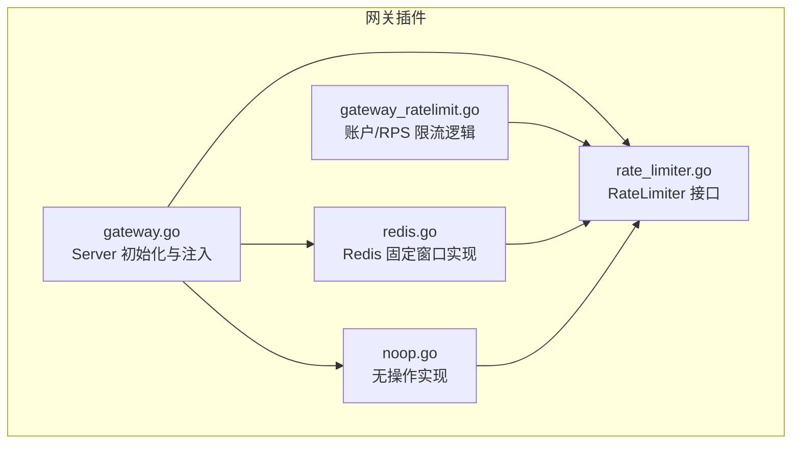
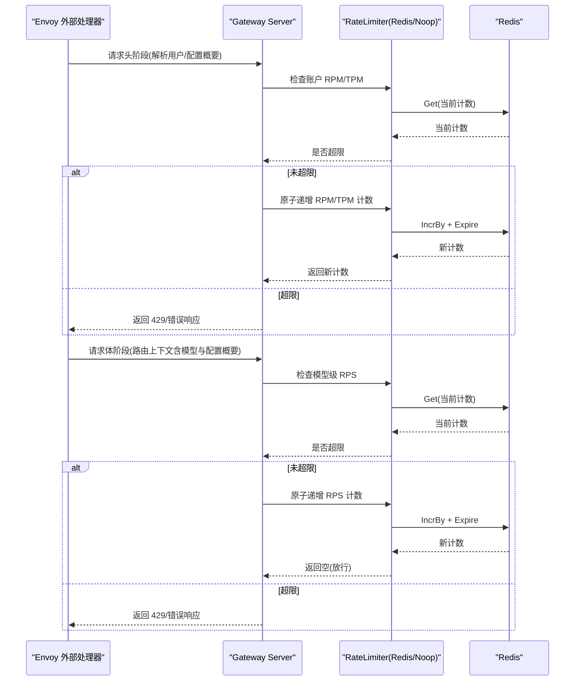
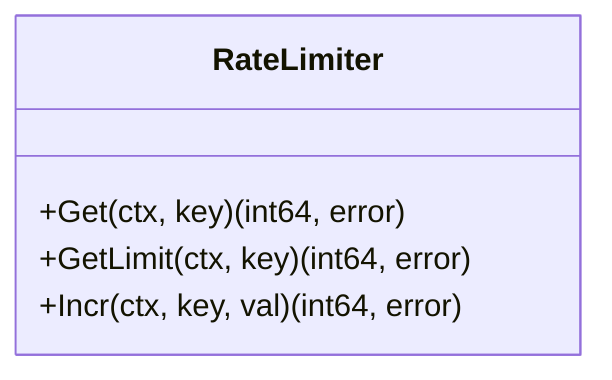
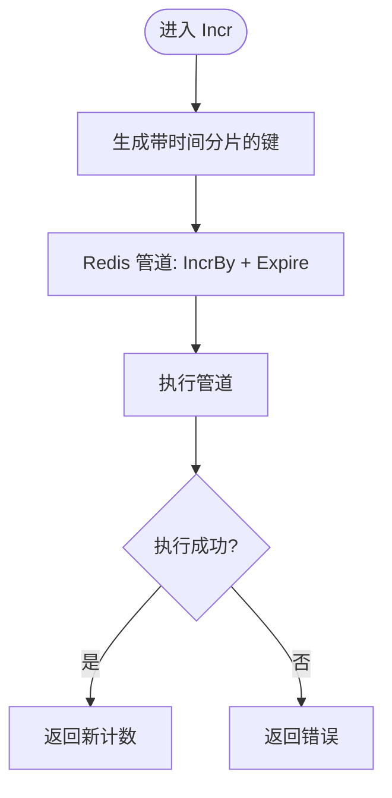
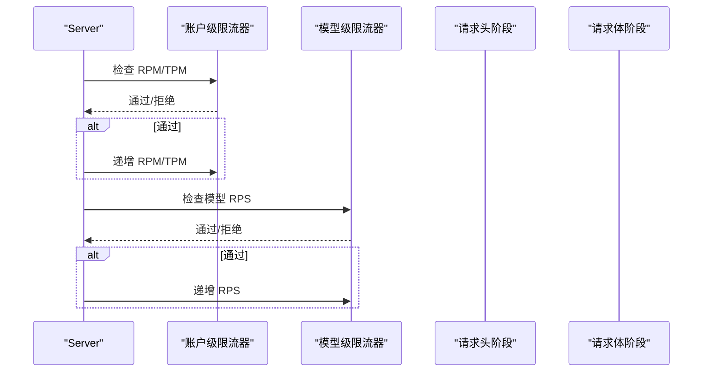
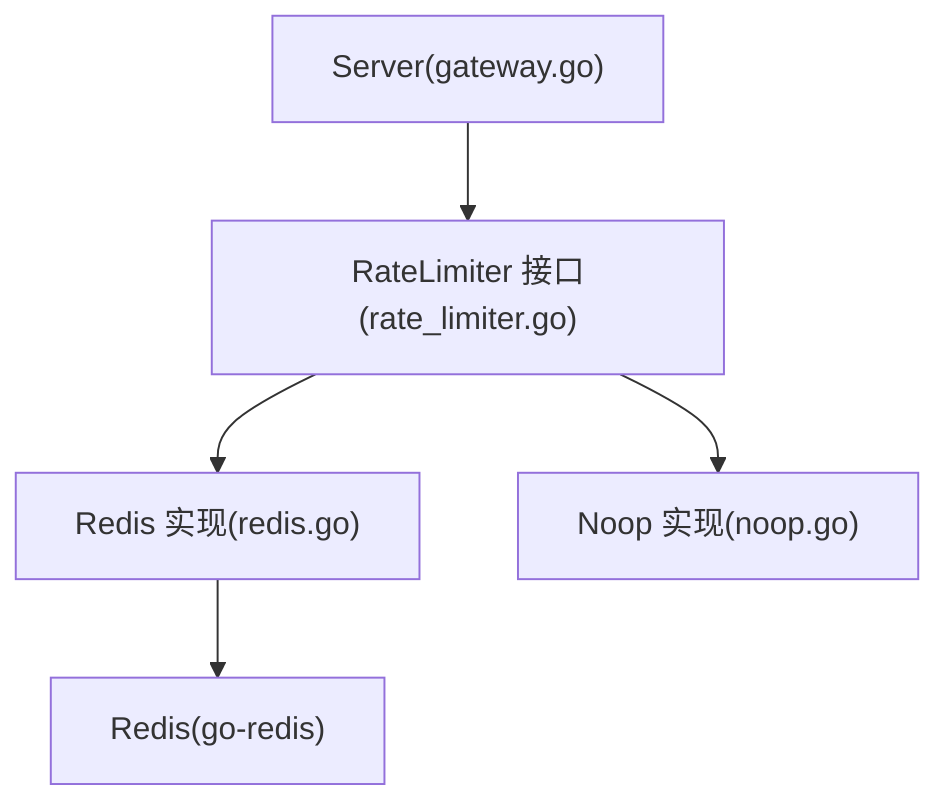

# 速率限制插件

<cite>
**本文引用的文件**
- [pkg/plugins/gateway/ratelimiter/rate_limiter.go](file://pkg/plugins/gateway/ratelimiter/rate_limiter.go)
- [pkg/plugins/gateway/ratelimiter/redis.go](file://pkg/plugins/gateway/ratelimiter/redis.go)
- [pkg/plugins/gateway/ratelimiter/noop.go](file://pkg/plugins/gateway/ratelimiter/noop.go)
- [pkg/plugins/gateway/ratelimiter/README.md](file://pkg/plugins/gateway/ratelimiter/README.md)
- [pkg/plugins/gateway/gateway.go](file://pkg/plugins/gateway/gateway.go)
- [pkg/plugins/gateway/gateway_ratelimit.go](file://pkg/plugins/gateway/gateway_ratelimit.go)
- [pkg/plugins/gateway/gateway_ratelimit_test.go](file://pkg/plugins/gateway/gateway_ratelimit_test.go)
- [pkg/plugins/gateway/ratelimiter/ratelimiter_test.go](file://pkg/plugins/gateway/ratelimiter/ratelimiter_test.go)
- [pkg/plugins/gateway/types.go](file://pkg/plugins/gateway/types.go)
</cite>

## 目录
1. [简介](#简介)
2. [项目结构](#项目结构)
3. [核心组件](#核心组件)
4. [架构总览](#架构总览)
5. [详细组件分析](#详细组件分析)
6. [依赖分析](#依赖分析)
7. [性能考虑](#性能考虑)
8. [故障排查指南](#故障排查指南)
9. [结论](#结论)
10. [附录](#附录)

## 简介
本文件为 AIBrix 速率限制插件的全面 API 文档，覆盖以下内容：
- RateLimiter 接口设计与实现要求：支持令牌桶、滑动窗口、固定窗口等策略的扩展点说明
- 内置速率限制插件能力：Redis 分布式限流、无操作限流（No-op）
- 配置参数：RPM（每分钟请求数）、TPM（每分钟标记数）、模型级 RPS（每秒请求数）
- 账户级与模型级限流的实现机制、动态调整与状态持久化/恢复
- 自定义速率限制插件开发指南、接口实现示例、性能优化建议、监控与告警配置

## 项目结构
速率限制相关代码主要位于网关插件目录中，核心文件如下：
- 接口定义：RateLimiter
- 实现：Redis 固定窗口限流、无操作限流
- 网关集成：在网关启动时注入限流器实例，分别用于账户级 RPM/TPM 与模型级 RPS

**图表来源**
- [pkg/plugins/gateway/gateway.go:94-121](file://pkg/plugins/gateway/gateway.go#L94-L121)
- [pkg/plugins/gateway/ratelimiter/rate_limiter.go:23-37](file://pkg/plugins/gateway/ratelimiter/rate_limiter.go#L23-L37)
- [pkg/plugins/gateway/ratelimiter/redis.go:30-47](file://pkg/plugins/gateway/ratelimiter/redis.go#L30-L47)
- [pkg/plugins/gateway/ratelimiter/noop.go:21-25](file://pkg/plugins/gateway/ratelimiter/noop.go#L21-L25)
- [pkg/plugins/gateway/gateway_ratelimit.go:31-78](file://pkg/plugins/gateway/gateway_ratelimit.go#L31-L78)

**章节来源**
- [pkg/plugins/gateway/gateway.go:94-121](file://pkg/plugins/gateway/gateway.go#L94-L121)
- [pkg/plugins/gateway/ratelimiter/rate_limiter.go:23-37](file://pkg/plugins/gateway/ratelimiter/rate_limiter.go#L23-L37)

## 核心组件
- RateLimiter 接口：定义 Get、GetLimit、Incr 三个方法，统一抽象计数查询、上限读取与原子递增
- Redis 固定窗口限流：基于 Redis 的固定窗口计数器，窗口大小可配置；使用管道保证原子性
- 无操作限流：在未提供 Redis 客户端时启用，不执行任何限流动作
- 网关集成：Server 在启动时根据是否提供 Redis 客户端选择注入 Redis 或 Noop 实现；分别维护两套限流器实例，分别用于账户级 RPM/TPM 与模型级 RPS

**章节来源**
- [pkg/plugins/gateway/ratelimiter/rate_limiter.go:23-37](file://pkg/plugins/gateway/ratelimiter/rate_limiter.go#L23-L37)
- [pkg/plugins/gateway/ratelimiter/redis.go:30-47](file://pkg/plugins/gateway/ratelimiter/redis.go#L30-L47)
- [pkg/plugins/gateway/ratelimiter/noop.go:21-37](file://pkg/plugins/gateway/ratelimiter/noop.go#L21-L37)
- [pkg/plugins/gateway/gateway.go:94-121](file://pkg/plugins/gateway/gateway.go#L94-L121)

## 架构总览
下图展示速率限制在网关中的调用链路与数据流：

**图表来源**
- [pkg/plugins/gateway/gateway_ratelimit.go:31-78](file://pkg/plugins/gateway/gateway_ratelimit.go#L31-L78)
- [pkg/plugins/gateway/gateway_ratelimit.go:115-154](file://pkg/plugins/gateway/gateway_ratelimit.go#L115-L154)
- [pkg/plugins/gateway/ratelimiter/redis.go:49-88](file://pkg/plugins/gateway/ratelimiter/redis.go#L49-L88)

## 详细组件分析

### RateLimiter 接口设计
- 方法职责
  - Get：按 key 查询当前计数
  - GetLimit：按 key 查询最大配额（上限）
  - Incr：对 key 原子递增指定值并返回新计数
- 设计要点
  - 上述方法均接受 context，便于超时控制与取消传播
  - 返回值与错误语义明确，便于上层处理失败场景

**图表来源**
- [pkg/plugins/gateway/ratelimiter/rate_limiter.go:23-37](file://pkg/plugins/gateway/ratelimiter/rate_limiter.go#L23-L37)

**章节来源**
- [pkg/plugins/gateway/ratelimiter/rate_limiter.go:23-37](file://pkg/plugins/gateway/ratelimiter/rate_limiter.go#L23-L37)

### Redis 固定窗口限流实现
- 窗口策略
  - 使用固定窗口：窗口大小由构造函数传入，内部会将小于 1 秒的窗口裁剪为 1 秒
  - 键命名包含时间分片，确保跨窗口自动过期与重置
- 原子性
  - 使用 Redis 管道组合 IncrBy 与 Expire，保证计数与过期的原子性
- 并发安全
  - 测试覆盖并发递增，验证多协程下的正确性

**图表来源**
- [pkg/plugins/gateway/ratelimiter/redis.go:72-88](file://pkg/plugins/gateway/ratelimiter/redis.go#L72-L88)

**章节来源**
- [pkg/plugins/gateway/ratelimiter/redis.go:30-47](file://pkg/plugins/gateway/ratelimiter/redis.go#L30-L47)
- [pkg/plugins/gateway/ratelimiter/redis.go:49-88](file://pkg/plugins/gateway/ratelimiter/redis.go#L49-L88)
- [pkg/plugins/gateway/ratelimiter/ratelimiter_test.go:115-151](file://pkg/plugins/gateway/ratelimiter/ratelimiter_test.go#L115-L151)

### 无操作限流实现
- 适用场景：未提供 Redis 客户端时启用，不进行任何限流
- 行为特征：Get 返回 0，GetLimit 返回极大值，Incr 返回 0，不产生副作用

**章节来源**
- [pkg/plugins/gateway/ratelimiter/noop.go:21-37](file://pkg/plugins/gateway/ratelimiter/noop.go#L21-L37)

### 网关集成与限流流程
- 启动阶段
  - 若提供 Redis 客户端：创建两套限流器实例
    - 账户级限流器：名称前缀为 aibrix，窗口 1 分钟，用于 RPM/TPM
    - 模型级限流器：名称前缀为 aibrix_model，窗口 1 秒，用于 RPS
  - 若未提供 Redis 客户端：注入两个无操作限流器
- 请求阶段
  - 账户级：在请求头阶段检查并递增 RPM/TPM
  - 模型级：在请求体阶段检查并递增 RPS，若超限则拒绝

**图表来源**
- [pkg/plugins/gateway/gateway.go:94-121](file://pkg/plugins/gateway/gateway.go#L94-L121)
- [pkg/plugins/gateway/gateway_ratelimit.go:31-78](file://pkg/plugins/gateway/gateway_ratelimit.go#L31-L78)
- [pkg/plugins/gateway/gateway_ratelimit.go:115-154](file://pkg/plugins/gateway/gateway_ratelimit.go#L115-L154)

**章节来源**
- [pkg/plugins/gateway/gateway.go:94-121](file://pkg/plugins/gateway/gateway.go#L94-L121)
- [pkg/plugins/gateway/gateway_ratelimit.go:31-78](file://pkg/plugins/gateway/gateway_ratelimit.go#L31-L78)
- [pkg/plugins/gateway/gateway_ratelimit.go:115-154](file://pkg/plugins/gateway/gateway_ratelimit.go#L115-L154)

### 配置参数与默认行为
- RPM（每分钟请求数）
  - 默认值：见类型定义
  - 用户未显式设置时，将采用默认值
- TPM（每分钟标记数）
  - 默认值：RPM × 默认倍数
  - 用户未显式设置时，将按默认倍数推导
- 模型级 RPS（每秒请求数）
  - 通过配置概要中的 requestsPerSecond 字段设置
  - 仅当该字段为正数时生效，否则跳过模型级限流检查

**章节来源**
- [pkg/plugins/gateway/gateway_ratelimit.go:31-37](file://pkg/plugins/gateway/gateway_ratelimit.go#L31-L37)
- [pkg/plugins/gateway/types.go:72-73](file://pkg/plugins/gateway/types.go#L72-L73)
- [pkg/plugins/gateway/gateway_ratelimit.go:117-121](file://pkg/plugins/gateway/gateway_ratelimit.go#L117-L121)

### 账户级限流与模型级限流
- 账户级（RPM/TPM）
  - 键命名：用户名 + _RPM_CURRENT 或 _TPM_CURRENT
  - 窗口：1 分钟（账户级限流器构造时固定）
  - 动态调整：通过用户记录中的 RPM/TPM 字段决定阈值
- 模型级（RPS）
  - 键命名：模型名 + _MODEL_RPS_CURRENT
  - 窗口：1 秒（模型级限流器构造时固定）
  - 动态调整：通过配置概要中的 requestsPerSecond 字段决定阈值

**章节来源**
- [pkg/plugins/gateway/gateway_ratelimit.go:80-113](file://pkg/plugins/gateway/gateway_ratelimit.go#L80-L113)
- [pkg/plugins/gateway/gateway_ratelimit.go:115-154](file://pkg/plugins/gateway/gateway_ratelimit.go#L115-L154)
- [pkg/plugins/gateway/ratelimiter/README.md:45-75](file://pkg/plugins/gateway/ratelimiter/README.md#L45-L75)

### 限流状态持久化与恢复
- Redis 持久化
  - 计数器与过期时间存储于 Redis，随窗口到期自动过期
  - 管道保证递增与过期的原子性，避免竞态
- 无 Redis 场景
  - 使用无操作限流器，不持久化，重启后状态丢失
- 恢复
  - 重启后计数器自然清零（因过期），不会延续之前的配额

**章节来源**
- [pkg/plugins/gateway/ratelimiter/redis.go:76-88](file://pkg/plugins/gateway/ratelimiter/redis.go#L76-L88)
- [pkg/plugins/gateway/ratelimiter/noop.go:21-37](file://pkg/plugins/gateway/ratelimiter/noop.go#L21-L37)

### 自定义速率限制插件开发指南
- 实现步骤
  - 实现 RateLimiter 接口：Get、GetLimit、Incr
  - 在网关启动时注入你的实现：替换现有 Redis 或 Noop 实例
- 策略选择建议
  - 固定窗口：简单高效，适合大多数场景
  - 滑动窗口：更平滑的突发控制，需额外状态或 Lua 脚本
  - 令牌桶：适合突发但长期稳定速率的场景，需维护桶状态
- 关键注意
  - 原子性：确保 Incr 操作的原子性与过期一致性
  - 键空间隔离：不同业务域使用不同前缀，避免键冲突
  - 错误处理：明确错误语义，便于上层区分“内部错误”与“超限”

**章节来源**
- [pkg/plugins/gateway/ratelimiter/rate_limiter.go:23-37](file://pkg/plugins/gateway/ratelimiter/rate_limiter.go#L23-L37)
- [pkg/plugins/gateway/gateway.go:94-121](file://pkg/plugins/gateway/gateway.go#L94-L121)

## 依赖分析
- 组件耦合
  - Server 对 RateLimiter 接口编程，解耦具体实现
  - Redis 实现依赖 go-redis 客户端
- 外部依赖
  - Redis：用于计数与过期管理
  - Prometheus：网关内置指标端点，可用于限流效果观测

**图表来源**
- [pkg/plugins/gateway/gateway.go:94-121](file://pkg/plugins/gateway/gateway.go#L94-L121)
- [pkg/plugins/gateway/ratelimiter/rate_limiter.go:23-37](file://pkg/plugins/gateway/ratelimiter/rate_limiter.go#L23-L37)
- [pkg/plugins/gateway/ratelimiter/redis.go:19-26](file://pkg/plugins/gateway/ratelimiter/redis.go#L19-L26)

**章节来源**
- [pkg/plugins/gateway/gateway.go:94-121](file://pkg/plugins/gateway/gateway.go#L94-L121)
- [pkg/plugins/gateway/ratelimiter/redis.go:19-26](file://pkg/plugins/gateway/ratelimiter/redis.go#L19-L26)

## 性能考虑
- 窗口大小
  - 账户级窗口 1 分钟，模型级窗口 1 秒，兼顾吞吐与公平性
- 原子性与网络开销
  - 使用管道减少往返次数，降低网络抖动影响
- 并发与竞争
  - 单键原子递增天然避免竞争条件；高并发下建议评估 Redis 压力
- 监控与可观测性
  - 利用 Prometheus 指标端点收集请求总量、失败率等指标，辅助容量规划

[本节为通用性能建议，无需特定文件引用]

## 故障排查指南
- 常见错误与定位
  - 获取计数失败：检查 Redis 连接与权限
  - 递增失败：检查 Redis 可写性与网络连通性
  - 超限返回：确认用户 RPM/TPM 或模型 RPS 配置是否合理
- 单元测试参考
  - 覆盖 Get/Incr/GetLimit 的错误路径与边界条件
  - 覆盖并发递增场景，确保一致性

**章节来源**
- [pkg/plugins/gateway/gateway_ratelimit_test.go:31-138](file://pkg/plugins/gateway/gateway_ratelimit_test.go#L31-L138)
- [pkg/plugins/gateway/ratelimiter/ratelimiter_test.go:30-58](file://pkg/plugins/gateway/ratelimiter/ratelimiter_test.go#L30-L58)
- [pkg/plugins/gateway/ratelimiter/ratelimiter_test.go:115-151](file://pkg/plugins/gateway/ratelimiter/ratelimiter_test.go#L115-L151)

## 结论
AIBrix 速率限制插件通过清晰的接口抽象与两种内置实现，提供了灵活且高效的限流能力。账户级与模型级限流分别针对不同粒度与场景需求，结合 Redis 的原子操作与过期机制，实现了可靠的分布式限流。对于需要更复杂策略（如滑动窗口、令牌桶）的场景，可基于 RateLimiter 接口快速扩展。

[本节为总结性内容，无需特定文件引用]

## 附录

### 限流策略与实现映射
- 固定窗口：已实现（Redis 固定窗口）
- 滑动窗口：可通过 Redis ZSet 或 Lua 脚本实现，扩展 RateLimiter 接口
- 令牌桶：可通过 Redis 计数器与过期时间模拟，扩展 RateLimiter 接口

[本节为概念性说明，无需特定文件引用]

### 配置概要与键命名参考
- 账户级键命名：用户名 + _RPM_CURRENT 或 _TPM_CURRENT
- 模型级键命名：模型名 + _MODEL_RPS_CURRENT
- 配置概要字段：requestsPerSecond（仅当大于 0 时启用模型级限流）

**章节来源**
- [pkg/plugins/gateway/ratelimiter/README.md:45-75](file://pkg/plugins/gateway/ratelimiter/README.md#L45-L75)
- [pkg/plugins/gateway/gateway_ratelimit.go:117-121](file://pkg/plugins/gateway/gateway_ratelimit.go#L117-L121)