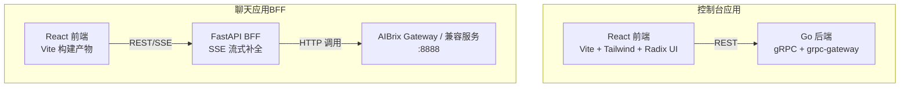
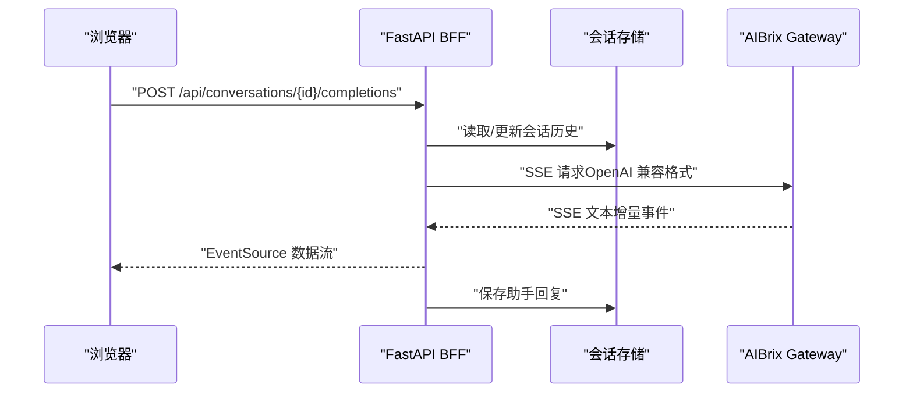
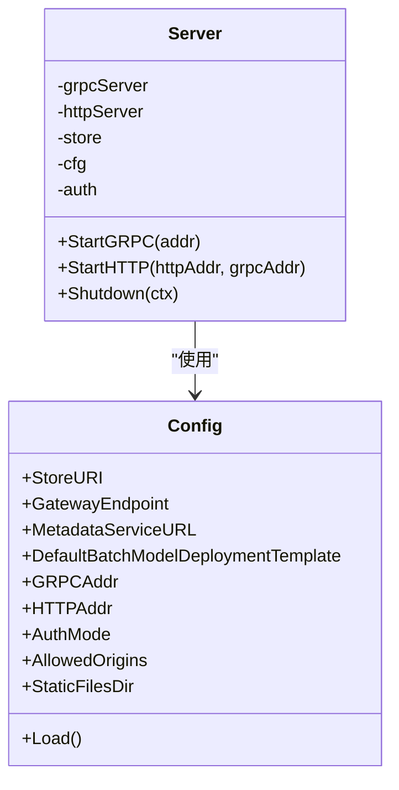
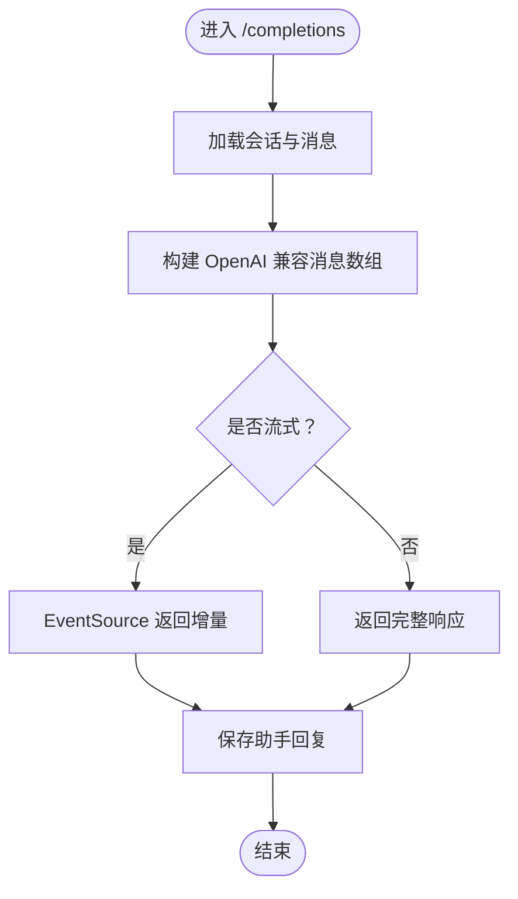
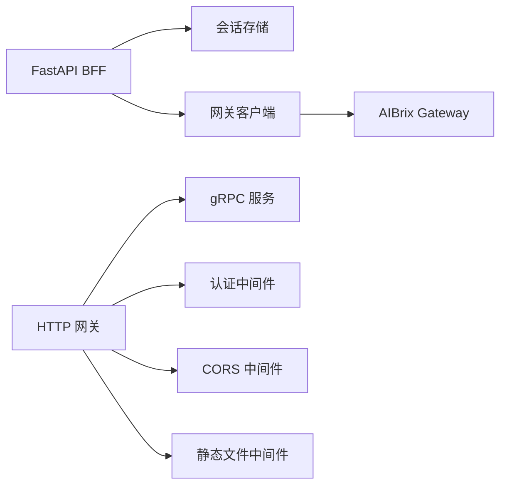

# 应用程序

<cite>
**本文引用的文件**
- [README.md](file://README.md)
- [apps/chat/README.md](file://apps/chat/README.md)
- [apps/console/README.md](file://apps/console/README.md)
- [apps/chat/Dockerfile](file://apps/chat/Dockerfile)
- [apps/console/Dockerfile](file://apps/console/Dockerfile)
- [apps/chat/docker-compose.yaml](file://apps/chat/docker-compose.yaml)
- [apps/chat/api/main.py](file://apps/chat/api/main.py)
- [apps/chat/api/config.py](file://apps/chat/api/config.py)
- [apps/chat/api/routers/chat.py](file://apps/chat/api/routers/chat.py)
- [apps/chat/api/services/conversation.py](file://apps/chat/api/services/conversation.py)
- [apps/chat/api/services/gateway.py](file://apps/chat/api/services/gateway.py)
- [apps/console/api/server/server.go](file://apps/console/api/server/server.go)
- [apps/console/api/config/config.go](file://apps/console/api/config/config.go)
- [apps/console/web/package.json](file://apps/console/web/package.json)
- [apps/chat/web/package.json](file://apps/chat/web/package.json)
</cite>

## 目录
1. [简介](#简介)
2. [项目结构](#项目结构)
3. [核心组件](#核心组件)
4. [架构总览](#架构总览)
5. [详细组件分析](#详细组件分析)
6. [依赖关系分析](#依赖关系分析)
7. [性能考量](#性能考量)
8. [故障排查指南](#故障排查指南)
9. [结论](#结论)
10. [附录](#附录)

## 简介
本文件为 AIBrix 应用程序的技术文档，聚焦于两个主要子系统：控制台应用与聊天应用（BFF）。控制台应用采用 React 前端与 Go 后端（gRPC + grpc-gateway），提供模型、部署、批作业、密钥与配额等管理能力；聊天应用采用 React 前端与 FastAPI 后端（BFF），通过 SSE 流式对话，对接 AIBrix Gateway 或其他 OpenAI 兼容服务。文档涵盖架构设计、数据流、API 规范、部署指南、组件使用与扩展开发建议。

## 项目结构
- 控制台应用（Console）
  - 前端：React + Vite + Tailwind + Radix UI
  - 后端：Go gRPC + grpc-gateway，支持 REST 自动映射
  - 配置：通过环境变量注入，支持多种认证模式（dev/oidc/basic）
- 聊天应用（Chat BFF）
  - 前端：React SPA（Vite 构建产物静态托管）
  - 后端：FastAPI，统一代理到 AIBrix Gateway 或兼容服务
  - 特性：SSE 流式补全、会话存储、多模态附件（图片）、可插拔 Provider

图表来源
- [apps/console/api/server/server.go:137-198](file://apps/console/api/server/server.go#L137-L198)
- [apps/chat/api/main.py:37-87](file://apps/chat/api/main.py#L37-L87)
- [apps/chat/api/routers/chat.py:40-125](file://apps/chat/api/routers/chat.py#L40-L125)

章节来源
- [apps/console/README.md:1-87](file://apps/console/README.md#L1-L87)
- [apps/chat/README.md:1-145](file://apps/chat/README.md#L1-L145)

## 核心组件
- 控制台后端（Go）
  - gRPC 服务注册与 grpc-gateway 映射，暴露 REST 接口
  - 认证中间件支持 dev/oidc/basic 模式
  - 存储抽象（内存/SQLite/未来 MySQL 等）
  - 静态文件托管与 SPA 回退
- 控制台前端（React）
  - 组件库基于 Radix UI，主题与样式采用 Tailwind
  - 路由与页面组织清晰，便于扩展管理功能
- 聊天 BFF（FastAPI）
  - 路由聚合：健康检查、模型列表、会话 CRUD、SSE 补全
  - 会话存储：内存会话与消息历史构建（OpenAI 兼容格式）
  - 网关客户端：模型缓存、非流式/流式补全代理
  - 静态文件托管：内置 SPA 回退
- 聊天前端（React）
  - 组件生态丰富，支持对话、上传、Markdown 渲染等
  - 开发工具链：Biome（lint/format/typecheck）

章节来源
- [apps/console/api/server/server.go:105-198](file://apps/console/api/server/server.go#L105-L198)
- [apps/console/api/config/config.go:125-172](file://apps/console/api/config/config.go#L125-L172)
- [apps/chat/api/main.py:37-87](file://apps/chat/api/main.py#L37-L87)
- [apps/chat/api/routers/chat.py:40-199](file://apps/chat/api/routers/chat.py#L40-L199)
- [apps/chat/api/services/conversation.py:10-124](file://apps/chat/api/services/conversation.py#L10-L124)
- [apps/chat/api/services/gateway.py:44-103](file://apps/chat/api/services/gateway.py#L44-L103)

## 架构总览
- 控制台
  - gRPC 服务通过 grpc-gateway 自动生成 REST 接口，统一走认证中间件与 CORS 中间件
  - 支持静态文件目录，非 API 路径回退至 index.html，适配前端路由
- 聊天 BFF
  - FastAPI 聚合路由，CORS 配置允许前端源
  - SSE 流式响应，将用户最新消息与历史拼装为 OpenAI 兼容格式转发网关
  - 提供静态文件挂载与 SPA 回退，使前端路由在刷新或直连时正常工作

图表来源
- [apps/chat/api/routers/chat.py:40-125](file://apps/chat/api/routers/chat.py#L40-L125)
- [apps/chat/api/services/conversation.py:106-119](file://apps/chat/api/services/conversation.py#L106-L119)
- [apps/chat/api/services/gateway.py:88-103](file://apps/chat/api/services/gateway.py#L88-L103)

章节来源
- [apps/chat/api/main.py:52-87](file://apps/chat/api/main.py#L52-L87)
- [apps/chat/api/routers/chat.py:107-125](file://apps/chat/api/routers/chat.py#L107-L125)

## 详细组件分析

### 控制台后端（Go）
- 服务器启动
  - gRPC 服务监听指定地址，注册 Deployment/Job/Model/APIKey/Secret/Quota 等服务
  - HTTP 网关连接 gRPC 地址，自动映射 gRPC 到 REST
- 中间件链
  - 认证中间件（支持 OIDC、Basic、Dev 模式）
  - CORS 中间件（允许来源白名单，支持通配符）
  - 静态文件中间件（非 API 路径回退到 index.html）
- 配置加载
  - 从环境变量读取存储 URI、网关端点、元数据服务、认证参数、静态目录、CORS 允许来源等
  - 开发模式自动生成安全密钥（随机 hex），生产需显式提供

图表来源
- [apps/console/api/server/server.go:46-103](file://apps/console/api/server/server.go#L46-L103)
- [apps/console/api/config/config.go:29-123](file://apps/console/api/config/config.go#L29-L123)

章节来源
- [apps/console/api/server/server.go:105-198](file://apps/console/api/server/server.go#L105-L198)
- [apps/console/api/config/config.go:125-172](file://apps/console/api/config/config.go#L125-L172)

### 控制台前端（React）
- 技术栈
  - React 18、Vite、Tailwind、Radix UI 组件库
  - 路由使用 react-router，图表使用 Recharts
- 构建与运行
  - 开发：vite dev
  - 生产：vite build，由后端静态文件中间件托管
- 扩展建议
  - 新增页面遵循现有路由与组件风格，保持一致的主题与布局

章节来源
- [apps/console/web/package.json:1-62](file://apps/console/web/package.json#L1-L62)

### 聊天 BFF（FastAPI）
- 应用生命周期
  - 启动时初始化各 Provider 的持久连接池，关闭时优雅释放
- 路由与功能
  - 健康检查、模型列表、会话 CRUD、SSE 补全、图片/视频生成（预留）
- SSE 流式补全
  - 将当前会话历史转换为 OpenAI 兼容的消息数组
  - 逐条事件透传到客户端，同时收集增量文本并写入会话存储
- CORS 与静态托管
  - 基于配置允许来源，挂载静态资源目录，所有非 API 路径回退到 index.html

图表来源
- [apps/chat/api/routers/chat.py:107-125](file://apps/chat/api/routers/chat.py#L107-L125)
- [apps/chat/api/services/conversation.py:106-119](file://apps/chat/api/services/conversation.py#L106-L119)

章节来源
- [apps/chat/api/main.py:21-87](file://apps/chat/api/main.py#L21-L87)
- [apps/chat/api/routers/chat.py:40-199](file://apps/chat/api/routers/chat.py#L40-L199)
- [apps/chat/api/services/conversation.py:10-124](file://apps/chat/api/services/conversation.py#L10-L124)
- [apps/chat/api/services/gateway.py:44-103](file://apps/chat/api/services/gateway.py#L44-L103)

### 聊天前端（React）
- 技术栈
  - React 18、Vite、Tailwind、Radix UI、Material Icons、React Router
  - Biome 进行代码质量检查，TypeScript 类型校验
- 功能特性
  - 多模态输入（文本 + 图片预览），Markdown 渲染，响应动画
- 开发流程
  - 安装依赖后 dev 或 build，配合后端 BFF 使用

章节来源
- [apps/chat/web/package.json:1-91](file://apps/chat/web/package.json#L1-L91)

## 依赖关系分析
- 控制台
  - grpc-gateway 将 gRPC 方法映射为 REST
  - 认证中间件与 CORS 中间件按序组合
  - 静态文件中间件在路由链末尾，确保 API 优先
- 聊天
  - BFF 依赖会话存储与网关客户端
  - SSE 事件经由 httpx 异步迭代器传递给客户端
  - 前端静态资源由 BFF 挂载并回退到 index.html

图表来源
- [apps/chat/api/services/gateway.py:88-103](file://apps/chat/api/services/gateway.py#L88-L103)
- [apps/console/api/server/server.go:137-198](file://apps/console/api/server/server.go#L137-L198)

章节来源
- [apps/console/api/server/server.go:181-198](file://apps/console/api/server/server.go#L181-L198)
- [apps/chat/api/main.py:52-87](file://apps/chat/api/main.py#L52-L87)

## 性能考量
- 控制台
  - grpc-gateway 与 gRPC 的组合具备较低序列化开销，适合高并发管理操作
  - 静态文件中间件仅在非 API 路径生效，避免对业务请求造成额外负担
- 聊天
  - SSE 流式传输减少首字节延迟，提升交互体验
  - 模型列表缓存（TTL）降低重复查询成本
  - 会话存储为内存实现，适合单实例；生产建议替换为持久化存储以支持横向扩展

## 故障排查指南
- 控制台
  - 端口占用：确认 gRPC（默认 :50060）与 HTTP（默认 :8080）未被占用
  - CORS 问题：检查 AllowedOrigins 是否包含前端地址
  - 认证失败：核对 AUTH_MODE 与相关 OIDC/Basic 参数
  - 静态文件不生效：确认 StaticFilesDir 指向正确的构建目录
- 聊天
  - SSE 不断开：检查 AIBRIX_GATEWAY_URL 与 API_KEY 配置
  - 文件上传过大：服务端限制为 20MB，超出将返回 413
  - 健康检查失败：确认网关可达且返回 200

章节来源
- [apps/console/api/server/server.go:217-263](file://apps/console/api/server/server.go#L217-L263)
- [apps/chat/api/routers/chat.py:64-68](file://apps/chat/api/routers/chat.py#L64-L68)
- [apps/chat/api/services/gateway.py:31-42](file://apps/chat/api/services/gateway.py#L31-L42)

## 结论
AIBrix 的控制台与聊天应用分别采用 Go + React 与 FastAPI + React 的组合，前者强调管理与治理能力，后者强调低延迟的对话体验。通过清晰的中间件链、静态文件回退与 SSE 流式传输，系统在易用性与性能之间取得平衡。建议在生产环境中完善认证与密钥管理、替换内存存储为持久化方案，并结合监控与可观测性工具持续优化。

## 附录

### 部署指南
- 控制台
  - 构建后端二进制并运行，或使用容器镜像（镜像内含前端构建产物）
  - 设置环境变量（如 AUTH_MODE、GRPC_ADDR、HTTP_ADDR、GATEWAY_ENDPOINT 等）
- 聊天
  - 使用 Docker Compose 同时启动前端与后端服务，或分别构建运行
  - 前端通过静态文件挂载提供 SPA，后端提供 REST/SSE

章节来源
- [apps/console/Dockerfile:14-39](file://apps/console/Dockerfile#L14-L39)
- [apps/chat/Dockerfile:1-22](file://apps/chat/Dockerfile#L1-L22)
- [apps/chat/docker-compose.yaml:1-31](file://apps/chat/docker-compose.yaml#L1-L31)

### API 接口文档（聊天 BFF）
- 健康检查
  - 方法：GET
  - 路径：/api/health
- 模型列表
  - 方法：GET
  - 路径：/api/models
- 会话管理
  - 创建：POST /api/conversations
  - 列表：GET /api/conversations
  - 获取详情：GET /api/conversations/{id}
  - 更新标题：PATCH /api/conversations/{id}
  - 删除：DELETE /api/conversations/{id}
- 对话补全（SSE）
  - 方法：POST
  - 路径：/api/conversations/{id}/completions
  - 参数：model、stream（布尔）、temperature、max_tokens、system_prompt、files（多文件）
- 媒体生成（预留）
  - 图片：POST /api/image/generate
  - 视频：POST /api/video/generate

章节来源
- [apps/chat/README.md:50-64](file://apps/chat/README.md#L50-L64)
- [apps/chat/api/routers/chat.py:40-125](file://apps/chat/api/routers/chat.py#L40-L125)

### API 接口文档（控制台）
- 模型
  - 列表：GET /api/v1/models
  - 获取详情：GET /api/v1/models/{id}
- 部署
  - 列表：GET /api/v1/deployments
  - 获取：GET /api/v1/deployments/{id}
  - 创建：POST /api/v1/deployments
  - 删除：DELETE /api/v1/deployments/{id}
- 批作业
  - 列表：GET /api/v1/jobs
  - 获取：GET /api/v1/jobs/{id}
  - 创建：POST /api/v1/jobs
- 密钥与机密
  - 列表与创建 API Key：/api/v1/apikeys
  - 删除 API Key：/api/v1/apikeys/{id}
  - 列表与创建 Secret：/api/v1/secrets
  - 删除 Secret：/api/v1/secrets/{id}
- 配额
  - 列表：/api/v1/quotas
- Playground
  - SSE 聊天补全代理：POST /api/v1/playground/chat/completions

章节来源
- [apps/console/README.md:56-77](file://apps/console/README.md#L56-L77)

### 前端组件使用说明（聊天）
- 组件生态基于 Radix UI 与 Material Icons，支持对话、上传、Markdown 渲染、图表等
- 开发工具链：Biome（lint/format/typecheck），TypeScript 类型检查
- 构建与运行：npm run dev / npm run build

章节来源
- [apps/chat/web/package.json:1-91](file://apps/chat/web/package.json#L1-L91)

### 扩展开发指南
- 控制台
  - 新增服务：定义 gRPC 方法 → 生成代码 → 实现 Handler → 注册到 Server → 通过 grpc-gateway 自动生成 REST
  - 新增页面：在前端路由中新增页面组件，复用现有主题与布局
- 聊天
  - 新增 Provider：实现 Provider 接口并在配置中选择对应 Provider
  - 新增媒体能力：扩展上传与预览逻辑，完善消息格式转换
  - 会话存储：替换内存实现为持久化存储（SQLite/MySQL 等）

章节来源
- [apps/console/api/server/server.go:121-135](file://apps/console/api/server/server.go#L121-L135)
- [apps/chat/api/config.py:9-28](file://apps/chat/api/config.py#L9-L28)
- [apps/chat/api/services/conversation.py:10-124](file://apps/chat/api/services/conversation.py#L10-L124)