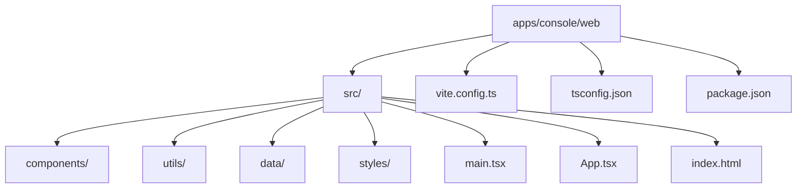
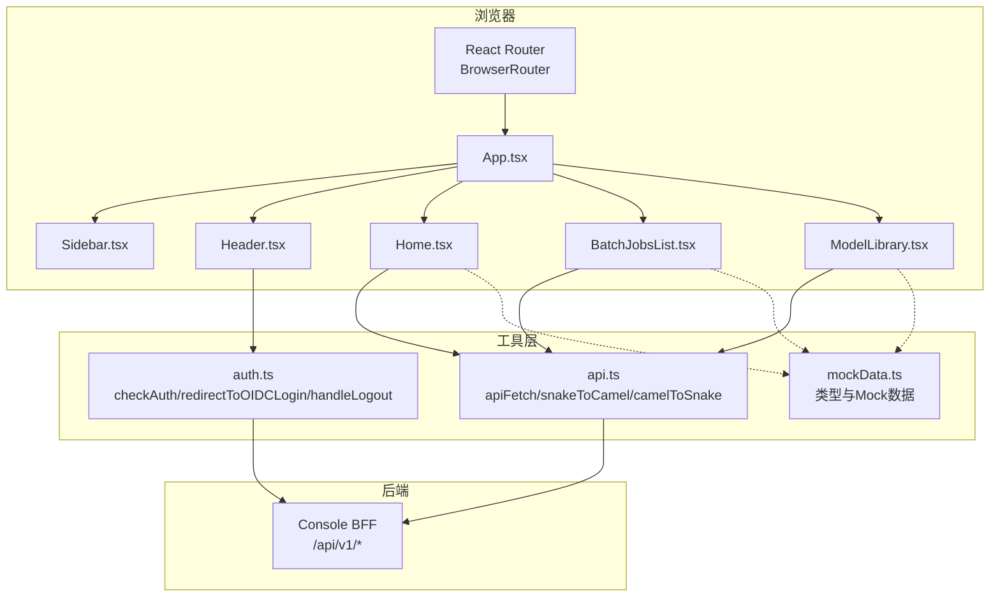
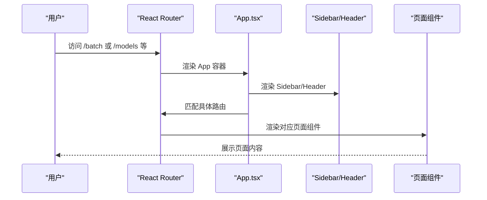
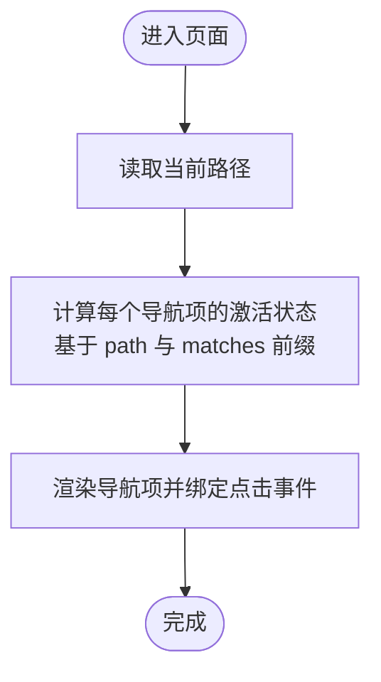
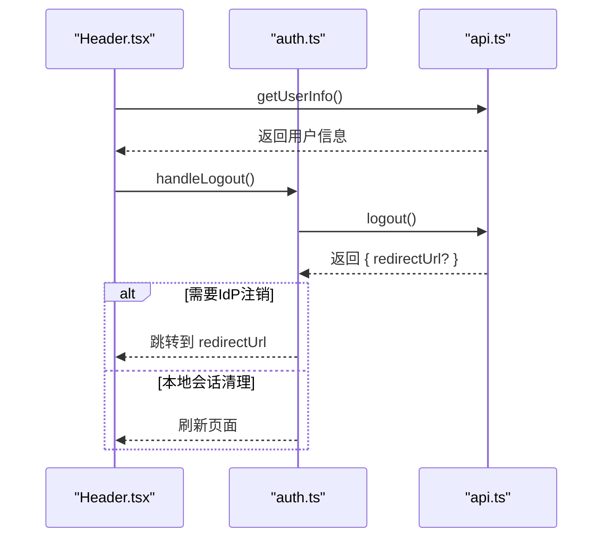
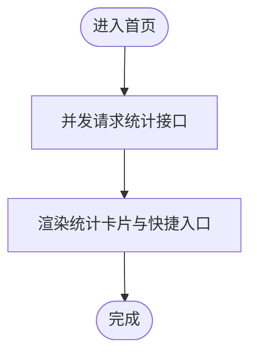
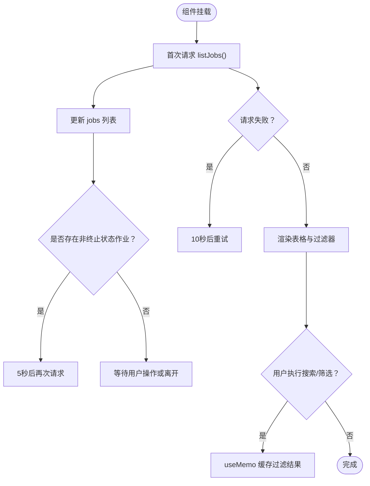
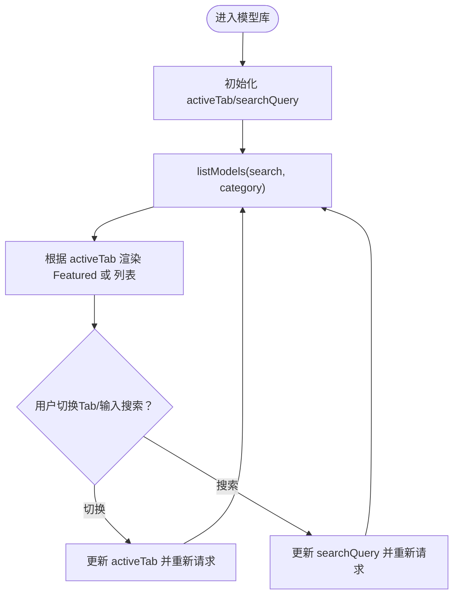
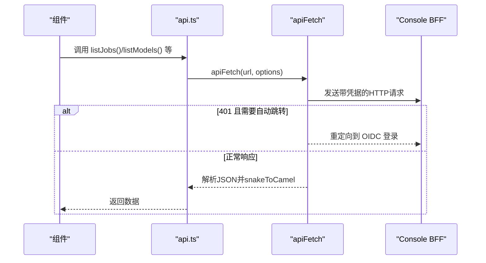
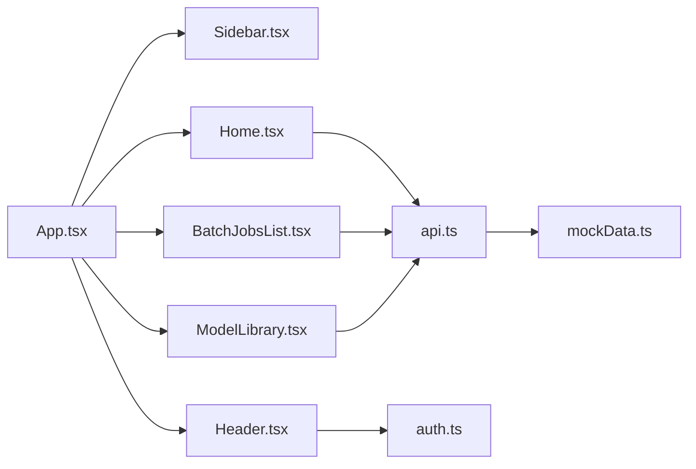

# 前端界面

<cite>
**本文引用的文件**
- [apps/console/web/src/main.tsx](file://apps/console/web/src/main.tsx)
- [apps/console/web/src/App.tsx](file://apps/console/web/src/App.tsx)
- [apps/console/web/src/components/Header.tsx](file://apps/console/web/src/components/Header.tsx)
- [apps/console/web/src/components/Sidebar.tsx](file://apps/console/web/src/components/Sidebar.tsx)
- [apps/console/web/src/components/Home.tsx](file://apps/console/web/src/components/Home.tsx)
- [apps/console/web/src/components/BatchJobsList.tsx](file://apps/console/web/src/components/BatchJobsList.tsx)
- [apps/console/web/src/components/ModelLibrary.tsx](file://apps/console/web/src/components/ModelLibrary.tsx)
- [apps/console/web/src/utils/api.ts](file://apps/console/web/src/utils/api.ts)
- [apps/console/web/src/utils/auth.ts](file://apps/console/web/src/utils/auth.ts)
- [apps/console/web/src/data/mockData.ts](file://apps/console/web/src/data/mockData.ts)
- [apps/console/web/package.json](file://apps/console/web/package.json)
- [apps/console/web/tsconfig.json](file://apps/console/web/tsconfig.json)
- [apps/console/web/vite.config.ts](file://apps/console/web/vite.config.ts)
- [apps/console/web/index.html](file://apps/console/web/index.html)
</cite>

## 目录
1. [简介](#简介)
2. [项目结构](#项目结构)
3. [核心组件](#核心组件)
4. [架构总览](#架构总览)
5. [详细组件分析](#详细组件分析)
6. [依赖分析](#依赖分析)
7. [性能考虑](#性能考虑)
8. [故障排查指南](#故障排查指南)
9. [结论](#结论)
10. [附录](#附录)

## 简介
本文件面向AIBrix控制台前端（apps/console/web），系统性梳理基于React + TypeScript的单页应用架构与实现细节，覆盖组件结构、路由配置、状态管理策略、UI组件库使用、工具链配置（Vite、Tailwind CSS、TypeScript）以及典型页面的实现逻辑。重点包括：
- 路由与页面组织：以App为根容器，通过React Router进行页面级路由分发，配合Sidebar/Header等布局组件形成统一导航体验。
- 数据访问层：封装统一的apiFetch与命名转换工具，集中处理认证态、错误与数据格式化。
- 页面组件：批处理作业列表、模型库、首页等页面的交互与状态管理。
- 工具链：Vite开发服务器与代理、Tailwind CSS样式体系、TypeScript严格模式配置。

## 项目结构
控制台前端位于apps/console/web，采用按功能域划分的目录组织方式，核心目录如下：
- src/components：页面与可复用UI组件（含Sidebar/Header、业务页面等）
- src/utils：API封装、认证辅助、校验与剪贴板工具
- src/data：类型定义与Mock数据
- 根目录：Vite配置、TypeScript配置、包依赖、入口HTML

图表来源
- [apps/console/web/src/main.tsx:1-11](file://apps/console/web/src/main.tsx#L1-L11)
- [apps/console/web/src/App.tsx:1-264](file://apps/console/web/src/App.tsx#L1-L264)
- [apps/console/web/vite.config.ts:1-29](file://apps/console/web/vite.config.ts#L1-L29)
- [apps/console/web/tsconfig.json:1-26](file://apps/console/web/tsconfig.json#L1-L26)
- [apps/console/web/package.json:1-62](file://apps/console/web/package.json#L1-L62)

章节来源
- [apps/console/web/src/main.tsx:1-11](file://apps/console/web/src/main.tsx#L1-L11)
- [apps/console/web/src/App.tsx:174-253](file://apps/console/web/src/App.tsx#L174-L253)
- [apps/console/web/vite.config.ts:1-29](file://apps/console/web/vite.config.ts#L1-L29)
- [apps/console/web/tsconfig.json:1-26](file://apps/console/web/tsconfig.json#L1-L26)
- [apps/console/web/package.json:1-62](file://apps/console/web/package.json#L1-L62)

## 核心组件
- 应用入口与路由容器
  - main.tsx：挂载BrowserRouter并渲染App根组件，引入全局样式。
  - App.tsx：集中定义路由表，包含批量推理、模型库、部署、设置等页面；同时维护顶部Header与侧边栏布局，并内置Toast提示。
- 导航与头部
  - Sidebar.tsx：左侧导航，根据当前路径高亮，支持“首页/API/Explore”三段式导航。
  - Header.tsx：用户信息获取、搜索框、通知与下拉菜单（含登出）。
- 页面组件
  - Home.tsx：欢迎页与统计卡片，异步加载部署数、作业数、模型数。
  - BatchJobsList.tsx：批量作业列表，支持搜索、状态过滤、轮询刷新。
  - ModelLibrary.tsx：模型库浏览，支持分类筛选、Featured分组视图与搜索。
- 工具与数据
  - api.ts：统一fetch封装、命名转换（snake/camel）、错误类型、各领域API方法（作业、部署、模型、模板、密钥、配额、文件、认证等）。
  - auth.ts：认证检查、OIDC登录跳转、登出处理。
  - mockData.ts：Job/Deployment/Model等类型与Mock数据。

章节来源
- [apps/console/web/src/main.tsx:1-11](file://apps/console/web/src/main.tsx#L1-L11)
- [apps/console/web/src/App.tsx:1-264](file://apps/console/web/src/App.tsx#L1-L264)
- [apps/console/web/src/components/Sidebar.tsx:1-98](file://apps/console/web/src/components/Sidebar.tsx#L1-L98)
- [apps/console/web/src/components/Header.tsx:1-74](file://apps/console/web/src/components/Header.tsx#L1-L74)
- [apps/console/web/src/components/Home.tsx:1-106](file://apps/console/web/src/components/Home.tsx#L1-L106)
- [apps/console/web/src/components/BatchJobsList.tsx:1-240](file://apps/console/web/src/components/BatchJobsList.tsx#L1-L240)
- [apps/console/web/src/components/ModelLibrary.tsx:1-297](file://apps/console/web/src/components/ModelLibrary.tsx#L1-L297)
- [apps/console/web/src/utils/api.ts:1-523](file://apps/console/web/src/utils/api.ts#L1-L523)
- [apps/console/web/src/utils/auth.ts:1-49](file://apps/console/web/src/utils/auth.ts#L1-L49)
- [apps/console/web/src/data/mockData.ts:1-613](file://apps/console/web/src/data/mockData.ts#L1-L613)

## 架构总览
前端采用“路由驱动 + 组件化”的单页架构，数据通过统一的api.ts封装HTTP请求，认证通过auth.ts与后端交互。页面组件负责UI与交互，工具模块负责数据与认证。

图表来源
- [apps/console/web/src/App.tsx:174-253](file://apps/console/web/src/App.tsx#L174-L253)
- [apps/console/web/src/components/Sidebar.tsx:1-98](file://apps/console/web/src/components/Sidebar.tsx#L1-L98)
- [apps/console/web/src/components/Header.tsx:1-74](file://apps/console/web/src/components/Header.tsx#L1-L74)
- [apps/console/web/src/components/Home.tsx:1-106](file://apps/console/web/src/components/Home.tsx#L1-L106)
- [apps/console/web/src/components/BatchJobsList.tsx:1-240](file://apps/console/web/src/components/BatchJobsList.tsx#L1-L240)
- [apps/console/web/src/components/ModelLibrary.tsx:1-297](file://apps/console/web/src/components/ModelLibrary.tsx#L1-L297)
- [apps/console/web/src/utils/api.ts:1-523](file://apps/console/web/src/utils/api.ts#L1-L523)
- [apps/console/web/src/utils/auth.ts:1-49](file://apps/console/web/src/utils/auth.ts#L1-L49)
- [apps/console/web/src/data/mockData.ts:1-613](file://apps/console/web/src/data/mockData.ts#L1-L613)

## 详细组件分析

### 路由与页面组织（App.tsx）
- 路由适配器模式：通过Route适配器函数（如BatchJobsListRoute、JobDetailRoute、ModelDetailRoute、TemplateFormRoute等）将URL参数与导航行为注入到具体页面组件，保持页面组件无路由依赖。
- 设置页：支持“API Keys”“Secrets”两个子页，通过URL参数选择当前Tab。
- 通用布局：根据当前路径决定是否显示Settings侧边栏或常规Sidebar；Header在所有页面共享。
- 404兜底：未匹配路由返回“Not Found”。

图表来源
- [apps/console/web/src/App.tsx:203-240](file://apps/console/web/src/App.tsx#L203-L240)
- [apps/console/web/src/components/Sidebar.tsx:1-98](file://apps/console/web/src/components/Sidebar.tsx#L1-L98)
- [apps/console/web/src/components/Header.tsx:1-74](file://apps/console/web/src/components/Header.tsx#L1-L74)

章节来源
- [apps/console/web/src/App.tsx:26-88](file://apps/console/web/src/App.tsx#L26-L88)
- [apps/console/web/src/App.tsx:159-172](file://apps/console/web/src/App.tsx#L159-L172)
- [apps/console/web/src/App.tsx:203-240](file://apps/console/web/src/App.tsx#L203-L240)

### 侧边栏（Sidebar.tsx）
- 导航项：分为“首页”“API”“Explore”三段，支持根据当前路径与前缀匹配高亮。
- 交互：点击导航项触发useNavigate跳转；侧边栏固定宽度，滚动区域在中间部分。

图表来源
- [apps/console/web/src/components/Sidebar.tsx:13-38](file://apps/console/web/src/components/Sidebar.tsx#L13-L38)
- [apps/console/web/src/components/Sidebar.tsx:40-64](file://apps/console/web/src/components/Sidebar.tsx#L40-L64)

章节来源
- [apps/console/web/src/components/Sidebar.tsx:1-98](file://apps/console/web/src/components/Sidebar.tsx#L1-L98)

### 头部（Header.tsx）
- 用户信息：首次渲染时调用getUserInfo获取用户信息，显示首字母徽标与下拉菜单。
- 登出：调用handleLogout，若后端返回重定向URL则跳转至IdP注销，否则刷新页面。

图表来源
- [apps/console/web/src/components/Header.tsx:7-15](file://apps/console/web/src/components/Header.tsx#L7-L15)
- [apps/console/web/src/utils/auth.ts:34-48](file://apps/console/web/src/utils/auth.ts#L34-L48)
- [apps/console/web/src/utils/api.ts:518-522](file://apps/console/web/src/utils/api.ts#L518-L522)

章节来源
- [apps/console/web/src/components/Header.tsx:1-74](file://apps/console/web/src/components/Header.tsx#L1-L74)
- [apps/console/web/src/utils/auth.ts:1-49](file://apps/console/web/src/utils/auth.ts#L1-L49)
- [apps/console/web/src/utils/api.ts:509-522](file://apps/console/web/src/utils/api.ts#L509-L522)

### 首页（Home.tsx）
- 统计卡片：加载部署数、30天内批处理作业数、可用模型数。
- 快速链接：提供“批量推理”“部署”“模型库”“Playground”的快捷入口。
- 数据来源：通过api.ts中的listDeployments/listJobs/listModels获取数据。

图表来源
- [apps/console/web/src/components/Home.tsx:10-22](file://apps/console/web/src/components/Home.tsx#L10-L22)
- [apps/console/web/src/utils/api.ts:312-341](file://apps/console/web/src/utils/api.ts#L312-L341)

章节来源
- [apps/console/web/src/components/Home.tsx:1-106](file://apps/console/web/src/components/Home.tsx#L1-L106)
- [apps/console/web/src/utils/api.ts:312-341](file://apps/console/web/src/utils/api.ts#L312-L341)

### 批量推理作业列表（BatchJobsList.tsx）
- 功能要点
  - 加载与轮询：首次加载时设置loading与loadError；对非终止状态的作业进行周期性轮询（5秒），失败时退避（10秒）。
  - 过滤与搜索：支持按状态过滤与多字段搜索（id/name/model/createdBy）。
  - 表格展示：包含作业基本信息、请求计数、状态标签（不同状态对应不同样式）。
- 状态管理
  - 本地状态：jobs、loading、loadError、searchQuery、statusFilter、showStatusDropdown。
  - 内存缓存：使用useMemo对过滤结果进行缓存，避免重复计算。

图表来源
- [apps/console/web/src/components/BatchJobsList.tsx:56-97](file://apps/console/web/src/components/BatchJobsList.tsx#L56-L97)
- [apps/console/web/src/components/BatchJobsList.tsx:99-111](file://apps/console/web/src/components/BatchJobsList.tsx#L99-L111)
- [apps/console/web/src/utils/api.ts:284-290](file://apps/console/web/src/utils/api.ts#L284-L290)

章节来源
- [apps/console/web/src/components/BatchJobsList.tsx:1-240](file://apps/console/web/src/components/BatchJobsList.tsx#L1-L240)
- [apps/console/web/src/utils/api.ts:284-308](file://apps/console/web/src/utils/api.ts#L284-L308)

### 模型库（ModelLibrary.tsx）
- 功能要点
  - 分类Tab：Featured、All、LLM/Audio/Image/Video/Vision/Embedding/Reranks。
  - Featured视图：按类别分组展示，每类最多4个模型；支持搜索。
  - 列表视图：按类别或“All”展示，支持搜索与分类徽章。
- 视觉与交互
  - 模型卡片：图标、名称、价格摘要、分类徽章、NEW标记。
  - 列表行：小图标、名称、NEW标记、价格摘要、分类徽章。

图表来源
- [apps/console/web/src/components/ModelLibrary.tsx:97-104](file://apps/console/web/src/components/ModelLibrary.tsx#L97-L104)
- [apps/console/web/src/components/ModelLibrary.tsx:161-179](file://apps/console/web/src/components/ModelLibrary.tsx#L161-L179)
- [apps/console/web/src/utils/api.ts:337-341](file://apps/console/web/src/utils/api.ts#L337-L341)

章节来源
- [apps/console/web/src/components/ModelLibrary.tsx:1-297](file://apps/console/web/src/components/ModelLibrary.tsx#L1-L297)
- [apps/console/web/src/utils/api.ts:337-341](file://apps/console/web/src/utils/api.ts#L337-L341)

### API封装与认证（api.ts、auth.ts）
- api.ts
  - 统一fetch：apiFetch封装请求头、凭据、错误处理与401自动跳转OIDC登录。
  - 命名转换：snakeToCamel/camelToSnake用于前后端字段命名一致性。
  - 错误类型：APIError携带HTTP状态码。
  - 查询参数：buildQuery生成查询字符串。
  - 典型API：作业（list/get/create/cancel）、部署（list/get/create/delete）、模型（list/get）、模板（list/get/create/update/delete/resolved by name）、密钥（list/create/delete）、Secrets、配额、文件上传/列表、认证（配置、用户信息、登出）。
- auth.ts
  - checkAuth：获取认证配置与用户信息，支持dev模式直通。
  - redirectToOIDCLogin：构造登录URL并跳转。
  - handleLogout：调用logout，处理IdP重定向或刷新。

图表来源
- [apps/console/web/src/utils/api.ts:235-268](file://apps/console/web/src/utils/api.ts#L235-L268)
- [apps/console/web/src/utils/api.ts:284-301](file://apps/console/web/src/utils/api.ts#L284-L301)
- [apps/console/web/src/utils/auth.ts:10-22](file://apps/console/web/src/utils/auth.ts#L10-L22)

章节来源
- [apps/console/web/src/utils/api.ts:1-523](file://apps/console/web/src/utils/api.ts#L1-L523)
- [apps/console/web/src/utils/auth.ts:1-49](file://apps/console/web/src/utils/auth.ts#L1-L49)

## 依赖分析
- 依赖关系
  - 组件依赖：页面组件依赖api.ts提供的数据访问方法；Header依赖auth.ts进行登出；App.tsx作为路由容器协调布局与页面。
  - 工具依赖：api.ts内部依赖mockData.ts中的类型（用于TS类型推断与Mock回退场景）。
- 外部依赖
  - React生态：react、react-router-dom、react-hook-form、lucide-react等。
  - UI与样式：Radix UI组件、Tailwind CSS v4、clsx、tailwind-merge等。
  - 构建与开发：@vitejs/plugin-react-swc、@tailwindcss/vite、vite、typescript。

图表来源
- [apps/console/web/src/App.tsx:1-264](file://apps/console/web/src/App.tsx#L1-L264)
- [apps/console/web/src/components/Sidebar.tsx:1-98](file://apps/console/web/src/components/Sidebar.tsx#L1-L98)
- [apps/console/web/src/components/Header.tsx:1-74](file://apps/console/web/src/components/Header.tsx#L1-L74)
- [apps/console/web/src/components/Home.tsx:1-106](file://apps/console/web/src/components/Home.tsx#L1-L106)
- [apps/console/web/src/components/BatchJobsList.tsx:1-240](file://apps/console/web/src/components/BatchJobsList.tsx#L1-L240)
- [apps/console/web/src/components/ModelLibrary.tsx:1-297](file://apps/console/web/src/components/ModelLibrary.tsx#L1-L297)
- [apps/console/web/src/utils/api.ts:1-523](file://apps/console/web/src/utils/api.ts#L1-L523)
- [apps/console/web/src/utils/auth.ts:1-49](file://apps/console/web/src/utils/auth.ts#L1-L49)
- [apps/console/web/src/data/mockData.ts:1-613](file://apps/console/web/src/data/mockData.ts#L1-L613)

章节来源
- [apps/console/web/package.json:1-62](file://apps/console/web/package.json#L1-L62)

## 性能考虑
- 组件渲染优化
  - 使用useMemo对过滤结果进行缓存，减少不必要的渲染（如BatchJobsList.tsx的filtered）。
  - 列表渲染中避免在渲染阶段做昂贵计算，将计算前置到effect或事件回调中。
- 网络请求优化
  - 对非终止状态的批处理作业采用轮询策略（5秒），失败时退避（10秒），避免频繁重试导致资源浪费。
  - 查询参数仅在有值时拼接，减少无效请求。
- 样式与体积
  - Tailwind CSS按需引入，结合组件内联样式，避免全局污染。
  - 构建目标设为esnext，利用现代浏览器特性提升运行时性能。

## 故障排查指南
- 401未授权自动跳转OIDC
  - 现象：访问受保护接口返回401，页面自动跳转到OIDC登录。
  - 排查：确认getAuthConfig返回mode为oidc；检查NO_AUTO_REDIRECT_PREFIXES是否覆盖了当前URL前缀。
- 登录/登出异常
  - 现象：登出后仍显示已登录或无法回到登录页。
  - 排查：确认logout返回的redirectUrl是否为空；若为空，刷新页面是否能正确重置状态。
- 数据加载失败
  - 现象：页面显示“加载失败”或空白。
  - 排查：检查apiFetch的错误处理与loadError状态；确认代理配置与后端可达性。
- 代理与跨域
  - 现象：开发环境请求被CORS拦截。
  - 排查：确认vite.config.ts中代理配置指向正确的后端地址；确保后端允许来自前端域名的请求。

章节来源
- [apps/console/web/src/utils/api.ts:225-233](file://apps/console/web/src/utils/api.ts#L225-L233)
- [apps/console/web/src/utils/api.ts:235-268](file://apps/console/web/src/utils/api.ts#L235-L268)
- [apps/console/web/src/utils/auth.ts:24-48](file://apps/console/web/src/utils/auth.ts#L24-L48)
- [apps/console/web/vite.config.ts:21-27](file://apps/console/web/vite.config.ts#L21-L27)

## 结论
本前端工程以清晰的路由与组件边界、统一的数据与认证抽象为核心，实现了从首页概览到批量推理、模型库等关键业务页面的完整覆盖。通过useMemo等优化手段与合理的轮询策略，兼顾了用户体验与性能表现。后续可在以下方面持续演进：
- 将Mock数据替换为真实后端接口，完善错误边界与加载态。
- 引入状态管理方案（如Zustand或Redux Toolkit）以承载更复杂的跨组件状态。
- 增加单元测试与集成测试，保障关键流程的稳定性。

## 附录
- 开发与构建
  - 开发服务器：vite，端口3000，自动打开浏览器，代理/api到后端。
  - 构建输出：outDir build，目标esnext。
  - TypeScript：严格模式开启，路径别名@指向src。
  - 依赖：React 18、React Router 7、Radix UI、Lucide、Tailwind CSS v4、Recharts、Sonner等。

章节来源
- [apps/console/web/vite.config.ts:1-29](file://apps/console/web/vite.config.ts#L1-L29)
- [apps/console/web/tsconfig.json:1-26](file://apps/console/web/tsconfig.json#L1-L26)
- [apps/console/web/package.json:1-62](file://apps/console/web/package.json#L1-L62)
- [apps/console/web/index.html:1-15](file://apps/console/web/index.html#L1-L15)