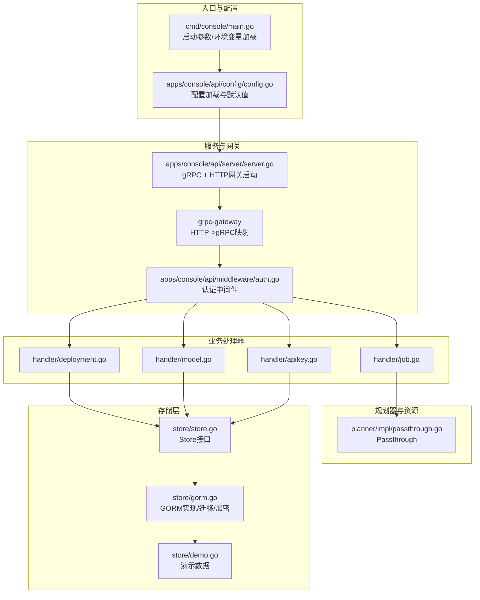
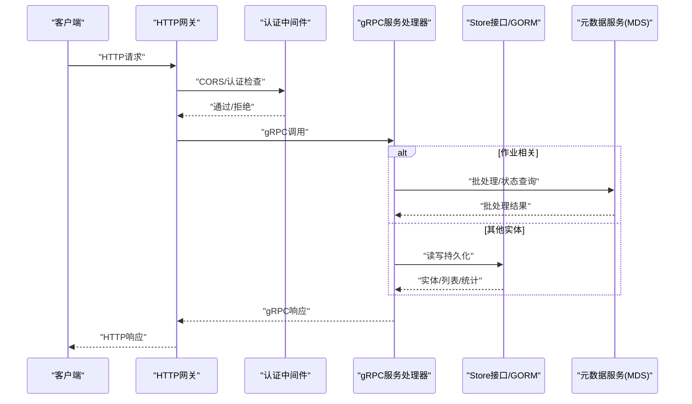
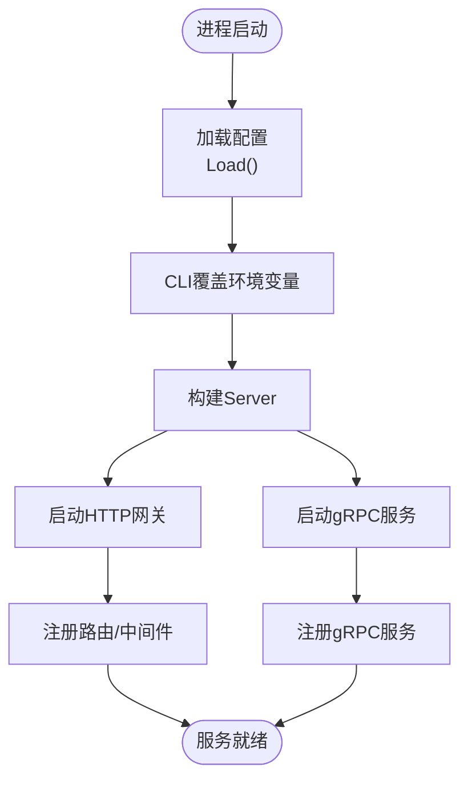
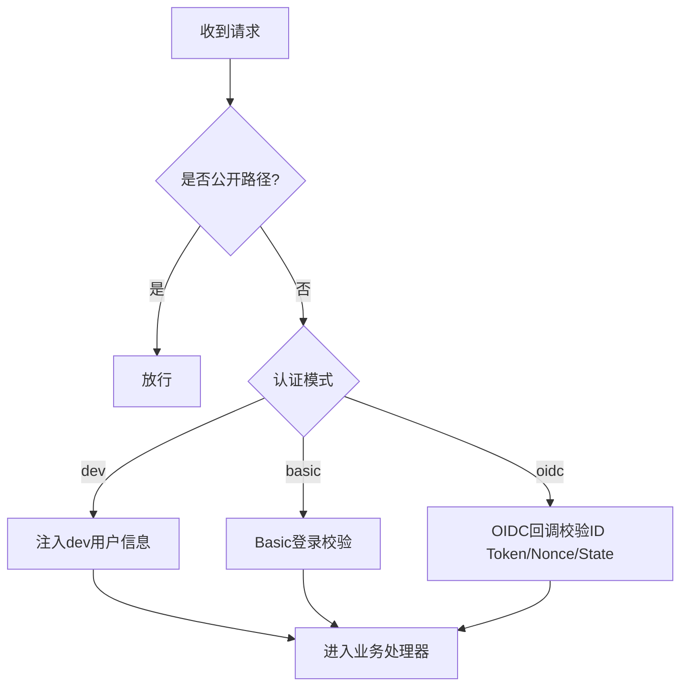
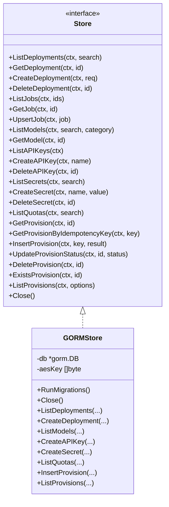
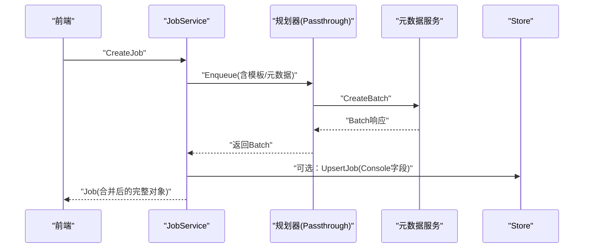
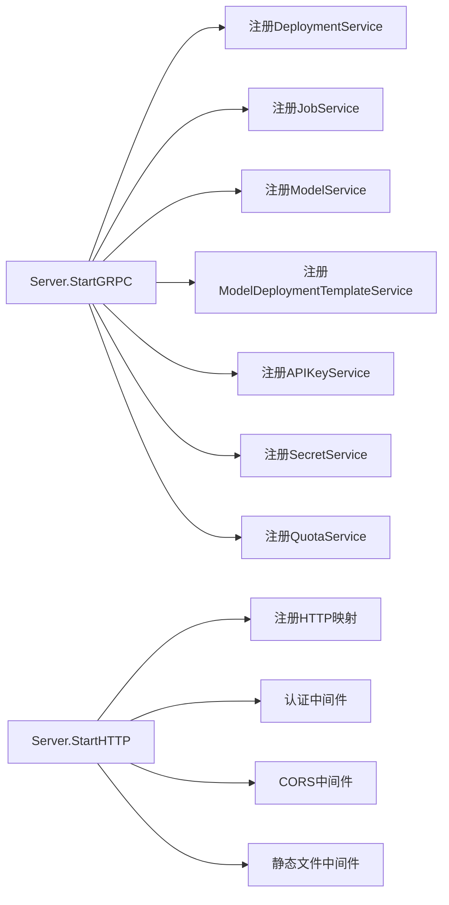

# 后端API

<cite>
**本文引用的文件**
- [main.go](file://cmd/console/main.go)
- [config.go](file://apps/console/api/config/config.go)
- [server.go](file://apps/console/api/server/server.go)
- [console.proto](file://apps/console/api/proto/console/v1/console.proto)
- [auth.go](file://apps/console/api/middleware/auth.go)
- [store.go](file://apps/console/api/store/store.go)
- [deployment.go](file://apps/console/api/handler/deployment.go)
- [model.go](file://apps/console/api/handler/model.go)
- [job.go](file://apps/console/api/handler/job.go)
- [apikey.go](file://apps/console/api/handler/apikey.go)
- [gorm.go](file://apps/console/api/store/gorm.go)
- [demo.go](file://apps/console/api/store/demo.go)
- [passthrough.go](file://apps/console/api/planner/impl/passthrough.go)
</cite>

## 目录
1. [简介](#简介)
2. [项目结构](#项目结构)
3. [核心组件](#核心组件)
4. [架构总览](#架构总览)
5. [详细组件分析](#详细组件分析)
6. [依赖关系分析](#依赖关系分析)
7. [性能考量](#性能考量)
8. [故障排查指南](#故障排查指南)
9. [结论](#结论)
10. [附录](#附录)

## 简介
本文件面向AIBrix控制台后端API服务，系统性梳理基于Go语言的API服务架构与实现，覆盖服务器配置、路由设计、中间件（认证授权）、数据库与存储层、业务处理器（部署管理、模型管理、作业调度、API密钥与密文管理、配额查询）等关键模块。文档同时提供API接口规范、请求/响应格式、错误处理策略，并给出可扩展的实践建议。

## 项目结构
控制台后端位于apps/console/api目录，采用“协议驱动 + gRPC + HTTP网关”的分层设计：
- 协议层：使用Protocol Buffers定义服务契约，通过grpc-gateway将gRPC映射为REST风格HTTP接口。
- 服务层：gRPC服务由各业务处理器实现，注册到gRPC服务器。
- 网关层：HTTP网关将HTTP请求转译为gRPC调用，统一接入认证中间件与CORS。
- 存储层：抽象Store接口，GORM实现支持SQLite/MySQL；提供加密存储与迁移能力。
- 认证中间件：支持dev/basic/OIDC三种模式，会话签名、角色解析、登出等。
- 规划器：当前采用Passthrough实现，串联资源编排与元数据服务（MDS）。

图表来源
- [main.go:34-118](file://cmd/console/main.go#L34-L118)
- [config.go:131-172](file://apps/console/api/config/config.go#L131-L172)
- [server.go:56-135](file://apps/console/api/server/server.go#L56-L135)
- [auth.go:286-293](file://apps/console/api/middleware/auth.go#L286-L293)
- [store.go:26-103](file://apps/console/api/store/store.go#L26-L103)
- [gorm.go:139-141](file://apps/console/api/store/gorm.go#L139-L141)
- [demo.go:71-73](file://apps/console/api/store/demo.go#L71-L73)

章节来源
- [main.go:34-118](file://cmd/console/main.go#L34-L118)
- [config.go:131-172](file://apps/console/api/config/config.go#L131-L172)
- [server.go:56-135](file://apps/console/api/server/server.go#L56-L135)

## 核心组件
- 配置系统：从环境变量读取配置，支持开发/生产模式差异，生成随机密钥用于dev模式。
- 服务器：同时启动gRPC与HTTP网关，注册所有服务，挂载认证与CORS中间件。
- 认证中间件：支持dev/basic/OIDC三模式，会话签名验证，角色解析，RP-Initiated登出。
- 存储层：抽象Store接口，GORM实现支持SQLite/MySQL，内置加密存储与迁移。
- 业务处理器：部署、模型、作业、API密钥、密文、配额等服务的gRPC实现。
- 规划器：Passthrough串联资源编排与元数据服务，完成批处理作业提交与查询。

章节来源
- [config.go:29-123](file://apps/console/api/config/config.go#L29-L123)
- [server.go:46-103](file://apps/console/api/server/server.go#L46-L103)
- [auth.go:52-127](file://apps/console/api/middleware/auth.go#L52-L127)
- [store.go:26-103](file://apps/console/api/store/store.go#L26-L103)
- [deployment.go:27-58](file://apps/console/api/handler/deployment.go#L27-L58)
- [model.go:26-46](file://apps/console/api/handler/model.go#L26-L46)
- [job.go:138-166](file://apps/console/api/handler/job.go#L138-L166)
- [apikey.go:29-63](file://apps/console/api/handler/apikey.go#L29-L63)
- [passthrough.go:47-57](file://apps/console/api/planner/impl/passthrough.go#L47-L57)

## 架构总览
下图展示了从客户端到gRPC服务、再到存储与外部系统的整体调用链路，以及认证与CORS在HTTP层的拦截位置。

图表来源
- [server.go:139-198](file://apps/console/api/server/server.go#L139-L198)
- [auth.go:238-274](file://apps/console/api/middleware/auth.go#L238-L274)
- [job.go:168-207](file://apps/console/api/handler/job.go#L168-L207)
- [gorm.go:177-236](file://apps/console/api/store/gorm.go#L177-L236)

## 详细组件分析

### 配置与启动流程
- 启动参数优先于环境变量；dev模式下自动设置日志级别与演示数据注入。
- 服务器根据Store URI选择SQLite/MySQL，支持内存模式；初始化认证中间件与规划器。
- HTTP网关注册所有gRPC服务的HTTP映射，附加Playground代理、文件代理、健康检查与静态文件服务。

图表来源
- [main.go:34-118](file://cmd/console/main.go#L34-L118)
- [config.go:131-172](file://apps/console/api/config/config.go#L131-L172)
- [server.go:56-135](file://apps/console/api/server/server.go#L56-L135)
- [server.go:139-198](file://apps/console/api/server/server.go#L139-L198)

章节来源
- [main.go:34-118](file://cmd/console/main.go#L34-L118)
- [server.go:56-135](file://apps/console/api/server/server.go#L56-L135)

### 认证与授权
- 支持三种模式：
  - dev：本地开发模拟用户，自动赋予管理员角色。
  - basic：用户名/密码校验，成功后建立会话。
  - oidc：OAuth2/OIDC授权码流程，ID Token校验与nonce/state保护，支持RP-Initiated登出。
- 会话以签名Cookie保存，包含用户信息与过期时间；支持从上下文提取用户信息。
- 角色解析：优先邮箱白名单，其次组成员身份，否则为访客。

图表来源
- [auth.go:219-235](file://apps/console/api/middleware/auth.go#L219-L235)
- [auth.go:238-274](file://apps/console/api/middleware/auth.go#L238-L274)
- [auth.go:306-376](file://apps/console/api/middleware/auth.go#L306-L376)
- [auth.go:378-513](file://apps/console/api/middleware/auth.go#L378-L513)
- [auth.go:744-774](file://apps/console/api/middleware/auth.go#L744-L774)

章节来源
- [auth.go:52-127](file://apps/console/api/middleware/auth.go#L52-L127)
- [auth.go:219-274](file://apps/console/api/middleware/auth.go#L219-L274)
- [auth.go:744-774](file://apps/console/api/middleware/auth.go#L744-L774)

### 数据模型与存储层
- Store接口抽象了部署、模型、作业、模板、API密钥、密文、配额、资源编排等能力。
- GORM实现支持SQLite/MySQL，自动迁移；API密钥采用SHA-256哈希存储，密文采用AES-GCM加密。
- 演示数据：提供一键注入的样例记录，便于本地联调与UI演示。

图表来源
- [store.go:26-103](file://apps/console/api/store/store.go#L26-L103)
- [gorm.go:125-137](file://apps/console/api/store/gorm.go#L125-L137)
- [gorm.go:139-141](file://apps/console/api/store/gorm.go#L139-L141)

章节来源
- [store.go:26-103](file://apps/console/api/store/store.go#L26-L103)
- [gorm.go:125-170](file://apps/console/api/store/gorm.go#L125-L170)
- [demo.go:71-100](file://apps/console/api/store/demo.go#L71-L100)

### 作业调度（批处理）
- 作业服务通过规划器（Passthrough）将请求转换为对元数据服务（MDS）的OpenAI兼容批处理API调用。
- 控制台侧仅持久化Console自有字段（名称、创建者、模板绑定），其余状态与用量由MDS聚合返回。
- 开发模式下，若MDS不可达，回退到本地演示作业数据。

图表来源
- [job.go:149-166](file://apps/console/api/handler/job.go#L149-L166)
- [job.go:243-306](file://apps/console/api/handler/job.go#L243-L306)
- [passthrough.go:61-118](file://apps/console/api/planner/impl/passthrough.go#L61-L118)

章节来源
- [job.go:138-306](file://apps/console/api/handler/job.go#L138-L306)
- [passthrough.go:47-145](file://apps/console/api/planner/impl/passthrough.go#L47-L145)

### 部署管理
- 提供部署的增删查改接口，内部生成唯一标识与状态，默认状态为“Deploying”。
- 支持按名称/基础模型/创建者模糊搜索。

章节来源
- [deployment.go:27-58](file://apps/console/api/handler/deployment.go#L27-L58)
- [gorm.go:177-236](file://apps/console/api/store/gorm.go#L177-L236)

### 模型管理
- 提供模型的分页列表与详情查询，支持按类别过滤与关键词检索。
- 模型规格、定价、元数据等字段均来自协议定义。

章节来源
- [model.go:26-46](file://apps/console/api/handler/model.go#L26-L46)
- [gorm.go:290-329](file://apps/console/api/store/gorm.go#L290-L329)

### API密钥与密文
- API密钥创建时生成完整密钥，仅在创建时返回一次，后续仅存储哈希与前缀掩码。
- 密文采用AES-GCM加密存储，解密在读取时进行。

章节来源
- [apikey.go:29-63](file://apps/console/api/handler/apikey.go#L29-L63)
- [gorm.go:549-575](file://apps/console/api/store/gorm.go#L549-L575)
- [gorm.go:598-613](file://apps/console/api/store/gorm.go#L598-L613)
- [gorm.go:155-170](file://apps/console/api/store/gorm.go#L155-L170)

### 配额查询
- 提供配额列表查询，支持按名称或标识模糊匹配。

章节来源
- [gorm.go:626-645](file://apps/console/api/store/gorm.go#L626-L645)

## 依赖关系分析
- 服务注册：gRPC服务器注册部署、作业、模型、模板、API密钥、密文、配额等服务。
- 网关注册：HTTP网关为每个服务注册REST映射，额外挂载Playground代理、文件代理、健康检查与认证路由。
- 中间件链：CORS -> 认证 -> 路由，静态文件中间件在最外层包裹。

图表来源
- [server.go:121-135](file://apps/console/api/server/server.go#L121-L135)
- [server.go:146-158](file://apps/console/api/server/server.go#L146-L158)
- [server.go:181-197](file://apps/console/api/server/server.go#L181-L197)

章节来源
- [server.go:121-158](file://apps/console/api/server/server.go#L121-L158)
- [server.go:181-197](file://apps/console/api/server/server.go#L181-L197)

## 性能考量
- 连接池与并发：SQLite内存模式限制连接数；MySQL需合理设置连接池参数。
- 查询优化：列表接口默认排序与分页参数，避免一次性拉取大量数据。
- 加密成本：密文加解密与API密钥哈希计算属于CPU密集操作，建议在批量导入时合并事务。
- 日志与可观测：HTTP往返日志在高负载下可能带来开销，建议按需开启调试级别。

## 故障排查指南
- 启动失败
  - 检查配置项（Store URI、认证密钥、端口占用）。
  - 查看启动日志中“Failed to start gRPC server/HTTP gateway”定位具体错误。
- 认证问题
  - dev模式：确认未显式覆盖认证模式；检查会话Cookie是否被浏览器禁用。
  - basic模式：核对用户名/密码是否正确；查看登录响应体。
  - oidc模式：核对Issuer、ClientID、ClientSecret、RedirectURL；检查state/nonce与ID Token校验日志。
- 作业调度异常
  - 若MDS不可达，开发模式会回退演示数据；生产模式返回空列表并记录警告。
  - 检查规划器错误映射（无效参数/资源不足）与SDK错误码映射。
- 存储异常
  - MySQL/SQLite连通性与权限；迁移失败时检查数据库版本与权限。
  - 密文解密失败通常与加密密钥不一致有关。

章节来源
- [main.go:92-103](file://cmd/console/main.go#L92-L103)
- [auth.go:306-376](file://apps/console/api/middleware/auth.go#L306-L376)
- [auth.go:378-513](file://apps/console/api/middleware/auth.go#L378-L513)
- [job.go:170-207](file://apps/console/api/handler/job.go#L170-L207)
- [job.go:330-373](file://apps/console/api/handler/job.go#L330-L373)
- [gorm.go:549-575](file://apps/console/api/store/gorm.go#L549-L575)

## 结论
该后端API服务采用清晰的分层架构与协议驱动设计，结合认证中间件、统一的存储抽象与规划器集成，实现了从部署、模型、作业到密钥与配额的全栈能力。通过HTTP网关与gRPC的组合，既满足REST易用性，又保持高性能与强类型约束。建议在生产环境中完善资源编排与异步任务队列，增强可观测性与容错能力。

## 附录

### API接口文档（概要）
- 部署管理
  - 列表：GET /api/v1/deployments
  - 详情：GET /api/v1/deployments/{id}
  - 创建：POST /api/v1/deployments
  - 删除：DELETE /api/v1/deployments/{id}
- 作业管理（批处理）
  - 列表：GET /api/v1/jobs
  - 详情：GET /api/v1/jobs/{id}
  - 创建：POST /api/v1/jobs
  - 取消：POST /api/v1/jobs/{id}/cancel
- 模型目录
  - 列表：GET /api/v1/models
  - 详情：GET /api/v1/models/{id}
- 模板管理
  - 列表：GET /api/v1/models/{model_id}/deployment-templates
  - 详情：GET /api/v1/models/{model_id}/deployment-templates/{id}
  - 创建：POST /api/v1/models/{model_id}/deployment-templates
  - 更新：PUT /api/v1/models/{model_id}/deployment-templates/{id}
  - 删除：DELETE /api/v1/models/{model_id}/deployment-templates/{id}
  - 解析：GET /api/v1/models/{model_id}/deployment-templates/by-name/{name}
- API密钥
  - 列表：GET /api/v1/apikeys
  - 创建：POST /api/v1/apikeys
  - 删除：DELETE /api/v1/apikeys/{id}
- 密文
  - 列表：GET /api/v1/secrets
  - 创建：POST /api/v1/secrets
  - 删除：DELETE /api/v1/secrets/{id}
- 配额
  - 列表：GET /api/v1/quotas

章节来源
- [console.proto:28-96](file://apps/console/api/proto/console/v1/console.proto#L28-L96)
- [console.proto:108-134](file://apps/console/api/proto/console/v1/console.proto#L108-L134)
- [console.proto:235-247](file://apps/console/api/proto/console/v1/console.proto#L235-L247)
- [console.proto:378-420](file://apps/console/api/proto/console/v1/console.proto#L378-L420)
- [console.proto:550-569](file://apps/console/api/proto/console/v1/console.proto#L550-L569)
- [console.proto:601-620](file://apps/console/api/proto/console/v1/console.proto#L601-L620)
- [console.proto:648-654](file://apps/console/api/proto/console/v1/console.proto#L648-L654)

### 请求/响应格式与错误处理
- 请求/响应：基于Protocol Buffers定义，HTTP网关通过grpc-gateway映射为JSON。
- 错误映射：
  - 作业服务：SDK错误映射为gRPC状态码；规划器错误映射为InvalidArgument/ResourceExhausted；其他网络错误映射为Unavailable。
  - 通用：参数错误映射为InvalidArgument；未找到映射为NotFound；权限相关映射为PermissionDenied；资源不足映射为ResourceExhausted。

章节来源
- [job.go:330-373](file://apps/console/api/handler/job.go#L330-L373)