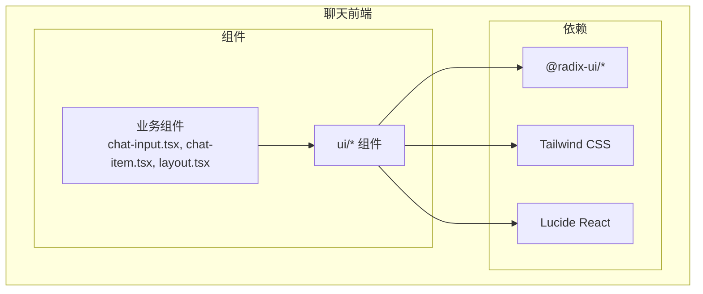
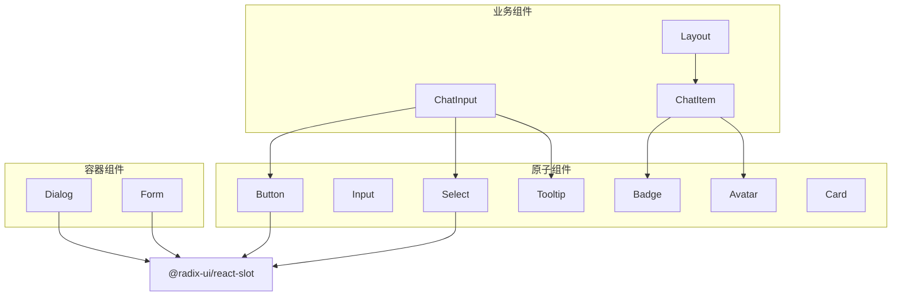
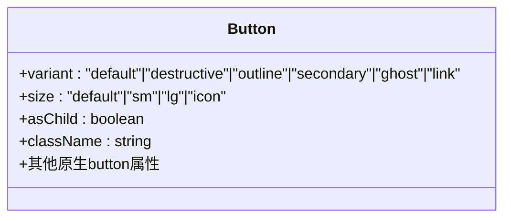
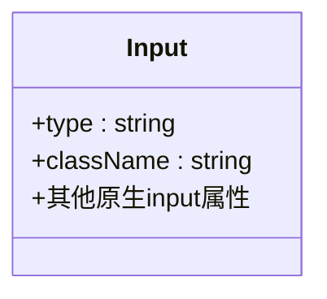
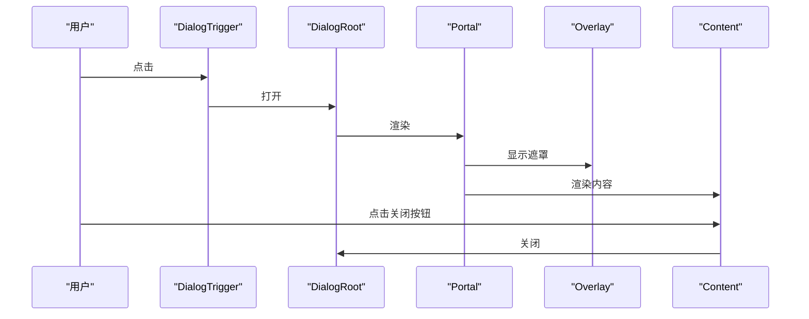
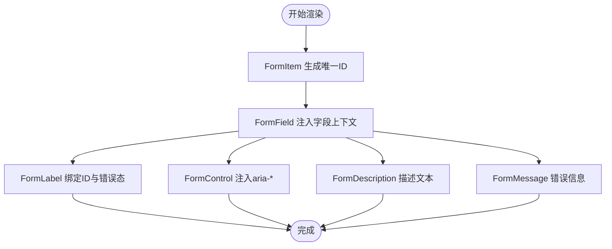
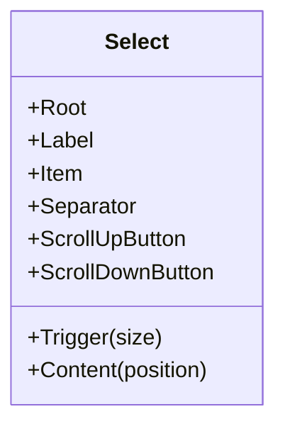
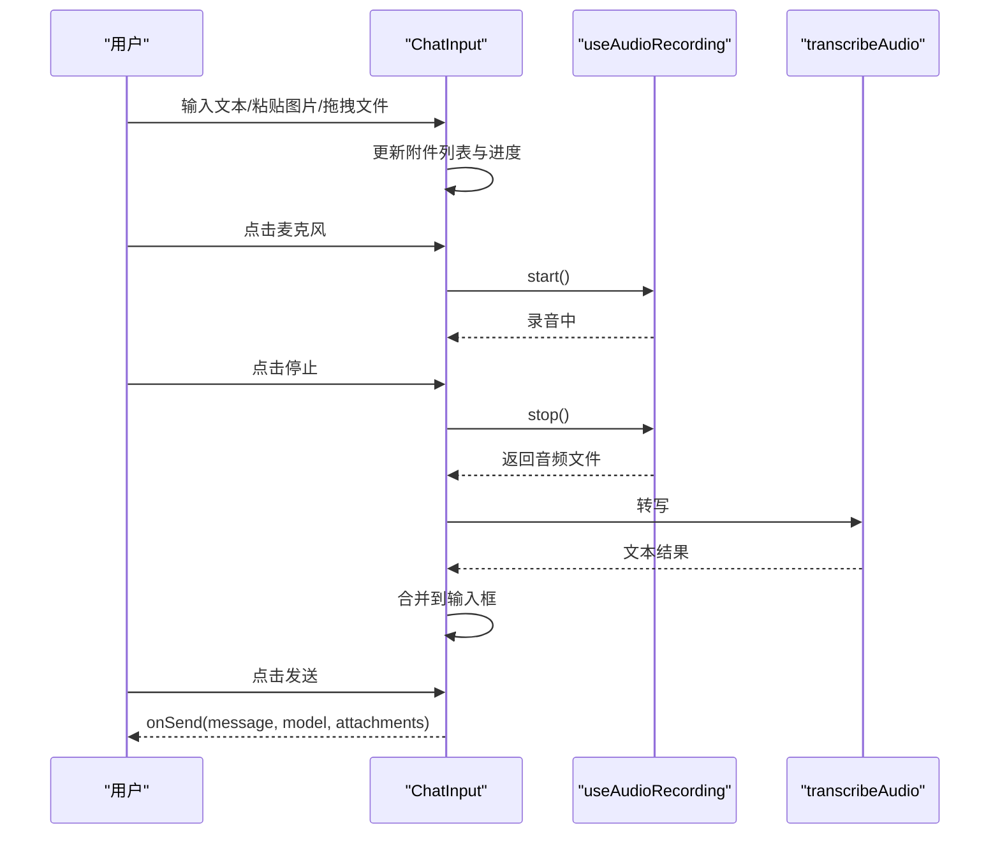
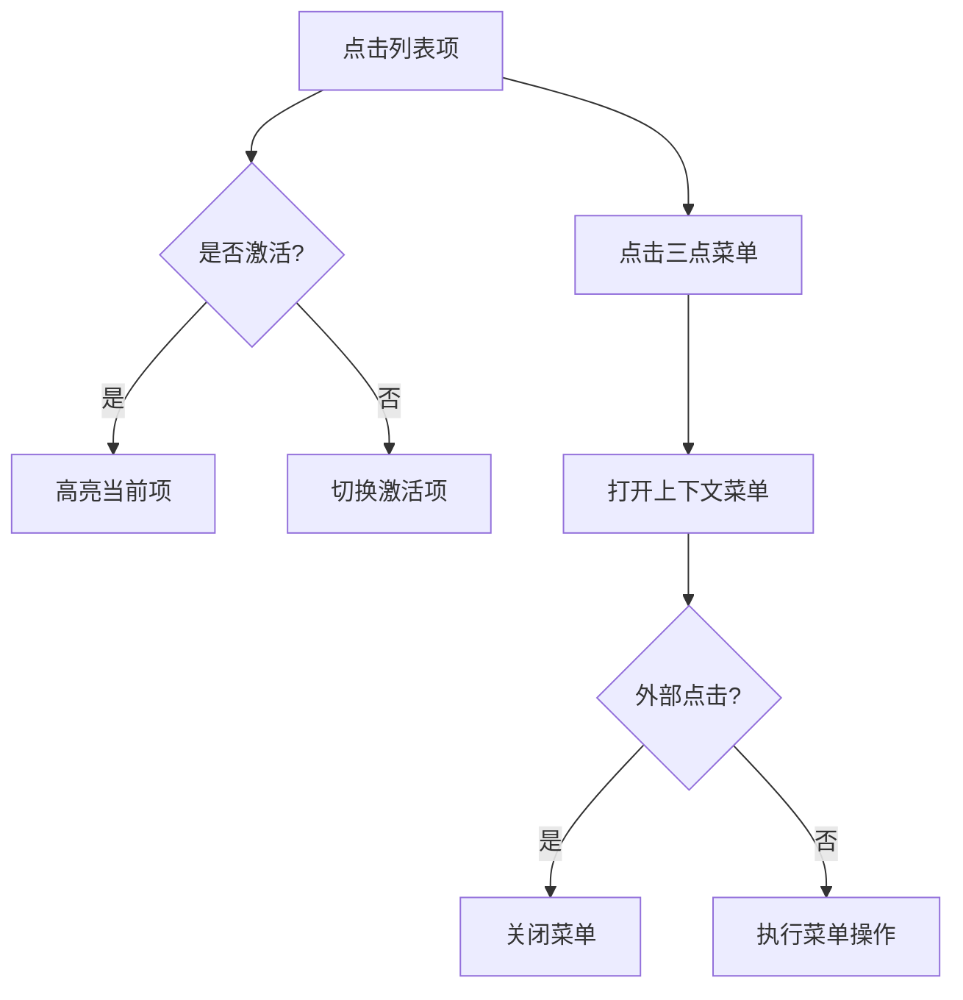
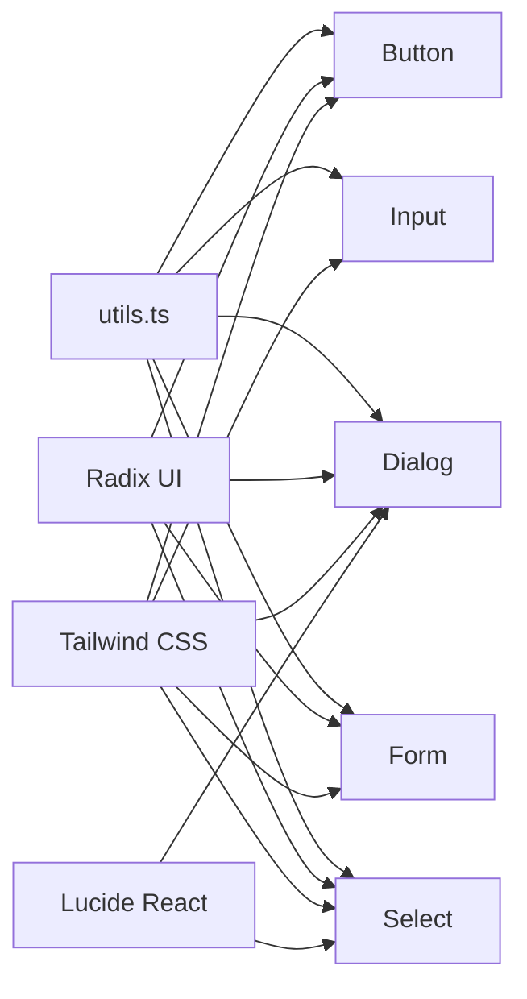

# UI组件库

<cite>
**本文引用的文件**
- [apps/chat/web/src/app/components/ui/button.tsx](file://apps/chat/web/src/app/components/ui/button.tsx)
- [apps/chat/web/src/app/components/ui/input.tsx](file://apps/chat/web/src/app/components/ui/input.tsx)
- [apps/chat/web/src/app/components/ui/dialog.tsx](file://apps/chat/web/src/app/components/ui/dialog.tsx)
- [apps/chat/web/src/app/components/ui/form.tsx](file://apps/chat/web/src/app/components/ui/form.tsx)
- [apps/chat/web/src/app/components/ui/select.tsx](file://apps/chat/web/src/app/components/ui/select.tsx)
- [apps/chat/web/src/app/components/ui/card.tsx](file://apps/chat/web/src/app/components/ui/card.tsx)
- [apps/chat/web/src/app/components/ui/avatar.tsx](file://apps/chat/web/src/app/components/ui/avatar.tsx)
- [apps/chat/web/src/app/components/ui/badge.tsx](file://apps/chat/web/src/app/components/ui/badge.tsx)
- [apps/chat/web/src/app/components/ui/tooltip.tsx](file://apps/chat/web/src/app/components/ui/tooltip.tsx)
- [apps/chat/web/src/app/components/ui/utils.ts](file://apps/chat/web/src/app/components/ui/utils.ts)
- [apps/chat/web/src/app/components/chat-input.tsx](file://apps/chat/web/src/app/components/chat-input.tsx)
- [apps/chat/web/src/app/components/chat-item.tsx](file://apps/chat/web/src/app/components/chat-item.tsx)
- [apps/chat/web/src/app/components/layout.tsx](file://apps/chat/web/src/app/components/layout.tsx)
- [apps/chat/web/package.json](file://apps/chat/web/package.json)
</cite>

## 目录
1. [简介](#简介)
2. [项目结构](#项目结构)
3. [核心组件](#核心组件)
4. [架构总览](#架构总览)
5. [详细组件分析](#详细组件分析)
6. [依赖关系分析](#依赖关系分析)
7. [性能考量](#性能考量)
8. [故障排查指南](#故障排查指南)
9. [结论](#结论)
10. [附录](#附录)

## 简介
本文件面向AIBrix聊天应用的UI组件库，系统化梳理基于 Radix UI 与 Tailwind CSS 的组件体系，覆盖按钮、输入框、对话框、表单、选择器、卡片、头像、徽章、提示框等基础UI组件。文档从设计原则、可访问性支持、响应式布局到 Props 接口、样式定制、事件处理与组合实践进行深入说明，并提供可视化图示帮助理解。

## 项目结构
UI组件库位于聊天前端工程中，采用按功能域分层的组织方式：组件集中在 ui 子目录下，业务组件在 components 根目录，根包管理依赖 Radix UI、Tailwind CSS 及相关生态。

**图表来源**
- [apps/chat/web/src/app/components/ui/button.tsx:1-51](file://apps/chat/web/src/app/components/ui/button.tsx#L1-L51)
- [apps/chat/web/src/app/components/ui/dialog.tsx:1-112](file://apps/chat/web/src/app/components/ui/dialog.tsx#L1-L112)
- [apps/chat/web/src/app/components/chat-input.tsx:1-361](file://apps/chat/web/src/app/components/chat-input.tsx#L1-L361)
- [apps/chat/web/src/app/components/layout.tsx:1-18](file://apps/chat/web/src/app/components/layout.tsx#L1-L18)

**章节来源**
- [apps/chat/web/package.json:14-72](file://apps/chat/web/package.json#L14-L72)

## 核心组件
本节概述各基础组件的职责、关键特性与典型用法。

- 按钮 Button
  - 职责：承载交互动作，支持多种语义与尺寸变体，支持作为容器渲染。
  - 关键点：通过变体系统控制外观；支持 asChild 渲染为任意元素；内置焦点环与禁用态。
  - 典型用法：主操作、次级操作、危险操作、链接式按钮、图标按钮。

- 输入框 Input
  - 职责：文本/数字/日期等输入，统一边框与聚焦样式。
  - 关键点：统一的聚焦环与无效状态样式；与表单联动时的无障碍属性。
  - 典型用法：登录表单、搜索框、设置项输入。

- 对话框 Dialog
  - 职责：模态弹窗容器，包含触发器、遮罩、内容区、标题与描述。
  - 关键点：基于 Radix UI 的可访问性与动画；Portal 渲染避免层级问题。
  - 典型用法：确认删除、设置面板、引导说明。

- 表单 Form（含 Field/Label/Control/Message）
  - 职责：与 react-hook-form 集成，提供受控字段、标签、描述与错误信息。
  - 关键点：上下文绑定字段 ID；自动注入 aria-* 属性；错误态样式。
  - 典型用法：注册/登录、配置表单、批量编辑。

- 选择器 Select
  - 职责：下拉选择，支持分组、滚动按钮、占位符、禁用项。
  - 关键点：触发器尺寸变体；内容区定位；选中指示器。
  - 典型用法：模型选择、排序筛选、分类过滤。

- 卡片 Card
  - 职责：内容容器，常用于列表项、设置块、信息展示。
  - 关键点：头部/主体/底部结构化布局；背景与边框一致性。
  - 典型用法：消息气泡、项目卡片、统计卡片。

- 头像 Avatar
  - 职责：用户或对象头像，支持占位与加载失败回退。
  - 关键点：圆形裁剪与占位符；可访问性名称。
  - 典型用法：侧边栏、消息列表、用户菜单。

- 徽章 Badge
  - 职责：标记状态或数量，强调信息。
  - 关键点：颜色语义化；紧凑尺寸。
  - 典型用法：未读数、状态标签、优先级。

- 提示框 Tooltip
  - 职责：简短说明，悬停显示。
  - 关键点：基于 Radix UI Popover 基础能力；轻量提示。
  - 典型用法：图标按钮说明、快捷键提示。

**章节来源**
- [apps/chat/web/src/app/components/ui/button.tsx:1-51](file://apps/chat/web/src/app/components/ui/button.tsx#L1-L51)
- [apps/chat/web/src/app/components/ui/input.tsx:1-22](file://apps/chat/web/src/app/components/ui/input.tsx#L1-L22)
- [apps/chat/web/src/app/components/ui/dialog.tsx:1-112](file://apps/chat/web/src/app/components/ui/dialog.tsx#L1-L112)
- [apps/chat/web/src/app/components/ui/form.tsx:1-138](file://apps/chat/web/src/app/components/ui/form.tsx#L1-L138)
- [apps/chat/web/src/app/components/ui/select.tsx:1-161](file://apps/chat/web/src/app/components/ui/select.tsx#L1-L161)
- [apps/chat/web/src/app/components/ui/card.tsx](file://apps/chat/web/src/app/components/ui/card.tsx)
- [apps/chat/web/src/app/components/ui/avatar.tsx](file://apps/chat/web/src/app/components/ui/avatar.tsx)
- [apps/chat/web/src/app/components/ui/badge.tsx](file://apps/chat/web/src/app/components/ui/badge.tsx)
- [apps/chat/web/src/app/components/ui/tooltip.tsx](file://apps/chat/web/src/app/components/ui/tooltip.tsx)

## 架构总览
组件库以“原子组件 + 容器组件”分层：原子组件（Button、Input、Select 等）通过 Tailwind 类名与 Radix UI 原子能力组合；容器组件（Dialog、Form）提供更高阶的交互与状态管理；业务组件（ChatInput、ChatItem、Layout）将原子与容器组合为页面功能模块。

**图表来源**
- [apps/chat/web/src/app/components/ui/button.tsx:1-51](file://apps/chat/web/src/app/components/ui/button.tsx#L1-L51)
- [apps/chat/web/src/app/components/ui/select.tsx:1-161](file://apps/chat/web/src/app/components/ui/select.tsx#L1-L161)
- [apps/chat/web/src/app/components/ui/dialog.tsx:1-112](file://apps/chat/web/src/app/components/ui/dialog.tsx#L1-L112)
- [apps/chat/web/src/app/components/ui/form.tsx:1-138](file://apps/chat/web/src/app/components/ui/form.tsx#L1-L138)
- [apps/chat/web/src/app/components/chat-input.tsx:1-361](file://apps/chat/web/src/app/components/chat-input.tsx#L1-L361)
- [apps/chat/web/src/app/components/chat-item.tsx:1-143](file://apps/chat/web/src/app/components/chat-item.tsx#L1-L143)
- [apps/chat/web/src/app/components/layout.tsx:1-18](file://apps/chat/web/src/app/components/layout.tsx#L1-L18)

## 详细组件分析

### 按钮 Button
- 设计原则
  - 语义化变体：默认、破坏性、描边、次级、幽灵、链接。
  - 尺寸体系：默认、小、大、仅图标。
  - 可访问性：焦点可见、禁用态不可交互。
- Props 接口
  - className: 扩展类名
  - variant: 变体枚举
  - size: 尺寸枚举
  - asChild: 是否以子节点容器渲染
  - 其余原生 button 属性透传
- 样式定制
  - 使用变体函数与工具函数合并类名；支持 SVG 自适应尺寸。
- 事件处理
  - 支持 onClick 等原生事件；禁用态阻止交互。
- 使用示例
  - 主要提交：使用默认变体与默认尺寸
  - 危险操作：使用破坏性变体
  - 图标按钮：使用图标尺寸并隐藏文字

**图表来源**
- [apps/chat/web/src/app/components/ui/button.tsx:35-48](file://apps/chat/web/src/app/components/ui/button.tsx#L35-L48)

**章节来源**
- [apps/chat/web/src/app/components/ui/button.tsx:1-51](file://apps/chat/web/src/app/components/ui/button.tsx#L1-L51)

### 输入框 Input
- 设计原则
  - 统一边框与聚焦环；无效状态高对比度。
  - 文件输入、占位符、选择态统一风格。
- Props 接口
  - className: 扩展类名
  - type: 原生 input 类型
  - 其余原生 input 属性透传
- 样式定制
  - 聚焦环与无效态由 Tailwind 类控制；支持暗色主题。
- 事件处理
  - onChange/onBlur 等原生事件透传；禁用态不可交互。
- 使用示例
  - 文本输入、密码、数字、日期等类型切换
  - 与 Form 组合时自动注入 aria-* 属性

**图表来源**
- [apps/chat/web/src/app/components/ui/input.tsx:5-18](file://apps/chat/web/src/app/components/ui/input.tsx#L5-L18)

**章节来源**
- [apps/chat/web/src/app/components/ui/input.tsx:1-22](file://apps/chat/web/src/app/components/ui/input.tsx#L1-L22)

### 对话框 Dialog
- 设计原则
  - Portal 渲染避免层级问题；开闭动画与键盘可访问。
  - 标题/描述/页脚结构化布局。
- Props 接口
  - Root/Trigger/Portal/Overlay/Content/Close/Title/Description/Footer
  - 除 Overlay/Content/Title/Description 外均透传原生属性
- 样式定制
  - 固定居中网格布局；最大宽度约束；阴影与圆角。
- 事件处理
  - Close 触发后自动聚焦触发元素；支持 ESC 关闭。
- 使用示例
  - 确认删除：标题+描述+确认/取消按钮
  - 设置面板：标题+表单内容+页脚操作

**图表来源**
- [apps/chat/web/src/app/components/ui/dialog.tsx:9-58](file://apps/chat/web/src/app/components/ui/dialog.tsx#L9-L58)

**章节来源**
- [apps/chat/web/src/app/components/ui/dialog.tsx:1-112](file://apps/chat/web/src/app/components/ui/dialog.tsx#L1-L112)

### 表单 Form（含 Field/Label/Control/Message）
- 设计原则
  - 与 react-hook-form 深度集成；字段上下文与表单状态解耦。
  - 自动注入 aria-invalid、aria-describedby 等无障碍属性。
- Props 接口
  - Form: Provider 包裹
  - FormField: Controller 包裹，提供字段上下文
  - FormItem: 字段容器，生成唯一 ID
  - FormLabel: 标签，绑定字段 ID
  - FormControl: 控件容器，注入 aria-* 属性
  - FormDescription: 描述文本
  - FormMessage: 错误信息，空则不渲染
- 样式定制
  - 错误态标签高亮；消息文本语义化颜色。
- 事件处理
  - 由 react-hook-form 管理校验与状态；组件仅负责渲染与无障碍。
- 使用示例
  - 登录表单：用户名/密码必填；邮箱格式；弱密码提示

**图表来源**
- [apps/chat/web/src/app/components/ui/form.tsx:18-135](file://apps/chat/web/src/app/components/ui/form.tsx#L18-L135)

**章节来源**
- [apps/chat/web/src/app/components/ui/form.tsx:1-138](file://apps/chat/web/src/app/components/ui/form.tsx#L1-L138)

### 选择器 Select
- 设计原则
  - 触发器支持尺寸；内容区支持滚动按钮与分组；选中项高亮。
  - 与 Portal 结合保证层级正确。
- Props 接口
  - Root/Trigger/Content/Label/Item/Separator/ScrollUp/ScrollDown
  - Trigger 支持 size: sm/default
  - Content 支持 position: popper
- 样式定制
  - 触发器边框与聚焦环；内容区阴影与滚动条。
- 事件处理
  - 选中项自动更新；禁用项不可点击。
- 使用示例
  - 模型选择：分组展示不同供应商；支持搜索过滤

**图表来源**
- [apps/chat/web/src/app/components/ui/select.tsx:9-147](file://apps/chat/web/src/app/components/ui/select.tsx#L9-L147)

**章节来源**
- [apps/chat/web/src/app/components/ui/select.tsx:1-161](file://apps/chat/web/src/app/components/ui/select.tsx#L1-L161)

### 卡片 Card
- 设计原则
  - 结构化布局：头部/主体/底部；背景与边框一致。
- Props 接口
  - className: 扩展类名
  - 其余原生 div 属性透传
- 样式定制
  - 背景与圆角；阴影与边框；内间距统一。
- 使用示例
  - 消息卡片：头部显示时间与头像；主体为 Markdown 内容；底部操作区

**章节来源**
- [apps/chat/web/src/app/components/ui/card.tsx](file://apps/chat/web/src/app/components/ui/card.tsx)

### 头像 Avatar
- 设计原则
  - 圆形裁剪；占位符与加载失败回退。
- Props 接口
  - src/fallback/name/alt 等原生 img 属性透传
  - className: 扩展类名
- 样式定制
  - 圆形裁剪；尺寸可配置；占位符样式。
- 使用示例
  - 用户头像：聊天列表、侧边栏、用户菜单

**章节来源**
- [apps/chat/web/src/app/components/ui/avatar.tsx](file://apps/chat/web/src/app/components/ui/avatar.tsx)

### 徽章 Badge
- 设计原则
  - 状态语义化颜色；紧凑尺寸。
- Props 接口
  - className: 扩展类名
  - 其余原生 span 属性透传
- 样式定制
  - 颜色与尺寸；圆点/文本两种形态。
- 使用示例
  - 未读数、状态标签、优先级

**章节来源**
- [apps/chat/web/src/app/components/ui/badge.tsx](file://apps/chat/web/src/app/components/ui/badge.tsx)

### 提示框 Tooltip
- 设计原则
  - 轻量提示；悬停显示；可与图标按钮结合。
- Props 接口
  - className: 扩展类名
  - 其余原生 button 属性透传
- 样式定制
  - 背景与圆角；阴影；定位策略。
- 使用示例
  - 图标按钮说明、快捷键提示

**章节来源**
- [apps/chat/web/src/app/components/ui/tooltip.tsx](file://apps/chat/web/src/app/components/ui/tooltip.tsx)

### 业务组件组合示例

#### 聊天输入 ChatInput
- 功能要点
  - 文本输入自适应高度；拖拽/粘贴/文件选择上传预览；语音录制转写；模型选择；发送与新建项目。
- Props 接口
  - placeholder/disabled/selectedModel/onModelChange/onSend/onStartNewProject
- 事件处理
  - Enter 发送；拖拽/粘贴文件；录音开始/停止/取消；上传进度模拟。
- 样式定制
  - 边框圆角；拖拽高亮；上传进度条；发送按钮状态。
- 组合实践
  - 与 Button/Select/Tooltip 组合；与 Form 配合校验；与音频 Hook 集成。

**图表来源**
- [apps/chat/web/src/app/components/chat-input.tsx:202-218](file://apps/chat/web/src/app/components/chat-input.tsx#L202-L218)

**章节来源**
- [apps/chat/web/src/app/components/chat-input.tsx:1-361](file://apps/chat/web/src/app/components/chat-input.tsx#L1-L361)

#### 聊天项 ChatItem
- 功能要点
  - 列表项点击、星标/重命名/移动/删除菜单；外部点击关闭菜单。
- Props 接口
  - chat: {id,title,starred}/isActive/onClick/onStar/onRequestRename/onRequestMove/onRequestDelete
- 事件处理
  - 菜单开关；外部点击关闭；危险项样式区分。
- 样式定制
  - 激活态高亮；悬浮态过渡；图标颜色与填充。
- 组合实践
  - 与 Badge/Avatar 组合；与 ContextMenu 容器组合。

**图表来源**
- [apps/chat/web/src/app/components/chat-item.tsx:85-141](file://apps/chat/web/src/app/components/chat-item.tsx#L85-L141)

**章节来源**
- [apps/chat/web/src/app/components/chat-item.tsx:1-143](file://apps/chat/web/src/app/components/chat-item.tsx#L1-L143)

#### 页面布局 Layout
- 功能要点
  - 侧边栏折叠/展开；Outlet 内容区域；背景与溢出控制。
- Props 接口
  - 无显式 props，内部维护折叠状态。
- 样式定制
  - Flex 布局；固定宽高；最小宽度与溢出隐藏。
- 组合实践
  - 与 Sidebar/SidebarToggle 组合；与 Outlet 路由结合。

**章节来源**
- [apps/chat/web/src/app/components/layout.tsx:1-18](file://apps/chat/web/src/app/components/layout.tsx#L1-L18)

## 依赖关系分析
- 组件依赖 Radix UI 原子能力（Slot、Dialog、Select、Label 等），确保可访问性与动画一致性。
- Tailwind CSS 提供原子化样式，配合 class-variance-authority 实现变体系统。
- Lucide React 提供图标资源。
- 工具函数集中于 utils.ts，统一类名合并与条件样式。

**图表来源**
- [apps/chat/web/src/app/components/ui/utils.ts](file://apps/chat/web/src/app/components/ui/utils.ts)
- [apps/chat/web/src/app/components/ui/button.tsx:1-51](file://apps/chat/web/src/app/components/ui/button.tsx#L1-L51)
- [apps/chat/web/src/app/components/ui/input.tsx:1-22](file://apps/chat/web/src/app/components/ui/input.tsx#L1-L22)
- [apps/chat/web/src/app/components/ui/dialog.tsx:1-112](file://apps/chat/web/src/app/components/ui/dialog.tsx#L1-L112)
- [apps/chat/web/src/app/components/ui/form.tsx:1-138](file://apps/chat/web/src/app/components/ui/form.tsx#L1-L138)
- [apps/chat/web/src/app/components/ui/select.tsx:1-161](file://apps/chat/web/src/app/components/ui/select.tsx#L1-L161)

**章节来源**
- [apps/chat/web/package.json:14-72](file://apps/chat/web/package.json#L14-L72)

## 性能考量
- 渲染优化
  - 使用 asChild 减少多余 DOM 节点；Portal 避免层级提升导致的重排。
  - Select/Dialog 内容区使用滚动区域与最小必要重绘。
- 交互体验
  - 按钮禁用态与焦点环减少误操作与键盘导航成本。
  - 输入框自适应高度避免频繁测量与重排。
- 资源加载
  - 图标按需引入；头像懒加载与 URL revoke 释放内存。
- 可访问性
  - aria-invalid、aria-describedby、aria-labelledby 等属性自动注入。
  - 键盘可操作：Tab 导航、Enter/ESC 快捷键。

## 故障排查指南
- 对话框无法关闭
  - 检查是否使用了 DialogTrigger/DialogClose；确认 Portal 渲染层级。
- 选择器内容错位
  - 检查 position 与触发器尺寸；确认 viewport 尺寸计算。
- 表单字段无错误提示
  - 检查 useFormField 上下文是否在 FormItem/FormField 内部；确认错误对象存在。
- 输入框聚焦环不生效
  - 检查 Tailwind 配置是否启用 focus-visible；确认未被覆盖。
- 头像闪烁或内存泄漏
  - 检查 Blob URL 释放逻辑；确认组件卸载时清理。

**章节来源**
- [apps/chat/web/src/app/components/ui/dialog.tsx:1-112](file://apps/chat/web/src/app/components/ui/dialog.tsx#L1-L112)
- [apps/chat/web/src/app/components/ui/select.tsx:1-161](file://apps/chat/web/src/app/components/ui/select.tsx#L1-L161)
- [apps/chat/web/src/app/components/ui/form.tsx:1-138](file://apps/chat/web/src/app/components/ui/form.tsx#L1-L138)
- [apps/chat/web/src/app/components/chat-input.tsx:192-200](file://apps/chat/web/src/app/components/chat-input.tsx#L192-L200)

## 结论
该 UI 组件库以 Radix UI 为基础，结合 Tailwind CSS 的原子化样式与 class-variance-authority 的变体系统，实现了高可定制、强可访问性的组件体系。通过 Form、Dialog、Select 等容器组件与 Button、Input 等原子组件的清晰分层，既满足了聊天应用的复杂交互需求，又保持了良好的扩展性与一致性。建议在实际开发中遵循语义化变体、无障碍属性与响应式布局的最佳实践，以获得更佳的用户体验与可维护性。

## 附录
- 设计原则
  - 一致性：颜色、尺寸、动效统一
  - 可访问性：键盘导航、屏幕阅读器友好
  - 响应式：移动端优先、断点适配
- 最佳实践
  - 组合使用：原子组件 + 容器组件 + 业务组件
  - 状态管理：表单与全局状态分离
  - 样式扩展：通过 className 与变体函数组合