# 侧边栏导航系统

<cite>
**本文档引用的文件**
- [apps/chat/web/src/app/components/sidebar.tsx](file://apps/chat/web/src/app/components/sidebar.tsx)
- [apps/chat/web/src/app/components/layout.tsx](file://apps/chat/web/src/app/components/layout.tsx)
- [apps/chat/web/src/app/routes.ts](file://apps/chat/web/src/app/routes.ts)
- [apps/chat/web/src/app/components/project-detail-page.tsx](file://apps/chat/web/src/app/components/project-detail-page.tsx)
- [apps/chat/web/src/app/components/projects-wrapper.tsx](file://apps/chat/web/src/app/components/projects-wrapper.tsx)
- [apps/chat/web/src/app/components/chats-page.tsx](file://apps/chat/web/src/app/components/chats-page.tsx)
- [apps/chat/web/src/api/client.ts](file://apps/chat/web/src/api/client.ts)
- [apps/chat/web/src/app/components/user-menu.tsx](file://apps/chat/web/src/app/components/user-menu.tsx)
- [apps/chat/web/src/app/components/ui/breadcrumb.tsx](file://apps/chat/web/src/app/components/ui/breadcrumb.tsx)
- [apps/chat/web/src/app/components/chat-item.tsx](file://apps/chat/web/src/app/components/chat-item.tsx)
- [apps/chat/web/src/app/components/auth-guard.tsx](file://apps/chat/web/src/app/components/auth-guard.tsx)
- [apps/chat/web/src/styles/theme.css](file://apps/chat/web/src/styles/theme.css)
</cite>

## 目录
1. [简介](#简介)
2. [项目结构](#项目结构)
3. [核心组件](#核心组件)
4. [架构概览](#架构概览)
5. [详细组件分析](#详细组件分析)
6. [依赖关系分析](#依赖关系分析)
7. [性能考虑](#性能考虑)
8. [故障排除指南](#故障排除指南)
9. [结论](#结论)

## 简介

AIBrix聊天应用的侧边栏导航系统是一个完整的前端导航解决方案，提供了项目管理、导航菜单、页面切换等功能。该系统采用现代化的React技术栈，结合TypeScript类型安全和Tailwind CSS样式系统，实现了响应式布局和丰富的用户体验。

系统的核心特点包括：
- 响应式侧边栏设计，支持折叠展开动画
- 实时项目管理和聊天会话管理
- 完整的导航状态持久化机制
- 多层级权限控制和认证保护
- 高级功能如面包屑导航、键盘导航支持

## 项目结构

基于聊天应用前端的目录结构，侧边栏导航系统主要分布在以下位置：

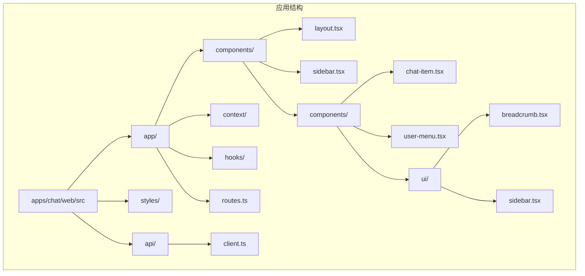

**图表来源**
- [apps/chat/web/src/app/components/sidebar.tsx:1-239](file://apps/chat/web/src/app/components/sidebar.tsx#L1-L239)
- [apps/chat/web/src/app/components/layout.tsx:1-18](file://apps/chat/web/src/app/components/layout.tsx#L1-L18)

**章节来源**
- [apps/chat/web/src/app/components/sidebar.tsx:1-239](file://apps/chat/web/src/app/components/sidebar.tsx#L1-L239)
- [apps/chat/web/src/app/components/layout.tsx:1-18](file://apps/chat/web/src/app/components/layout.tsx#L1-L18)

## 核心组件

### 侧边栏组件架构

侧边栏系统由多个相互协作的组件构成，形成了一个完整的导航生态系统：

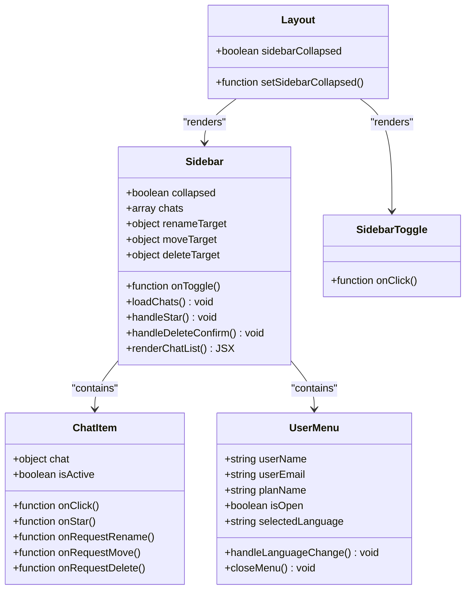

**图表来源**
- [apps/chat/web/src/app/components/sidebar.tsx:20-239](file://apps/chat/web/src/app/components/sidebar.tsx#L20-L239)
- [apps/chat/web/src/app/components/chat-item.tsx:10-143](file://apps/chat/web/src/app/components/chat-item.tsx#L10-L143)
- [apps/chat/web/src/app/components/user-menu.tsx:20-285](file://apps/chat/web/src/app/components/user-menu.tsx#L20-L285)
- [apps/chat/web/src/app/components/layout.tsx:5-17](file://apps/chat/web/src/app/components/layout.tsx#L5-L17)

### 导航菜单配置

系统使用React Router进行路由管理，导航菜单通过配置数组定义：

| 菜单项 | 图标 | 路径 | 功能描述 |
|--------|------|------|----------|
| Chats | MessageSquare | /chats | 聊天会话列表管理 |
| AI Creation | Sparkles | /ai-creation | AI内容创作功能 |
| Projects | FolderKanban | /projects | 项目管理界面 |
| Artifacts | Blocks | /artifacts | 项目产物管理 |
| Code | Code | /code | 代码生成工具 |

**章节来源**
- [apps/chat/web/src/app/components/sidebar.tsx:12-18](file://apps/chat/web/src/app/components/sidebar.tsx#L12-L18)
- [apps/chat/web/src/app/routes.ts:14-40](file://apps/chat/web/src/app/routes.ts#L14-L40)

## 架构概览

### 整体系统架构

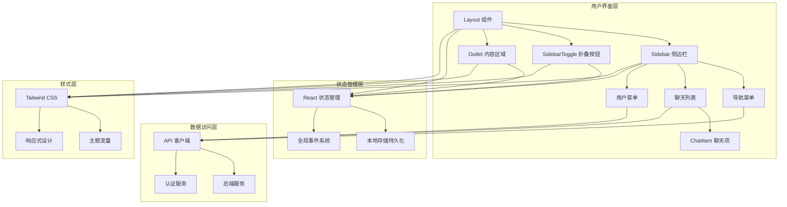

**图表来源**
- [apps/chat/web/src/app/components/layout.tsx:8-16](file://apps/chat/web/src/app/components/layout.tsx#L8-L16)
- [apps/chat/web/src/app/components/sidebar.tsx:25-227](file://apps/chat/web/src/app/components/sidebar.tsx#L25-L227)
- [apps/chat/web/src/api/client.ts:126-129](file://apps/chat/web/src/api/client.ts#L126-L129)

### 数据流架构

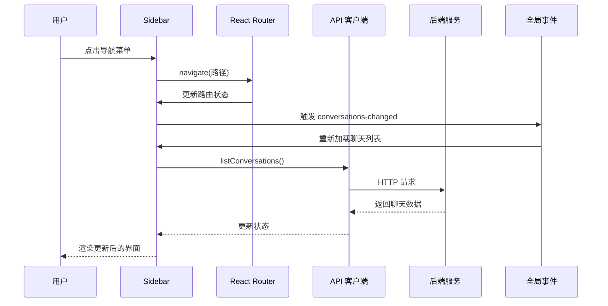

**图表来源**
- [apps/chat/web/src/app/components/sidebar.tsx:37-63](file://apps/chat/web/src/app/components/sidebar.tsx#L37-L63)
- [apps/chat/web/src/api/client.ts:126-129](file://apps/chat/web/src/api/client.ts#L126-L129)

**章节来源**
- [apps/chat/web/src/app/components/sidebar.tsx:25-227](file://apps/chat/web/src/app/components/sidebar.tsx#L25-L227)
- [apps/chat/web/src/app/routes.ts:14-40](file://apps/chat/web/src/app/routes.ts#L14-L40)

## 详细组件分析

### 侧边栏组件详解

侧边栏组件是整个导航系统的核心，负责管理所有导航功能和用户交互。

#### 组件属性和状态

| 属性名 | 类型 | 描述 | 默认值 |
|--------|------|------|--------|
| collapsed | boolean | 侧边栏是否折叠 | false |
| onToggle | function | 折叠/展开回调函数 | - |

组件内部维护的状态包括：
- `chats`: 聊天会话列表数据
- `renameTarget`: 重命名操作的目标聊天
- `moveTarget`: 移动操作的目标聊天
- `deleteTarget`: 删除操作的目标聊天

#### 导航菜单实现

导航菜单通过配置数组动态生成，支持图标、标签和徽章显示：

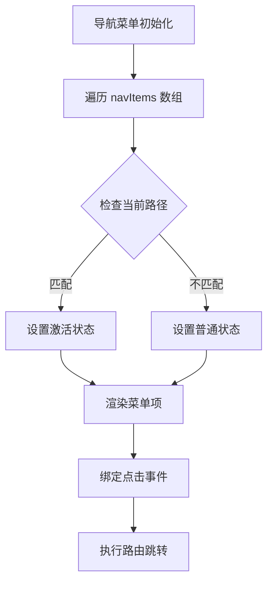

**图表来源**
- [apps/chat/web/src/app/components/sidebar.tsx:12-19](file://apps/chat/web/src/app/components/sidebar.tsx#L12-L19)
- [apps/chat/web/src/app/components/sidebar.tsx:169-192](file://apps/chat/web/src/app/components/sidebar.tsx#L169-L192)

#### 聊天列表管理

侧边栏包含两个主要的聊天列表：收藏夹和最近使用记录。

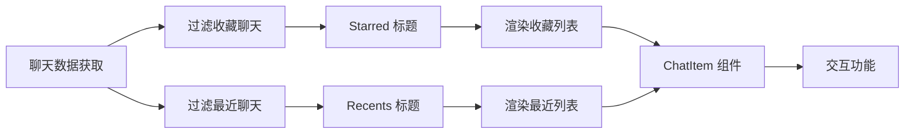

**图表来源**
- [apps/chat/web/src/app/components/sidebar.tsx:65-66](file://apps/chat/web/src/app/components/sidebar.tsx#L65-L66)
- [apps/chat/web/src/app/components/sidebar.tsx:195-209](file://apps/chat/web/src/app/components/sidebar.tsx#L195-L209)

**章节来源**
- [apps/chat/web/src/app/components/sidebar.tsx:20-239](file://apps/chat/web/src/app/components/sidebar.tsx#L20-L239)

### 聊天项组件分析

聊天项组件负责单个聊天会话的显示和交互处理。

#### 菜单项功能

| 菜单项 | 图标 | 功能 | 权限要求 |
|--------|------|------|----------|
| Star | Star | 收藏/取消收藏 | 用户认证 |
| Rename | Pencil | 重命名聊天 | 用户认证 |
| Move to project | FolderInput | 移动到项目 | 用户认证 |
| Delete | Trash2 | 删除聊天 | 用户认证 |

#### 交互状态管理

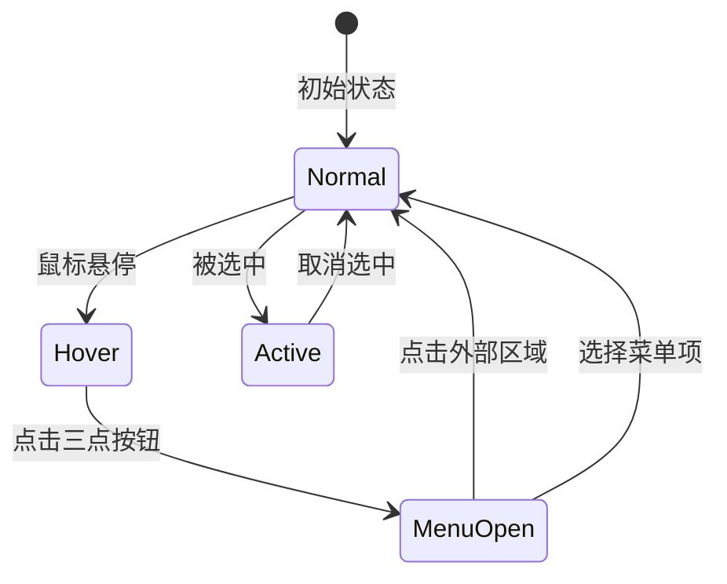

**图表来源**
- [apps/chat/web/src/app/components/chat-item.tsx:29-42](file://apps/chat/web/src/app/components/chat-item.tsx#L29-L42)
- [apps/chat/web/src/app/components/chat-item.tsx:114-139](file://apps/chat/web/src/app/components/chat-item.tsx#L114-L139)

**章节来源**
- [apps/chat/web/src/app/components/chat-item.tsx:1-143](file://apps/chat/web/src/app/components/chat-item.tsx#L1-L143)

### 用户菜单组件

用户菜单提供用户个人信息管理和系统设置功能。

#### 菜单层次结构

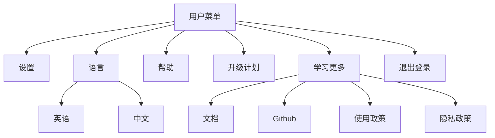

**图表来源**
- [apps/chat/web/src/app/components/user-menu.tsx:103-226](file://apps/chat/web/src/app/components/user-menu.tsx#L103-L226)

#### 语言切换机制

用户语言偏好通过本地存储持久化，支持实时切换：

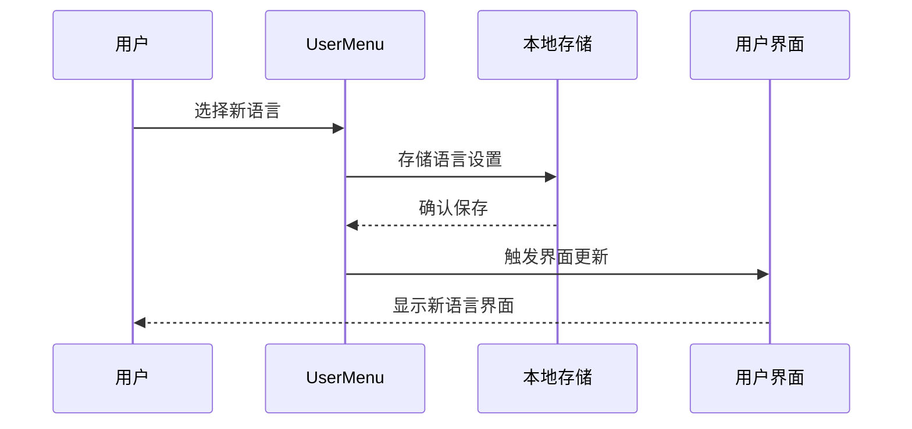

**图表来源**
- [apps/chat/web/src/app/components/user-menu.tsx:80-86](file://apps/chat/web/src/app/components/user-menu.tsx#L80-L86)

**章节来源**
- [apps/chat/web/src/app/components/user-menu.tsx:1-285](file://apps/chat/web/src/app/components/user-menu.tsx#L1-L285)

### 项目管理功能

#### 项目列表展示

项目页面提供完整的项目管理功能，包括搜索、排序和创建新项目。

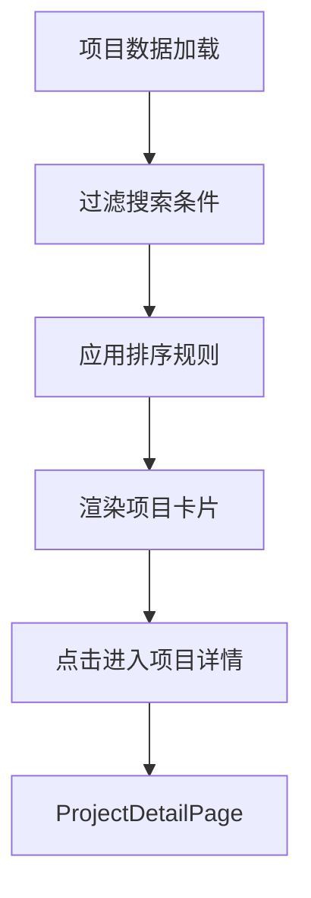

**图表来源**
- [apps/chat/web/src/app/components/projects-page.tsx:29-37](file://apps/chat/web/src/app/components/projects-page.tsx#L29-L37)
- [apps/chat/web/src/app/components/projects-page.tsx:39-40](file://apps/chat/web/src/app/components/projects-page.tsx#L39-L40)

#### 项目详情页面

项目详情页面提供聊天输入、指令设置和文件管理功能。

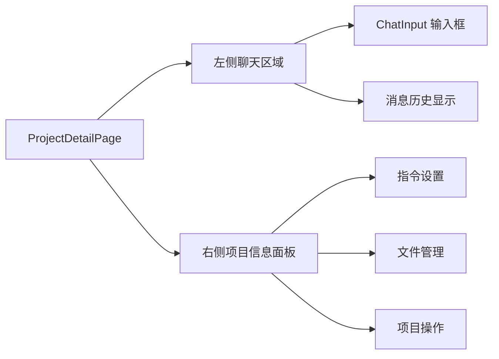

**图表来源**
- [apps/chat/web/src/app/components/project-detail-page.tsx:89-122](file://apps/chat/web/src/app/components/project-detail-page.tsx#L89-L122)
- [apps/chat/web/src/app/components/project-detail-page.tsx:124-220](file://apps/chat/web/src/app/components/project-detail-page.tsx#L124-L220)

**章节来源**
- [apps/chat/web/src/app/components/projects-page.tsx:1-104](file://apps/chat/web/src/app/components/projects-page.tsx#L1-L104)
- [apps/chat/web/src/app/components/project-detail-page.tsx:1-240](file://apps/chat/web/src/app/components/project-detail-page.tsx#L1-L240)

### 聊天管理功能

#### 聊天列表页面

聊天列表页面提供批量操作、搜索和筛选功能。

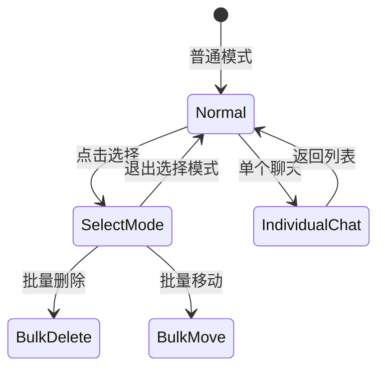

**图表来源**
- [apps/chat/web/src/app/components/chats-page.tsx:159-162](file://apps/chat/web/src/app/components/chats-page.tsx#L159-L162)
- [apps/chat/web/src/app/components/chats-page.tsx:247-286](file://apps/chat/web/src/app/components/chats-page.tsx#L247-L286)

#### 聊天操作流程

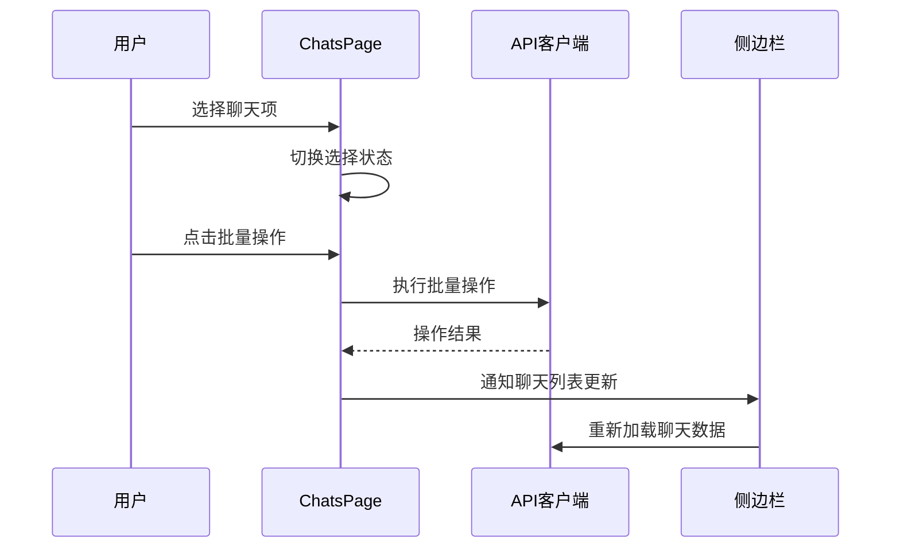

**图表来源**
- [apps/chat/web/src/app/components/chats-page.tsx:164-178](file://apps/chat/web/src/app/components/chats-page.tsx#L164-L178)
- [apps/chat/web/src/api/client.ts:126-129](file://apps/chat/web/src/api/client.ts#L126-L129)

**章节来源**
- [apps/chat/web/src/app/components/chats-page.tsx:1-348](file://apps/chat/web/src/app/components/chats-page.tsx#L1-L348)

## 依赖关系分析

### 组件依赖图

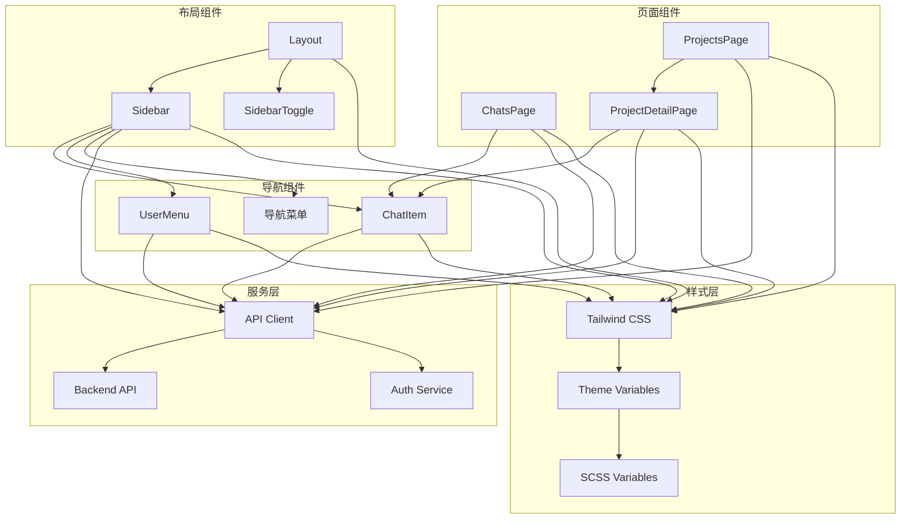

**图表来源**
- [apps/chat/web/src/app/components/layout.tsx:1-18](file://apps/chat/web/src/app/components/layout.tsx#L1-L18)
- [apps/chat/web/src/app/components/sidebar.tsx:1-10](file://apps/chat/web/src/app/components/sidebar.tsx#L1-L10)
- [apps/chat/web/src/api/client.ts:1-447](file://apps/chat/web/src/api/client.ts#L1-L447)

### 数据流依赖

系统的数据流遵循单向数据流原则，确保状态管理的一致性和可预测性。

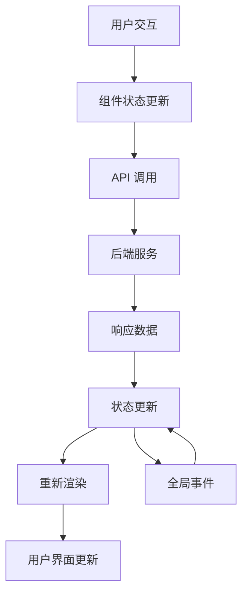

**图表来源**
- [apps/chat/web/src/api/client.ts:126-129](file://apps/chat/web/src/api/client.ts#L126-L129)
- [apps/chat/web/src/app/components/sidebar.tsx:53-58](file://apps/chat/web/src/app/components/sidebar.tsx#L53-L58)

**章节来源**
- [apps/chat/web/src/app/components/sidebar.tsx:1-239](file://apps/chat/web/src/app/components/sidebar.tsx#L1-L239)
- [apps/chat/web/src/api/client.ts:1-447](file://apps/chat/web/src/api/client.ts#L1-L447)

## 性能考虑

### 渲染优化策略

1. **虚拟滚动**: 对于大量聊天记录，可以考虑实现虚拟滚动以提高渲染性能
2. **状态缓存**: 使用useMemo和useCallback优化组件重渲染
3. **懒加载**: 对于大型项目详情页面，实现按需加载机制

### 网络请求优化

1. **请求去重**: 避免重复的API调用
2. **缓存策略**: 实现智能缓存机制减少网络请求
3. **错误重试**: 实现指数退避的错误重试机制

### 内存管理

1. **事件监听器清理**: 确保组件卸载时清理所有事件监听器
2. **定时器清理**: 清理所有定时器和轮询任务
3. **资源释放**: 及时释放大对象和媒体资源

## 故障排除指南

### 常见问题诊断

#### 侧边栏不显示或显示异常

**症状**: 侧边栏完全不可见或布局错乱

**可能原因**:
1. CSS样式冲突或覆盖
2. 主题变量未正确加载
3. 组件状态初始化失败

**解决步骤**:
1. 检查主题CSS文件加载情况
2. 验证Tailwind配置
3. 确认组件props传递正确

#### 聊天列表不更新

**症状**: 创建或删除聊天后列表未刷新

**可能原因**:
1. 全局事件未正确触发
2. API调用失败但未处理错误
3. 状态更新逻辑错误

**解决步骤**:
1. 检查`notifyConversationsChanged`调用
2. 验证API响应处理
3. 确认状态更新逻辑

#### 用户菜单功能失效

**症状**: 用户菜单无法打开或功能异常

**可能原因**:
1. 事件监听器绑定失败
2. 点击外部区域检测逻辑错误
3. 状态管理问题

**解决步骤**:
1. 检查事件监听器注册
2. 验证DOM元素引用
3. 确认状态同步机制

**章节来源**
- [apps/chat/web/src/app/components/sidebar.tsx:53-58](file://apps/chat/web/src/app/components/sidebar.tsx#L53-L58)
- [apps/chat/web/src/app/components/user-menu.tsx:61-78](file://apps/chat/web/src/app/components/user-menu.tsx#L61-L78)
- [apps/chat/web/src/api/client.ts:126-129](file://apps/chat/web/src/api/client.ts#L126-L129)

## 结论

AIBrix聊天应用的侧边栏导航系统展现了现代前端开发的最佳实践，通过精心设计的组件架构、完善的状态管理和优雅的用户体验，构建了一个功能完整、性能优异的导航解决方案。

### 主要优势

1. **模块化设计**: 组件职责清晰，易于维护和扩展
2. **响应式布局**: 适配多种设备和屏幕尺寸
3. **状态管理**: 采用React Hooks实现高效的状态管理
4. **用户体验**: 提供流畅的交互和反馈机制
5. **可访问性**: 支持键盘导航和屏幕阅读器

### 技术亮点

- **动画效果**: 流畅的折叠展开动画和过渡效果
- **权限控制**: 完整的认证和授权机制
- **数据持久化**: 本地存储和全局事件相结合
- **错误处理**: 全面的错误捕获和用户提示
- **性能优化**: 合理的状态管理和渲染优化

该系统为AIBrix平台提供了坚实的基础，支持未来的功能扩展和技术演进。通过持续的优化和改进，可以进一步提升系统的性能和用户体验。