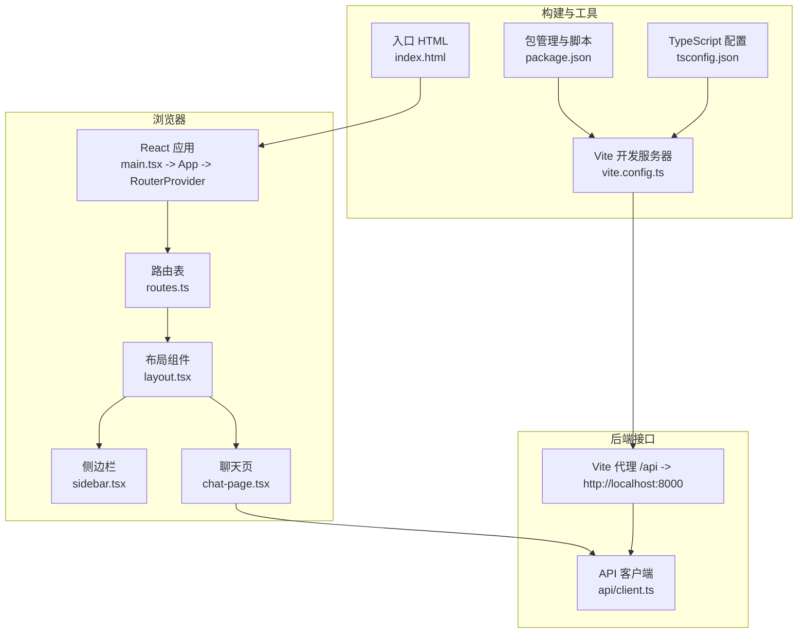
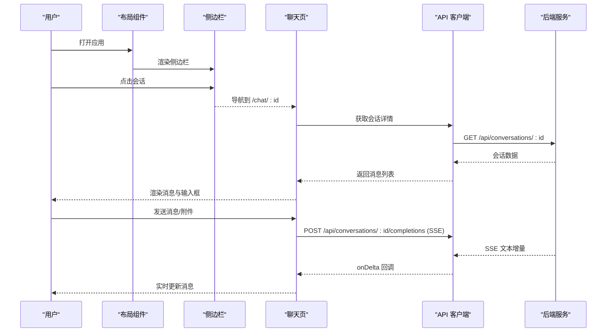
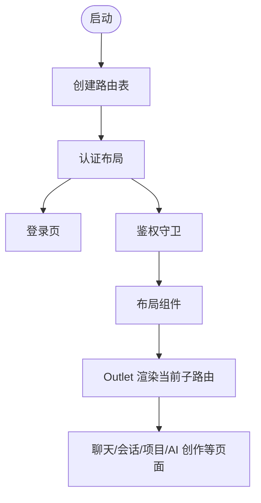
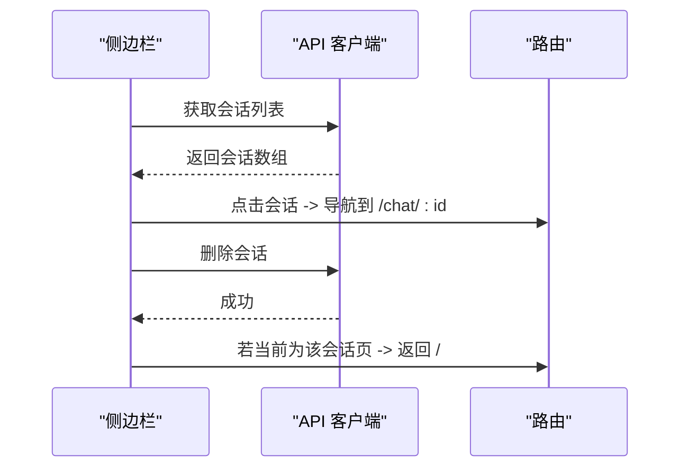
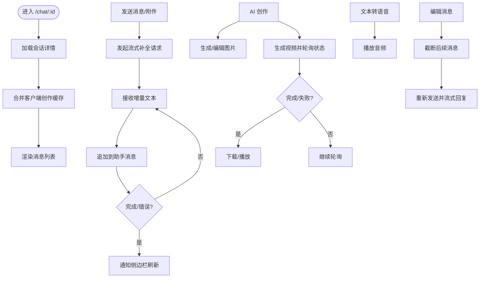
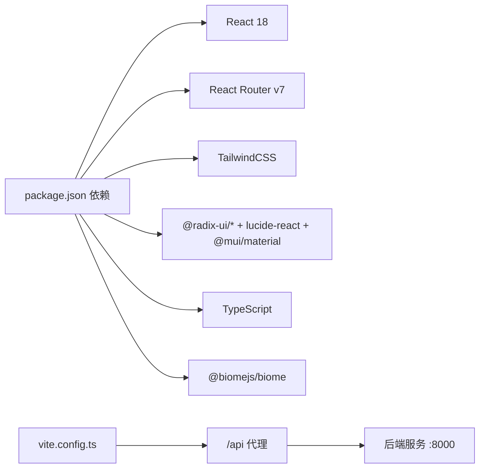

# 前端界面系统

<cite>
**本文引用的文件**
- [apps/chat/web/package.json](file://apps/chat/web/package.json)
- [apps/chat/web/tsconfig.json](file://apps/chat/web/tsconfig.json)
- [apps/chat/web/vite.config.ts](file://apps/chat/web/vite.config.ts)
- [apps/chat/web/index.html](file://apps/chat/web/index.html)
- [apps/chat/web/src/main.tsx](file://apps/chat/web/src/main.tsx)
- [apps/chat/web/src/app/App.tsx](file://apps/chat/web/src/app/App.tsx)
- [apps/chat/web/src/app/routes.ts](file://apps/chat/web/src/app/routes.ts)
- [apps/chat/web/src/app/components/layout.tsx](file://apps/chat/web/src/app/components/layout.tsx)
- [apps/chat/web/src/app/components/sidebar.tsx](file://apps/chat/web/src/app/components/sidebar.tsx)
- [apps/chat/web/src/app/components/chat-page.tsx](file://apps/chat/web/src/app/components/chat-page.tsx)
- [apps/chat/web/src/api/client.ts](file://apps/chat/web/src/api/client.ts)
</cite>

## 目录
1. [简介](#简介)
2. [项目结构](#项目结构)
3. [核心组件](#核心组件)
4. [架构总览](#架构总览)
5. [详细组件分析](#详细组件分析)
6. [依赖分析](#依赖分析)
7. [性能考虑](#性能考虑)
8. [故障排查指南](#故障排查指南)
9. [结论](#结论)
10. [附录](#附录)

## 简介
本文件为 AIBrix 聊天应用前端界面系统的全面技术文档，面向希望理解与扩展该 React + TypeScript 前端的工程师与产品人员。文档覆盖架构设计、组件结构、状态管理、路由配置、UI 组件功能实现、用户交互（音频录制、文件上传、实时消息）、组件 API、Hook 使用、API 客户端集成以及完整的开发与部署流程。

## 项目结构
前端位于 apps/chat/web，采用 Vite + React 18 + TypeScript 构建，使用 React Router v7 进行路由管理，并通过 TailwindCSS 提供样式基础。项目通过 Vite 的代理将 /api 请求转发到本地后端服务，统一接入 AIBrix 网关或兼容 OpenAI 的推理引擎。



图表来源
- [apps/chat/web/src/main.tsx:1-7](file://apps/chat/web/src/main.tsx#L1-L7)
- [apps/chat/web/src/app/App.tsx:1-7](file://apps/chat/web/src/app/App.tsx#L1-L7)
- [apps/chat/web/src/app/routes.ts:1-41](file://apps/chat/web/src/app/routes.ts#L1-L41)
- [apps/chat/web/src/app/components/layout.tsx:1-18](file://apps/chat/web/src/app/components/layout.tsx#L1-L18)
- [apps/chat/web/src/app/components/sidebar.tsx:1-239](file://apps/chat/web/src/app/components/sidebar.tsx#L1-L239)
- [apps/chat/web/src/app/components/chat-page.tsx:1-896](file://apps/chat/web/src/app/components/chat-page.tsx#L1-L896)
- [apps/chat/web/src/api/client.ts:1-447](file://apps/chat/web/src/api/client.ts#L1-L447)
- [apps/chat/web/vite.config.ts:1-32](file://apps/chat/web/vite.config.ts#L1-L32)
- [apps/chat/web/package.json:1-91](file://apps/chat/web/package.json#L1-L91)
- [apps/chat/web/tsconfig.json:1-21](file://apps/chat/web/tsconfig.json#L1-L21)
- [apps/chat/web/index.html:1-14](file://apps/chat/web/index.html#L1-L14)

章节来源
- [apps/chat/web/package.json:1-91](file://apps/chat/web/package.json#L1-L91)
- [apps/chat/web/tsconfig.json:1-21](file://apps/chat/web/tsconfig.json#L1-L21)
- [apps/chat/web/vite.config.ts:1-32](file://apps/chat/web/vite.config.ts#L1-L32)
- [apps/chat/web/index.html:1-14](file://apps/chat/web/index.html#L1-L14)

## 核心组件
- 应用入口与根组件：负责挂载 React 根节点并渲染 RouterProvider。
- 路由系统：基于 React Router v7 的嵌套路由，支持登录、鉴权守卫、布局包装与多页面导航。
- 布局组件：提供侧边栏、主内容区与折叠控制，承载 Outlet 渲染当前路由内容。
- 侧边栏：展示导航菜单、收藏与最近会话列表，支持重命名、移动、删除对话等操作。
- 聊天页：核心交互区域，负责加载历史消息、实时流式回复、图像/视频生成、TTS 播放、编辑与重试等。

章节来源
- [apps/chat/web/src/app/App.tsx:1-7](file://apps/chat/web/src/app/App.tsx#L1-L7)
- [apps/chat/web/src/app/routes.ts:1-41](file://apps/chat/web/src/app/routes.ts#L1-L41)
- [apps/chat/web/src/app/components/layout.tsx:1-18](file://apps/chat/web/src/app/components/layout.tsx#L1-L18)
- [apps/chat/web/src/app/components/sidebar.tsx:1-239](file://apps/chat/web/src/app/components/sidebar.tsx#L1-L239)
- [apps/chat/web/src/app/components/chat-page.tsx:1-896](file://apps/chat/web/src/app/components/chat-page.tsx#L1-L896)

## 架构总览
前端通过 Vite 提供开发体验与构建能力；路由层负责页面切换与权限控制；布局层组织侧边栏与主内容区；聊天页承担业务逻辑与数据流；API 客户端封装后端接口调用，统一处理认证头、错误与 SSE 流式响应。



图表来源
- [apps/chat/web/src/app/components/layout.tsx:1-18](file://apps/chat/web/src/app/components/layout.tsx#L1-L18)
- [apps/chat/web/src/app/components/sidebar.tsx:1-239](file://apps/chat/web/src/app/components/sidebar.tsx#L1-L239)
- [apps/chat/web/src/app/components/chat-page.tsx:1-896](file://apps/chat/web/src/app/components/chat-page.tsx#L1-L896)
- [apps/chat/web/src/api/client.ts:194-281](file://apps/chat/web/src/api/client.ts#L194-L281)

## 详细组件分析

### 路由与布局
- 路由表定义了登录、受保护页面、主布局与子页面（聊天、会话列表、AI 创作、项目等）。
- 布局组件负责侧边栏折叠/展开与 Outlet 内容渲染。
- 侧边栏提供导航、新建会话、会话列表与用户菜单。



图表来源
- [apps/chat/web/src/app/routes.ts:1-41](file://apps/chat/web/src/app/routes.ts#L1-L41)
- [apps/chat/web/src/app/components/layout.tsx:1-18](file://apps/chat/web/src/app/components/layout.tsx#L1-L18)
- [apps/chat/web/src/app/components/sidebar.tsx:1-239](file://apps/chat/web/src/app/components/sidebar.tsx#L1-L239)

章节来源
- [apps/chat/web/src/app/routes.ts:1-41](file://apps/chat/web/src/app/routes.ts#L1-L41)
- [apps/chat/web/src/app/components/layout.tsx:1-18](file://apps/chat/web/src/app/components/layout.tsx#L1-L18)
- [apps/chat/web/src/app/components/sidebar.tsx:1-239](file://apps/chat/web/src/app/components/sidebar.tsx#L1-L239)

### 侧边栏组件
- 功能要点
  - 导航项：聊天、AI 创作、项目、制品、代码。
  - 会话列表：收藏与最近会话分组展示。
  - 操作：重命名、移动、删除对话；删除后若在对应会话页则返回首页。
  - 事件同步：监听自定义事件以刷新会话列表。
- 交互流程
  - 加载会话列表并缓存到本地状态。
  - 用户点击会话项触发路由跳转。
  - 删除成功后更新列表并清理当前路由状态。



图表来源
- [apps/chat/web/src/app/components/sidebar.tsx:1-239](file://apps/chat/web/src/app/components/sidebar.tsx#L1-L239)
- [apps/chat/web/src/api/client.ts:158-193](file://apps/chat/web/src/api/client.ts#L158-L193)

章节来源
- [apps/chat/web/src/app/components/sidebar.tsx:1-239](file://apps/chat/web/src/app/components/sidebar.tsx#L1-L239)
- [apps/chat/web/src/api/client.ts:158-193](file://apps/chat/web/src/api/client.ts#L158-L193)

### 聊天页面组件
- 数据模型
  - Message：用户/助手消息，支持附件、AI 创作模式（图片/视频）、加载/错误状态。
  - 附件：图片/文件，支持预览与下载。
- 关键流程
  - 加载会话：首次进入时拉取后端消息，并合并客户端缓存的创作结果。
  - 实时流式回复：通过 SSE 接收增量文本，支持中途中断与重新生成。
  - AI 创作：图片生成/编辑、视频生成与轮询状态；支持下载完成的视频。
  - TTS：将文本转语音并播放，支持同一消息重复点击暂停。
  - 编辑与重试：可编辑历史消息并触发重新生成。
- 性能与资源管理
  - 释放 blob URL，避免内存泄漏。
  - 视频轮询最大次数与间隔控制，防止过度请求。
  - 仅对创作类消息进行客户端缓存，文本消息由后端持久化。



图表来源
- [apps/chat/web/src/app/components/chat-page.tsx:1-896](file://apps/chat/web/src/app/components/chat-page.tsx#L1-L896)
- [apps/chat/web/src/api/client.ts:194-281](file://apps/chat/web/src/api/client.ts#L194-L281)

章节来源
- [apps/chat/web/src/app/components/chat-page.tsx:1-896](file://apps/chat/web/src/app/components/chat-page.tsx#L1-L896)
- [apps/chat/web/src/api/client.ts:194-281](file://apps/chat/web/src/api/client.ts#L194-L281)

### API 客户端
- 认证与错误处理
  - 从本地存储读取令牌并注入到请求头。
  - 401 统一处理：清除令牌并跳转登录页。
- 类型定义
  - 模型、会话摘要、完整会话、消息、附件、图像/视频生成响应、项目等。
- 核心接口
  - 模型：获取可用模型列表。
  - 会话：创建、列出、获取、重命名、删除。
  - 补全：SSE 流式补全，支持温度、最大 token、系统提示与附件。
  - 图像：生成与编辑。
  - 音频：转写、TTS。
  - 视频：生成、状态查询、内容下载。
  - 项目：增删改查。
- 事件通知
  - 自定义事件用于通知侧边栏刷新会话列表。

```mermaid
classDiagram
class ApiClient {
+fetchModels(capability) Promise~ModelInfo[]~
+createConversation(model,title,projectId) Promise~Conversation~
+listConversations() Promise~ConversationSummary[]~
+getConversation(id) Promise~Conversation~
+renameConversation(id,title) Promise~Conversation~
+deleteConversation(id) Promise~void~
+streamCompletion(conversationId,message,model,attachments,callbacks,opts) AbortController
+generateImage(prompt,model,size,n) Promise~ImageGenerateResponse~
+editImage(image,prompt,model,size,n) Promise~ImageGenerateResponse~
+transcribeAudio(file,language) Promise~{ text }~
+generateSpeech(input) Promise~Blob~
+generateVideo(prompt,model,size,seconds) Promise~VideoJobResponse~
+getVideoStatus(jobId) Promise~VideoJobResponse~
+getVideoContentUrl(jobId) string
+createProject(name,description) Promise~Project~
+listProjects() Promise~ProjectSummary[]~
+getProject(id) Promise~Project~
+updateProject(id,data) Promise~Project~
+deleteProject(id) Promise~void~
+notifyConversationsChanged() void
}
```

图表来源
- [apps/chat/web/src/api/client.ts:1-447](file://apps/chat/web/src/api/client.ts#L1-L447)

章节来源
- [apps/chat/web/src/api/client.ts:1-447](file://apps/chat/web/src/api/client.ts#L1-L447)

## 依赖分析
- 构建与运行时
  - Vite：开发服务器、代理、插件体系。
  - React 18：组件模型与并发特性。
  - React Router v7：声明式路由与嵌套路由。
  - TailwindCSS：原子化样式与主题。
- UI 组件库与工具
  - Radix UI：语义化与无障碍基础组件。
  - Material Icons：图标库。
  - Lucide React：简洁图标。
  - React Hook Form：表单场景（如需要）。
  - Emotion：CSS-in-JS（按需使用）。
- 类型与开发
  - TypeScript：类型安全与自动补全。
  - Biome：代码质量与格式化。
- 代理与网络
  - Vite 代理将 /api 请求转发至本地后端，便于前后端联调。



图表来源
- [apps/chat/web/package.json:1-91](file://apps/chat/web/package.json#L1-L91)
- [apps/chat/web/vite.config.ts:1-32](file://apps/chat/web/vite.config.ts#L1-L32)

章节来源
- [apps/chat/web/package.json:1-91](file://apps/chat/web/package.json#L1-L91)
- [apps/chat/web/vite.config.ts:1-32](file://apps/chat/web/vite.config.ts#L1-L32)

## 性能考虑
- 流式渲染与滚动
  - 新消息到达时平滑滚动到底部，避免频繁强制重排。
- 资源释放
  - 组件卸载时释放 blob URL，防止内存泄漏。
- 请求节流
  - 视频轮询设置最大尝试次数与固定间隔，降低后端压力。
- 本地缓存
  - 创作类消息（图片/视频）在客户端缓存，减少后端存储压力；文本消息由后端持久化。
- 代理与网络
  - 通过 Vite 代理集中处理跨域与环境差异，减少生产环境复杂度。

## 故障排查指南
- 登录态失效
  - 现象：访问受保护页面被重定向到登录页。
  - 处理：确认本地存储中的令牌存在且未过期；检查后端 JWT 签发策略。
- SSE 流中断
  - 现象：消息未完全接收或中途停止。
  - 处理：检查网络稳定性与代理配置；确认后端 SSE 输出格式；必要时增加超时与重试。
- 附件无法显示/下载
  - 现象：图片预览空白或下载失败。
  - 处理：确认文件类型与大小限制；检查 blob URL 生命周期与释放时机。
- 视频生成长时间 pending
  - 现象：视频任务状态长期 pending。
  - 处理：检查后端视频生成队列与资源配额；适当延长轮询间隔与最大尝试次数。
- 侧边栏不刷新
  - 现象：新建/删除会话后列表未更新。
  - 处理：确认自定义事件是否正确派发与监听；检查权限与网络错误吞吐。

章节来源
- [apps/chat/web/src/api/client.ts:27-34](file://apps/chat/web/src/api/client.ts#L27-L34)
- [apps/chat/web/src/app/components/chat-page.tsx:84-94](file://apps/chat/web/src/app/components/chat-page.tsx#L84-L94)
- [apps/chat/web/src/app/components/sidebar.tsx:52-58](file://apps/chat/web/src/app/components/sidebar.tsx#L52-L58)

## 结论
本前端系统以 React + TypeScript 为基础，结合 Vite 与 TailwindCSS 提供高效开发体验；通过清晰的路由与布局结构、完善的 API 客户端与流式交互能力，支撑聊天、AI 创作与多媒体能力。建议在后续迭代中进一步完善状态管理抽象、模块化 UI 组件库与测试覆盖，以提升可维护性与可扩展性。

## 附录

### 开发与部署流程
- 本地开发
  - 启动后端服务至 http://localhost:8000。
  - 在 apps/chat/web 目录执行开发命令，打开 http://localhost:5173。
  - Vite 代理将 /api 请求转发至后端。
- 代码质量
  - 使用 Biome 进行检查与格式化；TypeScript 类型检查通过。
- 构建与产物
  - 生产构建输出至 dist，配合后端统一部署。
- 环境变量与代理
  - 代理目标可在 Vite 配置中调整，适配不同环境。

章节来源
- [apps/chat/web/vite.config.ts:23-30](file://apps/chat/web/vite.config.ts#L23-L30)
- [apps/chat/web/package.json:6-12](file://apps/chat/web/package.json#L6-L12)
- [apps/chat/web/tsconfig.json:1-21](file://apps/chat/web/tsconfig.json#L1-L21)