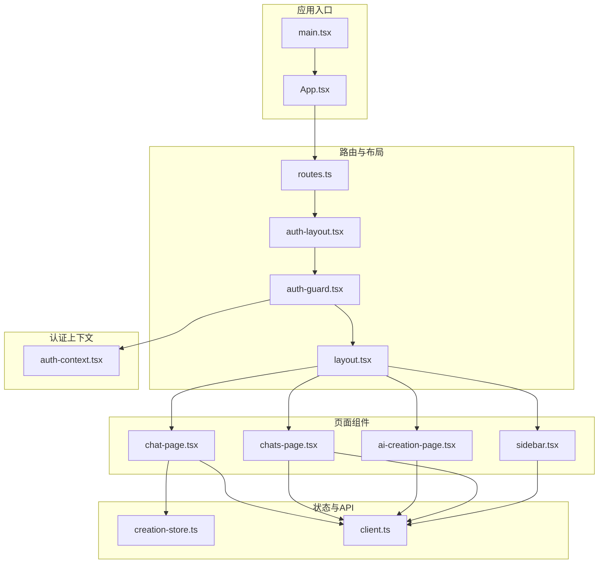
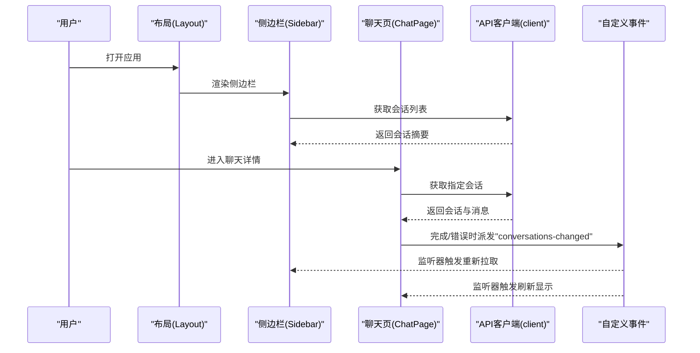
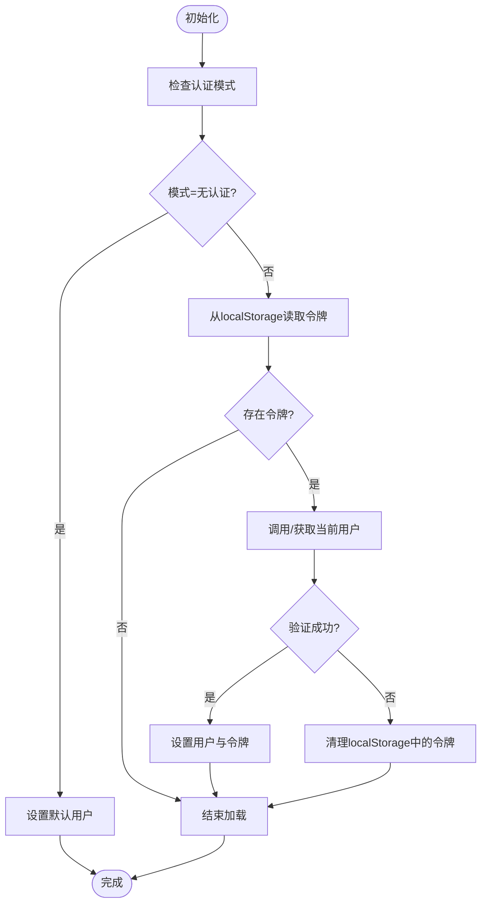
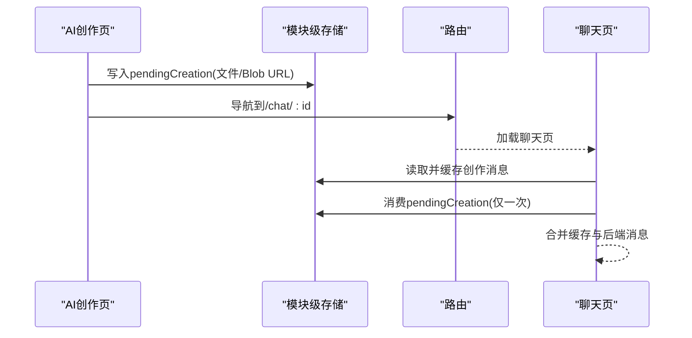
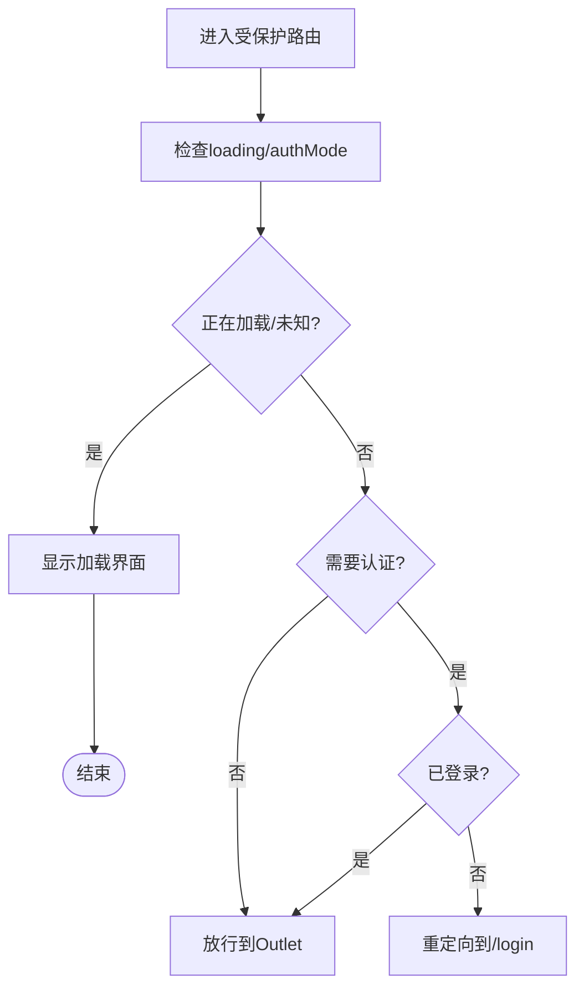
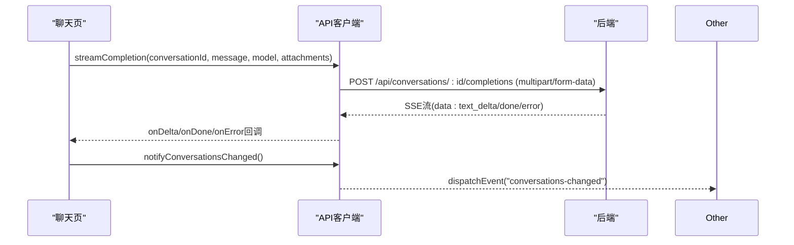
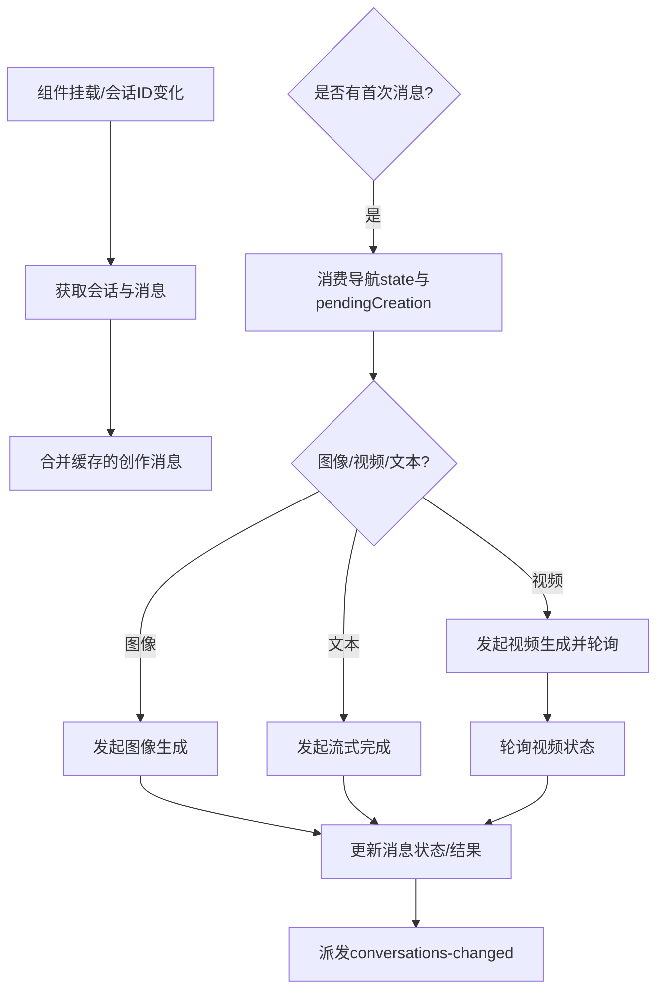
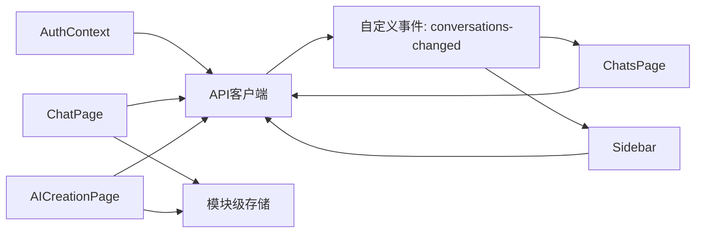

# 状态管理系统

<cite>
**本文引用的文件**
- [apps/chat/web/src/app/context/auth-context.tsx](file://apps/chat/web/src/app/context/auth-context.tsx)
- [apps/chat/web/src/app/creation-store.ts](file://apps/chat/web/src/app/creation-store.ts)
- [apps/chat/web/src/app/routes.ts](file://apps/chat/web/src/app/routes.ts)
- [apps/chat/web/src/api/client.ts](file://apps/chat/web/src/api/client.ts)
- [apps/chat/web/src/app/App.tsx](file://apps/chat/web/src/app/App.tsx)
- [apps/chat/web/src/app/components/auth-guard.tsx](file://apps/chat/web/src/app/components/auth-guard.tsx)
- [apps/chat/web/src/app/components/auth-layout.tsx](file://apps/chat/web/src/app/components/auth-layout.tsx)
- [apps/chat/web/src/app/components/chat-page.tsx](file://apps/chat/web/src/app/components/chat-page.tsx)
- [apps/chat/web/src/app/components/chats-page.tsx](file://apps/chat/web/src/app/components/chats-page.tsx)
- [apps/chat/web/src/app/components/ai-creation-page.tsx](file://apps/chat/web/src/app/components/ai-creation-page.tsx)
- [apps/chat/web/src/app/components/layout.tsx](file://apps/chat/web/src/app/components/layout.tsx)
- [apps/chat/web/src/app/components/sidebar.tsx](file://apps/chat/web/src/app/components/sidebar.tsx)
- [apps/chat/web/src/main.tsx](file://apps/chat/web/src/main.tsx)
</cite>

## 目录
1. [简介](#简介)
2. [项目结构](#项目结构)
3. [核心组件](#核心组件)
4. [架构总览](#架构总览)
5. [详细组件分析](#详细组件分析)
6. [依赖关系分析](#依赖关系分析)
7. [性能考量](#性能考量)
8. [故障排查指南](#故障排查指南)
9. [结论](#结论)
10. [附录](#附录)

## 简介
本文件面向AIBrix聊天应用的状态管理系统，系统性梳理认证上下文、模块级存储、路由状态、API客户端等关键状态管理组件的实现与交互。重点覆盖：
- 用户认证状态的初始化、登录登出、本地持久化与鉴权头注入
- 聊天会话数据的加载、流式响应处理、消息持久化与缓存
- 全局状态同步机制（自定义事件驱动的跨组件通知）
- React Context使用模式、状态订阅与更新策略
- 最佳实践、性能优化与调试技巧
- 状态迁移、版本兼容性与数据备份恢复建议

## 项目结构
前端位于apps/chat/web/src，采用按功能分层组织：
- app/context：认证上下文
- app/components：页面与UI组件
- app：路由、全局状态模块（如creation-store）
- api：统一的API客户端封装
- main.tsx：应用入口

**图表来源**
- [apps/chat/web/src/main.tsx:1-7](file://apps/chat/web/src/main.tsx#L1-L7)
- [apps/chat/web/src/app/App.tsx:1-7](file://apps/chat/web/src/app/App.tsx#L1-L7)
- [apps/chat/web/src/app/routes.ts:1-41](file://apps/chat/web/src/app/routes.ts#L1-L41)
- [apps/chat/web/src/app/components/layout.tsx:1-18](file://apps/chat/web/src/app/components/layout.tsx#L1-L18)
- [apps/chat/web/src/app/components/auth-layout.tsx:1-15](file://apps/chat/web/src/app/components/auth-layout.tsx#L1-L15)
- [apps/chat/web/src/app/components/auth-guard.tsx:1-27](file://apps/chat/web/src/app/components/auth-guard.tsx#L1-L27)
- [apps/chat/web/src/app/context/auth-context.tsx:1-126](file://apps/chat/web/src/app/context/auth-context.tsx#L1-L126)
- [apps/chat/web/src/app/components/chat-page.tsx:1-896](file://apps/chat/web/src/app/components/chat-page.tsx#L1-L896)
- [apps/chat/web/src/app/components/chats-page.tsx:1-348](file://apps/chat/web/src/app/components/chats-page.tsx#L1-L348)
- [apps/chat/web/src/app/components/ai-creation-page.tsx:1-437](file://apps/chat/web/src/app/components/ai-creation-page.tsx#L1-L437)
- [apps/chat/web/src/app/components/sidebar.tsx:1-239](file://apps/chat/web/src/app/components/sidebar.tsx#L1-L239)
- [apps/chat/web/src/app/creation-store.ts:1-40](file://apps/chat/web/src/app/creation-store.ts#L1-L40)
- [apps/chat/web/src/api/client.ts:1-447](file://apps/chat/web/src/api/client.ts#L1-L447)

**章节来源**
- [apps/chat/web/src/main.tsx:1-7](file://apps/chat/web/src/main.tsx#L1-L7)
- [apps/chat/web/src/app/App.tsx:1-7](file://apps/chat/web/src/app/App.tsx#L1-L7)
- [apps/chat/web/src/app/routes.ts:1-41](file://apps/chat/web/src/app/routes.ts#L1-L41)

## 核心组件
- 认证上下文（AuthContext）：负责用户信息、令牌、认证模式与登录登出流程；支持无认证、简单认证两种模式，并在挂载时尝试从本地存储恢复会话。
- 模块级存储（creation-store）：用于在SPA导航期间存活且无法序列化的AI创作数据，包括当前创作的文件与Blob URL，以及按会话缓存的创作消息。
- 路由（routes）：基于createBrowserRouter定义受保护的路由树，结合AuthGuard进行访问控制。
- API客户端（client）：统一封装模型查询、会话列表/获取/重命名/删除、消息流式完成、图像/视频生成与状态轮询、音频转写/语音合成等接口；内置401处理与鉴权头注入。

**章节来源**
- [apps/chat/web/src/app/context/auth-context.tsx:1-126](file://apps/chat/web/src/app/context/auth-context.tsx#L1-L126)
- [apps/chat/web/src/app/creation-store.ts:1-40](file://apps/chat/web/src/app/creation-store.ts#L1-L40)
- [apps/chat/web/src/app/routes.ts:1-41](file://apps/chat/web/src/app/routes.ts#L1-L41)
- [apps/chat/web/src/api/client.ts:1-447](file://apps/chat/web/src/api/client.ts#L1-L447)

## 架构总览
整体采用“路由+上下文+模块级存储+API客户端”的组合模式：
- 路由层通过AuthGuard控制访问；布局层提供侧边栏与主内容区。
- 认证上下文在根布局提供，子路由共享用户态。
- 页面组件通过API客户端与后端交互；聊天页同时维护本地消息状态与服务端持久化；AI创作页通过模块级存储传递非序列化数据并触发会话创建。
- 全局状态同步通过自定义事件“conversations-changed”实现跨组件广播。

**图表来源**
- [apps/chat/web/src/app/components/layout.tsx:1-18](file://apps/chat/web/src/app/components/layout.tsx#L1-L18)
- [apps/chat/web/src/app/components/sidebar.tsx:1-239](file://apps/chat/web/src/app/components/sidebar.tsx#L1-L239)
- [apps/chat/web/src/app/components/chat-page.tsx:1-896](file://apps/chat/web/src/app/components/chat-page.tsx#L1-L896)
- [apps/chat/web/src/api/client.ts:126-129](file://apps/chat/web/src/api/client.ts#L126-L129)

## 详细组件分析

### 认证上下文（AuthContext）
- 上下文值包含：用户信息、令牌、认证模式、登录、登出、加载状态。
- 初始化流程：
  - 读取认证模式（若后端未提供则视为“无认证”）。
  - 若为“简单认证”，尝试从localStorage恢复令牌并调用“获取当前用户”接口验证；失败则清理无效令牌。
  - 若为“无认证”，直接设置默认用户并结束加载。
- 登录/登出：
  - 登录成功后保存令牌到localStorage并设置用户信息。
  - 登出时尝试调用后端登出接口（静默失败），随后清除内存与本地存储中的令牌与用户信息。
- 使用约束：必须在AuthProvider内部使用useAuth钩子，否则抛出错误。

**图表来源**
- [apps/chat/web/src/app/context/auth-context.tsx:28-88](file://apps/chat/web/src/app/context/auth-context.tsx#L28-L88)

**章节来源**
- [apps/chat/web/src/app/context/auth-context.tsx:1-126](file://apps/chat/web/src/app/context/auth-context.tsx#L1-L126)

### 模块级存储（creation-store）
- 设计目标：存放SPA导航期间需要保留但无法序列化的数据，例如当前创作的File对象与Blob URL；以及按会话缓存的创作消息（图像/视频结果）。
- 关键导出：
  - pendingCreation：当前创作的文件与Blob URL（消费一次即清空）。
  - cacheMessages/getCachedMessages：以会话ID为键的创作消息缓存。
- 使用场景：AI创作页创建会话后，将非序列化数据写入pendingCreation，导航至聊天页时由聊天页消费并清空；聊天页在渲染前合并缓存消息与后端消息，确保刷新或跳转后仍可恢复创作结果。

**图表来源**
- [apps/chat/web/src/app/components/ai-creation-page.tsx:139-166](file://apps/chat/web/src/app/components/ai-creation-page.tsx#L139-L166)
- [apps/chat/web/src/app/components/chat-page.tsx:106-116](file://apps/chat/web/src/app/components/chat-page.tsx#L106-L116)
- [apps/chat/web/src/app/creation-store.ts:27-39](file://apps/chat/web/src/app/creation-store.ts#L27-L39)

**章节来源**
- [apps/chat/web/src/app/creation-store.ts:1-40](file://apps/chat/web/src/app/creation-store.ts#L1-L40)
- [apps/chat/web/src/app/components/ai-creation-page.tsx:1-437](file://apps/chat/web/src/app/components/ai-creation-page.tsx#L1-L437)
- [apps/chat/web/src/app/components/chat-page.tsx:1-896](file://apps/chat/web/src/app/components/chat-page.tsx#L1-L896)

### 路由与守卫（routes + auth-guard）
- 路由树：
  - /login：登录页
  - /（受保护）：Layout包含侧边栏与主内容区
  - /chat/:id、/chats、/ai-creation、/projects、/projects/:id、/artifacts、/code
- 认证守卫：
  - loading或authMode为空时显示加载提示
  - authMode为“无认证”时放行
  - 需要认证但未登录时重定向到/login

**图表来源**
- [apps/chat/web/src/app/components/auth-guard.tsx:4-26](file://apps/chat/web/src/app/components/auth-guard.tsx#L4-L26)
- [apps/chat/web/src/app/routes.ts:14-40](file://apps/chat/web/src/app/routes.ts#L14-L40)

**章节来源**
- [apps/chat/web/src/app/routes.ts:1-41](file://apps/chat/web/src/app/routes.ts#L1-L41)
- [apps/chat/web/src/app/components/auth-guard.tsx:1-27](file://apps/chat/web/src/app/components/auth-guard.tsx#L1-L27)

### API客户端（client）
- 统一鉴权头：从localStorage读取令牌并在请求头中附加Authorization: Bearer。
- 401处理：当响应为401时，清理本地令牌并跳转到/login（非登录页时）。
- 会话与消息：
  - 列表/获取/重命名/删除会话
  - 流式完成（SSE）：返回AbortController，解析data:行中的JSON事件，支持text_delta、done、error事件
  - 图像/视频生成：支持上传参考图、尺寸与参数配置；视频生成后轮询状态直至完成或失败
  - 音频：转写与语音合成
- 全局通知：notifyConversationsChanged通过自定义事件触发侧边栏与聊天列表刷新

**图表来源**
- [apps/chat/web/src/api/client.ts:196-281](file://apps/chat/web/src/api/client.ts#L196-L281)
- [apps/chat/web/src/api/client.ts:126-129](file://apps/chat/web/src/api/client.ts#L126-L129)
- [apps/chat/web/src/app/components/chat-page.tsx:312-338](file://apps/chat/web/src/app/components/chat-page.tsx#L312-L338)

**章节来源**
- [apps/chat/web/src/api/client.ts:1-447](file://apps/chat/web/src/api/client.ts#L1-L447)

### 聊天页（ChatPage）
- 状态管理要点：
  - 本地消息数组与会话对象；是否加载中、是否流式中、播放语音的标识等
  - 首次消息：接收来自AI创作页的导航state，消费pendingCreation并发起相应生成或文本流式请求
  - 视频轮询：生成视频任务后定时轮询状态，更新消息loading与状态
  - 缓存创作消息：仅对含mode的消息进行缓存，避免与后端文本消息重复
  - TTS：生成语音Blob并播放，支持暂停与切换
- 生命周期与资源释放：
  - 组件卸载时遍历消息附件并回收Blob URL，防止内存泄漏

**图表来源**
- [apps/chat/web/src/app/components/chat-page.tsx:118-167](file://apps/chat/web/src/app/components/chat-page.tsx#L118-L167)
- [apps/chat/web/src/app/components/chat-page.tsx:400-431](file://apps/chat/web/src/app/components/chat-page.tsx#L400-L431)
- [apps/chat/web/src/app/components/chat-page.tsx:169-188](file://apps/chat/web/src/app/components/chat-page.tsx#L169-L188)
- [apps/chat/web/src/app/components/chat-page.tsx:340-398](file://apps/chat/web/src/app/components/chat-page.tsx#L340-L398)

**章节来源**
- [apps/chat/web/src/app/components/chat-page.tsx:1-896](file://apps/chat/web/src/app/components/chat-page.tsx#L1-L896)

### 会话列表页（ChatsPage）
- 功能要点：
  - 搜索过滤、选择模式批量操作（移动/删除）、Toast提示
  - 通过自定义事件监听“conversations-changed”自动刷新列表
  - 删除与移动后调用API并通知全局刷新

**章节来源**
- [apps/chat/web/src/app/components/chats-page.tsx:1-348](file://apps/chat/web/src/app/components/chats-page.tsx#L1-L348)

### 布局与侧边栏（Layout + Sidebar）
- 布局：左侧固定宽度侧边栏，右侧主内容区；支持折叠与展开
- 侧边栏：导航项、收藏与最近会话列表、用户菜单；监听“conversations-changed”并重新拉取会话；支持重命名、移动、删除会话

**章节来源**
- [apps/chat/web/src/app/components/layout.tsx:1-18](file://apps/chat/web/src/app/components/layout.tsx#L1-L18)
- [apps/chat/web/src/app/components/sidebar.tsx:1-239](file://apps/chat/web/src/app/components/sidebar.tsx#L1-L239)

## 依赖关系分析
- 认证上下文依赖：
  - 后端接口：/api/auth/mode、/api/auth/me、/api/auth/login、/api/auth/logout
  - 本地存储：TOKEN_KEY
- 页面组件依赖：
  - ChatPage：API客户端、模块级存储、路由参数与位置状态
  - ChatsPage/Sidebar：API客户端（会话列表/重命名/删除）
  - AICreationPage：API客户端（模型查询、会话创建）、模块级存储（pendingCreation）
- 全局同步：API客户端通过自定义事件“conversations-changed”驱动多个组件刷新

**图表来源**
- [apps/chat/web/src/app/context/auth-context.tsx:1-126](file://apps/chat/web/src/app/context/auth-context.tsx#L1-L126)
- [apps/chat/web/src/api/client.ts:126-129](file://apps/chat/web/src/api/client.ts#L126-L129)
- [apps/chat/web/src/app/components/chat-page.tsx:1-896](file://apps/chat/web/src/app/components/chat-page.tsx#L1-L896)
- [apps/chat/web/src/app/components/chats-page.tsx:1-348](file://apps/chat/web/src/app/components/chats-page.tsx#L1-L348)
- [apps/chat/web/src/app/components/sidebar.tsx:1-239](file://apps/chat/web/src/app/components/sidebar.tsx#L1-L239)
- [apps/chat/web/src/app/components/ai-creation-page.tsx:1-437](file://apps/chat/web/src/app/components/ai-creation-page.tsx#L1-L437)
- [apps/chat/web/src/app/creation-store.ts:1-40](file://apps/chat/web/src/app/creation-store.ts#L1-L40)

**章节来源**
- [apps/chat/web/src/app/context/auth-context.tsx:1-126](file://apps/chat/web/src/app/context/auth-context.tsx#L1-L126)
- [apps/chat/web/src/api/client.ts:1-447](file://apps/chat/web/src/api/client.ts#L1-L447)

## 性能考量
- 流式渲染与滚动：
  - 聊天页在消息数组变化时平滑滚动到底部，避免频繁强制布局。
- Blob URL管理：
  - 卸载时遍历消息附件并回收Blob URL，防止内存泄漏。
- 事件驱动刷新：
  - 使用自定义事件替代高频轮询，降低网络与渲染压力。
- 本地存储与鉴权头：
  - 令牌读取与鉴权头注入均在API层集中处理，减少重复逻辑与错误。
- 会话缓存：
  - 创作消息缓存仅针对非文本消息，避免与后端重复存储带来的冗余。

[本节为通用指导，无需具体文件引用]

## 故障排查指南
- 401未授权：
  - 现象：页面跳转到登录页或出现未授权提示
  - 排查：确认localStorage中令牌是否存在；检查后端鉴权中间件；确认请求头Authorization是否正确
- 登录后仍提示未登录：
  - 现象：登录成功但立即被重定向到/login
  - 排查：确认/auth/me接口返回格式与字段；检查初始化阶段的cancelled标志是否提前取消
- 会话列表不刷新：
  - 现象：删除/移动会话后侧边栏与列表未更新
  - 排查：确认ChatPage/ChatsPage/Sidebar是否派发/监听“conversations-changed”
- 视频生成完成后不更新：
  - 现象：视频状态一直loading
  - 排查：确认轮询间隔与最大次数；检查后端视频状态接口；确认onDone分支是否触发
- TTS播放异常：
  - 现象：点击播放无声音或报错
  - 排查：确认generateSpeech返回Blob；检查Audio对象事件与URL回收时机

**章节来源**
- [apps/chat/web/src/api/client.ts:27-34](file://apps/chat/web/src/api/client.ts#L27-L34)
- [apps/chat/web/src/app/context/auth-context.tsx:84-88](file://apps/chat/web/src/app/context/auth-context.tsx#L84-L88)
- [apps/chat/web/src/app/components/chat-page.tsx:169-188](file://apps/chat/web/src/app/components/chat-page.tsx#L169-L188)
- [apps/chat/web/src/app/components/chat-page.tsx:439-482](file://apps/chat/web/src/app/components/chat-page.tsx#L439-L482)

## 结论
该状态管理系统以React Context为核心，结合模块级存储与API客户端，实现了认证状态、会话数据与全局通知的协同工作。通过自定义事件实现松耦合的跨组件同步，配合流式完成与Blob URL管理，兼顾了用户体验与性能。建议在后续迭代中进一步完善错误边界、离线策略与数据备份恢复能力。

[本节为总结，无需具体文件引用]

## 附录
- 状态迁移与版本兼容性建议：
  - 对于API字段变更，保持向后兼容的默认值与类型校验
  - 对于消息结构演进，引入版本号并在客户端做兼容转换
- 数据备份与恢复：
  - 将可序列化的会话与消息导出为JSON；对于图像/视频等二进制资源，导出其元数据与下载链接
  - 恢复时优先从后端拉取最新数据，再合并本地缓存

[本节为通用指导，无需具体文件引用]