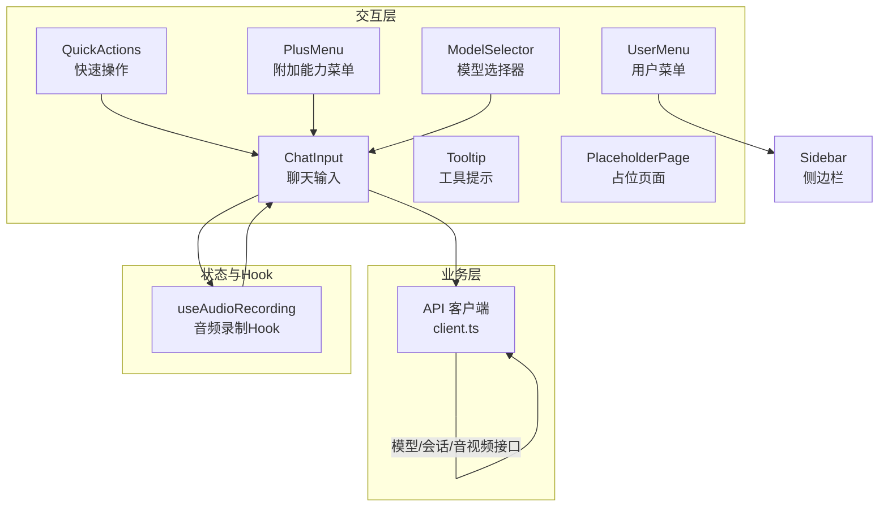
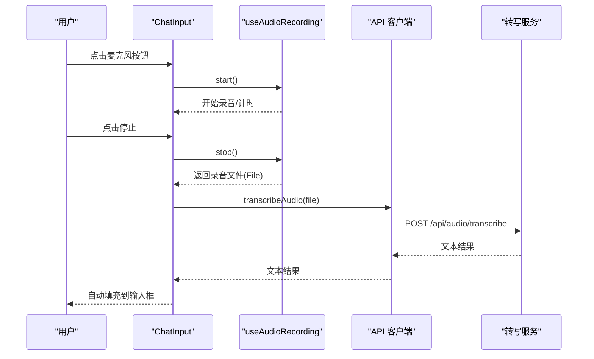
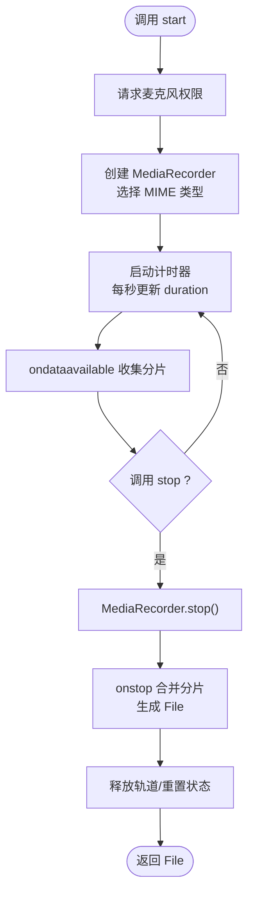
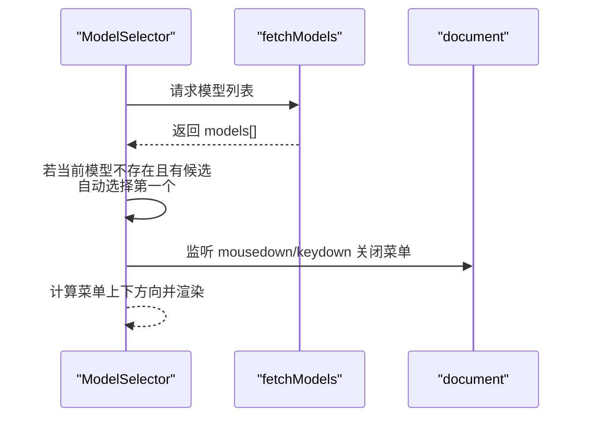
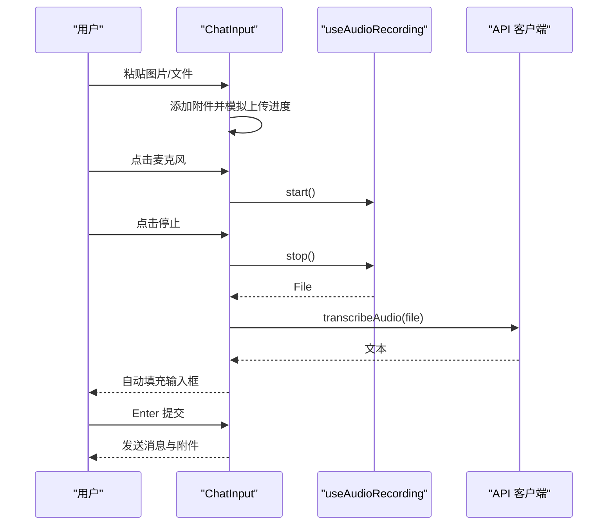
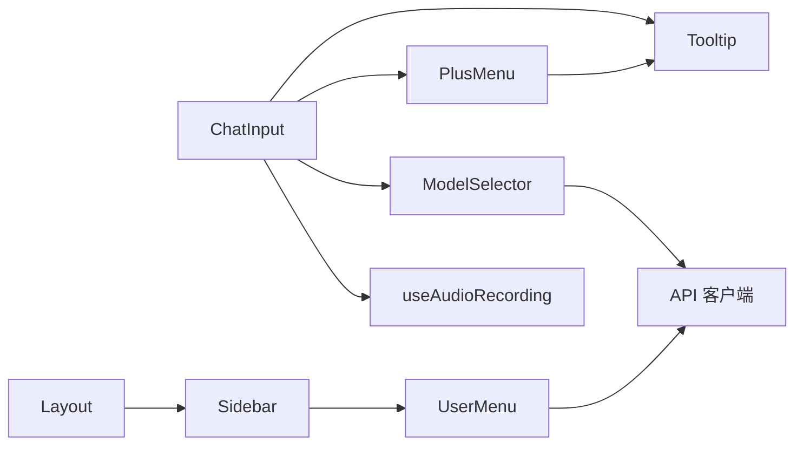

# 用户交互功能

<cite>
**本文引用的文件**
- [use-audio-recording.ts](file://apps/chat/web/src/app/hooks/use-audio-recording.ts)
- [quick-actions.tsx](file://apps/chat/web/src/app/components/quick-actions.tsx)
- [model-selector.tsx](file://apps/chat/web/src/app/components/model-selector.tsx)
- [set-instructions-modal.tsx](file://apps/chat/web/src/app/components/set-instructions-modal.tsx)
- [user-menu.tsx](file://apps/chat/web/src/app/components/user-menu.tsx)
- [tooltip.tsx](file://apps/chat/web/src/app/components/tooltip.tsx)
- [placeholder-page.tsx](file://apps/chat/web/src/app/components/placeholder-page.tsx)
- [chat-input.tsx](file://apps/chat/web/src/app/components/chat-input.tsx)
- [plus-menu.tsx](file://apps/chat/web/src/app/components/plus-menu.tsx)
- [sidebar.tsx](file://apps/chat/web/src/app/components/sidebar.tsx)
- [layout.tsx](file://apps/chat/web/src/app/components/layout.tsx)
- [client.ts](file://apps/chat/web/src/api/client.ts)
</cite>

## 目录
1. [简介](#简介)
2. [项目结构](#项目结构)
3. [核心组件](#核心组件)
4. [架构总览](#架构总览)
5. [详细组件分析](#详细组件分析)
6. [依赖关系分析](#依赖关系分析)
7. [性能考虑](#性能考虑)
8. [故障排查指南](#故障排查指南)
9. [结论](#结论)
10. [附录](#附录)

## 简介
本文件面向AIBrix聊天应用的用户交互功能，系统化梳理音频录制Hook、快捷操作、模型选择器、指令设置、用户菜单、工具提示、占位页面等交互模块的实现与设计要点。重点覆盖：
- 音频录制：浏览器兼容性处理、录音状态管理、文件生成与转写流程
- 模型选择：动态加载、自动回退、用户偏好持久化与界面反馈
- 快捷操作与附加能力：文件/照片上传、项目关联、样式风格、研究搜索
- 指令设置：项目级上下文注入与保存流程
- 用户菜单：语言切换、帮助入口、登出流程
- 工具提示与占位页面：轻量反馈与引导
- 性能优化、错误处理与用户体验最佳实践

## 项目结构
前端位于 apps/chat/web/src，采用按功能域分层的组织方式：
- hooks：可复用交互逻辑（如音频录制）
- components：UI组件（模型选择器、输入框、菜单、侧边栏等）
- api：统一的客户端封装（含认证、模型、会话、音视频等接口）

图表来源
- [quick-actions.tsx:1-34](file://apps/chat/web/src/app/components/quick-actions.tsx#L1-L34)
- [model-selector.tsx:1-142](file://apps/chat/web/src/app/components/model-selector.tsx#L1-L142)
- [chat-input.tsx:1-361](file://apps/chat/web/src/app/components/chat-input.tsx#L1-L361)
- [plus-menu.tsx:1-234](file://apps/chat/web/src/app/components/plus-menu.tsx#L1-L234)
- [user-menu.tsx:1-285](file://apps/chat/web/src/app/components/user-menu.tsx#L1-L285)
- [tooltip.tsx:1-44](file://apps/chat/web/src/app/components/tooltip.tsx#L1-L44)
- [placeholder-page.tsx:1-37](file://apps/chat/web/src/app/components/placeholder-page.tsx#L1-L37)
- [client.ts:1-447](file://apps/chat/web/src/api/client.ts#L1-L447)
- [use-audio-recording.ts:1-89](file://apps/chat/web/src/app/hooks/use-audio-recording.ts#L1-L89)

章节来源
- [layout.tsx:1-18](file://apps/chat/web/src/app/components/layout.tsx#L1-L18)
- [sidebar.tsx:1-239](file://apps/chat/web/src/app/components/sidebar.tsx#L1-L239)

## 核心组件
- 音频录制Hook：提供录音生命周期管理、时长计数、文件生成与清理
- 模型选择器：动态拉取模型列表、自动选择默认模型、下拉菜单自适应定位
- 聊天输入：支持文本、图片/文件附件、语音模式（录音+转写）、提交与快捷键
- 附加能力菜单：文件/截图/项目关联/GitHub接入、研究搜索、Web搜索开关、风格选择
- 用户菜单：语言切换（本地存储）、帮助入口、升级计划、下载、学习更多、登出
- 工具提示：延迟显示、位置控制
- 占位页面：图标/标题/描述的轻量引导页
- 指令设置模态：项目说明编辑与保存

章节来源
- [use-audio-recording.ts:1-89](file://apps/chat/web/src/app/hooks/use-audio-recording.ts#L1-L89)
- [model-selector.tsx:1-142](file://apps/chat/web/src/app/components/model-selector.tsx#L1-L142)
- [chat-input.tsx:1-361](file://apps/chat/web/src/app/components/chat-input.tsx#L1-L361)
- [plus-menu.tsx:1-234](file://apps/chat/web/src/app/components/plus-menu.tsx#L1-L234)
- [user-menu.tsx:1-285](file://apps/chat/web/src/app/components/user-menu.tsx#L1-L285)
- [tooltip.tsx:1-44](file://apps/chat/web/src/app/components/tooltip.tsx#L1-L44)
- [placeholder-page.tsx:1-37](file://apps/chat/web/src/app/components/placeholder-page.tsx#L1-L37)
- [set-instructions-modal.tsx:1-67](file://apps/chat/web/src/app/components/set-instructions-modal.tsx#L1-L67)

## 架构总览
前端通过API客户端统一封装后端接口，组件间通过props与回调传递数据与事件；音频录制通过Hook在组件内解耦；模型选择器负责动态加载与回退策略；聊天输入整合多种输入方式并通过流式接口与后端交互。

图表来源
- [chat-input.tsx:62-84](file://apps/chat/web/src/app/components/chat-input.tsx#L62-L84)
- [use-audio-recording.ts:39-81](file://apps/chat/web/src/app/hooks/use-audio-recording.ts#L39-L81)
- [client.ts:333-348](file://apps/chat/web/src/api/client.ts#L333-L348)

## 详细组件分析

### 音频录制Hook（useAudioRecording）
- 功能要点
  - 浏览器兼容性：优先使用 webm，不支持则回退 mp4
  - 录音状态：isRecording、duration、start/stop/cancel
  - 数据收集：MediaRecorder 分片收集，stop时合并Blob并生成File
  - 清理策略：stop后释放媒体轨道，定时器与状态重置
- 关键行为
  - start：请求麦克风权限，创建MediaRecorder，开启1秒分片
  - stop：触发stop事件，等待ondataavailable收集完成，生成文件
  - cancel：立即清理，避免资源泄漏
- 错误处理
  - start失败时捕获异常并上抛，调用方显示“麦克风被拒绝”
  - stop过程中忽略重复stop，确保幂等
- 复杂度与性能
  - 时间复杂度：start/stop/cancel均为O(1)，分片收集按时间线性
  - 内存：分片数组随录音时长增长，建议及时调用stop或cancel
  - 建议：移动端网络不佳时，可限制最大录音时长或分段上传

图表来源
- [use-audio-recording.ts:39-81](file://apps/chat/web/src/app/hooks/use-audio-recording.ts#L39-L81)

章节来源
- [use-audio-recording.ts:1-89](file://apps/chat/web/src/app/hooks/use-audio-recording.ts#L1-L89)

### 模型选择器（ModelSelector）
- 动态加载
  - 组件挂载时调用API获取模型列表，loading状态显示加载中
  - 若当前选中模型不在列表中，则自动选择第一个模型
- 下拉菜单
  - 支持点击外部关闭、Esc键关闭
  - 根据触发元素与菜单高度计算向上/向下定位，避免溢出
- 用户偏好与回退
  - 无模型时提示“检查网关连接”，提升可诊断性
  - 未选择模型时显示占位文案“Select model”
- 可扩展点
  - 可增加“按能力过滤”参数以缩小候选集
  - 可引入本地缓存减少重复请求

图表来源
- [model-selector.tsx:18-85](file://apps/chat/web/src/app/components/model-selector.tsx#L18-L85)
- [client.ts:133-139](file://apps/chat/web/src/api/client.ts#L133-L139)

章节来源
- [model-selector.tsx:1-142](file://apps/chat/web/src/app/components/model-selector.tsx#L1-L142)
- [client.ts:133-139](file://apps/chat/web/src/api/client.ts#L133-L139)

### 聊天输入（ChatInput）
- 输入能力
  - 文本输入：自动调整高度，支持多行
  - 附件：拖拽/粘贴/文件选择，支持图片预览与进度条
  - 语音：录音模式（开始/取消/停止），停止后调用转写接口，自动拼接到输入框
- 提交流程
  - 检查内容是否为空或正在上传，禁用发送
  - 发送时携带消息、模型、已上传附件
- 错误处理
  - 语音权限被拒：显示“麦克风访问被拒绝”
  - 转写失败：显示错误信息，保持输入框可用
- 上传模拟
  - 使用随机时长与固定步进模拟上传进度，完成后标记为非上传中
- 无障碍与体验
  - Enter键换行（Shift+Enter换行），Enter提交
  - 语音模式下禁用文本输入与附件添加，避免并发冲突

图表来源
- [chat-input.tsx:108-144](file://apps/chat/web/src/app/components/chat-input.tsx#L108-L144)
- [chat-input.tsx:62-84](file://apps/chat/web/src/app/components/chat-input.tsx#L62-L84)
- [use-audio-recording.ts:39-81](file://apps/chat/web/src/app/hooks/use-audio-recording.ts#L39-L81)
- [client.ts:333-348](file://apps/chat/web/src/api/client.ts#L333-L348)

章节来源
- [chat-input.tsx:1-361](file://apps/chat/web/src/app/components/chat-input.tsx#L1-L361)
- [use-audio-recording.ts:1-89](file://apps/chat/web/src/app/hooks/use-audio-recording.ts#L1-L89)
- [client.ts:333-348](file://apps/chat/web/src/api/client.ts#L333-L348)

### 附加能力菜单（PlusMenu）
- 文件与照片：触发隐藏文件输入，支持多选
- 截图：占位功能（可扩展）
- 项目关联：展示现有项目，支持新建项目
- 连接器：占位功能（可扩展）
- 工具：研究搜索、Web搜索开关、风格选择（普通/简洁/正式/解释性）
- 交互细节
  - 子菜单悬停切换，点击外部或Esc关闭
  - Web搜索开关状态持久化于组件内部
  - 项目子菜单支持“新建项目”入口

章节来源
- [plus-menu.tsx:1-234](file://apps/chat/web/src/app/components/plus-menu.tsx#L1-L234)

### 快速操作（QuickActions）
- 快捷入口：写作、学习、编码、AI创作、AI之选
- AI创作入口直接导航至对应页面
- 样式：圆角边框、悬停高亮、图标+文字组合

章节来源
- [quick-actions.tsx:1-34](file://apps/chat/web/src/app/components/quick-actions.tsx#L1-L34)

### 指令设置模态（SetInstructionsModal）
- 场景：为项目设置说明，与用户偏好、聊天风格协同
- 行为：打开时同步初始说明，保存后关闭并回调
- 交互：遮罩层点击关闭，取消/保存按钮

章节来源
- [set-instructions-modal.tsx:1-67](file://apps/chat/web/src/app/components/set-instructions-modal.tsx#L1-L67)

### 用户菜单（UserMenu）
- 语言切换：本地存储app-language，支持中英文选项
- 子菜单：设置、语言、帮助、升级计划、礼物、下载、学习更多、登出
- 交互：点击外部或Esc关闭；登出调用鉴权上下文logout
- 设计：深色背景卡片，带阴影与分隔线，图标+快捷键提示

章节来源
- [user-menu.tsx:1-285](file://apps/chat/web/src/app/components/user-menu.tsx#L1-L285)

### 工具提示（Tooltip）
- 行为：鼠标进入延时显示，离开隐藏；可配置位置（顶部/底部）与延迟
- 用途：录音取消、停止按钮、添加文件等微提示

章节来源
- [tooltip.tsx:1-44](file://apps/chat/web/src/app/components/tooltip.tsx#L1-L44)

### 占位页面（PlaceholderPage）
- 用于空状态或引导场景，支持三类图标（对话/制品/代码）
- 结构：图标容器、标题、描述

章节来源
- [placeholder-page.tsx:1-37](file://apps/chat/web/src/app/components/placeholder-page.tsx#L1-L37)

### 侧边栏与布局（Sidebar/Layout）
- 布局：左侧固定宽度侧边栏，右侧内容区，支持折叠/展开
- 侧边栏：导航项、收藏与最近会话列表、用户菜单
- 事件：监听会话变更事件，自动刷新会话列表

章节来源
- [layout.tsx:1-18](file://apps/chat/web/src/app/components/layout.tsx#L1-L18)
- [sidebar.tsx:1-239](file://apps/chat/web/src/app/components/sidebar.tsx#L1-L239)

## 依赖关系分析
- 组件依赖
  - ChatInput 依赖 useAudioRecording、ModelSelector、PlusMenu、Tooltip
  - ModelSelector 依赖 API 客户端 fetchModels
  - UserMenu 依赖鉴权上下文与本地存储
  - PlusMenu 依赖 Tooltip
- 数据流
  - API 客户端集中封装HTTP请求、鉴权头、401处理与事件派发
  - 组件通过回调与状态共享实现松耦合

图表来源
- [chat-input.tsx:1-361](file://apps/chat/web/src/app/components/chat-input.tsx#L1-L361)
- [model-selector.tsx:1-142](file://apps/chat/web/src/app/components/model-selector.tsx#L1-L142)
- [plus-menu.tsx:1-234](file://apps/chat/web/src/app/components/plus-menu.tsx#L1-L234)
- [user-menu.tsx:1-285](file://apps/chat/web/src/app/components/user-menu.tsx#L1-L285)
- [client.ts:1-447](file://apps/chat/web/src/api/client.ts#L1-L447)
- [layout.tsx:1-18](file://apps/chat/web/src/app/components/layout.tsx#L1-L18)
- [sidebar.tsx:1-239](file://apps/chat/web/src/app/components/sidebar.tsx#L1-L239)

章节来源
- [client.ts:1-447](file://apps/chat/web/src/api/client.ts#L1-L447)

## 性能考虑
- 音频录制
  - 使用1秒分片降低内存峰值，避免长时间录音导致内存压力
  - 在移动端建议限制最大录音时长或启用分段上传
- 附件上传
  - 模拟上传仅用于UI反馈，真实场景应替换为实际上传流程
  - 图片预览使用Object URL，组件卸载时及时回收
- 模型选择
  - 首次加载后可引入本地缓存，减少重复请求
  - 下拉菜单定位在窗口resize/scroll时重新计算，避免阻塞主线程
- 输入框
  - 自动高度调整仅在输入时触发，避免频繁重排
  - 文本提交前进行内容校验，减少无效请求

## 故障排查指南
- 麦克风权限被拒
  - 现象：start失败，显示“麦克风访问被拒绝”
  - 排查：确认浏览器权限设置、设备可用性、HTTPS环境
- 转写失败
  - 现象：转写阶段显示错误信息
  - 排查：检查后端转写服务可用性、文件格式与大小限制
- 模型列表为空
  - 现象：下拉菜单显示“无可用模型，请检查网关连接”
  - 排查：确认网关连通性、鉴权头、后端模型注册状态
- 附件无法删除
  - 现象：移除附件后仍占用内存
  - 排查：确认Object URL回收逻辑执行，组件卸载时清理
- 登录失效
  - 现象：401后自动跳转登录页
  - 排查：确认本地Token存在且未过期，网络代理配置正确

章节来源
- [chat-input.tsx:62-84](file://apps/chat/web/src/app/components/chat-input.tsx#L62-L84)
- [model-selector.tsx:112-118](file://apps/chat/web/src/app/components/model-selector.tsx#L112-L118)
- [client.ts:27-34](file://apps/chat/web/src/api/client.ts#L27-L34)

## 结论
本方案通过Hook与组件的清晰分层，实现了从音频录制到模型选择、从输入增强到用户管理的完整交互闭环。建议在后续迭代中强化真实上传流程、引入模型缓存与能力过滤、完善键盘快捷键与无障碍支持，并持续优化移动端体验与网络异常处理。

## 附录
- 最佳实践清单
  - 音频录制：分片收集、及时清理、错误兜底
  - 模型选择：自动回退、下拉自适应、空状态提示
  - 附件：预览与回收、进度模拟、批量处理
  - 语音输入：权限提示、转写失败重试、输入框联动
  - 用户菜单：本地化、登出安全、外链新标签
  - 指令设置：项目维度、保存即生效、与会话上下文融合