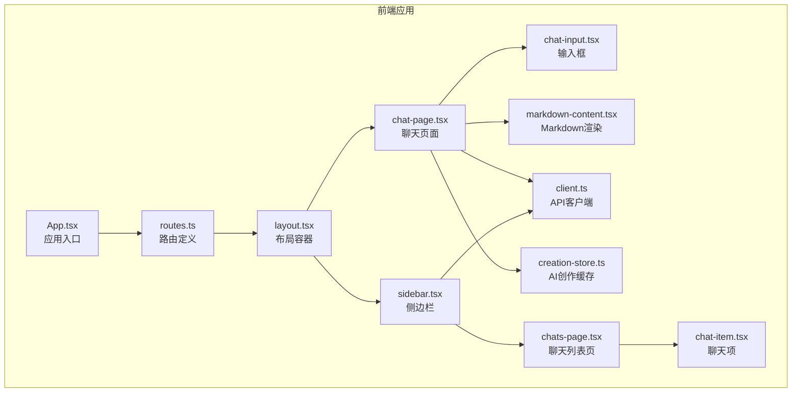
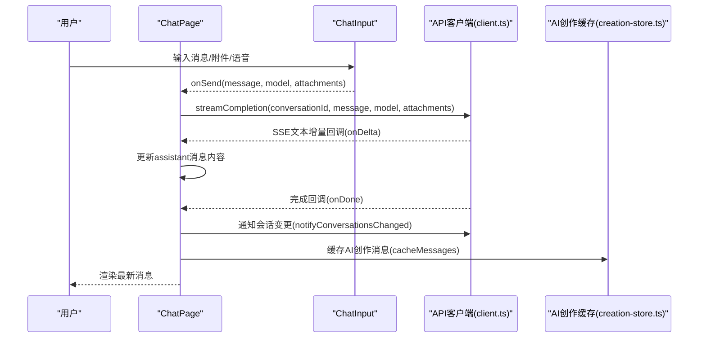
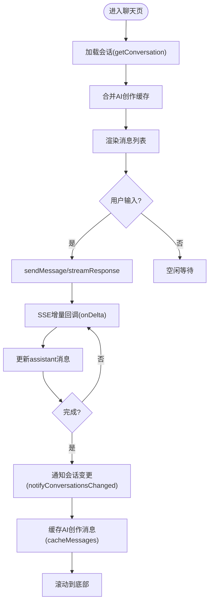
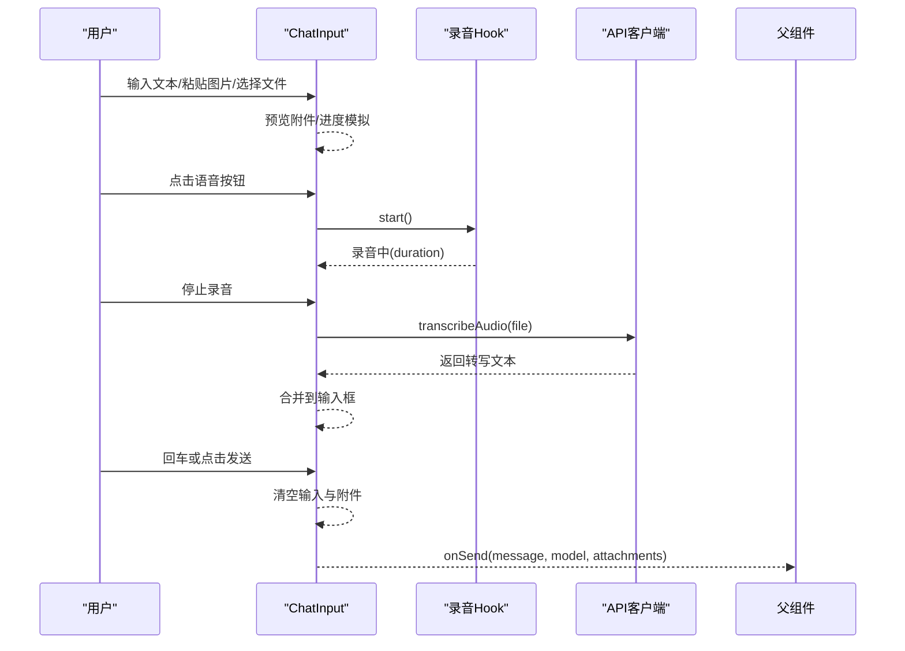
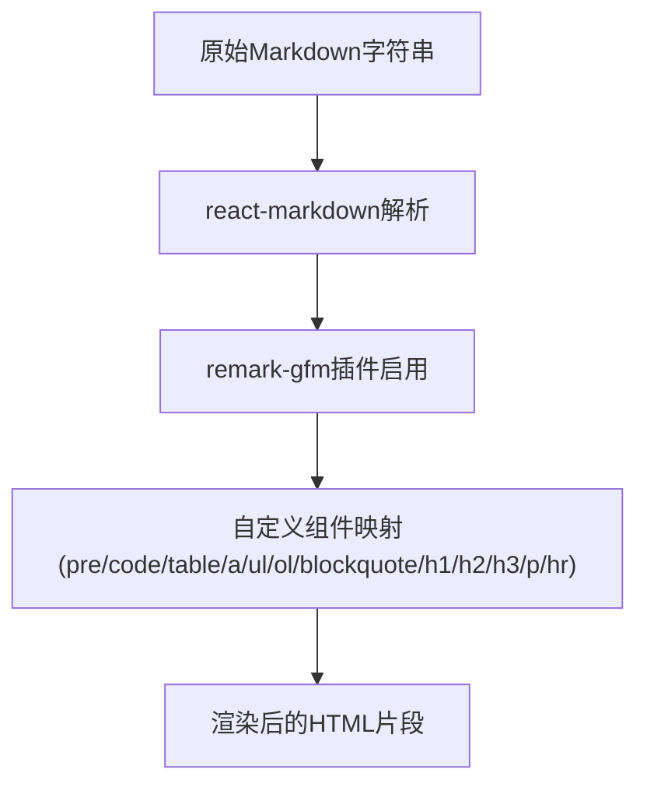
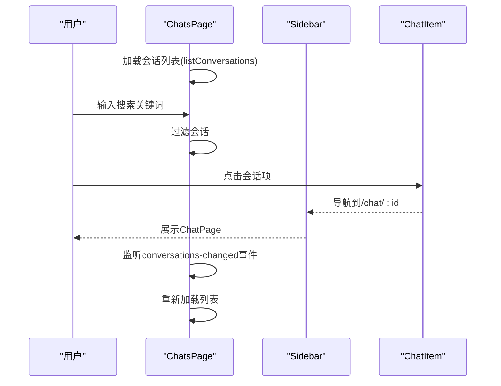
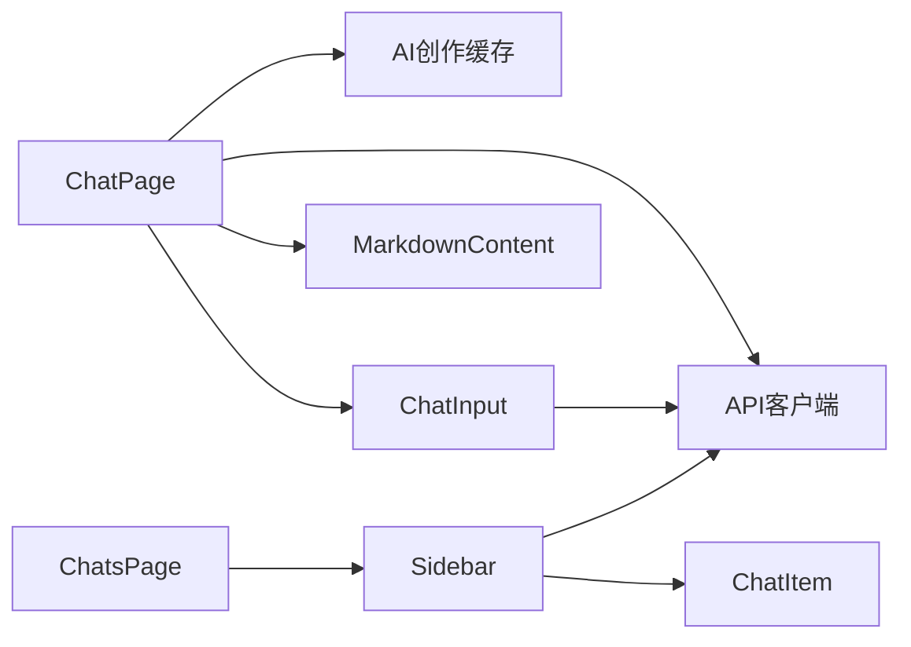

# 聊天界面组件

<cite>
**本文档引用的文件**
- [apps/chat/web/src/app/components/chat-page.tsx](file://apps/chat/web/src/app/components/chat-page.tsx)
- [apps/chat/web/src/app/components/chats-page.tsx](file://apps/chat/web/src/app/components/chats-page.tsx)
- [apps/chat/web/src/app/components/chat-item.tsx](file://apps/chat/web/src/app/components/chat-item.tsx)
- [apps/chat/web/src/app/components/chat-input.tsx](file://apps/chat/web/src/app/components/chat-input.tsx)
- [apps/chat/web/src/app/components/markdown-content.tsx](file://apps/chat/web/src/app/components/markdown-content.tsx)
- [apps/chat/web/src/api/client.ts](file://apps/chat/web/src/api/client.ts)
- [apps/chat/web/src/app/creation-store.ts](file://apps/chat/web/src/app/creation-store.ts)
- [apps/chat/web/src/app/components/sidebar.tsx](file://apps/chat/web/src/app/components/sidebar.tsx)
- [apps/chat/web/src/app/routes.ts](file://apps/chat/web/src/app/routes.ts)
- [apps/chat/web/src/app/App.tsx](file://apps/chat/web/src/app/App.tsx)
- [apps/chat/web/index.html](file://apps/chat/web/index.html)
- [apps/chat/web/package.json](file://apps/chat/web/package.json)
</cite>

## 目录
1. [简介](#简介)
2. [项目结构](#项目结构)
3. [核心组件](#核心组件)
4. [架构总览](#架构总览)
5. [详细组件分析](#详细组件分析)
6. [依赖关系分析](#依赖关系分析)
7. [性能考虑](#性能考虑)
8. [故障排查指南](#故障排查指南)
9. [结论](#结论)
10. [附录](#附录)

## 简介
本文件面向AIBrix聊天应用的前端聊天界面组件，系统性梳理并解释聊天页面、聊天列表、聊天项、输入框、Markdown渲染等核心界面组件的实现方式与交互流程。重点覆盖以下方面：
- 消息渲染机制（文本与AI创作内容）
- 实时流式响应与中断控制
- 用户交互处理（编辑、重发、语音转写、附件上传）
- 历史记录管理与消息状态跟踪
- 组件间数据传递、事件通信与状态同步
- 响应式设计、无障碍访问支持与性能优化策略

## 项目结构
聊天界面位于前端Web工程中，采用React + Vite构建，路由通过React Router v7管理。核心聊天功能由多个组件协作完成：聊天页面负责消息展示与流式渲染；聊天输入框负责消息与附件输入；聊天列表与侧边栏负责会话导航与管理；Markdown组件负责代码块复制与表格渲染；API客户端封装后端接口调用。

**图表来源**
- [apps/chat/web/src/app/App.tsx:1-7](file://apps/chat/web/src/app/App.tsx#L1-L7)
- [apps/chat/web/src/app/routes.ts:1-41](file://apps/chat/web/src/app/routes.ts#L1-L41)
- [apps/chat/web/src/app/components/chat-page.tsx:1-896](file://apps/chat/web/src/app/components/chat-page.tsx#L1-L896)
- [apps/chat/web/src/app/components/chat-input.tsx:1-361](file://apps/chat/web/src/app/components/chat-input.tsx#L1-L361)
- [apps/chat/web/src/app/components/markdown-content.tsx:1-93](file://apps/chat/web/src/app/components/markdown-content.tsx#L1-L93)
- [apps/chat/web/src/app/components/chats-page.tsx:1-348](file://apps/chat/web/src/app/components/chats-page.tsx#L1-L348)
- [apps/chat/web/src/app/components/chat-item.tsx:1-143](file://apps/chat/web/src/app/components/chat-item.tsx#L1-L143)
- [apps/chat/web/src/app/components/sidebar.tsx:1-239](file://apps/chat/web/src/app/components/sidebar.tsx#L1-L239)
- [apps/chat/web/src/api/client.ts:1-447](file://apps/chat/web/src/api/client.ts#L1-L447)
- [apps/chat/web/src/app/creation-store.ts:1-40](file://apps/chat/web/src/app/creation-store.ts#L1-L40)

**章节来源**
- [apps/chat/web/src/app/routes.ts:14-41](file://apps/chat/web/src/app/routes.ts#L14-L41)
- [apps/chat/web/src/app/components/chat-page.tsx:1-896](file://apps/chat/web/src/app/components/chat-page.tsx#L1-L896)
- [apps/chat/web/src/app/components/chat-input.tsx:1-361](file://apps/chat/web/src/app/components/chat-input.tsx#L1-L361)
- [apps/chat/web/src/app/components/markdown-content.tsx:1-93](file://apps/chat/web/src/app/components/markdown-content.tsx#L1-L93)
- [apps/chat/web/src/app/components/chats-page.tsx:1-348](file://apps/chat/web/src/app/components/chats-page.tsx#L1-L348)
- [apps/chat/web/src/app/components/chat-item.tsx:1-143](file://apps/chat/web/src/app/components/chat-item.tsx#L1-L143)
- [apps/chat/web/src/app/components/sidebar.tsx:1-239](file://apps/chat/web/src/app/components/sidebar.tsx#L1-L239)
- [apps/chat/web/src/api/client.ts:1-447](file://apps/chat/web/src/api/client.ts#L1-L447)
- [apps/chat/web/src/app/creation-store.ts:1-40](file://apps/chat/web/src/app/creation-store.ts#L1-L40)

## 核心组件
- 聊天页面（ChatPage）：负责加载会话、渲染消息、处理流式响应、编辑/重发、语音播放、AI创作（图像/视频）状态管理与轮询。
- 聊天输入框（ChatInput）：负责文本输入、附件拖拽/粘贴/选择、语音录制与转写、模型选择、提交发送。
- Markdown渲染（MarkdownContent）：基于react-markdown + remark-gfm，定制代码块复制、表格、链接、标题、引用等渲染行为。
- 聊天列表页（ChatsPage）：列出会话、搜索过滤、批量操作（移动/删除）、通知事件监听。
- 聊天项（ChatItem）：单条会话项，支持星标、重命名、移动、删除等上下文菜单。
- 侧边栏（Sidebar）：导航、新会话创建、会话列表、用户菜单。
- API客户端（client.ts）：封装认证、会话管理、流式补全、图像/视频/音频接口。
- AI创作缓存（creation-store.ts）：在SPA导航间缓存AI创作消息，确保侧边栏点击可恢复结果。

**章节来源**
- [apps/chat/web/src/app/components/chat-page.tsx:62-80](file://apps/chat/web/src/app/components/chat-page.tsx#L62-L80)
- [apps/chat/web/src/app/components/chat-input.tsx:20-36](file://apps/chat/web/src/app/components/chat-input.tsx#L20-L36)
- [apps/chat/web/src/app/components/markdown-content.tsx:14-16](file://apps/chat/web/src/app/components/markdown-content.tsx#L14-L16)
- [apps/chat/web/src/app/components/chats-page.tsx:108-136](file://apps/chat/web/src/app/components/chats-page.tsx#L108-L136)
- [apps/chat/web/src/app/components/chat-item.tsx:10-18](file://apps/chat/web/src/app/components/chat-item.tsx#L10-L18)
- [apps/chat/web/src/app/components/sidebar.tsx:25-58](file://apps/chat/web/src/app/components/sidebar.tsx#L25-L58)
- [apps/chat/web/src/api/client.ts:124-129](file://apps/chat/web/src/api/client.ts#L124-L129)
- [apps/chat/web/src/app/creation-store.ts:27-39](file://apps/chat/web/src/app/creation-store.ts#L27-L39)

## 架构总览
聊天界面采用“页面-组件-服务”分层：
- 页面层：ChatPage、ChatsPage、Sidebar
- 组件层：ChatInput、MarkdownContent、ChatItem
- 服务层：API客户端（client.ts）、AI创作缓存（creation-store.ts）

**图表来源**
- [apps/chat/web/src/app/components/chat-page.tsx:340-398](file://apps/chat/web/src/app/components/chat-page.tsx#L340-L398)
- [apps/chat/web/src/api/client.ts:194-281](file://apps/chat/web/src/api/client.ts#L194-L281)
- [apps/chat/web/src/app/creation-store.ts:33-35](file://apps/chat/web/src/app/creation-store.ts#L33-L35)

## 详细组件分析

### 聊天页面（ChatPage）
职责与特性：
- 会话加载与去重：从后端获取消息，并合并本地AI创作缓存的消息，避免重复存储。
- 流式响应：通过SSE接收增量文本，支持中断与错误处理。
- 编辑/重发：支持对历史消息进行编辑并触发重新生成。
- 语音播放：生成并播放TTS音频，支持同一消息重复点击切换播放。
- AI创作：图像生成、视频生成与轮询状态更新，支持下载与错误提示。
- 自动滚动：新消息到达时自动滚动到底部。
- 生命周期清理：组件卸载时释放blob URL资源。

**图表来源**
- [apps/chat/web/src/app/components/chat-page.tsx:118-167](file://apps/chat/web/src/app/components/chat-page.tsx#L118-L167)
- [apps/chat/web/src/app/components/chat-page.tsx:340-398](file://apps/chat/web/src/app/components/chat-page.tsx#L340-L398)
- [apps/chat/web/src/app/components/chat-page.tsx:295-338](file://apps/chat/web/src/app/components/chat-page.tsx#L295-L338)
- [apps/chat/web/src/app/creation-store.ts:33-35](file://apps/chat/web/src/app/creation-store.ts#L33-L35)

**章节来源**
- [apps/chat/web/src/app/components/chat-page.tsx:62-167](file://apps/chat/web/src/app/components/chat-page.tsx#L62-L167)
- [apps/chat/web/src/app/components/chat-page.tsx:169-288](file://apps/chat/web/src/app/components/chat-page.tsx#L169-L288)
- [apps/chat/web/src/app/components/chat-page.tsx:295-398](file://apps/chat/web/src/app/components/chat-page.tsx#L295-L398)
- [apps/chat/web/src/app/components/chat-page.tsx:400-431](file://apps/chat/web/src/app/components/chat-page.tsx#L400-L431)
- [apps/chat/web/src/app/components/chat-page.tsx:439-482](file://apps/chat/web/src/app/components/chat-page.tsx#L439-L482)
- [apps/chat/web/src/app/components/chat-page.tsx:488-551](file://apps/chat/web/src/app/components/chat-page.tsx#L488-L551)
- [apps/chat/web/src/app/components/chat-page.tsx:552-701](file://apps/chat/web/src/app/components/chat-page.tsx#L552-L701)

### 聊天输入框（ChatInput）
职责与特性：
- 文本输入：自适应高度，支持多行输入与回车发送。
- 附件处理：支持拖拽、粘贴、文件选择；图片即时预览；上传进度模拟。
- 语音模式：录音开始/停止/取消；转写后拼接到输入框。
- 模型选择：可选模型传递给上层。
- 提交发送：清空输入与附件，触发父组件发送回调。

**图表来源**
- [apps/chat/web/src/app/components/chat-input.tsx:58-144](file://apps/chat/web/src/app/components/chat-input.tsx#L58-L144)
- [apps/chat/web/src/app/components/chat-input.tsx:146-177](file://apps/chat/web/src/app/components/chat-input.tsx#L146-L177)
- [apps/chat/web/src/app/components/chat-input.tsx:179-200](file://apps/chat/web/src/app/components/chat-input.tsx#L179-L200)
- [apps/chat/web/src/app/components/chat-input.tsx:202-218](file://apps/chat/web/src/app/components/chat-input.tsx#L202-L218)
- [apps/chat/web/src/api/client.ts:333-348](file://apps/chat/web/src/api/client.ts#L333-L348)

**章节来源**
- [apps/chat/web/src/app/components/chat-input.tsx:20-36](file://apps/chat/web/src/app/components/chat-input.tsx#L20-L36)
- [apps/chat/web/src/app/components/chat-input.tsx:58-106](file://apps/chat/web/src/app/components/chat-input.tsx#L58-L106)
- [apps/chat/web/src/app/components/chat-input.tsx:108-144](file://apps/chat/web/src/app/components/chat-input.tsx#L108-L144)
- [apps/chat/web/src/app/components/chat-input.tsx:146-177](file://apps/chat/web/src/app/components/chat-input.tsx#L146-L177)
- [apps/chat/web/src/app/components/chat-input.tsx:179-200](file://apps/chat/web/src/app/components/chat-input.tsx#L179-L200)
- [apps/chat/web/src/app/components/chat-input.tsx:202-218](file://apps/chat/web/src/app/components/chat-input.tsx#L202-L218)

### Markdown渲染（MarkdownContent）
职责与特性：
- 使用react-markdown与remark-gfm插件渲染Markdown。
- 自定义组件：代码块复制、内联代码样式、表格滚动容器、链接外链打开、标题层级、引用样式、分割线等。
- 代码块复制：提取纯文本内容，提供一键复制到剪贴板。

**图表来源**
- [apps/chat/web/src/app/components/markdown-content.tsx:18-92](file://apps/chat/web/src/app/components/markdown-content.tsx#L18-L92)

**章节来源**
- [apps/chat/web/src/app/components/markdown-content.tsx:14-16](file://apps/chat/web/src/app/components/markdown-content.tsx#L14-L16)
- [apps/chat/web/src/app/components/markdown-content.tsx:18-92](file://apps/chat/web/src/app/components/markdown-content.tsx#L18-L92)

### 聊天列表页（ChatsPage）与聊天项（ChatItem）
职责与特性：
- ChatsPage：列出会话、搜索过滤、批量选择、移动/删除、通知提示、监听会话变更事件。
- ChatItem：单条会话项，支持星标、重命名、移动、删除上下文菜单，点击进入对应会话。

**图表来源**
- [apps/chat/web/src/app/components/chats-page.tsx:119-136](file://apps/chat/web/src/app/components/chats-page.tsx#L119-L136)
- [apps/chat/web/src/app/components/chats-page.tsx:137-140](file://apps/chat/web/src/app/components/chats-page.tsx#L137-L140)
- [apps/chat/web/src/app/components/sidebar.tsx:125-137](file://apps/chat/web/src/app/components/sidebar.tsx#L125-L137)
- [apps/chat/web/src/api/client.ts:124-129](file://apps/chat/web/src/api/client.ts#L124-L129)

**章节来源**
- [apps/chat/web/src/app/components/chats-page.tsx:108-136](file://apps/chat/web/src/app/components/chats-page.tsx#L108-L136)
- [apps/chat/web/src/app/components/chats-page.tsx:137-140](file://apps/chat/web/src/app/components/chats-page.tsx#L137-L140)
- [apps/chat/web/src/app/components/chat-item.tsx:10-18](file://apps/chat/web/src/app/components/chat-item.tsx#L10-L18)
- [apps/chat/web/src/app/components/chat-item.tsx:20-42](file://apps/chat/web/src/app/components/chat-item.tsx#L20-L42)
- [apps/chat/web/src/app/components/chat-item.tsx:44-83](file://apps/chat/web/src/app/components/chat-item.tsx#L44-L83)
- [apps/chat/web/src/app/components/sidebar.tsx:125-137](file://apps/chat/web/src/app/components/sidebar.tsx#L125-L137)

### 侧边栏（Sidebar）
职责与特性：
- 导航到不同功能模块（聊天、AI创作、项目、制品、代码）。
- 新建会话、展开/收起侧边栏。
- 会话列表展示、星标/重命名/移动/删除操作。
- 监听会话变更事件，动态刷新列表。

**章节来源**
- [apps/chat/web/src/app/components/sidebar.tsx:25-58](file://apps/chat/web/src/app/components/sidebar.tsx#L25-L58)
- [apps/chat/web/src/app/components/sidebar.tsx:68-122](file://apps/chat/web/src/app/components/sidebar.tsx#L68-L122)
- [apps/chat/web/src/app/components/sidebar.tsx:125-137](file://apps/chat/web/src/app/components/sidebar.tsx#L125-L137)

### API客户端（client.ts）
职责与特性：
- 认证：本地存储Token，统一注入Authorization头；401自动跳转登录。
- 会话：创建、列出、获取、重命名、删除。
- 流式补全：SSE实现，支持文本增量、完成、错误事件。
- AI能力：图像生成/编辑、视频生成/状态查询/内容下载、音频转写/TTS。
- 通知：自定义事件conversations-changed用于全局刷新。

**章节来源**
- [apps/chat/web/src/api/client.ts:9-34](file://apps/chat/web/src/api/client.ts#L9-L34)
- [apps/chat/web/src/api/client.ts:124-129](file://apps/chat/web/src/api/client.ts#L124-L129)
- [apps/chat/web/src/api/client.ts:141-193](file://apps/chat/web/src/api/client.ts#L141-L193)
- [apps/chat/web/src/api/client.ts:194-281](file://apps/chat/web/src/api/client.ts#L194-L281)
- [apps/chat/web/src/api/client.ts:283-348](file://apps/chat/web/src/api/client.ts#L283-L348)
- [apps/chat/web/src/api/client.ts:365-396](file://apps/chat/web/src/api/client.ts#L365-L396)

### AI创作缓存（creation-store.ts）
职责与特性：
- pendingCreation：保存当前创作的文件与临时blob URL，供一次性的跨路由使用。
- messageCache：以会话ID为键缓存AI创作消息，保证侧边栏点击能恢复创作结果。

**章节来源**
- [apps/chat/web/src/app/creation-store.ts:27-39](file://apps/chat/web/src/app/creation-store.ts#L27-L39)

## 依赖关系分析
- 组件耦合：ChatPage依赖ChatInput、MarkdownContent、API客户端与AI创作缓存；ChatsPage依赖Sidebar与API客户端；Sidebar依赖ChatItem与API客户端。
- 外部依赖：react-markdown、remark-gfm、SSE流式传输、浏览器媒体设备（录音/播放）、本地存储（Token）。
- 事件通信：通过CustomEvent实现会话列表的全局刷新；通过AbortController控制流式请求中断。

**图表来源**
- [apps/chat/web/src/app/components/chat-page.tsx:20-24](file://apps/chat/web/src/app/components/chat-page.tsx#L20-L24)
- [apps/chat/web/src/app/components/chat-input.tsx:1-8](file://apps/chat/web/src/app/components/chat-input.tsx#L1-L8)
- [apps/chat/web/src/app/components/chats-page.tsx:1-11](file://apps/chat/web/src/app/components/chats-page.tsx#L1-L11)
- [apps/chat/web/src/app/components/sidebar.tsx:1-11](file://apps/chat/web/src/app/components/sidebar.tsx#L1-L11)
- [apps/chat/web/src/app/creation-store.ts:1-40](file://apps/chat/web/src/app/creation-store.ts#L1-L40)
- [apps/chat/web/src/api/client.ts:1-8](file://apps/chat/web/src/api/client.ts#L1-L8)

**章节来源**
- [apps/chat/web/src/app/components/chat-page.tsx:20-24](file://apps/chat/web/src/app/components/chat-page.tsx#L20-L24)
- [apps/chat/web/src/app/components/chat-input.tsx:1-8](file://apps/chat/web/src/app/components/chat-input.tsx#L1-L8)
- [apps/chat/web/src/app/components/chats-page.tsx:1-11](file://apps/chat/web/src/app/components/chats-page.tsx#L1-L11)
- [apps/chat/web/src/app/components/sidebar.tsx:1-11](file://apps/chat/web/src/app/components/sidebar.tsx#L1-L11)
- [apps/chat/web/src/app/creation-store.ts:1-40](file://apps/chat/web/src/app/creation-store.ts#L1-L40)
- [apps/chat/web/src/api/client.ts:1-8](file://apps/chat/web/src/api/client.ts#L1-L8)

## 性能考虑
- 流式渲染：SSE增量更新，避免一次性渲染大段文本，提升首屏与滚动性能。
- 资源释放：组件卸载时主动回收blob URL，防止内存泄漏。
- 附件预览：图片使用URL.createObjectURL，上传完成后及时释放。
- 列表渲染：聊天列表使用虚拟化或最小必要DOM节点，减少重排重绘。
- 事件监听：仅在需要时注册全局事件，组件卸载时移除，避免内存泄漏。
- 语音转写：录音结束后再发起转写请求，避免频繁IO。

[本节为通用指导，无需特定文件分析]

## 故障排查指南
- 401未授权：检查本地Token是否存在与是否过期；确认后端返回401时是否正确跳转登录。
- 流式响应异常：确认SSE连接是否建立成功；检查onError回调是否被触发；查看网络面板中的事件流。
- 语音转写失败：确认麦克风权限是否允许；检查transcribeAudio返回的错误信息。
- 视频生成状态轮询：确认轮询间隔与最大尝试次数；检查状态字段与错误信息。
- 附件上传：确认拖拽/粘贴/选择文件是否触发预览；上传进度是否正确更新。
- 会话列表不刷新：确认notifyConversationsChanged事件是否派发；监听器是否正确注册与移除。

**章节来源**
- [apps/chat/web/src/api/client.ts:27-34](file://apps/chat/web/src/api/client.ts#L27-L34)
- [apps/chat/web/src/api/client.ts:194-281](file://apps/chat/web/src/api/client.ts#L194-L281)
- [apps/chat/web/src/app/components/chat-input.tsx:62-84](file://apps/chat/web/src/app/components/chat-input.tsx#L62-L84)
- [apps/chat/web/src/app/components/chat-page.tsx:169-188](file://apps/chat/web/src/app/components/chat-page.tsx#L169-L188)
- [apps/chat/web/src/app/components/chat-input.tsx:108-134](file://apps/chat/web/src/app/components/chat-input.tsx#L108-L134)
- [apps/chat/web/src/app/components/chats-page.tsx:129-135](file://apps/chat/web/src/app/components/chats-page.tsx#L129-L135)

## 结论
本聊天界面组件体系以React为核心，结合SSE流式传输、本地缓存与全局事件，实现了高效、可扩展的聊天体验。通过清晰的职责划分与事件通信机制，组件间耦合度低、可维护性强。建议在后续迭代中进一步引入虚拟列表、离线缓存与更完善的无障碍支持，持续优化用户体验与性能表现。

[本节为总结性内容，无需特定文件分析]

## 附录
- 响应式设计：组件普遍采用相对宽度与flex布局，配合Tailwind类名实现自适应。
- 无障碍访问：按钮与菜单使用aria属性，键盘可聚焦；图标具备可读性描述。
- 开发工具：Biome格式化与类型检查、Vite热更新、TypeScript类型约束。

**章节来源**
- [apps/chat/web/package.json:6-12](file://apps/chat/web/package.json#L6-L12)
- [apps/chat/web/src/app/components/chat-input.tsx:270-286](file://apps/chat/web/src/app/components/chat-input.tsx#L270-L286)
- [apps/chat/web/src/app/components/chat-page.tsx:722-750](file://apps/chat/web/src/app/components/chat-page.tsx#L722-L750)