# API路由模块

<cite>
**本文引用的文件**
- [apps/chat/api/main.py](file://apps/chat/api/main.py)
- [apps/chat/api/config.py](file://apps/chat/api/config.py)
- [apps/chat/api/routers/auth.py](file://apps/chat/api/routers/auth.py)
- [apps/chat/api/routers/chat.py](file://apps/chat/api/routers/chat.py)
- [apps/chat/api/routers/conversations.py](file://apps/chat/api/routers/conversations.py)
- [apps/chat/api/routers/health.py](file://apps/chat/api/routers/health.py)
- [apps/chat/api/routers/models.py](file://apps/chat/api/routers/models.py)
- [apps/chat/api/routers/projects.py](file://apps/chat/api/routers/projects.py)
- [apps/chat/api/routers/images.py](file://apps/chat/api/routers/images.py)
- [apps/chat/api/routers/audio.py](file://apps/chat/api/routers/audio.py)
- [apps/chat/api/routers/video.py](file://apps/chat/api/routers/video.py)
- [apps/chat/api/models/schemas.py](file://apps/chat/api/models/schemas.py)
- [apps/chat/api/middleware/auth.py](file://apps/chat/api/middleware/auth.py)
</cite>

## 目录
1. [简介](#简介)
2. [项目结构](#项目结构)
3. [核心组件](#核心组件)
4. [架构总览](#架构总览)
5. [详细组件分析](#详细组件分析)
6. [依赖关系分析](#依赖关系分析)
7. [性能考量](#性能考量)
8. [故障排查指南](#故障排查指南)
9. [结论](#结论)
10. [附录：接口规范](#附录接口规范)

## 简介
本文件为 AIBrix 聊天应用的 API 路由模块提供全面技术文档。该模块采用 FastAPI 构建，作为前端后端（BFF）统一入口，负责路由聚合、鉴权、CORS、静态资源托管以及与多模态服务提供方（图像、音频、视频、聊天）的代理交互。模块覆盖聊天对话、会话管理、用户认证、项目管理、模型发现、多媒体处理、健康检查等能力，并通过 SSE 流式返回聊天结果。

## 项目结构
- 应用入口与生命周期：在应用启动时初始化各提供方连接池，在关闭时释放；挂载所有路由模块并配置跨域策略。
- 路由组织：按功能域划分独立模块，如聊天、会话、认证、项目、模型、图片、音频、视频、健康检查。
- 配置中心：集中管理网关地址、API Key、默认模型、允许列表、CORS 源、鉴权模式等。
- 数据模型：使用 Pydantic 定义请求/响应结构，确保输入校验与输出一致性。
- 中间件：统一鉴权依赖，支持“无鉴权”和“简单鉴权（Bearer Token）”。

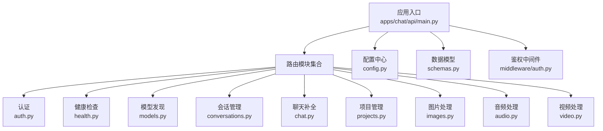

图表来源
- [apps/chat/api/main.py:37-87](file://apps/chat/api/main.py#L37-L87)
- [apps/chat/api/routers/auth.py:12](file://apps/chat/api/routers/auth.py#L12)
- [apps/chat/api/routers/health.py:9](file://apps/chat/api/routers/health.py#L9)
- [apps/chat/api/routers/models.py:11](file://apps/chat/api/routers/models.py#L11)
- [apps/chat/api/routers/conversations.py:10](file://apps/chat/api/routers/conversations.py#L10)
- [apps/chat/api/routers/chat.py:21](file://apps/chat/api/routers/chat.py#L21)
- [apps/chat/api/routers/projects.py:11](file://apps/chat/api/routers/projects.py#L11)
- [apps/chat/api/routers/images.py:16](file://apps/chat/api/routers/images.py#L16)
- [apps/chat/api/routers/audio.py:17](file://apps/chat/api/routers/audio.py#L17)
- [apps/chat/api/routers/video.py:16](file://apps/chat/api/routers/video.py#L16)
- [apps/chat/api/config.py:4](file://apps/chat/api/config.py#L4)
- [apps/chat/api/models/schemas.py:1](file://apps/chat/api/models/schemas.py#L1)
- [apps/chat/api/middleware/auth.py:17](file://apps/chat/api/middleware/auth.py#L17)

章节来源
- [apps/chat/api/main.py:37-87](file://apps/chat/api/main.py#L37-L87)

## 核心组件
- 应用入口与生命周期
  - 使用 lifespan 在启动时初始化聊天、图片、音频、视频提供方的连接池；在关闭时统一释放。
  - 配置 Swagger UI、ReDoc、OpenAPI 文档路径。
- 路由注册
  - 统一 include_router 注册认证、健康、模型、会话、聊天、项目、图片、音频、视频路由。
- CORS
  - 支持跨域来源、凭证、方法与头部白名单。
- 静态资源与 SPA 回退
  - 挂载前端构建产物目录，非 API 路径回退到 index.html。

章节来源
- [apps/chat/api/main.py:21-87](file://apps/chat/api/main.py#L21-L87)

## 架构总览
下图展示从客户端到路由层、鉴权、服务层与外部提供方的整体调用链路。

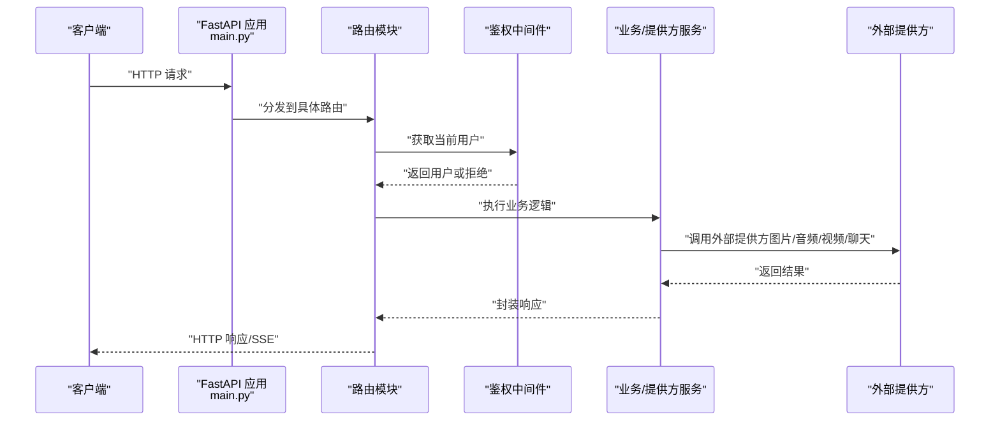

图表来源
- [apps/chat/api/main.py:62-71](file://apps/chat/api/main.py#L62-L71)
- [apps/chat/api/middleware/auth.py:17-35](file://apps/chat/api/middleware/auth.py#L17-L35)
- [apps/chat/api/routers/chat.py:40-125](file://apps/chat/api/routers/chat.py#L40-L125)
- [apps/chat/api/routers/images.py:19-42](file://apps/chat/api/routers/images.py#L19-L42)
- [apps/chat/api/routers/audio.py:20-65](file://apps/chat/api/routers/audio.py#L20-L65)
- [apps/chat/api/routers/video.py:19-65](file://apps/chat/api/routers/video.py#L19-L65)

## 详细组件分析

### 认证模块（/api/auth）
- 功能职责
  - 返回当前鉴权模式
  - 用户登录（生成令牌）
  - 获取当前用户信息
  - 用户登出（基于 Authorization 头中的 Bearer 令牌）
- 关键设计
  - 鉴权模式由配置决定，支持“无鉴权”和“简单鉴权”
  - 登录成功返回用户与令牌；登出根据令牌撤销
- 错误处理
  - 缺少或无效的 Authorization 头返回 401
  - 令牌无效或过期返回 401
  - 登录名为空返回 400

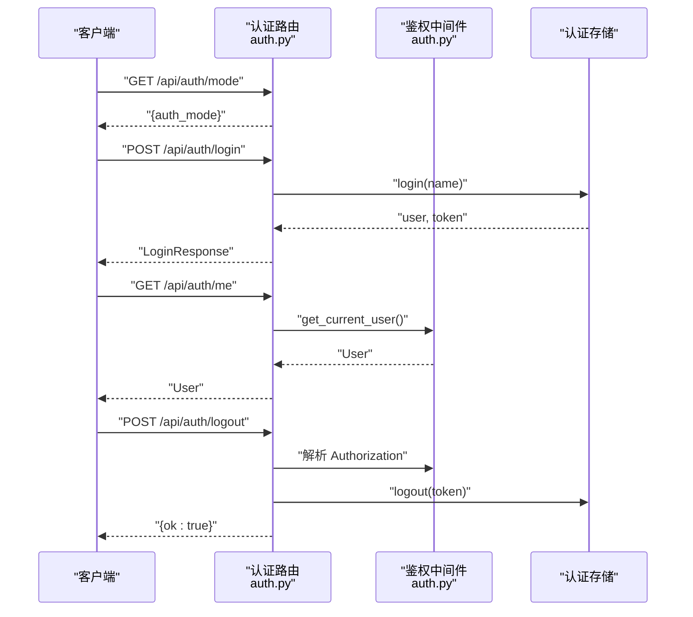

图表来源
- [apps/chat/api/routers/auth.py:15-42](file://apps/chat/api/routers/auth.py#L15-L42)
- [apps/chat/api/middleware/auth.py:17-35](file://apps/chat/api/middleware/auth.py#L17-L35)

章节来源
- [apps/chat/api/routers/auth.py:15-42](file://apps/chat/api/routers/auth.py#L15-L42)
- [apps/chat/api/middleware/auth.py:17-35](file://apps/chat/api/middleware/auth.py#L17-L35)

### 健康检查模块（/api/health）
- 功能职责
  - 检查网关可达性并返回应用版本与状态
- 关键设计
  - 调用网关健康探测接口，返回布尔值表示可达性
- 响应模型
  - 包含状态、版本与网关可达性字段

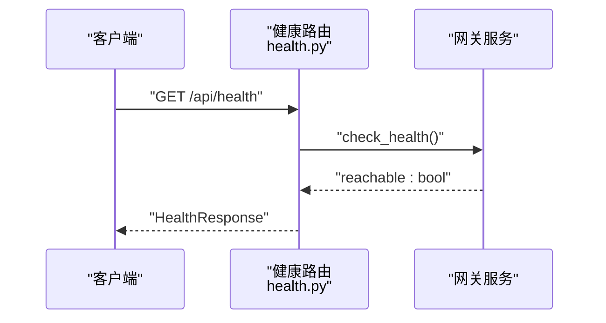

图表来源
- [apps/chat/api/routers/health.py:12-19](file://apps/chat/api/routers/health.py#L12-L19)

章节来源
- [apps/chat/api/routers/health.py:12-19](file://apps/chat/api/routers/health.py#L12-L19)

### 模型发现模块（/api/models）
- 功能职责
  - 代理获取可用模型列表，按能力过滤与允许列表进行筛选
- 关键设计
  - 能力推断：基于模型 ID 的正则匹配推断文本/图像/音频/视频/嵌入能力
  - 允许列表：支持全局与按能力的允许列表，优先级明确
  - 查询参数：capability 可选，用于按能力过滤
- 响应模型
  - 返回模型列表，包含 id、名称、能力与归属信息

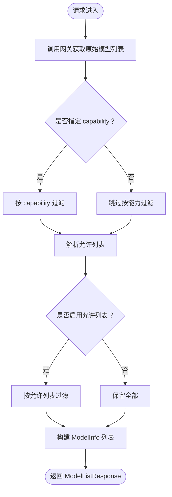

图表来源
- [apps/chat/api/routers/models.py:92-127](file://apps/chat/api/routers/models.py#L92-L127)

章节来源
- [apps/chat/api/routers/models.py:92-127](file://apps/chat/api/routers/models.py#L92-L127)

### 会话管理模块（/api/conversations）
- 功能职责
  - 创建会话、列出会话、获取会话详情、更新标题、删除会话
- 关键设计
  - 所有操作均依赖鉴权中间件获取当前用户，保证数据隔离
  - 会话与用户绑定，删除时进行权限校验
- 请求/响应模型
  - 创建请求：模型、标题、项目 ID
  - 更新请求：新标题
  - 列表返回摘要视图，详情返回完整视图

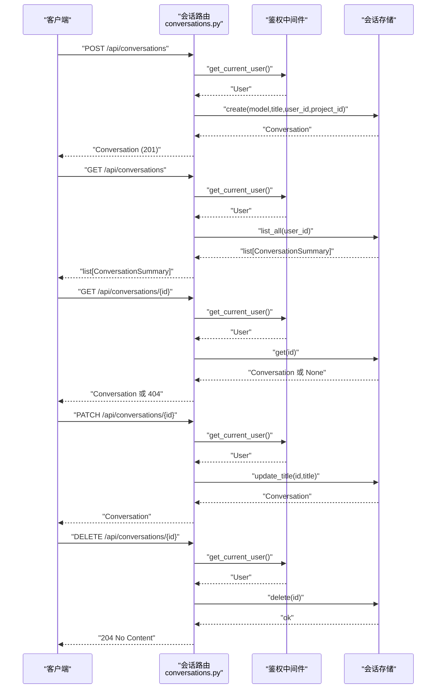

图表来源
- [apps/chat/api/routers/conversations.py:23-73](file://apps/chat/api/routers/conversations.py#L23-L73)
- [apps/chat/api/middleware/auth.py:17-35](file://apps/chat/api/middleware/auth.py#L17-L35)

章节来源
- [apps/chat/api/routers/conversations.py:23-73](file://apps/chat/api/routers/conversations.py#L23-L73)

### 聊天补全模块（/api/conversations/{conversation_id}/completions）
- 功能职责
  - 发送消息并获取回复，支持流式（SSE）与非流式两种模式
  - 自动为首个默认标题的会话从用户消息派生标题
  - 支持上传附件（图片预览），并构建完整消息历史
- 关键设计
  - 路由参数：conversation_id
  - 表单参数：message、model、stream、temperature、max_tokens、system_prompt、files
  - 鉴权：依赖当前用户
  - 历史构建：从会话存储中拼接系统提示、项目指令与历史消息
  - 流式：EventSourceResponse，逐段推送 delta；非流式：一次性返回完整响应
- 错误处理
  - 会话不存在或越权：404
  - 文件过大：413
  - 网关错误：502
- 响应模型
  - 非流式：CompletionResponse（包含 id、会话 id、模型、助手消息、用量）

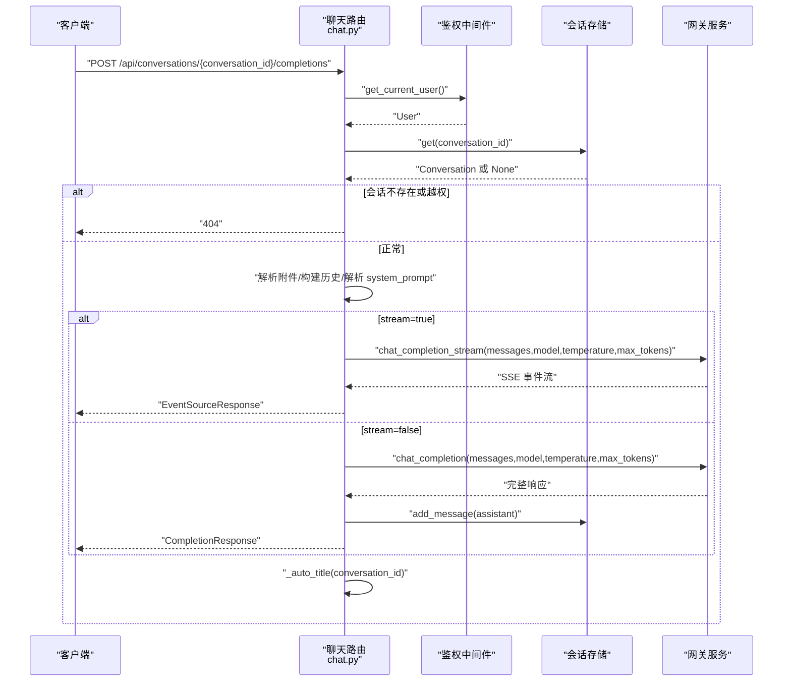

图表来源
- [apps/chat/api/routers/chat.py:40-199](file://apps/chat/api/routers/chat.py#L40-L199)

章节来源
- [apps/chat/api/routers/chat.py:40-199](file://apps/chat/api/routers/chat.py#L40-L199)

### 项目管理模块（/api/projects）
- 功能职责
  - 创建项目、列出项目、获取项目详情、更新项目、删除项目
- 关键设计
  - 所有操作均绑定当前用户，防止越权访问
  - 更新支持部分字段（名称、描述、指令）
- 响应模型
  - 列表返回项目摘要视图，详情返回完整视图

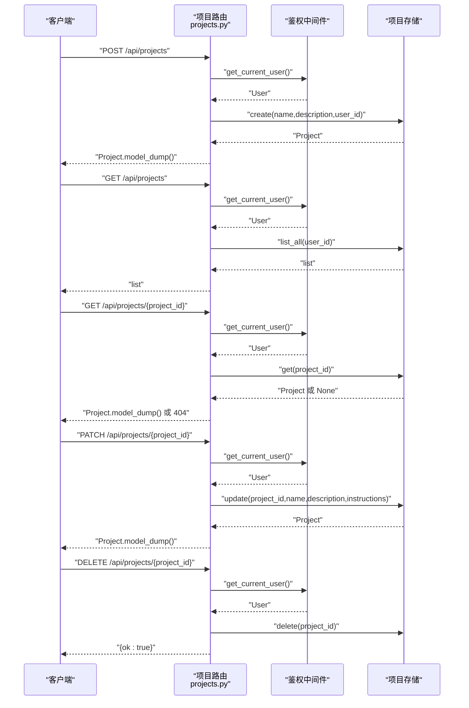

图表来源
- [apps/chat/api/routers/projects.py:14-71](file://apps/chat/api/routers/projects.py#L14-L71)
- [apps/chat/api/middleware/auth.py:17-35](file://apps/chat/api/middleware/auth.py#L17-L35)

章节来源
- [apps/chat/api/routers/projects.py:14-71](file://apps/chat/api/routers/projects.py#L14-L71)

### 图片处理模块（/api/image）
- 功能职责
  - 图像生成：支持质量、风格、响应格式等参数透传
  - 图像编辑：基于文本提示对上传图像进行编辑
- 关键设计
  - 生成与编辑均委托给图片提供方（默认 OpenAI）
  - 编辑接口支持文件上传与表单参数
- 错误处理
  - 提供方错误：502
- 响应模型
  - 生成与编辑均返回统一的图像数据结构

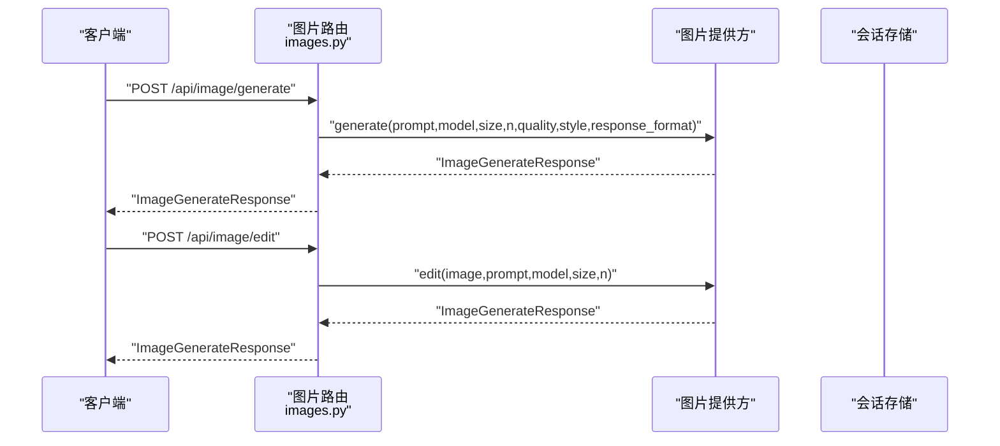

图表来源
- [apps/chat/api/routers/images.py:19-72](file://apps/chat/api/routers/images.py#L19-L72)

章节来源
- [apps/chat/api/routers/images.py:19-72](file://apps/chat/api/routers/images.py#L19-L72)

### 音频处理模块（/api/audio）
- 功能职责
  - 音频转写（ASR）：支持语言参数
  - 文本转语音（TTS）：根据响应格式返回对应媒体类型
- 关键设计
  - 转写与 TTS 委托给音频提供方（默认 Whisper/TTS）
  - TTS 返回二进制音频内容，媒体类型依据响应格式选择
- 错误处理
  - 提供方错误：502

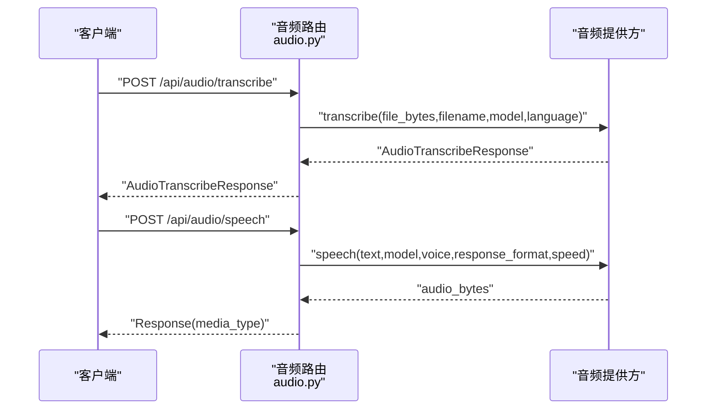

图表来源
- [apps/chat/api/routers/audio.py:20-66](file://apps/chat/api/routers/audio.py#L20-L66)

章节来源
- [apps/chat/api/routers/audio.py:20-66](file://apps/chat/api/routers/audio.py#L20-L66)

### 视频处理模块（/api/video）
- 功能职责
  - 提交视频生成任务、轮询任务状态、下载完成的视频文件
- 关键设计
  - 生成与状态查询委托给视频提供方
  - 下载接口返回 MP4 内容并设置合适的响应头
- 错误处理
  - 任务不存在：404
  - 提供方错误：502

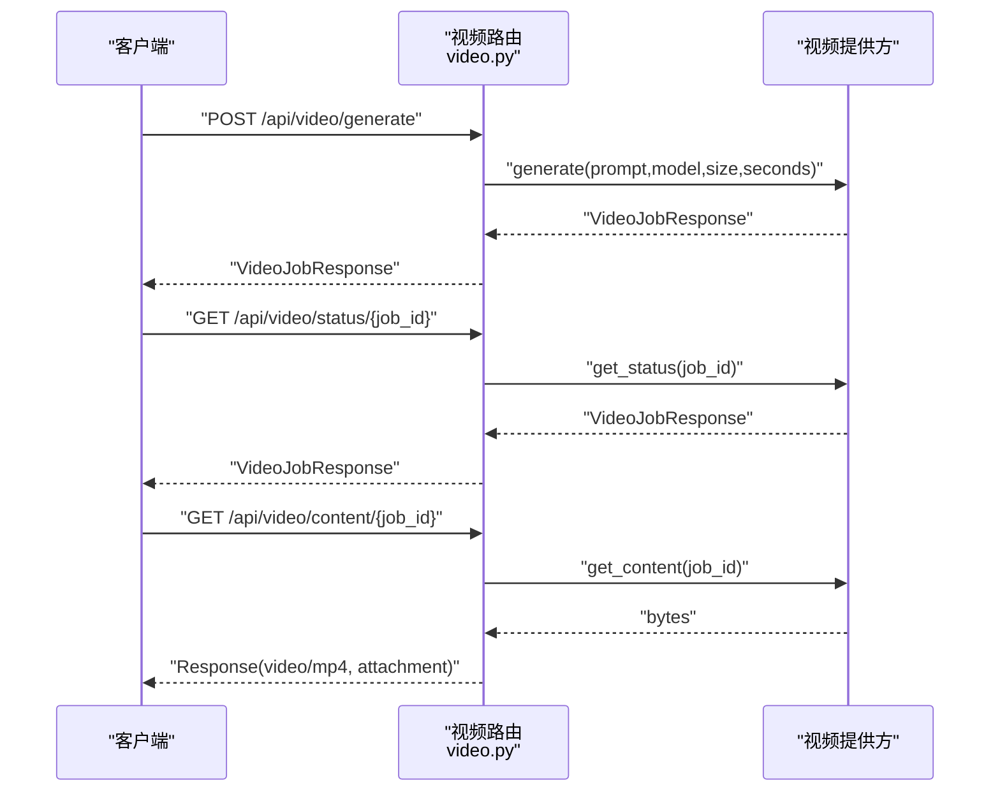

图表来源
- [apps/chat/api/routers/video.py:19-66](file://apps/chat/api/routers/video.py#L19-L66)

章节来源
- [apps/chat/api/routers/video.py:19-66](file://apps/chat/api/routers/video.py#L19-L66)

## 依赖关系分析
- 组件耦合
  - 路由层仅负责参数解析、鉴权与调用服务层，保持低耦合
  - 服务层通过提供方工厂选择具体实现（图片/音频/视频/聊天）
- 外部依赖
  - 网关健康检查、聊天流式与非流式调用
  - HTTP 客户端异常统一转换为 502
- 配置依赖
  - 所有提供方 URL 与密钥均可通过环境变量覆盖，优先级清晰

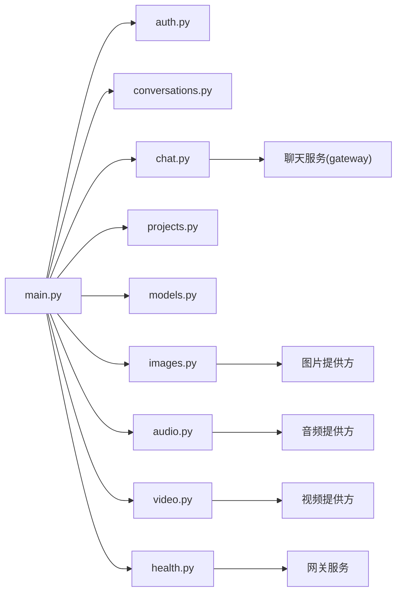

图表来源
- [apps/chat/api/main.py:62-71](file://apps/chat/api/main.py#L62-L71)
- [apps/chat/api/routers/chat.py:16](file://apps/chat/api/routers/chat.py#L16)
- [apps/chat/api/routers/images.py:12](file://apps/chat/api/routers/images.py#L12)
- [apps/chat/api/routers/audio.py:13](file://apps/chat/api/routers/audio.py#L13)
- [apps/chat/api/routers/video.py:12](file://apps/chat/api/routers/video.py#L12)
- [apps/chat/api/routers/health.py:7](file://apps/chat/api/routers/health.py#L7)

章节来源
- [apps/chat/api/main.py:62-71](file://apps/chat/api/main.py#L62-L71)

## 性能考量
- 连接池复用
  - 应用生命周期内启动/关闭提供方连接池，减少握手开销
- 流式传输
  - 聊天补全使用 SSE，降低端到端延迟，提升用户体验
- 附件处理
  - 对图片做本地 base64 预览，避免额外网络往返；限制单文件大小以控制内存占用
- 模型过滤
  - 通过允许列表与能力过滤减少前端渲染负担

## 故障排查指南
- 401 未认证
  - 检查 Authorization 头是否为 Bearer 令牌；确认鉴权模式配置
- 404 会话/项目不存在
  - 确认当前用户与资源所属一致；检查 conversation_id/project_id 是否正确
- 413 文件过大
  - 单文件大小超过限制；请压缩或拆分文件
- 502 网关/提供方错误
  - 检查网关连通性与提供方可用性；查看日志定位具体错误
- 404 视频内容不存在
  - 任务可能尚未完成或已过期；先查询状态再下载

章节来源
- [apps/chat/api/routers/auth.py:26-33](file://apps/chat/api/routers/auth.py#L26-L33)
- [apps/chat/api/routers/conversations.py:46-48](file://apps/chat/api/routers/conversations.py#L46-L48)
- [apps/chat/api/routers/chat.py:64-68](file://apps/chat/api/routers/chat.py#L64-L68)
- [apps/chat/api/routers/video.py:61-65](file://apps/chat/api/routers/video.py#L61-L65)

## 结论
本路由模块以清晰的分层设计实现了多模态聊天应用的核心能力：统一入口、鉴权、CORS、静态资源与多路提供方代理。通过 SSE 流式传输与严格的输入校验，既保证了良好的用户体验，也确保了系统的可维护性与可扩展性。建议后续在错误码标准化、日志分级与可观测性方面进一步完善。

## 附录：接口规范

### 通用约定
- 基础路径
  - 所有路由前缀为 /api（除聊天补全为绝对路径）
- 鉴权
  - 通过 Authorization: Bearer <token> 传递令牌；若启用简单鉴权且缺少或无效令牌将返回 401
- 响应格式
  - 成功响应遵循各端点定义的数据模型；错误响应遵循统一错误结构

章节来源
- [apps/chat/api/routers/auth.py:26-33](file://apps/chat/api/routers/auth.py#L26-L33)
- [apps/chat/api/models/schemas.py:243-245](file://apps/chat/api/models/schemas.py#L243-L245)

### 认证
- GET /api/auth/mode
  - 返回当前鉴权模式
- POST /api/auth/login
  - 请求体：LoginRequest
  - 成功：LoginResponse
  - 错误：400（name 为空）
- GET /api/auth/me
  - 成功：User
- POST /api/auth/logout
  - 从 Authorization 头提取令牌并注销

章节来源
- [apps/chat/api/routers/auth.py:15-42](file://apps/chat/api/routers/auth.py#L15-L42)
- [apps/chat/api/models/schemas.py:216-223](file://apps/chat/api/models/schemas.py#L216-L223)

### 健康检查
- GET /api/health
  - 成功：HealthResponse（包含状态、版本、网关可达性）

章节来源
- [apps/chat/api/routers/health.py:12-19](file://apps/chat/api/routers/health.py#L12-L19)
- [apps/chat/api/models/schemas.py:228-232](file://apps/chat/api/models/schemas.py#L228-L232)

### 模型发现
- GET /api/models?capability={text|image|audio|video}
  - 成功：ModelListResponse
  - 允许列表：支持全局与按能力的逗号分隔列表

章节来源
- [apps/chat/api/routers/models.py:92-127](file://apps/chat/api/routers/models.py#L92-L127)
- [apps/chat/api/models/schemas.py:161-170](file://apps/chat/api/models/schemas.py#L161-L170)

### 会话管理
- POST /api/conversations
  - 请求体：CreateConversationRequest
  - 成功：Conversation (201)
- GET /api/conversations
  - 成功：list[ConversationSummary]
- GET /api/conversations/{conversation_id}
  - 成功：Conversation
  - 错误：404（不存在或越权）
- PATCH /api/conversations/{conversation_id}
  - 请求体：UpdateTitleRequest
  - 成功：Conversation
- DELETE /api/conversations/{conversation_id}
  - 成功：204 No Content

章节来源
- [apps/chat/api/routers/conversations.py:23-73](file://apps/chat/api/routers/conversations.py#L23-L73)
- [apps/chat/api/models/schemas.py:49-71](file://apps/chat/api/models/schemas.py#L49-L71)

### 聊天补全
- POST /api/conversations/{conversation_id}/completions
  - 路径参数：conversation_id
  - 表单参数：
    - message: 字符串
    - model: 字符串
    - stream: 布尔，默认 true
    - temperature: 浮点数
    - max_tokens: 整数
    - system_prompt: 字符串（可选）
    - files: 上传文件数组（最多 20MB/个）
  - 成功：
    - 流式：SSE 事件流
    - 非流式：CompletionResponse
  - 错误：404（会话不存在或越权）、413（文件过大）、502（网关错误）

章节来源
- [apps/chat/api/routers/chat.py:40-199](file://apps/chat/api/routers/chat.py#L40-L199)
- [apps/chat/api/models/schemas.py:76-97](file://apps/chat/api/models/schemas.py#L76-L97)

### 项目管理
- POST /api/projects
  - 请求体：CreateProjectRequest
  - 成功：Project
- GET /api/projects
  - 成功：list[Project]
- GET /api/projects/{project_id}
  - 成功：Project
  - 错误：404（不存在或越权）
- PATCH /api/projects/{project_id}
  - 请求体：UpdateProjectRequest
  - 成功：Project
- DELETE /api/projects/{project_id}
  - 成功：{ok: true}

章节来源
- [apps/chat/api/routers/projects.py:14-71](file://apps/chat/api/routers/projects.py#L14-L71)
- [apps/chat/api/models/schemas.py:175-205](file://apps/chat/api/models/schemas.py#L175-L205)

### 图片处理
- POST /api/image/generate
  - 请求体：ImageGenerateRequest
  - 成功：ImageGenerateResponse
  - 错误：502（提供方错误）
- POST /api/image/edit
  - 表单参数：image（文件）、prompt、model、size、n
  - 成功：ImageGenerateResponse
  - 错误：502（提供方错误）

章节来源
- [apps/chat/api/routers/images.py:19-72](file://apps/chat/api/routers/images.py#L19-L72)
- [apps/chat/api/models/schemas.py:102-121](file://apps/chat/api/models/schemas.py#L102-L121)

### 音频处理
- POST /api/audio/transcribe
  - 表单参数：file（文件）、model、language
  - 成功：AudioTranscribeResponse
  - 错误：502（提供方错误）
- POST /api/audio/speech
  - 请求体：AudioSpeechRequest
  - 成功：二进制音频（媒体类型依据 response_format）

章节来源
- [apps/chat/api/routers/audio.py:20-66](file://apps/chat/api/routers/audio.py#L20-L66)
- [apps/chat/api/models/schemas.py:126-136](file://apps/chat/api/models/schemas.py#L126-L136)

### 视频处理
- POST /api/video/generate
  - 请求体：VideoGenerateRequest
  - 成功：VideoJobResponse
  - 错误：502（提供方错误）
- GET /api/video/status/{job_id}
  - 成功：VideoJobResponse
  - 错误：502（提供方错误）
- GET /api/video/content/{job_id}
  - 成功：MP4 文件（attachment）
  - 错误：404（任务不存在）、502（提供方错误）

章节来源
- [apps/chat/api/routers/video.py:19-66](file://apps/chat/api/routers/video.py#L19-L66)
- [apps/chat/api/models/schemas.py:141-156](file://apps/chat/api/models/schemas.py#L141-L156)