# FastAPI应用架构

<cite>
**本文档引用的文件**
- [apps/chat/api/main.py](file://apps/chat/api/main.py)
- [apps/chat/api/config.py](file://apps/chat/api/config.py)
- [apps/chat/api/requirements.txt](file://apps/chat/api/requirements.txt)
- [apps/chat/api/routers/chat.py](file://apps/chat/api/routers/chat.py)
- [apps/chat/api/routers/health.py](file://apps/chat/api/routers/health.py)
- [apps/chat/api/services/providers/__init__.py](file://apps/chat/api/services/providers/__init__.py)
- [apps/chat/api/services/providers/base.py](file://apps/chat/api/services/providers/base.py)
- [apps/chat/api/services/providers/openai.py](file://apps/chat/api/services/providers/openai.py)
- [apps/chat/api/services/gateway.py](file://apps/chat/api/services/gateway.py)
- [apps/chat/api/middleware/auth.py](file://apps/chat/api/middleware/auth.py)
- [apps/chat/api/models/schemas.py](file://apps/chat/api/models/schemas.py)
- [apps/chat/api/services/conversation.py](file://apps/chat/api/services/conversation.py)
</cite>

## 目录
1. [引言](#引言)
2. [项目结构](#项目结构)
3. [核心组件](#核心组件)
4. [架构总览](#架构总览)
5. [详细组件分析](#详细组件分析)
6. [依赖关系分析](#依赖关系分析)
7. [性能考虑](#性能考虑)
8. [故障排除指南](#故障排除指南)
9. [结论](#结论)

## 引言
本文件面向AIBrix聊天应用的FastAPI后端，系统性梳理其应用生命周期管理（lifespan钩子）、持久连接池初始化、CORS配置、路由注册机制、静态文件服务、配置管理与版本控制、以及启动流程中的依赖注入与优雅关闭等关键主题。文档同时提供代码级架构图与流程图，帮助读者快速理解从请求到响应的完整链路。

## 项目结构
AIBrix聊天应用采用典型的FastAPI分层组织：入口文件负责应用实例创建、中间件与路由注册；配置模块集中管理环境变量与默认值；路由模块定义API接口；服务层通过适配器模式对接不同模态（文本、图像、音频、视频）的外部服务；模型层使用Pydantic定义请求/响应数据结构；会话存储在内存中，便于演示与扩展。

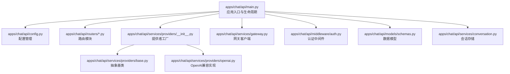

**图表来源**
- [apps/chat/api/main.py:1-87](file://apps/chat/api/main.py#L1-L87)
- [apps/chat/api/config.py:1-94](file://apps/chat/api/config.py#L1-L94)
- [apps/chat/api/services/providers/__init__.py:1-102](file://apps/chat/api/services/providers/__init__.py#L1-L102)
- [apps/chat/api/services/providers/base.py:1-138](file://apps/chat/api/services/providers/base.py#L1-L138)
- [apps/chat/api/services/providers/openai.py:1-496](file://apps/chat/api/services/providers/openai.py#L1-L496)
- [apps/chat/api/services/gateway.py:1-103](file://apps/chat/api/services/gateway.py#L1-L103)
- [apps/chat/api/middleware/auth.py:1-36](file://apps/chat/api/middleware/auth.py#L1-L36)
- [apps/chat/api/models/schemas.py:1-245](file://apps/chat/api/models/schemas.py#L1-L245)
- [apps/chat/api/services/conversation.py:1-124](file://apps/chat/api/services/conversation.py#L1-L124)

**章节来源**
- [apps/chat/api/main.py:1-87](file://apps/chat/api/main.py#L1-L87)
- [apps/chat/api/config.py:1-94](file://apps/chat/api/config.py#L1-L94)

## 核心组件
- 应用生命周期与持久连接池
  - 使用FastAPI lifespan钩子在应用启动时初始化各模态提供者的持久连接池，并在关闭时释放资源。
  - 提供者通过单例缓存复用，避免重复创建连接池，提升性能并减少资源消耗。
- CORS配置
  - 基于配置项动态设置允许的源、方法与头部，支持凭据传递。
- 路由注册
  - 动态导入并注册认证、健康检查、模型列表、会话、聊天、项目、图片、音频、视频等路由。
- 静态文件服务
  - 将构建后的前端静态资源挂载为静态目录，并提供SPA回退逻辑，确保前端路由正常工作。
- 配置管理与版本控制
  - 使用Pydantic Settings集中管理环境变量，提供默认值与URL/密钥覆盖策略；应用版本在FastAPI构造函数中注入。
- 启动流程
  - 依赖注入：认证中间件依赖配置与用户存储；聊天路由依赖会话存储与网关服务；网关服务依赖提供者工厂。
  - 优雅关闭：lifespan在yield之后执行shutdown，确保连接池正确释放。

**章节来源**
- [apps/chat/api/main.py:21-35](file://apps/chat/api/main.py#L21-L35)
- [apps/chat/api/main.py:52-61](file://apps/chat/api/main.py#L52-L61)
- [apps/chat/api/main.py:62-71](file://apps/chat/api/main.py#L62-L71)
- [apps/chat/api/main.py:73-87](file://apps/chat/api/main.py#L73-L87)
- [apps/chat/api/config.py:4-54](file://apps/chat/api/config.py#L4-L54)
- [apps/chat/api/config.py:56-92](file://apps/chat/api/config.py#L56-L92)

## 架构总览
下图展示了从客户端请求到外部服务调用的整体架构，包括认证、路由、会话管理、网关与提供者适配器之间的交互。

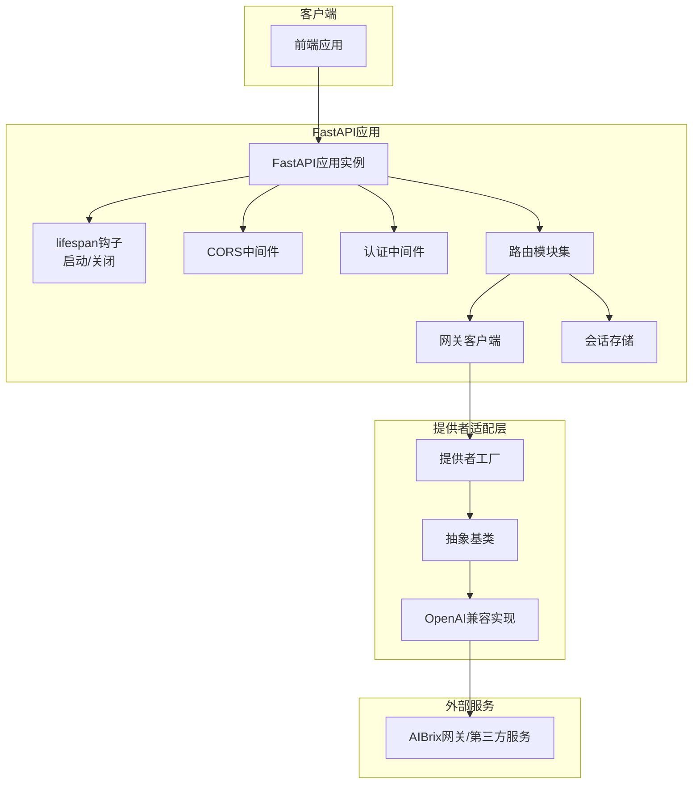

**图表来源**
- [apps/chat/api/main.py:21-35](file://apps/chat/api/main.py#L21-L35)
- [apps/chat/api/main.py:52-61](file://apps/chat/api/main.py#L52-L61)
- [apps/chat/api/middleware/auth.py:17-36](file://apps/chat/api/middleware/auth.py#L17-L36)
- [apps/chat/api/services/gateway.py:70-103](file://apps/chat/api/services/gateway.py#L70-L103)
- [apps/chat/api/services/providers/__init__.py:50-102](file://apps/chat/api/services/providers/__init__.py#L50-L102)
- [apps/chat/api/services/providers/base.py:10-138](file://apps/chat/api/services/providers/base.py#L10-L138)
- [apps/chat/api/services/providers/openai.py:61-496](file://apps/chat/api/services/providers/openai.py#L61-L496)

## 详细组件分析

### 生命周期管理与持久连接池
- 启动阶段
  - 在lifespan中按顺序启动聊天、图片、音频、视频提供者，调用其startup以初始化连接池。
- 关闭阶段
  - 在yield之后依次调用shutdown释放连接池，确保资源回收。
- 性能与可靠性
  - 单例缓存避免重复创建连接池；提供者内部使用httpx异步客户端，具备连接池与超时配置。

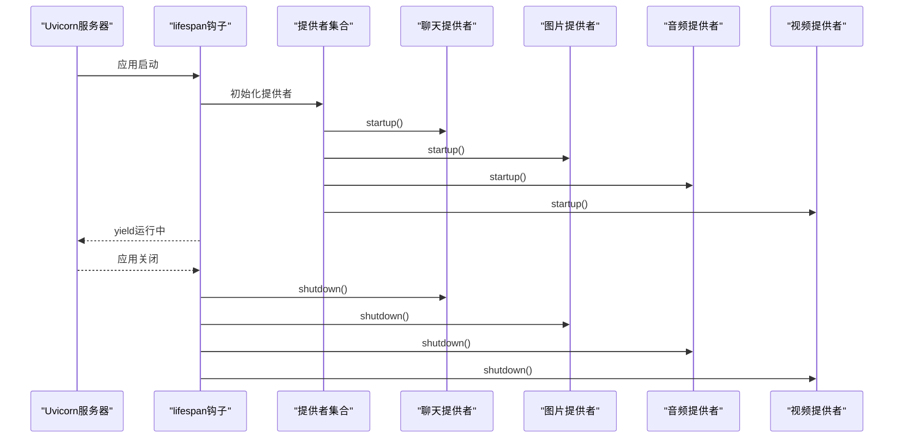

**图表来源**
- [apps/chat/api/main.py:21-35](file://apps/chat/api/main.py#L21-L35)
- [apps/chat/api/services/providers/__init__.py:46-102](file://apps/chat/api/services/providers/__init__.py#L46-L102)
- [apps/chat/api/services/providers/base.py:13-17](file://apps/chat/api/services/providers/base.py#L13-L17)

**章节来源**
- [apps/chat/api/main.py:21-35](file://apps/chat/api/main.py#L21-L35)
- [apps/chat/api/services/providers/__init__.py:46-102](file://apps/chat/api/services/providers/__init__.py#L46-L102)
- [apps/chat/api/services/providers/base.py:13-17](file://apps/chat/api/services/providers/base.py#L13-L17)

### CORS配置与静态文件服务
- CORS
  - 从配置读取允许的源列表，设置允许的方法与头部，并允许携带凭据。
- 静态文件
  - 若存在静态资源目录，则挂载assets目录；所有非API路径回退到index.html，支持前端SPA路由。

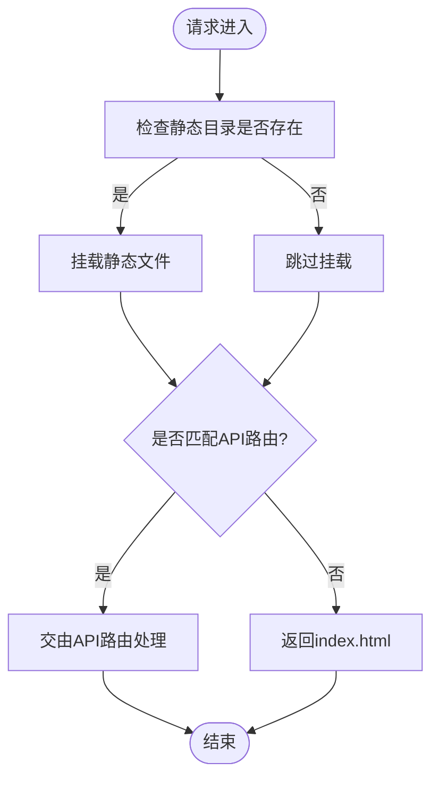

**图表来源**
- [apps/chat/api/main.py:73-87](file://apps/chat/api/main.py#L73-L87)

**章节来源**
- [apps/chat/api/main.py:52-61](file://apps/chat/api/main.py#L52-L61)
- [apps/chat/api/main.py:73-87](file://apps/chat/api/main.py#L73-L87)

### 路由注册机制
- 认证路由：处理登录与用户信息。
- 健康检查路由：检查网关可达性。
- 模型路由：列出可用模型。
- 会话路由：管理对话历史。
- 聊天路由：核心SSE流式生成。
- 项目路由：项目信息管理。
- 媒体路由：图片、音频、视频相关接口。

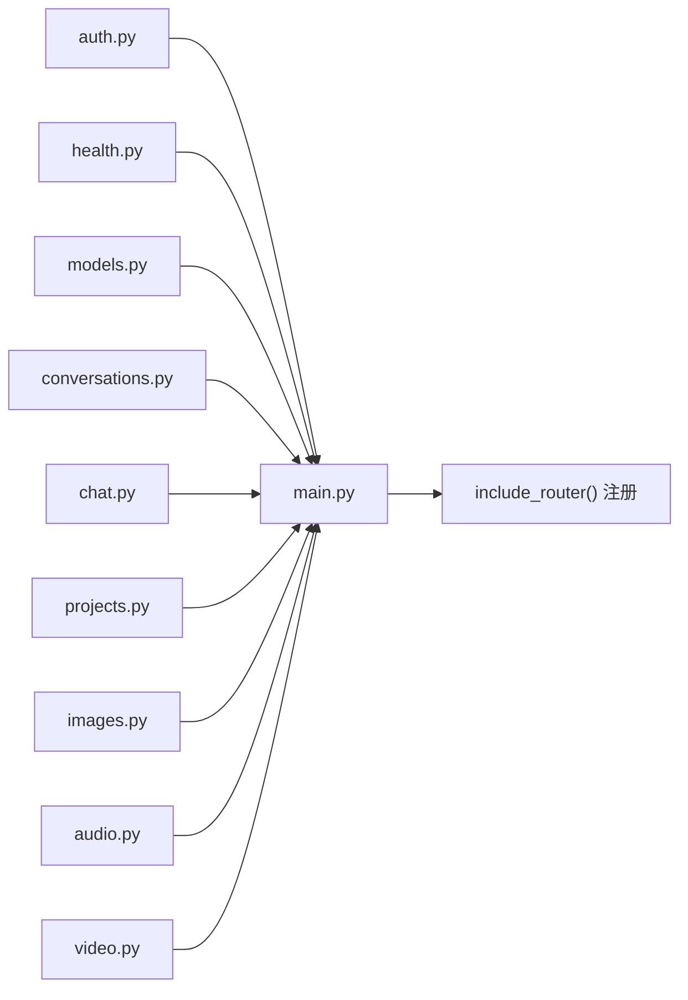

**图表来源**
- [apps/chat/api/main.py:62-71](file://apps/chat/api/main.py#L62-L71)

**章节来源**
- [apps/chat/api/main.py:62-71](file://apps/chat/api/main.py#L62-L71)

### 配置管理与版本控制
- 环境变量处理
  - 使用Pydantic Settings加载配置，支持前缀、大小写不敏感等行为。
  - 提供统一的URL与API Key获取方法，支持按能力维度覆盖。
- 版本控制
  - 应用版本在FastAPI构造函数中注入，用于文档与健康检查响应。
- 文档配置
  - Swagger UI、ReDoc与OpenAPI JSON路径在FastAPI构造函数中指定。

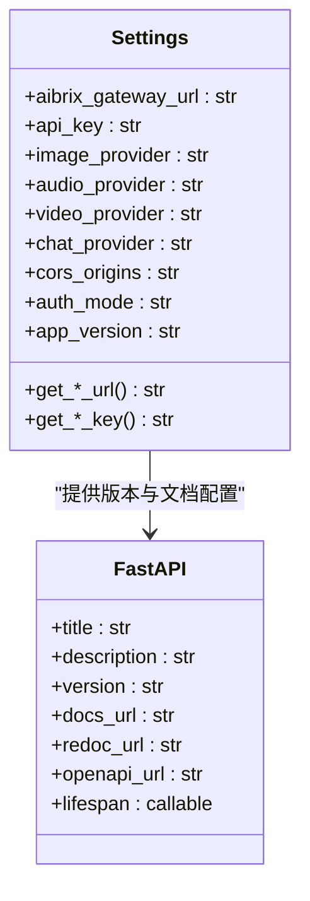

**图表来源**
- [apps/chat/api/config.py:4-94](file://apps/chat/api/config.py#L4-L94)
- [apps/chat/api/main.py:37-50](file://apps/chat/api/main.py#L37-L50)

**章节来源**
- [apps/chat/api/config.py:4-94](file://apps/chat/api/config.py#L4-L94)
- [apps/chat/api/main.py:37-50](file://apps/chat/api/main.py#L37-L50)

### 聊天路由与SSE流式响应
- 请求处理
  - 校验会话归属；解析上传文件并生成附件元数据；根据项目指令或显式参数决定系统提示词；构建OpenAI格式的消息历史。
- 流式与非流式
  - 流式：通过EventSourceResponse逐条推送事件；非流式：等待完整响应后封装为JSON。
- 错误处理
  - 捕获HTTP错误并返回标准化错误事件；最终保存助手消息并自动设置标题。

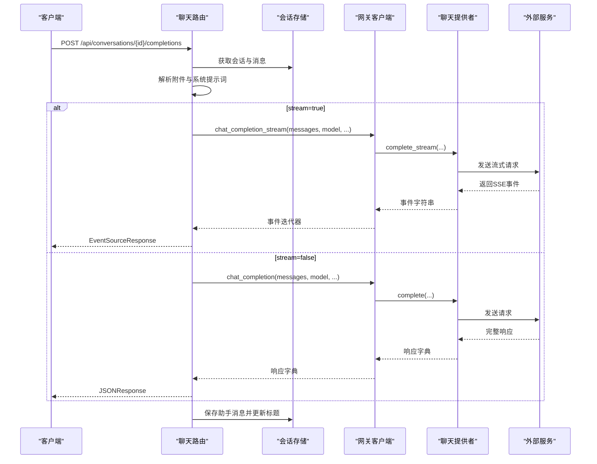

**图表来源**
- [apps/chat/api/routers/chat.py:40-199](file://apps/chat/api/routers/chat.py#L40-L199)
- [apps/chat/api/services/gateway.py:70-103](file://apps/chat/api/services/gateway.py#L70-L103)
- [apps/chat/api/services/providers/openai.py:118-152](file://apps/chat/api/services/providers/openai.py#L118-L152)

**章节来源**
- [apps/chat/api/routers/chat.py:40-199](file://apps/chat/api/routers/chat.py#L40-L199)
- [apps/chat/api/services/gateway.py:70-103](file://apps/chat/api/services/gateway.py#L70-L103)
- [apps/chat/api/services/providers/openai.py:118-152](file://apps/chat/api/services/providers/openai.py#L118-L152)

### 提供者适配器与连接池
- 抽象基类
  - 定义聊天、图片、音频、视频四类提供者的统一接口，包含startup/shutdown生命周期钩子。
- 工厂与注册表
  - 依据配置选择具体实现（如OpenAI或VLLM Omnilogue），并缓存实例以复用连接池。
- OpenAI兼容实现
  - 内部使用httpx.AsyncClient，配置超时与连接池限制；对SSE进行解析；支持多模态API。

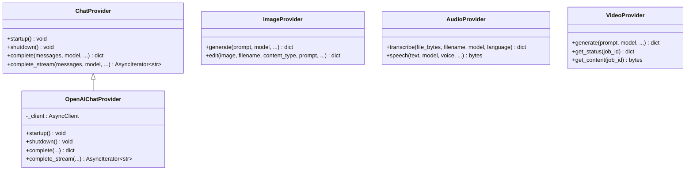

**图表来源**
- [apps/chat/api/services/providers/base.py:10-138](file://apps/chat/api/services/providers/base.py#L10-L138)
- [apps/chat/api/services/providers/openai.py:61-152](file://apps/chat/api/services/providers/openai.py#L61-L152)

**章节来源**
- [apps/chat/api/services/providers/base.py:10-138](file://apps/chat/api/services/providers/base.py#L10-L138)
- [apps/chat/api/services/providers/openai.py:61-152](file://apps/chat/api/services/providers/openai.py#L61-L152)

### 认证中间件与用户解析
- 认证模式
  - 支持“无认证”与“简单认证”两种模式；无认证时返回默认用户。
- Token校验
  - 从Authorization头提取Bearer Token并在用户存储中查找对应用户；未找到则抛出401。

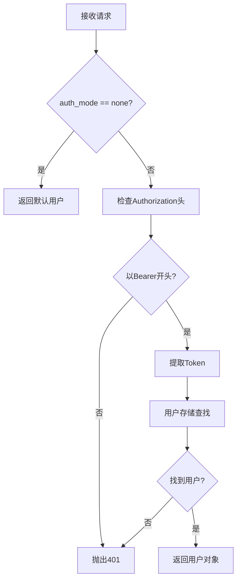

**图表来源**
- [apps/chat/api/middleware/auth.py:17-36](file://apps/chat/api/middleware/auth.py#L17-L36)

**章节来源**
- [apps/chat/api/middleware/auth.py:17-36](file://apps/chat/api/middleware/auth.py#L17-L36)

### 健康检查与模型列表
- 健康检查
  - 通过网关客户端访问模型列表接口，判断网关可达性。
- 模型列表
  - 缓存60秒，避免频繁查询；失败时降级返回旧缓存。

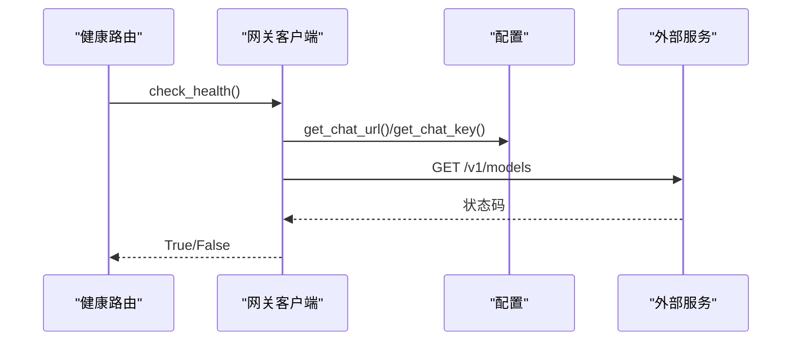

**图表来源**
- [apps/chat/api/routers/health.py:12-20](file://apps/chat/api/routers/health.py#L12-L20)
- [apps/chat/api/services/gateway.py:31-42](file://apps/chat/api/services/gateway.py#L31-L42)

**章节来源**
- [apps/chat/api/routers/health.py:12-20](file://apps/chat/api/routers/health.py#L12-L20)
- [apps/chat/api/services/gateway.py:31-42](file://apps/chat/api/services/gateway.py#L31-L42)

## 依赖关系分析
- 运行时依赖
  - FastAPI、Uvicorn、httpx、sse-starlette、pydantic、pydantic-settings、python-multipart。
- 组件耦合
  - 路由依赖会话存储与网关客户端；网关客户端依赖提供者工厂；提供者工厂依赖配置与具体实现；认证中间件依赖配置与用户存储。
- 外部集成点
  - AIBrix网关或其他OpenAI兼容服务；前端静态资源目录。

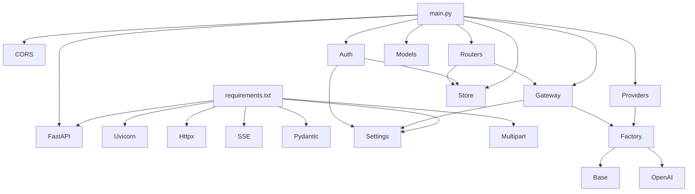

**图表来源**
- [apps/chat/api/requirements.txt:1-8](file://apps/chat/api/requirements.txt#L1-L8)
- [apps/chat/api/main.py:11-18](file://apps/chat/api/main.py#L11-L18)
- [apps/chat/api/services/providers/__init__.py:7-25](file://apps/chat/api/services/providers/__init__.py#L7-L25)
- [apps/chat/api/services/gateway.py:14-15](file://apps/chat/api/services/gateway.py#L14-L15)
- [apps/chat/api/middleware/auth.py:7-9](file://apps/chat/api/middleware/auth.py#L7-L9)

**章节来源**
- [apps/chat/api/requirements.txt:1-8](file://apps/chat/api/requirements.txt#L1-L8)
- [apps/chat/api/main.py:11-18](file://apps/chat/api/main.py#L11-L18)

## 性能考虑
- 连接池与超时
  - 提供者内部使用httpx.AsyncClient并配置连接池上限与超时，减少连接建立开销并提升并发稳定性。
- 缓存策略
  - 模型列表缓存60秒，降低对外部服务的压力；健康检查短超时，快速失败。
- SSE解析
  - 使用标准SSE解析工具，保证事件流的可靠传输。
- 文件上传
  - 对上传文件大小进行限制，防止过大文件导致内存压力。

[本节为通用性能建议，无需特定文件引用]

## 故障排除指南
- CORS相关问题
  - 检查配置中的允许源是否包含前端地址；确认允许方法与头部包含实际请求所需项。
- 认证失败
  - 确认Authorization头格式为Bearer Token；核对用户存储中是否存在该Token对应的用户。
- 网关不可达
  - 使用健康检查接口验证；检查AIBrix网关URL与API Key配置；查看网络连通性。
- SSE流中断
  - 查看日志中SSE事件解析与异常处理分支；确认外部服务支持SSE且未提前断开连接。
- 静态资源无法加载
  - 确认静态目录存在且assets已挂载；检查SPA回退逻辑是否正确返回index.html。

**章节来源**
- [apps/chat/api/main.py:52-61](file://apps/chat/api/main.py#L52-L61)
- [apps/chat/api/middleware/auth.py:26-35](file://apps/chat/api/middleware/auth.py#L26-L35)
- [apps/chat/api/services/gateway.py:31-42](file://apps/chat/api/services/gateway.py#L31-L42)
- [apps/chat/api/routers/chat.py:149-152](file://apps/chat/api/routers/chat.py#L149-L152)
- [apps/chat/api/main.py:73-87](file://apps/chat/api/main.py#L73-L87)

## 结论
AIBrix聊天应用的FastAPI架构通过清晰的分层设计与适配器模式，实现了跨模态服务的统一接入与可扩展性。lifespan钩子确保了连接池的高效复用与优雅关闭；CORS与静态文件服务提升了跨域与前端集成体验；配置管理与版本控制保障了部署灵活性与可观测性。整体架构既满足开发期的快速迭代，也为生产环境的稳定运行提供了坚实基础。