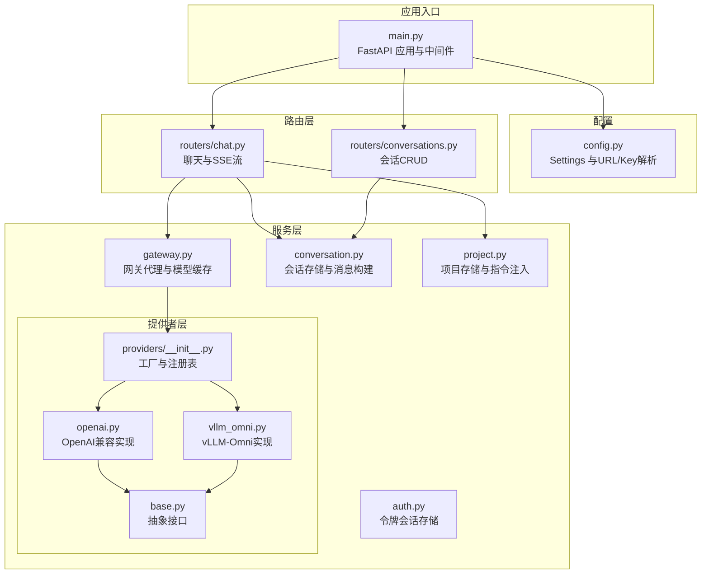
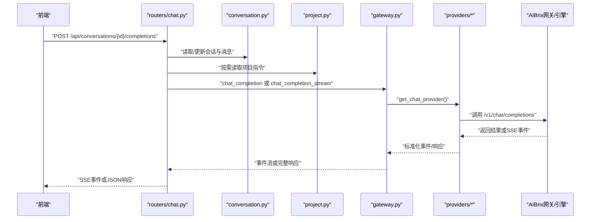
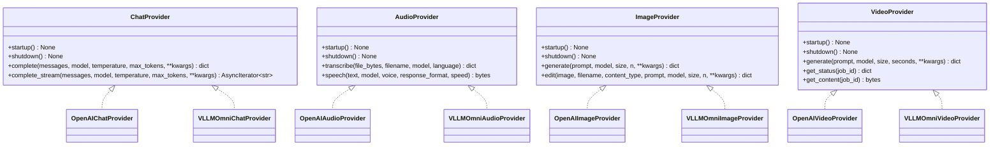
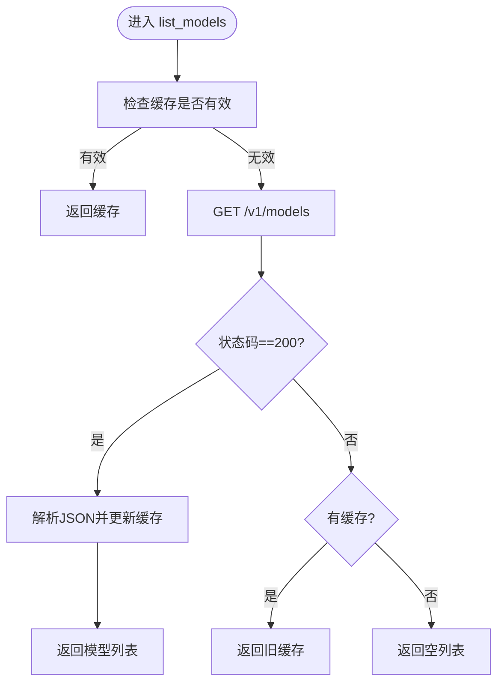
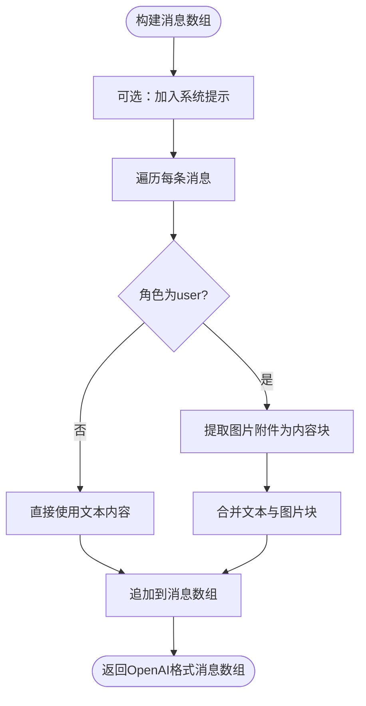
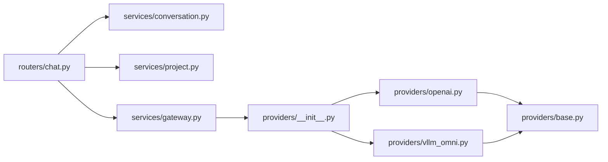

# 业务服务层

<cite>
**本文引用的文件**
- [apps/chat/api/main.py](file://apps/chat/api/main.py)
- [apps/chat/api/config.py](file://apps/chat/api/config.py)
- [apps/chat/api/services/providers/base.py](file://apps/chat/api/services/providers/base.py)
- [apps/chat/api/services/providers/openai.py](file://apps/chat/api/services/providers/openai.py)
- [apps/chat/api/services/providers/vllm_omni.py](file://apps/chat/api/services/providers/vllm_omni.py)
- [apps/chat/api/services/providers/__init__.py](file://apps/chat/api/services/providers/__init__.py)
- [apps/chat/api/services/gateway.py](file://apps/chat/api/services/gateway.py)
- [apps/chat/api/services/conversation.py](file://apps/chat/api/services/conversation.py)
- [apps/chat/api/services/project.py](file://apps/chat/api/services/project.py)
- [apps/chat/api/services/auth.py](file://apps/chat/api/services/auth.py)
- [apps/chat/api/routers/chat.py](file://apps/chat/api/routers/chat.py)
- [apps/chat/api/routers/conversations.py](file://apps/chat/api/routers/conversations.py)
</cite>

## 目录
1. [引言](#引言)
2. [项目结构](#项目结构)
3. [核心组件](#核心组件)
4. [架构总览](#架构总览)
5. [详细组件分析](#详细组件分析)
6. [依赖分析](#依赖分析)
7. [性能考虑](#性能考虑)
8. [故障排查指南](#故障排查指南)
9. [结论](#结论)
10. [附录：服务调用示例与最佳实践](#附录服务调用示例与最佳实践)

## 引言
本文件面向AIBrix聊天应用的业务服务层，系统性梳理其设计模式与架构原则，重点覆盖以下方面：
- 会话管理服务：对话历史构建、消息持久化与自动标题生成
- 网关代理服务：对上游AIBrix网关的健康检查、模型列表缓存与聊天补全代理
- 认证服务：基于令牌的简单用户会话存储
- 项目管理服务：项目级指令注入到会话上下文
- 提供者模式实现：统一抽象接口与多实现（OpenAI兼容、vLLM-Omni）的工厂注册与连接池复用

目标是帮助开发者快速理解服务层职责边界、数据流与异常处理策略，并给出可操作的最佳实践。

## 项目结构
业务服务层位于聊天应用后端（FastAPI），核心目录与文件如下：
- 应用入口与生命周期：apps/chat/api/main.py
- 配置中心：apps/chat/api/config.py
- 服务层：
  - 提供者抽象与实现：services/providers/base.py、openai.py、vllm_omni.py、providers/__init__.py
  - 网关代理：services/gateway.py
  - 会话与项目：services/conversation.py、services/project.py
  - 认证：services/auth.py
- 路由层（调用服务层）：routers/chat.py、routers/conversations.py

图表来源
- [apps/chat/api/main.py:1-87](file://apps/chat/api/main.py#L1-L87)
- [apps/chat/api/config.py:1-94](file://apps/chat/api/config.py#L1-L94)
- [apps/chat/api/services/gateway.py:1-103](file://apps/chat/api/services/gateway.py#L1-L103)
- [apps/chat/api/services/conversation.py:1-124](file://apps/chat/api/services/conversation.py#L1-L124)
- [apps/chat/api/services/project.py:1-87](file://apps/chat/api/services/project.py#L1-L87)
- [apps/chat/api/services/auth.py:1-38](file://apps/chat/api/services/auth.py#L1-L38)
- [apps/chat/api/services/providers/base.py:1-138](file://apps/chat/api/services/providers/base.py#L1-L138)
- [apps/chat/api/services/providers/openai.py:1-496](file://apps/chat/api/services/providers/openai.py#L1-L496)
- [apps/chat/api/services/providers/vllm_omni.py:1-602](file://apps/chat/api/services/providers/vllm_omni.py#L1-L602)
- [apps/chat/api/services/providers/__init__.py:1-102](file://apps/chat/api/services/providers/__init__.py#L1-L102)
- [apps/chat/api/routers/chat.py:1-199](file://apps/chat/api/routers/chat.py#L1-L199)
- [apps/chat/api/routers/conversations.py:1-73](file://apps/chat/api/routers/conversations.py#L1-L73)

章节来源
- [apps/chat/api/main.py:1-87](file://apps/chat/api/main.py#L1-L87)
- [apps/chat/api/config.py:1-94](file://apps/chat/api/config.py#L1-L94)

## 核心组件
- 抽象提供者接口：定义聊天、图像、音频、视频四类能力的统一接口，支持启动/关闭生命周期钩子与非流式/流式调用约定
- 提供者实现：
  - OpenAI兼容：覆盖聊天、图像、音频、视频的OpenAI风格API
  - vLLM-Omni：针对多模态引擎差异的适配（如图像通过聊天接口返回base64、TTS增加语言字段、视频同步生成）
- 工厂与注册表：按模态与实现名称选择具体提供者，支持连接池复用
- 网关代理：封装对上游网关的健康检查、模型列表缓存与聊天补全转发
- 会话管理：内存中保存对话历史，构建OpenAI格式的消息数组，支持图片附件拼接
- 项目管理：示例项目与指令，用于在会话中注入系统提示
- 认证：简单令牌会话存储，支持登录/查询/登出

章节来源
- [apps/chat/api/services/providers/base.py:1-138](file://apps/chat/api/services/providers/base.py#L1-L138)
- [apps/chat/api/services/providers/openai.py:1-496](file://apps/chat/api/services/providers/openai.py#L1-L496)
- [apps/chat/api/services/providers/vllm_omni.py:1-602](file://apps/chat/api/services/providers/vllm_omni.py#L1-L602)
- [apps/chat/api/services/providers/__init__.py:1-102](file://apps/chat/api/services/providers/__init__.py#L1-L102)
- [apps/chat/api/services/gateway.py:1-103](file://apps/chat/api/services/gateway.py#L1-L103)
- [apps/chat/api/services/conversation.py:1-124](file://apps/chat/api/services/conversation.py#L1-L124)
- [apps/chat/api/services/project.py:1-87](file://apps/chat/api/services/project.py#L1-L87)
- [apps/chat/api/services/auth.py:1-38](file://apps/chat/api/services/auth.py#L1-L38)

## 架构总览
服务层采用“提供者模式 + 工厂注册 + 路由调用”的分层设计：
- 路由层负责请求解析、鉴权与参数校验，调用服务层
- 服务层内部通过工厂获取具体提供者实例，完成对外部引擎的调用
- 网关代理作为上游访问门面，提供健康检查与模型列表缓存
- 会话与项目服务为业务状态提供内存存储，支撑消息构建与系统提示注入

图表来源
- [apps/chat/api/routers/chat.py:40-199](file://apps/chat/api/routers/chat.py#L40-L199)
- [apps/chat/api/services/conversation.py:106-119](file://apps/chat/api/services/conversation.py#L106-L119)
- [apps/chat/api/services/project.py:96-102](file://apps/chat/api/services/project.py#L96-L102)
- [apps/chat/api/services/gateway.py:70-103](file://apps/chat/api/services/gateway.py#L70-L103)
- [apps/chat/api/services/providers/__init__.py:50-59](file://apps/chat/api/services/providers/__init__.py#L50-L59)

## 详细组件分析

### 提供者模式与工厂注册
- 抽象接口：定义ChatProvider/AudioProvider/ImageProvider/VideoProvider四类接口，统一startup/shutdown与同步/流式方法
- 实现差异：
  - OpenAI兼容：遵循OpenAI标准端点与参数，流式通过SSE解析
  - vLLM-Omni：图像通过聊天接口返回base64；TTS增加language字段；视频同步生成并缓存结果
- 工厂注册：按模态与实现名映射到具体类，支持连接池复用与URL/Key注入

图表来源
- [apps/chat/api/services/providers/base.py:10-138](file://apps/chat/api/services/providers/base.py#L10-L138)
- [apps/chat/api/services/providers/openai.py:61-496](file://apps/chat/api/services/providers/openai.py#L61-L496)
- [apps/chat/api/services/providers/vllm_omni.py:60-602](file://apps/chat/api/services/providers/vllm_omni.py#L60-L602)

章节来源
- [apps/chat/api/services/providers/base.py:1-138](file://apps/chat/api/services/providers/base.py#L1-L138)
- [apps/chat/api/services/providers/openai.py:1-496](file://apps/chat/api/services/providers/openai.py#L1-L496)
- [apps/chat/api/services/providers/vllm_omni.py:1-602](file://apps/chat/api/services/providers/vllm_omni.py#L1-L602)
- [apps/chat/api/services/providers/__init__.py:1-102](file://apps/chat/api/services/providers/__init__.py#L1-L102)

### 网关代理服务
- 健康检查：访问上游模型端点，快速判断可达性
- 模型列表缓存：60秒TTL，失败时优雅降级返回旧缓存
- 聊天补全代理：根据配置选择提供者，转发消息与参数，返回标准化结果或SSE事件流

图表来源
- [apps/chat/api/services/gateway.py:44-68](file://apps/chat/api/services/gateway.py#L44-L68)

章节来源
- [apps/chat/api/services/gateway.py:1-103](file://apps/chat/api/services/gateway.py#L1-L103)

### 会话管理服务
- 存储：内存字典，键为会话ID，值为会话对象
- 消息构建：将用户消息与附件转换为OpenAI格式内容块（文本+图片URL），支持系统提示前置
- 自动标题：首次用户消息触发标题推断与更新
- 权限控制：路由层确保仅会话所有者可读写

图表来源
- [apps/chat/api/services/conversation.py:106-119](file://apps/chat/api/services/conversation.py#L106-L119)

章节来源
- [apps/chat/api/services/conversation.py:1-124](file://apps/chat/api/services/conversation.py#L1-L124)
- [apps/chat/api/routers/conversations.py:1-73](file://apps/chat/api/routers/conversations.py#L1-L73)

### 项目管理服务
- 示例种子：初始化两个示例项目，包含简要说明与系统提示
- 指令注入：当会话未显式提供系统提示时，从项目指令中继承
- 更新与删除：支持按字段更新与删除操作

章节来源
- [apps/chat/api/services/project.py:1-87](file://apps/chat/api/services/project.py#L1-L87)
- [apps/chat/api/routers/chat.py:96-103](file://apps/chat/api/routers/chat.py#L96-L103)

### 认证服务
- 简单令牌会话：用户名去空白后创建用户，生成UUID作为令牌，内存映射令牌到用户
- 登录/查询/登出：提供基本的会话生命周期管理

章节来源
- [apps/chat/api/services/auth.py:1-38](file://apps/chat/api/services/auth.py#L1-L38)
- [apps/chat/api/routers/chat.py:14](file://apps/chat/api/routers/chat.py#L14-L14)

## 依赖分析
- 组件耦合
  - 路由层仅依赖服务层接口，不关心具体提供者实现，降低耦合
  - 提供者层依赖抽象接口，便于扩展新引擎
  - 网关代理依赖工厂函数获取提供者，避免硬编码
- 外部依赖
  - HTTP客户端：httpx异步客户端用于上游调用
  - SSE：sse_starlette用于事件流
  - 图像处理：Pillow用于图像编辑前的格式转换
- 循环依赖
  - 未发现循环导入；路由层通过模块导入服务层，服务层通过工厂间接依赖配置

图表来源
- [apps/chat/api/routers/chat.py:14-18](file://apps/chat/api/routers/chat.py#L14-L18)
- [apps/chat/api/services/gateway.py:15](file://apps/chat/api/services/gateway.py#L15-L15)
- [apps/chat/api/services/providers/__init__.py:7-25](file://apps/chat/api/services/providers/__init__.py#L7-L25)

章节来源
- [apps/chat/api/routers/chat.py:1-199](file://apps/chat/api/routers/chat.py#L1-L199)
- [apps/chat/api/services/providers/__init__.py:1-102](file://apps/chat/api/services/providers/__init__.py#L1-L102)

## 性能考虑
- 连接池复用：提供者在startup阶段创建异步HTTP客户端，全局复用以减少连接开销
- 流式传输：SSE事件逐段推送，降低端到端延迟
- 缓存策略：模型列表60秒TTL，提升冷启动与网络抖动下的稳定性
- 资源释放：应用生命周期内统一调用provider的shutdown关闭连接
- 图像处理：vLLM-Omni图像编辑路径对非透明图进行必要转换，避免引擎不兼容

章节来源
- [apps/chat/api/services/providers/openai.py:74-80](file://apps/chat/api/services/providers/openai.py#L74-L80)
- [apps/chat/api/services/providers/vllm_omni.py:494-501](file://apps/chat/api/services/providers/vllm_omni.py#L494-L501)
- [apps/chat/api/services/gateway.py:17-20](file://apps/chat/api/services/gateway.py#L17-L20)
- [apps/chat/api/main.py:21-35](file://apps/chat/api/main.py#L21-L35)

## 故障排查指南
- 网关不可达
  - 现象：健康检查失败、模型列表为空
  - 排查：确认AIBRIX_GATEWAY_URL与API密钥配置；检查网络连通性
- 提供者调用错误
  - 现象：HTTP错误、SSE中断、响应体异常
  - 排查：查看日志中的请求/响应摘要；确认模型名称与参数；检查提供者实现差异（如TTS语言字段）
- 会话与权限问题
  - 现象：404未找到会话、标题未更新
  - 排查：确认当前用户令牌与会话归属；检查路由鉴权依赖
- 视频生成异常
  - 现象：vLLM-Omni视频同步生成失败
  - 排查：检查参数（尺寸、帧率、推理步数等）；查看缓存命中与错误信息

章节来源
- [apps/chat/api/services/gateway.py:31-42](file://apps/chat/api/services/gateway.py#L31-L42)
- [apps/chat/api/services/providers/openai.py:108-116](file://apps/chat/api/services/providers/openai.py#L108-L116)
- [apps/chat/api/services/providers/vllm_omni.py:565-574](file://apps/chat/api/services/providers/vllm_omni.py#L565-L574)
- [apps/chat/api/routers/chat.py:58-60](file://apps/chat/api/routers/chat.py#L58-L60)
- [apps/chat/api/routers/chat.py:149-152](file://apps/chat/api/routers/chat.py#L149-L152)

## 结论
该服务层通过提供者模式实现了对多引擎的统一抽象与灵活切换，结合工厂注册与连接池复用，既保证了扩展性又兼顾性能。路由层专注于业务编排，服务层专注能力实现，形成清晰的职责边界。建议后续在生产环境引入持久化存储、更细粒度的超时与重试策略、以及更完善的监控与追踪。

## 附录：服务调用示例与最佳实践
- 启动与关闭
  - 在应用生命周期中调用各提供者的startup/shutdown，确保连接池正确初始化与释放
- 配置优先级
  - 全局网关URL/Key可被各模态独立覆盖；优先使用per-service配置
- 聊天补全（非流式）
  - 路由层接收最新用户消息，服务层构建完整消息数组，网关代理转发至提供者
- 聊天补全（流式）
  - 使用SSE事件流逐段推送，收集到的内容在流结束后写入会话
- 图像编辑
  - vLLM-Omni路径对非透明图自动转换并生成遮罩；OpenAI路径走multipart上传
- 视频生成
  - vLLM-Omni视频为同步生成，内部缓存结果以支持状态查询与内容下载
- 最佳实践
  - 明确区分“系统提示”与“用户输入”，避免重复或冲突
  - 控制单次请求文件大小，防止上游限制触发
  - 对外部HTTP调用设置合理超时与重试，结合本地缓存提升可用性

章节来源
- [apps/chat/api/main.py:21-35](file://apps/chat/api/main.py#L21-L35)
- [apps/chat/api/config.py:56-91](file://apps/chat/api/config.py#L56-L91)
- [apps/chat/api/routers/chat.py:40-199](file://apps/chat/api/routers/chat.py#L40-L199)
- [apps/chat/api/services/gateway.py:70-103](file://apps/chat/api/services/gateway.py#L70-L103)
- [apps/chat/api/services/providers/openai.py:242-291](file://apps/chat/api/services/providers/openai.py#L242-L291)
- [apps/chat/api/services/providers/vllm_omni.py:508-576](file://apps/chat/api/services/providers/vllm_omni.py#L508-L576)