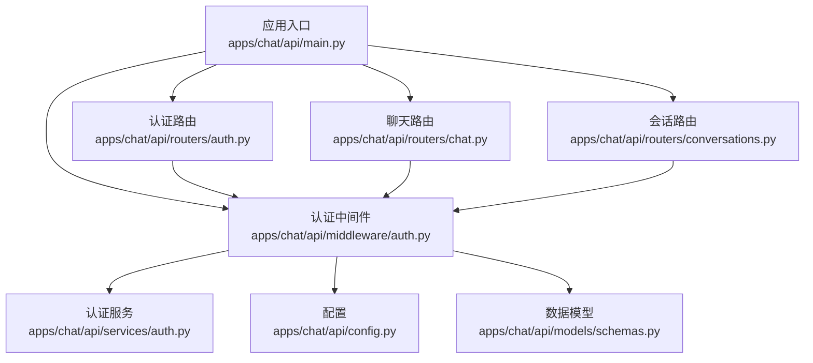
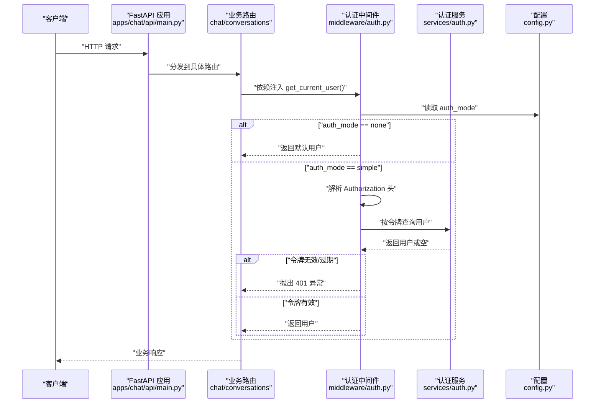
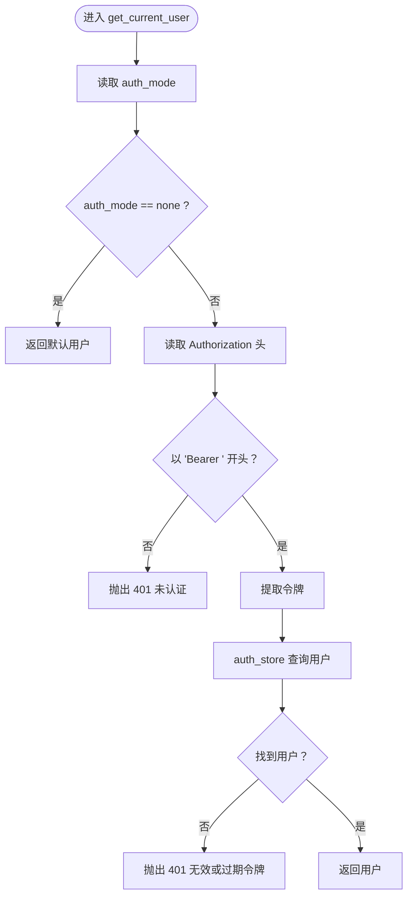
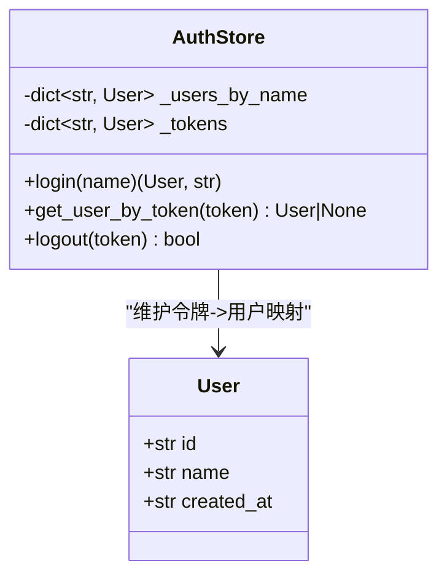
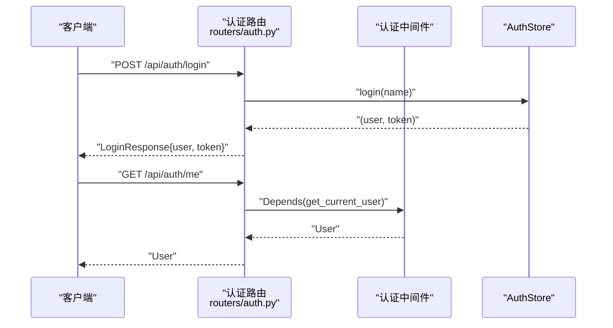
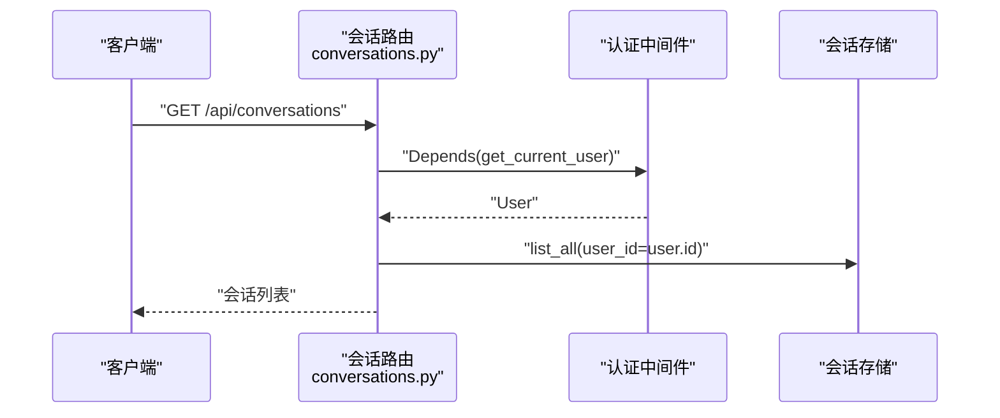
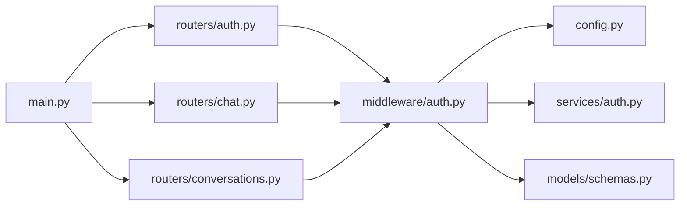

# 中间件与认证

<cite>
**本文引用的文件**
- [apps/chat/api/main.py](file://apps/chat/api/main.py)
- [apps/chat/api/config.py](file://apps/chat/api/config.py)
- [apps/chat/api/middleware/auth.py](file://apps/chat/api/middleware/auth.py)
- [apps/chat/api/models/schemas.py](file://apps/chat/api/models/schemas.py)
- [apps/chat/api/routers/auth.py](file://apps/chat/api/routers/auth.py)
- [apps/chat/api/routers/chat.py](file://apps/chat/api/routers/chat.py)
- [apps/chat/api/routers/conversations.py](file://apps/chat/api/routers/conversations.py)
- [apps/chat/api/services/auth.py](file://apps/chat/api/services/auth.py)
</cite>

## 目录
1. [简介](#简介)
2. [项目结构](#项目结构)
3. [核心组件](#核心组件)
4. [架构总览](#架构总览)
5. [详细组件分析](#详细组件分析)
6. [依赖关系分析](#依赖关系分析)
7. [性能考量](#性能考量)
8. [故障排查指南](#故障排查指南)
9. [结论](#结论)
10. [附录](#附录)

## 简介
本文件聚焦于 AIBrix 聊天应用的中间件与认证系统，围绕以下目标展开：  
- 认证中间件的实现原理：包括请求拦截机制、JWT 风格令牌验证、权限检查、用户身份识别等。  
- 请求拦截与认证流程：从路由到依赖注入、从令牌提取到用户解析、从错误处理到返回结果的完整链路。  
- 数据模型定义：用户信息、登录凭据、响应结构等关键数据结构。  
- 认证配置指南与安全最佳实践建议。

说明：当前实现采用“简单认证”模式（非 JWT），通过 Bearer 令牌在内存中进行会话管理；未使用标准 JWT 解析库或签名验证。如需扩展为标准 JWT，可在此基础上引入签名验证与过期时间校验。

## 项目结构
聊天应用后端基于 FastAPI 构建，认证相关代码集中在以下模块：
- 应用入口与路由挂载：apps/chat/api/main.py
- 配置项：apps/chat/api/config.py
- 认证中间件：apps/chat/api/middleware/auth.py
- 数据模型：apps/chat/api/models/schemas.py
- 认证路由：apps/chat/api/routers/auth.py
- 业务路由（依赖认证）：apps/chat/api/routers/chat.py、apps/chat/api/routers/conversations.py
- 认证服务（内存存储）：apps/chat/api/services/auth.py

图表来源
- [apps/chat/api/main.py:1-87](file://apps/chat/api/main.py#L1-L87)
- [apps/chat/api/middleware/auth.py:1-36](file://apps/chat/api/middleware/auth.py#L1-L36)
- [apps/chat/api/routers/auth.py:1-42](file://apps/chat/api/routers/auth.py#L1-L42)
- [apps/chat/api/routers/chat.py:1-199](file://apps/chat/api/routers/chat.py#L1-L199)
- [apps/chat/api/routers/conversations.py:1-73](file://apps/chat/api/routers/conversations.py#L1-L73)
- [apps/chat/api/services/auth.py:1-38](file://apps/chat/api/services/auth.py#L1-L38)
- [apps/chat/api/config.py:1-94](file://apps/chat/api/config.py#L1-L94)
- [apps/chat/api/models/schemas.py:1-245](file://apps/chat/api/models/schemas.py#L1-L245)

章节来源
- [apps/chat/api/main.py:1-87](file://apps/chat/api/main.py#L1-L87)
- [apps/chat/api/config.py:1-94](file://apps/chat/api/config.py#L1-L94)

## 核心组件
- 应用入口与生命周期：注册 CORS、挂载各路由、静态资源与 SPA 回退。  
- 认证中间件：根据配置决定是否启用认证，并在请求到达时解析 Authorization 头，提取 Bearer 令牌并查询用户。  
- 认证服务：提供内存中的用户与令牌映射，支持登录生成令牌、按令牌查询用户、登出删除令牌。  
- 数据模型：包含用户、登录请求/响应、通用错误等模型。  
- 认证路由：提供获取认证模式、登录、查询当前用户、登出等接口。  
- 业务路由：聊天与会话路由均依赖认证中间件，确保访问控制与用户隔离。

章节来源
- [apps/chat/api/main.py:1-87](file://apps/chat/api/main.py#L1-L87)
- [apps/chat/api/middleware/auth.py:1-36](file://apps/chat/api/middleware/auth.py#L1-L36)
- [apps/chat/api/services/auth.py:1-38](file://apps/chat/api/services/auth.py#L1-L38)
- [apps/chat/api/models/schemas.py:207-245](file://apps/chat/api/models/schemas.py#L207-L245)
- [apps/chat/api/routers/auth.py:1-42](file://apps/chat/api/routers/auth.py#L1-L42)

## 架构总览
下图展示认证在请求处理中的位置与交互：

图表来源
- [apps/chat/api/main.py:62-71](file://apps/chat/api/main.py#L62-L71)
- [apps/chat/api/middleware/auth.py:17-36](file://apps/chat/api/middleware/auth.py#L17-L36)
- [apps/chat/api/services/auth.py:17-34](file://apps/chat/api/services/auth.py#L17-L34)
- [apps/chat/api/config.py:48-50](file://apps/chat/api/config.py#L48-L50)

## 详细组件分析

### 认证中间件（get_current_user）
- 功能职责
  - 在 auth_mode 为 none 时返回默认用户，不强制认证。  
  - 在 auth_mode 为 simple 时，要求请求头携带 Bearer 令牌；若格式不正确或令牌不存在，返回 401。  
  - 使用令牌查询用户，若无匹配用户则返回 401；成功则返回用户对象。  
- 关键点
  - 依赖注入：通过 FastAPI 的 Depends 将 get_current_user 注入到路由函数参数。  
  - 默认用户：id 为空字符串，便于列表过滤逻辑兼容。  
  - 错误处理：统一抛出 HTTPException，状态码 401。  

图表来源
- [apps/chat/api/middleware/auth.py:17-36](file://apps/chat/api/middleware/auth.py#L17-L36)
- [apps/chat/api/services/auth.py:30-34](file://apps/chat/api/services/auth.py#L30-L34)
- [apps/chat/api/config.py:48-50](file://apps/chat/api/config.py#L48-L50)

章节来源
- [apps/chat/api/middleware/auth.py:1-36](file://apps/chat/api/middleware/auth.py#L1-L36)

### 认证服务（AuthStore）
- 功能职责
  - 维护用户名到用户的映射与令牌到用户的映射。  
  - 提供登录（按名称创建/获取用户并生成令牌）、按令牌查询用户、登出（删除令牌）。  
- 数据结构
  - 用户字典：按名称索引用户。  
  - 令牌字典：按令牌索引用户。  
- 复杂度
  - 登录/查询/登出均为哈希表操作，平均 O(1)。  
- 安全性
  - 当前实现为内存存储，未持久化；令牌为随机 UUID，未签名或加密。  

图表来源
- [apps/chat/api/services/auth.py:10-38](file://apps/chat/api/services/auth.py#L10-L38)
- [apps/chat/api/models/schemas.py:210-214](file://apps/chat/api/models/schemas.py#L210-L214)

章节来源
- [apps/chat/api/services/auth.py:1-38](file://apps/chat/api/services/auth.py#L1-L38)

### 认证路由（/api/auth）
- /api/auth/mode：返回当前认证模式，前端据此调整 UI 行为。  
- /api/auth/login：接收用户名，返回用户与令牌。  
- /api/auth/me：依赖认证中间件，返回当前用户。  
- /api/auth/logout：解析 Bearer 令牌并调用服务登出。  

图表来源
- [apps/chat/api/routers/auth.py:15-42](file://apps/chat/api/routers/auth.py#L15-L42)
- [apps/chat/api/middleware/auth.py:17-36](file://apps/chat/api/middleware/auth.py#L17-L36)
- [apps/chat/api/services/auth.py:17-34](file://apps/chat/api/services/auth.py#L17-L34)

章节来源
- [apps/chat/api/routers/auth.py:1-42](file://apps/chat/api/routers/auth.py#L1-L42)

### 业务路由中的认证使用
- /api/conversations：创建、列出、获取、更新标题、删除会话，均依赖 get_current_user 并对会话归属进行校验（user_id 匹配）。  
- /api/conversations/{conversation_id}/completions：聊天补全，依赖 get_current_user 校验访问权限，并将用户与会话绑定。  

图表来源
- [apps/chat/api/routers/conversations.py:36-38](file://apps/chat/api/routers/conversations.py#L36-L38)
- [apps/chat/api/middleware/auth.py:17-36](file://apps/chat/api/middleware/auth.py#L17-L36)

章节来源
- [apps/chat/api/routers/conversations.py:1-73](file://apps/chat/api/routers/conversations.py#L1-L73)
- [apps/chat/api/routers/chat.py:40-125](file://apps/chat/api/routers/chat.py#L40-L125)

### 数据模型定义
- 用户模型（User）：包含 id、name、created_at。  
- 登录请求/响应（LoginRequest/LoginResponse）：用于登录流程。  
- 错误模型（ErrorDetail/ErrorResponse）：统一错误响应结构。  

章节来源
- [apps/chat/api/models/schemas.py:210-245](file://apps/chat/api/models/schemas.py#L210-L245)

## 依赖关系分析
- 应用入口 main.py 挂载所有路由，包括认证与业务路由。  
- 认证中间件依赖配置（auth_mode）与认证服务（令牌查询）。  
- 认证路由与业务路由均依赖认证中间件。  
- 业务路由进一步依赖会话存储与网关服务（在聊天路由中体现）。  

图表来源
- [apps/chat/api/main.py:62-71](file://apps/chat/api/main.py#L62-L71)
- [apps/chat/api/routers/auth.py:1-42](file://apps/chat/api/routers/auth.py#L1-L42)
- [apps/chat/api/routers/chat.py:1-199](file://apps/chat/api/routers/chat.py#L1-L199)
- [apps/chat/api/routers/conversations.py:1-73](file://apps/chat/api/routers/conversations.py#L1-L73)
- [apps/chat/api/middleware/auth.py:1-36](file://apps/chat/api/middleware/auth.py#L1-L36)
- [apps/chat/api/config.py:1-94](file://apps/chat/api/config.py#L1-L94)
- [apps/chat/api/services/auth.py:1-38](file://apps/chat/api/services/auth.py#L1-L38)
- [apps/chat/api/models/schemas.py:1-245](file://apps/chat/api/models/schemas.py#L1-L245)

章节来源
- [apps/chat/api/main.py:1-87](file://apps/chat/api/main.py#L1-L87)

## 性能考量
- 认证中间件与认证服务均为内存操作，O(1) 时间复杂度，开销极低。  
- 建议
  - 若并发量较大，可考虑使用更高效的并发容器或引入连接池。  
  - 对于高可用部署，应将令牌与用户信息持久化至数据库，并增加令牌过期与刷新机制。  
  - 对于生产环境，建议启用 HTTPS、限制重试次数与速率，避免暴力破解尝试。

## 故障排查指南
- 401 未认证
  - 可能原因：缺少 Authorization 头或格式不正确（非 Bearer）。  
  - 排查步骤：确认请求头格式为“Bearer <token>”，检查 auth_mode 是否为 simple。  
- 401 无效或过期令牌
  - 可能原因：令牌不存在或已登出。  
  - 排查步骤：重新登录获取新令牌；检查服务端是否执行了登出操作。  
- 404 会话不存在或无权限
  - 可能原因：会话不存在或 user_id 不匹配。  
  - 排查步骤：确认会话 ID 正确且属于当前用户；检查 get_current_user 返回的用户是否一致。  
- CORS 问题
  - 可能原因：允许的源未包含前端地址。  
  - 排查步骤：检查配置中的 cors_origins 设置。

章节来源
- [apps/chat/api/middleware/auth.py:26-35](file://apps/chat/api/middleware/auth.py#L26-L35)
- [apps/chat/api/routers/conversations.py:46-48](file://apps/chat/api/routers/conversations.py#L46-L48)
- [apps/chat/api/config.py:45-46](file://apps/chat/api/config.py#L45-L46)

## 结论
- 当前认证系统以“简单认证”为核心，通过 Bearer 令牌在内存中完成用户识别与访问控制，满足本地开发与演示场景。  
- 对于生产环境，建议升级为标准 JWT（含签名与过期校验），并配合数据库持久化、HTTPS、速率限制与审计日志等安全措施。  
- 通过中间件与路由的清晰分离，系统具备良好的可扩展性，可在不改动业务路由的情况下增强认证能力。

## 附录

### 认证配置指南
- 启用简单认证
  - 设置 auth_mode 为 "simple"。  
  - 前端在每次请求中携带 Authorization: Bearer <token>。  
- 禁用认证
  - 设置 auth_mode 为 "none"。  
  - 所有路由无需令牌即可访问（默认用户生效）。  
- CORS 配置
  - 通过 cors_origins 设置允许的前端域名列表，多个域名以逗号分隔。  

章节来源
- [apps/chat/api/config.py:48-50](file://apps/chat/api/config.py#L48-L50)
- [apps/chat/api/config.py:45-46](file://apps/chat/api/config.py#L45-L46)

### 安全最佳实践建议
- 使用 HTTPS 传输，防止令牌被窃听。  
- 令牌过期与刷新：为令牌设置 TTL，并提供刷新接口。  
- 令牌撤销：登出时从内存/数据库移除令牌，必要时支持黑名单。  
- 输入校验：对登录名、消息内容等进行长度与格式限制。  
- 速率限制：对 /api/auth/* 接口实施限流，降低暴力破解风险。  
- 日志与审计：记录登录、登出、异常访问等事件，便于追踪与分析。