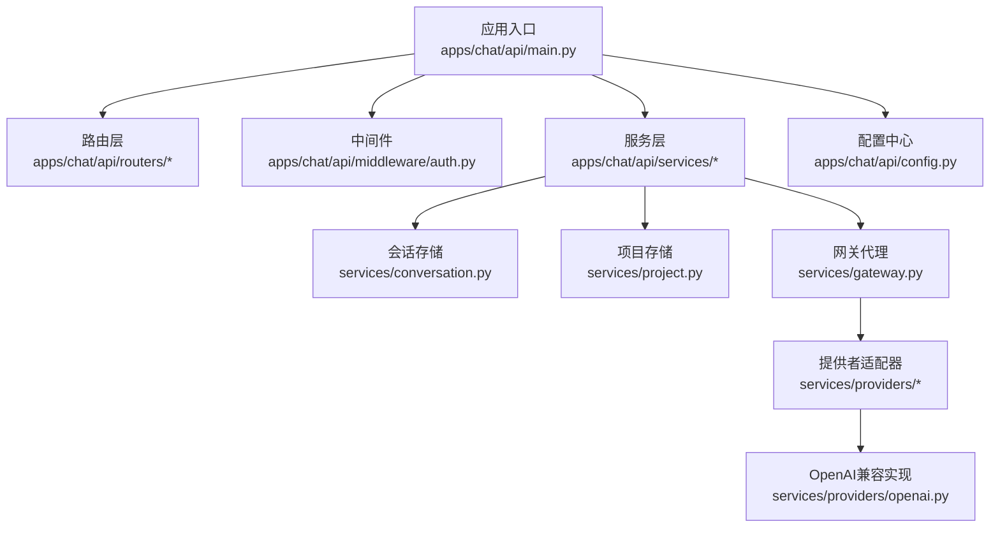
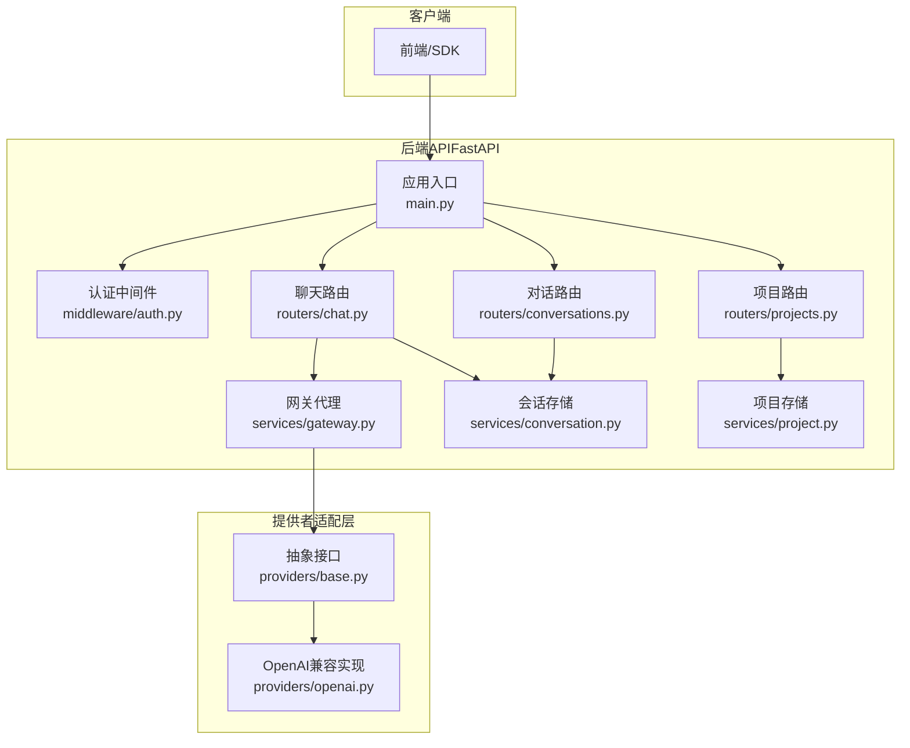
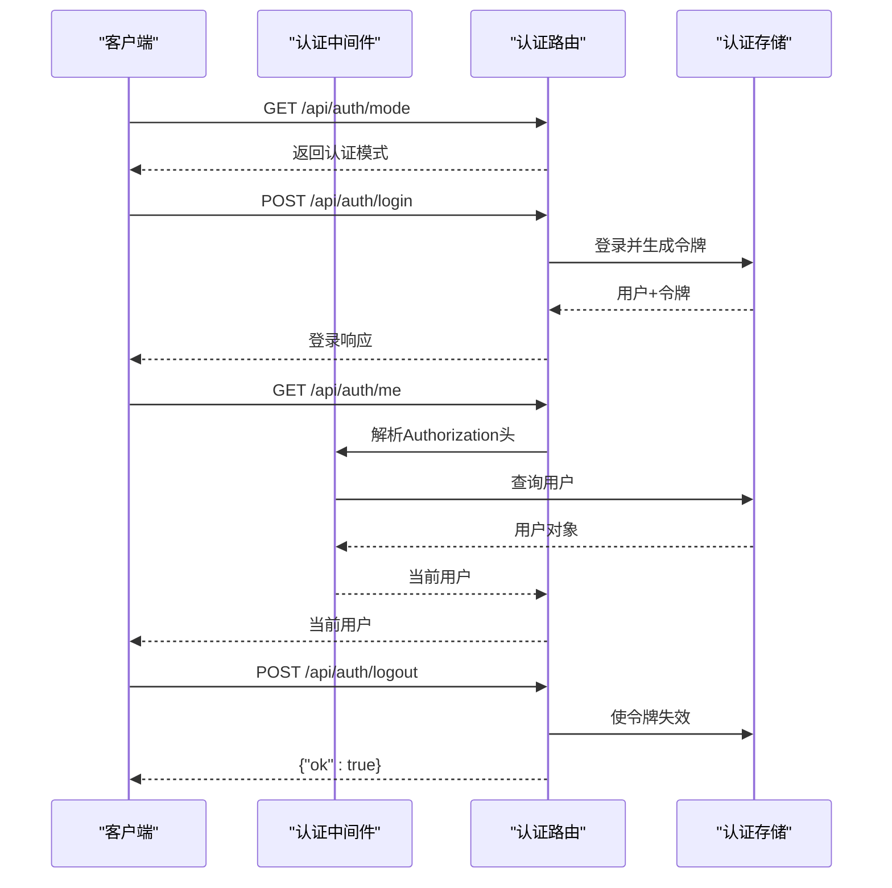
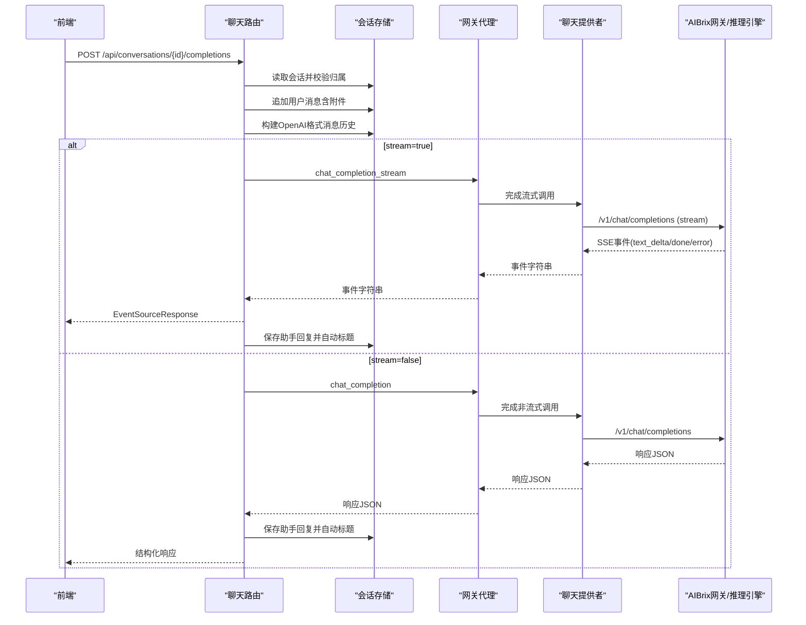
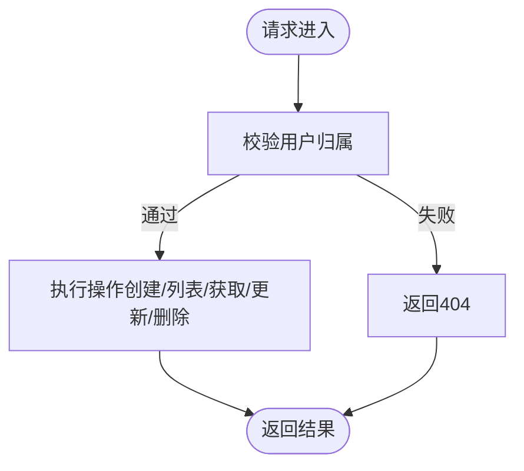
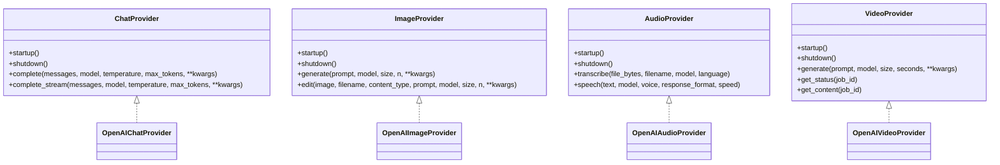
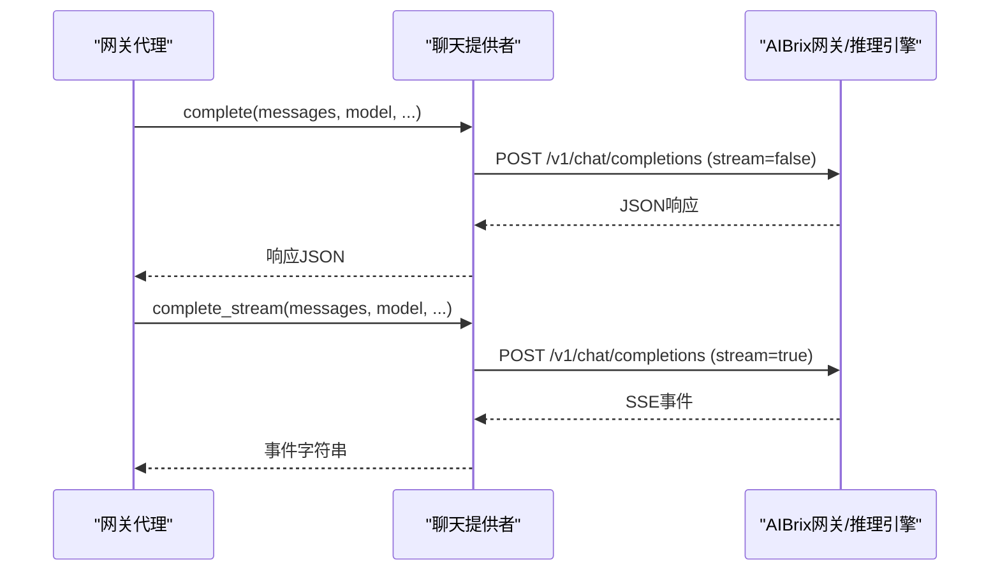
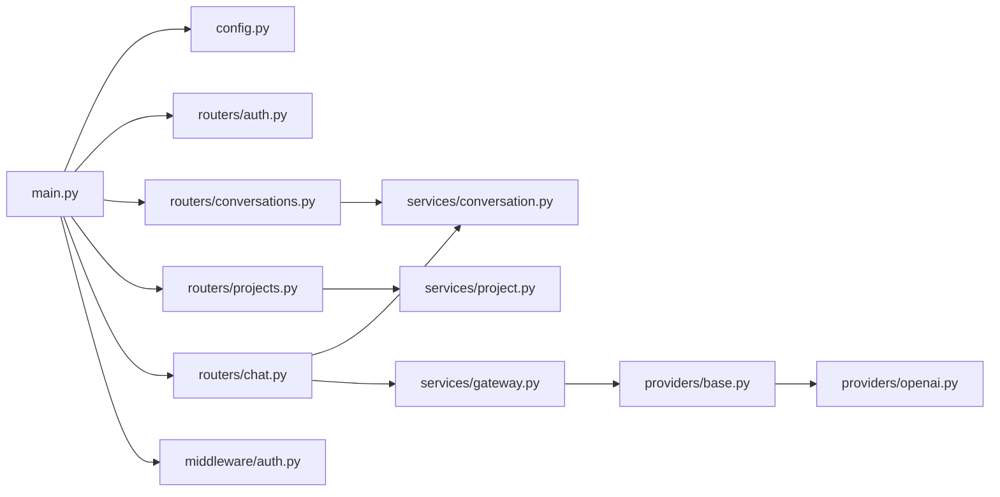

# 后端API服务

<cite>
**本文引用的文件**
- [apps/chat/api/main.py](file://apps/chat/api/main.py)
- [apps/chat/api/config.py](file://apps/chat/api/config.py)
- [apps/chat/api/routers/chat.py](file://apps/chat/api/routers/chat.py)
- [apps/chat/api/routers/conversations.py](file://apps/chat/api/routers/conversations.py)
- [apps/chat/api/routers/auth.py](file://apps/chat/api/routers/auth.py)
- [apps/chat/api/routers/projects.py](file://apps/chat/api/routers/projects.py)
- [apps/chat/api/middleware/auth.py](file://apps/chat/api/middleware/auth.py)
- [apps/chat/api/services/conversation.py](file://apps/chat/api/services/conversation.py)
- [apps/chat/api/services/gateway.py](file://apps/chat/api/services/gateway.py)
- [apps/chat/api/services/project.py](file://apps/chat/api/services/project.py)
- [apps/chat/api/services/providers/base.py](file://apps/chat/api/services/providers/base.py)
- [apps/chat/api/services/providers/openai.py](file://apps/chat/api/services/providers/openai.py)
</cite>

## 目录
1. [简介](#简介)
2. [项目结构](#项目结构)
3. [核心组件](#核心组件)
4. [架构总览](#架构总览)
5. [详细组件分析](#详细组件分析)
6. [依赖分析](#依赖分析)
7. [性能考虑](#性能考虑)
8. [故障排查指南](#故障排查指南)
9. [结论](#结论)
10. [附录](#附录)

## 简介
本文件面向AIBrix聊天应用后端API服务，围绕FastAPI应用的生命周期管理、CORS配置、路由注册与静态文件服务进行系统化技术说明；深入解析聊天路由、对话管理、认证授权、项目管理、多媒体（图像/音频/视频）处理等业务接口；阐述服务层设计模式（会话管理、网关代理、认证服务、多模态提供者适配器）；并提供完整的API接口文档、请求/响应格式、错误处理策略与认证方式等技术细节。

## 项目结构
后端API位于apps/chat/api目录，采用“路由-中间件-服务-配置”的分层组织：
- 应用入口：main.py负责FastAPI实例初始化、生命周期钩子、CORS、路由挂载与静态文件服务。
- 配置中心：config.py定义运行时参数（网关地址、各能力提供者URL/密钥、模型白名单、CORS、认证模式、版本号等）。
- 路由层：routers目录按功能划分，如聊天/completions、对话CRUD、认证、项目管理、健康检查、模型列表、媒体处理等。
- 中间件：middleware提供认证依赖，统一从请求头提取用户信息。
- 服务层：services目录包含会话存储、项目存储、网关代理、提供者适配器（OpenAI兼容）等。
- 提供者适配：services/providers定义抽象接口与OpenAI兼容实现，支持聊天、图像、音频、视频四类能力。

图表来源
- [apps/chat/api/main.py:1-87](file://apps/chat/api/main.py#L1-L87)
- [apps/chat/api/config.py:1-94](file://apps/chat/api/config.py#L1-L94)
- [apps/chat/api/routers/chat.py:1-199](file://apps/chat/api/routers/chat.py#L1-L199)
- [apps/chat/api/services/conversation.py:1-124](file://apps/chat/api/services/conversation.py#L1-L124)
- [apps/chat/api/services/gateway.py:1-103](file://apps/chat/api/services/gateway.py#L1-L103)
- [apps/chat/api/services/providers/openai.py:1-496](file://apps/chat/api/services/providers/openai.py#L1-L496)

章节来源
- [apps/chat/api/main.py:1-87](file://apps/chat/api/main.py#L1-L87)
- [apps/chat/api/config.py:1-94](file://apps/chat/api/config.py#L1-L94)

## 核心组件
- FastAPI应用与生命周期
  - 使用lifespan钩子在启动时初始化聊天/图像/音频/视频提供者连接池，在关闭时释放资源。
  - 文档化路径：/api/docs、/api/redoc、/api/openapi.json。
- CORS配置
  - 允许来源来自配置项cors_origins，支持GET/POST/PATCH/DELETE方法与Authorization/Content-Type头部。
- 路由注册
  - 挂载auth、health、models、conversations、chat、projects、images、audio、video路由。
- 静态文件服务
  - 若存在构建产物目录，则挂载/assets静态目录，并提供SPA回退到index.html。

章节来源
- [apps/chat/api/main.py:21-87](file://apps/chat/api/main.py#L21-L87)
- [apps/chat/api/config.py:45-52](file://apps/chat/api/config.py#L45-L52)

## 架构总览
下图展示从客户端到服务层与提供者适配器的整体调用链路，以及会话与项目数据的持久化位置。

图表来源
- [apps/chat/api/main.py:37-87](file://apps/chat/api/main.py#L37-L87)
- [apps/chat/api/middleware/auth.py:17-36](file://apps/chat/api/middleware/auth.py#L17-L36)
- [apps/chat/api/routers/chat.py:40-199](file://apps/chat/api/routers/chat.py#L40-L199)
- [apps/chat/api/routers/conversations.py:10-73](file://apps/chat/api/routers/conversations.py#L10-L73)
- [apps/chat/api/routers/projects.py:11-71](file://apps/chat/api/routers/projects.py#L11-L71)
- [apps/chat/api/services/gateway.py:70-103](file://apps/chat/api/services/gateway.py#L70-L103)
- [apps/chat/api/services/conversation.py:10-124](file://apps/chat/api/services/conversation.py#L10-L124)
- [apps/chat/api/services/project.py:10-87](file://apps/chat/api/services/project.py#L10-L87)
- [apps/chat/api/services/providers/base.py:10-138](file://apps/chat/api/services/providers/base.py#L10-L138)
- [apps/chat/api/services/providers/openai.py:61-496](file://apps/chat/api/services/providers/openai.py#L61-L496)

## 详细组件分析

### 路由与认证中间件
- 认证中间件
  - 支持两种模式：none（默认返回匿名用户）、simple（从Authorization头提取Bearer令牌并查询用户）。
  - 未认证或令牌无效时返回401。
- 认证路由
  - 获取当前认证模式、登录（生成用户与令牌）、获取当前用户、登出（消费令牌）。

图表来源
- [apps/chat/api/middleware/auth.py:17-36](file://apps/chat/api/middleware/auth.py#L17-L36)
- [apps/chat/api/routers/auth.py:15-42](file://apps/chat/api/routers/auth.py#L15-L42)

章节来源
- [apps/chat/api/middleware/auth.py:17-36](file://apps/chat/api/middleware/auth.py#L17-L36)
- [apps/chat/api/routers/auth.py:15-42](file://apps/chat/api/routers/auth.py#L15-L42)

### 聊天与会话管理
- 聊天完成（流式/非流式）
  - 接收最新用户消息与附件，构建完整历史（含可选系统提示），转发至网关。
  - 流式：基于SSE事件推送增量文本，异常时发送错误事件；最终保存助手回复并自动设置标题。
  - 非流式：一次性获取完整回答，保存助手回复并返回结构化响应。
  - 文件上传限制大小，仅允许图片预览（base64 data URL）。
- 会话存储
  - 内存级会话存储，支持创建、列出、获取、更新标题、删除。
  - 将用户消息转换为OpenAI格式（文本块+图片块），用于网关请求。

图表来源
- [apps/chat/api/routers/chat.py:40-199](file://apps/chat/api/routers/chat.py#L40-L199)
- [apps/chat/api/services/conversation.py:64-120](file://apps/chat/api/services/conversation.py#L64-L120)
- [apps/chat/api/services/gateway.py:70-103](file://apps/chat/api/services/gateway.py#L70-L103)
- [apps/chat/api/services/providers/openai.py:88-151](file://apps/chat/api/services/providers/openai.py#L88-L151)

章节来源
- [apps/chat/api/routers/chat.py:40-199](file://apps/chat/api/routers/chat.py#L40-L199)
- [apps/chat/api/services/conversation.py:10-124](file://apps/chat/api/services/conversation.py#L10-L124)
- [apps/chat/api/services/gateway.py:70-103](file://apps/chat/api/services/gateway.py#L70-L103)
- [apps/chat/api/services/providers/openai.py:88-151](file://apps/chat/api/services/providers/openai.py#L88-L151)

### 对话管理
- 创建对话：可指定模型、标题、项目ID，绑定当前用户。
- 列表：按更新时间倒序返回摘要列表。
- 获取详情：校验对话归属。
- 更新标题：更新时间戳同步刷新。
- 删除对话：校验归属后删除。

图表来源
- [apps/chat/api/routers/conversations.py:23-73](file://apps/chat/api/routers/conversations.py#L23-L73)
- [apps/chat/api/services/conversation.py:16-62](file://apps/chat/api/services/conversation.py#L16-L62)

章节来源
- [apps/chat/api/routers/conversations.py:10-73](file://apps/chat/api/routers/conversations.py#L10-L73)
- [apps/chat/api/services/conversation.py:10-124](file://apps/chat/api/services/conversation.py#L10-L124)

### 项目管理
- 创建项目：名称与描述必填，绑定当前用户。
- 列表：按更新时间倒序返回摘要列表。
- 获取详情：校验项目归属。
- 更新项目：可修改名称、描述、系统提示。
- 删除项目：校验归属后删除。

图表来源
- [apps/chat/api/routers/projects.py:14-71](file://apps/chat/api/routers/projects.py#L14-L71)
- [apps/chat/api/services/project.py:38-82](file://apps/chat/api/services/project.py#L38-L82)

章节来源
- [apps/chat/api/routers/projects.py:11-71](file://apps/chat/api/routers/projects.py#L11-L71)
- [apps/chat/api/services/project.py:10-87](file://apps/chat/api/services/project.py#L10-L87)

### 多媒体处理（图像/音频/视频）
- 图像
  - 生成：向图像生成端点提交提示词、尺寸、数量等参数。
  - 编辑：对参考图像进行编辑（DALL·E等模型需透明掩码处理）。
- 音频
  - 转写：上传音频文件与语言参数，返回文本。
  - 语音：输入文本、声音、格式、语速等，返回音频字节。
- 视频
  - 提交生成任务，返回作业ID与状态；轮询状态；下载完成内容。

图表来源
- [apps/chat/api/services/providers/base.py:10-138](file://apps/chat/api/services/providers/base.py#L10-L138)
- [apps/chat/api/services/providers/openai.py:61-496](file://apps/chat/api/services/providers/openai.py#L61-L496)

章节来源
- [apps/chat/api/services/providers/base.py:10-138](file://apps/chat/api/services/providers/base.py#L10-L138)
- [apps/chat/api/services/providers/openai.py:157-496](file://apps/chat/api/services/providers/openai.py#L157-L496)

### 网关代理与提供者适配
- 网关代理
  - 健康检查：访问/v1/models，超时短。
  - 模型列表：带60秒TTL缓存，异常时降级返回旧缓存。
  - 聊天完成：委托给聊天提供者；流式/非流式分别调用对应方法。
- 提供者适配
  - OpenAI兼容实现：统一处理请求头、日志钩子、超时与连接池限制；聊天使用SSE解析；图像/音频/视频遵循OpenAI风格端点。

图表来源
- [apps/chat/api/services/gateway.py:31-103](file://apps/chat/api/services/gateway.py#L31-L103)
- [apps/chat/api/services/providers/openai.py:88-151](file://apps/chat/api/services/providers/openai.py#L88-L151)

章节来源
- [apps/chat/api/services/gateway.py:31-103](file://apps/chat/api/services/gateway.py#L31-L103)
- [apps/chat/api/services/providers/openai.py:61-151](file://apps/chat/api/services/providers/openai.py#L61-L151)

## 依赖分析
- 组件耦合
  - 路由层依赖中间件与服务层；服务层依赖配置中心与提供者适配器。
  - 会话与项目存储为内存单例，后续可替换为持久化存储。
- 外部依赖
  - FastAPI、httpx、sse-starlette、PIL（图像处理）、Pydantic（配置与模型）。
- 循环依赖
  - 未发现循环导入；路由与服务通过函数调用解耦。

图表来源
- [apps/chat/api/main.py:11-87](file://apps/chat/api/main.py#L11-L87)
- [apps/chat/api/config.py:4-94](file://apps/chat/api/config.py#L4-L94)
- [apps/chat/api/routers/chat.py:14-17](file://apps/chat/api/routers/chat.py#L14-L17)
- [apps/chat/api/services/conversation.py:7-8](file://apps/chat/api/services/conversation.py#L7-L8)
- [apps/chat/api/services/gateway.py:14-15](file://apps/chat/api/services/gateway.py#L14-L15)
- [apps/chat/api/services/providers/base.py:5-23](file://apps/chat/api/services/providers/base.py#L5-L23)
- [apps/chat/api/services/providers/openai.py:18-23](file://apps/chat/api/services/providers/openai.py#L18-L23)
- [apps/chat/api/middleware/auth.py:7-9](file://apps/chat/api/middleware/auth.py#L7-L9)

章节来源
- [apps/chat/api/main.py:11-87](file://apps/chat/api/main.py#L11-L87)
- [apps/chat/api/routers/chat.py:14-17](file://apps/chat/api/routers/chat.py#L14-L17)
- [apps/chat/api/services/gateway.py:14-15](file://apps/chat/api/services/gateway.py#L14-L15)
- [apps/chat/api/services/providers/base.py:5-23](file://apps/chat/api/services/providers/base.py#L5-L23)
- [apps/chat/api/services/providers/openai.py:18-23](file://apps/chat/api/services/providers/openai.py#L18-L23)

## 性能考虑
- 连接池与超时
  - 提供者使用httpx异步客户端，配置连接/读/写/池超时与最大连接数，减少握手开销。
- 缓存与降级
  - 模型列表60秒TTL缓存，网络异常时返回旧缓存，提升可用性。
- 流式传输
  - SSE流式返回，边到边输出，降低首字节延迟与内存占用。
- 文件上传
  - 限制单文件大小，避免过大负载；图片转为base64预览，便于前端展示。

章节来源
- [apps/chat/api/services/providers/openai.py:67-86](file://apps/chat/api/services/providers/openai.py#L67-L86)
- [apps/chat/api/services/gateway.py:44-67](file://apps/chat/api/services/gateway.py#L44-L67)
- [apps/chat/api/routers/chat.py:64-85](file://apps/chat/api/routers/chat.py#L64-L85)

## 故障排查指南
- 认证相关
  - 401未认证：确认Authorization头格式与令牌有效性；检查auth_mode配置。
  - 令牌过期/无效：调用登出路由使令牌失效，重新登录。
- 聊天相关
  - 404对话不存在：确认conversation_id与用户归属；检查会话是否被删除。
  - 502网关错误：上游服务不可达或返回异常；查看网关代理日志与超时设置。
  - SSE异常：提供者实现记录请求/响应日志，定位具体端点与状态码。
- 健康检查
  - check_health失败：确认aibrix_gateway_url与api_key配置正确，网络可达。

章节来源
- [apps/chat/api/middleware/auth.py:23-35](file://apps/chat/api/middleware/auth.py#L23-L35)
- [apps/chat/api/routers/chat.py:58-60](file://apps/chat/api/routers/chat.py#L58-L60)
- [apps/chat/api/services/gateway.py:31-42](file://apps/chat/api/services/gateway.py#L31-L42)
- [apps/chat/api/services/providers/openai.py:29-46](file://apps/chat/api/services/providers/openai.py#L29-L46)

## 结论
本后端API以FastAPI为核心，采用清晰的分层架构与提供者适配模式，实现了聊天、对话、项目、认证与多模态能力的统一接入。通过生命周期管理、CORS配置、路由注册与静态文件服务，满足本地开发与生产部署需求。服务层以会话与项目存储为基础，结合网关代理与多模态提供者，形成可扩展的后端能力矩阵。建议后续引入持久化存储、统一鉴权与可观测性指标，进一步增强稳定性与可维护性。

## 附录

### API接口文档概览
- 认证
  - GET /api/auth/mode：返回当前认证模式
  - POST /api/auth/login：登录，返回用户与令牌
  - GET /api/auth/me：获取当前用户
  - POST /api/auth/logout：登出
- 对话
  - POST /api/conversations：创建对话
  - GET /api/conversations：列出对话
  - GET /api/conversations/{conversation_id}：获取对话
  - PATCH /api/conversations/{conversation_id}：更新标题
  - DELETE /api/conversations/{conversation_id}：删除对话
- 项目
  - POST /api/projects：创建项目
  - GET /api/projects：列出项目
  - GET /api/projects/{project_id}：获取项目
  - PATCH /api/projects/{project_id}：更新项目
  - DELETE /api/projects/{project_id}：删除项目
- 聊天
  - POST /api/conversations/{conversation_id}/completions：发送消息并获取回答（支持流式与非流式）

章节来源
- [apps/chat/api/routers/auth.py:15-42](file://apps/chat/api/routers/auth.py#L15-L42)
- [apps/chat/api/routers/conversations.py:23-73](file://apps/chat/api/routers/conversations.py#L23-L73)
- [apps/chat/api/routers/projects.py:14-71](file://apps/chat/api/routers/projects.py#L14-L71)
- [apps/chat/api/routers/chat.py:40-199](file://apps/chat/api/routers/chat.py#L40-L199)

### 配置项说明
- 网关与密钥
  - aibrix_gateway_url：AIBrix网关基础URL
  - api_key：通用API密钥
  - chat_api_url/chat_api_key、asr_api_url/asr_api_key、tts_api_url/tts_api_key、image_api_url/image_api_key、image_edit_api_url/image_edit_api_key、video_api_url/video_api_key：按能力覆盖URL与密钥
- 模型与过滤
  - image_model、image_edit_model、asr_model、tts_model、tts_voice、video_model：默认模型名
  - models_allowlist、text_models_allowlist、image_models_allowlist、audio_models_allowlist、video_models_allowlist：模型白名单（逗号分隔）
- CORS与认证
  - cors_origins：允许来源
  - auth_mode：认证模式（none/simple）
- 应用
  - app_version：应用版本

章节来源
- [apps/chat/api/config.py:4-94](file://apps/chat/api/config.py#L4-L94)