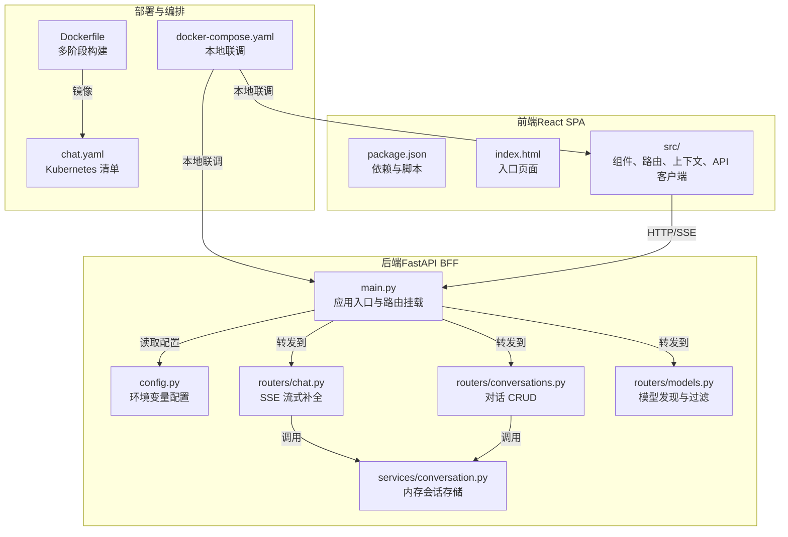
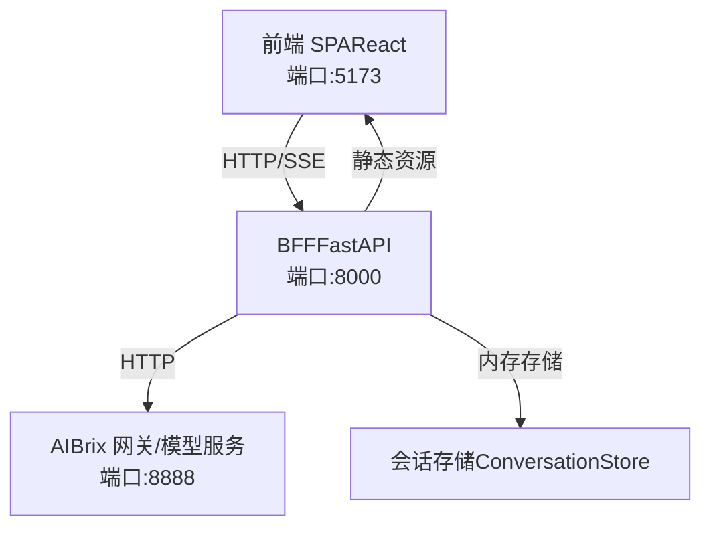
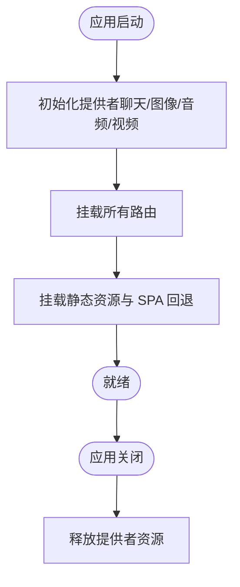
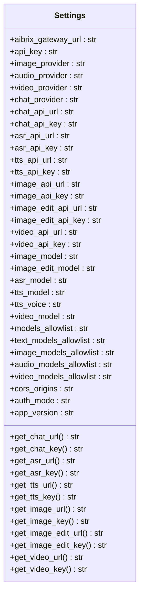
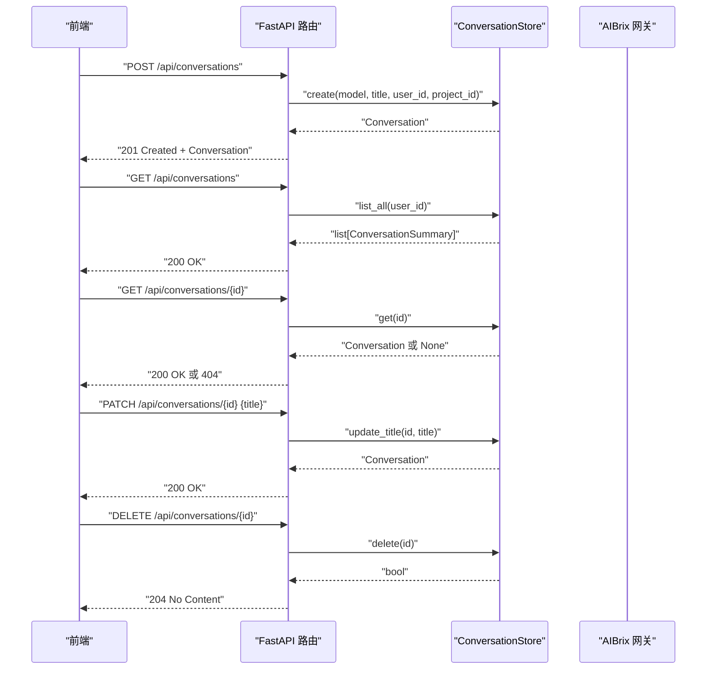
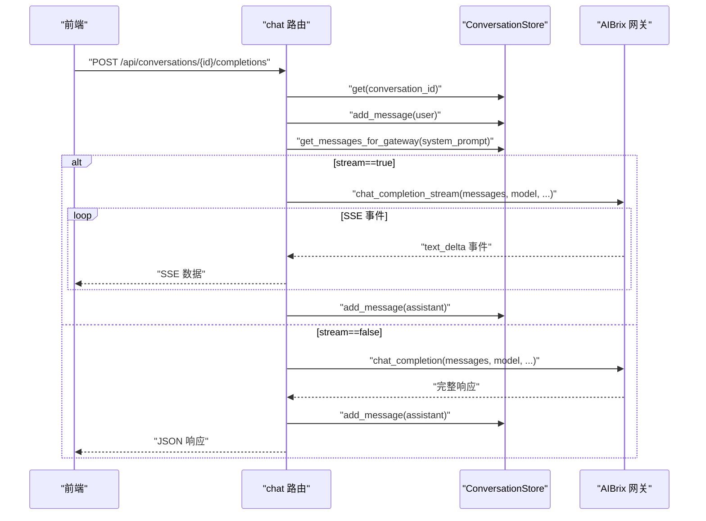
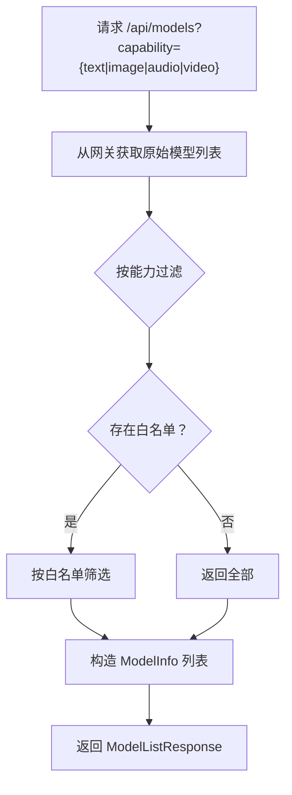
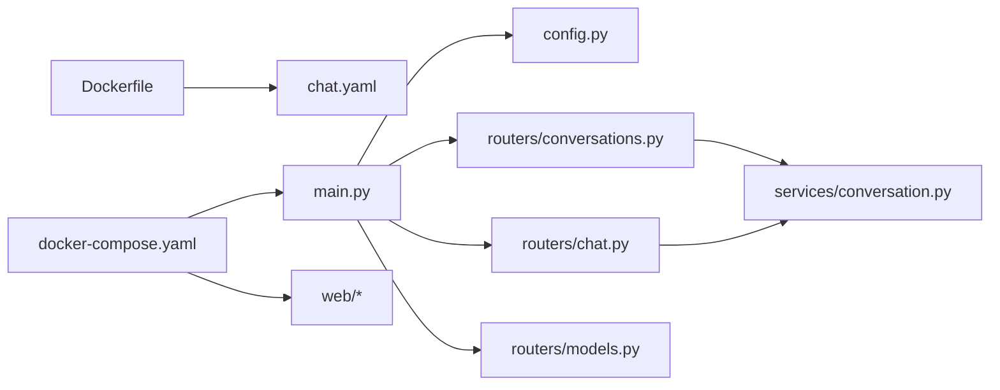

# 聊天应用

<cite>
**本文引用的文件**
- [apps/chat/README.md](file://apps/chat/README.md)
- [apps/chat/Dockerfile](file://apps/chat/Dockerfile)
- [apps/chat/docker-compose.yaml](file://apps/chat/docker-compose.yaml)
- [apps/chat/chat.yaml](file://apps/chat/chat.yaml)
- [apps/chat/api/main.py](file://apps/chat/api/main.py)
- [apps/chat/api/config.py](file://apps/chat/api/config.py)
- [apps/chat/api/routers/conversations.py](file://apps/chat/api/routers/conversations.py)
- [apps/chat/api/routers/chat.py](file://apps/chat/api/routers/chat.py)
- [apps/chat/api/routers/models.py](file://apps/chat/api/routers/models.py)
- [apps/chat/api/services/conversation.py](file://apps/chat/api/services/conversation.py)
- [apps/chat/web/package.json](file://apps/chat/web/package.json)
- [apps/chat/web/index.html](file://apps/chat/web/index.html)
</cite>

## 目录
1. [简介](#简介)
2. [项目结构](#项目结构)
3. [核心组件](#核心组件)
4. [架构总览](#架构总览)
5. [详细组件分析](#详细组件分析)
6. [依赖分析](#依赖分析)
7. [性能考虑](#性能考虑)
8. [故障排查指南](#故障排查指南)
9. [结论](#结论)
10. [附录](#附录)

## 简介
本文件为 AIBrix 聊天应用的技术文档，聚焦于以下方面：
- 后端 BFF（Backend for Frontend）架构：基于 FastAPI 的服务层，负责路由聚合、会话管理、与 AIBrix 网关的对接以及静态资源托管。
- 前端 React 架构：基于 Vite + React + Tailwind 的单页应用（SPA），提供对话、项目管理、模型选择与多模态输入等交互能力。
- 核心业务模块：对话管理（内存存储）、消息处理（含附件）、多模态支持（文本、图片）、项目管理（指令注入）、健康检查与模型发现。
- 实用内容：API 接口清单、前端组件使用说明、配置项说明、部署与运行方式、扩展开发指南。

## 项目结构
聊天应用位于 apps/chat 目录，采用前后端分离的双仓库结构：
- 后端（Python + FastAPI）：apps/chat/api
- 前端（React + Vite + Tailwind）：apps/chat/web
- 部署与编排：Dockerfile、docker-compose.yaml、Kubernetes YAML（chat.yaml）

图表来源
- [apps/chat/api/main.py:1-87](file://apps/chat/api/main.py#L1-L87)
- [apps/chat/api/config.py:1-94](file://apps/chat/api/config.py#L1-L94)
- [apps/chat/api/routers/conversations.py:1-73](file://apps/chat/api/routers/conversations.py#L1-L73)
- [apps/chat/api/routers/chat.py:1-199](file://apps/chat/api/routers/chat.py#L1-L199)
- [apps/chat/api/routers/models.py:1-128](file://apps/chat/api/routers/models.py#L1-L128)
- [apps/chat/api/services/conversation.py:1-124](file://apps/chat/api/services/conversation.py#L1-L124)
- [apps/chat/web/package.json:1-91](file://apps/chat/web/package.json#L1-L91)
- [apps/chat/web/index.html:1-14](file://apps/chat/web/index.html#L1-L14)
- [apps/chat/Dockerfile:1-22](file://apps/chat/Dockerfile#L1-L22)
- [apps/chat/docker-compose.yaml:1-31](file://apps/chat/docker-compose.yaml#L1-L31)
- [apps/chat/chat.yaml:1-99](file://apps/chat/chat.yaml#L1-L99)

章节来源
- [apps/chat/README.md:1-145](file://apps/chat/README.md#L1-L145)
- [apps/chat/api/main.py:1-87](file://apps/chat/api/main.py#L1-L87)
- [apps/chat/api/config.py:1-94](file://apps/chat/api/config.py#L1-L94)
- [apps/chat/api/routers/conversations.py:1-73](file://apps/chat/api/routers/conversations.py#L1-L73)
- [apps/chat/api/routers/chat.py:1-199](file://apps/chat/api/routers/chat.py#L1-L199)
- [apps/chat/api/routers/models.py:1-128](file://apps/chat/api/routers/models.py#L1-L128)
- [apps/chat/api/services/conversation.py:1-124](file://apps/chat/api/services/conversation.py#L1-L124)
- [apps/chat/web/package.json:1-91](file://apps/chat/web/package.json#L1-L91)
- [apps/chat/web/index.html:1-14](file://apps/chat/web/index.html#L1-L14)
- [apps/chat/Dockerfile:1-22](file://apps/chat/Dockerfile#L1-L22)
- [apps/chat/docker-compose.yaml:1-31](file://apps/chat/docker-compose.yaml#L1-L31)
- [apps/chat/chat.yaml:1-99](file://apps/chat/chat.yaml#L1-L99)

## 核心组件
- 应用入口与生命周期：FastAPI 应用初始化、CORS 中间件、路由挂载、静态资源托管与 SPA 回退。
- 配置中心：统一读取环境变量，提供各服务 URL 与密钥的优先级解析。
- 路由层：
  - 对话管理：创建、列出、获取、更新标题、删除对话。
  - 模型发现：从网关拉取模型列表并按能力过滤。
  - 聊天补全：SSE 流式响应与非流式一次性响应，支持文件上传与预览。
- 服务层：
  - 会话存储：内存中的对话与消息持久化（未来可替换为数据库）。
  - 网关代理：对 OpenAI 兼容接口的封装（当前指向 AIBrix 网关）。
- 前端：
  - 组件体系：布局、侧边栏、聊天页、项目页、模型选择器、认证相关组件。
  - API 客户端：统一的 HTTP/SSE 客户端封装。
  - 构建与开发：Vite + TypeScript + Biome + Tailwind。

章节来源
- [apps/chat/api/main.py:1-87](file://apps/chat/api/main.py#L1-L87)
- [apps/chat/api/config.py:1-94](file://apps/chat/api/config.py#L1-L94)
- [apps/chat/api/routers/conversations.py:1-73](file://apps/chat/api/routers/conversations.py#L1-L73)
- [apps/chat/api/routers/models.py:1-128](file://apps/chat/api/routers/models.py#L1-L128)
- [apps/chat/api/routers/chat.py:1-199](file://apps/chat/api/routers/chat.py#L1-L199)
- [apps/chat/api/services/conversation.py:1-124](file://apps/chat/api/services/conversation.py#L1-L124)
- [apps/chat/web/package.json:1-91](file://apps/chat/web/package.json#L1-L91)

## 架构总览
聊天应用采用“前端 SPA + 后端 BFF（FastAPI）+ AIBrix 网关”的三层架构。前端通过 HTTP/SSE 与后端交互；后端作为 BFF，负责：
- 聚合与转发请求至 AIBrix 网关或内部服务。
- 维护会话状态与消息历史。
- 提供静态资源与 SPA 回退。
- 处理跨域、鉴权与安全策略。

图表来源
- [apps/chat/README.md:1-145](file://apps/chat/README.md#L1-L145)
- [apps/chat/api/main.py:1-87](file://apps/chat/api/main.py#L1-L87)
- [apps/chat/api/services/conversation.py:1-124](file://apps/chat/api/services/conversation.py#L1-L124)

## 详细组件分析

### 后端应用入口与生命周期（FastAPI）
- 生命周期钩子：启动时初始化多个提供者（聊天、图像、音频、视频），关闭时释放资源。
- CORS 配置：允许指定来源、方法与头部。
- 路由挂载：统一注册认证、健康检查、模型、对话、聊天、项目、图片、音频、视频等路由。
- 静态资源与 SPA 回退：将构建产物目录映射为静态资源，并对未匹配的路由回退到 index.html。

图表来源
- [apps/chat/api/main.py:21-35](file://apps/chat/api/main.py#L21-L35)
- [apps/chat/api/main.py:62-87](file://apps/chat/api/main.py#L62-L87)

章节来源
- [apps/chat/api/main.py:1-87](file://apps/chat/api/main.py#L1-L87)

### 配置中心（Settings）
- 网关与鉴权：AIBrix 网关基础地址与 API Key。
- 提供者选择：按模态（文本/图像/音频/视频）选择默认提供者（默认 openai）。
- URL/Key 覆盖：每个能力可独立覆盖 URL 与 Key，否则回退到全局设置。
- 模型过滤：支持全局与按能力的模型白名单。
- CORS 与鉴权模式：CORS 来源与鉴权模式（none/simple）。
- 版本信息：应用版本号。

图表来源
- [apps/chat/api/config.py:4-94](file://apps/chat/api/config.py#L4-L94)

章节来源
- [apps/chat/api/config.py:1-94](file://apps/chat/api/config.py#L1-L94)

### 对话管理（Routers + Services）
- 路由：
  - 创建对话：接收模型、标题、项目 ID，返回完整对话对象。
  - 列出对话：按用户维度返回摘要列表，按更新时间倒序。
  - 获取对话：校验用户归属，返回完整对话（含消息）。
  - 更新标题：校验用户归属，更新标题与更新时间。
  - 删除对话：校验用户归属，删除记录。
- 服务：
  - 内存存储：以字典保存对话，提供创建、查询、列表、删除、更新标题、添加消息、构建网关消息格式等。
  - 消息到网关格式转换：将用户消息中的图片附件转为 OpenAI 兼容的内容块。

图表来源
- [apps/chat/api/routers/conversations.py:1-73](file://apps/chat/api/routers/conversations.py#L1-L73)
- [apps/chat/api/services/conversation.py:1-124](file://apps/chat/api/services/conversation.py#L1-L124)

章节来源
- [apps/chat/api/routers/conversations.py:1-73](file://apps/chat/api/routers/conversations.py#L1-L73)
- [apps/chat/api/services/conversation.py:1-124](file://apps/chat/api/services/conversation.py#L1-L124)

### 聊天补全（SSE 流式与非流式）
- 请求参数：消息文本、模型、是否流式、温度、最大令牌数、系统提示、文件上传（图片自动预览）。
- 会话构建：根据对话历史与项目指令生成完整消息数组，支持系统提示注入。
- 流式响应：基于 SSE 将网关返回的增量事件逐条推送，收集最终内容并写入会话。
- 非流式响应：一次性获取完整回答，写入会话并返回结构化结果。
- 文件上传：限制大小、识别类型（仅图片生成预览），其余文件作为附件记录。

图表来源
- [apps/chat/api/routers/chat.py:40-199](file://apps/chat/api/routers/chat.py#L40-L199)
- [apps/chat/api/services/conversation.py:106-119](file://apps/chat/api/services/conversation.py#L106-L119)

章节来源
- [apps/chat/api/routers/chat.py:1-199](file://apps/chat/api/routers/chat.py#L1-L199)
- [apps/chat/api/services/conversation.py:1-124](file://apps/chat/api/services/conversation.py#L1-L124)

### 模型发现与过滤
- 能力推断：通过模型 ID 正则匹配推断文本、图像、视频、音频、嵌入等能力。
- 过滤策略：支持全局白名单与按能力白名单；若未设置则展示全部。
- 端点：GET /api/models，支持 capability 查询参数。

图表来源
- [apps/chat/api/routers/models.py:92-128](file://apps/chat/api/routers/models.py#L92-L128)

章节来源
- [apps/chat/api/routers/models.py:1-128](file://apps/chat/api/routers/models.py#L1-L128)

### 前端组件与使用说明
- 依赖与脚本：React 18、Vite、Tailwind、Biome 类型检查、路由与 UI 组件库。
- 入口与模板：index.html 作为 SPA 入口，main.tsx 加载根组件。
- 组件概览（部分）：布局、侧边栏、聊天页、项目页、模型选择器、认证组件、模态框等。
- 使用建议：
  - 开发：使用 Vite 热更新，Biome 进行代码质量检查，TypeScript 进行类型校验。
  - 构建：生产构建输出至 dist，由后端静态目录提供。

章节来源
- [apps/chat/web/package.json:1-91](file://apps/chat/web/package.json#L1-L91)
- [apps/chat/web/index.html:1-14](file://apps/chat/web/index.html#L1-L14)

## 依赖分析
- 后端依赖关系：
  - main.py 依赖 config.py、routers/*、services/*。
  - routers/* 依赖 models.schemas、services.*、中间件。
  - services/conversation.py 依赖 models.schemas。
- 前端依赖关系：
  - package.json 声明 React 生态与 UI 组件库。
  - index.html 作为 SPA 入口，main.tsx 加载应用根组件。
- 部署依赖关系：
  - Dockerfile 多阶段构建：前端构建产物复制到后端镜像中，后端提供静态资源。
  - docker-compose.yaml 本地联调：前后端容器互联。
  - chat.yaml Kubernetes 清单：ConfigMap/Secret 注入环境变量，Service 暴露端口。

图表来源
- [apps/chat/api/main.py:1-87](file://apps/chat/api/main.py#L1-L87)
- [apps/chat/api/config.py:1-94](file://apps/chat/api/config.py#L1-L94)
- [apps/chat/api/routers/conversations.py:1-73](file://apps/chat/api/routers/conversations.py#L1-L73)
- [apps/chat/api/routers/chat.py:1-199](file://apps/chat/api/routers/chat.py#L1-L199)
- [apps/chat/api/routers/models.py:1-128](file://apps/chat/api/routers/models.py#L1-L128)
- [apps/chat/api/services/conversation.py:1-124](file://apps/chat/api/services/conversation.py#L1-L124)
- [apps/chat/Dockerfile:1-22](file://apps/chat/Dockerfile#L1-L22)
- [apps/chat/docker-compose.yaml:1-31](file://apps/chat/docker-compose.yaml#L1-L31)
- [apps/chat/chat.yaml:1-99](file://apps/chat/chat.yaml#L1-L99)

章节来源
- [apps/chat/api/main.py:1-87](file://apps/chat/api/main.py#L1-L87)
- [apps/chat/Dockerfile:1-22](file://apps/chat/Dockerfile#L1-L22)
- [apps/chat/docker-compose.yaml:1-31](file://apps/chat/docker-compose.yaml#L1-L31)
- [apps/chat/chat.yaml:1-99](file://apps/chat/chat.yaml#L1-L99)

## 性能考虑
- SSE 流式传输：后端按事件推送，前端逐步渲染，降低首屏等待时间。
- 会话存储：当前为内存存储，适合单实例；生产环境建议迁移到持久化存储（如 SQLite/PostgreSQL）以支持水平扩展。
- 文件上传：限制单文件大小，图片生成预览，避免大体积数据进入网关。
- CORS 与鉴权：合理配置允许来源与鉴权模式，减少不必要的跨域与鉴权开销。
- 镜像与资源：多阶段构建减少镜像体积，静态资源由后端统一托管，减少前端 CDN 依赖。

## 故障排查指南
- 健康检查：访问 /api/health 确认后端可用。
- 网关连通性：确认 AIBRIX_GATEWAY_URL 可达且 API_KEY 配置正确。
- CORS 错误：检查 CORS_ORIGINS 是否包含前端地址（默认 http://localhost:5173）。
- 会话不存在：确保用户与对话归属一致，否则返回 404。
- 文件过大：上传文件超过限制将触发 413。
- 网关错误：非流式响应在网关异常时返回 502，需检查网关日志与模型可用性。

章节来源
- [apps/chat/api/routers/chat.py:64-68](file://apps/chat/api/routers/chat.py#L64-L68)
- [apps/chat/api/routers/conversations.py:47-48](file://apps/chat/api/routers/conversations.py#L47-L48)
- [apps/chat/api/main.py:52-60](file://apps/chat/api/main.py#L52-L60)

## 结论
该聊天应用通过清晰的 BFF 分层与前后端分离架构，实现了多模态对话、项目指令注入与模型能力发现等核心能力。后端以 FastAPI 为核心，结合内存会话存储与网关代理，快速支撑前端交互；前端采用现代化技术栈，具备良好的开发体验与扩展空间。后续可在会话存储持久化、鉴权增强、监控可观测性等方面进一步完善。

## 附录

### API 接口清单（后端）
- 健康检查
  - 方法：GET
  - 路径：/api/health
  - 描述：健康检查
- 模型列表
  - 方法：GET
  - 路径：/api/models
  - 参数：capability（可选，值：text/image/audio/video/embedding）
  - 描述：从网关获取模型列表并按能力过滤
- 对话管理
  - 创建对话：POST /api/conversations
  - 列出对话：GET /api/conversations
  - 获取对话：GET /api/conversations/{id}
  - 更新标题：PATCH /api/conversations/{id}
  - 删除对话：DELETE /api/conversations/{id}
- 聊天补全
  - 发送消息并流式响应：POST /api/conversations/{id}/completions
  - 支持表单字段：message、model、stream、temperature、max_tokens、system_prompt、files
  - 非流式一次性响应：同路径，stream=false
- 多媒体生成（预留）
  - 图片生成：POST /api/image/generate
  - 视频生成：POST /api/video/generate

章节来源
- [apps/chat/README.md:50-64](file://apps/chat/README.md#L50-L64)
- [apps/chat/api/routers/models.py:92-128](file://apps/chat/api/routers/models.py#L92-L128)
- [apps/chat/api/routers/conversations.py:23-73](file://apps/chat/api/routers/conversations.py#L23-L73)
- [apps/chat/api/routers/chat.py:40-199](file://apps/chat/api/routers/chat.py#L40-L199)

### 配置项说明（后端）
- 环境变量
  - AIBRIX_GATEWAY_URL：网关基础地址，默认 http://localhost:8888
  - API_KEY：网关鉴权密钥（可选）
  - CORS_ORIGINS：允许的前端来源，逗号分隔，默认 http://localhost:5173
  - AUTH_MODE：鉴权模式，支持 none/simple
- 设置优先级
  - 各能力 URL/Key 可单独覆盖，否则回退到全局 AIBRIX_GATEWAY_URL/API_KEY
- 模型过滤
  - MODELS_ALLOWLIST：全局白名单
  - TEXT_MODELS_ALLOWLIST/IMAGE_MODELS_ALLOWLIST/AUDIO_MODELS_ALLOWLIST/VIDEO_MODELS_ALLOWLIST：按能力白名单

章节来源
- [apps/chat/README.md:65-74](file://apps/chat/README.md#L65-L74)
- [apps/chat/api/config.py:4-94](file://apps/chat/api/config.py#L4-L94)

### 部署与运行方式
- 本地开发
  - 后端：安装依赖后使用 uvicorn 启动，端口 8000，交互文档在 /api/docs
  - 前端：安装依赖后启动开发服务器，端口 5173
  - 网关：可选，指向本地或远程 AIBrix 网关
- Docker Compose
  - 一键启动 API 与 Web，端口映射 8000:8000、5173:5173
- Kubernetes
  - 使用 chat.yaml 部署，ConfigMap/Secret 注入环境变量，Service 暴露 8000 端口

章节来源
- [apps/chat/README.md:19-49](file://apps/chat/README.md#L19-L49)
- [apps/chat/docker-compose.yaml:1-31](file://apps/chat/docker-compose.yaml#L1-L31)
- [apps/chat/chat.yaml:1-99](file://apps/chat/chat.yaml#L1-L99)
- [apps/chat/Dockerfile:1-22](file://apps/chat/Dockerfile#L1-L22)

### 扩展开发指南
- 新增路由：在 routers/ 下新增模块，定义 Pydantic 模型与响应模型，注册到 main.py
- 新增服务：在 services/ 下新增模块，实现业务逻辑并通过路由调用
- 前端扩展：在 web/src/app/components/ 下新增组件，使用 API 客户端封装进行数据交互
- 配置扩展：在 config.py 中新增字段并提供默认值与解析逻辑
- 部署扩展：在 Dockerfile 中添加必要依赖，在 chat.yaml 中调整资源与探针

章节来源
- [apps/chat/api/main.py:62-71](file://apps/chat/api/main.py#L62-L71)
- [apps/chat/api/config.py:1-94](file://apps/chat/api/config.py#L1-L94)
- [apps/chat/web/package.json:1-91](file://apps/chat/web/package.json#L1-L91)