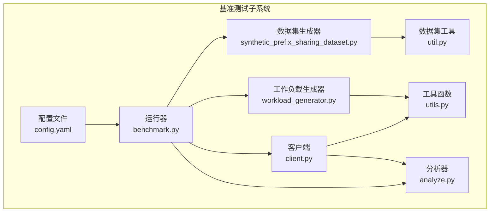
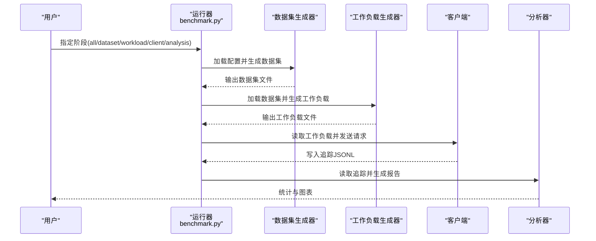
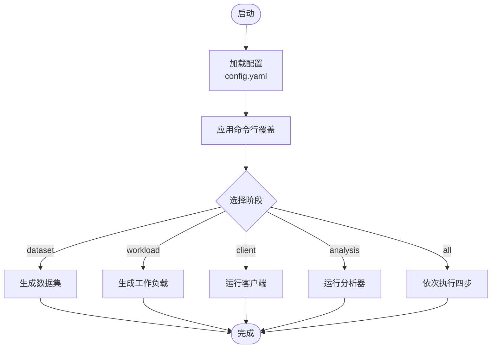
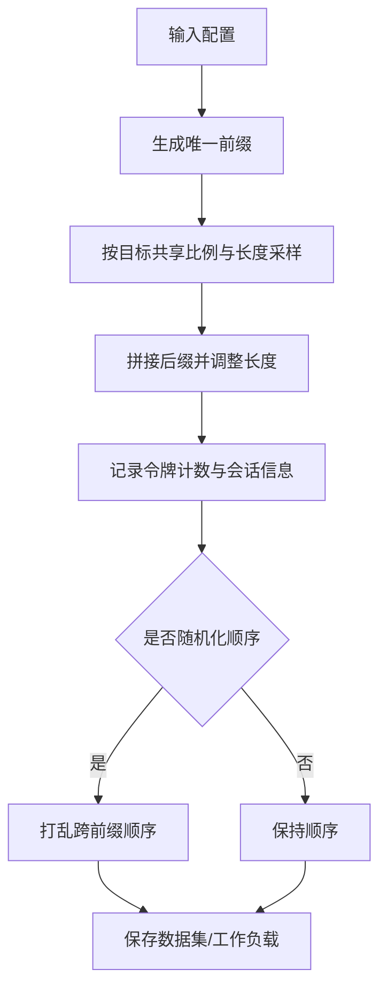
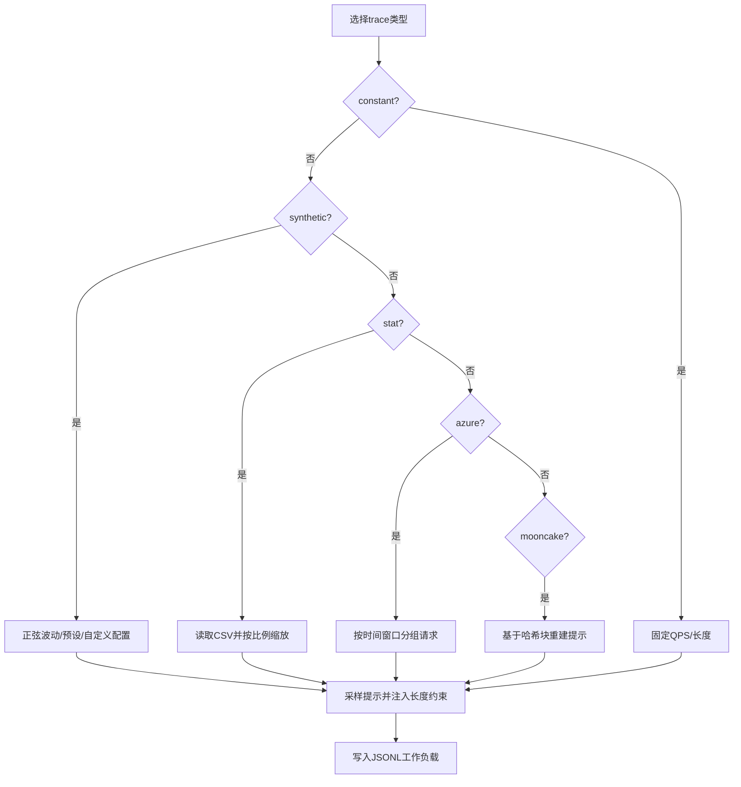
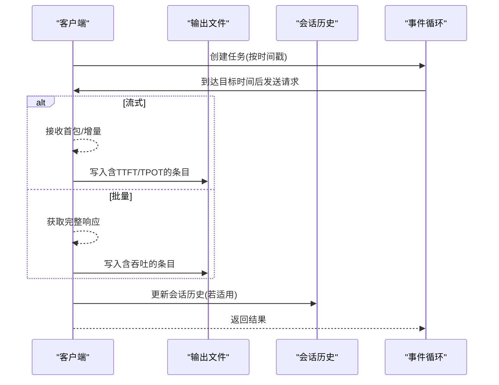
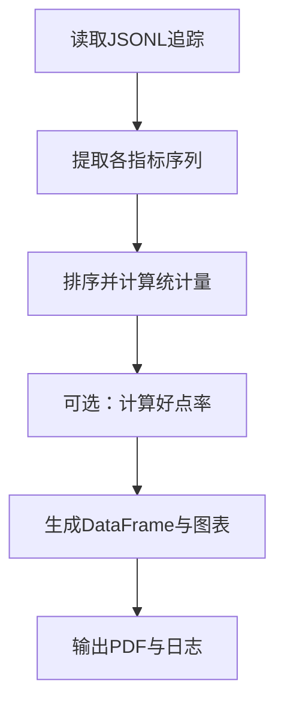
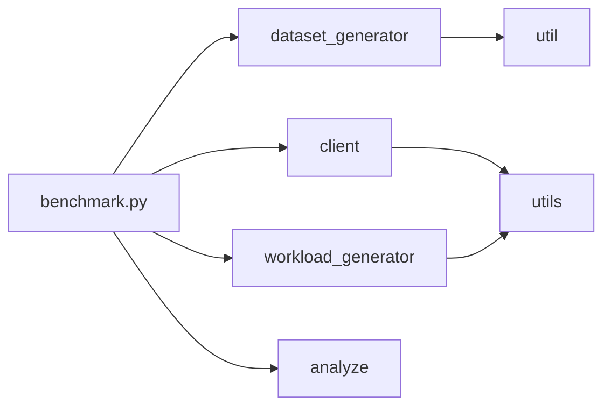

# 基准测试系统

<cite>
**本文引用的文件**   
- [benchmarks/README.md](file://benchmarks/README.md)
- [benchmarks/benchmark.py](file://benchmarks/benchmark.py)
- [benchmarks/config.yaml](file://benchmarks/config.yaml)
- [benchmarks/client/client.py](file://benchmarks/client/client.py)
- [benchmarks/client/analyze.py](file://benchmarks/client/analyze.py)
- [benchmarks/client/utils.py](file://benchmarks/client/utils.py)
- [benchmarks/generator/dataset_generator/synthetic_prefix_sharing_dataset.py](file://benchmarks/generator/dataset_generator/synthetic_prefix_sharing_dataset.py)
- [benchmarks/generator/dataset_generator/util.py](file://benchmarks/generator/dataset_generator/util.py)
- [benchmarks/generator/workload_generator/workload_generator.py](file://benchmarks/generator/workload_generator/workload_generator.py)
- [benchmarks/scenarios/autoscaling/run-test.sh](file://benchmarks/scenarios/autoscaling/run-test.sh)
- [benchmarks/scenarios/autoscaling/workload-configs/predefined/traffic-configs/HighSlow.json](file://benchmarks/scenarios/autoscaling/workload-configs/predefined/traffic-configs/HighSlow.json)
- [benchmarks/scenarios/autoscaling/workload-configs/predefined/prompt-len-configs/HighSlow.json](file://benchmarks/scenarios/autoscaling/workload-configs/predefined/prompt-len-configs/HighSlow.json)
</cite>

## 目录
1. [引言](#引言)
2. [项目结构](#项目结构)
3. [核心组件](#核心组件)
4. [架构总览](#架构总览)
5. [详细组件分析](#详细组件分析)
6. [依赖关系分析](#依赖关系分析)
7. [性能考量](#性能考量)
8. [故障排查指南](#故障排查指南)
9. [结论](#结论)
10. [附录](#附录)

## 引言
本技术文档面向AIBrix基准测试系统，围绕测试框架、测试生成器与负载生成器等核心模块，系统阐述端到端的性能测试方法（吞吐量、延迟、并发等），并深入解析工作负载生成、流量模式配置与压力测试策略。同时，文档覆盖回归测试自动化流程（测试结果对比、性能基线维护、异常检测）以及测试场景定制化指南（自定义配置、扩展场景、集成第三方工具），并提供测试结果分析、性能报告生成与测试环境优化建议。

## 项目结构
基准测试子系统位于benchmarks目录，包含以下关键子模块：
- 配置与入口：config.yaml、benchmark.py
- 数据集生成器：synthetic_prefix_sharing_dataset.py、util.py
- 工作负载生成器：workload_generator.py 及其工具模块
- 客户端与分析：client.py、analyze.py、utils.py
- 场景与脚本：autoscaling场景、run-test.sh、预设流量配置

图示来源
- [benchmarks/benchmark.py:43-370](file://benchmarks/benchmark.py#L43-L370)
- [benchmarks/config.yaml:1-114](file://benchmarks/config.yaml#L1-L114)
- [benchmarks/generator/dataset_generator/synthetic_prefix_sharing_dataset.py:558-629](file://benchmarks/generator/dataset_generator/synthetic_prefix_sharing_dataset.py#L558-L629)
- [benchmarks/generator/workload_generator/workload_generator.py:421-571](file://benchmarks/generator/workload_generator/workload_generator.py#L421-L571)
- [benchmarks/client/client.py:437-490](file://benchmarks/client/client.py#L437-L490)
- [benchmarks/client/analyze.py:21-163](file://benchmarks/client/analyze.py#L21-L163)
- [benchmarks/client/utils.py:1-96](file://benchmarks/client/utils.py#L1-L96)
- [benchmarks/generator/dataset_generator/util.py:1-30](file://benchmarks/generator/dataset_generator/util.py#L1-L30)

章节来源
- [benchmarks/README.md:1-431](file://benchmarks/README.md#L1-L431)
- [benchmarks/benchmark.py:1-370](file://benchmarks/benchmark.py#L1-L370)
- [benchmarks/config.yaml:1-114](file://benchmarks/config.yaml#L1-L114)

## 核心组件
- 运行器BenchmarkRunner：统一加载配置、按阶段执行数据集生成、工作负载生成、客户端调度与分析；支持命令行覆盖参数与模板变量解析。
- 数据集生成器：基于分段共享前缀与多轮对话的合成数据生成，支持统计分布控制与会话格式输出。
- 工作负载生成器：支持恒定/合成波动/统计驱动/真实Trace（Azure/Mooncake）等多种模式，可配置并发会话上限与时间尺度缩放。
- 客户端：OpenAI兼容异步客户端，支持流式/批量两种模式，内建会话历史管理、目标时间触发、并发会话限制与超时/重试策略。
- 分析器：从JSONL追踪中提取端到端延迟、吞吐、TTFT/TPOT、错误率等指标，并生成时间序列图表与统计摘要。

章节来源
- [benchmarks/benchmark.py:43-370](file://benchmarks/benchmark.py#L43-L370)
- [benchmarks/generator/dataset_generator/synthetic_prefix_sharing_dataset.py:16-450](file://benchmarks/generator/dataset_generator/synthetic_prefix_sharing_dataset.py#L16-L450)
- [benchmarks/generator/workload_generator/workload_generator.py:97-520](file://benchmarks/generator/workload_generator/workload_generator.py#L97-L520)
- [benchmarks/client/client.py:21-490](file://benchmarks/client/client.py#L21-L490)
- [benchmarks/client/analyze.py:21-163](file://benchmarks/client/analyze.py#L21-L163)

## 架构总览
下图展示从配置到分析的端到端流程，突出各组件职责与交互：

图示来源
- [benchmarks/benchmark.py:96-331](file://benchmarks/benchmark.py#L96-L331)
- [benchmarks/client/client.py:437-490](file://benchmarks/client/client.py#L437-L490)
- [benchmarks/client/analyze.py:21-163](file://benchmarks/client/analyze.py#L21-L163)

## 详细组件分析

### 运行器与配置系统
- 配置加载与覆盖：支持模板变量替换、嵌套键覆盖、命令行override、帮助打印。
- 阶段化执行：dataset/workload/client/analysis/all，确保中间产物可复用。
- 环境准备：自动创建输出目录，处理API密钥占位符。

图示来源
- [benchmarks/benchmark.py:43-370](file://benchmarks/benchmark.py#L43-L370)
- [benchmarks/config.yaml:1-114](file://benchmarks/config.yaml#L1-L114)

章节来源
- [benchmarks/benchmark.py:43-110](file://benchmarks/benchmark.py#L43-L110)
- [benchmarks/config.yaml:1-114](file://benchmarks/config.yaml#L1-L114)

### 数据集生成器（分段共享与多轮）
- 合成数据：控制前缀共享比例、提示长度均值与标准差、每前缀样本数与前缀数。
- 多轮会话：按会话ID组织提示序列，支持随机化顺序以模拟真实对话。
- 统计度量：计算前缀共享比例与整体效率节省，输出统计数据与JSONL数据集。

图示来源
- [benchmarks/generator/dataset_generator/synthetic_prefix_sharing_dataset.py:16-450](file://benchmarks/generator/dataset_generator/synthetic_prefix_sharing_dataset.py#L16-L450)
- [benchmarks/generator/dataset_generator/util.py:1-30](file://benchmarks/generator/dataset_generator/util.py#L1-L30)

章节来源
- [benchmarks/generator/dataset_generator/synthetic_prefix_sharing_dataset.py:558-629](file://benchmarks/generator/dataset_generator/synthetic_prefix_sharing_dataset.py#L558-L629)
- [benchmarks/generator/dataset_generator/util.py:1-30](file://benchmarks/generator/dataset_generator/util.py#L1-L30)

### 工作负载生成器（多模式与并发控制）
- 模式支持：constant、synthetic、stat、azure、mooncake。
- 合成波动：基于正弦波动与预设/自定义模式配置，控制QPS与输入/输出长度分布。
- 统计驱动：从CSV读取到达时间、输入/输出长度分位数，按比例缩放生成。
- 并发会话：对会话式数据集进行最大并发会话限制，避免资源过载。
- 时间尺度：支持逻辑时间缩放以压缩/扩展请求间隔。

图示来源
- [benchmarks/generator/workload_generator/workload_generator.py:97-520](file://benchmarks/generator/workload_generator/workload_generator.py#L97-L520)

章节来源
- [benchmarks/generator/workload_generator/workload_generator.py:421-571](file://benchmarks/generator/workload_generator/workload_generator.py#L421-L571)

### 客户端（流式/批量、会话与并发）
- 流式模式：支持TTFT/TPOT等细粒度指标，边流式接收边统计。
- 批量模式：一次性获取完整响应，适合高吞吐批处理。
- 会话管理：线程安全的历史缓存与锁，支持会话级并发上限。
- 调度与限速：按目标时间戳触发请求，支持全局时序缩放、超时与重试。
- 路由策略：通过默认头部设置路由策略。

图示来源
- [benchmarks/client/client.py:21-490](file://benchmarks/client/client.py#L21-L490)
- [benchmarks/client/utils.py:1-96](file://benchmarks/client/utils.py#L1-L96)

章节来源
- [benchmarks/client/client.py:264-490](file://benchmarks/client/client.py#L264-L490)
- [benchmarks/client/utils.py:1-96](file://benchmarks/client/utils.py#L1-L96)

### 分析器（指标提取与报告）
- 指标：端到端延迟、吞吐、Token/s、TTFT、TPOT、错误数、总时长、总Token数。
- 好点率：按阈值计算满足目标的请求数占比（e2e/ttft/tpot）。
- 可视化：时间序列折线图，便于观察趋势与异常。

图示来源
- [benchmarks/client/analyze.py:21-163](file://benchmarks/client/analyze.py#L21-L163)

章节来源
- [benchmarks/client/analyze.py:21-163](file://benchmarks/client/analyze.py#L21-L163)

### 自动化回归与场景定制
- 自动化脚本：autoscaling场景脚本演示了从部署、端口转发、监控到实验执行的完整流水线。
- 预设配置：提供HighSlow/LowFast等流量/长度配置，便于快速切换。
- 扩展点：可在配置中指定不同的工作负载类型与参数，或在客户端侧增加路由策略与限流策略。

章节来源
- [benchmarks/scenarios/autoscaling/run-test.sh:1-157](file://benchmarks/scenarios/autoscaling/run-test.sh#L1-L157)
- [benchmarks/scenarios/autoscaling/workload-configs/predefined/traffic-configs/HighSlow.json:1-7](file://benchmarks/scenarios/autoscaling/workload-configs/predefined/traffic-configs/HighSlow.json#L1-L7)
- [benchmarks/scenarios/autoscaling/workload-configs/predefined/prompt-len-configs/HighSlow.json:1-7](file://benchmarks/scenarios/autoscaling/workload-configs/predefined/prompt-len-configs/HighSlow.json#L1-L7)

## 依赖关系分析
- 组件耦合
  - 运行器对各子模块存在直接调用关系，耦合度适中，职责清晰。
  - 客户端与分析器依赖输出文件格式，需与客户端写入保持一致。
- 外部依赖
  - OpenAI兼容SDK用于请求发送与流式处理。
  - pandas/numpy用于统计与分布生成。
  - matplotlib/pandas用于可视化。
- 潜在环路
  - 无直接循环导入；数据单向流动：配置→生成→调度→分析。

图示来源
- [benchmarks/benchmark.py:1-15](file://benchmarks/benchmark.py#L1-L15)
- [benchmarks/client/client.py:13-13](file://benchmarks/client/client.py#L13-L13)
- [benchmarks/generator/workload_generator/workload_generator.py:12-31](file://benchmarks/generator/workload_generator/workload_generator.py#L12-L31)
- [benchmarks/generator/dataset_generator/synthetic_prefix_sharing_dataset.py:11-12](file://benchmarks/generator/dataset_generator/synthetic_prefix_sharing_dataset.py#L11-L12)

章节来源
- [benchmarks/benchmark.py:1-15](file://benchmarks/benchmark.py#L1-L15)
- [benchmarks/client/client.py:13-13](file://benchmarks/client/client.py#L13-L13)
- [benchmarks/generator/workload_generator/workload_generator.py:12-31](file://benchmarks/generator/workload_generator/workload_generator.py#L12-L31)
- [benchmarks/generator/dataset_generator/synthetic_prefix_sharing_dataset.py:11-12](file://benchmarks/generator/dataset_generator/synthetic_prefix_sharing_dataset.py#L11-L12)

## 性能考量
- 吞吐量测试
  - 使用批量模式与高并发会话上限，结合时间尺度缩放快速压测。
  - 关注端到端延迟与吞吐的平衡，避免过早触发限流。
- 延迟测试
  - 流式模式采集TTFT/TPOT，关注99分位延迟与抖动。
  - 对比不同路由策略与模型部署配置下的延迟差异。
- 并发测试
  - 通过max_concurrent_sessions限制会话并发，逐步加压观察系统拐点。
  - 结合Pod数量变化（autoscaling场景）评估弹性伸缩效果。
- 资源与稳定性
  - 控制输出Token上限与超时，防止长时间悬挂任务。
  - 合理设置重试次数，避免放大流量峰值。

## 故障排查指南
- 常见问题
  - API密钥未设置：运行器会将占位符视为None并警告，需在环境中正确设置。
  - 端口转发失败：确认K8s服务名称与命名空间正确，确保8888端口可用。
  - 工作负载过大导致内存/连接压力：降低并发会话上限或缩短持续时间。
- 日志与定位
  - 客户端异常会写入错误字段与堆栈，便于定位具体请求。
  - 分析器输出统计摘要，可快速识别异常批次。
- 清理与回滚
  - 自动化脚本提供清理流程，包括删除HPA/PodAutoscaler、停止监控进程与端口转发。

章节来源
- [benchmarks/benchmark.py:285-320](file://benchmarks/benchmark.py#L285-L320)
- [benchmarks/client/client.py:131-160](file://benchmarks/client/client.py#L131-L160)
- [benchmarks/client/analyze.py:112-121](file://benchmarks/client/analyze.py#L112-L121)
- [benchmarks/scenarios/autoscaling/run-test.sh:142-157](file://benchmarks/scenarios/autoscaling/run-test.sh#L142-L157)

## 结论
AIBrix基准测试系统通过“配置驱动+模块化组件”的方式，实现了从数据集到工作负载、从客户端调度到分析报告的全链路自动化。系统支持多种工作负载模式与并发控制策略，能够覆盖吞吐、延迟与并发等关键性能维度，并提供可扩展的场景定制能力与回归测试流程。建议在实际使用中结合业务流量特征选择合适的工作负载类型与参数，并配合可视化与统计指标进行持续观测与优化。

## 附录
- 快速开始
  - 安装依赖并设置环境变量后，使用--stage all一键执行全流程。
  - 通过--override覆盖任意配置项，支持嵌套键访问。
- 配置要点
  - 数据集：选择合成/转换类型，控制前缀共享比例与长度分布。
  - 工作负载：选择模式与参数，设置并发会话上限与时间缩放。
  - 客户端：启用流式以获取TTFT/TPOT，设置路由策略与超时重试。
  - 分析：设定好点率阈值，生成时间序列图表辅助定位。

章节来源
- [benchmarks/README.md:50-431](file://benchmarks/README.md#L50-L431)
- [benchmarks/config.yaml:1-114](file://benchmarks/config.yaml#L1-L114)
- [benchmarks/benchmark.py:16-71](file://benchmarks/benchmark.py#L16-L71)