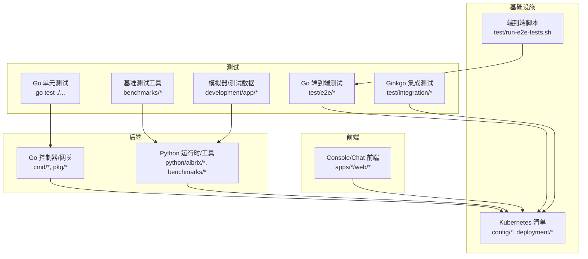
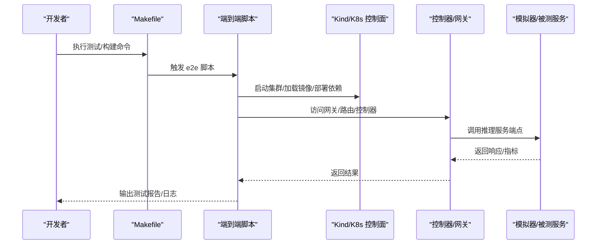
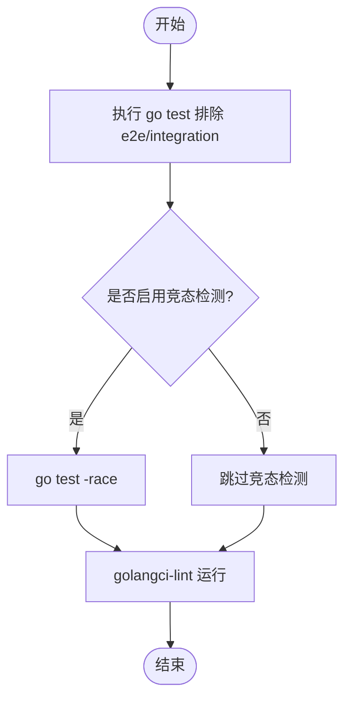
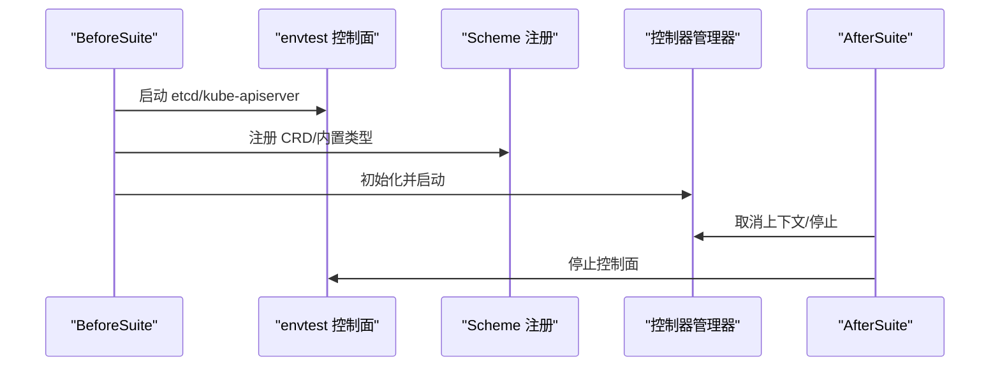
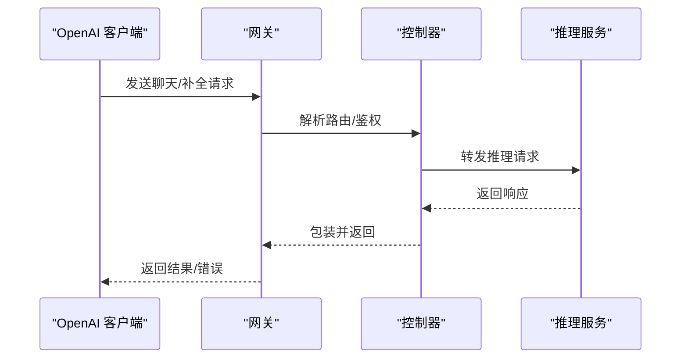
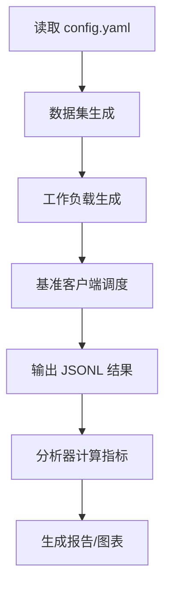
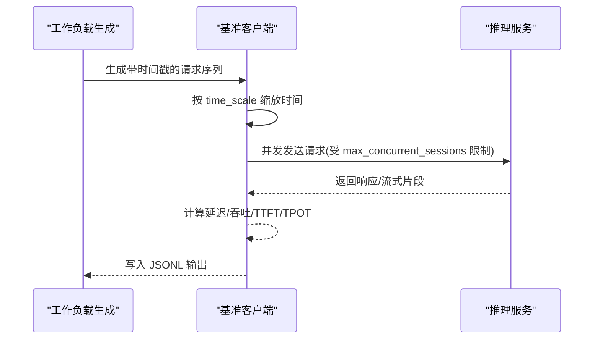
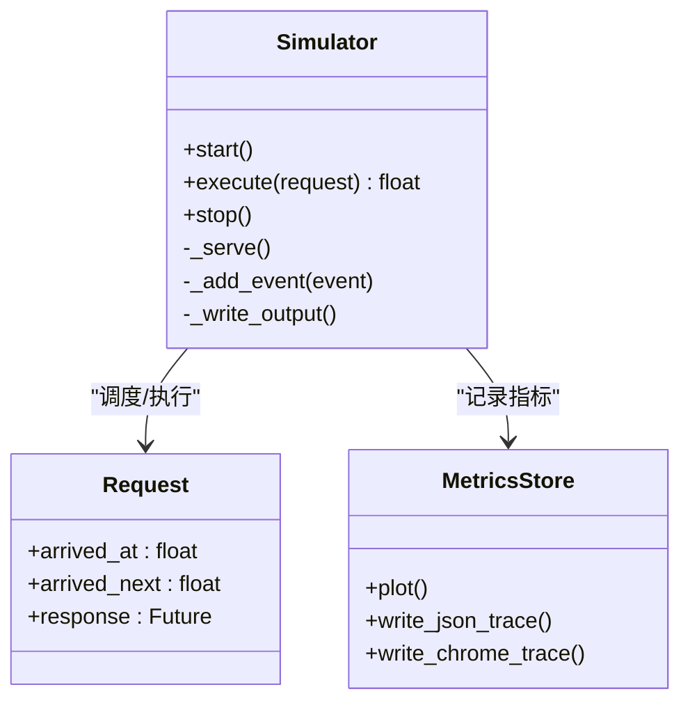
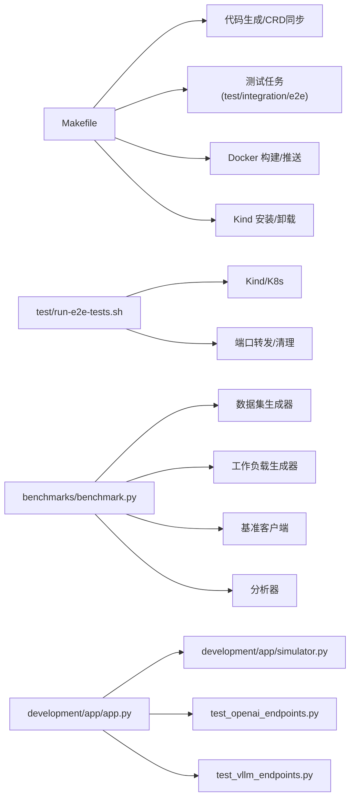

# 开发与测试

<cite>
**本文引用的文件**
- [README.md](file://README.md)
- [Makefile](file://Makefile)
- [.golangci.yml](file://.golangci.yml)
- [test/run-e2e-tests.sh](file://test/run-e2e-tests.sh)
- [test/e2e/e2e_test.go](file://test/e2e/e2e_test.go)
- [test/integration/controller/suit_test.go](file://test/integration/controller/suit_test.go)
- [benchmarks/README.md](file://benchmarks/README.md)
- [benchmarks/benchmark.py](file://benchmarks/benchmark.py)
- [benchmarks/client/client.py](file://benchmarks/client/client.py)
- [development/app/README.md](file://development/app/README.md)
- [development/app/app.py](file://development/app/app.py)
- [development/app/simulator.py](file://development/app/simulator.py)
- [development/app/test_openai_endpoints.py](file://development/app/test_openai_endpoints.py)
- [development/app/test_vllm_endpoints.py](file://development/app/test_vllm_endpoints.py)
- [python/aibrix/pyproject.toml](file://python/aibrix/pyproject.toml)
</cite>

## 目录
1. [简介](#简介)
2. [项目结构](#项目结构)
3. [核心组件](#核心组件)
4. [架构总览](#架构总览)
5. [详细组件分析](#详细组件分析)
6. [依赖关系分析](#依赖关系分析)
7. [性能考虑](#性能考虑)
8. [故障排查指南](#故障排查指南)
9. [结论](#结论)
10. [附录](#附录)

## 简介
本文件面向AIBrix项目的开发与测试团队，系统性阐述开发环境搭建、本地调试、IDE配置、测试体系（单元、集成、端到端）、基准测试（性能/负载/回归）设计与使用、开发工具链（格式化/静态分析/CI/CD）以及模拟器与测试数据准备等实践。目标是帮助新成员快速上手并高效开展功能开发与质量保障工作。

## 项目结构
AIBrix采用多语言混合工程：Go用于控制器与网关插件、Python用于运行时服务与基准工具、前端在apps目录下、Kubernetes清单通过kustomize管理。测试覆盖Go e2e与Ginkgo集成测试、Python基准工具链、以及本地模拟器与端到端脚本。

图示来源
- [Makefile:138-170](file://Makefile#L138-L170)
- [test/run-e2e-tests.sh:142-148](file://test/run-e2e-tests.sh#L142-L148)
- [benchmarks/benchmark.py:353-370](file://benchmarks/benchmark.py#L353-L370)
- [development/app/README.md:1-120](file://development/app/README.md#L1-L120)

章节来源
- [README.md:1-90](file://README.md#L1-L90)
- [Makefile:138-170](file://Makefile#L138-L170)

## 核心组件
- 开发工具链与构建
  - Makefile提供统一入口：代码生成、CRD同步、Go测试、Lint、Docker镜像构建与推送、Kind一键安装等。
  - .golangci.yml定义Go静态检查规则集。
- 测试体系
  - 单元测试：Go标准库go test覆盖非e2e模块。
  - 集成测试：Ginkgo在envtest控制面中验证控制器逻辑。
  - 端到端测试：Go e2e结合OpenAI SDK验证网关与推理服务连通性。
- 基准测试系统
  - Python基准工具链：数据集生成、工作负载生成、客户端调度、分析输出。
- 模拟器与测试数据
  - development/app提供本地Flask服务、OpenAI兼容端点、vLLM端点、LoRA适配器管理、指标导出等；支持基于Vidur的高保真仿真。

章节来源
- [Makefile:59-170](file://Makefile#L59-L170)
- [.golangci.yml:1-45](file://.golangci.yml#L1-L45)
- [test/e2e/e2e_test.go:30-60](file://test/e2e/e2e_test.go#L30-L60)
- [test/integration/controller/suit_test.go:83-169](file://test/integration/controller/suit_test.go#L83-L169)
- [benchmarks/README.md:1-120](file://benchmarks/README.md#L1-L120)
- [development/app/README.md:1-120](file://development/app/README.md#L1-L120)

## 架构总览
下图展示从开发者到Kubernetes集群的测试与验证路径，以及基准测试工具链的数据流。

图示来源
- [Makefile:344-420](file://Makefile#L344-L420)
- [test/run-e2e-tests.sh:32-71](file://test/run-e2e-tests.sh#L32-L71)
- [test/e2e/e2e_test.go:30-60](file://test/e2e/e2e_test.go#L30-L60)

## 详细组件分析

### 开发环境与本地调试
- 代码生成与CRD
  - 使用controller-gen生成RBAC/CRD/Webhook，再同步至模块目录与Helm chart。
  - 提供verify任务校验代码生成一致性。
- 本地Kubernetes环境
  - Makefile提供dev-install-in-kind与dev-uninstall-from-kind，一键拉起/卸载AIBrix与监控组件，并加载镜像。
  - test/run-e2e-tests.sh支持自动创建Kind集群、安装依赖、加载镜像、端口转发与清理。
- IDE与编辑器
  - Go：建议启用gopls、goimports、gofumpt或go fmt；配合golangci-lint。
  - Python：Poetry管理依赖，Ruff负责格式化与静态检查，pytest运行测试。
- 环境变量与端口转发
  - Makefile提供dev-port-forward与dev-stop-port-forward，便于本地联调。

章节来源
- [Makefile:71-129](file://Makefile#L71-L129)
- [Makefile:344-420](file://Makefile#L344-L420)
- [test/run-e2e-tests.sh:32-71](file://test/run-e2e-tests.sh#L32-L71)

### 测试体系

#### 单元测试（Go）
- 目标：验证包内逻辑正确性，避免e2e/集成干扰。
- 命令：make test（排除e2e与integration），可选make test-race-condition启用竞态检测。
- 质量门禁：fmt、vet、golangci-lint。

图示来源
- [Makefile:138-170](file://Makefile#L138-L170)
- [.golangci.yml:23-45](file://.golangci.yml#L23-L45)

章节来源
- [Makefile:138-170](file://Makefile#L138-L170)
- [.golangci.yml:1-45](file://.golangci.yml#L1-L45)

#### 集成测试（Ginkgo）
- 目标：在envtest控制面中验证控制器生命周期、Webhook与资源协调。
- 关键点：BeforeSuite启动控制面、注册scheme、初始化缓存层、启动控制器管理器；AfterSuite清理。
- 覆盖范围：控制器套件、Webhook套件、PodAutoscaler/StormService等。

图示来源
- [test/integration/controller/suit_test.go:83-169](file://test/integration/controller/suit_test.go#L83-L169)

章节来源
- [test/integration/controller/suit_test.go:1-190](file://test/integration/controller/suit_test.go#L1-L190)

#### 端到端测试（Go + OpenAI SDK）
- 目标：验证网关到推理服务的完整链路，包含错误场景与路由策略。
- 关键点：使用OpenAI SDK发起补全/聊天请求，断言模型名、用量、错误码等。
- 脚本：test/run-e2e-tests.sh负责集群准备、端口转发、运行go test ./test/e2e/。

图示来源
- [test/e2e/e2e_test.go:30-60](file://test/e2e/e2e_test.go#L30-L60)
- [test/run-e2e-tests.sh:142-148](file://test/run-e2e-tests.sh#L142-L148)

章节来源
- [test/e2e/e2e_test.go:1-122](file://test/e2e/e2e_test.go#L1-L122)
- [test/run-e2e-tests.sh:1-149](file://test/run-e2e-tests.sh#L1-L149)

### 基准测试系统

#### 设计与流程
- 组件：数据集生成、工作负载生成、基准客户端、分析器。
- 配置：config.yaml集中管理数据集类型、工作负载模式、客户端参数、分析阈值等。
- 流程：dataset → workload → client → analysis，支持全链路或分步执行。

图示来源
- [benchmarks/README.md:50-120](file://benchmarks/README.md#L50-L120)
- [benchmarks/benchmark.py:96-331](file://benchmarks/benchmark.py#L96-L331)

章节来源
- [benchmarks/README.md:1-431](file://benchmarks/README.md#L1-L431)
- [benchmarks/benchmark.py:1-370](file://benchmarks/benchmark.py#L1-L370)

#### 工作负载调度与并发控制
- 支持会话化工作负载与并发会话上限控制，按时间戳缩放与超时限制。
- 客户端支持批量与流式两种模式，流式模式可采集TTFT/TPOT等细粒度指标。

图示来源
- [benchmarks/client/client.py:264-435](file://benchmarks/client/client.py#L264-L435)

章节来源
- [benchmarks/client/client.py:1-490](file://benchmarks/client/client.py#L1-L490)

### 模拟器与测试数据

#### 模拟器（Vidur）
- 功能：基于事件驱动的仿真引擎，支持请求到达、调度、批处理历史记录与指标写入。
- 使用：development/app/simulator.py封装异步事件循环与队列，支持多线程安全。

图示来源
- [development/app/simulator.py:22-219](file://development/app/simulator.py#L22-L219)

章节来源
- [development/app/simulator.py:1-219](file://development/app/simulator.py#L1-L219)

#### 本地Flask服务与端点
- 兼容OpenAI接口：/v1/models、/v1/chat/completions、/v1/completions、/v1/embeddings、/v1/audio/*、/v1/images/* 等。
- vLLM特有端点：/v1/load_lora_adapter、/v1/unload_lora_adapter、/tokenize、/detokenize、/load、/version、/metrics。
- 健康检查：/health、/ready、/ping。

章节来源
- [development/app/README.md:139-173](file://development/app/README.md#L139-L173)
- [development/app/app.py:360-800](file://development/app/app.py#L360-L800)

#### 自动化测试脚本
- OpenAI SDK兼容测试：development/app/test_openai_endpoints.py，覆盖非流式/流式/含usage流式/错误处理。
- vLLM端点测试：development/app/test_vllm_endpoints.py，覆盖健康/LoRA/分词/反分词/服务器负载/指标。

章节来源
- [development/app/test_openai_endpoints.py:1-389](file://development/app/test_openai_endpoints.py#L1-L389)
- [development/app/test_vllm_endpoints.py:1-419](file://development/app/test_vllm_endpoints.py#L1-L419)

### Python工具链与格式化/静态分析
- Poetry管理：依赖、脚本入口、dev/profiling分组。
- Ruff：格式化与lint规则，双引号、docstring代码块格式化、可修复规则。
- Mypy：忽略缺失导入的宽松模式。
- Pytest：默认fixture循环作用域与告警过滤。

章节来源
- [python/aibrix/pyproject.toml:112-138](file://python/aibrix/pyproject.toml#L112-L138)

## 依赖关系分析

图示来源
- [Makefile:71-129](file://Makefile#L71-L129)
- [test/run-e2e-tests.sh:73-121](file://test/run-e2e-tests.sh#L73-L121)
- [benchmarks/benchmark.py:96-331](file://benchmarks/benchmark.py#L96-L331)
- [development/app/app.py:1-200](file://development/app/app.py#L1-L200)

章节来源
- [Makefile:1-527](file://Makefile#L1-L527)
- [test/run-e2e-tests.sh:1-149](file://test/run-e2e-tests.sh#L1-L149)
- [benchmarks/benchmark.py:1-370](file://benchmarks/benchmark.py#L1-L370)
- [development/app/app.py:1-2173](file://development/app/app.py#L1-L2173)

## 性能考虑
- 并发与限流
  - 基准客户端支持最大并发会话数限制与持续时长限制，避免压测对集群造成不可控冲击。
- 指标采集
  - 流式客户端可采集TTFT/TPOT，便于精细化性能分析；Prometheus指标可通过/metrics暴露。
- 资源伸缩
  - 通过模拟器/指标反比关系验证自动扩缩容策略的有效性（副本数增加时指标下降）。

章节来源
- [benchmarks/client/client.py:286-435](file://benchmarks/client/client.py#L286-L435)
- [development/app/README.md:217-285](file://development/app/README.md#L217-L285)

## 故障排查指南
- 端到端失败
  - 使用test/run-e2e-tests.sh提供的日志收集与清理逻辑，检查aibrix-system命名空间Pod状态与日志。
  - 确认端口转发是否成功（Envoy/Redis/Prometheus/Grafana）。
- 控制器集成测试失败
  - 关注envtest控制面启动日志、CRD注册与控制器管理器启动；确认BeforeSuite/AfterSuite生命周期。
- 基准测试异常
  - 检查config.yaml参数（endpoint/api_key/target_model等），确保KUBECONFIG与端口转发已就绪。
- 本地Flask服务问题
  - 使用development/app/test_openai_endpoints.py与test_vllm_endpoints.py进行端到端自检，定位具体端点。

章节来源
- [test/run-e2e-tests.sh:122-134](file://test/run-e2e-tests.sh#L122-L134)
- [test/integration/controller/suit_test.go:171-189](file://test/integration/controller/suit_test.go#L171-L189)
- [development/app/test_openai_endpoints.py:323-367](file://development/app/test_openai_endpoints.py#L323-L367)
- [development/app/test_vllm_endpoints.py:358-400](file://development/app/test_vllm_endpoints.py#L358-L400)

## 结论
AIBrix提供了完善的开发与测试基础设施：统一的Makefile工具链、严格的Go静态检查、覆盖单元/集成/端到端的测试矩阵、可扩展的Python基准工具链，以及高保真的模拟器与测试数据准备方案。遵循本文档的步骤与最佳实践，可显著提升开发效率与交付质量。

## 附录

### 快速操作清单
- 本地开发
  - 安装依赖：pip install -r requirements.txt（或requirements-simulator.txt）
  - 启动模拟器：STANDALONE_MODE=true python app.py
  - 运行OpenAI兼容测试：python test_openai_endpoints.py
  - 运行vLLM端点测试：python test_vllm_endpoints.py
- 端到端测试
  - 一键安装Kind与AIBrix：make dev-install-in-kind
  - 运行e2e：make test-e2e 或 ./test/run-e2e-tests.sh
  - 清理：make dev-uninstall-from-kind
- 基准测试
  - 准备环境变量与端口转发，运行python benchmark.py --stage all --config config.yaml
- 代码质量
  - Go：make fmt vet lint test
  - Python：ruff check/format --check mypy pytest

章节来源
- [development/app/README.md:10-120](file://development/app/README.md#L10-L120)
- [Makefile:138-170](file://Makefile#L138-L170)
- [test/run-e2e-tests.sh:1-149](file://test/run-e2e-tests.sh#L1-L149)
- [benchmarks/README.md:50-120](file://benchmarks/README.md#L50-L120)
- [python/aibrix/pyproject.toml:112-138](file://python/aibrix/pyproject.toml#L112-L138)